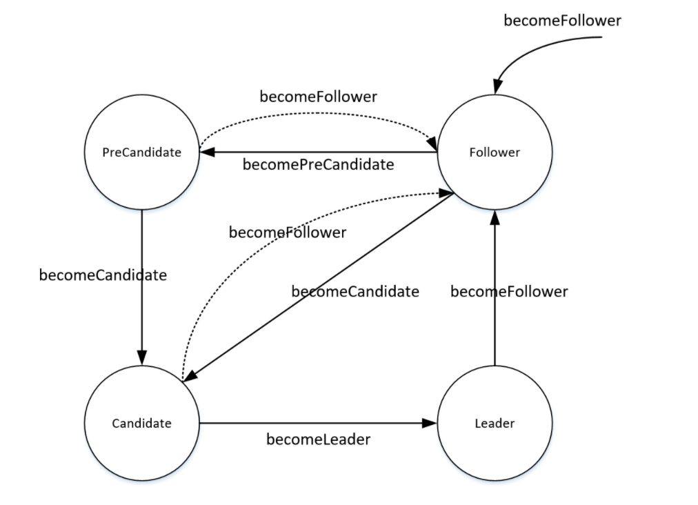
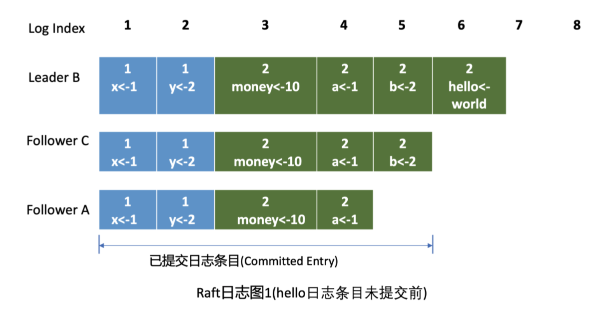
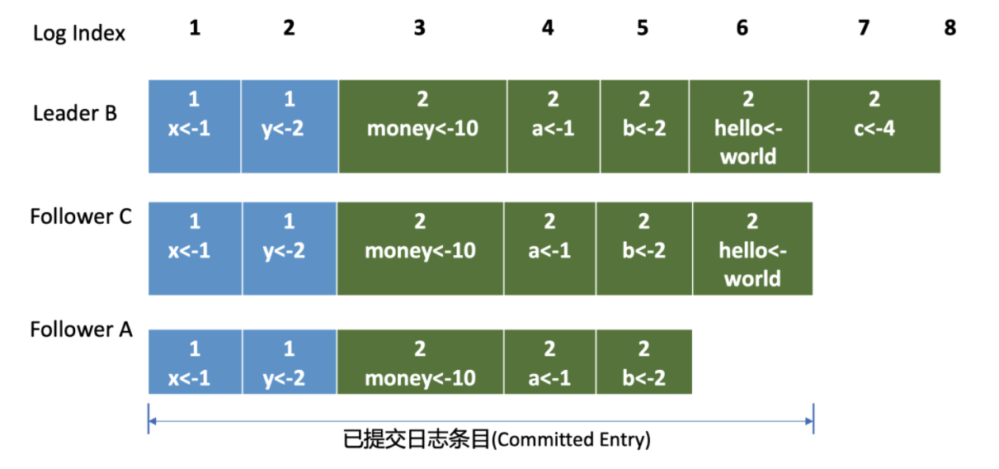
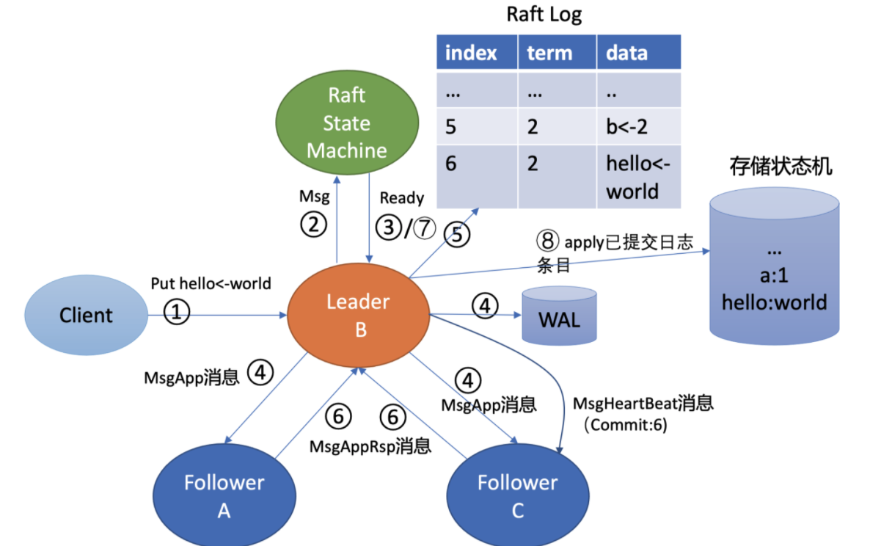

- [Consensus algorithm](#consensus-algorithm)
  - [Implementation within popular frameworks](#implementation-within-popular-frameworks)
  - [Paxos](#paxos)
  - [ZAB](#zab)
  - [Gossip](#gossip)
    - [History](#history)
    - [Vector clock](#vector-clock)
    - [Gossip protocol demo](#gossip-protocol-demo)
  - [Raft](#raft)
    - [Replicated state machine model](#replicated-state-machine-model)
      - [Roles](#roles)
    - [Leader election](#leader-election)
      - [PreVote algorithm](#prevote-algorithm)
      - [RPC based node communication](#rpc-based-node-communication)
      - [Term](#term)
      - [Random time](#random-time)
    - [Log replication](#log-replication)
      - [From which location to send log entries to follower](#from-which-location-to-send-log-entries-to-follower)
      - [When will log entry be committed to Raft log](#when-will-log-entry-be-committed-to-raft-log)
      - [Raft replication performance cons](#raft-replication-performance-cons)
      - [Raft single transaction replication process](#raft-single-transaction-replication-process)
      - [Raft multiple transaction replication process](#raft-multiple-transaction-replication-process)
      - [Ways to optimize Raft replication performance](#ways-to-optimize-raft-replication-performance)
    - [Raft protocol demo](#raft-protocol-demo)

# Consensus algorithm
## Implementation within popular frameworks

* The acronyms under usage patterns stand for server replication (SR), log replication (LR), synchronisation service (SS), barrier orchestration (BO), service discovery (SD), leader election (LE), metadata management (MM), and Message Queues (Q).
* References: https://blog.container-solutions.com/raft-explained-part-1-the-consenus-problem

## Paxos
* [Paxos Made Live - An Engineering Perspective](https://static.googleusercontent.com/media/research.google.com/en//archive/paxos_made_live.pdf)
* [Net algorithms](http://harry.me/blog/2014/12/27/neat-algorithms-paxos/)

## ZAB
* Consistency algorithm: ZAB algorithm
* To build the lock, we'll create a persistent znode that will serve as the parent. Clients wishing to obtain the lock will create sequential, ephemeral child znodes under the parent znode. The lock is owned by the client process whose child znode has the lowest sequence number. In Figure 2, there are three children of the lock-node and child-1 owns the lock at this point in time, since it has the lowest sequence number. After child-1 is removed, the lock is relinquished and then the client who owns child-2 owns the lock, and so on.
* The algorithm for clients to determine if they own the lock is straightforward, on the surface anyway. A client creates a new sequential ephemeral znode under the parent lock znode. The client then gets the children of the lock node and sets a watch on the lock node. If the child znode that the client created has the lowest sequence number, then the lock is acquired, and it can perform whatever actions are necessary with the resource that the lock is protecting. If the child znode it created does not have the lowest sequence number, then wait for the watch to trigger a watch event, then perform the same logic of getting the children, setting a watch, and checking for lock acquisition via the lowest sequence number. The client continues this process until the lock is acquired.
* Reference: https://nofluffjuststuff.com/blog/scott_leberknight/2013/07/distributed_coordination_with_zookeeper_part_5_building_a_distributed_lock

## Gossip
### History 
* [Amazon Dynamo DB](http://bnrg.eecs.berkeley.edu/~randy/Courses/CS294.F07/Dynamo.pdf)
* Within this paper, it introduces two concepts vector clock and gossip. 

### Vector clock
* Vector clock: Published by Lesie Lamport in 1978. [Time, Clocks and the Ordering of Events in a Distributed System](https://www.microsoft.com/en-us/research/publication/time-clocks-ordering-events-distributed-system/)
* Clock synchronization: [UMass course](http://lass.cs.umass.edu/~shenoy/courses/spring05/lectures/Lec10.pdf)
* [Why vector clocks are easy](https://riak.com/posts/technical/why-vector-clocks-are-easy/)
* [Why vector clocks are hard](https://riak.com/posts/technical/why-vector-clocks-are-hard/)

### Gossip protocol demo
* [Understanding Gossip](https://www.youtube.com/watch?v=FuP1Fvrv6ZQ&ab_channel=PlanetCassandra)
* [Visualization](https://rrmoelker.github.io/gossip-visualization/)

## Raft
* Original paper: https://raft.github.io/raft.pdf
* Translated in Chinese: https://infoq.cn/article/raft-paper

### Replicated state machine model

#### Roles
* Follower: Followers only respond to RPCs, but do not initiate any communication.
* Candidate: 
  * Candidates start a new election, incrementing the term, requesting a vote, and voting for themselves. 
  * Depending on the outcome of the election, become leader, follower (be outvoted or receive RPC from valid leader), or restart these steps (within a new term). 
  * Only a candidate with a log that contains all committed commands can become leader.
* Leader: 
  * The leader sends heartbeats (empty AppendEntries RPCs) to all followers, thereby preventing timeouts in idle periods. 
  * For every command from the client, append to local log and start replicating that log entry, in case of replication on at least a majority of the servers, commit, apply commited entry to its own leader state machine, and then return the result to the client. 
  * If logIndex is higher than the nextIndex of a follower, append all log entries at the follower using RPC, starting from the his nextIndex.

### Leader election
* Leader crash scenario:
  1. Leader node A becomes abnormal. 
  2. Whens follower B does not receive leader's msgHeartbeat after election timeout (heartbeat-interval 100ms, election timeout 1000ms), it will become candidate. 
  3. Candidate B will start election process, self-increment term number, vote for themselves and send other nodes msgVote.  
  4. After Node C receives follower B's election message for leader. There are two possible conditions: 
     * Condition 1: C will vote for B if all of the following conditions satisfy:
       *  B's data is at least as new as it has.
       *  B's term is bigger than C's current term. 
       *  C has not voted for other candidates yet. 
     * Condition 2: C also misses leader's msgHeartbeat after election timeout, and C already has started election and voted for itself. Then it will reject to vote for B. In this case if no nodes could get majority votes, then a new round of vote will start. 
  5. Old leader node A restarts after crash. 
     * Condition 1: If A remains in network partition with majority of node, then it will become 
     * Condition 2: When the old leader A finds a new term number, it will need to transit to the follower role. 

#### PreVote algorithm
* Motivation: To avoid unmeaningful elections. 

#### RPC based node communication
* Server nodes communicate to each other by RPC. There are two types of RPC calls
  * RequestVote RPC: Candidates initiate election and notify all nodes to vote. 
  * AppendEntries RPC: Leaders initiate for log replication and heartbeat messages. 

#### Term
* Raft's term servers as many roles
  * Global logical clock within Raft algorithm. 
  * Impact leader election and request processing. 
    * If a candidate or leader realizes that its term is smaller than other nodes, then it will become follower. 
      * For example, after network partition recovery, a leader (term 3) receives a heartbeat message from another leader (term 4), then the original leader (term 3) will become follower. 
    * If a node receives a request from another node with smaller term ID, then it will directly reject the request. 
      * For example, if node C with term 4 receives a RPC request from node with term 3, then it will directly reject the message. 

#### Random time
* To make most election effective, randomness is introduced:
  * The time for waiting before starting new round of election is random. 
  * Both heartbeat interval and election timeout are random. (heartbeat-interval 100ms, election timeout 1000ms)

### Log replication

#### From which location to send log entries to follower
* Leader keeps track of two segments to track followers' progress:
  * NextIndex: The next entry which leaders send to follower
  * MatchIndex: The maximum log index that follower has replicated

* Before hello log gets committed

* After hello log gets committed

#### When will log entry be committed to Raft log
* Raft module: Input msg, output a Ready structure (including structured log entries, information to send to peer, already committed log entries, and linear query results)
* Process
  * Step1: Client sends a request to server. 
  * Step2: etcdserver's KV module will send Leader's Raft module a put request with type MsgProp: (Hello, World). 
  * Step3: Raft module takes a Msg object and output a ready structure, which contains persisted log entry, info to send to peer, and linear query result. 
  * Step4: Since B is a leader, it will first broadcast MsgApp to followers. And append it to WAL file.
  * Step5: After leader's Raft module gets MsgProp request, it will generate a log entry and append to Raft log. 
  * Step6: After follower gets the msgApp requests, it will persist the request inside WAL log, append the request to Raft log, and then send leader server a reply message MsgAppResp, which contains the already replicated maximum log index. 
  * Step7: After leader gets MsgAppResp message, it will put maximum of followers' replication log index to followers' match index segment. 
    * Based on matchIndex position of followers, leader will calculate a position where the logs have already been persisted by more than half nodes. And all nodes could be marked as already committed. 
  * Step8: Each node could get already committed log entry from Raft module and apply it to local state machine. 

#### Raft replication performance cons
* When comparing Paxos and Raft, Raft is typically slower in replication efficiency. Raft requires sequential vote.

#### Raft single transaction replication process
1. Leader receives client's requests
2. Leader appends the request (log entry) to local log. 
3. Leader forwards the log entry to other followers. 
4. Leader waits follower's result. If majority nodes have submitted the log, then this log entry becomes committed entry, and leader could apply it to its local machine.
5. Leader returns success to clients.
6. Leader continues to the next request. 

#### Raft multiple transaction replication process
1. Transaction T1 set X as 1 and all five nodes append successfully. Leader node appends the result to local and return success to client. 
2. For transaction T2, although there is one follower not responding, it still gets majority nodes to respond. So it returns success to clients. 
3. For transaction T3, it does not get responses from more than half. Now leader must wait for a explicit failure such as timing out before it could terminate this operation. Since there is the requirement on sequential vote, T3 will block all subsequent transactions. So both T4 and T5 are blocked (T4 operates on the same data. Although T5 operates on different data, it also becomes blocked.)

#### Ways to optimize Raft replication performance
* Batch: Leader ccaches multiple requests from clients, and then pass this batch of log to follower
* Pipeline: Leader adds a local variable called nextIndex, each time after sending a batch, update nextIndex to record the next batch position. It does nt wait for follower to return and immediately send the next batch. 
* Append log parallelly: When leader send batch info to follower, it executes local append operation in the mean time. 
* Asynchronous apply: Applying the log entry locally is not a necessary condition for success and any log entry in committed state will not lose. 

### Raft protocol demo
* [Raft - The Secret Lives of Data](http://thesecretlivesofdata.com/raft/)
* [Raft Consensus Algorithm](https://raft.github.io/)
* [Raft Distributed Consensus Algorithm Visualization](http://kanaka.github.io/raft.js/)

