- [Consensus algorithm](#consensus-algorithm)
  - [Implementation within popular frameworks](#implementation-within-popular-frameworks)
  - [Paxos](#paxos)
  - [ZAB](#zab)
  - [Gossip](#gossip)
    - [Use case](#use-case)
    - [History](#history)
    - [Vector clock](#vector-clock)
    - [Components](#components)
      - [Direct mail](#direct-mail)
      - [Anti-entropy](#anti-entropy)
      - [Rumor mongering](#rumor-mongering)
  - [Raft](#raft)
    - [Overview](#overview)
    - [Concept foundations](#concept-foundations)
      - [State machine](#state-machine)
      - [Committed & Uncommitted log](#committed--uncommitted-log)
      - [Roles](#roles)
      - [RPC based node communication](#rpc-based-node-communication)
        - [RequestVote (RV)](#requestvote-rv)
        - [AppendEntries (AE)](#appendentries-ae)
      - [Term](#term)
      - [Random timeout](#random-timeout)
    - [Algorithm](#algorithm)
      - [Leader election](#leader-election)
      - [Log replication](#log-replication)
        - [Replication location](#replication-location)
        - [Flowchart](#flowchart)
      - [Avoid brain split during membership change](#avoid-brain-split-during-membership-change)
    - [Read and write paths](#read-and-write-paths)
    - [Enumeration of possible cases](#enumeration-of-possible-cases)
      - [1. Replicate a client command successfully with majority](#1-replicate-a-client-command-successfully-with-majority)
      - [2. Many followers crash together & no majority followers exists](#2-many-followers-crash-together--no-majority-followers-exists)
      - [3. Before replicating to the majority, the leader crashes](#3-before-replicating-to-the-majority-the-leader-crashes)
      - [4. Leader crashes just before committing a command to the state machine](#4-leader-crashes-just-before-committing-a-command-to-the-state-machine)
      - [5. Leader crashes after committing a command to itself but before sending commit request to the followers](#5-leader-crashes-after-committing-a-command-to-itself-but-before-sending-commit-request-to-the-followers)
      - [6. Leader crashes, comes back after sometime — the Split Vote Problem](#6-leader-crashes-comes-back-after-sometime--the-split-vote-problem)
      - [7. A follower has more logs than the current leader](#7-a-follower-has-more-logs-than-the-current-leader)
    - [Additional](#additional)
      - [Raft replication performance cons](#raft-replication-performance-cons)
      - [Raft single transaction replication process](#raft-single-transaction-replication-process)
      - [Raft multiple transaction replication process](#raft-multiple-transaction-replication-process)
      - [Ways to optimize Raft replication performance](#ways-to-optimize-raft-replication-performance)
  - [References](#references)

# Consensus algorithm
## Implementation within popular frameworks

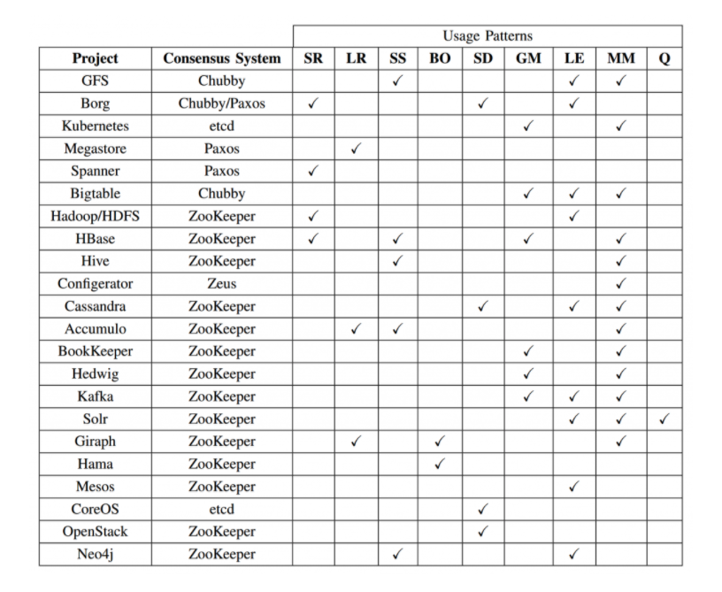

* The acronyms under usage patterns stand for server replication (SR), log replication (LR), synchronisation service (SS), barrier orchestration (BO), service discovery (SD), leader election (LE), metadata management (MM), and Message Queues (Q).
* References: https://blog.container-solutions.com/raft-explained-part-1-the-consenus-problem

## Paxos
* [Paxos Made Live - An Engineering Perspective](https://static.googleusercontent.com/media/research.google.com/en//archive/paxos_made_live.pdf)
* [Net algorithms](http://harry.me/blog/2014/12/27/neat-algorithms-paxos/)

## ZAB
* Consistency algorithm: ZAB algorithm
* To build the lock, we'll create a persistent znode that will serve as the parent. Clients wishing to obtain the lock will create sequential, ephemeral child znodes under the parent znode. The lock is owned by the client process whose child znode has the lowest sequence number. In Figure 2, there are three children of the lock-node and child-1 owns the lock at this point in time, since it has the lowest sequence number. After child-1 is removed, the lock is relinquished and then the client who owns child-2 owns the lock, and so on.
* The algorithm for clients to determine if they own the lock is straightforward, on the surface anyway. A client creates a new sequential ephemeral znode under the parent lock znode. The client then gets the children of the lock node and sets a watch on the lock node. If the child znode that the client created has the lowest sequence number, then the lock is acquired, and it can perform whatever actions are necessary with the resource that the lock is protecting. If the child znode it created does not have the lowest sequence number, then wait for the watch to trigger a watch event, then perform the same logic of getting the children, setting a watch, and checking for lock acquisition via the lowest sequence number. The client continues this process until the lock is acquired.
* Reference: https://nofluffjuststuff.com/blog/scott_leberknight/2013/07/distributed_coordination_with_zookeeper_part_5_building_a_distributed_lock

## Gossip
### Use case

### History 
* [Amazon Dynamo DB](http://bnrg.eecs.berkeley.edu/~randy/Courses/CS294.F07/Dynamo.pdf)
* Within this paper, it introduces two concepts vector clock and gossip. 

### Vector clock
* Vector clock: Published by Lesie Lamport in 1978. [Time, Clocks and the Ordering of Events in a Distributed System](https://www.microsoft.com/en-us/research/publication/time-clocks-ordering-events-distributed-system/)
* Clock synchronization: [UMass course](http://lass.cs.umass.edu/~shenoy/courses/spring05/lectures/Lec10.pdf)
* [Why vector clocks are easy](https://riak.com/posts/technical/why-vector-clocks-are-easy/)
* [Why vector clocks are hard](https://riak.com/posts/technical/why-vector-clocks-are-hard/)

### Components
#### Direct mail
#### Anti-entropy
#### Rumor mongering

## Raft
* Original paper: https://raft.github.io/raft.pdf
* Translated in Chinese: https://infoq.cn/article/raft-paper

### Overview
* Process:
  * Step 1: Client ( i.e; a distributed database system ) sends a command ( i.e; something like an INSERT command in SQL) to the server.
  * Step 2: The consensus module at the leader handles the command: puts it into the leader’s log file & sends it to all other nodes in parallel.
  * Step 3: If majority of the nodes including the leader replicate the command successfully to their local log & acknowledge to the leader, the leader then commits the command to its own state machine.
  * Step 4: The leader acknowledges the status of the commitment to the client.

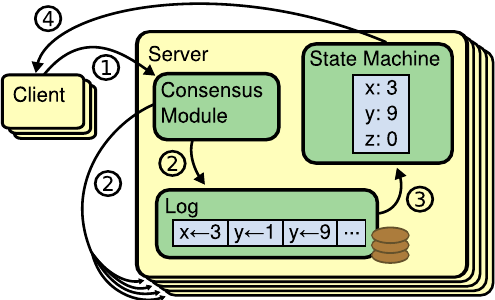

### Concept foundations
#### State machine
* State persisted on the nodes

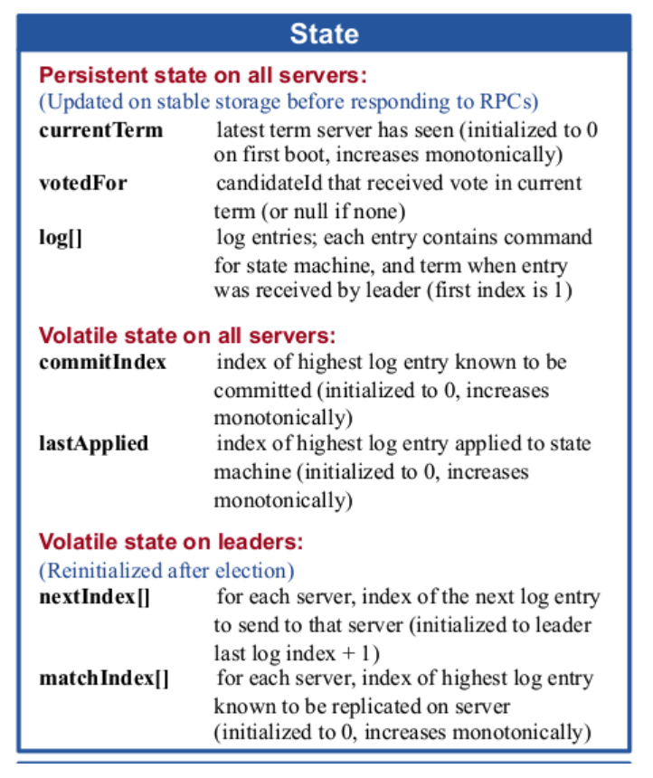

#### Committed & Uncommitted log
* A log entry is committed only when it gets replicated by the majority nodes in the cluster. A committed log never gets overridden. A committed log is durable & eventually gets executed by all the nodes in the Raft cluster.
* If a client command / log entry is not yet replicated to the majority of the cluster nodes, it’s called uncommitted log. Uncommitted logs can be overridden in a follower node.

#### Roles
* Follower: Followers only respond to RPCs, but do not initiate any communication.
* Candidate: 
  * Candidates start a new election, incrementing the term, requesting a vote, and voting for themselves. 
  * Depending on the outcome of the election, become leader, follower (be outvoted or receive RPC from valid leader), or restart these steps (within a new term). 
  * Only a candidate with a log that contains all committed commands can become leader.
* Leader: 
  * The leader sends heartbeats (empty AppendEntries RPCs) to all followers, thereby preventing timeouts in idle periods. 
  * For every command from the client, append to local log and start replicating that log entry, in case of replication on at least a majority of the servers, commit, apply commited entry to its own leader state machine, and then return the result to the client. 
  * If logIndex is higher than the nextIndex of a follower, append all log entries at the follower using RPC, starting from the his nextIndex.

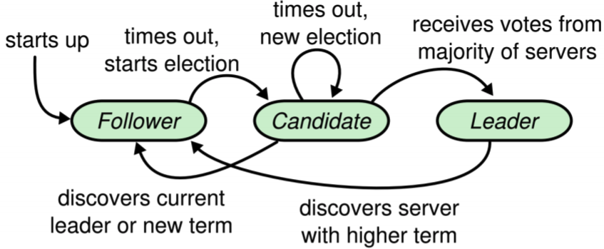

* Introducing preVote role
  * Motivation: To avoid unmeaningful elections. 

#### RPC based node communication
##### RequestVote (RV)
* When a node wants to become a leader, it asks other nodes to vote for it by sending this request.

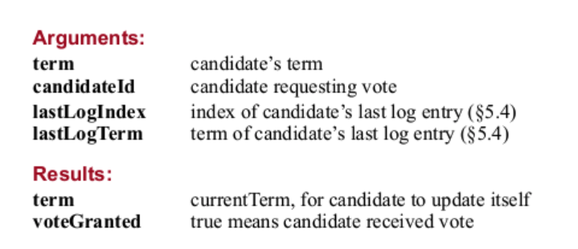

##### AppendEntries (AE)
* Through this message, a leader asks the followers to add an entry to their log file. The leader can send empty message as well as a heartbeat indicating to the followers that it’s still alive.

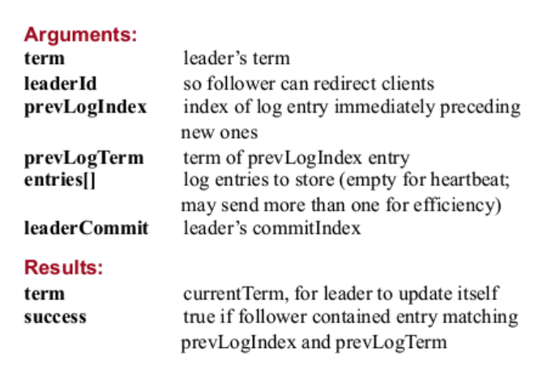

#### Term
* Raft's term servers as many roles
  * Global logical clock within Raft algorithm. 
  * Impact leader election and request processing. 
    * If a candidate or leader realizes that its term is smaller than other nodes, then it will become follower. 
      * For example, after network partition recovery, a leader (term 3) receives a heartbeat message from another leader (term 4), then the original leader (term 3) will become follower. 
    * If a node receives a request from another node with smaller term ID, then it will directly reject the request. 
      * For example, if node C with term 4 receives a RPC request from node with term 3, then it will directly reject the message. 

* Term 1 starts when the cluster starts up. A leader is elected for term 1 & normal operations like log replication, heartbeat continues till the term 1 ends. The leader dies. Node X increases its term to 2 , gets elected as the new leader & term 2 continues. Now X also dies at some point, some other node Y starts the election process, increases the term to 3, but unfortunately the election fails to choose a leader resulting in term 3 termination. And the process goes on.

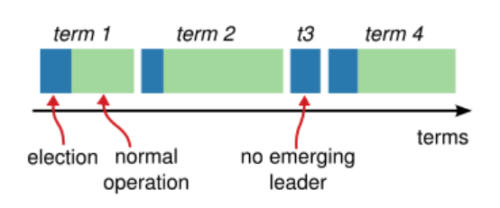

#### Random timeout
* In Raft there are two timeout settings which control elections.
  * Election timeout: The election timeout is the amount of time a follower waits until becoming a candidate. The election timeout is randomized to be between 150ms and 300ms. After the election timeout the follower becomes a candidate and starts a new election term.
  * Heartbeat interval: The interval during which leader will send followers a heartbeat message. 

### Algorithm
#### Leader election
* Leader crash scenario:
  1. Leader node A becomes abnormal. 
  2. Whens follower B does not receive leader's msgHeartbeat after election timeout (heartbeat-interval 100ms, election timeout 1000ms), it will become candidate. 
  3. Candidate B will start election process, self-increment term number, vote for themselves and send other nodes msgVote.  
  4. After Node C receives follower B's election message for leader. There are two possible conditions: 
     * Condition 1: C will vote for B if all of the following conditions satisfy:
       *  B's data is at least as new as it has.
       *  B's term is bigger than C's current term. 
       *  C has not voted in this term for other candidates yet. 
     * Condition 2: C also misses leader's msgHeartbeat after election timeout, and C already has started election and voted for itself. Then it will reject to vote for B. In this case if no nodes could get majority votes, then a new round of vote will start. 
  5. Old leader node A restarts after crash. 
     * Condition 1: If A remains in network partition with majority of node, then it will become 
     * Condition 2: When the old leader A finds a new term number, it will need to transit to the follower role. 

#### Log replication
##### Replication location

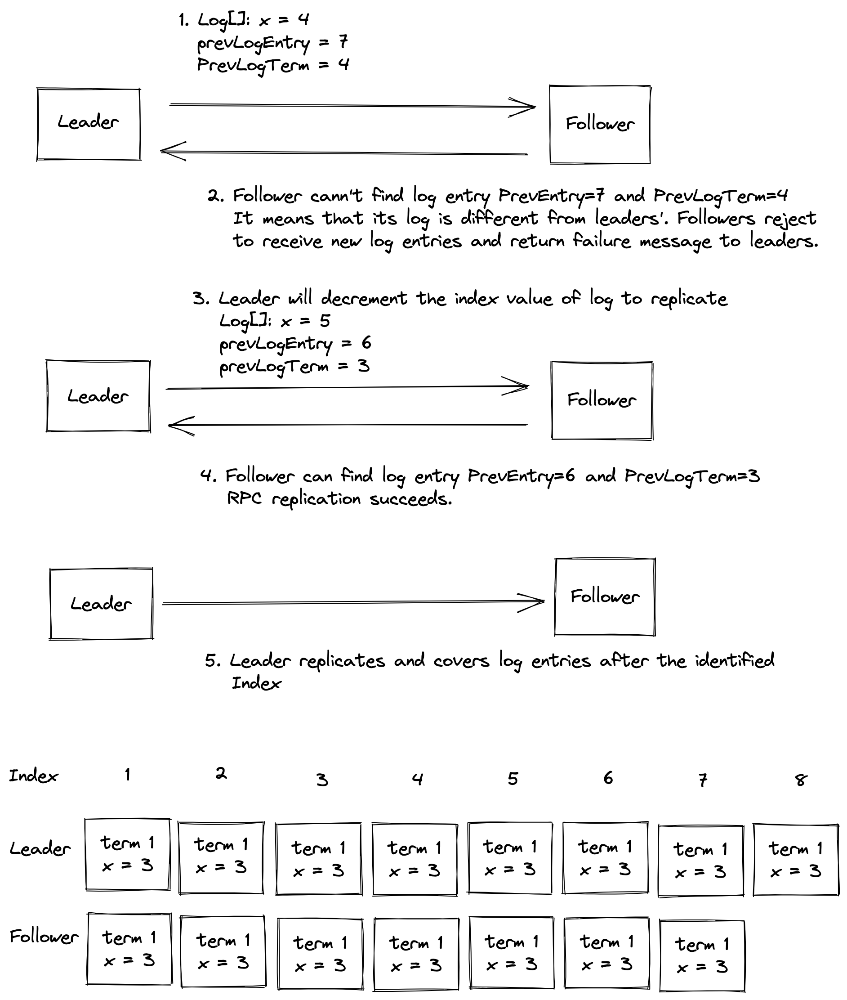

##### Flowchart
* Process
  * Step1: Leader gets the request from client. 
  * Step2: Leader replicates the log entry to other followers through RPC. 
  * Step3: When leader replicates this log entry successfully to other followers, leader will apply the log entry to its local state machine. 
  * Step4: Leader returns the execution results to clients. 
  * Step5: After follower receives heartbeat message or log replication msg, if it realizes that provider already submitted some log and it has not, then it will apply the log entry to its local state machine. 

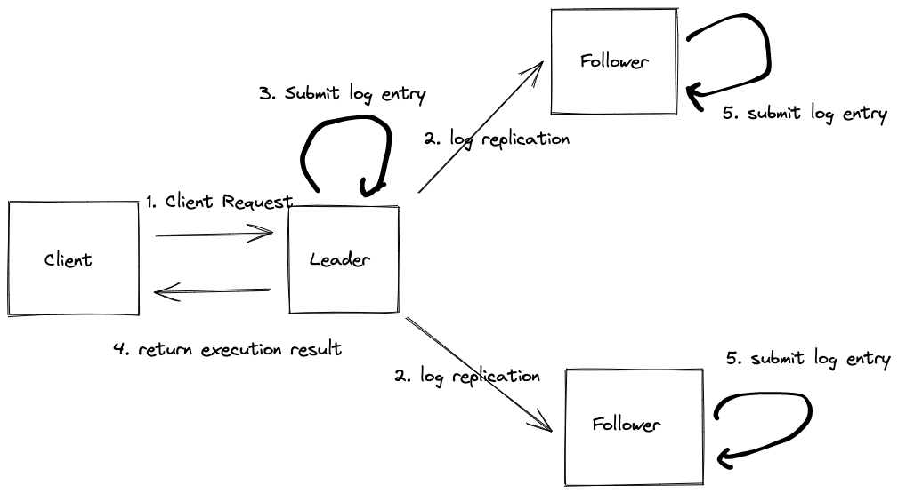

#### Avoid brain split during membership change

### Read and write paths
* A write operation has to always go through the leader.
* A read path can be configured based on the system’s read consistency guarantee, couple of options:
  1. Only the leader can serve the read request — it checks the result of the client query in its local state machine & answers accordingly. Since the leader handles all the write operation, this read is strongly consistent read.
  2. Any node can serve read- it means faster read but possibly stale at times. Any node disconnected from the cluster due to network partition can potentially serve the client query & the result might be stale.

### Enumeration of possible cases
* References: https://codeburst.io/making-sense-of-the-raft-distributed-consensus-algorithm-part-3-9f3a5cdba514

#### 1. Replicate a client command successfully with majority
* The leader node S2 gets a command from the client. It adds the entry to its own log at index 1( The logs in the following diagrams are 1-based ). The dotted line around the rectangle at position 1 in S2 bucket represents that the entry is uncommitted. The orange colour arrows indicate that the leader is sending AppendEntries RPC to the rest of the nodes with the intention to store the data in the majority of the nodes.

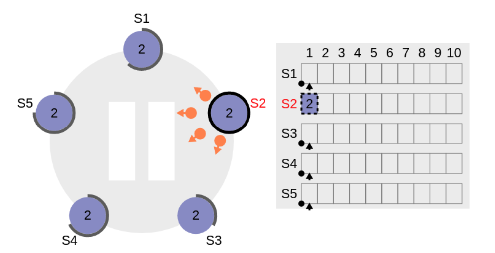

* The starting index of the follower logs is also 1. All the followers receive the message, adds the log command to their individual logs, reset their election timer & acknowledges to the leader affirmatively.

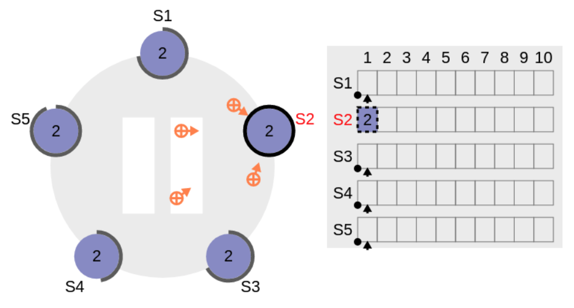

* At this point, leader & all the followers have added the command to their disk based persistent log.
* Since all the followers responded positively, the leader got clear majority & commits the command to its local state machine. The solid black line around the rectangle in S2 bucket at index 1 in the following diagram indicates that the command is now is permanently committed by the leader. The leader can safely communicate to the client that the command has been written successfully in the system.
* The followers have not committed the command yet since they are unaware of the leader’s commitment status.

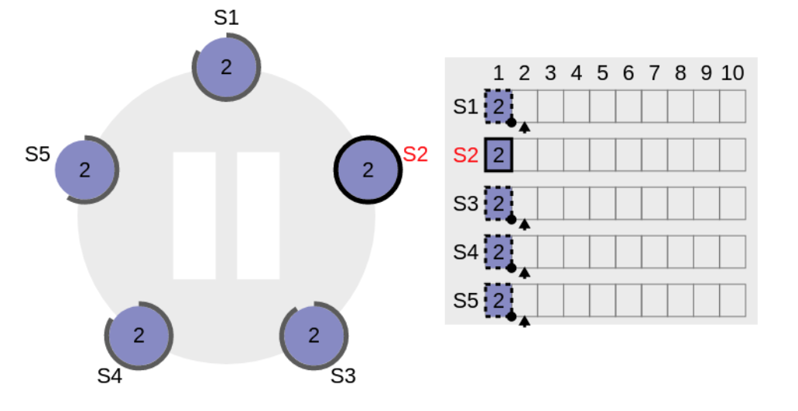

* In the next AppendEntries RPC, the followers get updated commit index from the leader & they commit too in their local state machines.

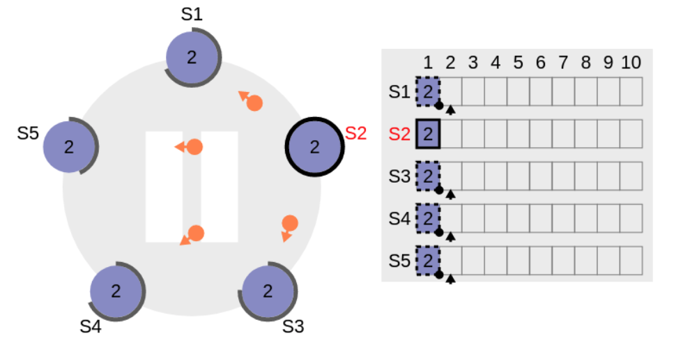

* As seen in the above diagram, entries are committed in the followers now & they acknowledge back to the leader with success.

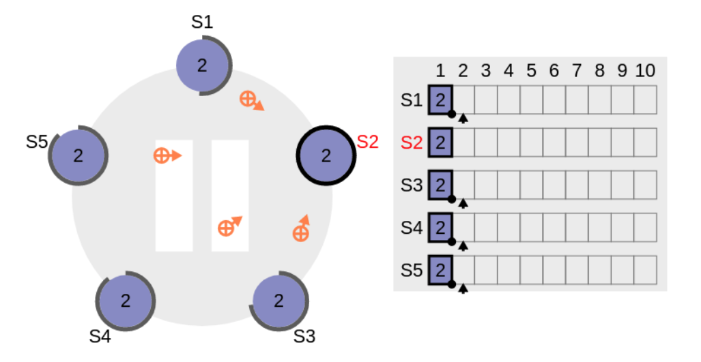

#### 2. Many followers crash together & no majority followers exists
* Before returning error to the client, the leader retries replication few times. Since it clearly does not get the majority in this case, there would be no change in commitIndex of the leader. Hence no actual replication actually happens immediately. However, typically the leader holds the entry in its log, with future replication, this entry would get replicated.
* This scenario is highly unlikely as we would like to place followers across multiple availability zone & unless our data centre or cloud provider badly screws up something, we won’t get into this situation.

#### 3. Before replicating to the majority, the leader crashes
* With leader, the data may also get lost. Since data is not replicated to the majority, Raft does not give any guarantee on data retention.
* Corner Case: Say the leader successfully replicated the log entry to the follower S1. The leader dies. Now in the absence of the leader, if S1 starts the leader election process & wins, since possibly it has more log than other followers, the log entries copied earlier won’t get lost.

#### 4. Leader crashes just before committing a command to the state machine
* S1 is the leader which already replicated a log entry at index 1 to all the nodes in this diagram. However, S1 crashes before committing it to the local state machine.

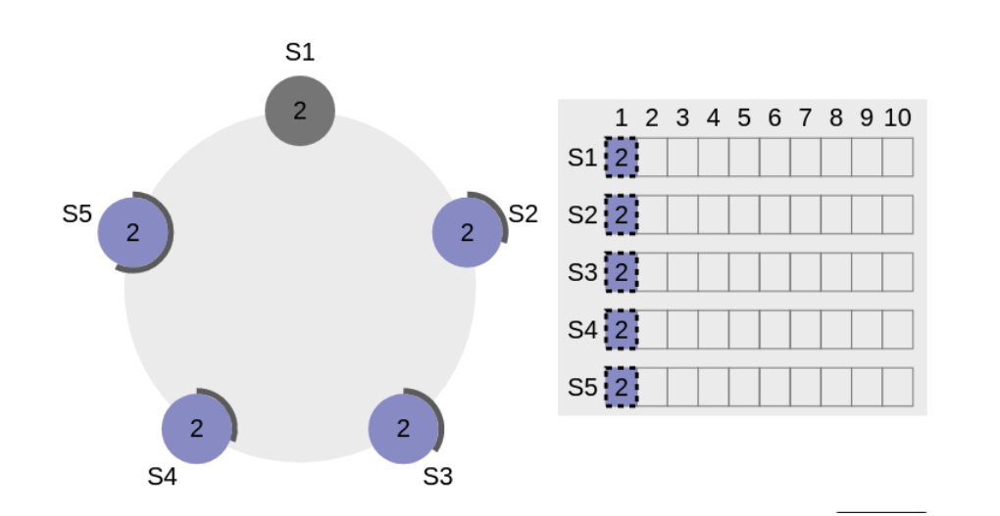

* Next time when the election happens, any of the other nodes except S1 can become the leader. Since the entry is already replicated to the majority by S1 , it’s logically as good as a committed entry, by the rules of Request Vote process in Algorithm 4 described earlier, at least one node would be there which contains this entry & that would be elected as the new leader.

* However, the new leader now won’t directly commit the log entry since after the new leader election, the entry belongs to a previous term — in the following figure, the new leader is elected with term 4 but the log entry belongs to the term 2 — all entries are surrounded by dotted rectangles meaning they are not committed yet.

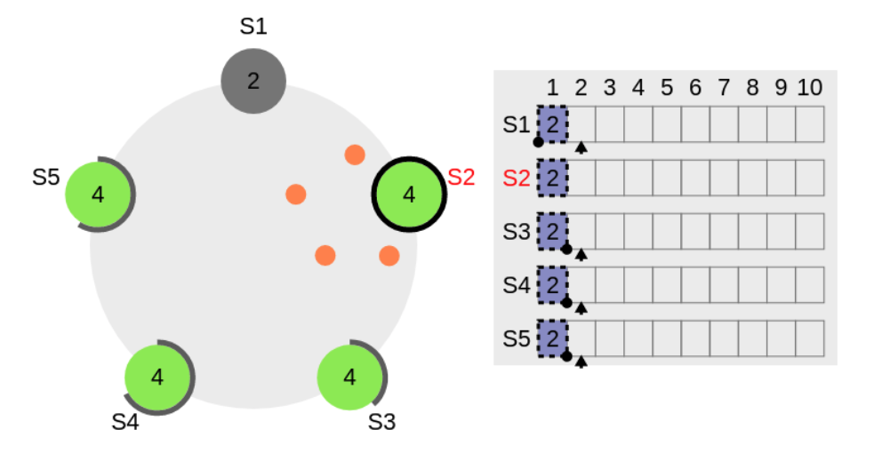

* Remember, Raft never commits entries from previous terms directly even though the entry is there in majority nodes. Raft always commits entries from the current term by counting replicas as shown in Algorithm 1, from line 77 to 94. When entries from the current term are replicated, entries from previous terms indirectly get replicated as shown below:

* In the above figure, a new log entry gets added to the new leader S2 in term 4, when it gets committed, the previous entry with term 2 also gets committed. Both entries at index 1 & 2 are within solid rectangles indicating they are committed.

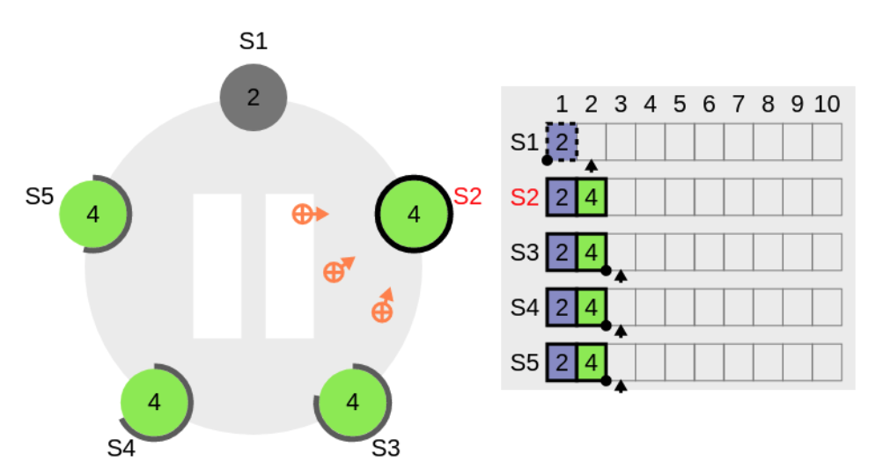

#### 5. Leader crashes after committing a command to itself but before sending commit request to the followers
* This is also same as case 4. As long as a log entry is replicated to the majority of the nodes in the cluster, it does not really matter whether the leader crashes before or after committing the log to its state machine. The next leader would be elected from one of the majority nodes only since they have higher log index than non-majority nodes. So no data loss happens here.

#### 6. Leader crashes, comes back after sometime — the Split Vote Problem
* If a leader suddenly disappears from the raft cluster ( but the client can still interact with it ) due to network partition or some error, a new leader would be potentially chosen by the majority. Ideally, all the new write operations have to be redirected to the new leader — this entirely depends on how you design the system to make the new leader discover-able by the client.

* How does a client discover th nnew leader: Three options available
  * **Redirect the operation internally in the cluster**: The write request can land on any node. If it lands on a follower node, it is redirected to the current leader by the follower; if it lands on the leader, the leader can serve it. However, to handle potential split-brain problem, before serving the request, the leader has to verify with other nodes in the cluster whether its leadership is still valid — it requires some extra check / RPC call resulting into higher write latency, but the client remains light since it does not need to bother who the current leader is.
  * **Cluster-aware client**: The client always gets update from the cluster about the current state. May be with a very short interval of heartbeat, the client keeps on updating the cluster state in its record & verifies existence of the current leader all the time by confirming with the majority nodes. The client becomes heavy in this case.
  * **Manage a central registry or configuration store**: You can manage a central registry which would be always updated with the current leader & other metadata of the cluster. Every time a new leader is elected, the configuration gets updated. So clients can contact the configuration store first to find the current leader & then sends a read / write request to the leader. However, the configuration store becomes a single point of failure now.

* What happens if a write operation is still received by the old leader?
  * The situation ideally should be rare. However, if it happens in some edge case, the data might get lost if it gets accepted by the old leader. Before accepting a write the leader can contact other nodes to validate whether it’s still a valid leader, however it makes the write operation very heavy but it prevents data loss since on error, the client can re-try the operation and the new request may land on the correct leader or valid cluster node.

#### 7. A follower has more logs than the current leader
* As stated earlier, follower logs can be overridden. In case a follower gets some extra log probably from an earlier leader but the logs don’t exist in majority node, Raft can safely override them.

### Additional
#### Raft replication performance cons
* When comparing Paxos and Raft, Raft is typically slower in replication efficiency. Raft requires sequential vote.

#### Raft single transaction replication process
1. Leader receives client's requests
2. Leader appends the request (log entry) to local log. 
3. Leader forwards the log entry to other followers. 
4. Leader waits follower's result. If majority nodes have submitted the log, then this log entry becomes committed entry, and leader could apply it to its local machine.
5. Leader returns success to clients.
6. Leader continues to the next request. 

#### Raft multiple transaction replication process
1. Transaction T1 set X as 1 and all five nodes append successfully. Leader node appends the result to local and return success to client. 
2. For transaction T2, although there is one follower not responding, it still gets majority nodes to respond. So it returns success to clients. 
3. For transaction T3, it does not get responses from more than half. Now leader must wait for a explicit failure such as timing out before it could terminate this operation. Since there is the requirement on sequential vote, T3 will block all subsequent transactions. So both T4 and T5 are blocked (T4 operates on the same data. Although T5 operates on different data, it also becomes blocked.)

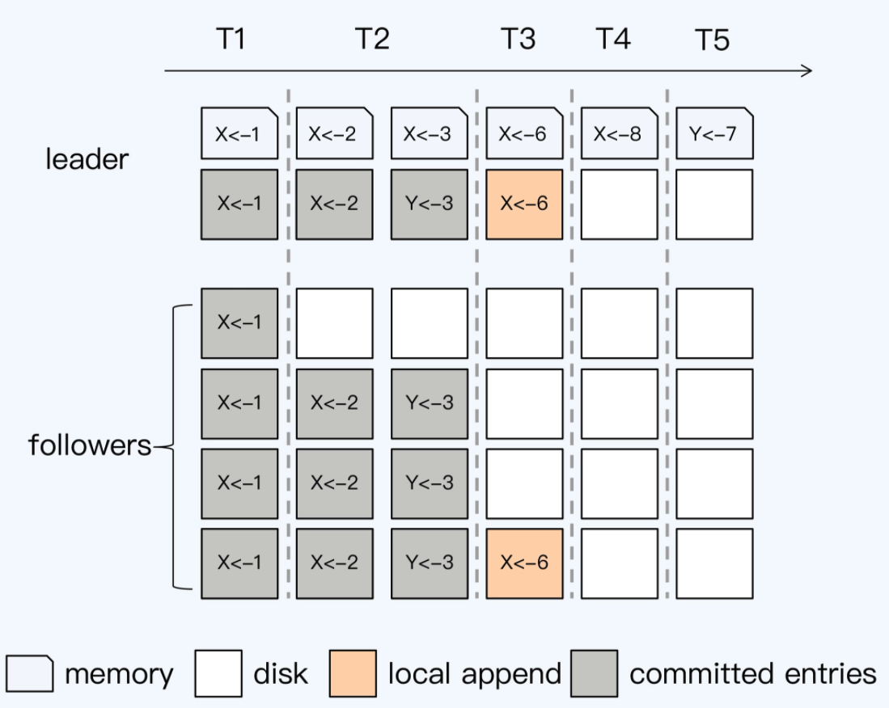

#### Ways to optimize Raft replication performance
* Batch: Leader ccaches multiple requests from clients, and then pass this batch of log to follower
* Pipeline: Leader adds a local variable called nextIndex, each time after sending a batch, update nextIndex to record the next batch position. It does nt wait for follower to return and immediately send the next batch. 
* Append log parallelly: When leader send batch info to follower, it executes local append operation in the mean time. 
* Asynchronous apply: Applying the log entry locally is not a necessary condition for success and any log entry in committed state will not lose. 

## References
* Blogs:
  * [Raft deep dive](https://codeburst.io/making-sense-of-the-raft-distributed-consensus-algorithm-part-1-3ecf90b0b361)
* Raft protocol demo
  * [Raft - The Secret Lives of Data](http://thesecretlivesofdata.com/raft/)
  * [Raft Consensus Algorithm](https://raft.github.io/)
  * [Raft Distributed Consensus Algorithm Visualization](http://kanaka.github.io/raft.js/)
* Gossip
  * [Understanding Gossip](https://www.youtube.com/watch?v=FuP1Fvrv6ZQ&ab_channel=PlanetCassandra)
  * [Visualization](https://rrmoelker.github.io/gossip-visualization/)
* Talks
  * [You must build a Raft](https://www.youtube.com/watch?v=Hm_m4MIXn9Q&ab_channel=HashiCorp)
  * [Distributed Consensus with Raft - CodeConf 2016](https://www.youtube.com/watch?v=RHDP_KCrjUc&ab_channel=GitHub)
  * [Scale By The Bay 2018: Yifan Xing, Consensus Algorithms in Distributed Systems](https://www.youtube.com/watch?v=9QTcD8RrBP8&ab_channel=FunctionalTV)
  * [Understanding Distributed Consensus in etcd and Kubernetes - Laura Frank, CloudBees](https://www.youtube.com/watch?v=n9VKAKwBj_0&ab_channel=CNCF%5BCloudNativeComputingFoundation%5D)
  * [Designing for Understandability: The Raft Consensus Algorithm](https://www.youtube.com/watch?v=vYp4LYbnnW8&ab_channel=DiegoOngaro)