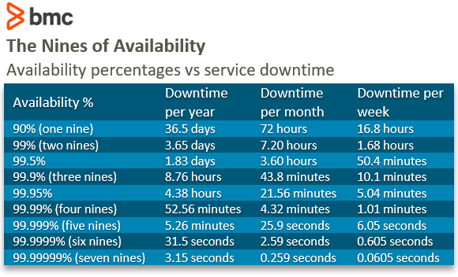
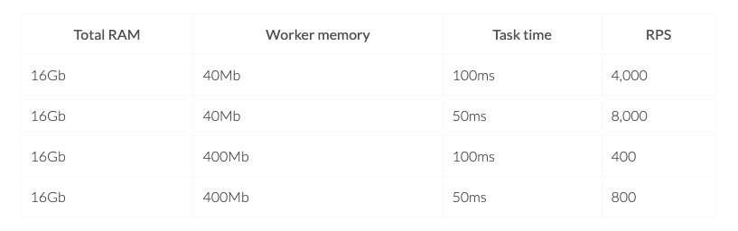
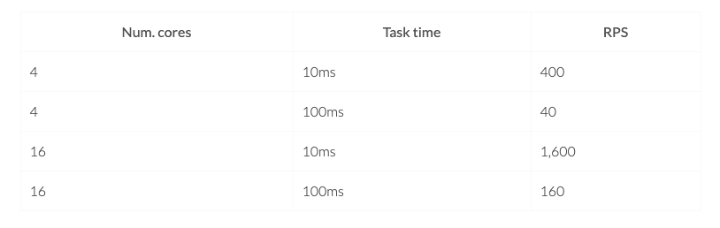

<!-- MarkdownTOC -->

- [Why back of envelope calc (Fermi problems)](#why-back-of-envelope-calc-fermi-problems)
- [Numbers every SWE should know](#numbers-every-swe-should-know)
	- [Power of two](#power-of-two)
	- [Latency numbers](#latency-numbers)
	- [Availability numbers](#availability-numbers)
	- [Time scale conversion](#time-scale-conversion)
	- [Hardware](#hardware)
		- [Commodity hardware](#commodity-hardware)
		- [Storage and flash hardware](#storage-and-flash-hardware)
	- [Linux performance](#linux-performance)
- [C10K](#c10k)
	- [Definition](#definition)
	- [Initial proposal](#initial-proposal)
	- [Next stage - C10M](#next-stage---c10m)
- [Single server load](#single-server-load)
	- [I/O bound](#io-bound)
	- [CPU bound](#cpu-bound)
	- [Typical load](#typical-load)
	- [Example: Design load balancing mechanism for an application with 10M DAU](#example-design-load-balancing-mechanism-for-an-application-with-10m-dau)
- [Database](#database)
	- [Standards](#standards)
	- [Stress testing tools](#stress-testing-tools)
	- [Single MySQL instance performance](#single-mysql-instance-performance)
	- [Single Redis instance](#single-redis-instance)
	- [Wechat 2016 World Record for MySQL clusters](#wechat-2016-world-record-for-mysql-clusters)
- [MAU](#mau)
	- [Monthly active user](#monthly-active-user)
	- [Unsuitable cases](#unsuitable-cases)
	- [MAU => DAU](#mau--dau)
	- [Changes in MAU](#changes-in-mau)
		- [Increase in MAU](#increase-in-mau)
		- [Decrease in MAU](#decrease-in-mau)
- [Scale numbers with examples](#scale-numbers-with-examples)
	- [Typeahead service](#typeahead-service)
		- [Google search](#google-search)
	- [Instant messaging app](#instant-messaging-app)
		- [Microsoft Teams](#microsoft-teams)
		- [Whatsapp](#whatsapp)
	- [Video Streaming](#video-streaming)
		- [Netflix](#netflix)
		- [Youtube](#youtube)
	- [Newsfeed](#newsfeed)
		- [Twitter](#twitter)
		- [Facebook](#facebook)
	- [Photo sharing](#photo-sharing)
		- [Instagram](#instagram)
	- [File system](#file-system)
		- [Dropbox](#dropbox)
	- [Web crawler](#web-crawler)
		- [Google Crawler](#google-crawler)
			- [Target](#target)
			- [QPS estimation](#qps-estimation)
			- [Storage estimation](#storage-estimation)
	- [Geo services](#geo-services)
		- [Yelp](#yelp)
		- [Uber](#uber)

<!-- /MarkdownTOC -->

# Why back of envelope calc (Fermi problems)
* https://www.youtube.com/watch?v=lTJndN61fDM&ab_channel=TonyaCoffey

# Numbers every SWE should know
## Power of two

| Power of two  | 10 based number  |  Short name | 
|---------------|------------------|-------------|
|      10       |  	1 thousand (10^3)   |	1 KB     |
|      20  		|   1 million (10^6) 	   |	1 MB	 |
|      30  		|   1 billion (10^9)     |	1 GB	 |
|      40  		|   1 trillion	(10^12)   |	1 TB	 |
|      50  		|   1 quadrillion (10^15) |	1 PB	 |

## Latency numbers 
* https://colin-scott.github.io/personal_website/research/interactive_latency.html

## Availability numbers


## Time scale conversion
* Total seconds in a day: 86400 ~ 10^5
* 2.5 million requests per month: 1 request per second
* 100 million requests per month: 40 requests per second
* 1 billion requests per month: 400 requests per second

## Hardware
### Commodity hardware
* https://www.brentozar.com/archive/2014/12/commodity-hardware/#:~:text=Commodity%20hardware%20refers%20to%20cheap,E5%2D2600%20v3%20CPU%20sockets
* Two Intel Xeon E5-2623 v3’s (quad core) – $900 total
* 128GB RAM (using 8GB DIMMs) – $1,920
* Two 512GB SSDs for fast storage – $450
* Six 4TB hard drives for slow storage – $900
* Grand total: $5,070

### Storage and flash hardware
* Storage and Flash. These two server types have very different characteristics. 
  * Storage servers consist of mostly spinning disks, can hold upwards of 200 TB, and generate ~40 Gbps of throughput. 
  * Flash servers (all SSD disks) can generate up to ~100 Gbps but can hold only up to 18 TB of content.
* Reference: https://netflixtechblog.com/distributing-content-to-open-connect-3e3e391d4dc9

## Linux performance
* https://netflixtechblog.com/linux-performance-analysis-in-60-000-milliseconds-accc10403c55

# C10K
## Definition
* Handle 10,000 concurrent connections
	- vs RPS: 
		+ RPS requires high throughput (Process them quickly). 
		+ A system which could handle high number of connections is not necessarily a high throughput system.
* This became known as the C10K problem. Engineers solved the C10K scalability problems by fixing OS kernels and moving away from threaded servers like Apache to event-driven servers like Nginx and Node.

## Initial proposal
* http://www.kegel.com/c10k.html

## Next stage - C10M
* http://highscalability.com/blog/2013/5/13/the-secret-to-10-million-concurrent-connections-the-kernel-i.html

# Single server load
## I/O bound
* RPS = (memory / worker memory)  * (1 / Task time)



## CPU bound
* RPS = Num. cores * (1 /Task time)



## Typical load
* 1,000 RPS is not difficult to achieve on a normal server for a regular service.
* 2,000 RPS is a decent amount of load for a normal server for a regular service.
* More than 2K either need big servers, lightweight services, not-obvious optimisations, etc (or it means you’re awesome!). Less than 1K seems low for a server doing typical work (this means a request that is simple and not doing a lot of work) these days.
* For a 32 core 64GB machine, it could at mmost process 20K "hello world" per second. For the actual business logic, the RPS will be much lower, several hundreds per second. 

## Example: Design load balancing mechanism for an application with 10M DAU
* 10M DAU will be normal for applications such as Github. 

* Traffic voluem estimation
1. 10M DAU. Suppose each user operate 10 times a day. Then the QPS will be roughly ~ 1160 QPS
2. Peak value 10 times average traffic ~ 11600 QPS
3. Suppose volume need to increase due to static resource, microservices. Suppose 10. QPS ~ 116000 QPS. 

* Capacity planning
1. Multiple DC: QPS * 2 = 232000
2. Half-year volume increase: QPS * 1.5 = 348000

* Mechanism
1. No DNS layer 
2. LVS

# Database
## Standards
* QPS: Queries processed per second
* TPS: Transactions processed per second. 
* Response time: Average time of process a single request. 
* Concurrency: The number of concurrent requests which could be processed. 

## Stress testing tools
* MySqlslap: Shipped together with MySQL. Could not perform long time stress test. 
* Sysbench: Works on MacOS and Linux. 
* JMeter: Only basic functionality for database pressure testing. 

## Single MySQL instance performance
* Use 10 threads to simulate 10 concurrent connections. 
	- TPS: 500 TPS
	- QPS: 5000 QPS
* Physical upper limit of concurrent connections: 16K

## Single Redis instance
* TPS: 20K ~ 100K 

## Wechat 2016 World Record for MySQL clusters
* TPS (payment transaction for yearly red envelope): 200K
* RPS (number of yearly red envelope): 760K

# MAU
## Monthly active user
## Unsuitable cases
* It is an unreliable metric for just-launched start-ups
	- Putting stock in MAU early in a start-up’s life is a mistake. Given the definition of MAU, all of the promotional activities that are associated with a launch such as PR, being featured in app stores and publications, word of mouth, advertising, etc., can highly inflate MAU figures. It would instead be better to assess MAU once traffic has normalized over a few months.
* Depth of usage isn’t accounted for 
	- To qualify for MAU, according to some definitions, a user just has to log in and doesn’t need to engage with the product beyond that. So having a high MAU doesn’t necessarily mean that all those users are engaging with your product. From a monetization point of view, you can only monetize users who engage with your app. So it’s good practice to measure unique users who interact with a core feature of your product.
* Quality of users isn’t accounted for
	- Not all users are the same. Users obtained from different sources tend to exhibit different engagement behaviors. Some sources, for example, may allow for installs quickly or cheaply, but if those users don’t engage with key features of the product then the source isn’t very useful. In fact, obtaining a large number of users from such sources only serves to inflate MAU numbers but does not provide much else in value.

## MAU => DAU
* Assume that all the expected requests in a day are going to be done in 4 hours.
	- DAU => Number of requests

## Changes in MAU
### Increase in MAU
* This tends to happen when the number of new users and reactivations is greater than the number of existing users that have churned.
* (New users + Reactivations of lapsed users) > Churn of existing users
	- New users – A new advertising campaign, positive press, or the app being featured in the app store can drive an increase in downloads and new users; in turn, they drive an increase in monthly active users.
	- Reactivations – Start-ups that have a large base of users that are no longer active can reactivate them via email campaigns or push notifications.
	- Churn – Addressing issues which have put off users via a new release or feature can reduce churn rates among existing users. This, in turn, would help increase MAU.

### Decrease in MAU
* A decrease in MAU occurs then the number of new users and reactivations of existing users is less than the number of existing users that have churned.
* (New users + Reactivations of lapsed users) < Churn of existing users
	- New users – The number of new users may fall due to expiring subscriptions, reductions in advertising or promotions, or the app no longer being featured on publications or in app stores.
	- Reactivations – A decrease in reactivation or engagement campaigns can also result in a decrease in the number of reactivations
	- Churn – An increase in churn rates due to technical problems, features that put users off, or other issues can cause an increase in churn rates, which in turn lead to lower MAU.

# Scale numbers with examples
## Typeahead service
### Google search
* Google has been visited 62.19 billion times this year.
* Google processes over 3.5 billion searches per day.
  * It means that Google processes over 40,000 search queries every second on average. Let’s also take a look at how Google’s searches per year have progressed. In 1998, Google was processing over 10,000 search queries per day. In comparison, by the end of 2006, the same amount of searches would be processed by Google in a single second.
* 84 percent of respondents use Google 3+ times a day or more often.
* * Google has 92.18 percent of the market share as of July 2019. 
* More than one billion questions have been asked on Google Lens.
* 63 percent of Google’s US organic search traffic originated from mobile devices.
* Facebook was the most searched keyword on Google. 
* 46 percent of product searches begin on Google.
* 90 percent of survey respondents said they were likely to click on the first set of results.
* https://www.oberlo.com/blog/google-search-statistics

## Instant messaging app 
* https://everysecond.io/messenger
* Whatsapp: 1.6 billion MAU
* Facebook Messenger: 1.3 billion MAU
* Wechat: 1.1 billion MAU
* Snapchat: 0.3 billion MAU
* Telegram: 0.2 billion MAU 

### Microsoft Teams
* 140 million DAU
* 240 million MAU

### Whatsapp
* 1.6 billion WhatsApp users access the app on a monthly basis. 53 percent of WhatsApp users in the US use the app at least once a day.
* More than 65 billion messages are sent via WhatsApp every day. In other words, that boils down to 2.7 billion per hour, 45 million per minute, and more than 750,000 per second. 
* WhatsApp was downloaded 96 million times in February 2020.
* WhatsApp is available in more than 180 countries and 60 different languages.
* With 340 million users, India is WhatsApp’s biggest market.
* There are more than five million businesses using WhatsApp Business.

## Video Streaming
### Netflix
* 200 million subscribers Q4/2020. US has 74 million subscribers.
  * vs Amazon Prime - 150 million subscribers
  * vs Hulu - 39 million subscribers
* Subscribers spent 3.2 hours per day watching Netflix
* https://www.businessofapps.com/data/netflix-statistics/
* serving 100% of our video, over 125 million hours every day, to 100 million members across the globe! https://netflixtechblog.com/how-data-science-helps-power-worldwide-delivery-of-netflix-content-bac55800f9a7
* For each episode of the crown, over 1200 files will be created. https://netflixtechblog.com/content-popularity-for-open-connect-b86d56f613b


```
// Watch video RPS
100 M daily active users * 2 hours per day spent by each subscriber / total seconds 
```

### Youtube
* Every second: https://everysecond.io/youtube
* 2.3 billion MAU
* 720,000 hours of video uploaded daily
  * 500 hours of video uploaded every minute
  * (2012) 4 billion hours of video watched every day. 60 hours of video is uploaded every minute. 350+ million devices are YouTube enabled.
  * (2009) 1 billion videws per day. That’s at least 11,574 views per second, 694,444 views per minute, and 41,666,667 views per hour. https://mashable.com/2009/10/09/youtube-billion-views/
  * 8.4 minutes per person per day if everyone watches Youtube
* Second most popular search after Google
* Localized in 100 countries and 80 languages
* 70% of traffic come from mobile
* Reference: https://www.oberlo.com/blog/youtube-statistics#:~:text=500%20hours%20of%20video%20are,uploaded%20every%20day%20to%20YouTube.

## Newsfeed
### Twitter
* There are 330m monthly active users and 145 million daily users.
* There are 500 million tweets sent each day. That’s 6,000 tweets every second.
* A total of 1.3 billion accounts have been created.
* Of those, 44% made an account and left before ever sending a tweet.
* Based on US accounts, 10% of users write 80% of tweets.
* During the 2014 FIFA World Cup Final, 618,725 tweets were sent in a single minute.
* Reference: https://www.brandwatch.com/blog/twitter-stats-and-statistics/#:~:text=Twitter%20user%20statistics,billion%20accounts%20have%20been%20created.&text=As%20of%20Q1%202019%2C%2068m,access%20the%20site%20via%20mobile.

### Facebook

## Photo sharing
### Instagram
* https://everysecond.io/instagram
* In total 250 billion photo since 2004. 
* Photo uploads total 300 million per day
* 243,055 new photos uploaded per minute
* 127 photos uploaded on average per Facebook user
* There are 1.074 billion Instagram MAU worldwide in 2021.
* Instagram users spend an average of 53 minutes per day.
* Dec, 2012: more than 25 photos and 90 likes every second. 

* https://www.statista.com/topics/1882/instagram/#:~:text=As%20of%20June%202018%2C%20the,market%20based%20on%20audience%20size.
 
## File system
### Dropbox
* Assume the application has 50 million signed up users and 10 million DAU. • Users get 10 GB free space.
* Assume users upload 2 files per day. The average file size is 500 KB.
* 1:1 read to write ratio.
* Total space allocated: 50 million * 10 GB = 500 Petabyte
* QPS for upload API: 10 million * 2 uploads / 24 hours / 3600 seconds = ~ 240 
* Peak QPS = QPS * 2 = 480

* Reference: [Dropbox statistics](https://saasscout.com/statistics/dropbox-statistics/#:~:text=23%20Conclusion%3A-,Key%20Stats%3A,of%20content%20uploaded%20to%20Dropbox)

## Web crawler
### Google Crawler
#### Target
* Entire web. Suppose 1 billion web site. 
* Each website has 100 links.
* Refresh every two weeks.
* Need to retain data for 5 years.

#### QPS estimation

```
// How many web pages to fetch per second
10^9 website * 100 links per website / (2 weeks * 7 days * 86400 sec) 
~= 10^11 / (10 * 10^5) 
~= 10^5 webpages /sec

```

#### Storage estimation
* Page sizes vary a lot, but if we will be dealing with HTML text only, let’s assume an average page size of 100KB. 
  * Total copy of data to store: 5 year retention / 2 weeks refresh period
  * Used storage / Full capacity: 0.7

```
10^9 website * 100 links per page * 100KB * (5 year retention / 2 weeks refresh period) / capacity ratio
~= 10^9 * 10^2 * 10^5 * 5 * 52 / 2 / 0.7
~= 10^16 * 125 / 0.5
~= 2500 Petabytes
```

## Geo services
### Yelp
* Yelp has more than 178 million unique visitors monthly across mobile, desktop and app platforms
* Reference: https://review42.com/resources/yelp-statistics/

### Uber
* https://everysecond.io/uber
* 103 million MAU
* Uber has 5 million drivers, Q4 2019 and 18.7 million trips per day on average Q1 2020
  * versus Lyft has 2 million drivers, who serve over 21.2 million active riders per quarter
