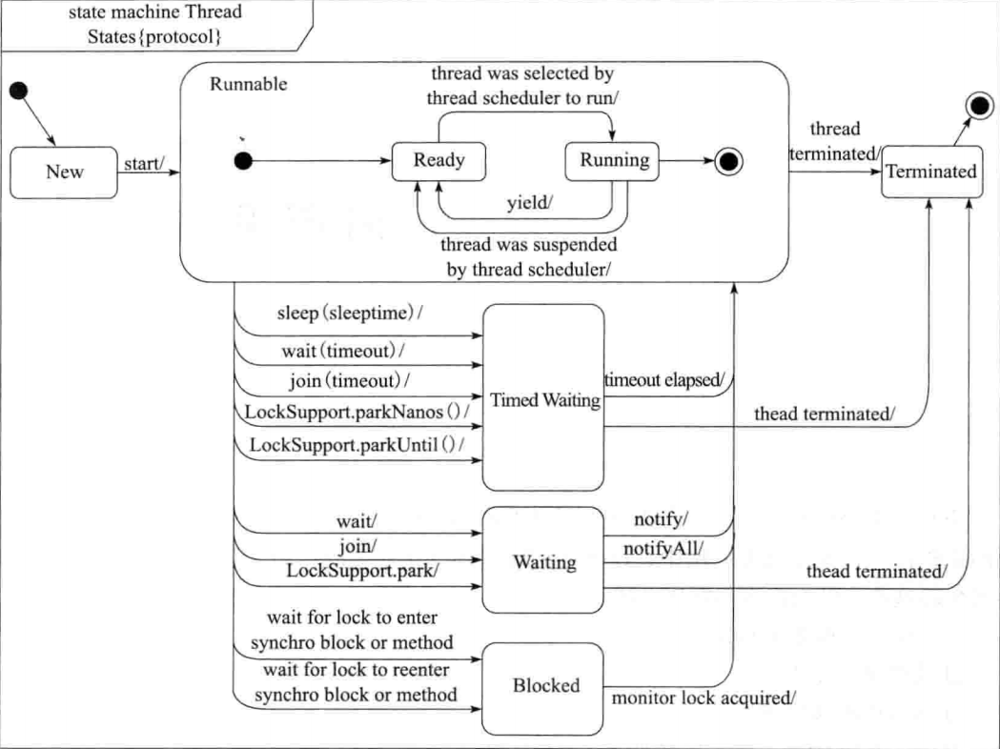

<!-- MarkdownTOC -->

- [Multithreading](#multithreading)
	- [JMM](#jmm)
	- [Thread and process](#thread-and-process)
	- [Thread lifecycle](#thread-lifecycle)
		- [State conversion](#state-conversion)
		- [Create thread - implementing Runnable vs extending Thread](#create-thread---implementing-runnable-vs-extending-thread)
		- [Start a thread](#start-a-thread)
		- [Stop a thread](#stop-a-thread)
		- [Object methods](#object-methods)
			- [Wait, notify and notifyAll](#wait-notify-and-notifyall)
		- [Thread methods](#thread-methods)
			- [Join](#join)
			- [Sleep](#sleep)
	- [Deadlock](#deadlock)
		- [Def](#def)
		- [Conditions](#conditions)
	- [Java concurrency APIs](#java-concurrency-apis)
- [Counters](#counters)
- [Singleton](#singleton)
- [BoundedBlockingQueue](#boundedblockingqueue)
- [Readers/writers lock [To be finished]](#readerswriters-lock-to-be-finished)
- [Thread-safe producer and consumer](#thread-safe-producer-and-consumer)
- [Delayed scheduler](#delayed-scheduler)
	- [Interfaces to be implemented](#interfaces-to-be-implemented)
	- [Single thread](#single-thread)
	- [One thread for each task](#one-thread-for-each-task)
	- [PriorityQueue + A background thread](#priorityqueue--a-background-thread)
	- [References](#references)

<!-- /MarkdownTOC -->

# Multithreading
## JMM

## Thread and process
* Similar goals: Split up workload into multiple parts and partition tasks into different, multiple tasks for these multiple actors. Two common ways of doing this are multi-threaded programs and multi-process systems. 
* Differences

| Criteria  |  Thread |  Process  |
| --------------------- |:-------------:| -----:|
| Def | A thread exists within a process and has less resource consumption | A running instance of a program |
| Resources | Multiple threads within the same process will share the same heap space but each thread still has its own registers and its own stack. | Each process has independent system resources. Inter process mechanism such as pipes, sockets, sockets need to be used to share resources. |
| Overhead for creation/termination/task switching  | Faster due to very little memory copying (just thread stack). Faster because CPU caches and program context can be maintained | Slower because whole process area needs to be copied. Slower because all process area needs to be reloaded |
| Synchronization overhead | Shared data that is modified requires special handling in the form of locks, mutexes and primitives | No synchronization needed |
| Use cases  | Threads are a useful choice when you have a workload that consists of lightweight tasks (in terms of processing effort or memory size) that come in, for example with a web server servicing page requests. There, each request is small in scope and in memory usage. Threads are also useful in situations where multi-part information is being processed – for example, separating a multi-page TIFF image into separate TIFF files for separate pages. In that situation, being able to load the TIFF into memory once and have multiple threads access the same memory buffer leads to performance benefits. | Processes are a useful choice for parallel programming with workloads where tasks take significant computing power, memory or both. For example, rendering or printing complicated file formats (such as PDF) can sometimes take significant amounts of time – many milliseconds per page – and involve significant memory and I/O requirements. In this situation, using a single-threaded process and using one process per file to process allows for better throughput due to increased independence and isolation between the tasks vs. using one process with multiple threads. |

## Thread lifecycle


### State conversion
* When will be a thread blocked?
  * Blocked:
  * Waiting:
  * Timed waiting: 
* New -> Runnable -> terminated is not reversible
* Timed waiting / Waiting / Blocked can only transfer to each other by going through Runnable first. 



### Create thread - implementing Runnable vs extending Thread
* Internal mechanism
  * There is only one way to create thread - create a Thread instance. And there are two ways to implement the run() method - Override the run() method inside Thread instance vs pass an implementation of Runnable interface into Thread constructor. 
  * Thread and Runnable are complement to each other for multithreading not competitor or replacement. Because we need both of them for multi-threading.
  	- For Multi-threading we need two things:
  		+ Something that can run inside a Thread (Runnable).
  		+ Something That can start a new Thread (Thread).
  	- So technically and theoretically both of them is necessary to start a thread, one will run and one will make it run (Like Wheel and Engine of motor vehicle).

```
@Override
public void run() 
{
    if (target != null) 
	{
        target.run();
    }
}
```

* Best practices - Implement Runnable()
  * Code cleaniness perspective: 
    * Decoupling: Implementing Runnable could separate thread creation from running. 
    * Extensibility: If adopting the approach of extending Thread, then it could not extend another class because Java does not support multiple inheritance.
  * Cost of operation perspective: Thread approach will require creating and destroying a thread object each time; When combined with threadpool, Runnable approach could avoid creating a new thread object and deleting it.

```
// Approach 1: Runnable
public class DemoRunnable implements Runnable 
{
    public void run() 
	{
        //Code
    }
}

// Approach 2: Thread
public class DemoThread extends Thread 
{
    public DemoThread() 
	{
        super("DemoThread");
    }

    public DemoThread(Runnable ) 
	{
        super("DemoThread");
    }

    public void run() 
	{
        //Code
    }
}
```

### Start a thread
* Best practices - Use Start()
  * Start() method responsiblity:
    * Start a new thread
    * Check the thread status
    * Add the thread to thread group
    * Kick off the Run()
  * Run() method responsibility:
    * Kick off the code inside Run()
  * Key difference is that Start() method (approach 1 below) will create a new thread to run. Run() (approach 2 below) will run everything inside main() method. 

```
public static void main(string[] args)
{
	// Approach 1: Create a runnable instance and run it
	// Output: main
	Runnable runnable = () -> 
	{
		System.out.println(Thread.currentThread().GetName());
	};
	runnable.run();

	// Approach 2: Start a new thread
	// Output: thread0
	new Thread(runnable).start();
}
```

### Stop a thread
* Java does not provide a way for one thread to force stop of another thread because if it does so, then the other thread might be in a state of inconsistency. Java provides a collaboration mechanism for one thread to notify another thread that it would better stop. 

* Best practices: Please see this folder for sample code: https://github.com/DreamOfTheRedChamber/system-design-interviews/tree/master/code/multithreads/StopThreads

### Object methods
* Please see https://github.com/DreamOfTheRedChamber/system-design-interviews/tree/master/code/multithreads/ObjectMethods for best practices

#### Wait, notify and notifyAll
* Wait and notify are all based on object's monitor mechanism. Therefore, they are declared as methods on top of Object. 
* They are considered the native way of doing multi-threading. Java JDK has shipped packages such as Condition variable which is easier to use. 


### Thread methods
* Please see https://github.com/DreamOfTheRedChamber/system-design-interviews/tree/master/code/multithreads/ThreadMethods

#### Join
* Join thread will be in the waiting status
* Join is the native way of doing waiting. Java JDK has shipped packages such as CountDownLatch or CyclicBarrier.

* Best pratices:  

#### Sleep
* Wait vs Sleep
  * Similarities:
    * Both wait and sleep method could make the thread come into blocked state. Wait will result in Waiting and sleep will result in Time_Waiting. 
    * Both wait and sleep method could respond to interrupt. 
  * Differences:
    * Wait could only be used in synchronized blocks, while sleep could be used in other scenarios. 
    * Wait is a method on Object, and sleep is a method on Thread. 
    * Wait will release monitor lock, and sleep will not. 
    * Wait could only exit blocked state reactively, and sleep could proactive exit after specific time. 

* Yield vs Sleep: Similar. However yield is non-blocking but sleep is blocking


## Deadlock
### Def
* A deadlock is a situation where a thread is waiting for an object lock that another thread holds, and this second thread is waiting for an object lock that the first thread holds. Since each thread is waiting for the other thread to relinquish a lock, they both remain waiting forever. 

### Conditions
* **Mutal Exclusion**: Only one process can access a resource at a given time. (Or more accurately, there is limited access to a resource. A deadlock could also occur if a resource has limited quantity. )
* **Hold and Wait**: Processes already holding a resource can request additional resources, without relinquishing their current resources. 
* **No Preemption**: One process cannot forcibly remove another process' resource.
* **Circular Wait**: Two or more processes form a circular chain where each process is waiting on another resource in the chain. 

## Java concurrency APIs 
* Thread basics - join, yield, future
* Executor services
* Semaphore/Mutex - locks, synchronized keyword
* Condition variables - wait, notify, condition
* Concurrency collections - CountDownLatch, ConcurrentHashMap, CopyOnWriteArrayList

# Counters
* See src dir for details

# Singleton
* 

# BoundedBlockingQueue
* See src dir for details

# Readers/writers lock [To be finished]

# Thread-safe producer and consumer
* See src dir for details

# Delayed scheduler

## Interfaces to be implemented

```java
public interface Scheduler
{
	void schedule( Task t, long delayMs );
}

public interface Task
{
	void run();
}

```

## Single thread
* Main thread is in Timedwaiting state for delayMs for each call of schedule()
* Only one thread, very low CPU utilization
* Also, this is not working as later call
* How about sleeping in other threads

```java
public class SchedulerImpl implements Scheduler
{
	public void schedule( Task t, long delayMs )
	{
		try
		{
			// sleep for delayMs, and then execute the task
			Thread.sleep( delayMs );
			t.run();
		}
		catch ( InterruptedException e )
		{
			// ignore
		}
	}

	public static void main( String[] args )
	{
		Scheduler scheduler = new SchedulerImpl();
		Task t1 = new TaskImpl( 1 );
		Task t2 = new TaskImpl( 2 );

		// main thread in timedwaiting state for 10000 ms
		scheduler.schedule( t1, 10000 );
		scheduler.schedule( t2, 1 );
	}
}

```

## One thread for each task
* No blocking when calling schedule
* What happens if we call schedule many times
	- A lot of thread creation overhead
* Call be alleviated by using a thread pool, but still not ideal

```java
public class SchedulerImpl implements Scheduler
{
	public void schedule( Task t, long delayMs )
	{
		Thread t = new Thread( new Runnable() {
			public void run()
			{
				try 
				{
					Thread.sleep( delayMs );
					t.run();
				}
				catch ( InterruptedException e )
				{
					// ignore;
				}
			}
		} );
		t.start();
	}
}
```

## PriorityQueue + A background thread

```java
package designThreadSafeEntity.delayedTaskScheduler;

import java.util.PriorityQueue;
import java.util.concurrent.atomic.AtomicInteger;

public class Scheduler
{
	// order task by time to run
	private PriorityQueue<Task> tasks;

	// 
	private final Thread taskRunnerThread;

	// State indicating the scheduler is running
	// Why volatile? As long as main thread stops, runner needs to has visibility.
	private volatile boolean running;

	// Task id to assign to submitted tasks
	// AtomicInteger: Threadsafe. Do not need to add locks when assigning task Ids
	// Final: Reference of atomicInteger could not be changed
	private final AtomicInteger taskId;
	
	public Scheduler()
	{
		tasks = new PriorityQueue<>();
		taskRunnerThread = new Thread( new TaskRunner() );
		running = true;
		taskId = new AtomicInteger( 0 );

		// start task runner thread
		taskRunnerThread.start();
	}
	
	public void schedule( Task task, long delayMs )
	{
		// Set time to run and assign task id
		long timeToRun = System.currentTimeMillis() + delayMs;
		task.setTimeToRun( timeToRun );
		task.setId( taskId.incrementAndGet() );

		// Put the task in queue
		synchronized ( this )
		{
			tasks.offer( task );
			this.notify(); // only a single background thread waiting
		}
	}
	
	public void stop( ) throws InterruptedException
	{
		// Notify the task runner as it may be in wait()
		synchronized ( this )
		{
			running = false;
			this.notify();
		}

		// Wait for the task runner to terminate
		taskRunnerThread.join();
	}
	
	private class TaskRunner implements Runnable
	{
		@Override
		public void run()
		{
			while ( running )
			{
				// Need to synchronize with main thread
				synchronized( Scheduler.this )
				{
					try 
					{
						// task runner is blocked when no tasks in queue
						while ( running && tasks.isEmpty() )
						{
							Scheduler.this.wait();
						}

						// check the first task in queue
						long now = System.currentTimeMillis();
						Task t = tasks.peek();

						// delay exhausted, execute task
						if ( t.getTimeToRun() < now )
						{
							tasks.poll();
							t.run();
						}			
						else
						{
							// no task executable, wait
							Scheduler.this.wait( t.getTimeToRun() - now );
						}
					}
					catch ( InterruptedException e )
					{
						Thread.currentThread().interrupt();	
					}
				}
			}
		}
	}
	
	public static void main( String[] args ) throws InterruptedException
	{
		Scheduler scheduler = new Scheduler();
		scheduler.schedule( new Task(), 1000000 );
		scheduler.schedule( new Task(), 1000 );
		Thread.sleep( 7000 );
		scheduler.stop();
	}
}

class Task implements Comparable<Task> 
{
	// When the task will be run
	private long timeToRun;
	private int id;
	
	public void setId( int id )
	{
		this.id = id;
	}
	
	public void setTimeToRun( long timeToRun )
	{
		this.timeToRun = timeToRun;
	}
	
	public void run()
	{
		System.out.println( "Running task " + id );
	}
	
	public int compareTo( Task other )
	{
		return (int) ( timeToRun - other.getTimeToRun() );
	}
	
	public long getTimeToRun()
	{
		return timeToRun;
	}
}
```

## References
* [并发多线程常见面试题](https://docs.qq.com/doc/DSVNyZ2FNWWFkeFpO)