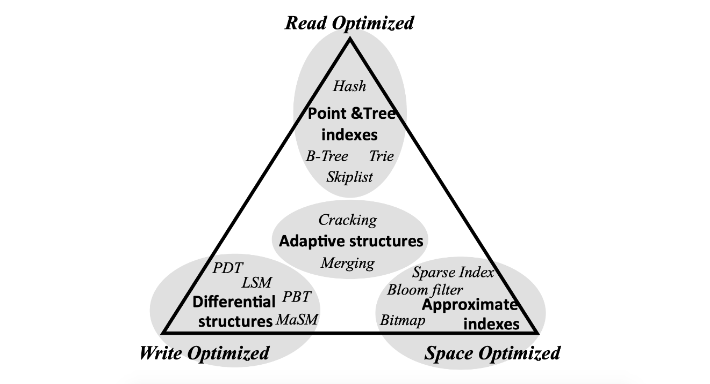
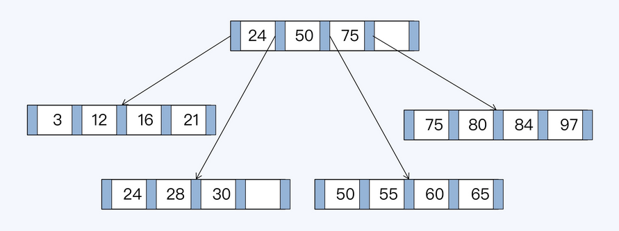
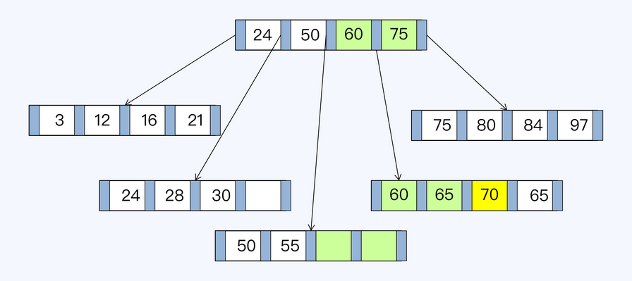

- [Data structures](#data-structures)
  - [Rum Conjecture](#rum-conjecture)
  - [Database data structures](#database-data-structures)
    - [Binary search tree](#binary-search-tree)
    - [Balanced binary  tree](#balanced-binary--tree)
    - [B tree](#b-tree)
    - [B+ Tree](#b-tree-1)
      - [Rum conjecture](#rum-conjecture-1)
      - [Capacity for clustered index - 5M](#capacity-for-clustered-index---5m)
      - [Capacity for unclustered index - 1G](#capacity-for-unclustered-index---1g)
    - [LSM tree](#lsm-tree)
      - [Read-optimization: Compaction](#read-optimization-compaction)
        - [Minor compaction](#minor-compaction)
        - [Major compaction](#major-compaction)
      - [Read steps](#read-steps)

# Data structures
## Rum Conjecture
* For any data structure, Read Overhead, Update Overhead and Memory or Storage Overhead could only satisfy two conditions. 

## Database data structures
* For visualization of different data structures, please refer to https://www.cs.usfca.edu/~galles/visualization/Algorithms.html

### Binary search tree
* Cons: Not balanced, worst case is a list

### Balanced binary  tree
* Based on the idea of binary search tree, with the following improvements:
  * The height difference between left and right child is 1 at maximum
* Cons:
  * Lots of rebalancing during inserting new nodes
  * Each nodes could only store one value while operating system load items from disk in page size (4k).
  * Tree too high which results in large number of IO operations

### B tree
* Based on the idea of binary tree, with the following improvements:
  * Store more values in each node: For a N-degree B tree, 
    * Every non-leaf node (except root) has at least N/2 children nodes.
    * Root node has at least 2 children nodes.
    * Each node has at most N children nodes. 
  * All the leaf nodes stay on the same depth level.
  * B tree is built up in a bottom-up way. Everything is sent into a leaf node first node (in innoDB the leaf node size is 16KB). If the leaf node could not fit, then another leaf node will be created and a node will be promoted as parent. 
* Cons:
  * Non-leaf node stores both data and index. There is really limited data stored on each non-leaf nodes. 

### B+ Tree
* Based on top of B Tree, with the following improvements:
  * Non-leaf nodes only contain index, which enables any non-leaf node  could include more index data and the entire tree will be shorter. 
  * The leaf nodes are linked in a doubly linked list. These links will be used for range query. 

#### Rum conjecture
* Characteristics:
  * B+ tree has write amplification
  * The storage is not continuous

* Initial B+ tree

* B+ tree after insertion

#### Capacity for clustered index - 5M
* Suggested InnoDB record num not bigger than 5 million
* Assumptions: 
  * InnoDB page size for read and write: 16KB. It means that each B+ tree node size is 16KB. 
  * For non-leaf node, suppose that the primary key is an integer (8 Byte / 64 bits) and the address pointer to next level is also 8 bytes / 64 bits. 
  * For leaf node, suppose that record size is 1KB. 
* Capacity in each layer:
  * First/Root layer (Store indexes only): 
    * 1 node with 16 KB / 16 Byte = 1K children
    * 1,024 
  * Second layer (Store indexes only): 
    * 1K node with 1K * 1K = 1M children 
    * 1024 * 1024 = 1,048,576
  * Third layer (Store indexes and record): 
    * Each node could store 16KB / 1KB = 16 records. 
    * In total, there could be
      * 1M * 16 = 16M records stored in an InnoDB table. 
      * Store 1,048,576 * 16 =  16,777,216
    * In practice, each InnoDB usage not bigger than 5 million

#### Capacity for unclustered index - 1G
* Unclustered index approach could store more data because all three layers of tree are indexes. 
  * 1024 * 1024 * 1024 = 1G records

### LSM tree
* Motivation: Optimize read further
* Take LevelDB's LSM tree implementation as an example here
	* Having a Log-Structured Merge-Tree architecture, LevelDB does not store data directly in SST files. It stores new key/value pairs mutations (either additions or deletions) in a log file. This log file is the file with the .log suffix in your leveldb directory. The data stored in the log file is also stored in a memory structure called the memtable.

	* When the log file reaches a certain size (around 4 MB), its content is transferred to a new SST file and a new log file and memtable are initiated, the previous memtable is discarded. Those fresh SST files are collectively called the level 0 files. Files at level 0 are special because their keys can overlap since they are simply copies of the various log files.

	* When the number of files at level 0 reaches a threshold (around 10 files), a compaction is triggered. Compaction will chose a set of overlapping files at level 0 and a set of files they overlap at the next level (level 1) and will merge the data in those files to create a new set of SST files at level 1. The chosen SST files are then discarded.

	* LevelDB continuously inspects files at each level and triggers compactions when the number of files or the total size at a given level goes beyond a set threshold. LevelDB manages 7 levels of files. The list of current SST files is kept in a MANIFEST file. The id of the current MANIFEST file is stored in the CURRENT file. 

	* When reading data, the set of SST files to access is retrieved from the data in the MANIFEST and the required files are opened and the data to read is reconciled from those files and the current memtable, managing overwrites and deletions.

#### Read-optimization: Compaction
##### Minor compaction
* Definition: The process of turning immutable memtable dump into sstable. During this process SSTable will be pushed as further down as possible if
	- No overlap with current level
	- Overlapping with no more than 10 SSTs in the next level

* Trigger for minor compaction:
	- When write new data into level DB, if the current memtable >= default buffer size (4M)

* Steps: 
	1. Convert memtable into sstable format
	2. Determine the level of the new sstable
	3. Put sstable into the selected level

##### Major compaction
* Definition: Merge SSTable in different layers
* Categories:
	- Manual compaction
	- Size compaction: There is a threshold on the size of each level
	- Seek compaction: Each 

#### Read steps
1. Gets the value from memtable
2. If not found within memtable, tries to find it within immutable memtable. 
3. Look inside sstable
	- On level L0, search through each SStable
	- On L1 and up, all sstable is non-overlapped. 

