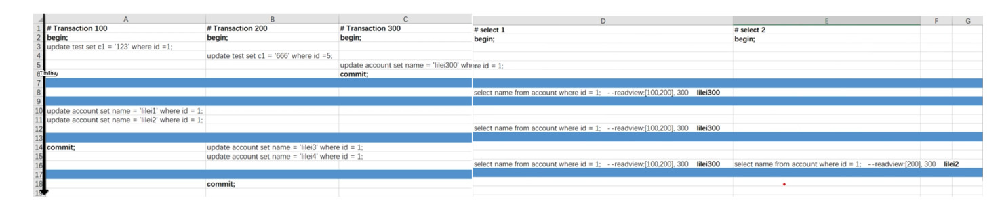

<!-- MarkdownTOC -->

- [MySQL](#mysql)
	- [Internals](#internals)
		- [Overview](#overview)
		- [Pluggable engines](#pluggable-engines)
			- [Selection criteria](#selection-criteria)
			- [Redo logs](#redo-logs)
			- [Undo logs](#undo-logs)
		- [Server layer](#server-layer)
			- [[TODO:::] Binlog](#todo-binlog)
			- [Slow query log](#slow-query-log)
			- [General purpose log](#general-purpose-log)
			- [Relay log](#relay-log)
	- [InnoDB engine](#innodb-engine)
		- [Components](#components)
		- [Index](#index)
			- [Types](#types)
				- [Clustered vs unclustered index](#clustered-vs-unclustered-index)
				- [Primary vs secondary index (same as above)](#primary-vs-secondary-index-same-as-above)
				- [B+ tree vs hash index](#b-tree-vs-hash-index)
			- [Data structures](#data-structures)
				- [Binary search tree](#binary-search-tree)
				- [Balanced binary  tree](#balanced-binary--tree)
				- [B tree](#b-tree)
				- [B+ Tree](#b-tree-1)
					- [Capacity for clustered index - 5M](#capacity-for-clustered-index---5m)
					- [Capacity for unclustered index - 1G](#capacity-for-unclustered-index---1g)
			- [Adaptive hash index](#adaptive-hash-index)
	- [Transaction model](#transaction-model)
		- [ACID and InnoDB](#acid-and-innodb)
		- [Three problems](#three-problems)
			- [Dirty read](#dirty-read)
			- [Non-repeatable read](#non-repeatable-read)
			- [Phantam read](#phantam-read)
		- [Four isolation solution options](#four-isolation-solution-options)
			- [Read uncommitted](#read-uncommitted)
			- [Read committed](#read-committed)
			- [Repeatable read](#repeatable-read)
			- [Serializable](#serializable)
		- [MVCC (multi-version concurrency control)](#mvcc-multi-version-concurrency-control)
			- [Motivation](#motivation)
			- [InnoDB MVCC Interals](#innodb-mvcc-interals)
				- [Example](#example)
		- [[TODO:::] Lock](#todo-lock)
			- [How does InnoDB achieves the isolation level](#how-does-innodb-achieves-the-isolation-level)
			- [Types of lock](#types-of-lock)
				- [Shared lock](#shared-lock)
				- [Exclusive lock](#exclusive-lock)
				- [Intentional shared/exclusive lock](#intentional-sharedexclusive-lock)
				- [Interval lock](#interval-lock)
					- [Record lock](#record-lock)
					- [Gap lock](#gap-lock)
					- [Next-key lock](#next-key-lock)

<!-- /MarkdownTOC -->


# MySQL
## Internals
### Overview

### Pluggable engines
* Theoretically, different tables could be configured with different engines. 
* There are a list of innoDB engines such as Innodb
  * InnoDB: support transaction, support row level lock 
  * MyISAM: not support transaction, only table level lock
  * Archive
  * Memory
  * CSV
  * Federated
  * TokuDB: 
* InnoDB vs MyISAM: 

#### Selection criteria
* Need to support transaction? 
* Need to support hot online backup?
  * mysqldump
  * Innodb is the only engine supports online backup
* Need to support crush recovery?


#### Redo logs
#### Undo logs

### Server layer
#### [TODO:::] Binlog
* Reference: https://coding.imooc.com/lesson/49.html#mid=486

#### Slow query log
#### General purpose log
#### Relay log

## InnoDB engine
### Components


### Index
* Pros:
  * Change random to sequential IO
  * Reduce the amount of data to scan
  * Sort data to avoid using temporary table
* Cons: 
  * Slow down writing speed
  * Increase query optimizer process time

#### Types
##### Clustered vs unclustered index
* Def: If within the index, the leaf node stores the entire data record, then it is a clustered index. "Clustered" literrally means whether the index and data are clustered together. 
* Limitations: 
  * Since a clustered index impacts the physical organization of the data, there can be only one clustered index per table.
  * Since an unclustered index only points to data location, at least two operations need to be performed for accessing data. 
* For example, 
  * mySQL innoDB primary key index is a clustered index (both index and data inside \*.idb file)
  * mySQL myISAM index is an unclustered index (index inside *.myi file and data inside \*.myd file). 
  * Oracle uses unclustered index
* Comparison: 
  * For read queries: Clustered index will typically perform a bit faster because only needs to read disk once (data and index stored together)
  * For write updates/deletes: Unclustered index will typically perform a bit faster because for unclustered index approach, the data part could be written in an append-only fashion and index part could be inserted. 


##### Primary vs secondary index (same as above)
* Def: Primary index points to data and secondary index points to primary key. Primary index will be a clustered index and secondary index will be an unclustered index.  
* Why secondary index only points to primary key: 
	- Save space: Avoid storing copies of data. 
	- Keep data consistency: When there are updates on primary key, all other secondary indexes need to be updated at the same time. 


##### B+ tree vs hash index
* B+ tree index
  * Use case: Used in 99.99% case because it supports different types of queries
* Hash index
  * Use case: Only applicable for == and IN type of query, does not support range query


#### Data structures
* For visualization of different data structures, please refer to https://www.cs.usfca.edu/~galles/visualization/Algorithms.html

##### Binary search tree
* Cons: Not balanced, worst case is a list

##### Balanced binary  tree
* Based on the idea of binary search tree, with the following improvements:
  * The height difference between left and right child is 1 at maximum
* Cons:
  * Lots of rebalancing during inserting new nodes
  * Each nodes could only store one value while operating system load items from disk in page size (4k).
  * Tree too high which results in large number of IO operations

##### B tree
* Based on the idea of binary tree, with the following improvements:
  * Store more values in each node: For a N-degree B tree, 
    * Every non-leaf node (except root) has at least N/2 children nodes.
    * Root node has at least 2 children nodes.
    * Each node has at most N children nodes. 
  * All the leaf nodes stay on the same depth level.
  * B tree is built up in a bottom-up way. Everything is sent into a leaf node first node (in innoDB the leaf node size is 16KB). If the leaf node could not fit, then another leaf node will be created and a node will be promoted as parent. 
* Cons:
  * Non-leaf node stores both data and index. There is really limited data stored on each non-leaf nodes. 


##### B+ Tree
* Based on top of B Tree, with the following improvements:
  * Non-leaf nodes only contain index, which enables any non-leaf node  could include more index data and the entire tree will be shorter. 
  * The leaf nodes are linked in a doubly linked list. These links will be used for range query. 


###### Capacity for clustered index - 5M
* Suggested InnoDB record num not bigger than 5 million
* Assumptions: 
  * InnoDB page size for read and write: 16KB. It means that each B+ tree node size is 16KB. 
  * For non-leaf node, suppose that the primary key is an integer (8 Byte / 64 bits) and the address pointer to next level is also 8 bytes / 64 bits. 
  * For leaf node, suppose that record size is 1KB. 
* Capacity in each layer:
  * First/Root layer (Store indexes only): 
    * 1 node with 16 KB / 16 Byte = 1K children
    * 1,024 
  * Second layer (Store indexes only): 
    * 1K node with 1K * 1K = 1M children 
    * 1024 * 1024 = 1,048,576
  * Third layer (Store indexes and record): 
    * Each node could store 16KB / 1KB = 16 records. 
    * In total, there could be
      * 1M * 16 = 16M records stored in an InnoDB table. 
      * Store 1,048,576 * 16 =  16,777,216
    * In practice, each InnoDB usage not bigger than 5 million

###### Capacity for unclustered index - 1G
* Unclustered index approach could store more data because all three layers of tree are indexes. 
  * 1024 * 1024 * 1024 = 1G records


#### Adaptive hash index


## Transaction model
* There are three problems related to 


### ACID and InnoDB
* InnoDB implements ACID by using undo, redo log and locks
  * Atomic: Undo log is used to record the state before transaction. 
  * Consistency: Redo log is used to record the state after transaction.
  * Isolation: Locks are used for resource isolation. 
  * Durability: Redo log and undo log combined to realize this. 

### Three problems
#### Dirty read
* Def: SQL-transaction T1 modifies a row. SQL-transaction T2 then reads that row before T1 performs a COMMIT. If T1 then performs a ROLLBACK, T2 will have read a row that was never committed and that may thus be considered to have never existed.


#### Non-repeatable read
* Def: P2 ("Non-repeatable read"): SQL-transaction T1 reads a row. SQL-transaction T2 then modifies or deletes that row and performs a COMMIT. If T1 then attempts to reread the row, it may receive the modified value or discover that the row has been deleted. It only applies to UPDATE / DELETE operation. 


#### Phantam read
* Def: SQL-transaction T1 reads the set of rows N that satisfy some <search condition>. SQL-transaction T2 then executes SQL-statements that generate one or more rows that satisfy the <search condition> used by SQL-transaction T1. If SQL-transaction T1 then repeats the initial read with the same <search condition>, it obtains a different collection of rows.


### Four isolation solution options
#### Read uncommitted 
* Def: Not solving any concurrent transaction problems.

#### Read committed
* Def: When a transaction starts, could only see the modifications by the transaction itself. 

#### Repeatable read
* Def: Within a transaction, it always read the same data. 

#### Serializable
* Def: 

### MVCC (multi-version concurrency control)
#### Motivation
* A traditional approach to resolve concurrency control problem is using locks. MVCC eliminates locking so that the processes can run concurrently without blocking each other.
* MVCC has different implementation for different database such as MySQL and PostgreSQL. This section focuses on MySQL's MVCC implemenation. 
* MySQL implements MVCC mechanism for both Read Committed and Repeatable Read isolation level. By default, MySQL uses Repeatable read. 
* MySQL MVCC consists of two components: Data versioning and read view. 

#### InnoDB MVCC Interals
* Undo log uses transaction id for data versioning
* Read view consists of:
  * An array of all uncommitted transaction ids. 
  * Already created max transaction id. 

##### Example
* Repeatable read
  * Read view will only be executed once in a transaction when the first statement executes. This is why #select 2 reads a different value when compared with #select 1. 
  * MySQL will go through the undo log from the latest to the older ones, and use the first log record bigger than its read view as true value. 




* Read committed
  * Read view will be generated each time when a statement is executed. 
  * The rest will stay same as repeatable read. 

### [TODO:::] Lock
* https://study.163.com/course/courseLearn.htm?courseId=1209773843#/learn/video?lessonId=1280438119&courseId=1209773843

#### How does InnoDB achieves the isolation level 
* Lock based concurrency control: Have a lock on the table to block all other transactions. 
* Multi version concurrency control: Before performing a transaction, take a snapshot of the database. 

#### Types of lock
##### Shared lock
* Def: If transaction T1 holds a shared (S) lock on row r, then requests from some distinct transaction T2 for a lock on row r are handled as follows:
	- A request by T2 for an S lock can be granted immediately. As a result, both T1 and T2 hold an S lock on r.
	- A request by T2 for an X lock cannot be granted immediately.
* Operation:
	* Add lock: select * from student where id = 1 **LOCK IN SHARE MODE**
	* Release lock:  commit / rollback
* Example:

```
// an ecommerce order could contain many order_detail. One transaction needs to modify order_detail and don't want other transaction to modify order_info. 

order_detail	N
order_info		1
```

##### Exclusive lock
* Def: If a transaction T1 holds an exclusive (X) lock on row r, a request from some distinct transaction T2 for a lock of either type on r cannot be granted immediately. Instead, transaction T2 has to wait for transaction T1 to release its lock on row r.
* Operation:
	* Add lock:
		- Automatically by default: delete/update/insert will add exclusive lock
		- Add manually: select * from student where id=1 **FOR UPDATE**
	* Release lock: commit / rollback

##### Intentional shared/exclusive lock
* Goal: Improve the efficiency of adding table wise lock
* Operation: Automatically added by database

##### Interval lock


###### Record lock


###### Gap lock


###### Next-key lock


