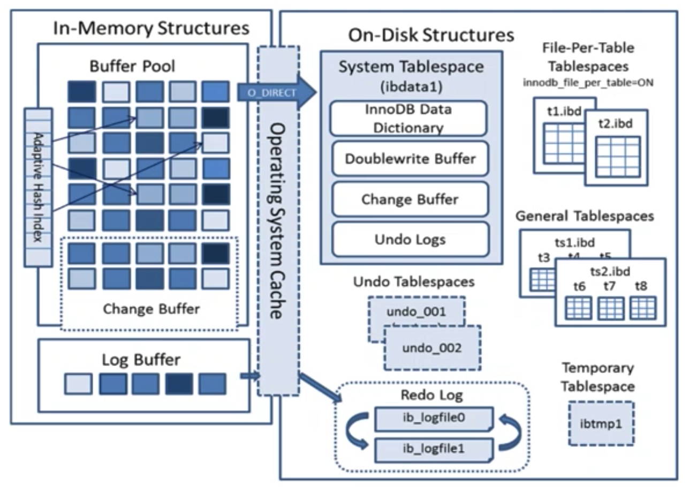
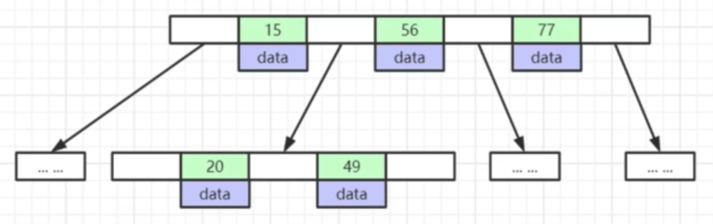
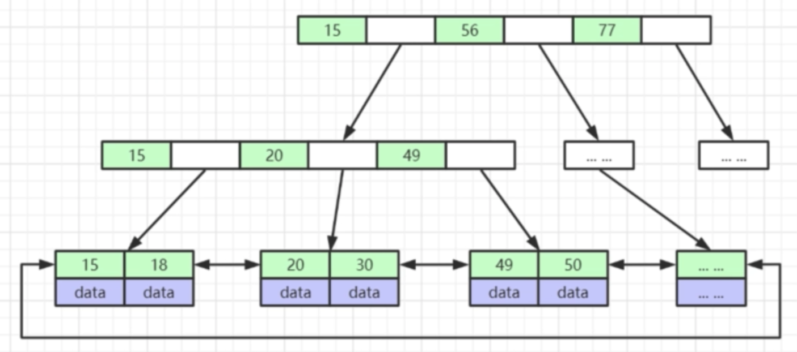
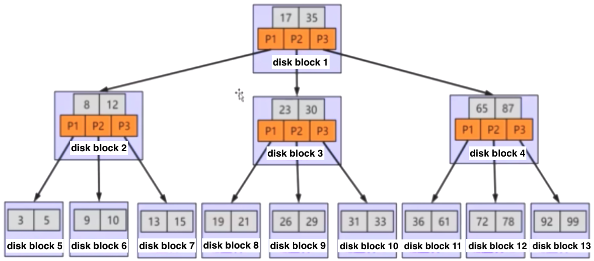
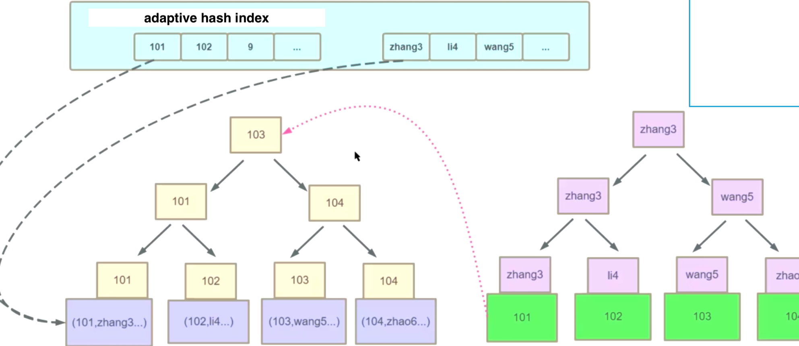
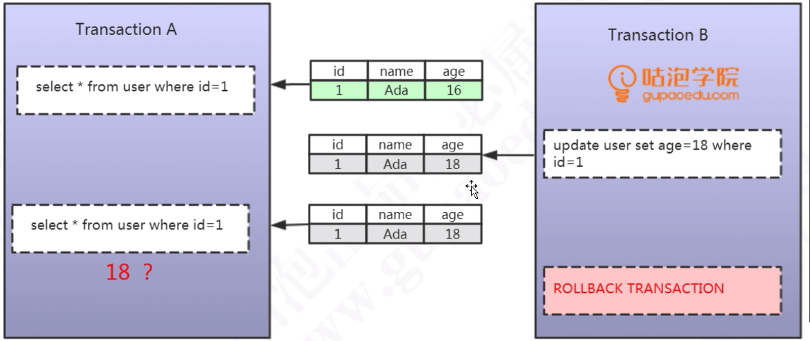
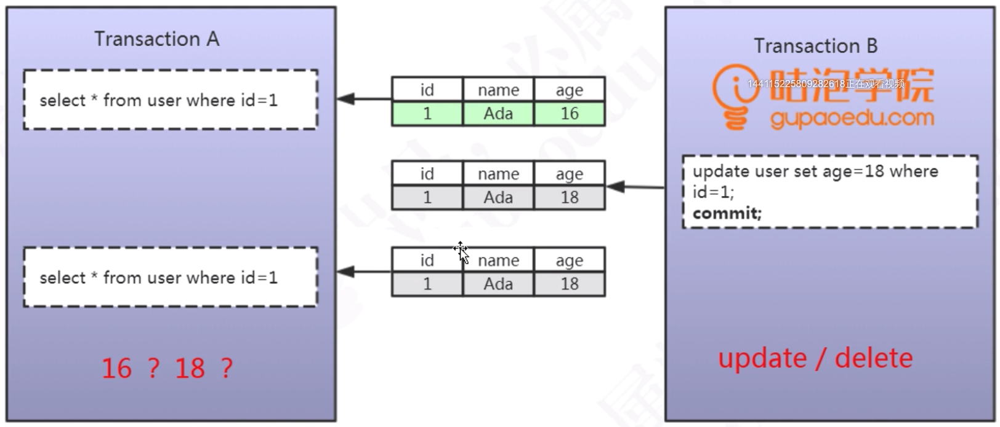
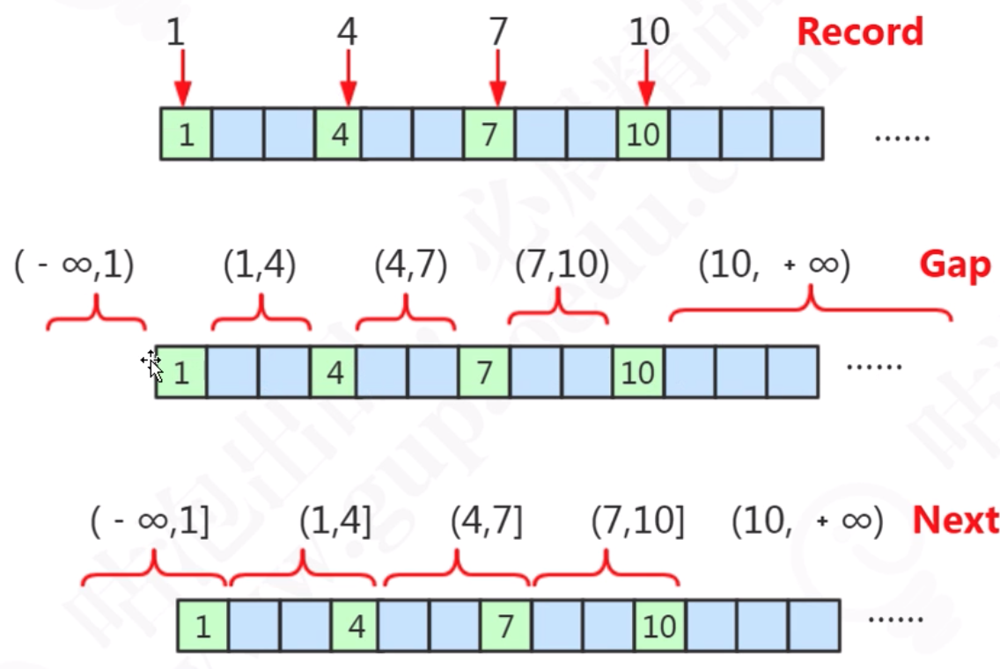

<!-- MarkdownTOC -->

- [MySQL](#mysql)
	- [Internal architecture](#internal-architecture)
		- [Flowchart](#flowchart)
		- [[Todo] Pluggable engines](#todo-pluggable-engines)
			- [Selection criteria](#selection-criteria)
	- [Logs](#logs)
		- [Service layer logs](#service-layer-logs)
			- [[TODO:::] Binlog](#todo-binlog)
			- [Slow query log](#slow-query-log)
			- [General purpose log](#general-purpose-log)
			- [Relay log](#relay-log)
		- [Engine layer logs](#engine-layer-logs)
			- [Redo logs](#redo-logs)
			- [Undo logs](#undo-logs)
	- [InnoDB](#innodb)
		- [Components](#components)
		- [Units for reading and writing](#units-for-reading-and-writing)
			- [Why InnoDB page size 16KB](#why-innodb-page-size-16kb)
		- [Data structures](#data-structures)
			- [Binary search tree](#binary-search-tree)
			- [Balanced binary  tree](#balanced-binary--tree)
			- [B tree](#b-tree)
			- [B+ Tree](#b-tree-1)
		- [Undo log](#undo-log)
		- [Redo log](#redo-log)
	- [Index](#index)
		- [Pros](#pros)
		- [Cons](#cons)
		- [Types](#types)
			- [Primary index vs secondary index](#primary-index-vs-secondary-index)
			- [B Tree Index](#b-tree-index)
				- [Use cases](#use-cases)
				- [Limitations](#limitations)
		- [Optimization](#optimization)
				- [Balanced binary tree](#balanced-binary-tree)
				- [B Tree](#b-tree-2)
				- [B+ tree](#b-tree-3)
			- [Hash index](#hash-index)
				- [Use cases](#use-cases-1)
				- [Limitations](#limitations-1)
		- [[TODO:::] InnoDB index](#todo-innodb-index)
			- [Clustered index](#clustered-index)
				- [Def](#def)
				- [Pros and cons](#pros-and-cons)
			- [Secondary index](#secondary-index)
				- [Pros and cons](#pros-and-cons-1)
			- [Adaptive hash index](#adaptive-hash-index)
			- [Composite index](#composite-index)
			- [Covered index](#covered-index)
	- [[TODO:::] Database transaction](#todo-database-transaction)
		- [Concurrent transaction read problems](#concurrent-transaction-read-problems)
			- [Dirty read](#dirty-read)
			- [Non-repeatable read](#non-repeatable-read)
			- [Phantam read](#phantam-read)
		- [InnoDB isolation level](#innodb-isolation-level)
		- [[TODO:::] Lock](#todo-lock)
			- [How does InnoDB achieves the isolation level](#how-does-innodb-achieves-the-isolation-level)
			- [Types of lock](#types-of-lock)
				- [Shared lock](#shared-lock)
				- [Exclusive lock](#exclusive-lock)
				- [Intentional shared/exclusive lock](#intentional-sharedexclusive-lock)
				- [Interval lock](#interval-lock)
					- [Record lock](#record-lock)
					- [Gap lock](#gap-lock)
					- [Next-key lock](#next-key-lock)

<!-- /MarkdownTOC -->


# MySQL
## Internal architecture
### Flowchart
### [Todo] Pluggable engines
* Theoretically, different tables could be configured with different engines. 
* There are a list of innoDB engines such as Innodb
  * InnoDB: support transaction, support row level lock 
  * MyISAM: not support transaction, only table level lock
  * Archive
  * Memory
  * CSV
  * Federated
  * TokuDB: 
* InnoDB vs MyISAM: 

#### Selection criteria
* Need to support transaction? 
* Need to support hot online backup?
  * mysqldump
  * Innodb is the only engine supports online backup
* Need to support crush recovery?

## Logs
### Service layer logs
#### [TODO:::] Binlog
* Reference: https://coding.imooc.com/lesson/49.html#mid=486

#### Slow query log
#### General purpose log
#### Relay log

### Engine layer logs
#### Redo logs
#### Undo logs

## InnoDB
### Components



### Units for reading and writing
* InnoDB page size for read and write: 16KB
* Operating system page size for read and write: 4KB
* Mechanical disk sector size: 0.5KB
* SSD sector size: 4KB

#### Why InnoDB page size 16KB
* Integer: 8 byte
* Address pointer: 6 byte
* 16kb / (8 + 6) = 1170 children each node
* The total size of leaf nodes: 1170 * 1170 * 16KB = 2GB only has 3 levels in a B+ tree

### Data structures
* For visualization of different data structures, please refer to https://www.cs.usfca.edu/~galles/visualization/Algorithms.html

#### Binary search tree
* Cons: Not balanced, worst case is a list

#### Balanced binary  tree
* Based on the idea of binary search tree, with the following improvements:
  * The height difference between left and right child is 1 at maximum
* Cons:
  * Lots of rebalancing during inserting new nodes
  * Each nodes could only store one value

#### B tree
* Based on the idea of binary tree, with the following improvements:
  * Store more values in each node: For a N-degree B tree, 
    * Every non-leaf node (except root) has at least N/2 children nodes.
    * Root node has at least 2 children nodes.
    * Each node has at most N children nodes. 
  * All the leaf nodes stay on the same depth level.
  * B tree is built up in a bottom-up way. Everything is sent into a leaf node first node (in innoDB the leaf node size is 16KB). If the leaf node could not fit, then another leaf node will be created and a node will be promoted as parent. 
* Cons:
  * Non-leaf node stores both data and index. There is really limited data stored on each non-leaf nodes. 



#### B+ Tree
* Based on top of B Tree, with the following improvements:
  * Non-leaf nodes only contain index, which enables any non-leaf node  could include more index data and the entire tree will be shorter. 
  * The leaf nodes are linked in a doubly linked list. These links will be used for range query. 



### Undo log

### Redo log

## Index
### Pros
* Change random to sequential IO
* Reduce the amount of data to scan
* Sort data to avoid using temporary table

### Cons
* Slow down writing speed
* Increase query optimizer process time

### Types
#### Primary index vs secondary index
* Secondary index leaf nodes point to a primary index

#### B Tree Index
* Implemented on top of B+ tree

##### Use cases
* Whole word match, e.g. order_id = "12345"
* Match left prefix, e.g. order_id like "9876%"
* Range query, e.g. order_id < "9876" and order_id > "1234"

##### Limitations
* If range query is applied on a column, then all column to the right could not use index. 
* NOT IN and <> operator could not use index
* Must include the column which has index

* https://coding.imooc.com/lesson/49.html#mid=439

### Optimization 
* Don't use function or expression on index column

```
// Original query:
select ... from product
where to_days(out_date) - to_days(current_date) <= 30

// Improved query:
select ... from product
where out_date <= date_add(current_date, interval 30 day)
```

* [Where to set up index](https://www.freecodecamp.org/news/database-indexing-at-a-glance-bb50809d48bd/)
  * On columns not changing often
  * On columns which have high cardinality
  * Automatically increase id is a good candidate to set up B tree. 

* Composite index
  * Which column comes first
    1. Most frequently used column
    2. High cardinality
    3. Low width 

* Covered index
  * Pros:
    * Avoid second-time query on Innodb primary key
    * Optimize cache and reduce disk IO operations
    * Reduce random IO and change to sequential IO
    * Reduce system call on MyISAM table
  * Cons (Some conditions that covered index does not apply):
    * There are some db engine which does not support covered index
    * When too many columns are used, then not possible to use covered index
    * Use double % like query

##### Balanced binary tree
* Why not balanced binary tree
	- Tree too high which results in large number of IO operations
	- Operating system load items from disk in page size (4k). 

##### B Tree
* How does B Tree solve the above problem
	- Control the height of tree. The number of children is the number of key word - 1. 
	- B tree stores data inside 



* Limitations:
  * 

##### B+ tree 
* Pros compared with B tree
	- There is no data field inside non-leaf nodes. So have better IO capability
	- Only needs to look at leaf nodes. So have better range query capability (Does not need to move up and down in a tree


#### Hash index
##### Use cases
##### Limitations
* Hash index must be used twice for looking up a value
* Hash index could not be used for sorting or range queries

### [TODO:::] InnoDB index
* https://study.163.com/course/courseLearn.htm?courseId=1209773843#/learn/video?lessonId=1280444063&courseId=1209773843

#### Clustered index
##### Def
* A clustered index is collocated with the data in the same table space or same disk file. You can consider that a clustered index is a B-Tree index whose leaf nodes are the actual data blocks on disk, since the index & data reside together. This kind of index physically organizes the data on disk as per the logical order of the index key.
* Within innoDB, the MySQL InnoDB engine actually manages the primary index as clustered index for improving performance, so the primary key & the actual record on disk are clustered together.
	- When you define a PRIMARY KEY on your table, InnoDB uses it as the clustered index. Define a primary key for each table that you create. If there is no logical unique and non-null column or set of columns, add a new auto-increment column, whose values are filled in automatically.	
	- If you do not define a PRIMARY KEY for your table, MySQL locates the first UNIQUE index where all the key columns are NOT NULL and InnoDB uses it as the clustered index.
	- If the table has no PRIMARY KEY or suitable UNIQUE index, InnoDB internally generates a hidden clustered index named GEN_CLUST_INDEX on a synthetic column containing row ID values. The rows are ordered by the ID that InnoDB assigns to the rows in such a table. The row ID is a 6-byte field that increases monotonically as new rows are inserted. Thus, the rows ordered by the row ID are physically in insertion order.

##### Pros and cons
* Pros: 
	- This ordering or co-location of related data actually makes a clustered index faster. When data is fetched from disk, the complete block containing the data is read by the system since our disk IO system writes & reads data in blocks. So in case of range queries, it’s quite possible that the collocated data is buffered in memory. This is especially true for range queries. 
- Cons: 
	- Since a clustered index impacts the physical organization of the data, there can be only one clustered index per table.

#### Secondary index
* Why secondary key does not directly point to data, instead it needs to point to primary key
	- when there are updates on primary key, it will need to modify all other secondary index if that's the case. 


##### Pros and cons
* Pros: Logically you can create as many secondary indices as you want. But in reality how many indices actually required needs a serious thought process since each index has its own penalty.
* Cons: 
	- With DML operations like DELETE / INSERT , the secondary index also needs to be updated so that the copy of the primary key column can be deleted / inserted. In such cases, the existence of lots of secondary indexes can create issues.
	- Also, if a primary key is very large like a URL, since secondary indexes contain a copy of the primary key column value, it can be inefficient in terms of storage. More secondary keys means a greater number of duplicate copies of the primary key column value, so more storage in case of a large primary key. Also the primary key itself stores the keys, so the combined effect on storage will be very high.


#### Adaptive hash index



#### Composite index
* Def: Multiple column builds a single index. MySQL lets you define indices on multiple columns, up to 16 columns. This index is called a Multi-column / Composite / Compound index.
* When you need a composite index
	- Analyze your queries first according to your use cases. If you see certain fields are appearing together in many queries, you may consider creating a composite index.
	- If you are creating an index in col1 & a composite index in (col1, col2), then only the composite index should be fine. col1 alone can be served by the composite index itself since it’s a left side prefix of the index.
	- Consider cardinality. If columns used in the composite index end up having high cardinality together, they are good candidate for the composite index.

#### Covered index
* A covering index is a special kind of composite index where all the columns specified in the query somewhere exist in the index. So the query optimizer does not need to hit the database to get the data — rather it gets the result from the index itself. 


## [TODO:::] Database transaction
* MySQL database engine: https://dev.mysql.com/doc/refman/8.0/en/storage-engines.html
* InnoDB supports transaction
* https://study.163.com/course/courseLearn.htm?courseId=1209773843#/learn/video?lessonId=1280437154&courseId=1209773843

### Concurrent transaction read problems

#### Dirty read
* Def: SQL-transaction T1 modifies a row. SQL-transaction T2 then reads that row before T1 performs a COMMIT. If T1 then performs a ROLLBACK, T2 will have read a row that was never committed and that may thus be considered to have never existed.



#### Non-repeatable read
* Def: P2 ("Non-repeatable read"): SQL-transaction T1 reads a row. SQL-transaction T2 then modifies or deletes that row and performs a COMMIT. If T1 then attempts to reread the row, it may receive the modified value or discover that the row has been deleted. It only applies to UPDATE / DELETE operation. 



#### Phantam read
* Def: SQL-transaction T1 reads the set of rows N that satisfy some <search condition>. SQL-transaction T2 then executes SQL-statements that generate one or more rows that satisfy the <search condition> used by SQL-transaction T1. If SQL-transaction T1 then repeats the initial read with the same <search condition>, it obtains a different collection of rows.


### InnoDB isolation level
* Four types
	* Read uncommitted: 
		- Not solving any concurrent transaction problems.
	* Read committed: When a transaction starts, could only see the modifications by the transaction itself. 
		- Could solve dirty read problems. Not non-repeatable and phantom read problem. 
	* Repeatable read: Within a transaction, it always read the same data. 
		- Could solve non-repeatable read problems. Not phantom read problem. 
	* Serializable: 
		- Could solve all problems. 

* Default isolation level is RR
* InnoDB could avoid Phantom RR due to phantom read


### [TODO:::] Lock
* https://study.163.com/course/courseLearn.htm?courseId=1209773843#/learn/video?lessonId=1280438119&courseId=1209773843

#### How does InnoDB achieves the isolation level 
* Lock based concurrency control: Have a lock on the table to block all other transactions. 
* Multi version concurrency control: Before performing a transaction, take a snapshot of the database. 

#### Types of lock
##### Shared lock
* Def: If transaction T1 holds a shared (S) lock on row r, then requests from some distinct transaction T2 for a lock on row r are handled as follows:
	- A request by T2 for an S lock can be granted immediately. As a result, both T1 and T2 hold an S lock on r.
	- A request by T2 for an X lock cannot be granted immediately.
* Operation:
	* Add lock: select * from student where id = 1 **LOCK IN SHARE MODE**
	* Release lock:  commit / rollback
* Example:

```
// an ecommerce order could contain many order_detail. One transaction needs to modify order_detail and don't want other transaction to modify order_info. 

order_detail	N
order_info		1
```

##### Exclusive lock
* Def: If a transaction T1 holds an exclusive (X) lock on row r, a request from some distinct transaction T2 for a lock of either type on r cannot be granted immediately. Instead, transaction T2 has to wait for transaction T1 to release its lock on row r.
* Operation:
	* Add lock:
		- Automatically by default: delete/update/insert will add exclusive lock
		- Add manually: select * from student where id=1 **FOR UPDATE**
	* Release lock: commit / rollback

##### Intentional shared/exclusive lock
* Goal: Improve the efficiency of adding table wise lock
* Operation: Automatically added by database

##### Interval lock


###### Record lock


###### Gap lock


###### Next-key lock


