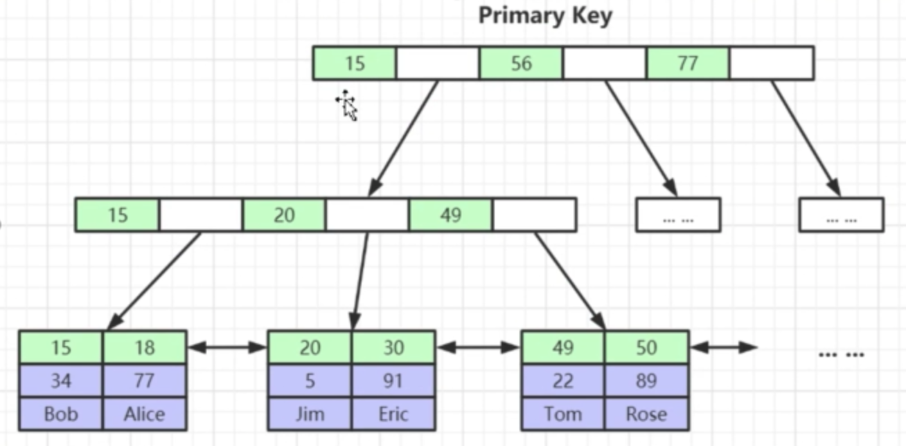
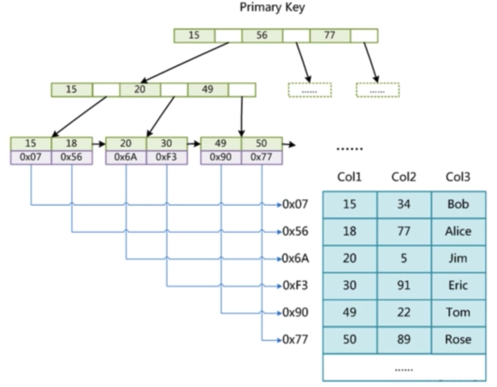

<!-- MarkdownTOC -->

- [MySQL](#mysql)
	- [Internal architecture](#internal-architecture)
		- [Flowchart](#flowchart)
		- [[Todo] Pluggable engines](#todo-pluggable-engines)
			- [Selection criteria](#selection-criteria)
	- [InnoDB engine](#innodb-engine)
		- [Components](#components)
		- [Index](#index)
			- [Types](#types)
				- [Clustered vs unclustered index](#clustered-vs-unclustered-index)
				- [Primary vs secondary index (same as above)](#primary-vs-secondary-index-same-as-above)
				- [B+ tree vs hash index](#b-tree-vs-hash-index)
			- [Data structures](#data-structures)
				- [Binary search tree](#binary-search-tree)
				- [Balanced binary  tree](#balanced-binary--tree)
				- [B tree](#b-tree)
				- [B+ Tree](#b-tree-1)
					- [Suggested InnoDB record num not bigger than 5 million](#suggested-innodb-record-num-not-bigger-than-5-million)
		- [Best practices](#best-practices)
			- [Primary key](#primary-key)
				- [Always define a primary key for each table](#always-define-a-primary-key-for-each-table)
				- [Use auto-increment int column when possible](#use-auto-increment-int-column-when-possible)
			- [Left prefix](#left-prefix)
			- [Patterns to avoid](#patterns-to-avoid)
			- [Adaptive hash index](#adaptive-hash-index)
			- [Composite index](#composite-index)
			- [Covered index](#covered-index)
	- [Logs](#logs)
		- [Service layer logs](#service-layer-logs)
			- [[TODO:::] Binlog](#todo-binlog)
			- [Slow query log](#slow-query-log)
			- [General purpose log](#general-purpose-log)
			- [Relay log](#relay-log)
		- [Engine layer logs](#engine-layer-logs)
			- [Redo logs](#redo-logs)
			- [Undo logs](#undo-logs)
	- [[TODO:::] Database transaction](#todo-database-transaction)
		- [Concurrent transaction read problems](#concurrent-transaction-read-problems)
			- [Dirty read](#dirty-read)
			- [Non-repeatable read](#non-repeatable-read)
			- [Phantam read](#phantam-read)
		- [InnoDB isolation level](#innodb-isolation-level)
		- [[TODO:::] Lock](#todo-lock)
			- [How does InnoDB achieves the isolation level](#how-does-innodb-achieves-the-isolation-level)
			- [Types of lock](#types-of-lock)
				- [Shared lock](#shared-lock)
				- [Exclusive lock](#exclusive-lock)
				- [Intentional shared/exclusive lock](#intentional-sharedexclusive-lock)
				- [Interval lock](#interval-lock)
					- [Record lock](#record-lock)
					- [Gap lock](#gap-lock)
					- [Next-key lock](#next-key-lock)

<!-- /MarkdownTOC -->


# MySQL
## Internal architecture
### Flowchart
### [Todo] Pluggable engines
* Theoretically, different tables could be configured with different engines. 
* There are a list of innoDB engines such as Innodb
  * InnoDB: support transaction, support row level lock 
  * MyISAM: not support transaction, only table level lock
  * Archive
  * Memory
  * CSV
  * Federated
  * TokuDB: 
* InnoDB vs MyISAM: 

#### Selection criteria
* Need to support transaction? 
* Need to support hot online backup?
  * mysqldump
  * Innodb is the only engine supports online backup
* Need to support crush recovery?

## InnoDB engine
### Components


### Index
* Pros:
  * Change random to sequential IO
  * Reduce the amount of data to scan
  * Sort data to avoid using temporary table
* Cons: 
  * Slow down writing speed
  * Increase query optimizer process time

#### Types
##### Clustered vs unclustered index
* Def: If within the index, the leaf node stores the entire data record, then it is a clustered index. "Clustered" literrally means whether the index and data are clustered together. 
* Limitations: 
  * Since a clustered index impacts the physical organization of the data, there can be only one clustered index per table.
  * Since an unclustered index only points to data location, at least two operations need to be performed for accessing data. 
* For example, mySQL innoDB primary key index is a clustered index (both index and data inside *.idb file). mySQL myISAM index is an unclustered index (index inside *.myi file and data inside *.myd file). Clustered index will typically perform a bit faster than unclustered index. 





##### Primary vs secondary index (same as above)
* Def: Primary index points to data and secondary index points to primary index. Primary index will be a clustered index and secondary index will be an unclustered index.  
* Why secondary index only points to primary key: 
	- Save space: Avoid storing copies of data. 
	- Keep data consistency: When there are updates on primary key, all other secondary indexes need to be updated at the same time. 


##### B+ tree vs hash index
* B+ tree index
  * Use case: Used in 99.99% case because it supports different types of queries
* Hash index
  * Use case: Only applicable for == and IN type of query, does not support range query

#### Data structures
* For visualization of different data structures, please refer to https://www.cs.usfca.edu/~galles/visualization/Algorithms.html

##### Binary search tree
* Cons: Not balanced, worst case is a list

##### Balanced binary  tree
* Based on the idea of binary search tree, with the following improvements:
  * The height difference between left and right child is 1 at maximum
* Cons:
  * Lots of rebalancing during inserting new nodes
  * Each nodes could only store one value while operating system load items from disk in page size (4k).
  * Tree too high which results in large number of IO operations

##### B tree
* Based on the idea of binary tree, with the following improvements:
  * Store more values in each node: For a N-degree B tree, 
    * Every non-leaf node (except root) has at least N/2 children nodes.
    * Root node has at least 2 children nodes.
    * Each node has at most N children nodes. 
  * All the leaf nodes stay on the same depth level.
  * B tree is built up in a bottom-up way. Everything is sent into a leaf node first node (in innoDB the leaf node size is 16KB). If the leaf node could not fit, then another leaf node will be created and a node will be promoted as parent. 
* Cons:
  * Non-leaf node stores both data and index. There is really limited data stored on each non-leaf nodes. 


##### B+ Tree
* Based on top of B Tree, with the following improvements:
  * Non-leaf nodes only contain index, which enables any non-leaf node  could include more index data and the entire tree will be shorter. 
  * The leaf nodes are linked in a doubly linked list. These links will be used for range query. 


###### Suggested InnoDB record num not bigger than 5 million
* Assumptions: 
  * InnoDB page size for read and write: 16KB. It means that each B+ tree node size is 16KB. 
  * For non-leaf node, suppose that the primary key is an integer (8 Byte / 64 bits) and the address pointer to next level is also 8 bytes / 64 bits. 
  * For leaf node, suppose that record size is 1KB. 
* Capacity in each layer:
  * First/Root layer (Store indexes only): 
    * 1 node with 16 KB / 16 Byte = 1K children
    * 1,024 
  * Second layer (Store indexes only): 
    * 1K node with 1K * 1K = 1M children 
    * 1024 * 1024 = 1,048,576
  * Third layer (Store indexes and record): 
    * Each node could store 16KB / 1KB = 16 records. 
    * In total, there could be
      * 1M * 16 = 16M records stored in an InnoDB table. 
      * Store 1,048,576 * 16 =  16,777,216
    * In practice, each InnoDB usage not bigger than 5 million

### Best practices
#### Primary key
##### Always define a primary key for each table
1. When PRIMARY KEY is defined, InnoDB uses primary key index as the clustered index. 
2. When PRIMARY KEY is not defined, InnoDB will use the first UNIQUE index where all the key columns are NOT NULL and InnoDB uses it as the clustered index.
3. When PRIMRARY KEY is not defined and there is no logical unique and non-null column or set of columns, InnoDB internally generates a hidden clustered index named GEN_CLUST_INDEX on a synthetic column containing ROWID values. The rows are ordered by the ID that InnoDB assigns to the rows in such a table. The ROWID is a 6-byte field that increases monotonically as new rows are inserted. Thus, the rows ordered by the row ID are physically in insertion order.

##### Use auto-increment int column when possible
* Why prefer auto-increment over random (e.g. UUID)? 
  * In most cases, primary index uses B+ tree index. 
  * For B+ tree index, if a new record has an auto-increment primary key, then it could be directly appended in the leaf node layer. Otherwise, B+ tree node split and rebalance would need to be performed. 
* Why int versus other types (string, composite primary key)?
  * Smaller footprint: Primary key will be stored within each B tree index node, making indexes sparser. Things like composite index or string based primary key will result in less index data being stored in every node. 

#### Left prefix
* Whole word match, e.g. order_id = "12345"
* Match left prefix, e.g. order_id like "9876%"
* Range query, e.g. order_id < "9876" and order_id > "1234"

#### Patterns to avoid
* If range query is applied on a column, then all column to the right could not use index. 
* NOT IN and <> operator could not use index
* Must include the column which has index

* https://coding.imooc.com/lesson/49.html#mid=439
* Don't use function or expression on index column

```
// Original query:
select ... from product
where to_days(out_date) - to_days(current_date) <= 30

// Improved query:
select ... from product
where out_date <= date_add(current_date, interval 30 day)
```

* [Where to set up index](https://www.freecodecamp.org/news/database-indexing-at-a-glance-bb50809d48bd/)
  * On columns not changing often
  * On columns which have high cardinality
  * Automatically increase id is a good candidate to set up B tree. 

* Composite index
  * Which column comes first
    1. Most frequently used column
    2. High cardinality
    3. Low width 

* Covered index
  * Pros:
    * Avoid second-time query on Innodb primary key
    * Optimize cache and reduce disk IO operations
    * Reduce random IO and change to sequential IO
    * Reduce system call on MyISAM table
  * Cons (Some conditions that covered index does not apply):
    * There are some db engine which does not support covered index
    * When too many columns are used, then not possible to use covered index
    * Use double % like query

#### Adaptive hash index


#### Composite index
* Def: Multiple column builds a single index. MySQL lets you define indices on multiple columns, up to 16 columns. This index is called a Multi-column / Composite / Compound index.
* When you need a composite index
	- Analyze your queries first according to your use cases. If you see certain fields are appearing together in many queries, you may consider creating a composite index.
	- If you are creating an index in col1 & a composite index in (col1, col2), then only the composite index should be fine. col1 alone can be served by the composite index itself since it’s a left side prefix of the index.
	- Consider cardinality. If columns used in the composite index end up having high cardinality together, they are good candidate for the composite index.

#### Covered index
* A covering index is a special kind of composite index where all the columns specified in the query somewhere exist in the index. So the query optimizer does not need to hit the database to get the data — rather it gets the result from the index itself. 


## Logs
### Service layer logs
#### [TODO:::] Binlog
* Reference: https://coding.imooc.com/lesson/49.html#mid=486

#### Slow query log
#### General purpose log
#### Relay log

### Engine layer logs
#### Redo logs
#### Undo logs

## [TODO:::] Database transaction
* MySQL database engine: https://dev.mysql.com/doc/refman/8.0/en/storage-engines.html
* InnoDB supports transaction
* https://study.163.com/course/courseLearn.htm?courseId=1209773843#/learn/video?lessonId=1280437154&courseId=1209773843


### Concurrent transaction read problems

#### Dirty read
* Def: SQL-transaction T1 modifies a row. SQL-transaction T2 then reads that row before T1 performs a COMMIT. If T1 then performs a ROLLBACK, T2 will have read a row that was never committed and that may thus be considered to have never existed.


#### Non-repeatable read
* Def: P2 ("Non-repeatable read"): SQL-transaction T1 reads a row. SQL-transaction T2 then modifies or deletes that row and performs a COMMIT. If T1 then attempts to reread the row, it may receive the modified value or discover that the row has been deleted. It only applies to UPDATE / DELETE operation. 


#### Phantam read
* Def: SQL-transaction T1 reads the set of rows N that satisfy some <search condition>. SQL-transaction T2 then executes SQL-statements that generate one or more rows that satisfy the <search condition> used by SQL-transaction T1. If SQL-transaction T1 then repeats the initial read with the same <search condition>, it obtains a different collection of rows.


### InnoDB isolation level
* Four types
	* Read uncommitted: 
		- Not solving any concurrent transaction problems.
	* Read committed: When a transaction starts, could only see the modifications by the transaction itself. 
		- Could solve dirty read problems. Not non-repeatable and phantom read problem. 
	* Repeatable read: Within a transaction, it always read the same data. 
		- Could solve non-repeatable read problems. Not phantom read problem. 
	* Serializable: 
		- Could solve all problems. 

* Default isolation level is RR
* InnoDB could avoid Phantom RR due to phantom read


### [TODO:::] Lock
* https://study.163.com/course/courseLearn.htm?courseId=1209773843#/learn/video?lessonId=1280438119&courseId=1209773843

#### How does InnoDB achieves the isolation level 
* Lock based concurrency control: Have a lock on the table to block all other transactions. 
* Multi version concurrency control: Before performing a transaction, take a snapshot of the database. 

#### Types of lock
##### Shared lock
* Def: If transaction T1 holds a shared (S) lock on row r, then requests from some distinct transaction T2 for a lock on row r are handled as follows:
	- A request by T2 for an S lock can be granted immediately. As a result, both T1 and T2 hold an S lock on r.
	- A request by T2 for an X lock cannot be granted immediately.
* Operation:
	* Add lock: select * from student where id = 1 **LOCK IN SHARE MODE**
	* Release lock:  commit / rollback
* Example:

```
// an ecommerce order could contain many order_detail. One transaction needs to modify order_detail and don't want other transaction to modify order_info. 

order_detail	N
order_info		1
```

##### Exclusive lock
* Def: If a transaction T1 holds an exclusive (X) lock on row r, a request from some distinct transaction T2 for a lock of either type on r cannot be granted immediately. Instead, transaction T2 has to wait for transaction T1 to release its lock on row r.
* Operation:
	* Add lock:
		- Automatically by default: delete/update/insert will add exclusive lock
		- Add manually: select * from student where id=1 **FOR UPDATE**
	* Release lock: commit / rollback

##### Intentional shared/exclusive lock
* Goal: Improve the efficiency of adding table wise lock
* Operation: Automatically added by database

##### Interval lock


###### Record lock


###### Gap lock


###### Next-key lock


