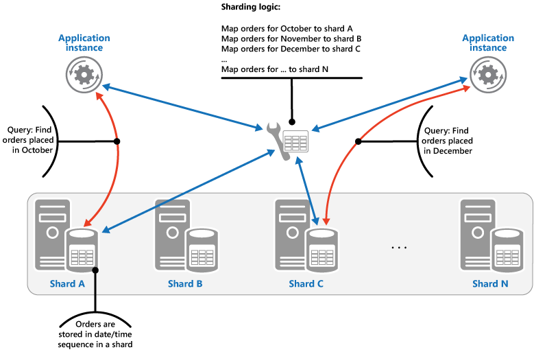
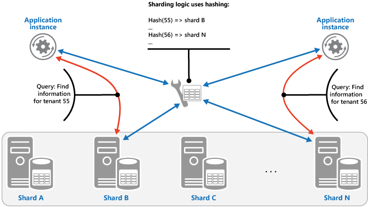

- [MySQL Scalability](#mysql-scalability)
	- [Problem overview](#problem-overview)
		- [Total data volume possible to fit in a single machine but too many  concurrent requests](#total-data-volume-possible-to-fit-in-a-single-machine-but-too-many--concurrent-requests)
		- [Lots of applications, Total data volume too large for any single machine, high concurrent requests](#lots-of-applications-total-data-volume-too-large-for-any-single-machine-high-concurrent-requests)
		- [Single table data volume too large for any single machine, high concurrent requests](#single-table-data-volume-too-large-for-any-single-machine-high-concurrent-requests)
	- [High availability](#high-availability)
		- [[TODO:::] Monitor](#todo-monitor)
		- [Handle old data - Archive](#handle-old-data---archive)
			- [Use case](#use-case)
			- [Implementation](#implementation)
			- [Flowchart](#flowchart)
		- [[TODO:::] Backup](#todo-backup)
		- [Handle traffic spike](#handle-traffic-spike)
			- [Use case](#use-case-1)
			- [Use case study - Prevent oversell](#use-case-study---prevent-oversell)
				- [V1: Serializable DB isolation](#v1-serializable-db-isolation)
				- [V2: Optimistic lock](#v2-optimistic-lock)
				- [V3: Put inventory number inside Redis](#v3-put-inventory-number-inside-redis)
		- [Read high availability with replication](#read-high-availability-with-replication)
			- [Types](#types)
				- [Based on replication delay](#based-on-replication-delay)
				- [[TODO:::] Based on synchronization methods](#todo-based-on-synchronization-methods)
			- [Replication delay](#replication-delay)
				- [Def](#def)
				- [Delay sources](#delay-sources)
				- [[TODO:::] Solutions for master slave delay](#todo-solutions-for-master-slave-delay)
				- [[TODO:::] How binlog format impacts inconsistency](#todo-how-binlog-format-impacts-inconsistency)
		- [[TODO:::] Write high availability](#todo-write-high-availability)
			- [Sun shared drive or DRDB disk replication](#sun-shared-drive-or-drdb-disk-replication)
			- [PXC (multi-write)](#pxc-multi-write)
			- [NDB ()](#ndb-)
			- [Failover based on replication](#failover-based-on-replication)
				- [Challenges](#challenges)
				- [Approaches](#approaches)
				- [[TODO:::] Solution 1: MMM (Multi-master replication manager)](#todo-solution-1-mmm-multi-master-replication-manager)
				- [[TODO:::] Solution 2: MHA (Master high availability)](#todo-solution-2-mha-master-high-availability)
	- [Data partition](#data-partition)
		- [Table partition](#table-partition)
			- [Vertical partition](#vertical-partition)
				- [How](#how)
			- [Horizontal partition](#horizontal-partition)
				- [When](#when)
		- [DB Sharding](#db-sharding)
			- [Pros](#pros)
			- [Cons](#cons)
				- [Write across shards](#write-across-shards)
				- [Query Cross shard](#query-cross-shard)
				- [Challenges in Graph DB sharding](#challenges-in-graph-db-sharding)
			- [Choose the number of shards](#choose-the-number-of-shards)
			- [Sharding stratgies](#sharding-stratgies)
				- [Lookup strategy](#lookup-strategy)
				- [Range strategy](#range-strategy)
					- [By customer or tenant](#by-customer-or-tenant)
					- [By geography](#by-geography)
					- [By time](#by-time)
				- [Hash strategy](#hash-strategy)
					- [By entity id](#by-entity-id)
			- [Best practices](#best-practices)
	- [Overall architecture - Replication + PXC + Sharding proxy](#overall-architecture---replication--pxc--sharding-proxy)
		- [Sharding proxy (using MyCat)](#sharding-proxy-using-mycat)
		- [PXC cluster](#pxc-cluster)
		- [Replication cluster](#replication-cluster)
	- [Real world](#real-world)
		- [Wechat Red pocket](#wechat-red-pocket)
		- [WePay MySQL high availability](#wepay-mysql-high-availability)
		- [High availability at Github](#high-availability-at-github)

# MySQL Scalability 
## Problem overview
### Total data volume possible to fit in a single machine but too many  concurrent requests
1. Add cache layer before MySQL
2. Add read write separation in MySQL layer (by DB middleware)

### Lots of applications, Total data volume too large for any single machine, high concurrent requests
* Could not use multi-master because large number of data volume to fix in a single machine.
* Sharding to rescue (by DB middleware)

### Single table data volume too large for any single machine, high concurrent requests
* Partition / Sharding to rescue (by DB middleware)

## High availability
* https://coding.imooc.com/lesson/49.html#mid=494

### [TODO:::] Monitor
* Monitor is in place to catch the issue early
* https://coding.imooc.com/lesson/49.html#mid=505


### Handle old data - Archive
* Archive old data in time and save disk space

#### Use case
* If a single SQL table's size exceeds 20M rows, then its performance will be slow. Partitioning and Sharding have already been applied. Due to the use cases, there are some hot and cold data, e.g. ecommerce website orders.

#### Implementation
* MySQL engine for archiving
  * InnoDB is based on B+ tree, each time a write happens, the clustered index will need to modified again. The high traffic during archiving process decides that InnoDB will not be a great fit. 
  * TukoDB has higher write performance
* Create archiving tables

```
CREATE Table t_orders_2021_03 {
	...
} Engine = TokuDB;
```

* Pt-archiver: One of the utils of Percona-toolkit and used to archive rows from a MySQL table into another table or a file. https://www.percona.com/doc/percona-toolkit/LATEST/pt-archiver.html

#### Flowchart

```
┌──────────────────────────┐                                                                                        
│         Shard A          │                              ┌ ─ ─ ─ ─ ─ ─ ─ ─ ─ ─ ─ ─ ─ ─ ─ ─ ┐                       
│                          │                                                                                        
│   ┌─────────────────┐    │                              │                                 │                       
│   │                 │    │                                                                                        
│   │    Cold data    │────┼──┐                           │                                 │                       
│   │                 │    │  │                               ┌──────────────────────────┐          ┌──────────────┐
│   └─────────────────┘    │  │                           │   │         HA Proxy         │  │       │              │
│                          │  │                               │                          │          │              │
│   ┌─────────────────┐    │  │                           │   │  ┌───────────────────┐   │  │       │  Archive DB  │
│   │                 │    │  │                               │  │    Keepalived     │   │      ┌──▶│              │
│   │    Hot data     │    │  │                           │   │  └───────────────────┘   │  │   │   │              │
│   │                 │    │  │                               │                          │      │   │              │
│   └─────────────────┘    │  │       ┌──────────────┐    │   └──────────────────────────┘  │   │   └──────────────┘
│                          │  │       │              │                                          │                   
│                          │  │       │              │    │                                 │   │                   
└──────────────────────────┘  │       │  Virtual IP  │                                          │                   
                              ├──────▶│   address    │───▶│                                 │───┤                   
┌──────────────────────────┐  │       │              │                                          │                   
│         Shard Z          │  │       │              │    │   ┌──────────────────────────┐  │   │   ┌──────────────┐
│                          │  │       └──────────────┘        │         HA Proxy         │      │   │              │
│   ┌─────────────────┐    │  │                           │   │                          │  │   │   │              │
│   │                 │    │  │                               │   ┌───────────────────┐  │      │   │  Archive DB  │
│   │    Cold data    │────┼──┘                           │   │   │    Keepalived     │  │  │   └──▶│              │
│   │                 │    │                                  │   └───────────────────┘  │          │              │
│   └─────────────────┘    │                              │   │                          │  │       │              │
│                          │                                  └──────────────────────────┘          └──────────────┘
│   ┌─────────────────┐    │                              │                                 │                       
│   │                 │    │                                                                                        
│   │    Hot data     │    │                              │                                 │                       
│   │                 │    │                                                                                        
│   └─────────────────┘    │                              │                                 │                       
│                          │                               ─ ─ ─ ─ ─ ─ ─ ─ ─ ─ ─ ─ ─ ─ ─ ─ ─                        
│                          │                                                                                        
└──────────────────────────┘                                                                                        
```

### [TODO:::] Backup
* Recovery test on the backup data

### Handle traffic spike
*  MySQL + Redis

#### Use case
* Deal with intensive read conditions

#### Use case study - Prevent oversell
* Question: How to prevent overselling for limited inventory products?

##### V1: Serializable DB isolation
* Solution1: Set serializable isolation level in DB


##### V2: Optimistic lock
* Set optimistic lock on the table where multiple writes to a single table happens often. 

```
             Step1.                                                                                 
       ┌─────Query ───────────────────────────┐                                                     
       │    version                           │                                                     
       │     number                           ▼                                                     
       │                                ┌──────────┐                                                
       │                                │  Lookup  │                                                
       │                  ┌─────────────│ request  │                                                
       │                  │             │          │                                                
       │               Step2.           └──────────┘                                                
       │               Return                                                                       
       │               version                                                                      
┌────────────┐         number                                                                       
│            │            │                                                                         
│   Start    │◀───────────┘                                                                         
│            │                                                                ┌────────────────────┐
└────────────┘                          ┌──────────┐       ┌──────────┐   ┌──▶│  If match, write   │
       │           Step3.               │  Write   │       │If version│   │   └────────────────────┘
       └───────────Write ──────────────▶│ request  │──────▶│  match   │───┤                         
                  request               │          │       │          │   │                         
                                        └──────────┘       └──────────┘   │   ┌────────────────────┐
                                                                          └──▶│    If not, fail    │
                                                                              └────────────────────┘
```

##### V3: Put inventory number inside Redis
* Redis transaction mechanism: 
  * Different from DB transaction, an atomic batch processing mechanism for Redis
  * Similar to put optimistic mechanism inside Redis

* Flowchart

```
    ┌────────────────┐          ┌────────────────┐
    │ Redis client A │          │ Redis client B │
    └────────────────┘          └────────────────┘
             │                          │         
             │                          │         
             ▼                          │         
      ┌─────────────┐                   │         
      │ Watch data  │                   │         
      └─────────────┘                   │         
             │                          │         
             │                          │         
             ▼                          │         
┌─────────────────────────┐             │         
│Execute batch of commands│             │         
└─────────────────────────┘             │         
             │                          │         
             │                          │         
             │                          │         
             ▼                          ▼         
  ┌──────────────────────────────────────────────┐
  │                    Redis                     │
  └──────────────────────────────────────────────┘
```

* Implementation:
  
```
// Redis watch data
Redis > Watch inventory_number, userlist

// Start a transaction (execute batch of commands)
Redis > Multi
Redis > DECR inventory_number // reduce number of inventory because it is sold
Redis > RPUSH userlist 1234 // add 1234 user id to userlist who buys the product
Redis > EXEC
```

### Read high availability with replication
#### Types
##### Based on replication delay
* Synchronous replication: 
* Asynchronous replication: 
* Semi-Synchronous replication: 

##### [TODO:::] Based on synchronization methods
* Binlog position
  * Configure the following inside slave machine
  * https://coding.imooc.com/lesson/49.html#mid=489

```
SQL > STOP SLAVE;
SQL > Change master to 
master_host = '192.168.99.102',
master_port = 3306,
master_user = 'xxx',
master_password = 'yyy';
SQL > START SLAVE;
SQL > SHOW SLAVE STATUS;

// Watch the Slave_IO_Running and Slave_SQL_running field from the output

```

* GTID
  * Motivation: https://coding.imooc.com/lesson/49.html#mid=490

* Replication topology
  * https://coding.imooc.com/lesson/49.html#mid=491

#### Replication delay
##### Def
* The master-slave latency is defined as the difference between T3 and T1. 
	1. Master DB executes a transaction, writes into binlog and finishes at timestamp T1.
	2. The statement is replicated to binlog, Slave DB received it from the binlog T2.
	3. Slave DB executes the transaction and finishes at timestamp T3. 

##### Delay sources
* Inferior slave machines: Slave machine is insuperior to master
* Too much load for slave
	* Causes: Many analytical queries run on top of slave. 
	* Solutions:
		- Multiple slaves
		- Output telemetry to external statistical systems such as Hadoop through binlog 
* Big transactions
	* If a transaction needs to run for as long as 10 minutes on the master database, then it must wait for the transaction to finish before running it on slave. Slave will be behind master for 10 minutes. 
		- e.g. Use del to delete too many records within DB
		- e.g. mySQL DDL within big tables. 
* Slow slave thread replay


##### [TODO:::] Solutions for master slave delay
* Solution1: After write to master, write to cache as well. 
	- What if write to cache fails
		+ If read from master, slave useless
		+ If read from slave, still replication delay
* Solution2: If cannot read from slave, then read from master. 
	+ It works for DB add operation
	+ It doesn't work for DB update operation
* Solution3: If master and slave are located within the same location, synchronous replication
* Solution4: Shard the data
* iMooc videos: https://coding.imooc.com/lesson/49.html#mid=492

##### [TODO:::] How binlog format impacts inconsistency
* When binlog format = raw


* When binlog format = mixed


### [TODO:::] Write high availability
* https://coding.imooc.com/lesson/49.html#mid=494

#### Sun shared drive or DRDB disk replication
#### PXC (multi-write)
#### NDB ()
#### Failover based on replication
##### Challenges
1. After switch, how to notify applications the new address of master
2. How to determine the master is available
3. After switch, how to decide on the master-slave replication relationship 

##### Approaches
1. Reliability first - After step 2 and before step4 below, both master and slave will be in readonly state. 

```
                  │     │         ┌──────────────────────┐                          
                  │     │         │Step5. Switch traffic │                          
                  │     │         │     from A to B      │                          
                  │     │         └──────────────────────┘                          
                 Requests                                                           
                  │     │                                                           
                  │     │                                                           
                  │     │                                                           
                  ▼     ▼                                                           
                                                                                    
┌────────────────────────────┐                         ┌───────────────────────────┐
│          Master A          │                         │         Master B          │
│ ┌───────────────────────┐  │                         │ ┌───────────────────────┐ │
│ │step2. Change master to│  │                         │ │step1. check           │ │
│ │readonly state         │  │                         │ │seconds_behind_master  │ │
│ └───────────────────────┘  │                         │ │until it is smaller    │ │
│                            │                         │ │than 5 seconds         │ │
│                            │                         │ └───────────────────────┘ │
│                            │                         │ ┌───────────────────────┐ │
│                            │                         │ │step3. wait until      │ │
│                            │                         │ │seconds_behind_master  │ │
│                            │                         │ │to become 0            │ │
└────────────────────────────┘                         │ │                       │ │
                                                       │ └───────────────────────┘ │
                                                       │ ┌───────────────────────┐ │
                                                       │ │step4. change to       │ │
                                                       │ │read/write state       │ │
                                                       │ │instead of readonly    │ │
                                                       │ │                       │ │
                                                       │ └───────────────────────┘ │
                                                       │                           │
                                                       │                           │
                                                       └───────────────────────────┘
```

2. Availability first - It may result in data inconsistency. Using row format binlog will makes identify data inconsistency problems much easier than mixed or statement based binlog. 

```
                  │     │         ┌──────────────────────┐                          
                  │     │         │Step3. Switch traffic │                          
                  │     │         │     from A to B      │                          
                  │     │         └──────────────────────┘                          
                 Requests                                                           
                  │     │                                                           
                  │     │                                                           
                  │     │                                                           
                  ▼     ▼                                                           
                                                                                    
┌────────────────────────────┐                         ┌───────────────────────────┐
│          Master A          │                         │         Master B          │
│ ┌───────────────────────┐  │                         │                           │
│ │step2. Change master to│  │                         │ ┌───────────────────────┐ │
│ │readonly state         │  │                         │ │step1. change to       │ │
│ └───────────────────────┘  │                         │ │read/write state       │ │
│                            │                         │ │instead of readonly    │ │
│                            │                         │ │                       │ │
│                            │                         │ └───────────────────────┘ │
│                            │                         │                           │
│                            │                         │                           │
│                            │                         │                           │
└────────────────────────────┘                         └───────────────────────────┘
```


##### [TODO:::] Solution 1: MMM (Multi-master replication manager)
* https://coding.imooc.com/lesson/49.html#mid=495
* [MMM](https://mysql-mmm.org/downloads.html) is a set of scripts written in perl providing the following capabilities:
	- Load balancing among read slaves
	- Master failover
	- Monitor mySQL states
* Pros:
	- Easy config
* Cons:
	- Not suitable for scenarios having high requirements on data consistency
* Deployment: Although dual master, only allows writing to a single master at a time.
	- mmm_mond: Coordinator scripts. Run on top of a monitoring machine
		+ Create a set of virtual IPs. One write IP binds to the master and multiple read IPs bind to slave. 
		+ When a mySQL is down, it will migrate the VIP to another mySQL machine. 
	- mmm_agentd: Run on the same machine as the mysql server
	- mmm_control: Provides administrative commands for mmm_mond

##### [TODO:::] Solution 2: MHA (Master high availability)
* https://coding.imooc.com/lesson/49.html#mid=499
* [MHA](https://github.com/yoshinorim/mha4mysql-manager/wiki/Architecture)
	- Fast failover: Complete the failover within 0-30 seconds
	- Max effort consistency: When a master goes down, it will try to save binlog in the failed master. It uses this way to keep the maximum data consistency. However, this isn't reliable way. For example, some hardware failures may result in failure of saving binlogs. 
	- Compared with MMM, 
		+ Supports devops work like health check, suspend nodes
		+ Supports semi-synchronous, GTID 
* Deployment: 
	- MHA manager could be deployed in a separate machine for managing several master-slave clusters. It could also be deployed on a single slave. 
	- MHA node runs on each mysql server. 
* Cons:
	- Needs at minimum 3 machines
	- Brain split
	- Not suitable for scenarios having high requirements on data consistency

## Data partition
### Table partition
* [Example for vertial and horizontal partition](https://www.sqlshack.com/database-table-partitioning-sql-server/#:~:text=What%20is%20a%20database%20table,is%20less%20data%20to%20scan)
* Use case: Single table too big. There are too many lines in a single table. Each query scans too many rows and the efficiency is really low.

#### Vertical partition

##### How
* Operations:
	+ Put different **fields of a table** into different tables
	+ Segmented tables usually share the primary key for correlating data


#### Horizontal partition
##### When
* When a single table's number of rows exceed 20M, the performance will degrade quickly

* Operations:
	+ Based on certain fields, put **rows of a table** into different tables. 


### DB Sharding
#### Pros
* Disk IO: There are too many hot data to fit into database memory. Each time a query is executed, there are a lot of IO operations being generated which reduce performance. 
* Network IO: Too many concurrent requests. 


#### Cons
##### Write across shards
* Original transaction needs to be conducted within a distributed transaction.
	- e.g. ecommerce example (order table and inventory table)
* There are wwo ways in general to implement distributed transactions:
	- 2PC 
	- TCC
* For example, some software has built-in implementations such as:
	- MySQL XA
	- Spring JTA

##### Query Cross shard
* Query types:
	- Join queries: 
	- count queries:
	- order by queries:

* Solutions:
	* Aggregate query result for different shard within application code.
	* Usually use two sets of data to solve the problem
		- One data is based on unique sharding key.
		- The other one is data replicated asynchronously to Elasticsearch or Solr.

##### Challenges in Graph DB sharding
* Graph model is most common in B2C apps like Facebook and Instagram. 
* With this model, data is often replicated in a few different forms. Then it is the responsibility of the application to map to the form that is most useful to acquire the data. The result is you have multiple copies for your data sharded in different ways, eventual consistency of data typically, and then have some application logic you have to map to your sharding strategy. For apps like Facebook and Reddit there is little choice but to take this approach, but it does come at some price.

#### Choose the number of shards
* If has a cap on storage:
	- Each shard could contain at most 1TB data.
	- number of shards = total storage / 1TB
* If has a cap on number of records:
	- Suppose the size of row is 100 bytes
		- User table: uid (long 8 bytes), name (fixed char 16 bytes), city (int 4 bytes), timestamp (long 8 bytes), sex (int 4 bytes), age (int 4 bytes) = total 40 bytes
	- Total size of the rows: 100 bytes * Number_of_records
	- number of shards = total size of rows / 1TB

#### Sharding stratgies
##### Lookup strategy
* Pros:
	- Easy to migrate data
* Cons: 
	- Need an additional hop when query
	- If the lookup table is really big, it could also need to be sharded


##### Range strategy
* Pros:
	- Easy to add a new shard. No need to move the original data. For example, each month could have a new shard.
* Cons:
	- Uneven distribution. For example, July is the hot season but December is the cold season. 



###### By customer or tenant
* If it is a SaaS business, it is often true that data from one customer doesn't interact with data from any of your other customers. These apps are usually called multi-tenant apps. 
	- Multi-tenant apps usually require strong consistency where transaction is in place and data loss is not possible. 
	- Multi-tenant data usually evolves over time to provide more and more functionality. Unlike consumer apps which benefit from network effects to grow, B2B applications grows by adding new features for customers. 

###### By geography
* Apps such as postmate, lyft or instacart.
* You’re not going to live in Alabama and order grocery delivery from California. And if you were to order a Lyft pick-up from California to Alabama you’ll be waiting a good little while for your pickup.

###### By time
* Time sharding is incredibly common when looking at some form of event data. Event data may include clicks/impressions of ads, it could be network event data, or data from a systems monitoring perspective.
* This approach should be used when
	- You generate your reporting/alerts by doing analysis on the data with time as one axis.
	- You’re regularly rolling off data so that you have a limited retention of it.

##### Hash strategy



###### By entity id
* Shard based on hashing value of a field. 
* Pros:
	- Evenly distributed data
* Cons:
	- Hard to add a new shard. Lots of data migration need to happen. 

#### Best practices
1. Single database single table
2. Single database multiple table
	* Table vertical sharding: If within a single table, some fields have a different usage pattern and consume large amount of space
		- Take user profile as an example (name, age, sex, nickname, description). Nickname and description are usually only used in display instead of query and description is really long. They could be put into a different table.  
	* Table horizontal sharding: If data volume is big, could consider table horizontal sharding single database multiple table. 
		- Could use 50M rows as the standard size for a single table. 
		- The MyISAM storage engine supports 2^32 rows per table.The InnoDB storage engine doesn't seem to have a limit on the number of rows, but it has a limit on table size of 64 terabytes. How many rows fits into this depends on the size of each row.
3. If concurrent volume is high, then could consider using multiple database multiple table. 
	- For example, test MySQL 5.7 on a 4 Core 8 GB cloud server
		- Write performance: 500 TPS 
		- Also note down here the read performance for reference: 10000 QPS


## Overall architecture - Replication + PXC + Sharding proxy
### Sharding proxy (using MyCat)
* 

### PXC cluster
* PXC is a type of strong consistency MySQL cluster built on top of Galera. It could store data requring high consistency. 

### Replication cluster
* Replication is a type of weak consistency MySQL cluster shipped with MySQL based on binlog replication. It could be used to store data only requiring low consistency. 

```
                                                               │                                                             
                                                               │                                                             
                                                               ▼                                                             
                                                ┌─────────────────────────────┐                                              
                                                │DB Proxy such as MyCat for   │                                              
                                                │1. Sharding                  │                                              
                                                │2. Load balancing            │                                              
                                                │3. Routing such as read write│                                              
                                                │separation                   │                                              
                                                └─────────────────────────────┘                                              
                                                               │                                                             
                               Query for strong                │                                                             
                               consistency data                │              Query for weak                                 
                      ┌────────────────────────────────────────┼─────────────consistency data──────────┐                     
                      │             Shard A                    │                                       │                     
                      │                                        │                  Shard A              │                     
                      ▼                                        │                                       ▼                     
┌ ─ ─ ─ ─ ─ ─ ─ ─ ─ ─ ─ ─ ─ ─ ─ ─ ─ ─ ─ ─ ─                    │                 ┌ ─ ─ ─ ─ ─ ─ ─ ─ ─ ─ ─ ─ ─ ─ ─ ─ ─ ─ ─ ─ ─ 
               PXC Cluster A               │                   │                            Replication Cluster A           │
│                                                              │                 │                                           
                                           │                   │                                                            │
│┌──────────────┐          ┌──────────────┐                    │                 │┌──────────────┐          ┌──────────────┐ 
 │              │          │              ││                   │                  │              │          │              ││
││   PXC node   │◀────────▶│   PXC node   │                    │                 ││ Master node  │─────────▶│  Slave node  │ 
 │              │          │              ││                   │                  │              │          │              ││
│└──────────────┘          └──────────────┘                    │                 │└──────────────┘          └──────────────┘ 
         ▲                         ▲       │                   │                          │                                 │
│        │                         │                           │                 │        │                                  
         │     ┌──────────────┐    │       │                   │                          │    ┌──────────────┐             │
│        │     │              │    │                           │                 │        │    │              │              
         └────▶│   PXC node   │◀───┘       │                   │                          └───▶│  Slave node  │             │
│              │              │                                │                 │             │              │              
               └──────────────┘            │                   │                               └──────────────┘             │
└ ─ ─ ─ ─ ─ ─ ─ ─ ─ ─ ─ ─ ─ ─ ─ ─ ─ ─ ─ ─ ─                    │                 └ ─ ─ ─ ─ ─ ─ ─ ─ ─ ─ ─ ─ ─ ─ ─ ─ ─ ─ ─ ─ ─ 
                                                               │                                                             
                                                               │                                                             
                                                               │                                                             
                                                               │                                                             
                                                               │                                                             
 ┌ ─ ─ ─ ─ ─ ─ ─ ─ ─ ─ ─ ─ ─ ─ ─ ─ ─ ─ ─ ─ ─                   │                 ┌ ─ ─ ─ ─ ─ ─ ─ ─ ─ ─ ─ ─ ─ ─ ─ ─ ─ ─ ─ ─ ─ 
                PXC Cluster B               │                  │                            Replication Cluster B           │
 │                                                             │                 │                                           
                                            │                  │                                                            │
 │┌──────────────┐          ┌──────────────┐                   │                 │┌──────────────┐          ┌──────────────┐ 
  │              │          │              ││     Query for    │    Query for     │              │          │              ││
 ││   PXC node   │◀────────▶│   PXC node   │       strong      │      weak       ││ Master node  │─────────▶│  Slave node  │ 
  │              │          │              ││    consistency   │   consistency    │              │          │              ││
 │└──────────────┘          └──────────────┘ ◀──────data───────┴──────data──────▶│└──────────────┘          └──────────────┘ 
          ▲                         ▲       │                                             │                                 │
 │        │                         │              Shard B           Shard B     │        │                                  
          │     ┌──────────────┐    │       │                                             │    ┌──────────────┐             │
 │        │     │              │    │                                            │        │    │              │              
          └────▶│   PXC node   │◀───┘       │                                             └───▶│  Slave node  │             │
 │              │              │                                                 │             │              │              
                └──────────────┘            │                                                  └──────────────┘             │
 └ ─ ─ ─ ─ ─ ─ ─ ─ ─ ─ ─ ─ ─ ─ ─ ─ ─ ─ ─ ─ ─                                     └ ─ ─ ─ ─ ─ ─ ─ ─ ─ ─ ─ ─ ─ ─ ─ ─ ─ ─ ─ ─ ─ 
```

## Real world
### Wechat Red pocket
- https://www.infoq.cn/article/2017hongbao-weixin
- http://www.52im.net/thread-2548-1-1.html

### WePay MySQL high availability
* [Used at Wepay](https://wecode.wepay.com/posts/highly-available-mysql-clusters-at-wepay)

### High availability at Github
* [Used at Github](
https://github.blog/2018-06-20-mysql-high-availability-at-github/)


* Master discovery series
1. DNS http://code.openark.org/blog/mysql/mysql-master-discovery-methods-part-1-dns
2. VPN and DNS
http://code.openark.org/blog/mysql/mysql-master-discovery-methods-part-2-vip-dns
3. app and service discovery
http://code.openark.org/blog/mysql/mysql-master-discovery-methods-part-3-app-service-discovery
4. Proxy heuristics
http://code.openark.org/blog/mysql/mysql-master-discovery-methods-part-4-proxy-heuristics
5. Service discovery and Proxy
http://code.openark.org/blog/mysql/mysql-master-discovery-methods-part-5-service-discovery-proxy
6. http://code.openark.org/blog/mysql/mysql-master-discovery-methods-part-6-other-methods
