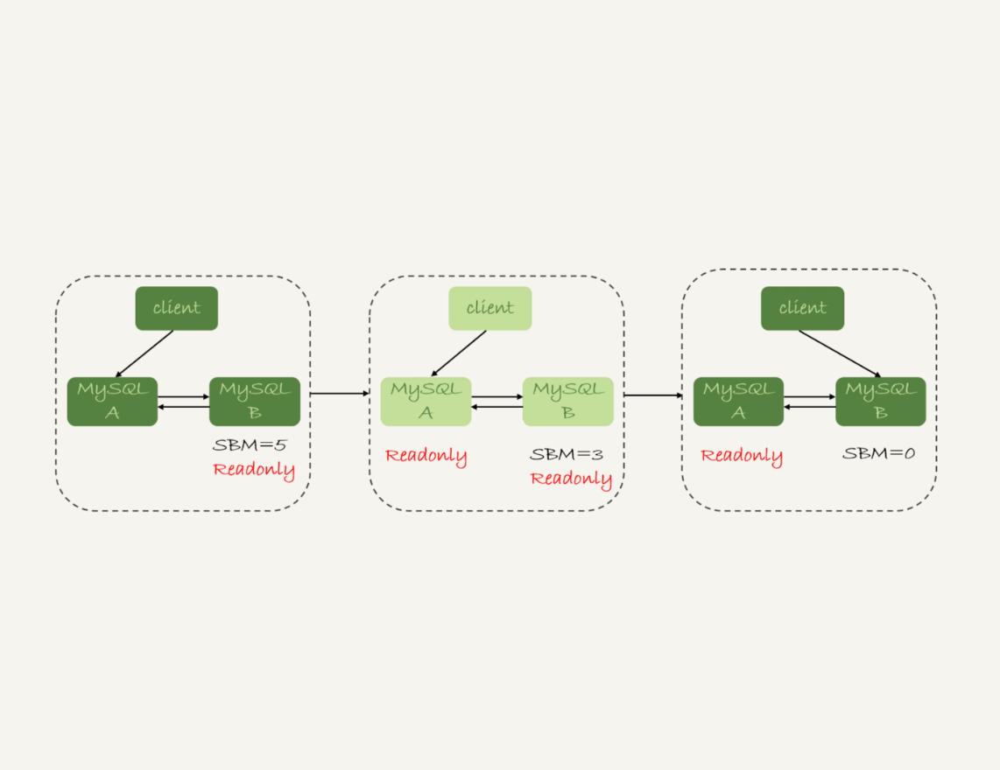
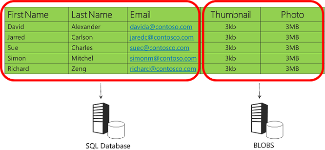
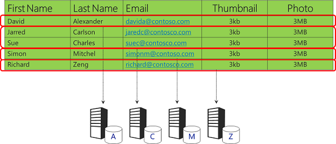
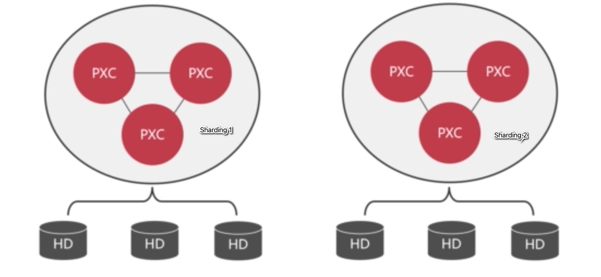
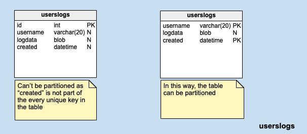

- [MySQL Scalability](#mysql-scalability)
	- [Replication](#replication)
		- [Category](#category)
		- [Process](#process)
			- [Flowchart](#flowchart)
			- [binlog](#binlog)
				- [Format](#format)
					- [Statement](#statement)
					- [Row](#row)
					- [Mixed](#mixed)
				- [Why MySQL 5.7 default to Row instead of Mixed](#why-mysql-57-default-to-row-instead-of-mixed)
		- [Replication delay](#replication-delay)
			- [Def](#def)
			- [Delay sources](#delay-sources)
			- [How to reduce replication delay](#how-to-reduce-replication-delay)
		- [Use cases](#use-cases)
			- [Handle old data - Archive](#handle-old-data---archive)
				- [Use case](#use-case)
				- [Implementation](#implementation)
				- [Flowchart](#flowchart-1)
			- [[TODO:::] Backup](#todo-backup)
				- [Use case](#use-case-1)
				- [Use case study - Prevent oversell](#use-case-study---prevent-oversell)
					- [V1: Serializable DB isolation](#v1-serializable-db-isolation)
					- [V2: Optimistic lock](#v2-optimistic-lock)
					- [V3: Put inventory number inside Redis](#v3-put-inventory-number-inside-redis)
			- [High availability with failover](#high-availability-with-failover)
				- [Two servers](#two-servers)
					- [Reliability first failover](#reliability-first-failover)
				- [Approaches](#approaches)
					- [Availability first failover](#availability-first-failover)
				- [Multiple servers](#multiple-servers)
					- [New challenges - find sync point between multiple servers](#new-challenges---find-sync-point-between-multiple-servers)
					- [Problem with binlog position](#problem-with-binlog-position)
					- [GTID to rescue](#gtid-to-rescue)
	- [[TODO:::] Write high availability](#todo-write-high-availability)
	- [[TODO:::] Monitor](#todo-monitor)
		- [Sun shared drive or DRDB disk replication](#sun-shared-drive-or-drdb-disk-replication)
		- [PXC (multi-write)](#pxc-multi-write)
		- [NDB ()](#ndb-)
				- [[TODO:::] Solution 1: MMM (Multi-master replication manager)](#todo-solution-1-mmm-multi-master-replication-manager)
				- [[TODO:::] Solution 2: MHA (Master high availability)](#todo-solution-2-mha-master-high-availability)
	- [MySQL table partitioning](#mysql-table-partitioning)
		- [Def](#def-1)
		- [Benefits](#benefits)
		- [MySQL only supports horizontal partition](#mysql-only-supports-horizontal-partition)
		- [Limitations: Partition column and unique indexes](#limitations-partition-column-and-unique-indexes)
		- [Use cases](#use-cases-1)
		- [Types](#types)
			- [RANGE Partitioning](#range-partitioning)
			- [List partitioning](#list-partitioning)
			- [Hash partitioning](#hash-partitioning)
		- [References](#references)
	- [MySQL DB Sharding](#mysql-db-sharding)
		- [Pros](#pros)
		- [Cons](#cons)
			- [Write across shards](#write-across-shards)
			- [Query Cross shard](#query-cross-shard)
			- [Challenges in Graph DB sharding](#challenges-in-graph-db-sharding)
		- [Choose the number of shards](#choose-the-number-of-shards)
		- [Sharding stratgies](#sharding-stratgies)
			- [Lookup strategy](#lookup-strategy)
			- [Range strategy](#range-strategy)
				- [By customer or tenant](#by-customer-or-tenant)
				- [By geography](#by-geography)
				- [By time](#by-time)
			- [Hash strategy](#hash-strategy)
				- [By entity id](#by-entity-id)
		- [MyCat](#mycat)
		- [Sharding JDBC](#sharding-jdbc)
	- [Architecture example - Replication + PXC + Sharding proxy](#architecture-example---replication--pxc--sharding-proxy)
		- [Problem overview](#problem-overview)
			- [Total data volume possible to fit in a single machine but too many  concurrent requests](#total-data-volume-possible-to-fit-in-a-single-machine-but-too-many--concurrent-requests)
			- [Single table data volume too large for any single disk, high concurrent requests](#single-table-data-volume-too-large-for-any-single-disk-high-concurrent-requests)
			- [Lots of applications, Total data volume too large for any single machine, high concurrent requests](#lots-of-applications-total-data-volume-too-large-for-any-single-machine-high-concurrent-requests)
		- [Best practices](#best-practices)
		- [Sharding proxy (using MyCat)](#sharding-proxy-using-mycat)
		- [PXC cluster](#pxc-cluster)
		- [Replication cluster](#replication-cluster)
	- [Real world](#real-world)
		- [Apply GTID at scale in FB](#apply-gtid-at-scale-in-fb)
		- [Wechat Red pocket](#wechat-red-pocket)
		- [WePay MySQL high availability](#wepay-mysql-high-availability)
		- [High availability at Github](#high-availability-at-github)

# MySQL Scalability 
## Replication

### Category
* Synchronous replication: 
* Asynchronous replication: 
* Semi-Synchronous replication: 

* Replication topology
  * https://coding.imooc.com/lesson/49.html#mid=491

```
SQL > STOP SLAVE;
SQL > Change master to 
master_host = '192.168.99.102',
master_port = 3306,
master_user = 'xxx',
master_password = 'yyy';
SQL > START SLAVE;
SQL > SHOW SLAVE STATUS;

// Watch the Slave_IO_Running and Slave_SQL_running field from the output
```

### Process
#### Flowchart


#### binlog
##### Format
* Please see [MySQL official documents](https://dev.mysql.com/doc/refman/8.0/en/replication-sbr-rbr.html)

###### Statement
* Statement: not always safe, but may save storage place and faster
    * Pros: 
      1. Low number of logs generated, save I/O bandwidth
      2. Does not require consistency between master and slave table schema 
    * Cons: 
      1. Inapplicable for many SQL statements. For non-deterministic functions, could not gaurantee the consistency between master and slave server
  	  1. Database locks: Needs to lock a bigger chunk of data

###### Row
  * Binlog: always safe, possibly very slow and inefficient in time and space
    * Pros:
    	1. Database locks: Only need to lock a specific row
    	2. Applicable to any SQL statement. 
    * Cons: 
    	1. High number of logs generated
    	2. Does not require consistency between master and slave table schema

###### Mixed
* Mixed: best of both worlds in theory. Most queries are replicated by statement. But transactions MySQL knows are non-deterministic are replicated by row. Mixed Mode uses row-based replication for any transaction that:
	* Uses user defined functions
	* Uses the UUID(), USER(), or CURRENT_USER() functions
	* Uses LOAD_FILE (which otherwise assumes every slave has the exact same file on the local file system and doesn't replicate the data)
	* Updates two tables with auto_increment columns (the binlog format only carries one auto_increment value per statement)

##### Why MySQL 5.7 default to Row instead of Mixed
* Main reason is for backup and data recovery
* For example
  * For delete SQL commands, Row based format will record the entire original record. 
  * For insert SQL commands, Row based format will record the inserted record. 
  * For update SQL commands, Row based format will record the before and after record. 

### Replication delay
#### Def
* The master-slave latency is defined as the difference between T3 and T1. 
	1. Master DB executes a transaction, writes into binlog and finishes at timestamp T1.
	2. The statement is replicated to binlog, Slave DB received it from the binlog T2.
	3. Slave DB executes the transaction and finishes at timestamp T3. 

#### Delay sources
* Inferior slave machines: Slave machine is insuperior to master
* Too much load for slave
	* Causes: Many analytical queries run on top of slave. 
	* Solutions:
		- Multiple slaves
		- Output telemetry to external statistical systems such as Hadoop through binlog 
* Big transactions
	* If a transaction needs to run for as long as 10 minutes on the master database, then it must wait for the transaction to finish before running it on slave. Slave will be behind master for 10 minutes. 
		- e.g. Use del to delete too many records within DB
		- e.g. mySQL DDL within big tables. 
* Before MySQL 5.6, there isn't much built-in support for parallel relay log processing. If there is a steady difference between the write speed on master server and relay speed on slave server, then the replication delay between master and slave could become several hours. For more details, please check this file in [geektime in Chinese](https://time.geekbang.org/column/article/77083)


#### How to reduce replication delay
* Solution1: After write to master, write to cache as well. 
	- What if write to cache fails
		+ If read from master, slave useless
		+ If read from slave, still replication delay
* Solution2: If cannot read from slave, then read from master. 
	+ It works for DB add operation
	+ It doesn't work for DB update operation
* Solution3: If master and slave are located within the same location, synchronous replication

### Use cases
#### Handle old data - Archive
* Archive old data in time and save disk space

##### Use case
* If a single SQL table's size exceeds 20M rows, then its performance will be slow. Partitioning and Sharding have already been applied. Due to the use cases, there are some hot and cold data, e.g. ecommerce website orders.

##### Implementation
* MySQL engine for archiving
  * InnoDB is based on B+ tree, each time a write happens, the clustered index will need to modified again. The high traffic during archiving process decides that InnoDB will not be a great fit. 
  * TukoDB has higher write performance
* Create archiving tables

```
CREATE Table t_orders_2021_03 {
	...
} Engine = TokuDB;
```

* Pt-archiver: One of the utils of Percona-toolkit and used to archive rows from a MySQL table into another table or a file. https://www.percona.com/doc/percona-toolkit/LATEST/pt-archiver.html

##### Flowchart

```
┌──────────────────────────┐                                                                                        
│         Shard A          │                              ┌ ─ ─ ─ ─ ─ ─ ─ ─ ─ ─ ─ ─ ─ ─ ─ ─ ┐                       
│                          │                                                                                        
│   ┌─────────────────┐    │                              │                                 │                       
│   │                 │    │                                                                                        
│   │    Cold data    │────┼──┐                           │                                 │                       
│   │                 │    │  │                               ┌──────────────────────────┐          ┌──────────────┐
│   └─────────────────┘    │  │                           │   │         HA Proxy         │  │       │              │
│                          │  │                               │                          │          │              │
│   ┌─────────────────┐    │  │                           │   │  ┌───────────────────┐   │  │       │  Archive DB  │
│   │                 │    │  │                               │  │    Keepalived     │   │      ┌──▶│              │
│   │    Hot data     │    │  │                           │   │  └───────────────────┘   │  │   │   │              │
│   │                 │    │  │                               │                          │      │   │              │
│   └─────────────────┘    │  │       ┌──────────────┐    │   └──────────────────────────┘  │   │   └──────────────┘
│                          │  │       │              │                                          │                   
│                          │  │       │              │    │                                 │   │                   
└──────────────────────────┘  │       │  Virtual IP  │                                          │                   
                              ├──────▶│   address    │───▶│                                 │───┤                   
┌──────────────────────────┐  │       │              │                                          │                   
│         Shard Z          │  │       │              │    │   ┌──────────────────────────┐  │   │   ┌──────────────┐
│                          │  │       └──────────────┘        │         HA Proxy         │      │   │              │
│   ┌─────────────────┐    │  │                           │   │                          │  │   │   │              │
│   │                 │    │  │                               │   ┌───────────────────┐  │      │   │  Archive DB  │
│   │    Cold data    │────┼──┘                           │   │   │    Keepalived     │  │  │   └──▶│              │
│   │                 │    │                                  │   └───────────────────┘  │          │              │
│   └─────────────────┘    │                              │   │                          │  │       │              │
│                          │                                  └──────────────────────────┘          └──────────────┘
│   ┌─────────────────┐    │                              │                                 │                       
│   │                 │    │                                                                                        
│   │    Hot data     │    │                              │                                 │                       
│   │                 │    │                                                                                        
│   └─────────────────┘    │                              │                                 │                       
│                          │                               ─ ─ ─ ─ ─ ─ ─ ─ ─ ─ ─ ─ ─ ─ ─ ─ ─                        
│                          │                                                                                        
└──────────────────────────┘                                                                                        
```

#### [TODO:::] Backup
* Recovery test on the backup data

##### Use case
* Deal with intensive read conditions

##### Use case study - Prevent oversell
* Question: How to prevent overselling for limited inventory products?

###### V1: Serializable DB isolation
* Solution1: Set serializable isolation level in DB


###### V2: Optimistic lock
* Set optimistic lock on the table where multiple writes to a single table happens often. 

```
             Step1.                                                                                 
       ┌─────Query ───────────────────────────┐                                                     
       │    version                           │                                                     
       │     number                           ▼                                                     
       │                                ┌──────────┐                                                
       │                                │  Lookup  │                                                
       │                  ┌─────────────│ request  │                                                
       │                  │             │          │                                                
       │               Step2.           └──────────┘                                                
       │               Return                                                                       
       │               version                                                                      
┌────────────┐         number                                                                       
│            │            │                                                                         
│   Start    │◀───────────┘                                                                         
│            │                                                                ┌────────────────────┐
└────────────┘                          ┌──────────┐       ┌──────────┐   ┌──▶│  If match, write   │
       │           Step3.               │  Write   │       │If version│   │   └────────────────────┘
       └───────────Write ──────────────▶│ request  │──────▶│  match   │───┤                         
                  request               │          │       │          │   │                         
                                        └──────────┘       └──────────┘   │   ┌────────────────────┐
                                                                          └──▶│    If not, fail    │
                                                                              └────────────────────┘
```

###### V3: Put inventory number inside Redis
* Redis transaction mechanism: 
  * Different from DB transaction, an atomic batch processing mechanism for Redis
  * Similar to put optimistic mechanism inside Redis

* Flowchart

```
    ┌────────────────┐          ┌────────────────┐
    │ Redis client A │          │ Redis client B │
    └────────────────┘          └────────────────┘
             │                          │         
             │                          │         
             ▼                          │         
      ┌─────────────┐                   │         
      │ Watch data  │                   │         
      └─────────────┘                   │         
             │                          │         
             │                          │         
             ▼                          │         
┌─────────────────────────┐             │         
│Execute batch of commands│             │         
└─────────────────────────┘             │         
             │                          │         
             │                          │         
             │                          │         
             ▼                          ▼         
  ┌──────────────────────────────────────────────┐
  │                    Redis                     │
  └──────────────────────────────────────────────┘
```

* Implementation:
  
```
// Redis watch data
Redis > Watch inventory_number, userlist

// Start a transaction (execute batch of commands)
Redis > Multi
Redis > DECR inventory_number // reduce number of inventory because it is sold
Redis > RPUSH userlist 1234 // add 1234 user id to userlist who buys the product
Redis > EXEC
```

#### High availability with failover
* Usually reliability first is preferred to availability first to avoid data consistency problems. 
* For reliability first failover, the duration for downtime depends on the replication delay between master and slave. 
* Problems to be solved:
  1. After switch, how to notify applications the new address of master
  2. How to determine the master is available
  3. After switch, how to decide on the master-slave replication relationship 

##### Two servers

###### Reliability first failover
* There will be a brief period when both server A and server B are readonly between step (2-4)
  1. Check the value of slave server's seconds_behind_master, if it is smaller than certain threshold (e.g. 5s), continue to next step; Else repeat this step
  2. Change master server A's state to readonly (set readonly flag to true)
  3. Check the value of slave server's seconds_behind_master until its value becomes 0. 
  4. Change slave server B's state to read-write (set readonly flag to false)
  5. Switch the traffic to slave server B

##### Approaches
1. Reliability first - After step 2 and before step4 below, both master and slave will be in readonly state. 

```
                  │     │         ┌──────────────────────┐                          
                  │     │         │Step5. Switch traffic │                          
                  │     │         │     from A to B      │                          
                  │     │         └──────────────────────┘                          
                 Requests                                                           
                  │     │                                                           
                  │     │                                                           
                  │     │                                                           
                  ▼     ▼                                                           
                                                                                    
┌────────────────────────────┐                         ┌───────────────────────────┐
│          Master A          │                         │         Master B          │
│ ┌───────────────────────┐  │                         │ ┌───────────────────────┐ │
│ │step2. Change master to│  │                         │ │step1. check           │ │
│ │readonly state         │  │                         │ │seconds_behind_master  │ │
│ └───────────────────────┘  │                         │ │until it is smaller    │ │
│                            │                         │ │than 5 seconds         │ │
│                            │                         │ └───────────────────────┘ │
│                            │                         │ ┌───────────────────────┐ │
│                            │                         │ │step3. wait until      │ │
│                            │                         │ │seconds_behind_master  │ │
│                            │                         │ │to become 0            │ │
└────────────────────────────┘                         │ │                       │ │
                                                       │ └───────────────────────┘ │
                                                       │ ┌───────────────────────┐ │
                                                       │ │step4. change to       │ │
                                                       │ │read/write state       │ │
                                                       │ │instead of readonly    │ │
                                                       │ │                       │ │
                                                       │ └───────────────────────┘ │
                                                       │                           │
                                                       │                           │
                                                       └───────────────────────────┘
```




###### Availability first failover
* There is no blank period for availability. The switch always happens immediately. 
* When the binlog format is set to row based, it will be easier to discover the inconsistency between master and slave. 


```
                  │     │         ┌──────────────────────┐                          
                  │     │         │Step3. Switch traffic │                          
                  │     │         │     from A to B      │                          
                  │     │         └──────────────────────┘                          
                 Requests                                                           
                  │     │                                                           
                  │     │                                                           
                  │     │                                                           
                  ▼     ▼                                                           
                                                                                    
┌────────────────────────────┐                         ┌───────────────────────────┐
│          Master A          │                         │         Master B          │
│ ┌───────────────────────┐  │                         │                           │
│ │step2. Change master to│  │                         │ ┌───────────────────────┐ │
│ │readonly state         │  │                         │ │step1. change to       │ │
│ └───────────────────────┘  │                         │ │read/write state       │ │
│                            │                         │ │instead of readonly    │ │
│                            │                         │ │                       │ │
│                            │                         │ └───────────────────────┘ │
│                            │                         │                           │
│                            │                         │                           │
│                            │                         │                           │
└────────────────────────────┘                         └───────────────────────────┘
```

* Example setup: Server A is master and B is slave. 
  * In mixed format, only the statement is sent along. 
  * In row format, the entire record is sent along so it will be easier to detect the conflict (duplicate key error shown below)

```
// table structure and already setup record
mysql> CREATE TABLE `t` (
  `id` int(11) unsigned NOT NULL AUTO_INCREMENT,
  `c` int(11) unsigned DEFAULT NULL,
  PRIMARY KEY (`id`)
) ENGINE=InnoDB;

insert into t(c) values(1),(2),(3);

// The next examples discuss what happens for an availability first failover
insert into t(c) values(4); // Send to server A
insert into t(c) values(5); // Send to server B
```


##### Multiple servers
###### New challenges - find sync point between multiple servers
* It has the following setup


* After failing over, A' becomes the new master. The new challenges 


###### Problem with binlog position
* Hard to be accurate with MASTER_LOG_POS

```
// The command to execute when set B as A's slave
CHANGE MASTER TO 
MASTER_HOST=$host_name 
MASTER_PORT=$port 
MASTER_USER=$user_name 
MASTER_PASSWORD=$password 
MASTER_LOG_FILE=$master_log_name 
MASTER_LOG_POS=$master_log_pos  // master binlog offset position, hard to be accurate !!!
```

* Reason for the inaccuracy. The sync point is usually found by locating a timestamp in original master server. Then according to this problematic timestamp, find transaction id in new master server. It is hard to guarantee that slave servers are behind new master server (e.g. might execute the same command twice)

###### GTID to rescue
* Traditional MySQL replication is based on relative coordinates — each replica keeps track of its position with respect to its current primary’s binary log files. GTID enhances this setup by assigning a unique identifier to every transaction, and each MySQL server keeps track of which transactions it has already executed. This permits “auto-positioning,” the ability for a replica to be pointed at a primary instance without needing to specify a binlog filename or position in the CHANGE PRIMARY statement.
* Auto-positioning makes failover simpler, faster, and less error-prone. It becomes trivial to get replicas in sync after a primary failure, without requiring an external tool such as Master High Availability (MHA). Planned primary promotions also become easier, as it is no longer necessary to stop all replicas at the same position first. Database administrators need not worry about manually specifying incorrect positions; even in the case of human error, the server is now smart enough to ignore transactions it has already executed.

```
CHANGE MASTER TO 
MASTER_HOST=$host_name 
MASTER_PORT=$port 
MASTER_USER=$user_name 
MASTER_PASSWORD=$password 
master_auto_position=1  // This means the replication method is GTID
```

* More detailed explanation available at [Geektime MySQL](https://time.geekbang.org/column/article/77427)


## [TODO:::] Write high availability
* https://coding.imooc.com/lesson/49.html#mid=494

## [TODO:::] Monitor
* Monitor is in place to catch the issue early
* https://coding.imooc.com/lesson/49.html#mid=505


### Sun shared drive or DRDB disk replication
### PXC (multi-write)
### NDB ()

##### [TODO:::] Solution 1: MMM (Multi-master replication manager)
* https://coding.imooc.com/lesson/49.html#mid=495
* [MMM](https://mysql-mmm.org/downloads.html) is a set of scripts written in perl providing the following capabilities:
	- Load balancing among read slaves
	- Master failover
	- Monitor mySQL states
* Pros:
	- Easy config
* Cons:
	- Not suitable for scenarios having high requirements on data consistency
* Deployment: Although dual master, only allows writing to a single master at a time.
	- mmm_mond: Coordinator scripts. Run on top of a monitoring machine
		+ Create a set of virtual IPs. One write IP binds to the master and multiple read IPs bind to slave. 
		+ When a mySQL is down, it will migrate the VIP to another mySQL machine. 
	- mmm_agentd: Run on the same machine as the mysql server
	- mmm_control: Provides administrative commands for mmm_mond

##### [TODO:::] Solution 2: MHA (Master high availability)
* https://coding.imooc.com/lesson/49.html#mid=499
* [MHA](https://github.com/yoshinorim/mha4mysql-manager/wiki/Architecture)
	- Fast failover: Complete the failover within 0-30 seconds
	- Max effort consistency: When a master goes down, it will try to save binlog in the failed master. It uses this way to keep the maximum data consistency. However, this isn't reliable way. For example, some hardware failures may result in failure of saving binlogs. 
	- Compared with MMM, 
		+ Supports devops work like health check, suspend nodes
		+ Supports semi-synchronous, GTID 
* Deployment: 
	- MHA manager could be deployed in a separate machine for managing several master-slave clusters. It could also be deployed on a single slave. 
	- MHA node runs on each mysql server. 
* Cons:
	- Needs at minimum 3 machines
	- Brain split
	- Not suitable for scenarios having high requirements on data consistency

## MySQL table partitioning
### Def
* MySQL table partitioning means to divide one table into multiple partitions and each partition resides on a single disk. 
* Horizontal partitioning means that all rows matching the partitioning function will be assigned to different physical partitions. 
  + When a single table's number of rows exceed 20M, the performance will degrade quickly.
  + Based on certain fields, put **rows of a table** into different tables. 
* Vertical partitioning allows different table columns to be split into different physical partitions. 
  + Put different **fields of a table** into different tables
  + Segmented tables usually share the primary key for correlating data





### Benefits
* Storage: It is possible to store more data in one table than can be held on a single disk or file system partition. As known, the upper limit number of rows in a single MySQL is 20M due to the B+ tree depth. MySQL table partitioning enables more rows in any single table because these different partitions are stored in different disks.
* Deletion: Dropping a useless partition is almost instantaneous (partition level lock), but a classical DELETE query run in a very large table could lock the entire table (table level lock). 
* Partition Pruning: This is the ability to exclude non-matching partitions and their data from a search; it makes querying faster. Also, MySQL 5.7 supports explicit partition selection in queries, which greatly increases the search speed. (Obviously, this only works if you know in advance which partitions you want to use.) This also applies for DELETE, INSERT, REPLACE, and UPDATE statements as well as LOAD DATA and LOAD XML.
* A much cheaper option than sharding: Does not need cluster



### MySQL only supports horizontal partition
* Currently, MySQL supports horizontal partitioning but not vertical. The engine’s documentation clearly states it won’t support vertical partitions any time soon: ”There are no plans at this time to introduce vertical partitioning into MySQL.”

* https://dev.mysql.com/doc/mysql-partitioning-excerpt/8.0/en/partitioning-overview.html

### Limitations: Partition column and unique indexes
* Partition Columns: The rule of thumb here is that all columns used in the partitioning expression must be part of every unique key in the partitioned table. This apparently simple statement imposes certain important limitations. 



* Parition key could not be used in child query

### Use cases
* Time Series Data

### Types
#### RANGE Partitioning
* This type of partition assigns rows to partitions based on column values that fall within a stated range. The values should be contiguous, but they should not overlap each other. The VALUES LESS THAN operator will be used to define such ranges in order from lowest to highest (a requirement for this partition type). Also, the partition expression – in the following example, it is YEAR(created) – must yield an integer or NULL value.
* Use cases:
	* Deleting Old Data: In the above example, if logs from 2013 need to be deleted, you can simply use ALTER TABLE userslogs DROP PARTITION from_2013_or_less; to delete all rows. This process will take almost no time, whereas running DELETE FROM userslogs WHERE YEAR(created) <= 2013; could take minutes if there are lots of rows to delete.
	* Series Data: Working with a range of data expressions comes naturally when you’re dealing with date or time data (as in the example) or other types of “series” data.
	* Frequent Queries on the Partition Expression Column: If you frequently perform queries directly involving the column used in the partition expression (where the engine can determine which partition(s) it needs to scan based directly on the WHERE clause), RANGE is quite efficient. 
* Example

```
CREATE TABLE userslogs (
    username VARCHAR(20) NOT NULL,
    logdata BLOB NOT NULL,
    created DATETIME NOT NULL,
    PRIMARY KEY(username, created)
)
PARTITION BY RANGE( YEAR(created) )(
    PARTITION from_2013_or_less VALUES LESS THAN (2014),
    PARTITION from_2014 VALUES LESS THAN (2015),
    PARTITION from_2015 VALUES LESS THAN (2016),
    PARTITION from_2016_and_up VALUES LESS THAN MAXVALUE;

// An alternative to RANGE is RANGE COLUMNS, which allows the expression to include more than one column involving STRING, INT, DATE, and TIME type columns (but not functions). In such a case, the VALUES LESS THAN operator must include as many values as there are columns listed in the partition expression. For example:
CREATE TABLE rc1 (
    a INT,
    b INT
)
PARTITION BY RANGE COLUMNS(a, b) (
    PARTITION p0 VALUES LESS THAN (5, 12),
    PARTITION p3 VALUES LESS THAN (MAXVALUE, MAXVALUE)
);
```

#### List partitioning
* LIST partitioning is similar to RANGE, except that the partition is selected based on columns matching one of a set of discrete values. In this case, the VALUES IN statement will be used to define matching criteria. 

* Example
  
```
CREATE TABLE serverlogs (
    serverid INT NOT NULL, 
    logdata BLOB NOT NULL,
    created DATETIME NOT NULL
)
PARTITION BY LIST (serverid)(
    PARTITION server_east VALUES IN(1,43,65,12,56,73),
    PARTITION server_west VALUES IN(534,6422,196,956,22)
);

// LIST comes with an alternative – LIST COLUMNS. Like RANGE COLUMNS, this statement can include multiple columns and non-INT data types, such as STRING, DATE, and TIME. The general syntax would look like this

CREATE TABLE lc (
    a INT NULL,
    b INT NULL
)
PARTITION BY LIST COLUMNS(a,b) (
    PARTITION p0 VALUES IN( (0,0), (NULL,NULL) ),
    PARTITION p1 VALUES IN( (0,1), (0,2), (0,3), (1,1), (1,2) ),
    PARTITION p2 VALUES IN( (1,0), (2,0), (2,1), (3,0), (3,1) ),
    PARTITION p3 VALUES IN( (1,3), (2,2), (2,3), (3,2), (3,3) )
);
```

#### Hash partitioning
* In HASH partitioning, a partition is selected based on the value returned by a user-defined expression. This expression operates on column values in rows that will be inserted into the table. A HASH partition expression can consist of any valid MySQL expression that yields a nonnegative integer value. HASH is used mainly to evenly distribute data among the number of partitions the user has chosen.
* Example

```
CREATE TABLE serverlogs2 (
    serverid INT NOT NULL, 
    logdata BLOB NOT NULL,
    created DATETIME NOT NULL
)
PARTITION BY HASH (serverid)
PARTITIONS 10;
```

### References
* https://www.vertabelo.com/blog/everything-you-need-to-know-about-mysql-partitions/

## MySQL DB Sharding
### Pros
* Disk IO: There are too many hot data to fit into database memory. Each time a query is executed, there are a lot of IO operations being generated which reduce performance. 
* Network IO: Too many concurrent requests. 


### Cons
#### Write across shards
* Original transaction needs to be conducted within a distributed transaction.
	- e.g. ecommerce example (order table and inventory table)
* There are wwo ways in general to implement distributed transactions:
	- 2PC 
	- TCC
* For example, some software has built-in implementations such as:
	- MySQL XA
	- Spring JTA

#### Query Cross shard
* Query types:
	- Join queries: 
	- count queries:
	- order by queries:

* Solutions:
	* Aggregate query result for different shard within application code.
	* Usually use two sets of data to solve the problem
		- One data is based on unique sharding key.
		- The other one is data replicated asynchronously to Elasticsearch or Solr.

#### Challenges in Graph DB sharding
* Graph model is most common in B2C apps like Facebook and Instagram. 
* With this model, data is often replicated in a few different forms. Then it is the responsibility of the application to map to the form that is most useful to acquire the data. The result is you have multiple copies for your data sharded in different ways, eventual consistency of data typically, and then have some application logic you have to map to your sharding strategy. For apps like Facebook and Reddit there is little choice but to take this approach, but it does come at some price.

### Choose the number of shards
* If has a cap on storage:
	- Each shard could contain at most 1TB data.
	- number of shards = total storage / 1TB
* If has a cap on number of records:
	- Suppose the size of row is 100 bytes
		- User table: uid (long 8 bytes), name (fixed char 16 bytes), city (int 4 bytes), timestamp (long 8 bytes), sex (int 4 bytes), age (int 4 bytes) = total 40 bytes
	- Total size of the rows: 100 bytes * Number_of_records
	- number of shards = total size of rows / 1TB

### Sharding stratgies
#### Lookup strategy
* Pros:
	- Easy to migrate data
* Cons: 
	- Need an additional hop when query
	- If the lookup table is really big, it could also need to be sharded


#### Range strategy
* Pros:
	- Easy to add a new shard. No need to move the original data. For example, each month could have a new shard.
* Cons:
	- Uneven distribution. For example, July is the hot season but December is the cold season. 


##### By customer or tenant
* If it is a SaaS business, it is often true that data from one customer doesn't interact with data from any of your other customers. These apps are usually called multi-tenant apps. 
	- Multi-tenant apps usually require strong consistency where transaction is in place and data loss is not possible. 
	- Multi-tenant data usually evolves over time to provide more and more functionality. Unlike consumer apps which benefit from network effects to grow, B2B applications grows by adding new features for customers. 

##### By geography
* Apps such as postmate, lyft or instacart.
* You’re not going to live in Alabama and order grocery delivery from California. And if you were to order a Lyft pick-up from California to Alabama you’ll be waiting a good little while for your pickup.

##### By time
* Time sharding is incredibly common when looking at some form of event data. Event data may include clicks/impressions of ads, it could be network event data, or data from a systems monitoring perspective.
* This approach should be used when
	- You generate your reporting/alerts by doing analysis on the data with time as one axis.
	- You’re regularly rolling off data so that you have a limited retention of it.

#### Hash strategy


##### By entity id
* Shard based on hashing value of a field. 
* Pros:
	- Evenly distributed data
* Cons:
	- Hard to add a new shard. Lots of data migration need to happen. 

### MyCat

### Sharding JDBC


## Architecture example - Replication + PXC + Sharding proxy
### Problem overview
#### Total data volume possible to fit in a single machine but too many  concurrent requests
1. Add cache layer before MySQL
2. Add read write separation in MySQL layer (by DB middleware)

#### Single table data volume too large for any single disk, high concurrent requests
* Solution MySQL table partition (by MySQL built-in function)

#### Lots of applications, Total data volume too large for any single machine, high concurrent requests
* Could not use multi-master because large number of data volume to fix in a single machine.
* Sharding to rescue (by DB middleware)

### Best practices
1. Single database single table
2. Single database multiple table
	* Table vertical sharding: If within a single table, some fields have a different usage pattern and consume large amount of space
		- Take user profile as an example (name, age, sex, nickname, description). Nickname and description are usually only used in display instead of query and description is really long. They could be put into a different table.  
	* Table horizontal sharding: If data volume is big, could consider table horizontal sharding single database multiple table. 
		- Could use 50M rows as the standard size for a single table. 
		- The MyISAM storage engine supports 2^32 rows per table.The InnoDB storage engine doesn't seem to have a limit on the number of rows, but it has a limit on table size of 64 terabytes. How many rows fits into this depends on the size of each row.
3. If concurrent volume is high, then could consider using multiple database multiple table. 
	- For example, test MySQL 5.7 on a 4 Core 8 GB cloud server
		- Write performance: 500 TPS 
		- Also note down here the read performance for reference: 10000 QPS

### Sharding proxy (using MyCat)
* 

### PXC cluster
* PXC is a type of strong consistency MySQL cluster built on top of Galera. It could store data requring high consistency. 

### Replication cluster
* Replication is a type of weak consistency MySQL cluster shipped with MySQL based on binlog replication. It could be used to store data only requiring low consistency. 

```
                                                               │                                                             
                                                               │                                                             
                                                               ▼                                                             
                                                ┌─────────────────────────────┐                                              
                                                │DB Proxy such as MyCat for   │                                              
                                                │1. Sharding                  │                                              
                                                │2. Load balancing            │                                              
                                                │3. Routing such as read write│                                              
                                                │separation                   │                                              
                                                └─────────────────────────────┘                                              
                                                               │                                                             
                               Query for strong                │                                                             
                               consistency data                │              Query for weak                                 
                      ┌────────────────────────────────────────┼─────────────consistency data──────────┐                     
                      │             Shard A                    │                                       │                     
                      │                                        │                  Shard A              │                     
                      ▼                                        │                                       ▼                     
┌ ─ ─ ─ ─ ─ ─ ─ ─ ─ ─ ─ ─ ─ ─ ─ ─ ─ ─ ─ ─ ─                    │                 ┌ ─ ─ ─ ─ ─ ─ ─ ─ ─ ─ ─ ─ ─ ─ ─ ─ ─ ─ ─ ─ ─ 
               PXC Cluster A               │                   │                            Replication Cluster A           │
│                                                              │                 │                                           
                                           │                   │                                                            │
│┌──────────────┐          ┌──────────────┐                    │                 │┌──────────────┐          ┌──────────────┐ 
 │              │          │              ││                   │                  │              │          │              ││
││   PXC node   │◀────────▶│   PXC node   │                    │                 ││ Master node  │─────────▶│  Slave node  │ 
 │              │          │              ││                   │                  │              │          │              ││
│└──────────────┘          └──────────────┘                    │                 │└──────────────┘          └──────────────┘ 
         ▲                         ▲       │                   │                          │                                 │
│        │                         │                           │                 │        │                                  
         │     ┌──────────────┐    │       │                   │                          │    ┌──────────────┐             │
│        │     │              │    │                           │                 │        │    │              │              
         └────▶│   PXC node   │◀───┘       │                   │                          └───▶│  Slave node  │             │
│              │              │                                │                 │             │              │              
               └──────────────┘            │                   │                               └──────────────┘             │
└ ─ ─ ─ ─ ─ ─ ─ ─ ─ ─ ─ ─ ─ ─ ─ ─ ─ ─ ─ ─ ─                    │                 └ ─ ─ ─ ─ ─ ─ ─ ─ ─ ─ ─ ─ ─ ─ ─ ─ ─ ─ ─ ─ ─ 
                                                               │                                                             
                                                               │                                                             
                                                               │                                                             
                                                               │                                                             
                                                               │                                                             
 ┌ ─ ─ ─ ─ ─ ─ ─ ─ ─ ─ ─ ─ ─ ─ ─ ─ ─ ─ ─ ─ ─                   │                 ┌ ─ ─ ─ ─ ─ ─ ─ ─ ─ ─ ─ ─ ─ ─ ─ ─ ─ ─ ─ ─ ─ 
                PXC Cluster B               │                  │                            Replication Cluster B           │
 │                                                             │                 │                                           
                                            │                  │                                                            │
 │┌──────────────┐          ┌──────────────┐                   │                 │┌──────────────┐          ┌──────────────┐ 
  │              │          │              ││     Query for    │    Query for     │              │          │              ││
 ││   PXC node   │◀────────▶│   PXC node   │       strong      │      weak       ││ Master node  │─────────▶│  Slave node  │ 
  │              │          │              ││    consistency   │   consistency    │              │          │              ││
 │└──────────────┘          └──────────────┘ ◀──────data───────┴──────data──────▶│└──────────────┘          └──────────────┘ 
          ▲                         ▲       │                                             │                                 │
 │        │                         │              Shard B           Shard B     │        │                                  
          │     ┌──────────────┐    │       │                                             │    ┌──────────────┐             │
 │        │     │              │    │                                            │        │    │              │              
          └────▶│   PXC node   │◀───┘       │                                             └───▶│  Slave node  │             │
 │              │              │                                                 │             │              │              
                └──────────────┘            │                                                  └──────────────┘             │
 └ ─ ─ ─ ─ ─ ─ ─ ─ ─ ─ ─ ─ ─ ─ ─ ─ ─ ─ ─ ─ ─                                     └ ─ ─ ─ ─ ─ ─ ─ ─ ─ ─ ─ ─ ─ ─ ─ ─ ─ ─ ─ ─ ─ 
```

## Real world
### Apply GTID at scale in FB
- https://engineering.fb.com/2014/09/18/core-data/lessons-from-deploying-mysql-gtid-at-scale/

### Wechat Red pocket
- https://www.infoq.cn/article/2017hongbao-weixin
- http://www.52im.net/thread-2548-1-1.html

### WePay MySQL high availability
* [Used at Wepay](https://wecode.wepay.com/posts/highly-available-mysql-clusters-at-wepay)

### High availability at Github
* [Used at Github](
https://github.blog/2018-06-20-mysql-high-availability-at-github/)


* Master discovery series
1. DNS http://code.openark.org/blog/mysql/mysql-master-discovery-methods-part-1-dns
2. VPN and DNS
http://code.openark.org/blog/mysql/mysql-master-discovery-methods-part-2-vip-dns
3. app and service discovery
http://code.openark.org/blog/mysql/mysql-master-discovery-methods-part-3-app-service-discovery
4. Proxy heuristics
http://code.openark.org/blog/mysql/mysql-master-discovery-methods-part-4-proxy-heuristics
5. Service discovery and Proxy
http://code.openark.org/blog/mysql/mysql-master-discovery-methods-part-5-service-discovery-proxy
6. http://code.openark.org/blog/mysql/mysql-master-discovery-methods-part-6-other-methods
