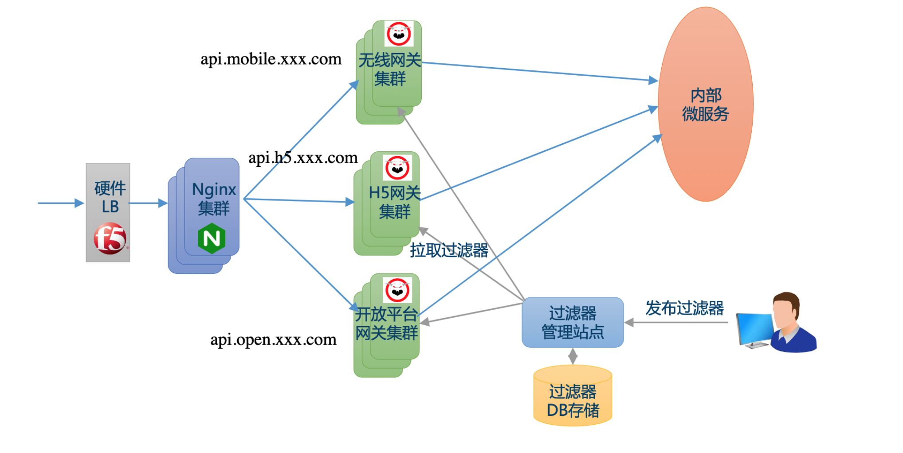
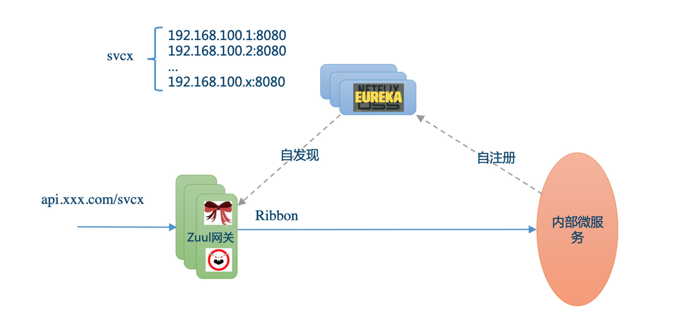
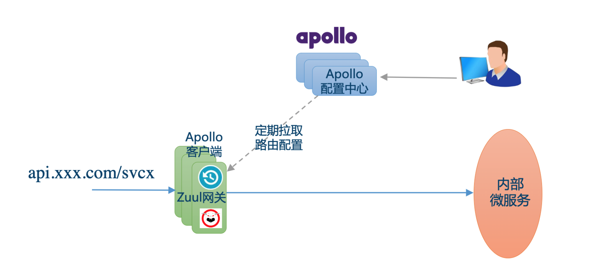

- [API Gateway](#api-gateway)
  - [Functionalities [Todo]](#functionalities-todo)
    - [Rate limiting](#rate-limiting)
  - [Existing solutions](#existing-solutions)
    - [Zuul [TODO]](#zuul-todo)
    - [How does Zuul get routing table](#how-does-zuul-get-routing-table)
      - [Eureka](#eureka)
      - [Domain name](#domain-name)
      - [Apollo](#apollo)
  - [References](#references)

# API Gateway

## Functionalities [Todo]
* https://time.geekbang.org/course/detail/100003901-2270

### Rate limiting

## Existing solutions
### Zuul [TODO]
* Zuul architecture: https://time.geekbang.org/course/detail/100003901-2271

### How does Zuul get routing table
#### Eureka 

#### Domain name

#### Apollo

## References
* 美团APIGateway: https://zhuanlan.zhihu.com/p/374130800