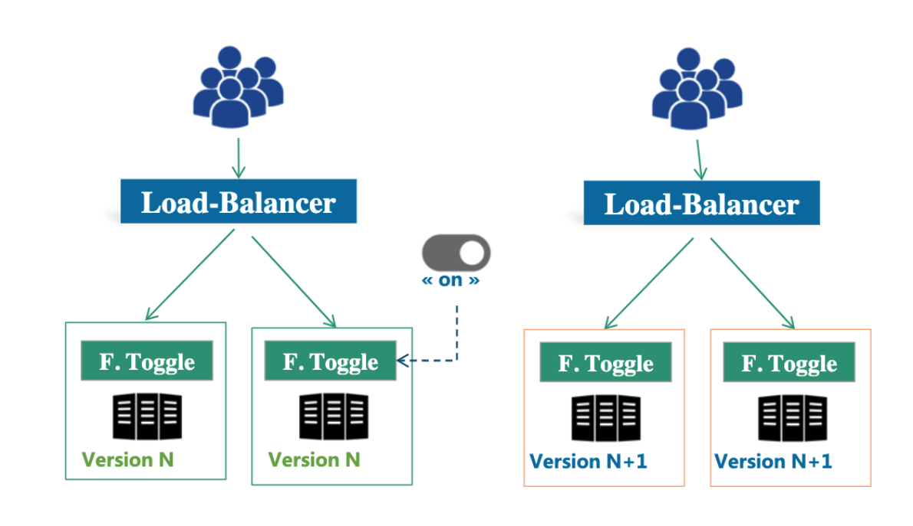
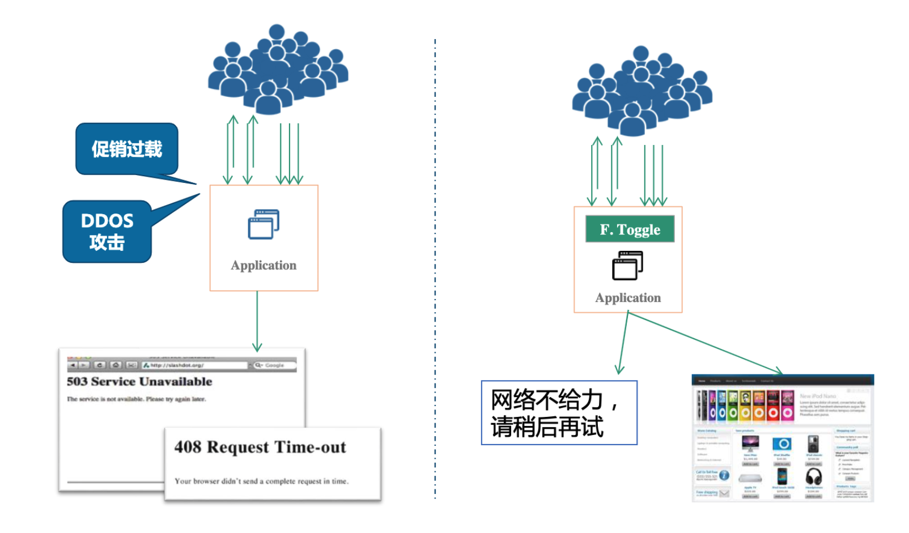
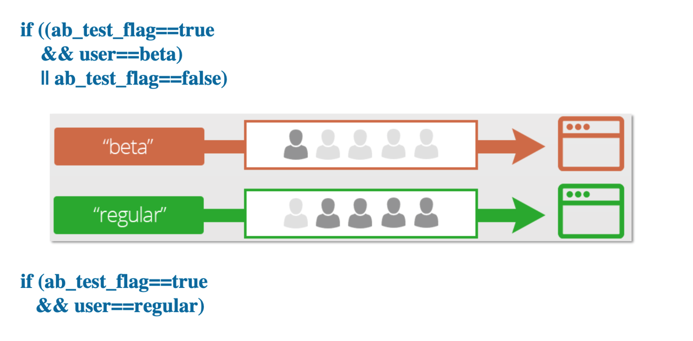
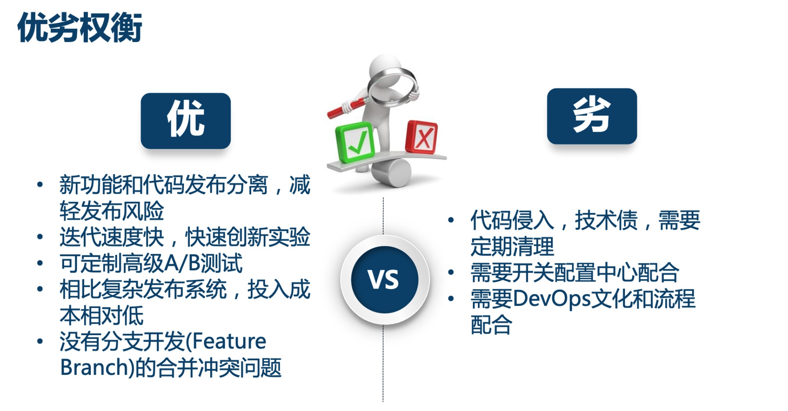
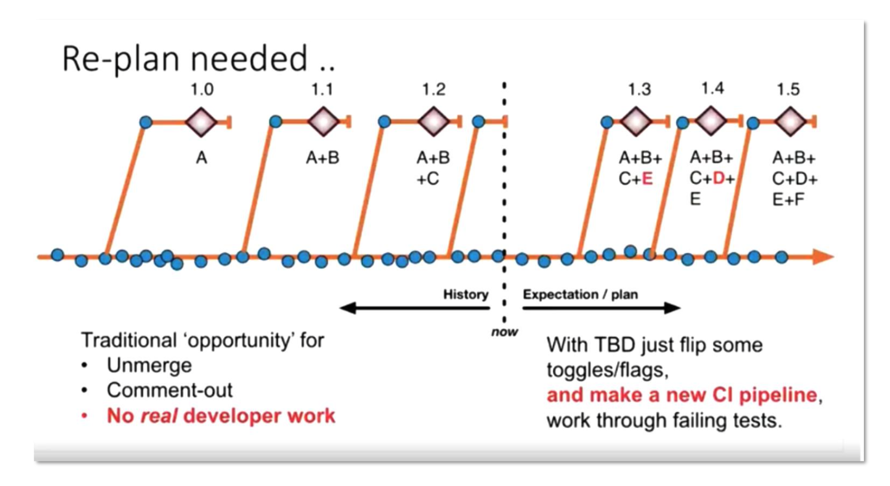

- [Configuration center](#configuration-center)
  - [Motivation](#motivation)
  - [Config operations and open source comparison [Todo]](#config-operations-and-open-source-comparison-todo)
  - [Requirements on configuration center](#requirements-on-configuration-center)
  - [Configuration categories](#configuration-categories)
    - [Static configuration](#static-configuration)
    - [Dynamic configuration](#dynamic-configuration)
  - [Use case](#use-case)
    - [Blue green deploymment](#blue-green-deploymment)
    - [Graceful downgrade](#graceful-downgrade)
    - [DB migration](#db-migration)
    - [AB testing](#ab-testing)
    - [Continuous delivery](#continuous-delivery)
      - [Feature flag driven development](#feature-flag-driven-development)
      - [Trunk based development](#trunk-based-development)
  - [Apollo Architecture (In Chinese)](#apollo-architecture-in-chinese)

# Configuration center
## Motivation
* [TODO: Review in case of missing](https://time.geekbang.org/course/detail/100003901-2273)
* Static config files could not be changed dynamically. Need to be redeployed
* Configuration exists in many different places (e.g. xml, properties, DB). Errorprone for livesites. 
* No security audit and version control 
* Cloud native requires immutable infrastructure and microservices. This type of continuous delivery requires the architecture of configuration center. 

## Config operations and open source comparison [Todo]
* Config operations and open source comparison: https://time.geekbang.org/column/article/41509

## Requirements on configuration center
* Access control and audit history
* Gradual rollout
* Management for different environments/clusters

## Configuration categories
### Static configuration
* Database/middleware/service connection string
* Username, password, token, certificates

### Dynamic configuration
* Application configuration: Request timeout, thread pool, queue, cache, connnection pool size, circuit breaker threshold, black-white list
* Function on-off toggles: Blue green deployment, HA toggle 
* Business logic toggles: 

## Use case
### Blue green deploymment

### Graceful downgrade

### DB migration
* https://blog.launchdarkly.com/feature-flagging-to-mitigate-risk-in-database-migration

### AB testing

### Continuous delivery
#### Feature flag driven development
* Pros:
* Cons:

#### Trunk based development
* https://www.stevesmith.tech/blog/organisation-pattern-trunk-based-development/
* Benefits:
	- Replanning

## Apollo Architecture (In Chinese)
* Server architecture: https://time.geekbang.org/course/detail/100007001-8843
* Client architecture: https://time.geekbang.org/course/detail/100007001-8844
* High availability architecture: https://time.geekbang.org/course/detail/100007001-8845
