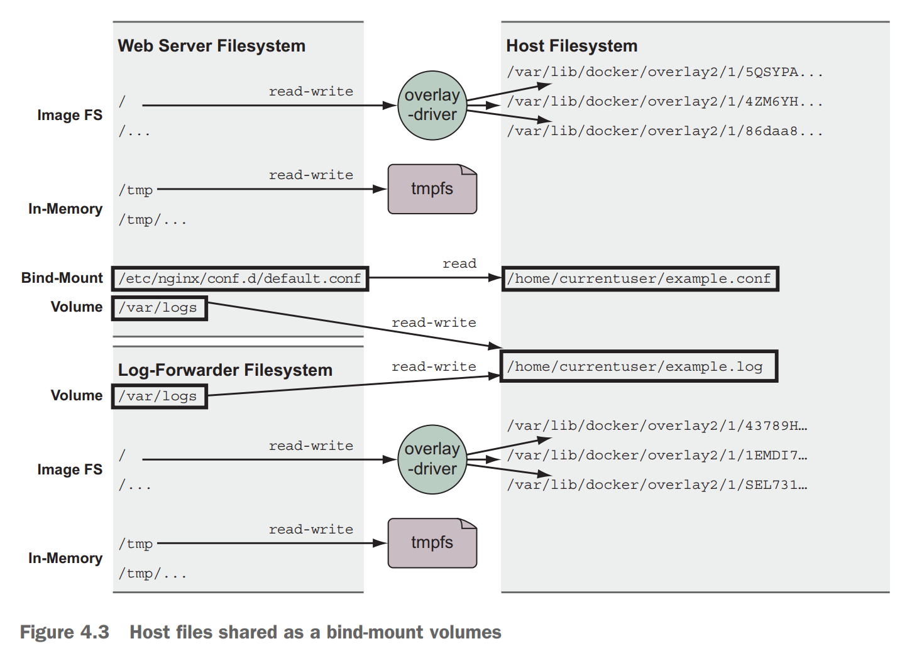

# MicroSvcs container

## Mount points
* Def: Unix file system is organized into a tree structure. Storage devices are attached to specific locations in that tree. These locations are called mount points.
* A mount point contains three parts:
  * The location in the tree
  * The access properties to the data at that point (for example, writability)
  * The source of the data mounted at that point (for example, a specific hard disk, USB device, or memory-backed virtual disk)

## Storage Types

### Bind mounts
* Use case: Bind mounts are useful when the host provides a file or directory that is needed by a program running in a container, or when that containerized program produces a file or log that is processed by users or programs running outside containers
* Cons:
  * The first problem with bind mounts is that they tie otherwise portable container descriptions to the filesystem of a specific host.
  * The next big problem is that they create an opportunity for conflict with other containers

### In-memory storage
* Use case: Most service software and web applications use private key files, database passwords, API key files, or other sensitive configuration files, and need upload buffering space.
In these cases, it is important that you never include those types of files in an image or write them to disk. 

### Docker volumes
* Use case: 
  * 
* Cons: 

## Container network

## References
* [container and CICD](https://time.geekbang.org/course/detail/100003901-2279)
* [Why container and Docker](https://time.geekbang.org/column/article/41977)
* [Container management with Mesos](https://time.geekbang.org/course/detail/100003901-2280)
* [Docker image repo and deployment](https://time.geekbang.org/column/article/42167)
* [Docker orchestration](https://time.geekbang.org/column/article/42477)
* [Container DevOps platform](https://time.geekbang.org/column/article/42604)
* [CI, CD](https://time.geekbang.org/column/article/42825)

## Real world
* Netflix container journey: https://netflixtechblog.com/the-evolution-of-container-usage-at-netflix-3abfc096781b