- [MicroSvcs container](#microsvcs-container)
  - [Container concepts](#container-concepts)
    - [Namespace](#namespace)
      - [Categories of namespaces](#categories-of-namespaces)
      - [Compare with hypervisor](#compare-with-hypervisor)
        - [Cons of hypervisor](#cons-of-hypervisor)
        - [Cons of container](#cons-of-container)
      - [Commands](#commands)
    - [Cgroup](#cgroup)
      - [Categories](#categories)
        - [Blkio Cgroup](#blkio-cgroup)
        - [Cgroup v1 and v2](#cgroup-v1-and-v2)
      - [Cons of Cgroup](#cons-of-cgroup)
    - [Mount points](#mount-points)
    - [UnionFS](#unionfs)
      - [Motivation](#motivation)
      - [Implementation](#implementation)
      - [Limitations](#limitations)
    - [Storage quota](#storage-quota)
  - [Docker storage](#docker-storage)
    - [Bind mounts (host path)](#bind-mounts-host-path)
      - [Use case](#use-case)
      - [Pros](#pros)
      - [Cons](#cons)
      - [Command](#command)
    - [Docker volumes](#docker-volumes)
      - [Pros](#pros-1)
      - [Command](#command-1)
    - [In-memory storage](#in-memory-storage)
      - [Use case](#use-case-1)
      - [Internal mechanism](#internal-mechanism)
  - [Docker network](#docker-network)
    - [Linux Net namespace](#linux-net-namespace)
      - [Connect two net namespaces](#connect-two-net-namespaces)
      - [Connect multiple net namespaces](#connect-multiple-net-namespaces)
    - [Docker CNM](#docker-cnm)
      - [Host](#host)
      - [Bridge](#bridge)
      - [Underlay and overlay](#underlay-and-overlay)
      - [None + plugin](#none--plugin)
      - [Connect multiple net namespaces](#connect-multiple-net-namespaces-1)
  - [References](#references)
  - [Real world](#real-world)

# MicroSvcs container


## Container concepts
* Def: Container is a special type of process with namespace based separation and the amount of resources it could use is defined by Cgroup.  

### Namespace
* Def: Used to create separate view of resources. 

#### Categories of namespaces

| `Namespace`  | `Separated resource` |
|--------------|--------------------|
| Cgroup | Cgroup root directory |
| IPC | System V IPC, POSIX message queues |
| Network      | Network equipment, port                   |
| Mount        | Mount point                   |
| PID          | Process ID                   |
| Time         | Clock              |
| User         | User ID and user group ID                |
| UTS          | Machine name, host name                   |

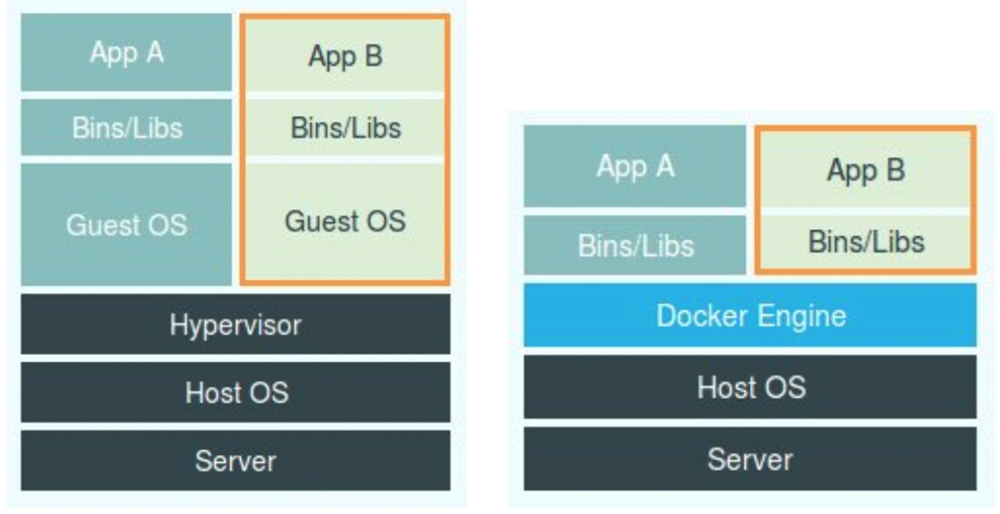

#### Compare with hypervisor
##### Cons of hypervisor
* Hypervisor must run an independent guest OS, which will cost 100~200MB memory by itself. 
* User process runs inside supervisor and all operations need to be intercepted by hypervisor, resulting in performance cost. 
* On the contrary, since container is just another process, there isn't much performance cost. 

##### Cons of container
* Containers share the same processing cores as host. 
  * If you want to use a higher version container on a lower version Linux host, it is not possible. 
  * If you want to use Linux on top of Windows host, it won't be possible. 
* Many resources and objects could not be separated using namespace, such as time. 
  * If your container use SetTimeOfDay and changed the time in the container, then the host's time will also change. 
* Containers expose more security attack surface than hypervisor. Even though technology such as Seccomp could be used, it has performance cost. 


#### Commands

```
$ docker run -it busybox /bin/sh
/ #

/ # ps
PID  USER   TIME COMMAND
  1 root   0:00 /bin/sh
  10 root   0:00 ps
```

### Cgroup
* Def: Used to create resource constraints. 

#### Categories
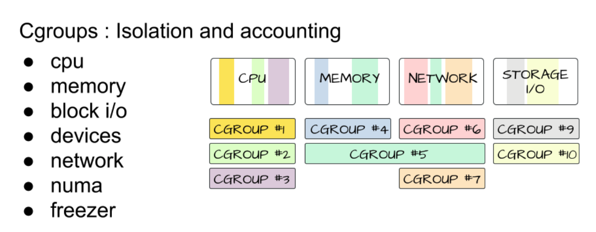

```
// use mount command to display the limit. 
$ mount -t cgroup 

cpuset on /sys/fs/cgroup/cpuset type cgroup (rw,nosuid,nodev,noexec,relatime,cpuset)
cpu on /sys/fs/cgroup/cpu type cgroup (rw,nosuid,nodev,noexec,relatime,cpu)
cpuacct on /sys/fs/cgroup/cpuacct type cgroup (rw,nosuid,nodev,noexec,relatime,cpuacct)
blkio on /sys/fs/cgroup/blkio type cgroup (rw,nosuid,nodev,noexec,relatime,blkio)
memory on /sys/fs/cgroup/memory type cgroup (rw,nosuid,nodev,noexec,relatime,memory)
...
```

##### Blkio Cgroup
* Question: How to guarantee the disk read/write performance when multiple containers read/write?
* Disk performance criteria:
  * IOPS: Input/Output operations per second.
  * Throughput: Bandwidth in MB/s. 
  * Relationship: Throughput = IOPS * blocksize
* Def of Blkio Cgroup: A subsystem under Cgroup. 

```
// four parameters under Blkio Cgroup
blkio.throttle.read_iops_device
blkio.throttle.read_bps_device
blkio.throttle.write_iops_device
blkio.throttle.write_bps_device
```

* Two Linux I/O modes:
  * Direct I/O
  * Buffered I/O

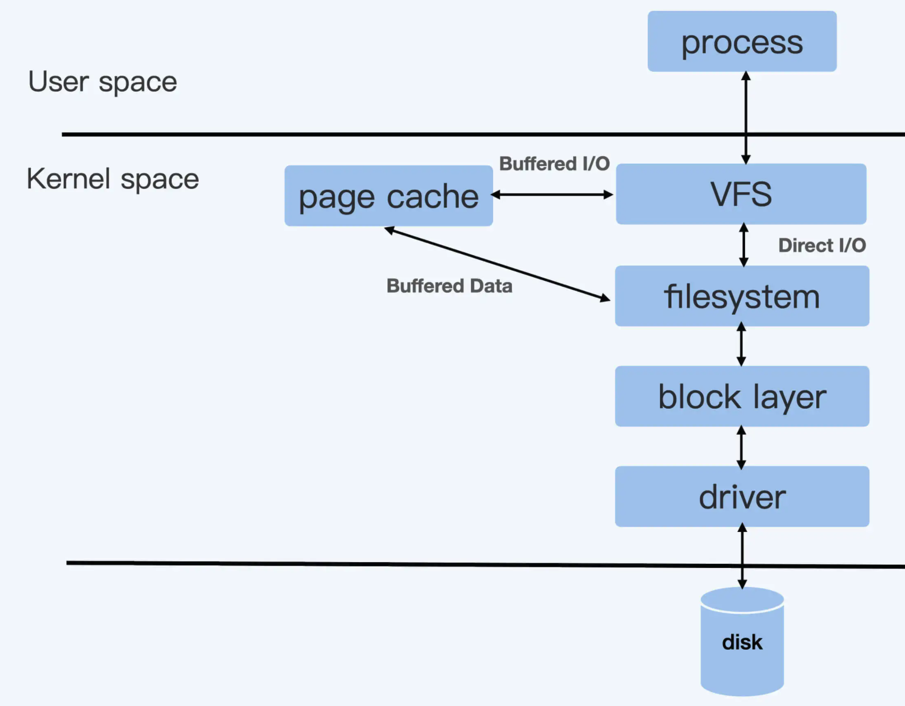

##### Cgroup v1 and v2
* Under Cgroup v1, each subsystem is independent. 
* Under Cgroup v2, one process could belong to multiple control group. Each control group could contain multiple evaluation criteria (e.g. Blkio Cgroup + Memory Cgroup)

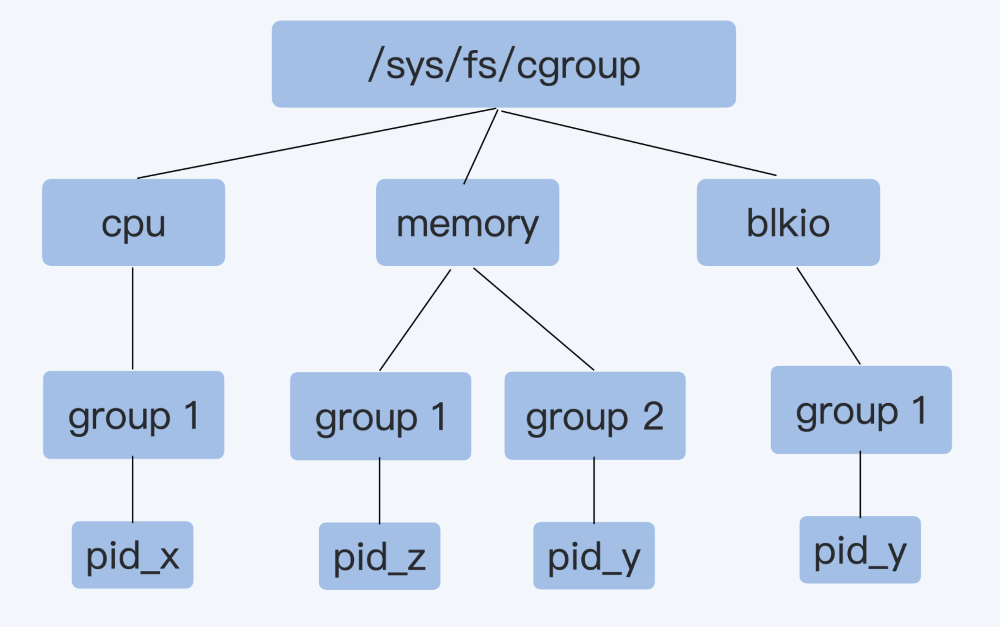

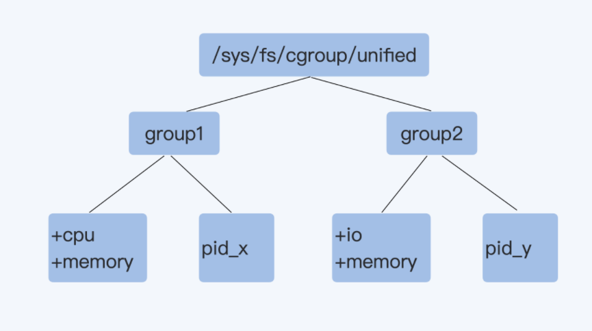

#### Cons of Cgroup
* /Proc directory stores the core status, such as CPU and memory usage. But when using **top** command, it displays the host file system's information. 
* /Proc does not have any knowledge about Cgroup. 

### Mount points
* Def: Unix file system is organized into a tree structure. Storage devices are attached to specific locations in that tree. These locations are called mount points.
* A mount point contains three parts:
  * The location in the tree
  * The access properties to the data at that point (for example, writability)
  * The source of the data mounted at that point (for example, a specific hard disk, USB device, or memory-backed virtual disk)

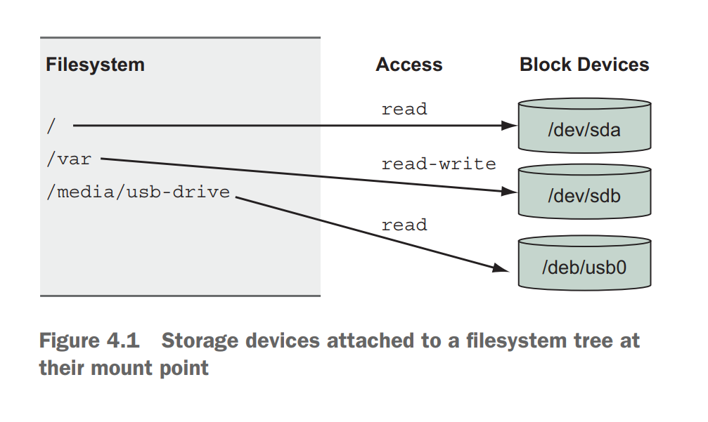

### UnionFS
#### Motivation
* If without a container specific file system, then file systems such as XFS or ext4 need to be used. For these file systems, the entire system needs to be downloaded to each container, resulting in much redundancy. 

#### Implementation
* UnionFS has many implementations, including Docker's AUFS and OverlayFS. Since Linux 3.18, OverlayFS has been part of Linux and default container file system impl. 
* OverlayFS is a modern union filesystem that is similar to AUFS, but faster and with a simpler implementation.
  * Lower layer is readonly.
  * Upper layer is writable and modifiable. 

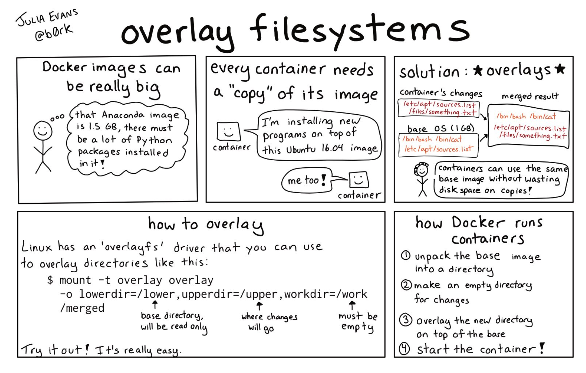

#### Limitations
* For write, it uses Copy-On-Write mechanism, resulting in low efficiency; For read, it also needs to read from top down. 
* The RW layer has the same lifetime as the container. When container stops, the RW layer will disappear. If you need to store the RW layer, you could commit it to the image. 
* There is no mechanism for sharing the data. 


### Storage quota
* Question: How to set quota for a directory?
* Solution:
  * Tag a project ID on the upperdir
  * Set XFS quota on the project. 


## Docker storage

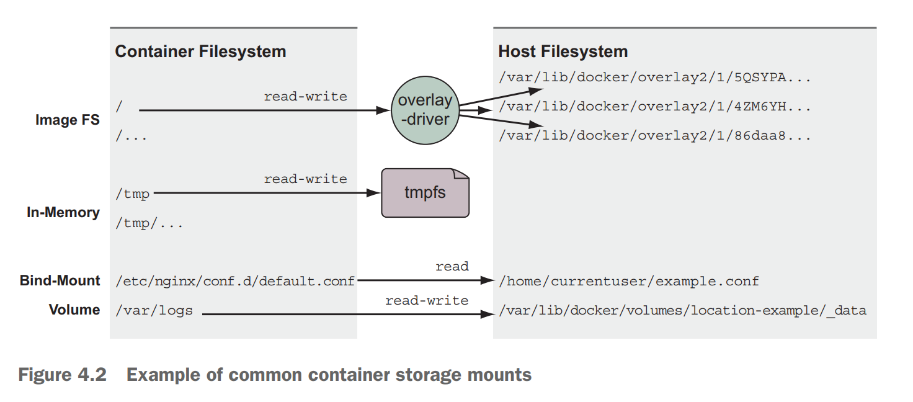

| `Types` | `Pros` | `Cons` |
|--------------|--------------------|---|
| Bind mounts | Most straightforward/flexible.  | Must explicitly specify a file path on host  |
| Volumes | Cross disk/file system; Docker manage volumes, no need to worry about conflict;  | Data exist on host could not easily be shared to containers.  |
| tmpfs mounts  | High performant; Secure |  Could not share among multiple containers  |

### Bind mounts (host path)
#### Use case
* Bind mounts are useful when the host provides a file or directory that is needed by a program running in a container, or when that containerized program produces a file or log that is processed by users or programs running outside containers
* History: Exist since Linux 2.4 kernel 2001. 

#### Pros
* Much more performant than unionfilesystem. 
* Across file systems
* Across disks

#### Cons
* It ties otherwise portable container descriptions to the filesystem of a specific host.
* It creates an opportunity for conflict with other containers

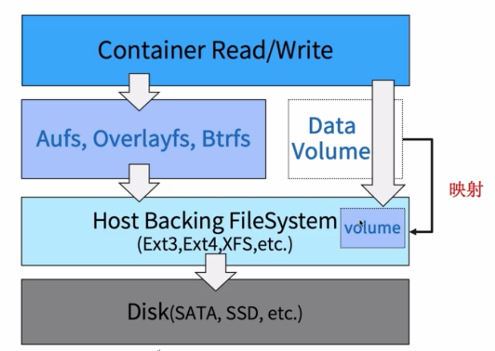

#### Command

```
// category 2: --mount format
docker run -d --name test1 --mount type=bind,src=/host/app,dst=/app
```

### Docker volumes
* Use case: Using volumes is a method of decoupling storage from specialized locations on the filesystem that you might specify with bind mounts.

#### Pros
* User does not need to remember a hardcoded hostpath. It only needs to use the correct volume name. 

#### Command

```
docker volume create/rm/ls/inspect/prune [-d local] volName

-v volumeName:containerPath
-v containerPath
--mount type=volume, src={volumeName}, dest={containerPath}
```

### In-memory storage
#### Use case
* Most service software and web applications use private key files, database passwords, API key files, or other sensitive configuration files, and need upload buffering space.
In these cases, it is important that you never include those types of files in an image or write them to disk. 

#### Internal mechanism
* Linux tmpfs: 

```
mkdir /my-tmp && mount -t tmpfs -o size=20m tmpfs /my-tmp
```

* tmpfs volume

```
docker run -d --name tmptest --mount type=tmpfs, dst=/app, tmpfs-size=10k, busybox:1.24
```

## Docker network
### Linux Net namespace
* Net namespace will have an independent network stack including 
  * Network interface controller
  * IP/MAC
  * ARP
  * iptables/ipvs
  * Socket
  * Network parameters with namespace attributes

#### Connect two net namespaces
* Linux veth pair

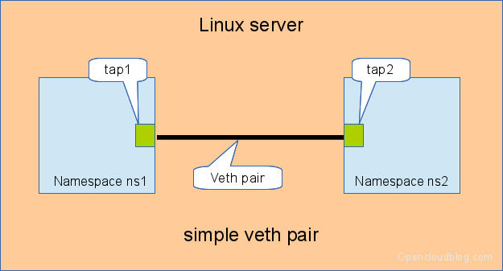

#### Connect multiple net namespaces
* Problem: Use veth pair will result in exponential number of pairs
  * Linux bridge
  * Routing table

### Docker CNM

#### Host
#### Bridge

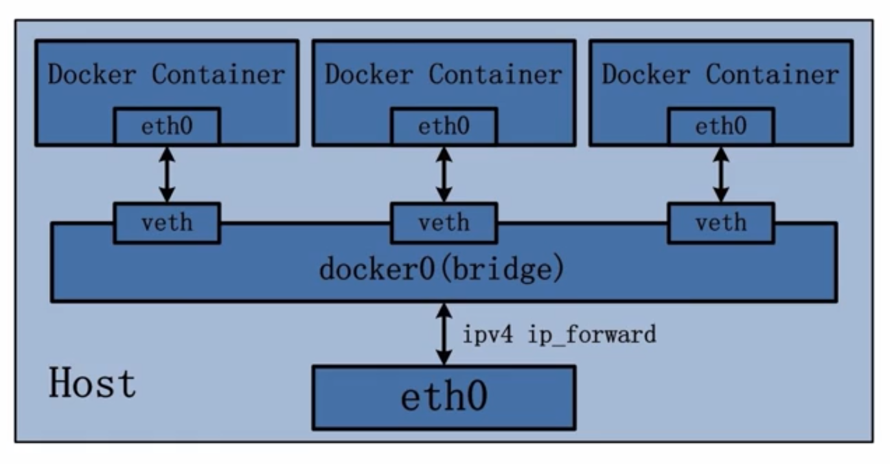


#### Underlay and overlay
* Use case: Cross node communication


#### None + plugin

#### Connect multiple net namespaces

## References
* [container and CICD](https://time.geekbang.org/course/detail/100003901-2279)
* [Why container and Docker](https://time.geekbang.org/column/article/41977)
* [Container management with Mesos](https://time.geekbang.org/course/detail/100003901-2280)
* [Docker image repo and deployment](https://time.geekbang.org/column/article/42167)
* [Docker orchestration](https://time.geekbang.org/column/article/42477)
* [Container DevOps platform](https://time.geekbang.org/column/article/42604)
* [CI, CD](https://time.geekbang.org/column/article/42825)

## Real world
* Netflix container journey: https://netflixtechblog.com/the-evolution-of-container-usage-at-netflix-3abfc096781b