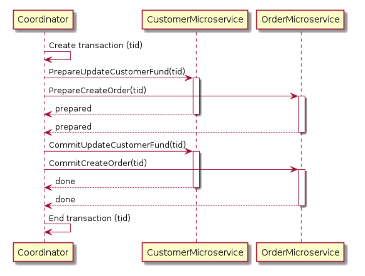
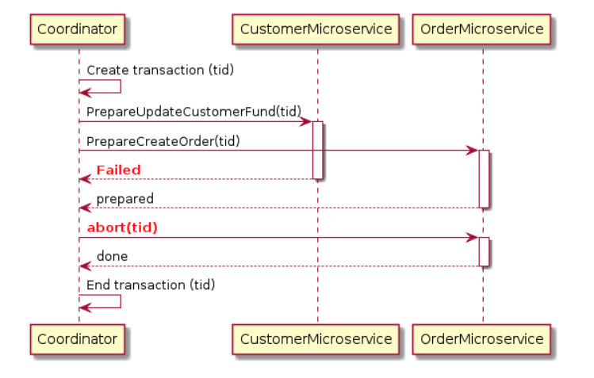

<!-- MarkdownTOC -->

- [Managing transactions](#managing-transactions)
	- [Motivation](#motivation)
	- [ACID consistency model](#acid-consistency-model)
		- [Definition](#definition)
		- [XA standards - Distributed transactions](#xa-standards---distributed-transactions)
			- [2PC - Two phase commit](#2pc---two-phase-commit)
				- [Assumptions](#assumptions)
				- [Process](#process)
				- [Proof of correctness](#proof-of-correctness)
				- [Pros](#pros)
				- [Cons](#cons)
				- [References](#references)
			- [3PC - Three phase commit](#3pc---three-phase-commit)
				- [Motivation](#motivation-1)
				- [Limitation](#limitation)
				- [References](#references-1)
		- [TCC](#tcc)
		- [Seata](#seata)
	- [BASE consistency model](#base-consistency-model)
		- [Definition](#definition-1)
		- [Uber Cadence](#uber-cadence)
		- [Distributed Sagas](#distributed-sagas)
			- [Motivation](#motivation-2)
			- [Definition](#definition-2)
			- [Assumptions](#assumptions-1)
			- [Approaches](#approaches)
			- [Examples](#examples)
			- [Pros](#pros-1)
			- [Cons](#cons-1)
			- [References](#references-2)
		- [Message queue based implementation](#message-queue-based-implementation)
- [Real world](#real-world)
	- [[TODO:::] https://coding.imooc.com/class/237.html](#todo-httpscodingimooccomclass237html)
- [Consensus protocol](#consensus-protocol)
	- [PAXOS](#paxos)
	- [Raft](#raft)
	- [ZAB algorithm](#zab-algorithm)
		- [Algorithm](#algorithm)
		- [Design considerations:](#design-considerations)
		- [Pros and Cons](#pros-and-cons)

<!-- /MarkdownTOC -->

# Managing transactions
## Motivation
* Database is partitioned across multiple machines for scalability. A transaction might touch more than one partition. How do we guarantee that all of the partitions commit the transaction or none commit the transactions?
* Example: 
	* Transfer money from A to B
		1. Debit at A, credit at B, tell the client Okay
		2. Require both banks to do it, or neither
		3. Require that one bank never act alone
	* A travel booking edge service invokes several low level services (car rental service, hotel reservation service, airline reservation service)

## ACID consistency model
### Definition
* Atomic: Everything in a transaction succeeds or the entire transaction is rolled back.
* Consistent: A transaction cannot leave the database in an inconsistent state.
* Isolated: Transactions cannot interfere with each other.
* Durable: Completed transactions persist, even when servers restart etc.

### XA standards - Distributed transactions
#### 2PC - Two phase commit
##### Assumptions
* The protocol works in the following manner: 
	1. One node is designated the coordinator, which is the master site, and the rest of the nodes in the network are called cohorts.  
	2. Stable storage at each site and use of a write ahead log by each node. 
	3. The protocol assumes that no node crashes forever, and eventually any two nodes can communicate with each other. The latter is not a big deal since network communication can typically be rerouted. The former is a much stronger assumption; suppose the machine blows up!

##### Process
1. PREPARE phase
	1. COORDINATOR: The COORDINATOR sends the message to each COHORT. The COORDINATOR is now in the preparing transaction state. Now the COORDINATOR waits for responses from each of the COHORTS. 
	2. COHORTS:  	
		* If a "PREPARE" message is received for some transaction t which is unknown at the COHORT ( never ran, wiped out by crash, etc ), reply "ABORT". 
		* Otherwise write the new state of the transaction to the UNDO and REDO log in permanent memory. This allows for the old state to be recovered ( in event of later abort ) or committed on demand regardless of crashes. The read locks of a transaction may be released at this time; however, the write locks are still maintained. Now send "AGREED" to the COORDINATOR.
	3. (Optional) COORDINATOR: If after some time period some COHORT has not responded COORDINATOR will retransmit the "PREPARE" message and go to step 1.1.

2. COMMIT phase
	1. COORDINATOR: 
		* If any COHORT responds ABORT then the transaction must be aborted, 
			- Send the ABORT message to each COHORT.
		* If all COHORTS respond AGREED then the transaction may be commited
			- Record in the logs a COMPLETE to indication the transaction is now completing. 
			- Send COMMIT message to each of the COHORTS and then erase all associated information from permanent memory ( COHORT list, etc. ).
	2. COHORTS: 
		* If the COHORT receives a "COMMIT" message from COORDINATOR
			- Each cohort undoes the transaction using the undo log, and releases the resources and locks held during the transaction.
			- Each cohort sends an acknowledgement to the coordinator.
		* If the COHORT receives an "ABORT" message from COORDINATOR
			- Each cohort completes the operation, and releases all the locks and resources held during the transaction.
			- Each cohort sends an acknowledgment to the coordinator.
	3. (Optional) COORDINATOR: If after some time period all COHORTS do not respond the COORDINATOR can either transmit "ABORT" messages or "COMMIT" to all COHORTS to the COHORTS that have not responded. In either case the COORDINATOR will eventually go to state 2.1. 
	4. COORDINATOR: The coordinator completes the transaction when acknowledgements have been received.

* Success case



* Failure case 



##### Proof of correctness
* We assert the claim that if one COHORT completes the transaction all COHORTS complete the transaction eventually. The proof for correctness proceeds somewhat informally as follows: If a COHORT is completing a transaction, it is so only because the COORDINATOR sent it a COMMT message. This message is only sent when the COORDINATOR is in the commit phase, in which case all COHORTS have responded to the COORDINATOR AGREED. This means all COHORTS have prepared the transaction, which implies any crash at this point will not harm the transaction data because it is in permanent memory. Once the COORDINATOR is completing, it is insured every COHORT completes before the COORDINATOR's data is erased. Thus crashes of the COORDINATOR do not interfere with the completion.
* Therefore if any COHORT completes, then they all do. The abort sequence can be argued in a similar manner. Hence the atomicity of the transaction is guaranteed to fail or complete globally.

##### Pros
1. 2pc is a very strong consistency protocol. First, the prepare and commit phases guarantee that the transaction is atomic. The transaction will end with either all microservices returning successfully or all microservices have nothing changed.
2. 2pc allows read-write isolation. This means the changes on a field are not visible until the coordinator commits the changes.

##### Cons
1. Performance bottleneck. 
	- Synchrounous blocking pattern could be a performance bottleneck. The protocol will need to lock the object that will be changed before the transaction completes. In the example above, if a customer places an order, the “fund” field will be locked for the customer. This prevents the customer from applying new orders. This makes sense because if a “prepared” object changed after it claims it is “prepared,” then the commit phase could possibly not work. This is not good. In a database system, transactions tend to be fast—normally within 50 ms. However, microservices have long delays with RPC calls, especially when integrating with external services such as a payment service. The lock could become a system performance bottleneck. Also, it is possible to have two transactions mutually lock each other (deadlock) when each transaction requests a lock on a resource the other requires.
	- The whole system is bound by the slowest resource since any ready node will have to wait for confirmation from a slower node which is yet to confirm its status.
2. Single point of failure. Coordinator failures could become a single point of failure, leading to infinite resource blocking. More specifically, if a cohort has sent an agreement message to the coordinator, it will block until a commit or rollback is received. If the coordinator is permanently down, the cohort will block indefinitely, unless it can obtain the global commit/abort decision from some other cohort. When the coordinator has sent "Query-to-commit" to the cohorts, it will block until all cohorts have sent their local decision.
3. Data inconsistency. There is no mechanism to rollback the other transaction if one micro service goes unavailable in commit phase. If in the "Commit phase" after COORDINATOR send "COMMIT" to COHORTS, some COHORTS don't receive the command because of timeout then there will be inconsistency between different nodes. 

##### References
1. [Reasoning behind two phase commit](./files/princeton-2phasecommit.pdf)
2. [Discuss failure cases of two phase commits](https://www.the-paper-trail.org/post/2008-11-27-consensus-protocols-two-phase-commit/)

#### 3PC - Three phase commit
##### Motivation
* The fundamental difficulty with 2PC is that, once the decision to commit has been made by the co-ordinator and communicated to some replicas, the replicas go right ahead and act upon the commit statement without checking to see if every other replica got the message. Then, if a replica that committed crashes along with the co-ordinator, the system has no way of telling what the result of the transaction was (since only the co-ordinator and the replica that got the message know for sure). Since the transaction might already have been committed at the crashed replica, the protocol cannot pessimistically abort - as the transaction might have had side-effects that are impossible to undo. Similarly, the protocol cannot optimistically force the transaction to commit, as the original vote might have been to abort.
* We break the second phase of 2PC - ‘commit’ - into two sub-phases. The first is the ‘prepare to commit’ phase. The co-ordinator sends this message to all replicas when it has received unanimous ‘yes’ votes in the first phase. On receipt of this messages, replicas get into a state where they are able to commit the transaction - by taking necessary locks and so forth - but crucially do not do any work that they cannot later undo. They then reply to the co-ordinator telling it that the ‘prepare to commit’ message was received.

##### Limitation
* So does 3PC fix all our problems? Not quite, but it comes close. In the case of a network partition, the wheels rather come off - imagine that all the replicas that received ‘prepare to commit’ are on one side of the partition, and those that did not are on the other. Then both partitions will continue with recovery nodes that respectively commit or abort the transaction, and when the network merges the system will have an inconsistent state. So 3PC has potentially unsafe runs, as does 2PC, but will always make progress and therefore satisfies its liveness properties. The fact that 3PC will not block on single node failures makes it much more appealing for services where high availability is more important than low latencies.

##### References
* https://www.the-paper-trail.org/post/2008-11-29-consensus-protocols-three-phase-commit/
* http://courses.cs.vt.edu/~cs5204/fall00/distributedDBMS/sreenu/3pc.html

### TCC
- Implementation: Not used

### Seata

## BASE consistency model
### Definition
* Basic availability: The database appears to work most of the time
* Soft-state: Stores don't have to be write-consistent, nor do different replicas have to be mutally consistent all the time
* Eventual consistency: The datastore exhibit consistency at some later point (e.g. lazily at read time)

### Uber Cadence

### Distributed Sagas 
#### Motivation
* Using distributed transaction to maintain data consistency suffers from the following two pitfalls
	- Many modern technologies including NoSQL databases such as MongoDB and Cassandra don't support them. Distributed transactions aren't supported by modern message brokers such as RabbitMQ and Apache Kafka. 
	- It is a form of syncronous IPC, which reduces availability. In order for a distributed transaction to commit, all participating services must be available. If a distributed transaction involves two services that are 99.5% available, then the overall availability is 99\%. Each additional service involved in a distributed transaction further reduces availability. 
* Sagas are mechanisms to maintain data consistency in a microservice architecture without having to use distributed transactions. 
* Distributed sagas execute transactions that span multiple physical databases by breaking them into smaller transactions and compensating transactions that operate on single databases.

#### Definition
* High entry bar: First need to build a state machine. A saga is a state machine. 
* A distributed saga is a collection of requests. Each request has a compensating request on failure. A dsitributed saga guarantees the following properties:
	1. Either all Requests in the Saga are succesfully completed, or
	2. A subset of Requests and their Compensating Requests are executed.
- Limitation: Does not guarantee the separation
	- Solution 1: Semantic lock

#### Assumptions
* For distributed sagas to work, both requests and compensating requests need to obey certain characteristics:
	1. Requests and Compensating Requests must be idempotent, because the same message may be delivered more than once. However many times the same idempotent request is sent, the resulting outcome must be the same. An example of an idempotent operation is an UPDATE operation. An example of an operation that is NOT idempotent is a CREATE operation that generates a new id every time.
	2. Compensating Requests must be commutative, because messages can arrive in order. In the context of a distributed saga, it’s possible that a Compensating Request arrives before its corresponding Request. If a BookHotel completes after CancelHotel, we should still arrive at a cancelled hotel booking (not re-create the booking!)
	3. Requests can abort, which triggers a Compensating Request. Compensating Requests CANNOT abort, they have to execute to completion no matter what.

#### Approaches
* Event-driven choreography: When there is no central coordination, each service produces and listen to other service’s events and decides if an action should be taken or not.
* Command/Orchestration: When a coordinator service is responsible for centralizing the saga’s decision making and sequencing business logic.

#### Examples
tation: Uber Cadence

#### Pros
* Support for long-lived transactions. Because each microservice focuses only on its own local atomic transaction, other microservices are not blocked if a microservice is running for a long time. This also allows transactions to continue waiting for user input. Also, because all local transactions are happening in parallel, there is no lock on any object.

#### Cons
* Difficult to debug, especially when many microservices are involved. 
* The event messages could become difficult to maintain if the system gets complex. 
* It does not have read isolation. For example, the customer could see the order being created, but in the next second, the order is removed due to a compensation transaction.

#### References
* https://dzone.com/articles/distributed-sagas-for-microservices
* https://chrisrichardson.net/post/antipatterns/2019/07/09/developing-sagas-part-1.html

### Message queue based implementation

```
                                                                                                      ─                    
                                                                                                                           
                                                                                                                           
                                                                                                                           
                                                                                                                           
                                                                                     (Optional)     ┌─────────────────┐    
                                                                                     Step10. Put    │                 │    
                                                                                      into dead     │Dead letter queue│    
                                                                                      queue if  ─ ─▶│                 │    
                                                                                      retry too     │                 │    
                                                                                     many times     └─────────────────┘    
              ┌ ─ ─ ─ ─ ─ ─ ─ ─ ─ ─ ─ ─ ─ ─ ─ ─ ─ ─ ─ ─                                                                    
                                                       │                              │                                    
            (Optional) Step4. If  ┌────────────────────▼────────────────────┐                                              
            confirm not received  │  ┌───────────────────────────────────┐  │         │                                    
            within certain time,  │  │                                   │  │                                              
                    retry   ┌─────┼─▶│             Exchange              │  │         │                                    
              │             │     │  │                                   │  │             (Optional)                       
        ┌──────────┐        │     │  └───────────────────────────────────┘  │         │  Step9. Queue                      
        │Ecommerce │    Step2.    │                    │                    │            retry if ack                      
     ┌──│  Order   │───RabbitMQ   │                    │                    │         ├ ─not received ─ ─                  
     │  │ Service  │   Confirm    │                    │                    │           within certain   │                 
     │  └──────────┘  mechanism   │                    ▼                    │         │      time        ▼                 
     │                            │┌───────────────────────────────────────┐│                      ┌───────────┐           
     │                            ││                 Queue                 ││         │            │           │           
     │                            ││                                       ││                      │           │           
     │                            ││     Step5. Store message in queue     ││         │            │ Ecommerce │           
     │                            ││                                       ││                      │ Shipment  │           
     │                            ││┌ ─ ─ ─ ─ ─ ─ ─ ─ ─ ─ ─ ─ ─ ─ ─ ─ ─ ─  ││         │   Step6.   │  Service  │           
     │                            ││   OrderId | UserId | Order Content  │ ││              Send    │           │           
  step1.                          │││  --------------------------------   ─┼┼─────────┴──message──▶│(Idempotenc│────────┐  
  Create                          ││   10001   |  tom   |   toothpaste   │ ││                      │ y for the │        │  
order and                         ││└ ─ ─ ─ ─ ─ ─ ─ ─ ─ ─ ─ ─ ─ ─ ─ ─ ─ ─  ││                      │   same    │        │  
 message                          ││                                       ││                      │ message)  │        │  
   row.                           │└───────────────────────────────────────┘│                      │           │        │  
     │                            │                    ▲                    │                      │           │        │  
     │                            │                Rabb│t MQ                │                      │           │        │  
     │                            └────────────────────┼────────────────────┘                      └───────────┘  step7.   
     │                                                 │                                                 │     Create order
     │                                                 │            Step8. Send Ack for RabbitMQ         │              │  
     │                                                 └──────────────to delete msg from queue───────────┘              │  
     │  ┌─────────────────────────────────────────────────────────────┐  ┌───────────────────────────────────────────┐  │  
     │  │                  Ecommerce Order Database                   │  │        Ecommerce Shipment Database        │  │  
     │  │                                                             │  │                                           │  │  
     │  │                       ┌ ─ ─ ─ ─ ─ ─ ─ ─ ─ ─ ─ ─ ─ ─ ─ ─ ─ ─ │  │┌ ─ ─ ─ ─ ─ ─ ─ ─ ─ ─ ─ ─ ─ ─ ─ ─ ─ ─ ─ ─  │  │  
     │  │                          OrderId | UserId | Order Content  ││  │   OrderId | ShipperId | Shipment status │ │  │  
     │  │                       │  --------------------------------   │  ││  --------------------------------------  │  │  
     │  │                          10001   |  tom   |   toothpaste   ││  │   10001   |  david    | out for delivery│ │  │  
     └─▶│                       └ ─ ─ ─ ─ ─ ─ ─ ─ ─ ─ ─ ─ ─ ─ ─ ─ ─ ─ │  │└ ─ ─ ─ ─ ─ ─ ─ ─ ─ ─ ─ ─ ─ ─ ─ ─ ─ ─ ─ ─  │◀─┘  
        │ ┌ ─ ─ ─ ─ ─ ─ ─ ─ ─ ─ ─ ─ ─ ─ ─ ─ ─ ─ ─ ─ ─ ─ ─ ─ ─ ─ ─ ─ ┐ │  │                                           │     
        │    MessageId | Message Content | status |  creation time    │  │                                           │     
        │ │-------------------------------------------------------- │ │  │                                           │     
        │    9890      | {orderId:10001} | sent   |  2018111420       │  │                                           │     
        │ └ ─ ─ ─ ─ ─ ─ ─ ─ ─ ─ ─ ─ ─ ─ ─ ─ ─ ─ ─ ┬ ─ ─ ─ ─ ─ ─ ─ ─ ┘ │  │                                           │     
        └─────────────────────────────────────────┼───────────────────┘  └───────────────────────────────────────────┘     
                                                  │                                                                        
                                     Step3. change to Acked upon                                                           
                                     receiving RabbitMQ Confirm                                                            
                                                  │                                                                        
          ┌ ─ ─ ─ ─ ─ ─ ─ ─ ─ ─ ─ ─ ─ ─ ─ ─ ─ ─ ─ ┼ ─ ─ ─ ─ ─ ─ ─ ─ ─ ─ ─ ─ ─                                              
             MessageId | Message Content | Message│status |  creation time   │                                             
          │---------------------------------------▼------------------------                                                
             9890      | {orderId:10001} |       Acked    |  2018111420      │                                             
          └ ─ ─ ─ ─ ─ ─ ─ ─ ─ ─ ─ ─ ─ ─ ─ ─ ─ ─ ─ ─ ─ ─ ─ ─ ─ ─ ─ ─ ─ ─ ─ ─ ─                                              
```

# Real world
## [TODO:::] https://coding.imooc.com/class/237.html
* Database XA/JTA protocol based. 
	- Need database support/Java component atomikos
* Asynchronous checking the parity
	- Paypal needs to match 
* **Message queue based**
	- Generalize well. Suitable for asynchronous scenarios
* TCC programming based
	- Typical ecommerce system 

# Consensus protocol
## PAXOS

## Raft

## ZAB algorithm
### Algorithm
* Consistency algorithm: ZAB algorithm
* To build the lock, we'll create a persistent znode that will serve as the parent. Clients wishing to obtain the lock will create sequential, ephemeral child znodes under the parent znode. The lock is owned by the client process whose child znode has the lowest sequence number. In Figure 2, there are three children of the lock-node and child-1 owns the lock at this point in time, since it has the lowest sequence number. After child-1 is removed, the lock is relinquished and then the client who owns child-2 owns the lock, and so on.
* The algorithm for clients to determine if they own the lock is straightforward, on the surface anyway. A client creates a new sequential ephemeral znode under the parent lock znode. The client then gets the children of the lock node and sets a watch on the lock node. If the child znode that the client created has the lowest sequence number, then the lock is acquired, and it can perform whatever actions are necessary with the resource that the lock is protecting. If the child znode it created does not have the lowest sequence number, then wait for the watch to trigger a watch event, then perform the same logic of getting the children, setting a watch, and checking for lock acquisition via the lowest sequence number. The client continues this process until the lock is acquired.
* Reference: https://nofluffjuststuff.com/blog/scott_leberknight/2013/07/distributed_coordination_with_zookeeper_part_5_building_a_distributed_lock

### Design considerations:
* How would the client know that it successfully created the child znode if there is a partial failure (e.g. due to connection loss) during znode creation
	- The solution is to embed the client ZooKeeper session IDs in the child znode names, for example child-<sessionId>-; a failed-over client that retains the same session (and thus session ID) can easily determine if the child znode was created by looking for its session ID amongst the child znodes.
* How to avoid herd effect? 
	- In our earlier algorithm, every client sets a watch on the parent lock znode. But this has the potential to create a "herd effect" - if every client is watching the parent znode, then every client is notified when any changes are made to the children, regardless of whether a client would be able to own the lock. If there are a small number of clients this probably doesn't matter, but if there are a large number it has the potential for a spike in network traffic. For example, the client owning child-9 need only watch the child immediately preceding it, which is most likely child-8 but could be an earlier child if the 8th child znode somehow died. Then, notifications are sent only to the client that can actually take ownership of the lock.

### Pros and Cons
* Reliable
* Need to create ephemeral nodes which are not as efficient


