- [Kubernetes](#kubernetes)
  - [History](#history)
  - [Use cases](#use-cases)
  - [Components](#components)
    - [Control panel](#control-panel)
    - [Workload panel](#workload-panel)
  - [Deploy to Kubernetes](#deploy-to-kubernetes)
  - [Kubernetes API](#kubernetes-api)
  - [References](#references)

# Kubernetes
## History

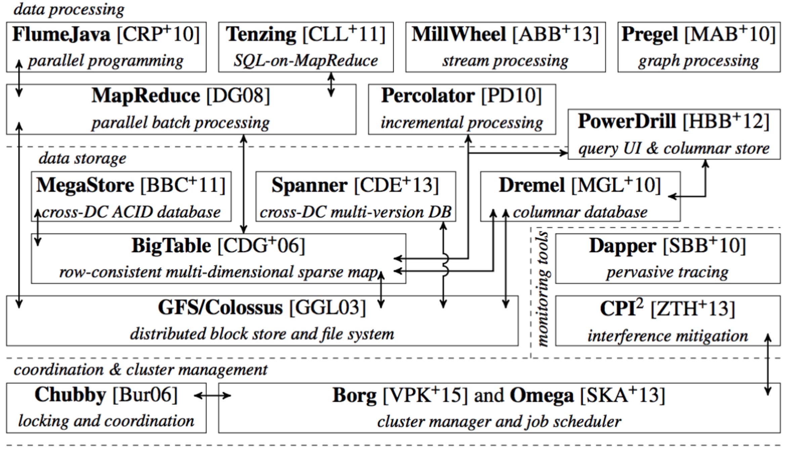

## Use cases

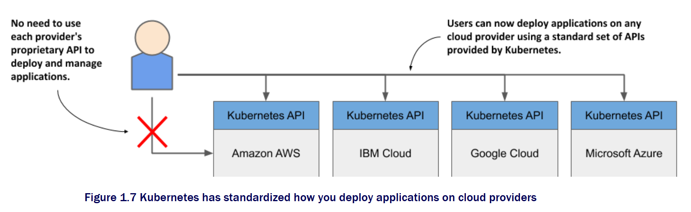

* Kubernetes provides the following:
  * Service discovery
  * Horizontal scaling
  * Load balancing
  * Self-healing 
  * Leader election

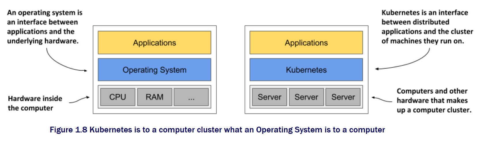

## Components

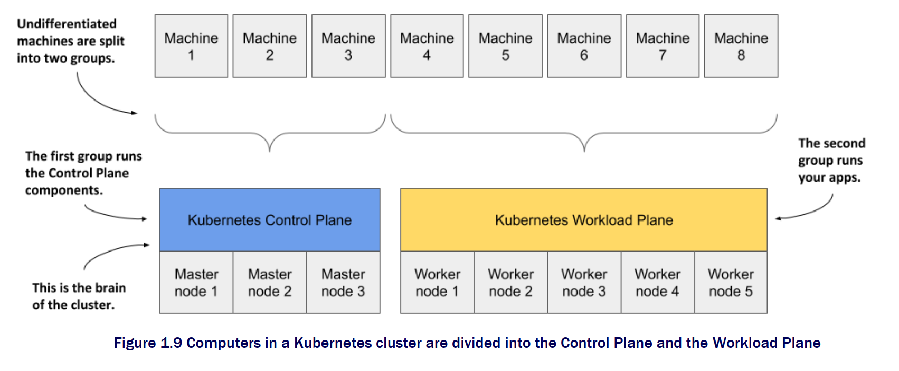

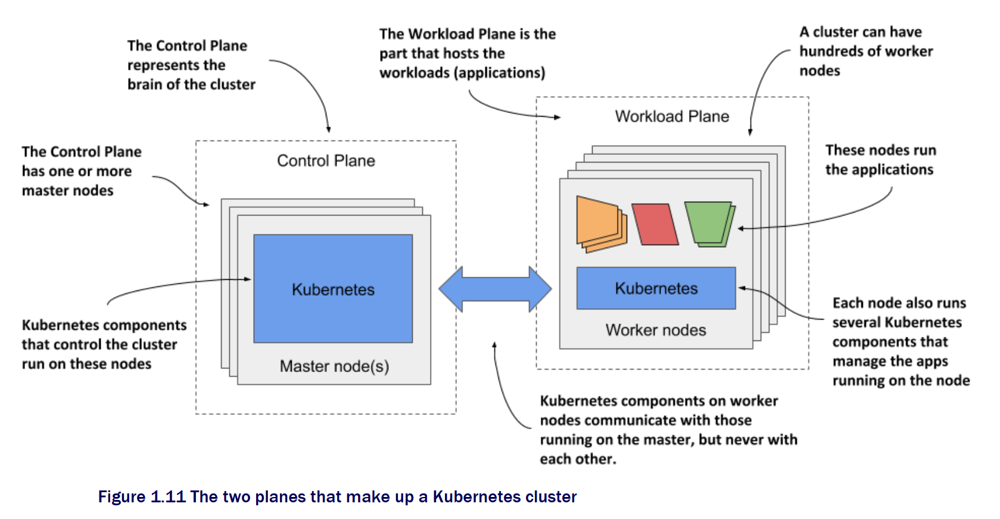

### Control panel
* The Kubernetes API Server exposes the RESTful Kubernetes API. Engineers using the cluster and other Kubernetes components create objects via this API.
* The etcd distributed datastore persists the objects you create through the API, since the API Server itself is stateless. The Server is the only component that talks to etcd.
* The Scheduler decides on which worker node each application instance should run.
* Controllers bring to life the objects you create through the API. Most of them simply create other objects, but some also communicate with external systems (for example, the cloud provider via its API).

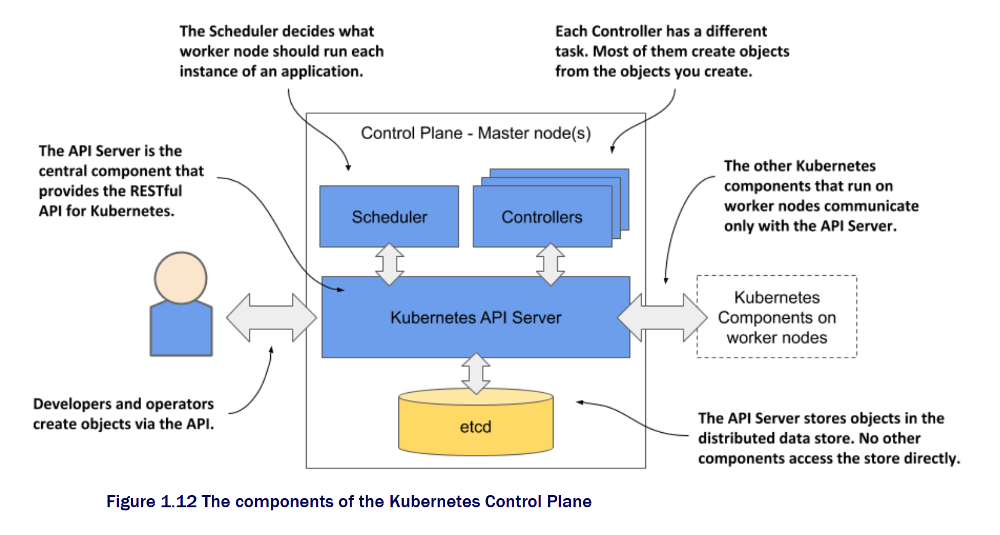

### Workload panel
* The Kubelet, an agent that talks to the API server and manages the applications running on its node. It reports the status of these applications and the node via the API.
* The Container Runtime, which can be Docker or any other runtime compatible with Kubernetes. It runs your applications in containers as instructed by the Kubelet.
* The Kubernetes Service Proxy (Kube Proxy) load-balances network traffic between applications. Its name suggests that traffic flows through it, but that’s no longer the case. 

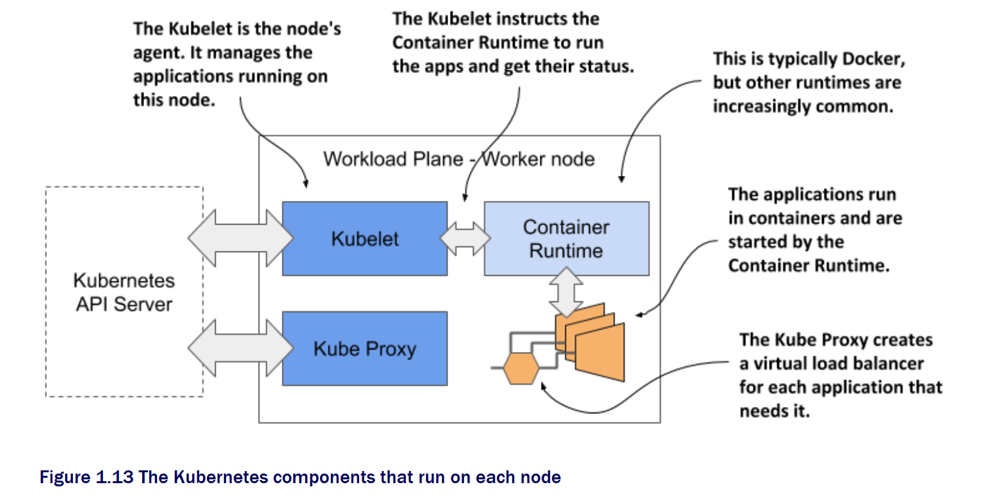

## Deploy to Kubernetes

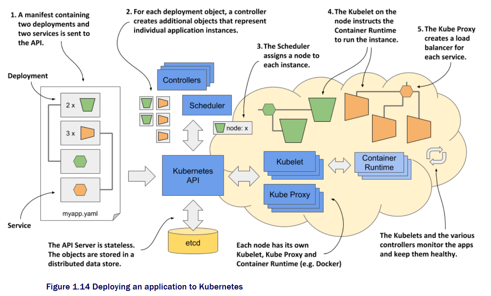

* Pods

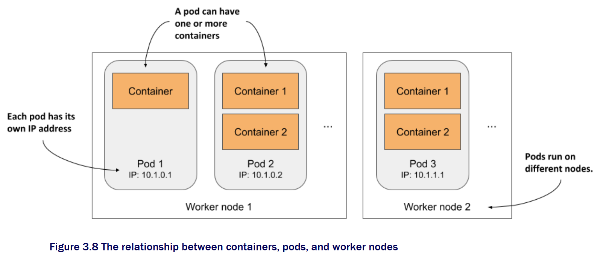

* Objects

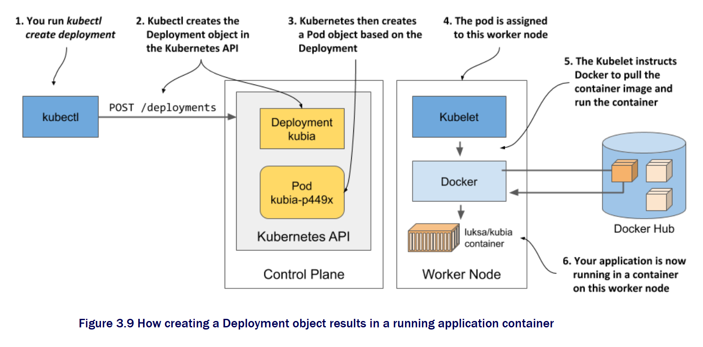

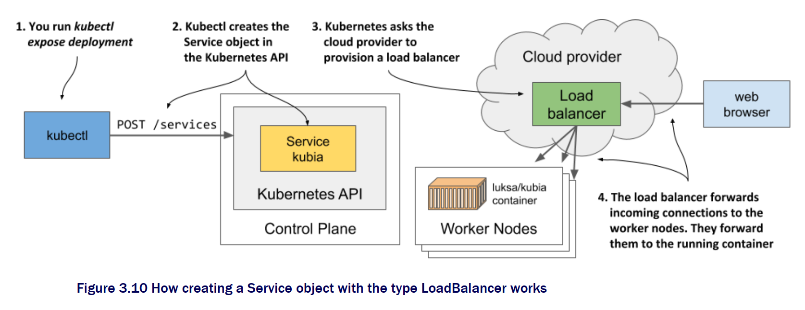

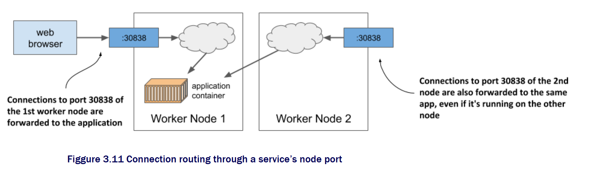

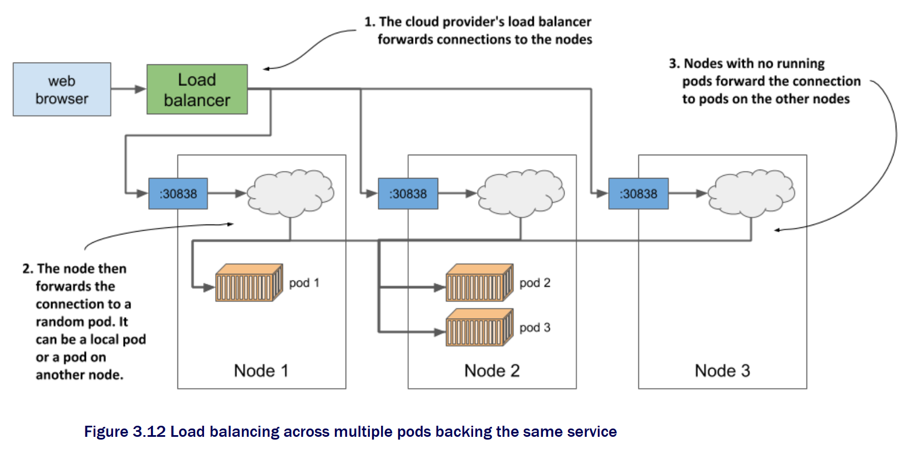

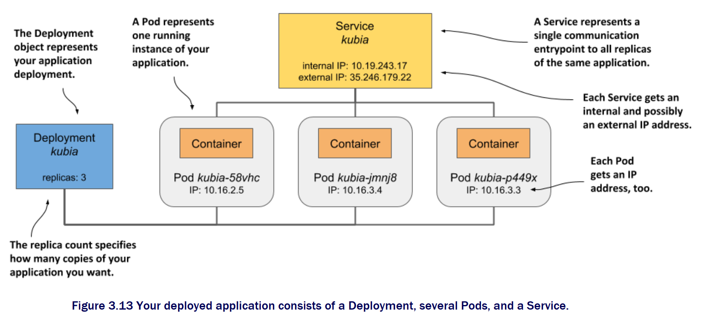

## Kubernetes API

## References
* [Kubernetes in Action](https://www.manning.com/books/kubernetes-in-action)