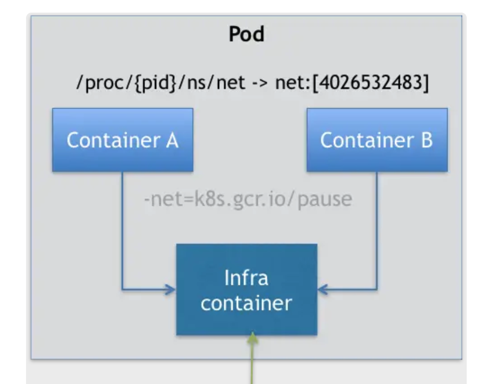

- [Kubernetes](#kubernetes)
  - [History](#history)
  - [Use cases](#use-cases)
  - [Components](#components)
    - [Control panel](#control-panel)
    - [Workload panel](#workload-panel)
  - [Deploy to Kubernetes](#deploy-to-kubernetes)
  - [Container](#container)
    - [Attributes](#attributes)
      - [ImagePullPolicy](#imagepullpolicy)
      - [LifeCycle](#lifecycle)
  - [Pod](#pod)
    - [Motivation](#motivation)
    - [Def](#def)
    - [Use case](#use-case)
      - [Sample: War and webapp](#sample-war-and-webapp)
    - [Attributes](#attributes-1)
      - [NodeSelector](#nodeselector)
      - [NodeName](#nodename)
      - [HostAlias](#hostalias)
      - [Namespace related](#namespace-related)
    - [Lifecycle](#lifecycle-1)
  - [References](#references)

# Kubernetes
## History


## Use cases


* Kubernetes provides the following:
  * Service discovery
  * Horizontal scaling
  * Load balancing
  * Self-healing 
  * Leader election


## Components


### Control panel
* The Kubernetes API Server exposes the RESTful Kubernetes API. Engineers using the cluster and other Kubernetes components create objects via this API.
* The etcd distributed datastore persists the objects you create through the API, since the API Server itself is stateless. The Server is the only component that talks to etcd.
* The Scheduler decides on which worker node each application instance should run.
* Controllers bring to life the objects you create through the API. Most of them simply create other objects, but some also communicate with external systems (for example, the cloud provider via its API).


### Workload panel
* The Kubelet, an agent that talks to the API server and manages the applications running on its node. It reports the status of these applications and the node via the API.
* The Container Runtime, which can be Docker or any other runtime compatible with Kubernetes. It runs your applications in containers as instructed by the Kubelet.
* The Kubernetes Service Proxy (Kube Proxy) load-balances network traffic between applications. Its name suggests that traffic flows through it, but that’s no longer the case. 


## Deploy to Kubernetes


* Pods


* Objects


## Container
### Attributes
#### ImagePullPolicy
* Default value is Always. Each time creating pod will pull the image. 

#### LifeCycle
* For example
  * PostStart: Runs immediately after containers get started. 
  * PreStop: Runs before containers get stopped. 

```yaml
apiVersion: v1
kind: Pod
metadata:
  name: lifecycle-demo
spec:
  containers:
  - name: lifecycle-demo-container
    image: nginx
    lifecycle:
      postStart:
        exec:
          command: ["/bin/sh", "-c", "echo Hello from the postStart handler > /usr/share/message"]
      preStop:
        exec:
          command: ["/usr/sbin/nginx","-s","quit"]
```

## Pod
### Motivation
* There will be the gang scheduling problem: How to orchestrate a group of containers. 
  * Mesos tries to solve using resource hoarding and Google Omega tries to use optimistic lock. 
  * Kubernetes avoid this problem because pod is the smallest unit. 
* Each container is a single process. 
  * Within a container, PID = 1 represents the process itself. And all other processes are the children of PID = 1 process. 
  * There could be many relationships between containers: File exchange, use localhost or socket file for communication, frequent remote procedure call, share some linux namespace. 

### Def
* Pod is only a logical concept and a group of containers having shared resources. All containers in a pod share the same network namespace and could share the same volume.  

* Why can't pod be realized by docker run command?
  * The dependency of starting different containers. 

```
$ docker run --net=B --volumes-from=B --name=A image-A ...
```

* Kubernetes has an intermediate container: Infra container. Other containers associate with each other by joining infra container's namespace. 
  * Infra container: Written in assembly language and super lightweight. Use a special container image called k8s.gcr.io/pause. It always stay in pause state and only has a size of 100-200KB after decompression. 



### Use case
* Container design model: When users want to run multiple applications in a container, they should first think whether they could be designed as multiple containers in a pod. 
* All containers inside a pod share the same network namespace. So network related configuration and management could be completed inside pod namespace. 
* Anything in the machine level (network, storage, security, orchestration) or Linux namespace level. 

#### Sample: War and webapp
* Problem: Java web depends on a war. It needs to be put under Tomcat's webapps directory. 
* Tries to solve with docker:
  * Put war under Tomcat's webapps directory. Cons: Will need to update the container image if need to upgrade war. 
  * Reference the war inside volume. Cons: To make the war within volume accessible to multiple containers, need to build a distributed file system. 
* Solution with pod: Side car model. Build war and tomcat into separate container images and combine them inside a pod. 
  * Init type of containers will start before regular containers. 

```yaml
apiVersion: v1
kind: Pod
metadata:
  name: javaweb-2
spec:
  initContainers:
  - image: geektime/sample:v2
    name: war
    command: ["cp", "/sample.war", "/app"]
    volumeMounts:
    - mountPath: /app
      name: app-volume
  containers:
  - image: geektime/tomcat:7.0
    name: tomcat
    command: ["sh","-c","/root/apache-tomcat-7.0.42-v2/bin/start.sh"]
    volumeMounts:
    - mountPath: /root/apache-tomcat-7.0.42-v2/webapps
      name: app-volume
    ports:
    - containerPort: 8080
      hostPort: 8001 
  volumes:
  - name: app-volume
    emptyDir: {}
```

### Attributes
#### NodeSelector
* Use case: Associated a pod with a node. 

```yaml
// the pod could only run inside a node with ssd tag. 
apiVersion: v1
kind: Pod
...
spec:
 nodeSelector:
   disktype: ssd
```

#### NodeName
* Use case: Orchestration name. 

#### HostAlias
* Use case: Define pod's hosts config file

```yaml
// Define alias foo.remote / bar.remote for host. 
apiVersion: v1
kind: Pod
...
spec:
  hostAliases:
  - ip: "10.1.2.3"
    hostnames:
    - "foo.remote"
    - "bar.remote"
...
```

#### Namespace related
* Use case: Share host network, IPC and PID

```yaml
apiVersion: v1
kind: Pod
metadata:
  name: nginx
spec:
  hostNetwork: true
  hostIPC: true
  hostPID: true
  containers:
  - name: nginx
    image: nginx
  - name: shell
    image: busybox
    stdin: true
    tty: true
```

### Lifecycle


## References
* [Kubernetes in Action](https://www.manning.com/books/kubernetes-in-action)
* [深入剖析Kubernetes](https://time.geekbang.org/column/article/40092)