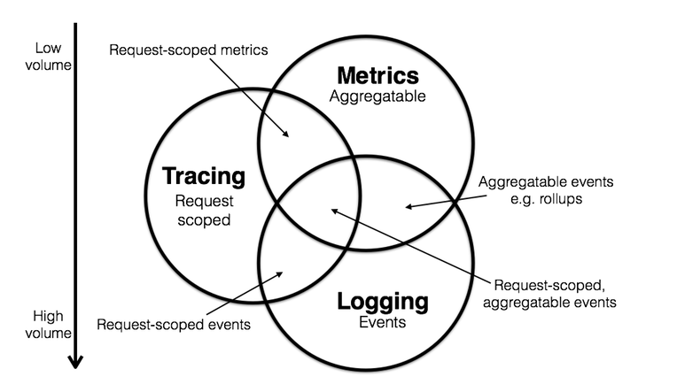
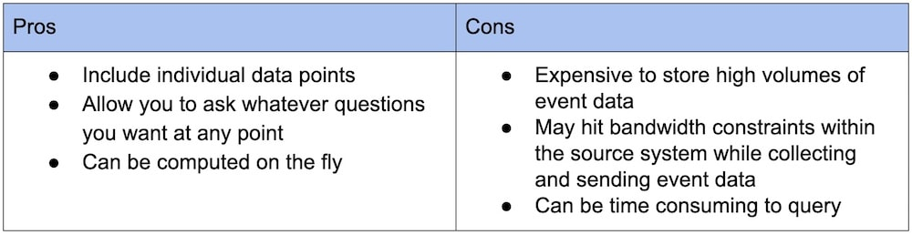
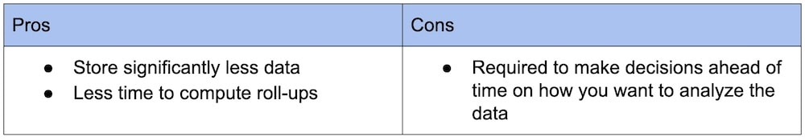
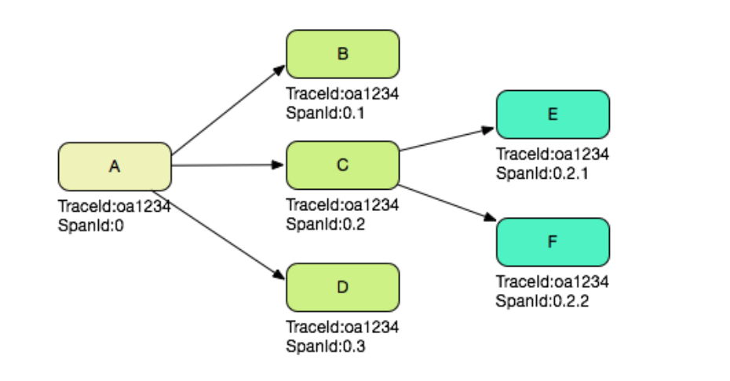

- [MicroSvcs observability](#microsvcs-observability)
	- [Target to observe](#target-to-observe)
	- [Telemetry types](#telemetry-types)
		- [Events](#events)
			- [Properties](#properties)
			- [use cases](#use-cases)
		- [Metrics](#metrics)
			- [Properties](#properties-1)
			- [Use cases](#use-cases-1)
		- [Logs](#logs)
			- [Properties](#properties-2)
			- [Usecase](#usecase)
		- [Traces](#traces)
			- [Properties](#properties-3)
			- [Usecase](#usecase-1)
			- [Data model](#data-model)
				- [TraceID](#traceid)
					- [Generation rule](#generation-rule)
					- [Sample rate](#sample-rate)
				- [SpanID](#spanid)
					- [Parent spanId](#parent-spanid)
					- [Dot spanId](#dot-spanid)
			- [OpenTracing API standards](#opentracing-api-standards)
			- [How to pass along TraceID/SpanId](#how-to-pass-along-traceidspanid)
				- [Pass](#pass)
	- [Architecture](#architecture)
		- [Requirements](#requirements)
		- [Flowchart](#flowchart)
		- [Component](#component)
			- [1. Data collection](#1-data-collection)
			- [2. Data transmission](#2-data-transmission)
			- [3. Data storage](#3-data-storage)
			- [4. Data display](#4-data-display)
				- [Offline analysis](#offline-analysis)
				- [Real-time analysis](#real-time-analysis)
	- [Existing solutions](#existing-solutions)
	- [Real world applications](#real-world-applications)
		- [Netflix](#netflix)
		- [Healthchecks.io](#healthchecksio)
	- [References](#references)

<!-- /MarkdownTOC -->

# MicroSvcs observability
## Target to observe
1. Infrastructure layer: Network traffic, Connection number, CPU, memory, disk
2. Dependencies: Cache, service availability
3. Application API layer: Business functionalities such as log in, checkout, etc. 
4. End user layer: E2E behaviors across different regions, devices, etc.

## Telemetry types
* Reference: https://newrelic.com/platform/telemetry-data-101



### Events
#### Properties
* Conceptually, an event can be defined as a discrete action happening at a moment in time. 
* Events become more powerful when you add more metadata to them.

#### use cases
* Events are useful when the data is relatively small or sporadic in nature, or when you don’t know the specific aggregates you want to see ahead of time. And each individual event is stored until it’s deleted.



### Metrics
#### Properties
* Metrics are numeric measurements. Metrics can include:
  - A numeric status at a moment in time (like CPU % used)
  - Aggregated measurements (like a count of events over a one-minute time, or a rate of events-per-minute)
* The types of metric aggregation are diverse (for example, average, total, minimum, maximum, sum-of-squares), but all metrics generally share the following traits:
  - A name
  - A timestamp
  - One or more numeric values



#### Use cases
* Metrics work well for large bodies of data or data collected at regular intervals when you know what you want to ask ahead of time, but they are less granular than event data.

### Logs
#### Properties
* Definitions:
  * logs are essentially just lines of text a system produces when certain code blocks get executed. 
* Structure: 
  * Similar to events, log data is discrete—it’s not aggregated—and can occur at irregular time intervals. Logs are also usually much more granular than events. In fact, one event can correlate to many log lines.
  * Log data is sometimes unstructured, and therefore hard to parse in a systematic way; however, these days you’re more likely to encounter “structured log data” that is formatted specifically to be parsed by a machine. Structured log data makes it easier and faster to search the data and derive events or metrics from the data. 

#### Usecase
* Developers rely on them heavily in order to troubleshoot their code and to retroactively verify and interrogate the code’s execution. Logs are incredibly versatile and have many use cases, and most software systems can emit log data. The most common use case for logs is for getting a detailed, play-by-play record of what happened at a particular time.

### Traces
#### Properties
* Definitions:
  * Traces—or more precisely, “distributed traces”—are samples of causal chains of events (or transactions) between different components in a microservices ecosystem. And like events and logs, traces are discrete and irregular in occurrence.
* Properties:
  * Traces that are stitched together form special events called “spans”; spans help you track a causal chain through a microservices ecosystem for a single transaction. To accomplish this, each service passes correlation identifiers, known as “trace context,” to each other; this trace context is used to add attributes on the span.

#### Usecase
* Trace data is needed when you care about the relationships between services/entities. If you only had raw events for each service in isolation, you’d have no way of reconstructing a single chain between services for a particular transaction.
* Additionally, applications often call multiple other applications depending on the task they’re trying to accomplish; they also often process data in parallel, so the call-chain can be inconsistent and timing can be unreliable for correlation. The only way to ensure a consistent call-chain is to pass trace context between each service to uniquely identify a single transaction through the entire chain.

#### Data model
* Each RPC request could be separated into four stages:
  * Caller sends the 

##### TraceID
* TraceId could be used to concatenate the call logs of a request on each server.

###### Generation rule
* Sample generation rule: 
  * The TraceId is typically generated by the first server that receives the request. The generation rule is: server IP + generated time + incremental sequence + current process ID, such as: 
* Example: 0ad1348f1403169275002100356696
  * The first 8 digits 0ad1348f is the IP of the machine that generates TraceId. This is a hexadecimal number, in which every two digits represents a part of IP. Based on the number, we can get a common IP address like 10.209.52.143 by converting every two digits into a decimal number. According to this rule, you can also figure out the first server that the request goes through.
  * The next 13 digits 1403169275002 is the time to generate the TraceId.
  * The next 4 digits 1003 is an auto-incrementing sequence that increases from 1000 to 9000. After reaching 9000, it returns to 1000 and then restarts to increase.
  * The last 5 digits 56696 is the current process ID. Its role in tracerId is to prevent the TraceId conflicts caused by multiple processes in a single machine.

###### Sample rate
* Sampling states applied to the trace ID, not the span ID. 
* There are four possible values for sample rate: 
  * Accept: Decide to include
  * Debug: 
  * Defer: Could not make the decision on whether to trace or not. For example, wait for certain proxy to make the decision. 
  * Deny: Decide to exclude
* The most common use of sampling is probablistic: eg, accept 0.01% of traces and deny the rest. Debug is the least common use case.
* Reference: https://github.com/openzipkin/b3-propagation

```
   Client Tracer                                                  Server Tracer     
┌───────────────────────┐                                       ┌───────────────────────┐
│                       │                                       │                       │
│   TraceContext        │          Http Request Headers         │   TraceContext        │
│ ┌───────────────────┐ │         ┌───────────────────┐         │ ┌───────────────────┐ │
│ │ TraceId           │ │         │ X-B3-TraceId      │         │ │ TraceId           │ │
│ │                   │ │         │                   │         │ │                   │ │
│ │ ParentSpanId      │ │ Inject  │ X-B3-ParentSpanId │ Extract │ │ ParentSpanId      │ │
│ │                   ├─┼────────>│                   ├─────────┼>│                   │ │
│ │ SpanId            │ │         │ X-B3-SpanId       │         │ │ SpanId            │ │
│ │                   │ │         │                   │         │ │                   │ │
│ │ Sampling decision │ │         │ X-B3-Sampled      │         │ │ Sampling decision │ │
│ └───────────────────┘ │         └───────────────────┘         │ └───────────────────┘ │
│                       │                                       │                       │
└───────────────────────┘                                       └───────────────────────┘

```

##### SpanID
* Span ID could be used to determine the order of execution for all calls happened within the same Trace ID.

```
// Temporal relationships between Spans in a single Trace

––|–––––––|–––––––|–––––––|–––––––|–––––––|–––––––|–––––––|–> time

 [Span A···················································]
   [Span B··············································]
      [Span D··········································]
    [Span C········································]
         [Span E·······]        [Span F··] [Span G··] [Span H··]


// Causal relationships between Spans in a single Trace


        [Span A]  ←←←(the root span)
            |
     +------+------+
     |             |
 [Span B]      [Span C] ←←←(Span C is a `ChildOf` Span A)
     |             |
 [Span D]      +---+-------+
               |           |
           [Span E]    [Span F] >>> [Span G] >>> [Span H]
                                       ↑
                                       ↑
                                       ↑
                         (Span G `FollowsFrom` Span F)

```

###### Parent spanId
* Ref: https://www.sofastack.tech/en/projects/sofa-tracer/traceid-generated-rule/


###### Dot spanId
* Cons: When a trace has too many calling layers, the dot spanId will carry too much redundant information. 




#### OpenTracing API standards
* Reference: [OpenTracing specification](https://github.com/opentracing/specification/blob/master/specification.md)

#### How to pass along TraceID/SpanId 

##### Pass 

## Architecture
### Requirements
* Realtime: Incident handling typically requires real-time data.
* High availability: Monitoring system
* High throughput: Lots of data to monitor
* Lose messsage is tolerated

### Flowchart


### Component
#### 1. Data collection
* Use threadLocal to store per thread data. 
	* 


* Popular solutions: Nagios
* Only needs to import jar pakcagge
* Or when starting the application, add additional parameter
	- javaagent: Which starts application in Java agent mode. It adds a pre-event interceptor and an after-event interceptor. Then performance metrics could be collected by agent. 
	- Introduced within JDK 1.5 (Byte enhancement tool)
* Send the log every 5 seconds


#### 2. Data transmission
* Protocol
  * Use UDP protocol to directly transmit to servers
  * Send to specific topic inside Kafka, and consumers read from Kafka topic. 
* Serialization
  * Protobuf
  * Json

#### 3. Data storage
* Logs:
  * Use case: Troubleshooting
  * Storage by ElasticSearch and display by Kibana

* Metrics
  * Use case: Time series data such as counters aggregation, latency measurement
  * Storage by InfluxDB and display by Grafana 

#### 4. Data display

##### Offline analysis
* Based on Hadoop

##### Real-time analysis
* Spark/Flume performs real-time analysis for QPS, average response time
* Result is being piped into Redis


## Existing solutions
* 2014 Google Dapper
* Twitter Zipkin: https://zipkin.io/pages/architecture.html
* Pinpoint: https://pinpoint-apm.github.io/pinpoint/
* DaZhongDianPing CAT (Chinese): https://github.com/dianping/cat
* Alibaba EagleEye
* Jingdong Hydra
* Apache SkyWalking (APM - Application Performance Management)
* Pinpoint (APM)


* [Popular solution comparison](https://time.geekbang.org/column/article/40505)


## Real world applications
### Netflix 
* Application monitoring: https://netflixtechblog.com/telltale-netflix-application-monitoring-simplified-5c08bfa780ba
* Distributed tracing: https://netflixtechblog.com/building-netflixs-distributed-tracing-infrastructure-bb856c319304
* Edgar solving mysterious: https://netflixtechblog.com/edgar-solving-mysteries-faster-with-observability-e1a76302c71f
* Self-serve dashboard: https://netflixtechblog.com/lumen-custom-self-service-dashboarding-for-netflix-8c56b541548c
* Build observability tools: https://netflixtechblog.com/lessons-from-building-observability-tools-at-netflix-7cfafed6ab17
* Netflix On instance trace: https://netflixtechblog.com/introducing-bolt-on-instance-diagnostic-and-remediation-platform-176651b55505
* Netflix system intuition: https://netflixtechblog.com/flux-a-new-approach-to-system-intuition-cf428b7316ec
* Time series data at Netflix: https://netflixtechblog.com/scaling-time-series-data-storage-part-i-ec2b6d44ba39

### Healthchecks.io
- 120 paying customer
- 1600 monthly recurring revenue
- 10M pings per day

* Industrial implementation:
	- Sentry


## References
* Datadog and Opentracing: https://www.datadoghq.com/blog/opentracing-datadog-cncf/
* 美团技术博客字节码：https://tech.meituan.com/2019/09/05/java-bytecode-enhancement.html
* 美团技术深入分析开源框架CAT: https://tech.meituan.com/2018/11/01/cat-in-depth-java-application-monitoring.html
* Metrics, logging and tracing: https://peter.bourgon.org/blog/2017/02/21/metrics-tracing-and-logging.html
* Which trace to collect: 
  * https://news.ycombinator.com/item?id=15326272
  * Tail-based sampling: https://github.com/jaegertracing/jaeger/issues/425
* 阿里云分布式链路文档：https://help.aliyun.com/document_detail/133635.html
* 美团分布式追踪MTrace：https://zhuanlan.zhihu.com/p/23038157
* 阿里eagle eye:
* Skywalking 系列: https://cloud.tencent.com/developer/article/1700393?from=article.detail.1817470
* Jaeger
* .NET Core中的分布式链路追踪：https://www.cnblogs.com/whuanle/p/14256858.html
* 基于Java agent的全链路监控：https://cloud.tencent.com/developer/article/1661167?from=article.detail.1661169
* Skyeye: https://github.com/JThink/SkyEye
  * [架构介绍](https://blog.csdn.net/JThink_/article/details/54599138?ops_request_misc=%257B%2522request%255Fid%2522%253A%2522162267818216780269836817%2522%252C%2522scm%2522%253A%252220140713.130102334.pc%255Fall.%2522%257D&request_id=162267818216780269836817&biz_id=0&utm_medium=distribute.pc_search_result.none-task-blog-2~all~first_rank_v2~rank_v29-1-54599138.first_rank_v2_pc_rank_v29&utm_term=%E4%BB%8E%E9%9B%B6%E5%88%B0%E6%97%A5%E5%BF%97%E9%87%87%E9%9B%86%E7%B4%A2%E5%BC%95%E5%8F%AF%E8%A7%86%E5%8C%96%E3%80%81%E7%9B%91%E6%8E%A7%E6%8A%A5%E8%AD%A6%E3%80%81rpc+trace%E8%B7%9F%E8%B8%AA&spm=1018.2226.3001.4187)
  * [Log4j/Kafka/ZooKeeper](https://blog.csdn.net/JThink_/article/details/54612565?ops_request_misc=%257B%2522request%255Fid%2522%253A%2522162267818216780269836817%2522%252C%2522scm%2522%253A%252220140713.130102334.pc%255Fall.%2522%257D&request_id=162267818216780269836817&biz_id=0&utm_medium=distribute.pc_search_result.none-task-blog-2~all~first_rank_v2~rank_v29-2-54612565.first_rank_v2_pc_rank_v29&utm_term=%E4%BB%8E%E9%9B%B6%E5%88%B0%E6%97%A5%E5%BF%97%E9%87%87%E9%9B%86%E7%B4%A2%E5%BC%95%E5%8F%AF%E8%A7%86%E5%8C%96%E3%80%81%E7%9B%91%E6%8E%A7%E6%8A%A5%E8%AD%A6%E3%80%81rpc+trace%E8%B7%9F%E8%B8%AA&spm=1018.2226.3001.4187)
  * [不同类型的日志](https://blog.csdn.net/JThink_/article/details/54629050?ops_request_misc=%257B%2522request%255Fid%2522%253A%2522162267818216780269836817%2522%252C%2522scm%2522%253A%252220140713.130102334.pc%255Fall.%2522%257D&request_id=162267818216780269836817&biz_id=0&utm_medium=distribute.pc_search_result.none-task-blog-2~all~first_rank_v2~rank_v29-3-54629050.first_rank_v2_pc_rank_v29&utm_term=%E4%BB%8E%E9%9B%B6%E5%88%B0%E6%97%A5%E5%BF%97%E9%87%87%E9%9B%86%E7%B4%A2%E5%BC%95%E5%8F%AF%E8%A7%86%E5%8C%96%E3%80%81%E7%9B%91%E6%8E%A7%E6%8A%A5%E8%AD%A6%E3%80%81rpc+trace%E8%B7%9F%E8%B8%AA&spm=1018.2226.3001.4187)
  * [日志索引](https://blog.csdn.net/JThink_/article/details/54906655?ops_request_misc=%257B%2522request%255Fid%2522%253A%2522162267818216780269836817%2522%252C%2522scm%2522%253A%252220140713.130102334.pc%255Fall.%2522%257D&request_id=162267818216780269836817&biz_id=0&utm_medium=distribute.pc_search_result.none-task-blog-2~all~first_rank_v2~rank_v29-4-54906655.first_rank_v2_pc_rank_v29&utm_term=%E4%BB%8E%E9%9B%B6%E5%88%B0%E6%97%A5%E5%BF%97%E9%87%87%E9%9B%86%E7%B4%A2%E5%BC%95%E5%8F%AF%E8%A7%86%E5%8C%96%E3%80%81%E7%9B%91%E6%8E%A7%E6%8A%A5%E8%AD%A6%E3%80%81rpc+trace%E8%B7%9F%E8%B8%AA&spm=1018.2226.3001.4187)
  * [上下线监控with Zookeeper](https://jthink.blog.csdn.net/article/details/55259614?utm_medium=distribute.pc_relevant.none-task-blog-2%7Edefault%7EBlogCommendFromMachineLearnPai2%7Edefault-4.control&depth_1-utm_source=distribute.pc_relevant.none-task-blog-2%7Edefault%7EBlogCommendFromMachineLearnPai2%7Edefault-4.control)
* Java instruments API: https://tech.meituan.com/2019/02/28/java-dynamic-trace.html
* 移动端的监控：https://time.geekbang.org/dailylesson/topic/135
* 即时消息系统端到端：https://time.geekbang.org/column/article/146995?utm_source=related_read&utm_medium=article&utm_term=related_read
