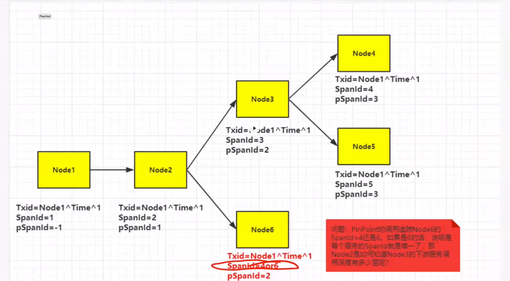
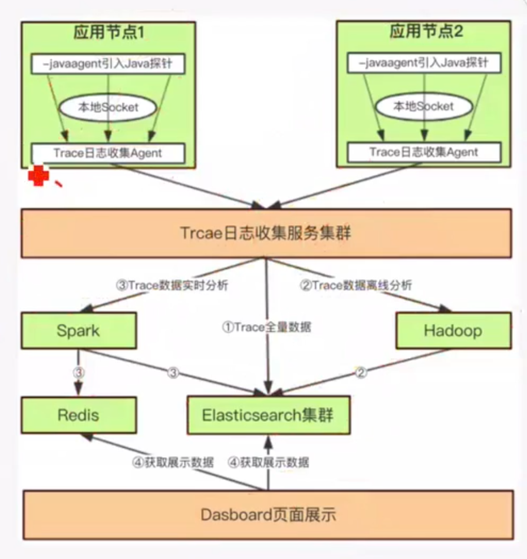
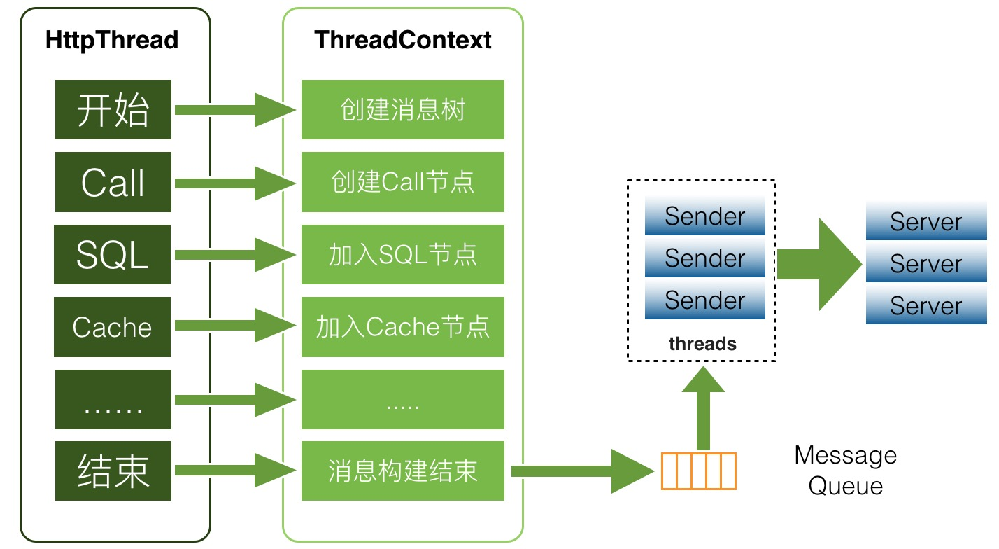
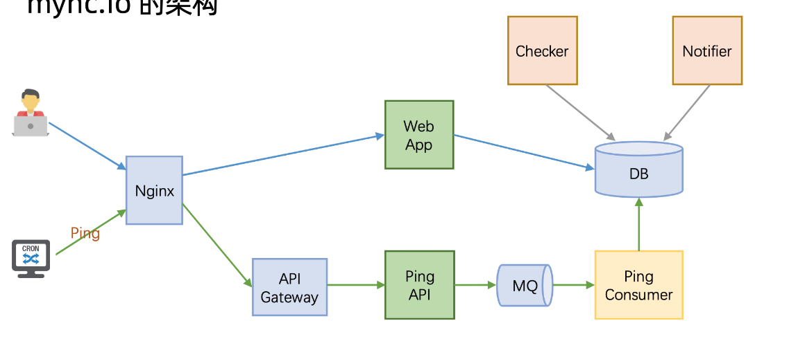
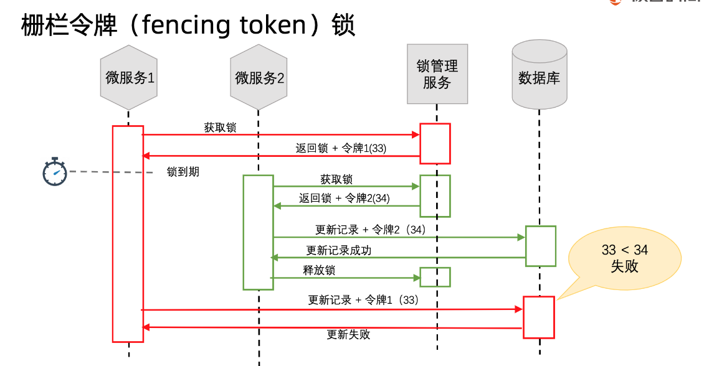
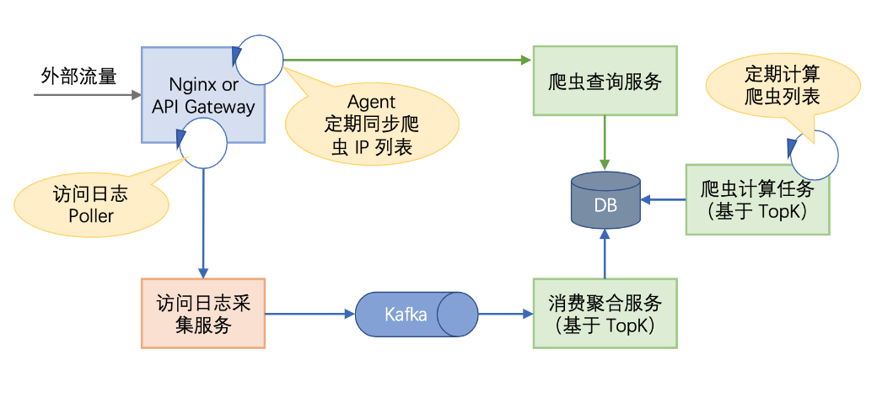

- [MicroSvcs observability](#microsvcs-observability)
	- [Target to observe](#target-to-observe)
	- [Data types](#data-types)
		- [Tracing](#tracing)
			- [Use case](#use-case)
			- [Concepts](#concepts)
				- [TraceId](#traceid)
				- [SpanId](#spanid)
				- [Annotation](#annotation)
	- [Architecture](#architecture)
		- [Requirements](#requirements)
		- [Flowchart](#flowchart)
		- [Component](#component)
			- [1. Data collection](#1-data-collection)
			- [2. Data transmission](#2-data-transmission)
			- [3. Data storage](#3-data-storage)
			- [4. Data display](#4-data-display)
				- [Offline analysis](#offline-analysis)
				- [Real-time analysis](#real-time-analysis)
	- [Existing solutions](#existing-solutions)
	- [Real world applications](#real-world-applications)
		- [Netflix](#netflix)
		- [Healthchecks.io](#healthchecksio)
	- [References](#references)

<!-- /MarkdownTOC -->

# MicroSvcs observability
## Target to observe
1. Infrastructure layer: Network traffic, Connection number, CPU, memory, disk
2. Dependencies: Cache, service availability
3. Application API layer: Business functionalities such as log in, checkout, etc. 
4. End user layer: E2E behaviors across different regions, devices, etc.

## Data types

### Tracing
#### Use case
* Identify bottleneck in a system
* Understand calling topology

#### Concepts
##### TraceId
##### SpanId
* How to generate Spanner ID： Not incremental, a random number between min(long) and max(long)

* [Trace Id construction and popular solution comparison](https://time.geekbang.org/course/detail/100003901-2277)

##### Annotation

## Architecture
### Requirements
* Realtime: Incident handling typically requires real-time data.
* High availability: Monitoring system
* High throughput: Lots of data to monitor
* Lose messsage is tolerated

### Flowchart

### Component
#### 1. Data collection
* Use threadLocal to store per thread data. 
	* 

* Popular solutions: Nagios
* Only needs to import jar pakcagge
* Or when starting the application, add additional parameter
	- javaagent: Which starts application in Java agent mode. It adds a pre-event interceptor and an after-event interceptor. Then performance metrics could be collected by agent. 
	- Introduced within JDK 1.5 (Byte enhancement tool)
* Send the log every 5 seconds

#### 2. Data transmission
* Protocol
  * Use UDP protocol to directly transmit to servers
  * Send to specific topic inside Kafka, and consumers read from Kafka topic. 
* Serialization
  * Protobuf
  * Json

#### 3. Data storage
* Logs:
  * Use case: Troubleshooting
  * Storage by ElasticSearch and display by Kibana

* Metrics
  * Use case: Time series data such as counters aggregation, latency measurement
  * Storage by InfluxDB and display by Grafana 

#### 4. Data display

##### Offline analysis
* Based on Hadoop

##### Real-time analysis
* Spark/Flume performs real-time analysis for QPS, average response time
* Result is being piped into Redis

## Existing solutions
* 2014 Google Dapper
* Twitter Zipkin: https://zipkin.io/pages/architecture.html
* Pinpoint: https://pinpoint-apm.github.io/pinpoint/
* DaZhongDianPing CAT (Chinese): https://github.com/dianping/cat
* Alibaba EagleEye
* Jingdong Hydra
* Apache SkyWalking (APM - Application Performance Management)
* Pinpoint (APM)

* [Popular solution comparison](https://time.geekbang.org/column/article/40505)

## Real world applications
### Netflix 
* Application monitoring: https://netflixtechblog.com/telltale-netflix-application-monitoring-simplified-5c08bfa780ba
* Distributed tracing: https://netflixtechblog.com/building-netflixs-distributed-tracing-infrastructure-bb856c319304
* Edgar solving mysterious: https://netflixtechblog.com/edgar-solving-mysteries-faster-with-observability-e1a76302c71f
* Self-serve dashboard: https://netflixtechblog.com/lumen-custom-self-service-dashboarding-for-netflix-8c56b541548c
* Build observability tools: https://netflixtechblog.com/lessons-from-building-observability-tools-at-netflix-7cfafed6ab17
* Netflix On instance trace: https://netflixtechblog.com/introducing-bolt-on-instance-diagnostic-and-remediation-platform-176651b55505
* Netflix system intuition: https://netflixtechblog.com/flux-a-new-approach-to-system-intuition-cf428b7316ec
* Time series data at Netflix: https://netflixtechblog.com/scaling-time-series-data-storage-part-i-ec2b6d44ba39

### Healthchecks.io
- 120 paying customer
- 1600 monthly recurring revenue
- 10M pings per day

* Industrial implementation:
	- Sentry

## References
* Datadog and Opentracing: https://www.datadoghq.com/blog/opentracing-datadog-cncf/
* 美团技术博客字节码：https://tech.meituan.com/2019/09/05/java-bytecode-enhancement.html
* 美团技术深入分析开源框架CAT: https://tech.meituan.com/2018/11/01/cat-in-depth-java-application-monitoring.html
* Metrics, logging and tracing: https://peter.bourgon.org/blog/2017/02/21/metrics-tracing-and-logging.html
* Which trace to collect: 
  * https://news.ycombinator.com/item?id=15326272
  * Tail-based sampling: https://github.com/jaegertracing/jaeger/issues/425
* 阿里云分布式链路文档：https://help.aliyun.com/document_detail/133635.html
* 美团分布式追踪MTrace：https://zhuanlan.zhihu.com/p/23038157
* 阿里eagle eye:
* Skywalking 系列: https://cloud.tencent.com/developer/article/1700393?from=article.detail.1817470
* Jaeger
* .NET Core中的分布式链路追踪：https://www.cnblogs.com/whuanle/p/14256858.html
* 基于Java agent的全链路监控：https://cloud.tencent.com/developer/article/1661167?from=article.detail.1661169
* Skyeye: https://github.com/JThink/SkyEye
  * [架构介绍](https://blog.csdn.net/JThink_/article/details/54599138?ops_request_misc=%257B%2522request%255Fid%2522%253A%2522162267818216780269836817%2522%252C%2522scm%2522%253A%252220140713.130102334.pc%255Fall.%2522%257D&request_id=162267818216780269836817&biz_id=0&utm_medium=distribute.pc_search_result.none-task-blog-2~all~first_rank_v2~rank_v29-1-54599138.first_rank_v2_pc_rank_v29&utm_term=%E4%BB%8E%E9%9B%B6%E5%88%B0%E6%97%A5%E5%BF%97%E9%87%87%E9%9B%86%E7%B4%A2%E5%BC%95%E5%8F%AF%E8%A7%86%E5%8C%96%E3%80%81%E7%9B%91%E6%8E%A7%E6%8A%A5%E8%AD%A6%E3%80%81rpc+trace%E8%B7%9F%E8%B8%AA&spm=1018.2226.3001.4187)
  * [Log4j/Kafka/ZooKeeper](https://blog.csdn.net/JThink_/article/details/54612565?ops_request_misc=%257B%2522request%255Fid%2522%253A%2522162267818216780269836817%2522%252C%2522scm%2522%253A%252220140713.130102334.pc%255Fall.%2522%257D&request_id=162267818216780269836817&biz_id=0&utm_medium=distribute.pc_search_result.none-task-blog-2~all~first_rank_v2~rank_v29-2-54612565.first_rank_v2_pc_rank_v29&utm_term=%E4%BB%8E%E9%9B%B6%E5%88%B0%E6%97%A5%E5%BF%97%E9%87%87%E9%9B%86%E7%B4%A2%E5%BC%95%E5%8F%AF%E8%A7%86%E5%8C%96%E3%80%81%E7%9B%91%E6%8E%A7%E6%8A%A5%E8%AD%A6%E3%80%81rpc+trace%E8%B7%9F%E8%B8%AA&spm=1018.2226.3001.4187)
  * [不同类型的日志](https://blog.csdn.net/JThink_/article/details/54629050?ops_request_misc=%257B%2522request%255Fid%2522%253A%2522162267818216780269836817%2522%252C%2522scm%2522%253A%252220140713.130102334.pc%255Fall.%2522%257D&request_id=162267818216780269836817&biz_id=0&utm_medium=distribute.pc_search_result.none-task-blog-2~all~first_rank_v2~rank_v29-3-54629050.first_rank_v2_pc_rank_v29&utm_term=%E4%BB%8E%E9%9B%B6%E5%88%B0%E6%97%A5%E5%BF%97%E9%87%87%E9%9B%86%E7%B4%A2%E5%BC%95%E5%8F%AF%E8%A7%86%E5%8C%96%E3%80%81%E7%9B%91%E6%8E%A7%E6%8A%A5%E8%AD%A6%E3%80%81rpc+trace%E8%B7%9F%E8%B8%AA&spm=1018.2226.3001.4187)
  * [日志索引](https://blog.csdn.net/JThink_/article/details/54906655?ops_request_misc=%257B%2522request%255Fid%2522%253A%2522162267818216780269836817%2522%252C%2522scm%2522%253A%252220140713.130102334.pc%255Fall.%2522%257D&request_id=162267818216780269836817&biz_id=0&utm_medium=distribute.pc_search_result.none-task-blog-2~all~first_rank_v2~rank_v29-4-54906655.first_rank_v2_pc_rank_v29&utm_term=%E4%BB%8E%E9%9B%B6%E5%88%B0%E6%97%A5%E5%BF%97%E9%87%87%E9%9B%86%E7%B4%A2%E5%BC%95%E5%8F%AF%E8%A7%86%E5%8C%96%E3%80%81%E7%9B%91%E6%8E%A7%E6%8A%A5%E8%AD%A6%E3%80%81rpc+trace%E8%B7%9F%E8%B8%AA&spm=1018.2226.3001.4187)
  * [上下线监控with Zookeeper](https://jthink.blog.csdn.net/article/details/55259614?utm_medium=distribute.pc_relevant.none-task-blog-2%7Edefault%7EBlogCommendFromMachineLearnPai2%7Edefault-4.control&depth_1-utm_source=distribute.pc_relevant.none-task-blog-2%7Edefault%7EBlogCommendFromMachineLearnPai2%7Edefault-4.control)
* Java instruments API: https://tech.meituan.com/2019/02/28/java-dynamic-trace.html
* 移动端的监控：https://time.geekbang.org/dailylesson/topic/135
* 即时消息系统端到端：https://time.geekbang.org/column/article/146995?utm_source=related_read&utm_medium=article&utm_term=related_read
