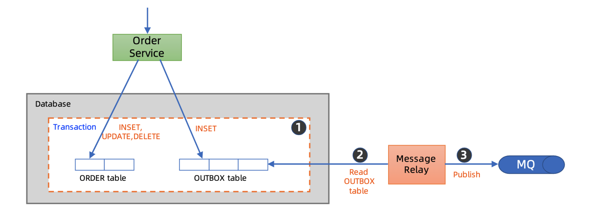
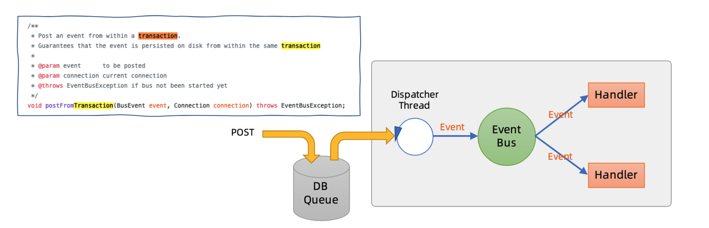
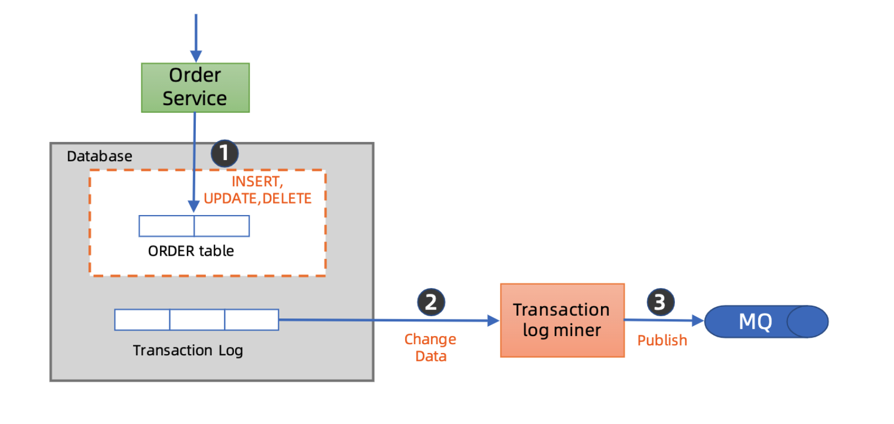
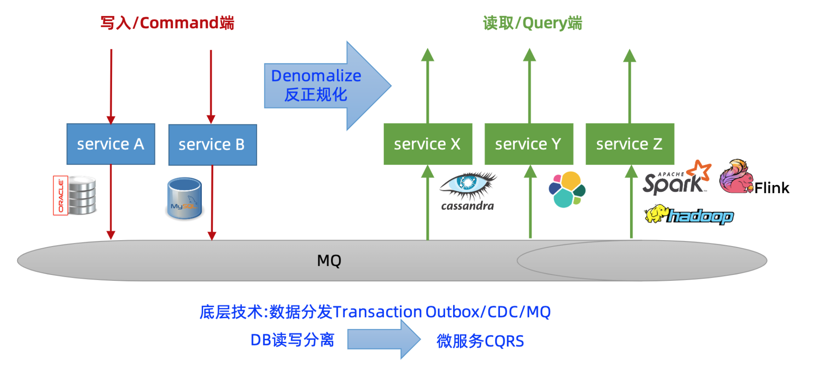
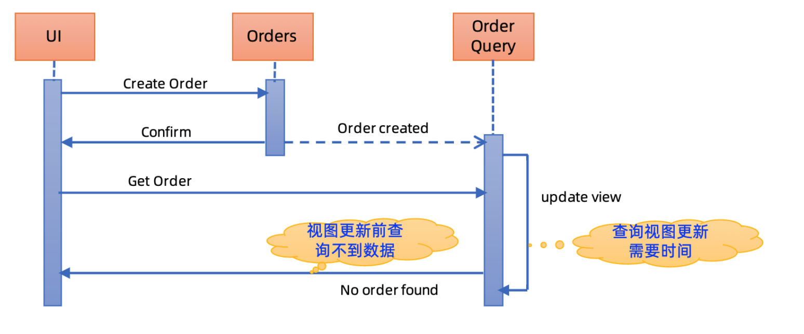
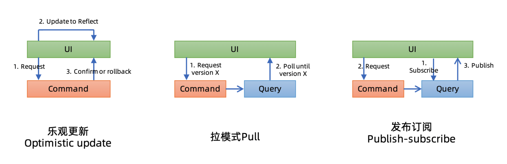

<!-- MarkdownTOC -->

- [Microservices](#microservices)
	- [Routing [Todo]](#routing-todo)
	- [Problems](#problems)
		- [Data distribution](#data-distribution)
			- [Use case](#use-case)
			- [Approaches](#approaches)
				- [Transactional outbox](#transactional-outbox)
				- [CDC (Change data capture)](#cdc-change-data-capture)
		- [Data join](#data-join)
			- [Use case](#use-case-1)
			- [Approaches](#approaches-1)
				- [CQRS](#cqrs)
		- [Breakdown monolithic](#breakdown-monolithic)
			- [Definition](#definition)
			- [Steps to migration](#steps-to-migration)
			- [Key difficult points](#key-difficult-points)
			- [Example](#example)
	- [Trace](#trace)

<!-- /MarkdownTOC -->

# Microservices
## Routing [Todo]
* https://time.geekbang.org/course/detail/100003901-2272

## Problems
### Data distribution
* Definition: Double write. How to guarantee the ACID of two writes

#### Use case
* Data replication
* Database migration
* Implement CQRS or remove join from database
* Implement distributed transactions

#### Approaches
##### Transactional outbox
* Flowchart

* Implementation: Killbill common queue

##### CDC (Change data capture)
* Flowchart

* Implementation:
	- Alibaba Canal (recommended)
	- Redhat Debezium
	- Zendesk Maxell
	- Airbnb SpinalTap

### Data join

#### Use case
* N+1 problem
* Data volume
* Performance

#### Approaches

##### CQRS
* Flowchart

* Possible problems: Eventual consistency

* Possible solutions:

### Breakdown monolithic
#### Definition
* Velocity slow
* Hard to continue scale vertically
* Independent deployment capability

#### Steps to migration

#### Key difficult points
* Understand the APIs
* Database migration
	- Incremental and rollbackable
	- Data 
* Use data distribution and remove join

#### Example
* StichFix - Scaling your architecture with services and events

## Trace
* Google Dapper
* 

