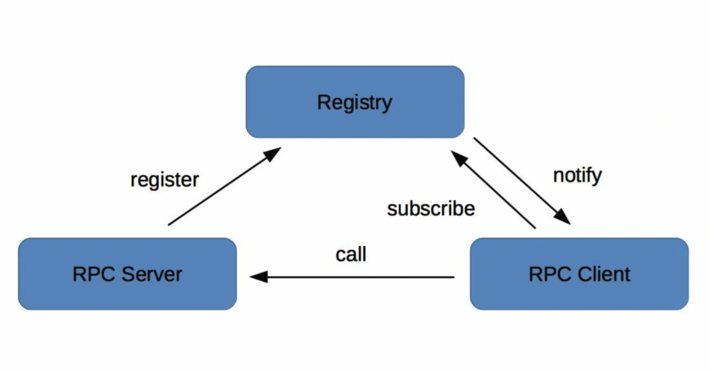
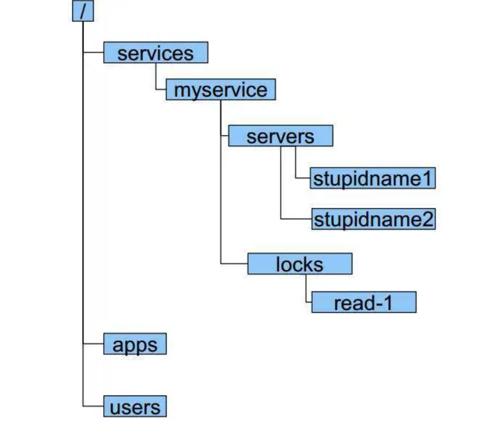
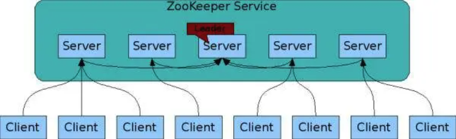
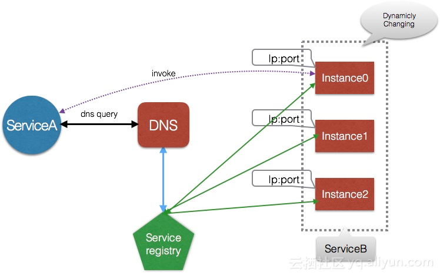
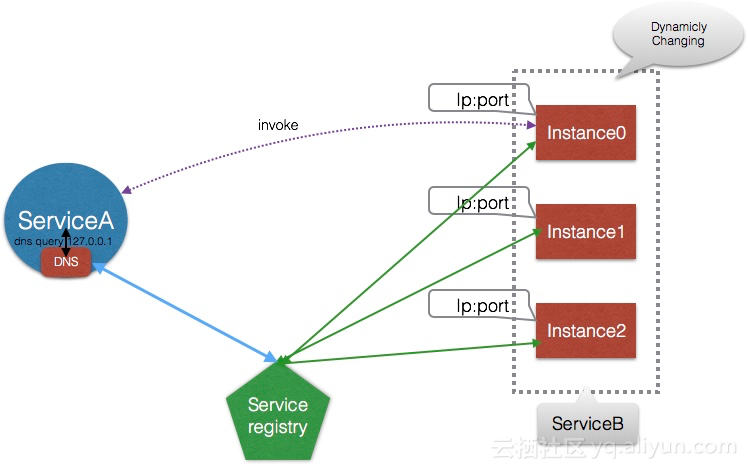
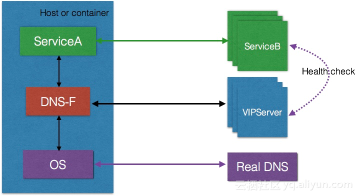
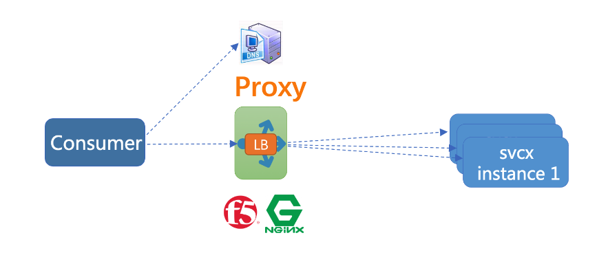
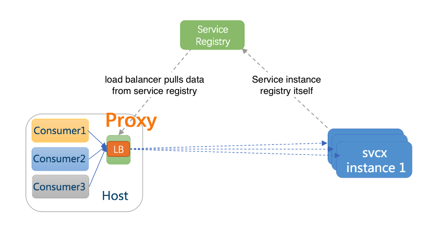

<!-- MarkdownTOC -->

- [Registry center](#registry-center)
  - [Roles and functionalities](#roles-and-functionalities)
  - [Functionalities registry center should support](#functionalities-registry-center-should-support)
    - [Register and unregister service](#register-and-unregister-service)
    - [Healthcheck information](#healthcheck-information)
      - [Design heartbeat messages](#design-heartbeat-messages)
        - [Heartbeat message frequency](#heartbeat-message-frequency)
        - [Subhealth criteria](#subhealth-criteria)
        - [Resilient to network latency](#resilient-to-network-latency)
    - [Event subscription](#event-subscription)
    - [Administration](#administration)
    - [Cluster based deployment for HA](#cluster-based-deployment-for-ha)
  - [Popular implementations](#popular-implementations)
    - [DNS based implementation](#dns-based-implementation)
      - [Put service providers under a domain](#put-service-providers-under-a-domain)
      - [DNS service points to a load balancer address](#dns-service-points-to-a-load-balancer-address)
      - [Ali DNS implementation](#ali-dns-implementation)
    - [Proxy based](#proxy-based)
      - [Centralized load balancing](#centralized-load-balancing)
      - [In-App Registration](#in-app-registration)
      - [Side car](#side-car)
    - [Zookeeper based implementation](#zookeeper-based-implementation)
    - [Message bus based registration](#message-bus-based-registration)
  - [Comparison (In Chinese)](#comparison-in-chinese)
    - [Scalable design](#scalable-design)
      - [Registration center](#registration-center)
      - [Registration center plugin](#registration-center-plugin)
  - [References](#references)

<!-- /MarkdownTOC -->

# Registry center
## Roles and functionalities
* RPC server: 
  * Upon start, send registration information to registry center according to config file (e.g. server.xml)
  * Upon running, regularly report heartbeat information to the server. 
* RPC client: 
  * Upon start, subscribe to registry center according to config file and cache the response from registry center inside cache. 
  * Upon running, based on some load balancing algorithm, connect with RPC servers. 
* Registry center:
  * When RPC servers have changes, registry center will notify RPC clients on these changes. 



## Functionalities registry center should support
### Register and unregister service
* RPC server supports register and unregister. 



### Healthcheck information
* Service providers report heartbeat messages to registry center.  
* Take the example of Zookeeper:
  1. Upon connection establishment, a long connection will be established between service providers and Zookeeper with a unique SESSION_ID and SESSION_TIMEOUT period. 
  2. Clients will regularly report heartbeat messages to the Zookeeper. 
  3. If Zookeeper does not receive heartbeat messages within SESSION_TIMEOUT period, it will consider that the service provider is not healthy and remove it fromm the pool. 

#### Design heartbeat messages
##### Heartbeat message frequency
* Usually the health ping frequency is set to 30s. This will avoid too much pressure on the server, and at the same time avoid too much delay in catching a node's health states. 
  
##### Subhealth criteria
* A State transition between death, health and subhealth. An interesting question is how to decide the threshold for a node to transit from health to subhealth? 
  * Both application layer and service layer health info needs to be gathered. For application layer, the RPS/response time of each API will be different, so simply setting threshold for total failure or TPS. Use the percentage of success / total as standards. 

##### Resilient to network latency
* Deploy detectors across different locations. 

### Event subscription
* RPC client subscribes to certain services
* Take the example of Zookeeper: Use watch mechanism

### Administration
* Administrative functionalities:
  * Update a service provider's information
* Blacklist and whitelist service providers
  * e.g. Service providers in production environments should not register inside register center of test environments. 

### Cluster based deployment for HA
* Take the example of Zookeeper
  1. Upon Zookeeper start, a leader will be elected according to Paxos protocol. 
  2. Leader will be responsible for update operations according to ZAB protocol. 
  3. An update operation is considered successful only if majority servers have finished update. 



## Popular implementations
### DNS based implementation
* Benefits: Low intrusion to the business logic when compared with SDK-based solution. 

#### Put service providers under a domain
* Idea: Put all service providers under a domain. 
* Cons:
  * If an IP address goes offline, then the service provider could not easily remove the node because DNS has many layers of cache. 
  * If scaling up, then newly scaled nodes will not receive enough traffic. 

```
┌───────────┐       ┌───────────┐      ┌───────────────┐       ┌───────────┐       ┌─────────────┐      ┌───────────┐
│user browse│       │           │      │Local DNS cache│       │ local DNS │       │Regional DNS │      │ authority │
│ a domain  ├──────▶│ JVM cache │─────▶│  (Host file)  │──────▶│  server   │──────▶│(with cache) │─────▶│    DNS    │
│           │       │           │      │               │       │           │       │             │      │           │
└───────────┘       └───────────┘      └───────────────┘       └───────────┘       └─────────────┘      └───────────┘
```

#### DNS service points to a load balancer address
* Idea: Consumers connect to the virtual ip address of a load balancer, not DNS servers. 
* Cons:
  * All traffic needs to go through an additional hop, causing performance degradation. 
  * Usually for load balancers, if you want to add or remove nodes, it needs to be done manually. 
  * When it comes to service governance, usually a more flexible load balancing algorithm will be needed. 

```
                                           ┌─────────────────────────┐                                              
                                           │                         │                                              
             ┌──────Discover───────────────│           DNS           │                                              
             │                             │                         │                                              
             │                             └─────────────────────────┘                                              
             │                                                                                                      
             │                                                                                                      
             │                                                                                                      
             ▼                                                                                                      
┌─────────────────────────┐                ┌─────────────────────────┐                   ┌─────────────────────────┐
│                         │                │                         │       Load        │                         │
│    Service consumer     │ ──Invoke──────▶│      Load balancer      │─────balancing ───▶│    Service Provider     │
│                         │                │                         │    and revoke     │                         │
└─────────────────────────┘                └─────────────────────────┘                   └─────────────────────────┘
``` 

#### Ali DNS implementation
* Independent DNS server
  * Pros:
    * Centralized DNS server. Easy for maintenance. 
  * Cons:
    * High requirement on DNS server performance. 
    * SPOF



* Filter based on DNS server: Embed a DNS server in local server. All DNS queries will first be parsed by the local DNS.
  * Pros:
    * Avoid the SPOF
  * Cons:
    * Higher maintenance cost because DNS is embedded within each service. 



* Ali's implementation derive from filter based DNS server. 
  1. Service A query service B's IP address
  2. DNS-F intercept service A's request, and see whether VIPServer has the data.
  3. Otherwise, DNS-F will query the actual DNS server. 



* Reference in Chinese: https://developer.aliyun.com/article/598792

### Proxy based 
#### Centralized load balancing
* Def: 
  1. DNS name points to the load balancer proxy
  2. All instances are configured on the proxy
* Pros:
  + Centralized management
  + Language agnostic
* Cons: 
  + Single point of failure
  + Long change cycle
  + Performance penalty given another hop
- Use cases:
  + Broadly adopted



#### In-App Registration
* Def: Each app embed a proxy (e.g. Alibaba Dubbo / Netflix karyon / Twitter Finagle)
* Pros:
  + No single point of failure
  + High performant
* Cons:
  + Language compatibility. Requires multiple language support.
* Use cases:
  + In mid/large sized company where language stack is consistent and unified. 


#### Side car
* Def: Run two separate applications on the same machine. One for service registration, and the other for service discovery. 



### Zookeeper based implementation
* It is becoming popular because it is the default registration center for Dubbo framework. 
* Idea: Use Zookeeper ephemeral node to work as service registry and watch mechanism for notifications. 
* Cons: 
  * When there are too many directories or too many clients connecting to Zookeeper, the performance will have a natural degradation because Zookeeper enforces strong consistency. 

```
                                       ┌────────────────┐                             
                                       │Service consumer│                             
                                       │                │                             
                                       └────────────────┘                             
                                           │       ▲                                  
                                           │       │                                  
              Step 3. Create a node        │       │                                  
                "consumer1" under          │       │                                  
          /service/consumer directory.     │       │   Step 4. ZooKeeper notifies the 
                                           │       │       client that a new node     
            And watch all nodes under      │       │   "providerN" is added under the 
                /service/provider          │       │   /service/provider registration 
                                           │       │                                  
                                           │       │                                  
                                           ▼       │                                  
                          ┌───────────────────────────────────────┐                   
                          │                                       │                   
                          │               Zookeeper               │                   
                          │                                       │                   
                          │           /service/provider           │                   
                          │      /service/provider/provider1      │                   
   Step 1. Create a root  │                  ...                  │                   
       service path       │      /service/provider/providerN      │                   
                          │                                       │                   
     /service/provider    │                                       │                   
     /service/consumer    │           /service/consumer           │                   
                          │      /service/consumer/consumer1      │                   
                          │                  ...                  │                   
                          │      /service/consumer/consumerN      │                   
                          │                                       │                   
                          └───────────────────────────────────────┘                   
                                               ▲                                      
                                               │                                      
                                               │                                      
                                               │                                      
                                               │  Step 2. Create a node under         
                                               │       service provider               
                                               │                                      
                                               │  /service/provider/provider1         
                                               │                                      
                                               │                                      
                                               │                                      
                                               │                                      
                                      ┌────────────────┐                              
                                      │Service provider│                              
                                      │                │                              
                                      └────────────────┘                              
```

### Message bus based registration
* Idea: 
  * When service providers come online, consumers could tolerate some latency in discovering these service providers. A strong consistency model such as what Zookeeper provides is not needed. 
  * Could have multiple registry center connectecd by message bus. Registry center could have a full cached copy of service providers and multiple registry centers could sync the data via a message bus. 
* How to solve the above idea's update latency problem
  * Client retry when the service provider is no longer there. 

```
  ┌─────────────────────────────┐                                                          
  │      Service provider       │                                                          
  │                             │                                                          
  └─────────────────────────────┘                                                          
                 │                                                                         
                 │                                                                         
          Step 1. Create a                                                                 
            registration                                                                   
               message                                                                     
                 │                                     ┌──────────────────────────────────┐
                 │                                     │           Message bus            │
                 ▼                                     │                                  │
  ┌────────────────────────────┐    Step 3. Publish    │  ┌───────────────────────────┐   │
  │                            │     registration      │  │Service: Checkout          │   │
  │                            │  ────message to ───▶  │  │Address: 192.168.1.9:9080  │   │
  │                            │      message bus      │  │Version: 2019113589        │   │
  │                            │                       │  └───────────────────────────┘   │
  │                            │                       │                                  │
  │                            │                       │  ┌───────────────────────────┐   │
  │                            │                       │  │Service: addToCart         │   │
  │                            │                       │  │Address: 192.168.1.2:9080  │   │
  │                            │                       │  │Version: 2019103243        │   │
  │    Registration center     │                       │  └───────────────────────────┘   │
  │                            │                       │                                  │
  │                            │        Step 4.        │  ┌───────────────────────────┐   │
  │                            │   Pull/receive push   │  │          ......           │   │
  │                            │◀──notification from── │  │                           │   │
  │                            │      message bus      │  │                           │   │
  │                            │                       │  └───────────────────────────┘   │
  │                            │                       │                                  │
  │                            │                       │  ┌───────────────────────────┐   │
  │                            │                       │  │Service: Checkout          │   │
  └────────────────────────────┘                       │  │Address: 192.168.1.9:9080  │   │
         ▲                │                            │  │Version: 2019113590        │   │
         │                │                            │  └───────────────────────────┘   │
         │                │                            └──────────────────────────────────┘
Step 2. Consumer          │                                                                
  subscribe to            │                                                                
  registration            Step 5. Receive                                                  
 center change       notification for service                                              
         │                │provider list                                                   
         │                │                                                                
         │                ▼                                                                
                                                                                           
  ┌─────────────────────────────┐                                                          
  │      Service consumer       │                                                          
  │                             │                                                          
  └─────────────────────────────┘                                                          
```

## Comparison (In Chinese)

|  `Criteria`       |  `Zookeeper`      |   `etcd`  | `Eureka`  |
|--------------|--------------------|---|---|
| CAP model | CP | CP  | AP  |
| Consensus protocol  |  ZAB (Paxos)       |  Raft  | Not applicable  |
| Integration mechanism    |  SDK client        |  HTTP/gRPC | HTTP  |
| Watch support       |  Support           |  Long polling | Long polling  |
| KV storage          |  Support           |  Support  |  Not support |
| Language            |  Java              |  Go  |  Java  |

### Scalable design
#### Registration center 
* Multiple registration center deployed
	- Different gateways/business logic units are connected to different registration center
* What if a pushdown instruction arrives at the wrong registration center
	- [Gossip protocol](./gossipProtocol.md) to discover between different registration centers
		+ Cons: Long message delay / Forward redundancy
		+ Pros: Suitable for large number of clusters. Used in P2P, Redis cluster, Consul
	- An open source implementation for Gossip https://github.com/scalecube/scalecube-cluster

#### Registration center plugin
* Registration center plugin will get a list of IP addresses of registration center. 
	- If all connections fail, then alert
* DNS domain 
	- ccsip.nx.com

## References
* Three ways for service discovery: https://time.geekbang.org/course/detail/100003901-2269
* Discovery and internals: 
  * Theory: https://time.geekbang.org/column/article/14603
  * Practical: https://time.geekbang.org/column/article/39783
* TODO: Registry center: 
  * https://time.geekbang.org/column/article/39792
* TODO: Select among registry centers
  * https://time.geekbang.org/column/article/39797
* TODO: Whether a node is alive:
  * https://time.geekbang.org/column/article/40684
* Notification storm problem 高并发设计40问
