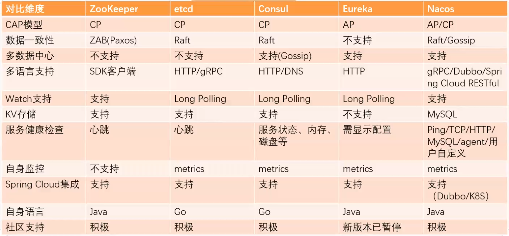
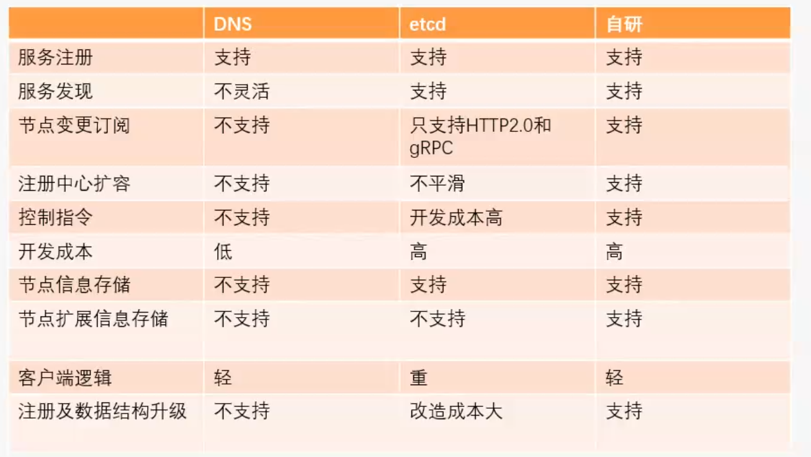

<!-- MarkdownTOC -->

- [Registry center](#registry-center)
  - [Popular implementations](#popular-implementations)
    - [DNS based implementation](#dns-based-implementation)
    - [Zookeeper based implementation](#zookeeper-based-implementation)
      - [Requirements](#requirements)
      - [Flowchart](#flowchart)
    - [Message bus based registration](#message-bus-based-registration)
  - [Design considerations](#design-considerations)
    - [Service registration](#service-registration)
    - [Service discovery](#service-discovery)
      - [Architecture evolvement](#architecture-evolvement)
        - [Centralized load balancing](#centralized-load-balancing)
        - [In-App Registration](#in-app-registration)
        - [Side car](#side-car)
    - [Heartbeat detection](#heartbeat-detection)
  - [CP or AP model?](#cp-or-ap-model)
    - [Case study](#case-study)
  - [Implementation](#implementation)
    - [Comparison (In Chinese)](#comparison-in-chinese)
    - [Initial impl](#initial-impl)
    - [DIY](#diy)
      - [Requirements](#requirements-1)
      - [Standalone design](#standalone-design)
        - [Service management platform](#service-management-platform)
        - [Business logic unit](#business-logic-unit)
        - [Gateway](#gateway)
        - [Registration center](#registration-center)
          - [Registration center client](#registration-center-client)
          - [Registration center plugin](#registration-center-plugin)
        - [Flowchart](#flowchart-1)
          - [Instruction pushdown](#instruction-pushdown)
          - [Service stop](#service-stop)
          - [Service start](#service-start)
          - [Service lookup](#service-lookup)
        - [Comparison (In Chinese)](#comparison-in-chinese-1)
      - [Scalable design](#scalable-design)
        - [Registration center](#registration-center-1)
        - [Registration center plugin](#registration-center-plugin-1)
      - [Question](#question)
  - [References](#references)

<!-- /MarkdownTOC -->

# Registry center
## Popular implementations
### DNS based implementation
* Idea: Put all service providers under a domain. 
* Cons:
  * If an IP address goes offline, then the service provider could not easily remove the node because DNS has many layers of cache. 
  * If scaling up, then newly scaled nodes will not receive enough traffic. 

```
┌───────────┐       ┌───────────┐      ┌───────────────┐       ┌───────────┐       ┌─────────────┐      ┌───────────┐
│user browse│       │           │      │Local DNS cache│       │ local DNS │       │Regional DNS │      │ authority │
│ a domain  ├──────▶│ JVM cache │─────▶│  (Host file)  │──────▶│  server   │──────▶│(with cache) │─────▶│    DNS    │
│           │       │           │      │               │       │           │       │             │      │           │
└───────────┘       └───────────┘      └───────────────┘       └───────────┘       └─────────────┘      └───────────┘
```

* Idea: Consumers connect to the virtual ip address of a load balancer, not DNS servers. 
* Cons:
  * All traffic needs to go through an additional hop, causing performance degradation. 
  * Usually for load balancers, if you want to add or remove nodes, it needs to be done manually. 
  * When it comes to service governance, usually a more flexible load balancing algorithm will be needed. 

```
                                           ┌─────────────────────────┐                                              
                                           │                         │                                              
             ┌──────Discover───────────────│           DNS           │                                              
             │                             │                         │                                              
             │                             └─────────────────────────┘                                              
             │                                                                                                      
             │                                                                                                      
             │                                                                                                      
             ▼                                                                                                      
┌─────────────────────────┐                ┌─────────────────────────┐                   ┌─────────────────────────┐
│                         │                │                         │       Load        │                         │
│    Service consumer     │ ──Invoke──────▶│      Load balancer      │─────balancing ───▶│    Service Provider     │
│                         │                │                         │    and revoke     │                         │
└─────────────────────────┘                └─────────────────────────┘                   └─────────────────────────┘
``` 

### Zookeeper based implementation
* It is becoming popular because it is the default registration center for Dubbo framework. 

#### Requirements
* Register:
* Subscription: 
* Reliable: 
* Fault tolerant: In case when servers come down, registration center could detect such changes. 


#### Flowchart
```
                                       ┌────────────────┐                             
                                       │Service consumer│                             
                                       │                │                             
                                       └────────────────┘                             
                                           │       ▲                                  
                                           │       │                                  
              Step 3. Create a node        │       │                                  
                "consumer1" under          │       │                                  
          /service/consumer directory.     │       │   Step 4. ZooKeeper notifies the 
                                           │       │       client that a new node     
            And watch all nodes under      │       │   "providerN" is added under the 
                /service/provider          │       │   /service/provider registration 
                                           │       │                                  
                                           │       │                                  
                                           ▼       │                                  
                          ┌───────────────────────────────────────┐                   
                          │                                       │                   
                          │               Zookeeper               │                   
                          │                                       │                   
                          │           /service/provider           │                   
                          │      /service/provider/provider1      │                   
   Step 1. Create a root  │                  ...                  │                   
       service path       │      /service/provider/providerN      │                   
                          │                                       │                   
     /service/provider    │                                       │                   
     /service/consumer    │           /service/consumer           │                   
                          │      /service/consumer/consumer1      │                   
                          │                  ...                  │                   
                          │      /service/consumer/consumerN      │                   
                          │                                       │                   
                          └───────────────────────────────────────┘                   
                                               ▲                                      
                                               │                                      
                                               │                                      
                                               │                                      
                                               │  Step 2. Create a node under         
                                               │       service provider               
                                               │                                      
                                               │  /service/provider/provider1         
                                               │                                      
                                               │                                      
                                               │                                      
                                               │                                      
                                      ┌────────────────┐                              
                                      │Service provider│                              
                                      │                │                              
                                      └────────────────┘                              
```


### Message bus based registration

```
  ┌─────────────────────────────┐                                                          
  │      Service provider       │                                                          
  │                             │                                                          
  └─────────────────────────────┘                                                          
                 │                                                                         
                 │                                                                         
          Step 1. Create a                                                                 
            registration                                                                   
               message                                                                     
                 │                                     ┌──────────────────────────────────┐
                 │                                     │           Message bus            │
                 ▼                                     │                                  │
  ┌────────────────────────────┐    Step 3. Publish    │  ┌───────────────────────────┐   │
  │                            │     registration      │  │Service: Checkout          │   │
  │                            │  ────message to ───▶  │  │Address: 192.168.1.9:9080  │   │
  │                            │      message bus      │  │Version: 2019113589        │   │
  │                            │                       │  └───────────────────────────┘   │
  │                            │                       │                                  │
  │                            │                       │  ┌───────────────────────────┐   │
  │                            │                       │  │Service: addToCart         │   │
  │                            │                       │  │Address: 192.168.1.2:9080  │   │
  │                            │                       │  │Version: 2019103243        │   │
  │    Registration center     │                       │  └───────────────────────────┘   │
  │                            │                       │                                  │
  │                            │        Step 4.        │  ┌───────────────────────────┐   │
  │                            │   Pull/receive push   │  │          ......           │   │
  │                            │◀──notification from── │  │                           │   │
  │                            │      message bus      │  │                           │   │
  │                            │                       │  └───────────────────────────┘   │
  │                            │                       │                                  │
  │                            │                       │  ┌───────────────────────────┐   │
  │                            │                       │  │Service: Checkout          │   │
  └────────────────────────────┘                       │  │Address: 192.168.1.9:9080  │   │
         ▲                │                            │  │Version: 2019113590        │   │
         │                │                            │  └───────────────────────────┘   │
         │                │                            └──────────────────────────────────┘
Step 2. Consumer          │                                                                
  subscribe to            │                                                                
  registration            Step 5. Receive                                                  
 center change       notification for service                                              
         │                │provider list                                                   
         │                │                                                                
         │                ▼                                                                
                                                                                           
  ┌─────────────────────────────┐                                                          
  │      Service consumer       │                                                          
  │                             │                                                          
  └─────────────────────────────┘                                                          
```

## Design considerations
### Service registration
### Service discovery
#### Architecture evolvement
##### Centralized load balancing
* Def: 
  1. DNS name points to the load balancer proxy
  2. All instances are configured on the proxy
* Pros:
  + Centralized management
  + Language agnostic
* Cons: 
  + Single point of failure
  + Long change cycle
  + Performance penalty given another hop
- Use cases:
  + Broadly adopted


##### In-App Registration
* Def: Each app embed a proxy (e.g. Alibaba Dubbo / Netflix karyon / Twitter Finagle)
* Pros:
  + No single point of failure
  + High performant
* Cons:
  + Language compatibility. Requires multiple language support.
* Use cases:
  + In mid/large sized company where language stack is consistent and unified. 


##### Side car
* Def: Run two separate applications on the same machine. One for service registration, and the other for service discovery. 


### Heartbeat detection 

## CP or AP model?
* Service registration: Si = F(ServiceName)
	- ServiceName is a lookup parameter
	- Si is the corresponding service' IP:Port list

### Case study 
* Setup:
	- Service A is calling Service B
	- Service A has two deployments A1 and A2
	- Service B has one deployment with IP port from IP1 -> IP10
	- A1 deployment only gets IP1 -> IP9
	- A2 deployment only gets IP2 -> IP10
* If using CP model
	- Then A1 and A2 are both not available
* If using AP model
	- Then the only impact is that the traffic distribution on IP1 -> IP10 is not even. 
* Should use AP model

## Implementation

### Comparison (In Chinese)


### Initial impl
* Binding: How does the client know who to call, and where the service resides?
	- The most flexible solution is to use dynamic binding and find the server at run time when the RPC is first made. The first time the client stub is invoked, it contacts a name server to determine the transport address at which the server resides.

* Where to locate host and correct server process
	- Solution1: Maintain a centralized DB that can locate a host that provides a particular service
		1. Challenge: Who administers this
		2. Challenge: What is the scope of administration
		3. Challenge: What if the same services run on different machines 
	- Solution2: A server on each host maintains a DB of locally provided services

### DIY
#### Requirements
* Cross language support
* Use instructions to control the cluster
	- e.g. Proactively ask the cluster to downgrade a specific service with an instruction
	- e.g. Rate limiter
	- e.g. Circuit breaker
* Store information of registration nodes 
	- e.g. Node type: virtual machine, docker node, physical node
	- e.g. Node weight
	- e.g. Grouping

#### Standalone design
##### Service management platform
* Responsible for 
	- Initiating all commands
	- Service discovery
* Has its own Redis/MySQL center
	- So that not each time a service discovery is needed, the service management platform needs to talk to registration center.

##### Business logic unit
* Business logic unit maintains a TCP long-lived connection to registration center
	- Business logic unit talks to registration center: Service discovery
	- Registration center talks to business logic unit: Send command ???

##### Gateway
* Gateway maintains a TCP long-lived connection to registration center
	- Gateway talks to registration center: Service discovery
	- Registration center talks to gateway: Send command
* Gateway maintains a HTTP connection to service management platform
	1. Gateway asks IP addresses of a business logic unit name from service management platform
	2. Service management platform will talk to registration center for the IP address 

##### Registration center
* Responsible for service registration, service discovery, instruction execution

###### Registration center client
* Service management platform uses registration center client to talks to registration center. 

###### Registration center plugin
* Def: A SDK/Jar 
* Exist within business logic unit / Gateway: 
	- Business logic unit uses this to register service, discover service and receive command from registration center

##### Flowchart

###### Instruction pushdown
* Instructions
	- Disable certain business logic unit
	- Downgrade, circuit breaker, rate limit
	- Configuration 
* A downgrade instruction to downgrade business logic unit
	1. Registration center receives the downgrade command from service management platform via registration center client
	2. Registration center sends the downgrade command to gateway via registration center plugin
	3. Gateway terminates some connection 

###### Service stop
* There are two business logic units A and B. A dies
	1. Registration center knows the event from TCP long lived connection
	2. Registration center sends the event to service management center

###### Service start
* A new service instance starts up
	1. Business logic sends the info to service registration center via long lived connection.
	2. Registration center sends the info to gateway via long lived connection

###### Service lookup
* Gateway sends the info to service management platform via HTTP connection
* Service management platform talks to service registration center. Passing in the business logic name, wanting the business logic IP address. 

##### Comparison (In Chinese)
* 

#### Scalable design
##### Registration center 
* Multiple registration center deployed
	- Different gateways/business logic units are connected to different registration center
* What if a pushdown instruction arrives at the wrong registration center
	- [Gossip protocol](./gossipProtocol.md) to discover between different registration centers
		+ Cons: Long message delay / Forward redundancy
		+ Pros: Suitable for large number of clusters. Used in P2P, Redis cluster, Consul
	- An open source implementation for Gossip https://github.com/scalecube/scalecube-cluster

##### Registration center plugin
* Registration center plugin will get a list of IP addresses of registration center. 
	- If all connections fail, then alert
* DNS domain 
	- ccsip.nx.com


#### Question
* Why so many different types of connection
	- Plugin vs Client vs HTTP vs TCP Long-lived connection
* Notification storm problem 高并发设计40问

## References
* Three ways for service discovery: https://time.geekbang.org/course/detail/100003901-2269
* Discovery and internals: 
  * Theory: https://time.geekbang.org/column/article/14603
  * Practical: https://time.geekbang.org/column/article/39783
* TODO: Registry center: 
  * https://time.geekbang.org/column/article/39792
* TODO: Select among registry centers
  * https://time.geekbang.org/column/article/39797
* TODO: Whether a node is alive:
  * https://time.geekbang.org/column/article/40684
