<!-- MarkdownTOC -->

- [Security](#security)
	- [Certificates](#certificates)
		- [Challenges](#challenges)
			- [Key provisioning and bootstrapping trust](#key-provisioning-and-bootstrapping-trust)
			- [Revoking certificates](#revoking-certificates)
			- [Key rotation](#key-rotation)
		- [Industrial bes](#industrial-bes)
	- [JWT](#jwt)
		- [Motivation](#motivation)
		- [JWT vs (JWE and JWS)](#jwt-vs-jwe-and-jws)
			- [Types of JWT](#types-of-jwt)
		- [MTLS](#mtls)
			- [TLS vs MTLS](#tls-vs-mtls)
			- [MTLS vs JWT](#mtls-vs-jwt)
	- [Open Policy Agent](#open-policy-agent)
		- [High level architecture](#high-level-architecture)
	- [OAuth2](#oauth2)
		- [Simple guide](#simple-guide)
		- [Roles](#roles)
		- [Types of token](#types-of-token)
			- [Access token](#access-token)
			- [Refresh token](#refresh-token)
			- [Authorization code token](#authorization-code-token)
			- [Bearer token](#bearer-token)
			- [Proof of possession token](#proof-of-possession-token)
		- [OAuth 2 modes](#oauth-2-modes)
			- [Authorization code mode](#authorization-code-mode)
			- [Simplified mode](#simplified-mode)
			- [Password mode](#password-mode)
			- [Refresh token mode](#refresh-token-mode)
	- [OpenID Connect](#openid-connect)
	- [Auth architecture revolution](#auth-architecture-revolution)
		- [Single server cookie based auth](#single-server-cookie-based-auth)
		- [Multi server sticky session based auth](#multi-server-sticky-session-based-auth)
		- [Auth Service and token](#auth-service-and-token)
		- [Gateway and token](#gateway-and-token)
		- [Gateway and JWT](#gateway-and-jwt)
	- [Microservices security architecture](#microservices-security-architecture)
		- [External access token internal JWT token](#external-access-token-internal-jwt-token)
		- [Encrypted JWT token](#encrypted-jwt-token)
		- [External access token internal JWT token with token cache](#external-access-token-internal-jwt-token-with-token-cache)
	- [Secure microservices on Kubernetes](#secure-microservices-on-kubernetes)
	- [Secure microservices on Istio service mesh](#secure-microservices-on-istio-service-mesh)
	- [Real world examples](#real-world-examples)
		- [Auth at Netflix](#auth-at-netflix)

<!-- /MarkdownTOC -->

# Security
## Certificates
### Challenges
#### Key provisioning and bootstrapping trust 
#### Revoking certificates
#### Key rotation
### Industrial bes

## JWT
### Motivation
* JWT is a type of by value token which does not need to be verified at the authorization server. 
	- Def for by reference token: Randomly generated string value. Upon receiving the token, resource server needs to verify it against OAuth authorization server to obtain information such as claims/scopes. 
	- Def for by value token: A token which contains key value pair of (issuer, audience, scope, claims). It could be verified locally and does not need to be verified against authorization server. 

### JWT vs (JWE and JWS)

#### Types of JWT 

* HMAC JWT

* RSA JWT

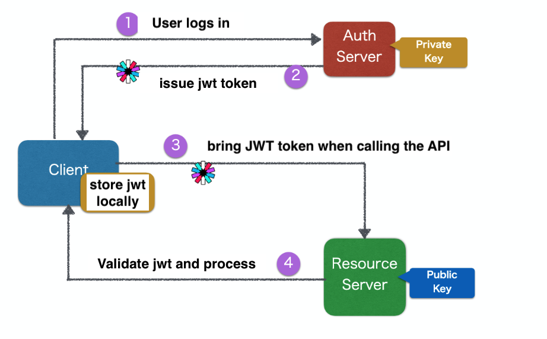

### MTLS
#### TLS vs MTLS
#### MTLS vs JWT

## Open Policy Agent
### High level architecture

## OAuth2
### Simple guide
* Simlplest guide: https://medium.com/@darutk/the-simplest-guide-to-oauth-2-0-8c71bd9a15bb

### Roles
* Third party client app: it needs to access users' protected resource
* Resource server: a web server which expose users' protected resource to outside users
* Authorization server: issue access token to client app after resource owner grant the permission
* Resource owner: the owner of a resource who wants to share it with third party apps.

### Types of token
#### Access token
* Used to access target resource.

#### Refresh token
* Used to exchange for a refreshed token

#### Authorization code token
* Only used for authorization token, used for obtaining access token and refresh token. 

#### Bearer token
* It is like cash. Whoever has the token could access target resource. 

#### Proof of possession token
* Could verify whether client has ownership for the token.

### OAuth 2 modes
* Good reference: Ruanyifeng overview - http://www.ruanyifeng.com/blog/2014/05/oauth_2_0.html
* Choose between OAuth modes: 

 

#### Authorization code mode

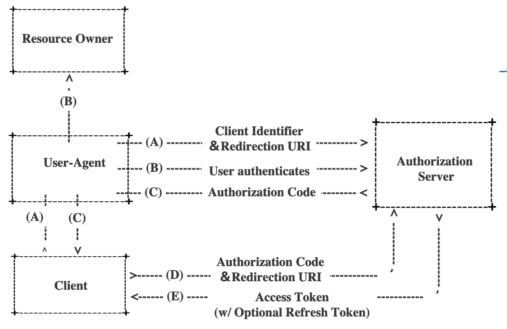 

#### Simplified mode

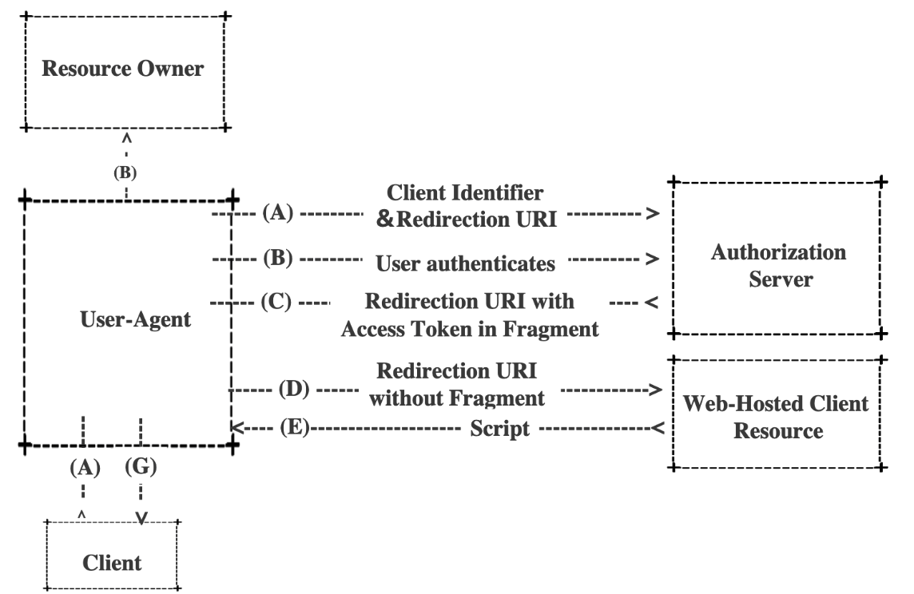 

#### Password mode

 

#### Refresh token mode

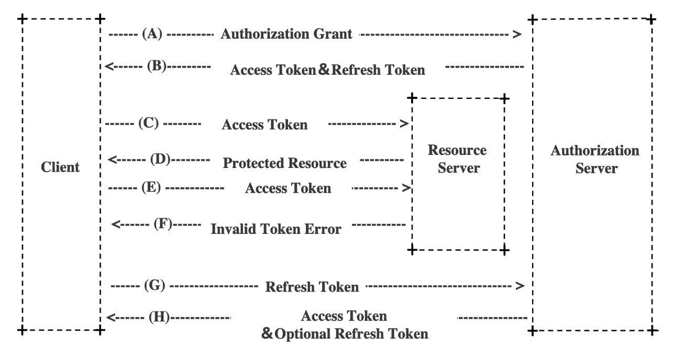 

## OpenID Connect
* The authentication layer on top of OAuth2

## Auth architecture revolution
### Single server cookie based auth

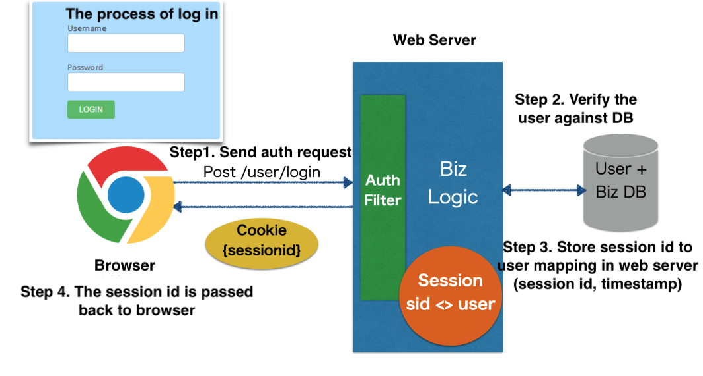

### Multi server sticky session based auth
* Cons:
	- Sticky session binds a session to a server. If the server goes down or needs to be maintained. 
	- Sticky session needs to store session data in load balancer. 
* Possible solutions:
	1. Session synchronization by replicating across web servers
	2. Store session data completely inside users' browser
		- Cons: Limited size of cookie
	3. Store session data in a shared storage

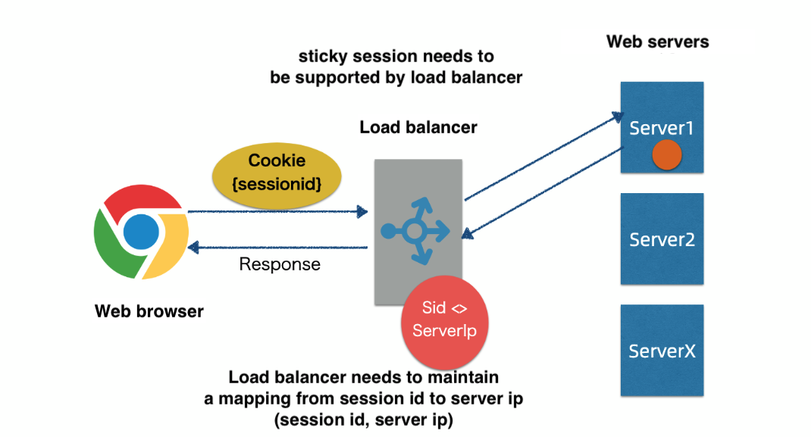

### Auth Service and token
* Pros:
	- Encapsulate everything related with token issuing
	- Introduce the concept of token, which could be passed around between services
* Cons:
	- Services need to implement the logic to validate the token. 
	- All services need to talk to authSvc, which might become a performance bottleneck. 	
	- All requests need to be verified via auth service. 

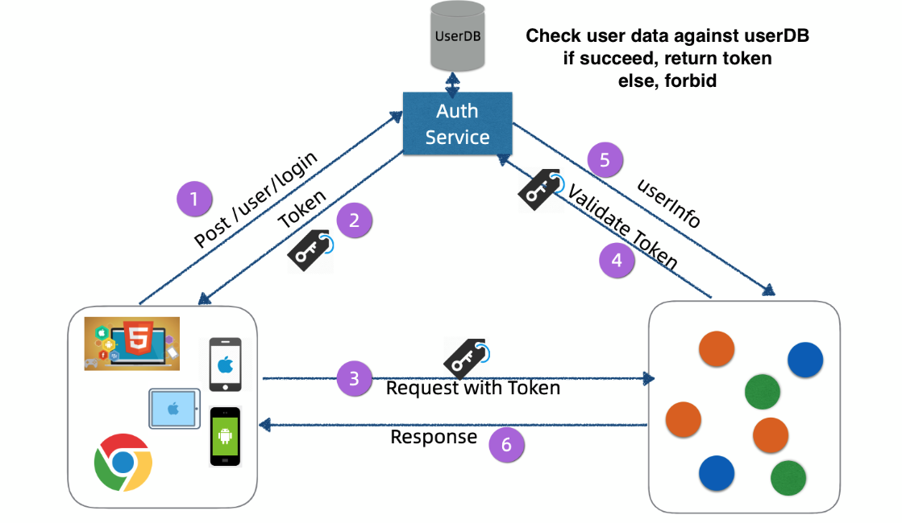

### Gateway and token
* Pros:
	- Gateway centralizes the logic of parsing userInfo. Only gateway need to validate the token with auth service. 
* Cons:
	- All requests need to be verified via auth service. Auth service needs to be maintained and scaled in a manageable way. 

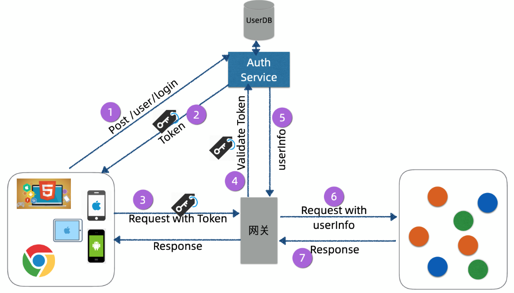

### Gateway and JWT
* Pros:
	- Compact and lightweight
	- Low pressure on Auth server
	- Simplify the implementation of auth server
* Cons:
	- Could not invalidate a JWT token if it has been leaked
	- JWT might become big

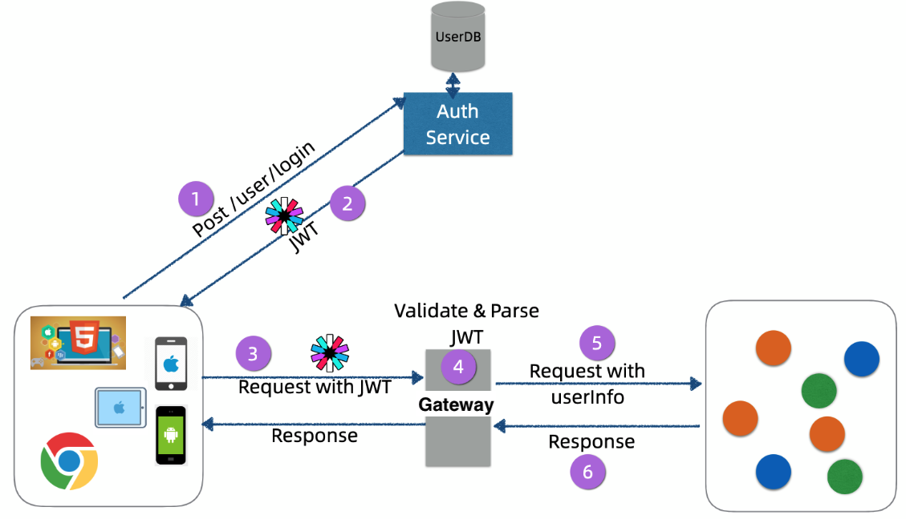

## Microservices security architecture
### External access token internal JWT token
* Cons: Still rely on gateway to switch access token with JWT token. 

 

### Encrypted JWT token
* Pros: Stateless token

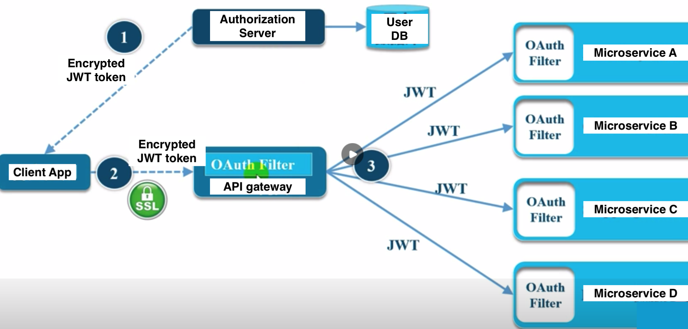 

### External access token internal JWT token with token cache
* Most widely used in practice

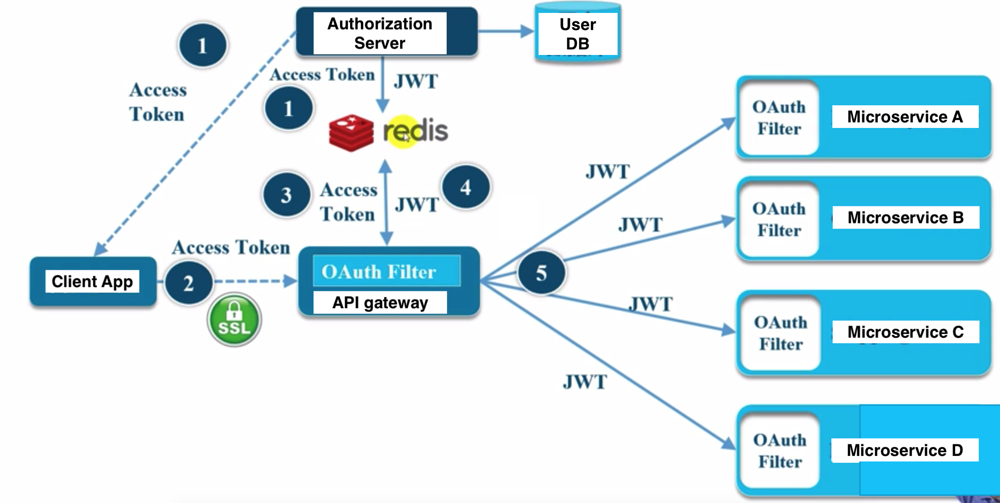 

## Secure microservices on Kubernetes

## Secure microservices on Istio service mesh

## Real world examples
### Auth at Netflix
* https://netflixtechblog.com/edge-authentication-and-token-agnostic-identity-propagation-514e47e0b602
* A talk on InfoQ: https://www.infoq.com/presentations/netflix-user-identity/
* Access control at Netflix: https://netflixtechblog.com/consoleme-a-central-control-plane-for-aws-permissions-and-access-fd09afdd60a8
* Netflix container security: https://netflixtechblog.com/evolving-container-security-with-linux-user-namespaces-afbe3308c082
* Netflix detect credential leak: https://netflixtechblog.com/netflix-cloud-security-detecting-credential-compromise-in-aws-9493d6fd373a
* Netflix viewing privacy: https://netflixtechblog.com/protecting-netflix-viewing-privacy-at-scale-39c675d88f45