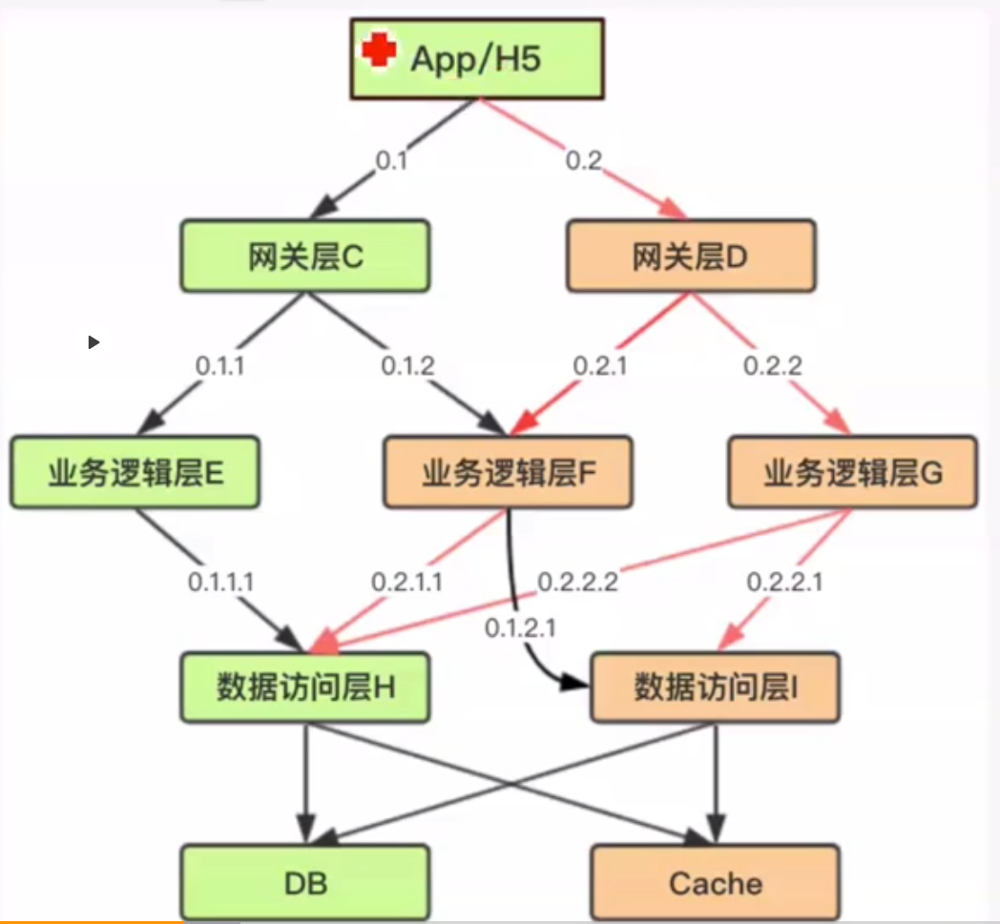
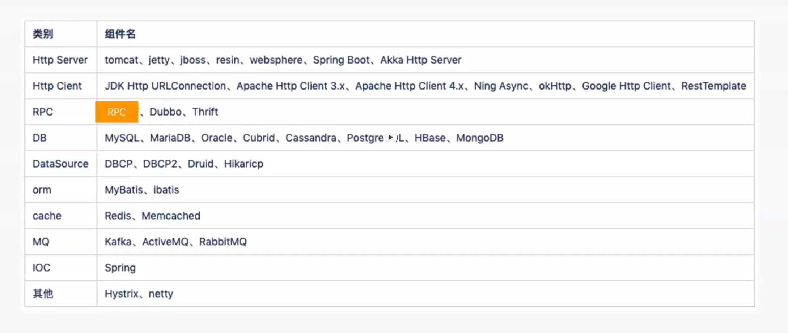

- [Distributed tracing](#distributed-tracing)
  - [Overview](#overview)
  - [Use case](#use-case)
  - [History](#history)
  - [Requirements](#requirements)
  - [Components](#components)
    - [Generate logs](#generate-logs)
      - [Unique Id](#unique-id)
    - [Offline analysis](#offline-analysis)
    - [Real-time analysis](#real-time-analysis)
    - [Full data](#full-data)
  - [Pinpoint](#pinpoint)
    - [Supported intercepting components](#supported-intercepting-components)
    - [How to generate Spanner ID](#how-to-generate-spanner-id)

# Distributed tracing
## Overview
* [Trace Id construction and popular solution comparison](https://time.geekbang.org/course/detail/100003901-2277)
* [Overview](https://time.geekbang.org/column/article/15273)
* [Popular solution comparison](https://time.geekbang.org/column/article/40505)

## Use case
* When bottleneck for application performance and Core service dies and result in tracing
* How to resolve:
	- Solve it by business side
	- Distributed tracing system

## History
* 2014 Google Dapper. "Dapper, a Large-Scale Distributed Systems Tracing Infrastructure"
* Alibaba EagleEye
* DaZhongDianPing CAT 
* Jingdong Hydra
* Twitter Zipkin
* Apache SkyWalking (APM - Application Performance Management)
* Pinpoint (APM)

## Requirements
* Not much change in business logic required, reduce load on business developers
* Could define the sampling rate and on-off switch
* Latency not too low

## Components

### Generate logs
* Only needs to import jar pakcagge
* Or when starting the application, add additional parameter
	- javaagent: Which starts application in Java agent mode. It adds a pre-event interceptor and an after-event interceptor. Then performance metrics could be collected by agent. 
	- Introduced within JDK 1.5 (Byte enhancement tool)
* Send the log every 5 seconds

#### Unique Id
* TraceID
	- Generate using UUID
* SequenceID
	- Gateway calls business logic unit 1 first, then business logic unit 2. SequenceId is used to number this. Differentiate the request on the breadth level
	- Increment from 1 
* DepthID
	- Differentiate the request on the depth level
	- The number of dots in an ID

### Offline analysis
* Based on Hadoop

### Real-time analysis
* Spark/Flume performs real-time analysis for QPS, average response time
* Result is being piped into Redis

### Full data 
* Elasticsearch to search

## Pinpoint
### Supported intercepting components

### How to generate Spanner ID
* Not incremental, a random number between min(long) and max(long)

