- [Relational distributed database](#relational-distributed-database)
  - [OLTP](#oltp)
  - [ACID - Consistency](#acid---consistency)
    - [State consistency](#state-consistency)
      - [Categories](#categories)
    - [Operation consistency](#operation-consistency)
      - [Read after write consistency](#read-after-write-consistency)
      - [Monotonic read consistency](#monotonic-read-consistency)
      - [Consistent prefix](#consistent-prefix)
      - [Linearizability](#linearizability)
        - [Engineering implementation](#engineering-implementation)
      - [Casual consistency](#casual-consistency)
        - [Engineering implementation](#engineering-implementation-1)
  - [ACID - Durability](#acid---durability)
  - [ACID - Atomicity](#acid---atomicity)
    - [Def](#def)
    - [2PC and TCC](#2pc-and-tcc)
  - [ACID - Isolation](#acid---isolation)
    - [ANSI SQL-92](#ansi-sql-92)
    - [Critique](#critique)
      - [Def](#def-1)
      - [Snapshot isolation](#snapshot-isolation)
        - [Phantom read vs unrepeatable read](#phantom-read-vs-unrepeatable-read)
        - [Write skew problem](#write-skew-problem)
        - [Why snapshot isolation is left from SQL-92](#why-snapshot-isolation-is-left-from-sql-92)
    - [Effort to support linearizable](#effort-to-support-linearizable)
  - [Components](#components)
    - [Traditional DB architecture](#traditional-db-architecture)
    - [PGXC](#pgxc)
      - [Proxy layer only](#proxy-layer-only)
      - [Proxy layer + transaction management](#proxy-layer--transaction-management)
      - [Proxy layer + Global clock](#proxy-layer--global-clock)
    - [NewSQL](#newsql)
  - [Global clock](#global-clock)
    - [TrueTime](#truetime)
    - [Hybrid logical clock (HLC)](#hybrid-logical-clock-hlc)
      - [Adopters](#adopters)
      - [CockroachDB's implementation](#cockroachdbs-implementation)
    - [Timestamp Oracle (TSO)](#timestamp-oracle-tso)
      - [Adopters](#adopters-1)
      - [TiDB's implementation](#tidbs-implementation)
      - [Cons](#cons)
    - [SequoiaDB Time Protocol (STP)](#sequoiadb-time-protocol-stp)
  - [Sharding](#sharding)
    - [Benefits of range based dynamic sharding](#benefits-of-range-based-dynamic-sharding)
    - [Differentiators between NewSQL and PGXC sharding](#differentiators-between-newsql-and-pgxc-sharding)
    - [Sharding metadata](#sharding-metadata)
      - [Static sharding with hash based arrangement](#static-sharding-with-hash-based-arrangement)
      - [TiDB: Dedicated cluster for metadata with Paxos replication](#tidb-dedicated-cluster-for-metadata-with-paxos-replication)
      - [CoackroachDB: Gossip protocol](#coackroachdb-gossip-protocol)
  - [References](#references)

# Relational distributed database

## OLTP
* OLTP scenarios characteristics:
  * Write intensive. Read operation has low complexity and usually does not involve large amount of data. 
  * Low latency. Usually within 500ms. 
  * High concurrency. 

## ACID - Consistency
* Reference: https://jepsen.io/consistency

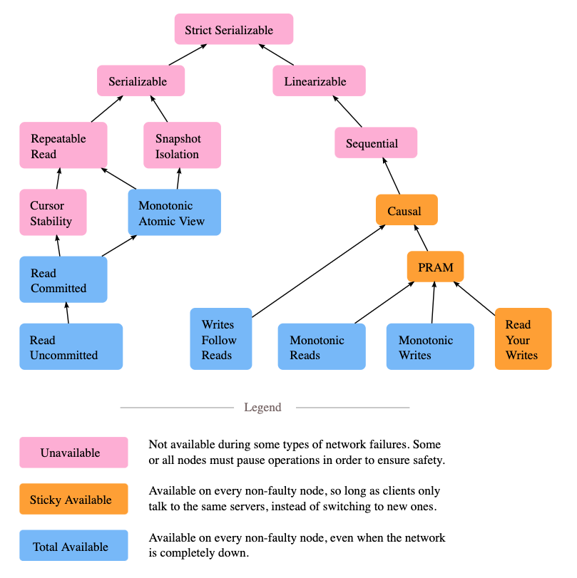

|              | `Linearizability` | `Casual consistency` |
|--------------|--------------------|---|
| `Serializable(SSI)` | Spanner | CockroadDB  |
| `Snap Isolation(SI)` |  TiDB  | YugabyteDB  |
| `Repeatable Read(RR)` | GoldenDB  |   |
| `Read Committed(RC)`   | OceanBase 2.0+ |   |

### State consistency
* Azure Cosmos DB consistency models: https://docs.microsoft.com/en-us/azure/cosmos-db/consistency-levels

#### Categories
* Strong consistency
* Eventual consistency
* Monotonic write consistency
* Session consistency
* Write follows read consistency

### Operation consistency
#### Read after write consistency
* A user makes a write, followed by a read from a stale replica. To prevent this anomaly, we need read-after-write consistency.
* Reference: https://ebrary.net/64708/computer_science/reading_your_writes#586

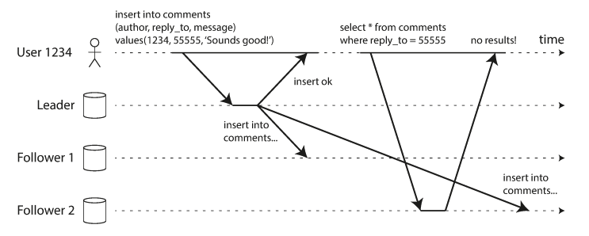

#### Monotonic read consistency
* A user first reads from a fresh replica, then from a stale replica. Time appears to go backward. To prevent this anomaly, we need monotonic reads.
* Reference: https://ebrary.net/64709/computer_science/monotonic_reads#720

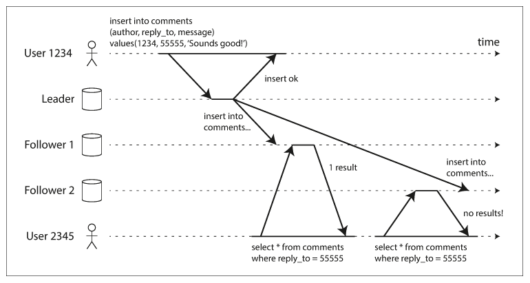

#### Consistent prefix

* If some partitions are replicated slower than others, an observer may see the answer before they see the question.
* Reference: https://ebrary.net/64710/computer_science/consistent_prefix_reads#807

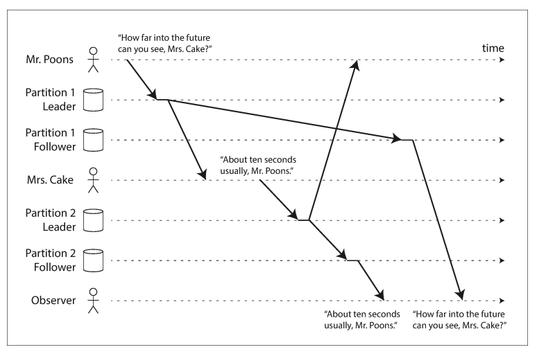

#### Linearizability
* Below graph shows an example of a nonlinearizable sports website. Alice and Bob are sitting in the same room, both checking their phones to see the outcome of the 2014 FIFA World Cup final. Just after the final score is announced, Alice refreshes the page, sees the winner announced, and excitedly tells Bob about it. Bob incredulously hits reload on his own phone, but his request goes to a database replica that is lagging, and so his phone shows that the game is still ongoing.

* Reference: https://ebrary.net/64846/computer_science/linearizability#283

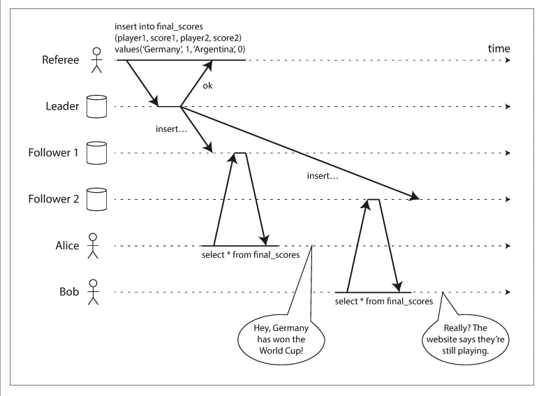

##### Engineering implementation
* To achieve linearizability, it requires Global clock and total order. 
* In engineering, most products use TSO (get time from a single server with HA design); Google Spanner uses TrueTime (Global clock by GPS and atomic clock, the variance is within 7ms)

#### Casual consistency
* Casual consistency is weaker than linearizability but more efficient in engineering. Partial events could be ordered. 

##### Engineering implementation
* CockroachDB and YugabyteDB both uses hybrid logical clocks. 
* This originates from Lamport stamp. 

## ACID - Durability
* Category 1: Hardware is not damaged and could recover. 
  * Rely on write ahead log to recover
* Category 2: Hardware is damaged and could not recover. 
  * Rely on synchronous or semi-synchronous replication typically shipped together with database.
  * Rely on shared storage such as Amazon Aurora.
  * Rely on consensus protocol such as Paxos/Raft. 

## ACID - Atomicity
### Def
* Either all the changes from the transaction occur (writes, and messages sent), or none occur. 
* It requires transaction to be in two states.

### 2PC and TCC
* When compared with 2PC, TCC does not always need lock so could be a bit more performant


## ACID - Isolation
* There are multiple isolation levels

### ANSI SQL-92
* The earliest definition on ANSI SQL-92: Defines four isolation levels and three types of unexpected behaviors. 

[](./images/relational_distributedDb_AntiS.png)

### Critique
#### Def
* Based on top of ANSI SQL-92, Critique defines six isolation levels and eight types of unexpected behaviors. 

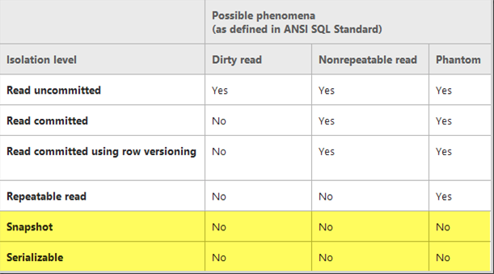


#### Snapshot isolation
* Snapshot isolation makes the most differences because
  * Within SQL-92, the biggest differences between Repeatable Read (RR) and Serializable is how to handle phantom read. 
  * Critique points out that even Snapshot isolation could solve phantom read, it is still not serializable because it could not handle write skew problem. 

##### Phantom read vs unrepeatable read
* Similaririties: Within a transaction, query with the same condition twice but the results of the two times are different. 
* Differences: 
  * Unrepeatable read: Some results for the second time are updated or deleted. 
  * Phantom read: Some results for the second time are inserted. Within MySQL, the lock to prevent phantom read is called Gap Lock. 

##### Write skew problem
* Process: 
  * Both Alice and Bob select the Post and the PostDetails entities.
  * Bob modifies the Post title, but, since the PostDetails is already marked as updated by Bob, the dirty checking mechanism will skip updating the PostDetails entity, therefore preventing a redundant UPDATE statement.
  * Alice wants to update the Post entity, but the entity already has the same value as the one she wants to apply so only the PostDetails record will mark that the latest change is the one proposed by Alice.

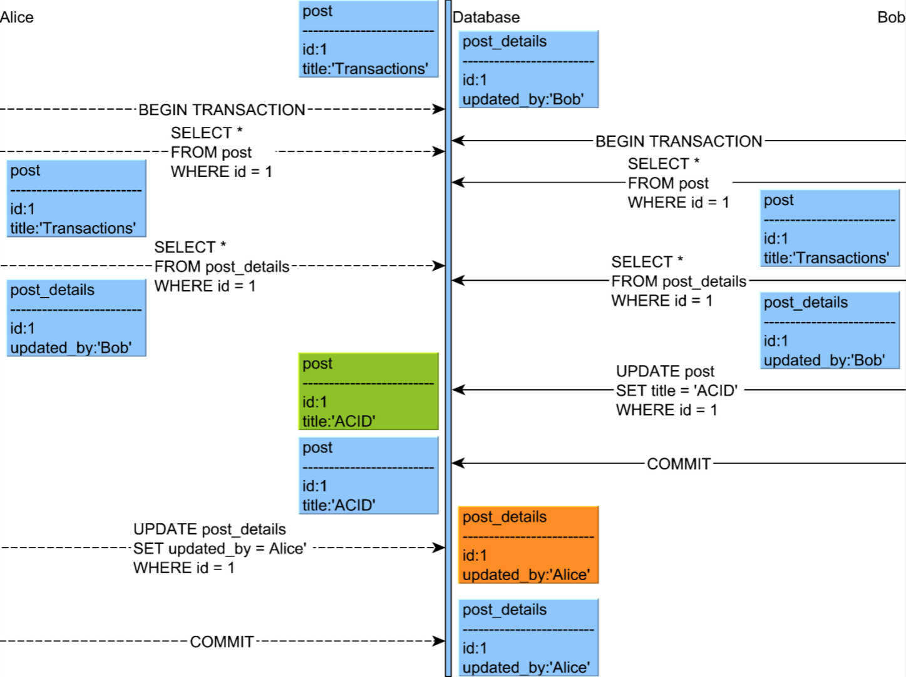

* References: https://vladmihalcea.com/a-beginners-guide-to-read-and-write-skew-phenomena/

##### Why snapshot isolation is left from SQL-92
* SQL-92 is built on top of lock-based concurrency control, and snapshot isolation is built on top of MVCC. 

### Effort to support linearizable
* Redis/VoltDB: Use single thread to implement serialization.
* CockroachDB: 

## Components
### Traditional DB architecture
* Client communications manager: Developers use JDBC or ODBC to conenct to database. 
* Process manager: After the connection is established, database system will allocate a process for handling all follow-up operations. More precisely,
  * Oracle and PostgreSQL uses a process. 
  * MySQL uses a thread. 
* Relational query processor: 
  * Query parsing and authorization
  * Query rewrite
  * Query optimizer
  * Plan executor
* Transactional storage manager: 
  * Access methods
  * Lock manager
  * Log manager
  * Buffer manager
* Shared components and utilities: 

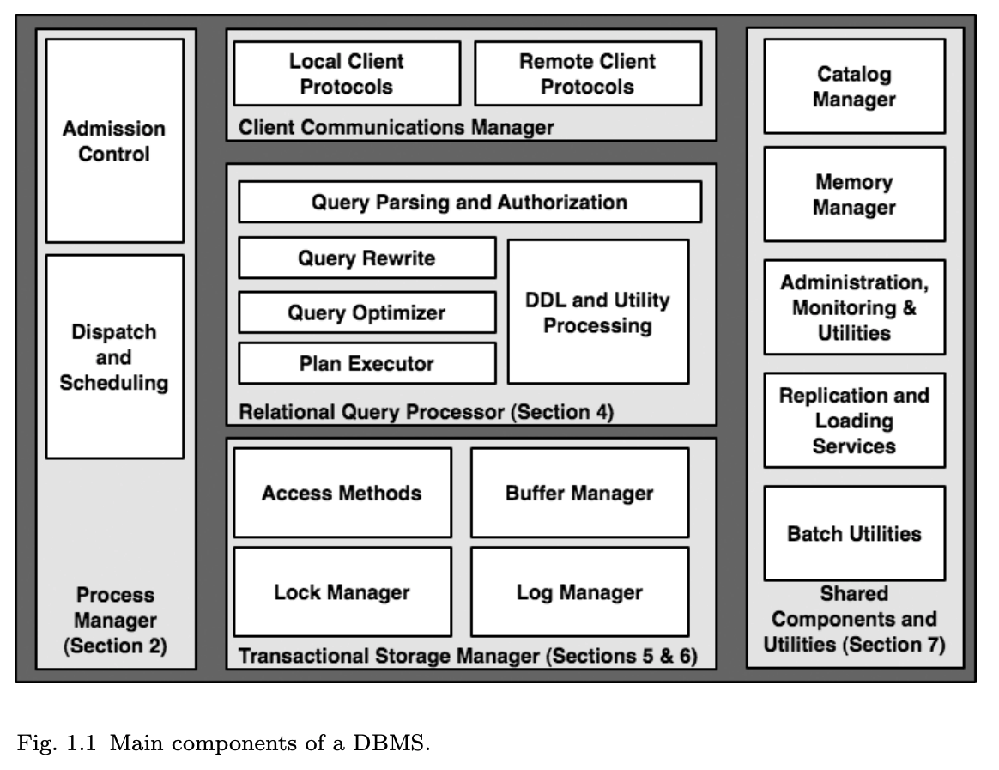

### PGXC
* Products: GoldenDB / TBase / GaussDB 300 / AntDB

#### Proxy layer only

```
┌────────────────────────────────────────────────────────────────────┐     ┌─────────────────┐
│                             Proxy Node                             │     │                 │
│                                                                    │     │                 │
│ ┌────────────┐     ┌────────────┐    ┌───────────────┐             │     │                 │
│ │  Process   │     │   Query    │    │    Client     │             │     │                 │
│ │ management │     │ processor  │    │communications │             │     │                 │
│ │            │     │            │    │    manager    │             │     │                 │
│ └────────────┘     └────────────┘    └───────────────┘             │     │                 │
└────────────────────────────────────────────────────────────────────┘     │                 │
                                                                           │                 │
                                                                           │    Sharding     │
                                                                           │   information   │
                                                                           │                 │
┌─────────────────────────────────────────────────────────────────────┐    │                 │
│                              Data Node                              │    │                 │
│ ┌────────────┐    ┌────────────┐    ┌────────────┐    ┌────────────┐│    │                 │
│ │  Process   │    │   Query    │    │Transaction │    │   Shared   ││    │                 │
│ │ management │    │ processor  │    │  storage   │    │ components ││    │                 │
│ │            │    │            │    │  manager   │    │            ││    │                 │
│ └────────────┘    └────────────┘    └────────────┘    └────────────┘│    │                 │
│                                                                     │    │                 │
└─────────────────────────────────────────────────────────────────────┘    └─────────────────┘
```

#### Proxy layer + transaction management
* Sample implementation: MyCat

```
┌────────────────────────────────────────────────────────────────────┐     ┌─────────────────┐
│                             Proxy Node                             │     │                 │
│                                                   ┏━━━━━━━━━━━━━━┓ │     │                 │
│ ┌────────────┐  ┌────────────┐  ┌───────────────┐ ┃██████████████┃ │     │                 │
│ │  Process   │  │   Query    │  │    Client     │ ┃█Distributed █┃ │     │                 │
│ │ management │  │ processor  │  │communications │ ┃█transaction █┃ │     │                 │
│ │            │  │            │  │    manager    │ ┃███manager████┃ │     │                 │
│ └────────────┘  └────────────┘  └───────────────┘ ┃██████████████┃ │     │                 │
└───────────────────────────────────────────────────┻━━━━━━━━━━━━━━┻─┘     │                 │
                                                                           │                 │
                                                                           │    Sharding     │
                                                                           │   information   │
                                                                           │                 │
┌─────────────────────────────────────────────────────────────────────┐    │                 │
│                              Data Node                              │    │                 │
│ ┌────────────┐    ┌────────────┐    ┌────────────┐    ┌────────────┐│    │                 │
│ │  Process   │    │   Query    │    │Transaction │    │   Shared   ││    │                 │
│ │ management │    │ processor  │    │  storage   │    │ components ││    │                 │
│ │            │    │            │    │  manager   │    │            ││    │                 │
│ └────────────┘    └────────────┘    └────────────┘    └────────────┘│    │                 │
│                                                                     │    │                 │
└─────────────────────────────────────────────────────────────────────┘    └─────────────────┘
```

#### Proxy layer + Global clock

```
┌────────────────────────────────────────────────────────────────────┐     ┌─────────────────┐ 
│                             Proxy Node                             │     │                 │ 
│                                                                    │     │                 │ 
│ ┌────────────┐  ┌────────────┐  ┌───────────────┐ ┌──────────────┐ │     │    Sharding     │ 
│ │  Process   │  │   Query    │  │    Client     │ │ Distributed  │ │     │   information   │ 
│ │ management │  │ processor  │  │communications │ │ transaction  │ │     │                 │ 
│ │            │  │            │  │    manager    │ │   manager    │ │     │                 │ 
│ └────────────┘  └────────────┘  └───────────────┘ └──────────────┘ │     │                 │ 
└────────────────────────────────────────────────────────────────────┘     └─────────────────┘ 
                                                                                               
                                                                                               
                                                                                               
                                                                                               
┌─────────────────────────────────────────────────────────────────────┐     ┌─────────────────┐
│                              Data Node                              │     │█████████████████│
│ ┌────────────┐    ┌────────────┐    ┌────────────┐    ┌────────────┐│     │█████████████████│
│ │  Process   │    │   Query    │    │Transaction │    │   Shared   ││     │█████████████████│
│ │ management │    │ processor  │    │  storage   │    │ components ││     │██Global clock███│
│ │            │    │            │    │  manager   │    │            ││     │█████████████████│
│ └────────────┘    └────────────┘    └────────────┘    └────────────┘│     │█████████████████│
│                                                                     │     │█████████████████│
└─────────────────────────────────────────────────────────────────────┘     └─────────────────┘
```

### NewSQL
* Products: Spanner / CockroachDB / TiDB / YugabyteDB / OceanBase
* Differences from PGXC:
  * Based on K/V store BigTable instead of  traditional relational DB
  * Based on Paxos/Raft protocol instead of master slave replication
  * Based on LSM-Tree instead of B+ Tree

```
┌────────────────────────────────────────────────────────────────────┐     ┌─────────────────┐ 
│                             Proxy Node                             │     │█████████████████│ 
│                                                                    │     │█████████████████│ 
│ ┌────────────┐  ┌────────────┐  ┌───────────────┐ ┌──────────────┐ │     │████Metadata ████│ 
│ │  Process   │  │   Query    │  │    Client     │ │ Distributed  │ │     │███management████│ 
│ │ management │  │ processor  │  │communications │ │ transaction  │ │     │█████████████████│ 
│ │            │  │            │  │    manager    │ │   manager    │ │     │█████████████████│ 
│ └────────────┘  └────────────┘  └───────────────┘ └──────────────┘ │     │█████████████████│ 
└────────────────────────────────────────────────────────────────────┘     └─────────────────┘ 
                                                                                               
                                                                                               
                                                                                               
                                                                                               
┌─────────────────────────────────────────────────────────────────────┐     ┌─────────────────┐
│██████████████████████████Key value system███████████████████████████│     │                 │
│█┌────────────┐████┌────────────┐████┌────────────┐████┌────────────┐│     │                 │
│█│  Process   │████│  Storage   │████│Computation │████│   Shared   ││     │                 │
│█│ management │████│ management │████│  pushdown  │████│ components ││     │  Global clock   │
│█│            │████│            │████│            │████│            ││     │                 │
│█└────────────┘████└────────────┘████└────────────┘████└────────────┘│     │                 │
│█████████████████████████████████████████████████████████████████████│     │                 │
└─────────────────────────────────────────────────────────────────────┘     └─────────────────┘
```

## Global clock

|              |  `Physical clock - Multiple time source`   |  `Physical clock - Single time source` | `Logical clock - Multiple time source`  | `Logical clock - Single time source`  |
|--------------|--------------------|---|---|---|
| `Single point assigns time` |   NA  |  NA  |  NA  | TSO (TIDB)  |
| `Multiple point assigns time` |  TrueTime (Spanner)  |  NTP  | HLC (CockroachDB)  | STP |

### TrueTime
* Spanner uses TrueTime. The time source is GPS and atomic clock. And it relies on hardware. 
* Pros
  * High reliability and performance. Remove the centralized design and there is no SPF. 
  * Support global deployment. The distance between time server and clients could be controlled. 
* Cons
  * There is margin of error for 7ms. 

### Hybrid logical clock (HLC)

#### Adopters
* CockroachDB / YugabyteDB

#### CockroachDB's implementation

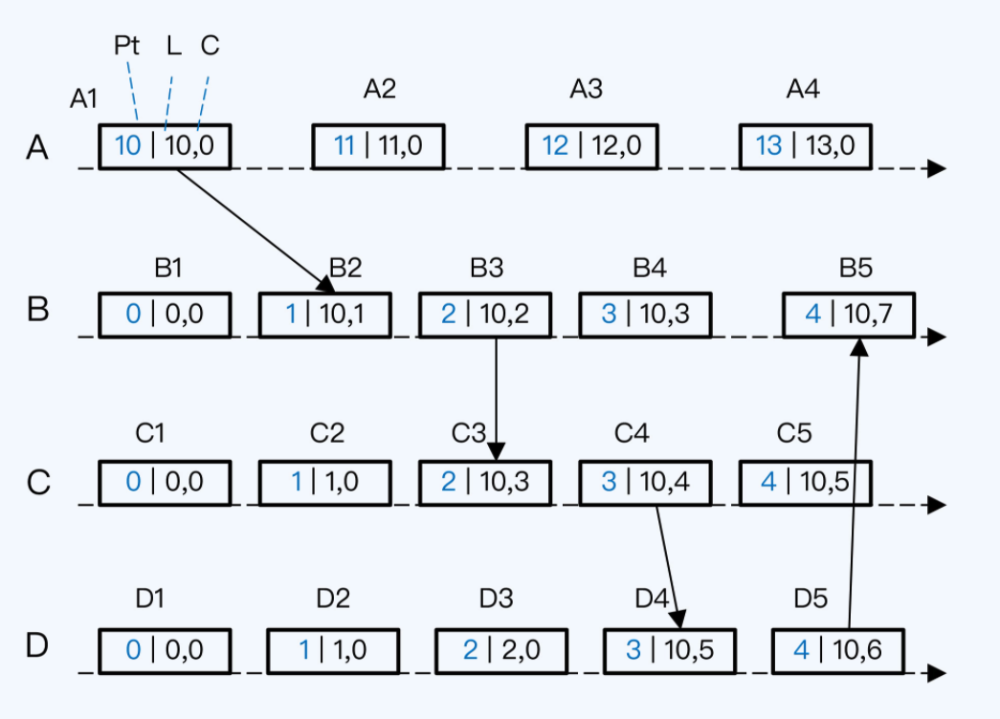

### Timestamp Oracle (TSO)
* A single incremental logical timestamp.

#### Adopters
* TiDB / OceanBase / GoldenDB / TBase. 

#### TiDB's implementation
* Global clock consists of two parts: High bits are physical clock and low bits (18) are logical clock. 
* How to solve the SPF? 
  * Multiple placement driver becomes a raft group. And a new master will be elected when the original node becomes down. 
* How to make sure the new master timestamp is bigger than old master timestamp?
  * Store the timestamp inside etcd. 
* How to avoid saving each timestamp inside etcd due to performance reasons?
  * Preallocate a time window for timestamps

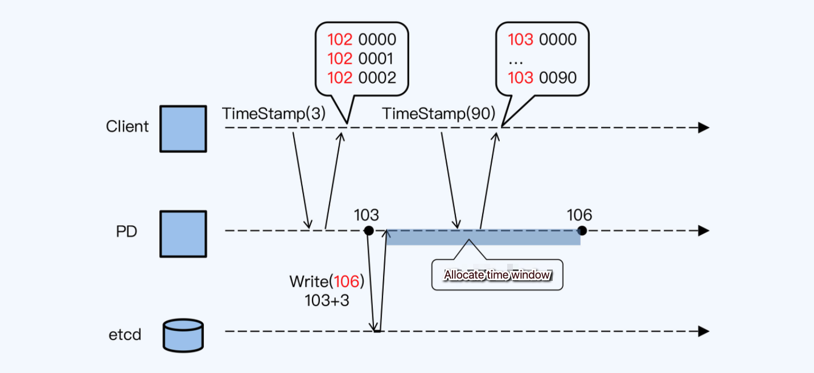

#### Cons
* Upper limit on performance and could not deploy on a large scale. 

### SequoiaDB Time Protocol (STP)
* STP 

## Sharding

|              | `Static` | `Dynamic` |
|--------------|----------|---|
| `Hash` | PGXC / NewSQL |  NA  |
| `Range` | PGXC        |  NewSQL  |

* There are two sharding approaches: Hash based vs range base. 
* Range based sharding is typically used more widely when compared with hash based because:
  * Range based sharding are more suitable for search through the data. 
  * It could include the business related logic. For example, if a service has more users in Beijing and Shanghai but much less users overseas, then both of Beijing and Shanghai could have their separate shard. And overseas users could have a separate shard. 

### Benefits of range based dynamic sharding
* Shard could automatically split and merge according to the data volume or traffic volume. 
* Reduce distributed transactions. 
  * For example, Spanner adds the concept of directory under tablet. And the scheduling of directory could span across tablet. 
  * By directory scheling, it could move directories participating a transaction under the same tablet. 
* Reduce service latency. 
  * Spanner could move a directory to a position closer to users. 

### Differentiators between NewSQL and PGXC sharding
* Sharding is the smallest reliable unit for NewSQL; For PGXC, sharding's reliability relies on the node it resides in. 
* NewSQL relies on the concept of replication group. Within the replication group, multiple copies work with each other via Raft or Paxos protocol. 
* PGXC relies on the concepts of set. Within the set, multiple copies work with each other via semi-synchronous replication. 

### Sharding metadata
#### Static sharding with hash based arrangement
* If static sharding strategy is used, then metadata never needs to change and only replication is needed. And the metadata could use hash based sharding.  
* Cons:
  * If the metadata needs to be updated, then this is inappropriate because too many nodes need to update. 

#### TiDB: Dedicated cluster for metadata with Paxos replication
* Roles:
  * TiKV node: Store sharding data 
  * Placement driver: Store sharding metadata
* Interaction:
  * TiKV reports heartbeat message to PD on a regular basis. And metadata for sharding is also reported. 
  * PD will rely with sharding scheduling instructions. Then the next time TiKVs report, PD will know how the scheduling is going. 
* Benefits of the design:
  * TiKV always reports the full sharding info so that PD could be stateless. And the new PD master does not need to sync status with the old PD master. 

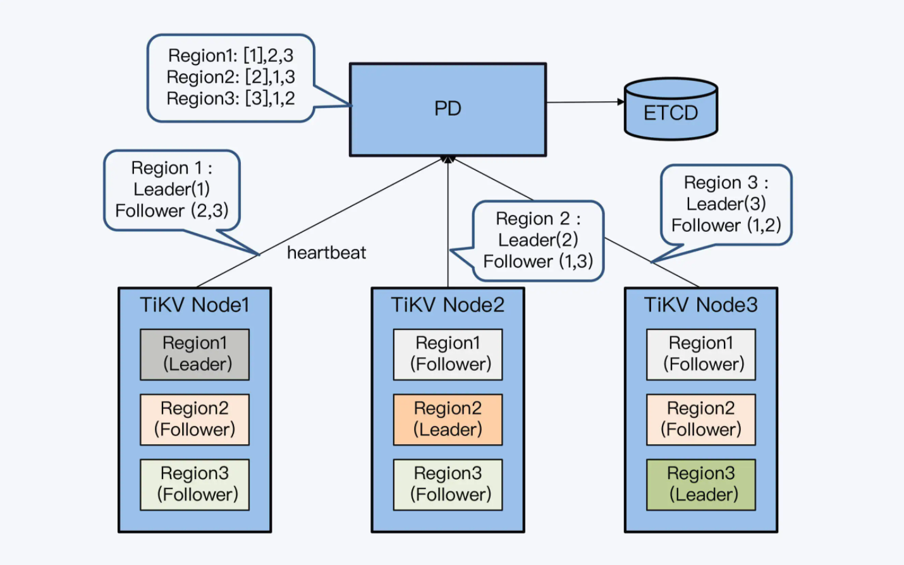

#### CoackroachDB: Gossip protocol
* Gossip vs Paxos
  * Paxos is a broadcasting protocol in essence. When there is a large number of nodes, the protocol will become much less efficient. 
  * Each spreader inside Gossip protocol only multicast the message in a small range. 
* Process:
  1. Node A receives the SQL request from client and want to query for T1. According to primary key range, T1 exists on shard R1, and local metadata shows that R1 exists on node B. 
  2. Node A sends requests to node B. Unfortunately, node A's metadata has already expired and R1 has already been reallocated to node C. 
  3. Node B relies an important information to node A. Shard R1 exists on node C. 
  4. Node A sends requests to Node C. Luckily, shard R1 do exists in Node C. 
  5. Node A receives node C's returned shard R1. 
  6. Node A returns records on R1 and update local metadata. 

```
                            ┌────────────────────┐                              
        Step1.              │                    │                              
       Send SQL ────────────│       Client       │                              
       request              │                    │                              
           │                └────────────────────┘                              
           │                           ▲                                        
           │                           │                                        
           │      Step6. Return shard  │                                        
           │    ┌──R1 corresponding ───┘                                        
           │    │       record                                                  
           │    │                                                               
           │    │                                         ┌────────────────────┐
           ▼    │                                         │       Node C       │
┌────────────────────┐                                    │      ┌──────┐      │
│       Node A       │                                    │      │ Data │      │
│                    │                                    │      │  R1  │      │
│   ┌────────────┐   │                                    │      └──────┘      │
│   │  Metadata  │   │◀──────Step5. Return shard R1───────│                    │
│   │R1 -> Node B│   │                                    │ ┌────────────────┐ │
│   │            │   │───────Step4. Look for shard───────▶│ │    Metadata    │ │
│   └────────────┘   │          R1 from Node C            │ │  R1 -> Node C  │ │
└────────────────────┘                                    │ └────────────────┘ │
           │    ▲                                         │                    │
           │    │                                         └────────────────────┘
           │    │      Step3. Return                                            
           │    └───────sharding R1 ──────┐                                     
           │             position         │                                     
           │                              │                                     
      Step2. Look                         │                                     
     for shard R1                         │                                     
      from Node B              ┌────────────────────┐                           
           │                   │       Node B       │                           
           │                   │                    │                           
           │                   │   ┌────────────┐   │                           
           └──────────────────▶│   │  Metadata  │   │                           
                               │   │R1 -> Node C│   │                           
                               │   │            │   │                           
                               │   └────────────┘   │                           
                               └────────────────────┘                           
```

## References
* [极客时间-分布式数据库](https://time.geekbang.org/column/article/271373)