- [Remote API Design](#remote-api-design)
	- [Socket programming](#socket-programming)
		- [Operations](#operations)
		- [Challenges](#challenges)
	- [RPC history: SUN RPC / ONC RPC](#rpc-history-sun-rpc--onc-rpc)
		- [Use case](#use-case)
		- [Components](#components)
		- [Limitations](#limitations)
	- [XML based protocols](#xml-based-protocols)
		- [When compared with ONC RPC](#when-compared-with-onc-rpc)
		- [SOAP](#soap)
			- [WSDL protocol](#wsdl-protocol)
			- [UDDI](#uddi)
			- [Sample request](#sample-request)
	- [RESTful](#restful)
		- [When commpared with SOAP](#when-commpared-with-soap)
		- [Def](#def)
		- [Transposing API goals into REST APIs](#transposing-api-goals-into-rest-apis)
			- [Cheat sheet](#cheat-sheet)
			- [Step by step](#step-by-step)
			- [Resource path best practices](#resource-path-best-practices)
			- [Http verb best practices](#http-verb-best-practices)
		- [Design API's data](#design-apis-data)
		- [Evolving an API](#evolving-an-api)
			- [Avoid breaking changes for output data](#avoid-breaking-changes-for-output-data)
			- [Avoid breakig changes for input data](#avoid-breakig-changes-for-input-data)
			- [Avoid breaking changes for success and error handling](#avoid-breaking-changes-for-success-and-error-handling)
			- [Avoid breaking changes for security](#avoid-breaking-changes-for-security)
			- [Versioning](#versioning)
				- [Semantic versioning](#semantic-versioning)
				- [Ways to implement version](#ways-to-implement-version)
				- [Versioning granularity](#versioning-granularity)
		- [Idempotency](#idempotency)
			- [Scenario](#scenario)
			- [Http idempotency](#http-idempotency)
			- [Database idempotency](#database-idempotency)
				- [Create/Insert](#createinsert)
				- [Read/Select](#readselect)
				- [Delete](#delete)
				- [Avoid replica databases](#avoid-replica-databases)
				- [Unique constraint within DB](#unique-constraint-within-db)
			- [Idempotency within business layer of distributed applications](#idempotency-within-business-layer-of-distributed-applications)
			- [Generate the idempotency key](#generate-the-idempotency-key)
				- [Where](#where)
				- [How](#how)
				- [Approaches](#approaches)
		- [Efficiency](#efficiency)
			- [Persistent connections](#persistent-connections)
			- [Compression](#compression)
				- [Whether response should be compressed?](#whether-response-should-be-compressed)
				- [End-to-End compression](#end-to-end-compression)
		- [Cache API response](#cache-api-response)
			- [Cache-Control headers](#cache-control-headers)
				- [Decision tree](#decision-tree)
				- [Sample flow](#sample-flow)
				- [Cache-Control vs Expire header](#cache-control-vs-expire-header)
				- [Whether a response is cacheable](#whether-a-response-is-cacheable)
				- [Set the expiration time of the header](#set-the-expiration-time-of-the-header)
				- [When a response must be revalidated](#when-a-response-must-be-revalidated)
			- [Conditional Get with validation](#conditional-get-with-validation)
				- [Last-Modified/If-Modified-Since/Max-age](#last-modifiedif-modified-sincemax-age)
				- [ETag](#etag)
			- [Vary header](#vary-header)
		- [Pagination for collections](#pagination-for-collections)
			- [Naive impl with Offsets and Limits](#naive-impl-with-offsets-and-limits)
				- [Metadata](#metadata)
				- [Cons](#cons)
			- [Improved impl with maxPageSize + nextPageToken](#improved-impl-with-maxpagesize--nextpagetoken)
				- [MaxPageSize](#maxpagesize)
				- [PageToken](#pagetoken)
				- [Total count](#total-count)
			- [Consistency problem](#consistency-problem)
		- [Filtering for collections](#filtering-for-collections)
		- [Batch and bulk operations](#batch-and-bulk-operations)
		- [Security](#security)
			- [Rate-limiting](#rate-limiting)
			- [Authentication / Audit log / Access control](#authentication--audit-log--access-control)
	- [RPC](#rpc)
		- [When compared with REST (using gRPC as example)](#when-compared-with-rest-using-grpc-as-example)
		- [Design](#design)
			- [Overview](#overview)
			- [Interface definition language](#interface-definition-language)
			- [Marshal/Unmarshal](#marshalunmarshal)
			- [Server processing model](#server-processing-model)
			- [Binding](#binding)
			- [Transport protocol](#transport-protocol)
			- [Serialization protocol](#serialization-protocol)
			- [Semantics of RPC](#semantics-of-rpc)
				- [At least once](#at-least-once)
				- [Exactly once](#exactly-once)
				- [At most once](#at-most-once)
					- [Designs](#designs)
				- [Last of many](#last-of-many)
		- [Choose RPC framework](#choose-rpc-framework)
			- [Cross language RPC: gRPC vs Thrift](#cross-language-rpc-grpc-vs-thrift)
			- [Same language RPC: Tars vs Dubbo vs Motan vs Spring Cloud](#same-language-rpc-tars-vs-dubbo-vs-motan-vs-spring-cloud)
		- [gRPC](#grpc)
			- [Protobuf](#protobuf)
			- [HTTP 1.1 vs HTTP 2](#http-11-vs-http-2)
			- [gRPC use cases](#grpc-use-cases)
			- [References](#references)
			- [History](#history)
			- [Features](#features)
				- [Multi-language, multi-platform framework](#multi-language-multi-platform-framework)
				- [Transport over HTTP/2 + TLS](#transport-over-http2--tls)
				- [C/C++ implementation goals](#cc-implementation-goals)
			- [Components](#components-1)
	- [Real world](#real-world)
		- [Netflix](#netflix)
			- [GraphQL at Netflix:](#graphql-at-netflix)
		- [API redesign](#api-redesign)
		- [API specification](#api-specification)
	- [References](#references-1)

# Remote API Design
## Socket programming
### Operations
* Send on the left; Receive on the right

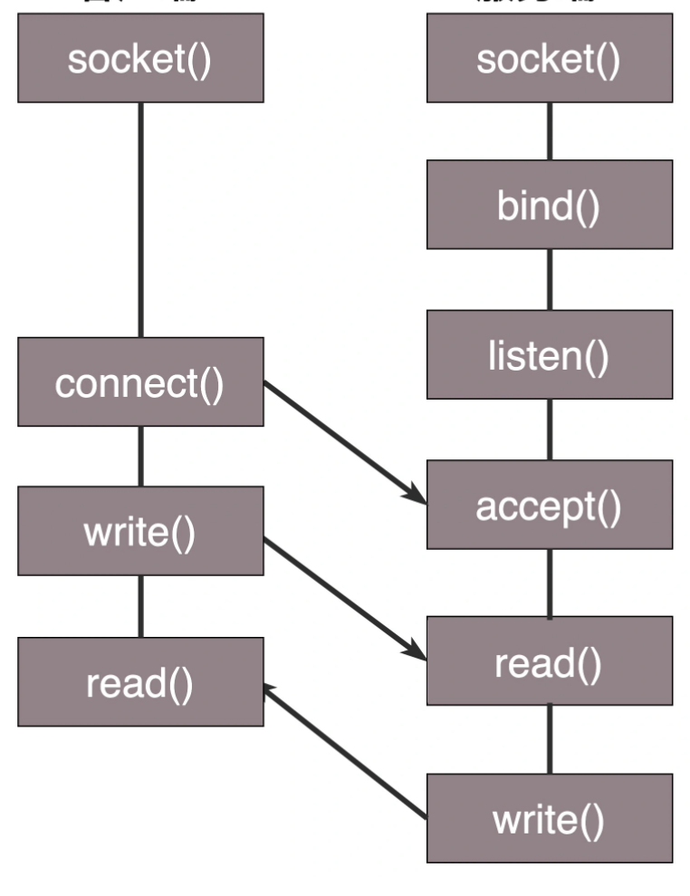

### Challenges
1. How to define the grammer for remote operations. E.g. How to represent an add operation? Use '+', 'add' or number '1'
2. How to represent the parameters for functions. E.g. Polish notation, reverse polish notation.
3. How to represent data. E.g. Big endian / little endian 
4. How to do service discovery. E.g. What functionalities a remote service support. 
5. What to do when faced with performance and resiliency conditions, etc.

## RPC history: SUN RPC / ONC RPC
### Use case
* NFC protocol mount (put a remote directory on a local path) and nfsd (read / write files) commands. 

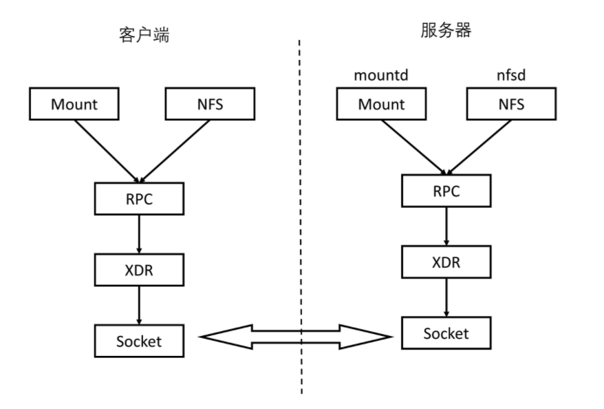

### Components
* SUN RPC flowchart

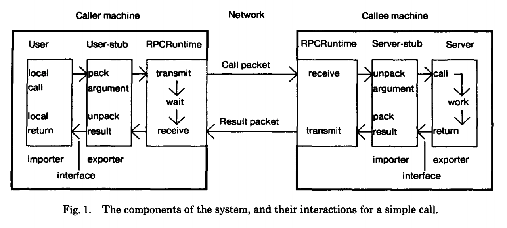

* XDR means external data representation. 

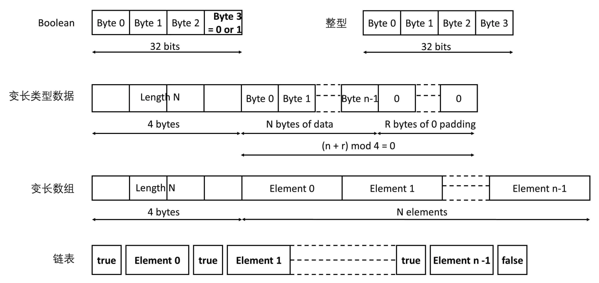

* Utilities for generating stub


* Resiliency


* Service discovery with portmapper


### Limitations
* Error prone compression and decompression process. 
* Hard to modify the protocol.
* ONC RPC is function oriented, not object oriented. 

## XML based protocols
### When compared with ONC RPC
* It has the following benefits:
  * ONC RPC is binary based. XML allows client and server accepted data transformation to have some inconsisteny. e.g. changing the order of elements will not result in any error. 
  * It is object oriented instead of function oriented. 

### SOAP
#### WSDL protocol
* WSDL protocol could be used to generate client's stub. 

```
// Order type
 <wsdl:types>
  <xsd:schema targetNamespace="http://www.example.org/geektime">
   <xsd:complexType name="order">
    <xsd:element name="date" type="xsd:string"></xsd:element>
	<xsd:element name="className" type="xsd:string"></xsd:element>
	<xsd:element name="Author" type="xsd:string"></xsd:element>
    <xsd:element name="price" type="xsd:int"></xsd:element>
   </xsd:complexType>
  </xsd:schema>
 </wsdl:types>

// Message structure
 <wsdl:message name="purchase">
  <wsdl:part name="purchaseOrder" element="tns:order"></wsdl:part>
 </wsdl:message>

// Expose an interface
 <wsdl:portType name="PurchaseOrderService">
  <wsdl:operation name="purchase">
   <wsdl:input message="tns:purchase"></wsdl:input>
   <wsdl:output message="......"></wsdl:output>
  </wsdl:operation>
 </wsdl:portType>

// Define a binding
 <wsdl:binding name="purchaseOrderServiceSOAP" type="tns:PurchaseOrderService">
  <soap:binding style="rpc"
   transport="http://schemas.xmlsoap.org/soap/http" />
  <wsdl:operation name="purchase">
   <wsdl:input>
    <soap:body use="literal" />
   </wsdl:input>
   <wsdl:output>
    <soap:body use="literal" />
   </wsdl:output>
  </wsdl:operation>
 </wsdl:binding>

// Define a service
 <wsdl:service name="PurchaseOrderServiceImplService">
  <wsdl:port binding="tns:purchaseOrderServiceSOAP" name="PurchaseOrderServiceImplPort">
   <soap:address location="http://www.geektime.com:8080/purchaseOrder" />
  </wsdl:port>
 </wsdl:service>
```

#### UDDI 
* Universal description, discovery and integration

#### Sample request

```
// Header
POST /purchaseOrder HTTP/1.1
Host: www.geektime.com
Content-Type: application/soap+xml; charset=utf-8
Content-Length: nnn

// Body
<?xml version="1.0"?>
<soap:Envelope xmlns:soap="http://www.w3.org/2001/12/soap-envelope"
soap:encodingStyle="http://www.w3.org/2001/12/soap-encoding">
    <soap:Header>
        <m:Trans xmlns:m="http://www.w3schools.com/transaction/"
          soap:mustUnderstand="1">1234
        </m:Trans>
    </soap:Header>
    <soap:Body xmlns:m="http://www.geektime.com/perchaseOrder">
        <m:purchaseOrder">
            <order>
                <date>2018-07-01</date>
                <className>趣谈网络协议</className>
                <Author>刘超</Author>
                <price>68</price>
            </order>
        </m:purchaseOrder>
    </soap:Body>
</soap:Envelope>
```

## RESTful
### When commpared with SOAP
* SOAP only uses POST http method and embedded action inside. Since SOAP could embed various actions inside, usually SOAP relies either on the server (in most cases) or client to maintain the state of resource. 
  * If storing this state info on server: This design makes it not scalable in internet cases where there are large number of clients. 
    * e.g. NFS initially could remember each client's state.
    * e.g. For an ERP system having multiple pages, the server needs to remember which page each client is on. 
  * If storing this state info on client: Then each API's design could also become a bit more complicated.
* On the contrary, REST makes the service stateless, which means that the server maintains the status of the resource, and client maintains the status of the conversation. 
  * e.g. When designing a system for directory browse, it will be based on absolute path (REST style) vs relative path. 

### Def
* Six architecture principles: https://restfulapi.net/
* Unfortunately, the REST keyword is already been abused: https://dzone.com/articles/please-dont-call-them-restful

### Transposing API goals into REST APIs
#### Cheat sheet

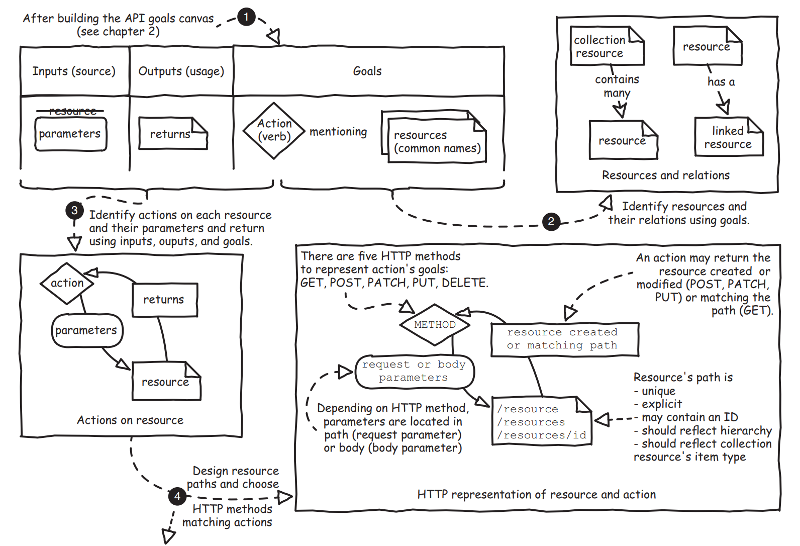

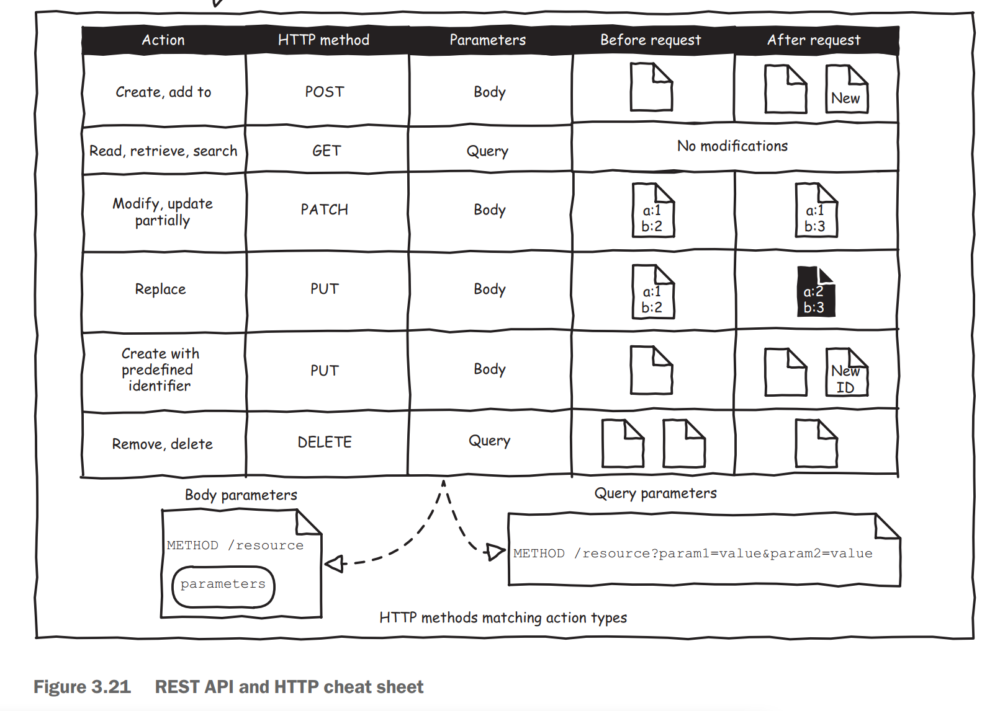

#### Step by step
1. Identify resources and their relationships
2. Identify actions, parameters and returns
3. Design resource paths
4. Identify action parameters and return values

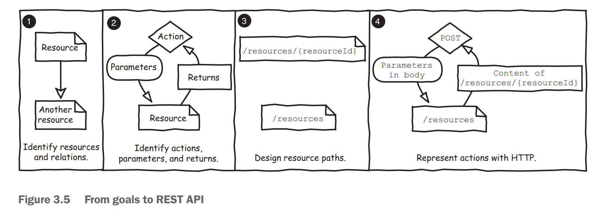

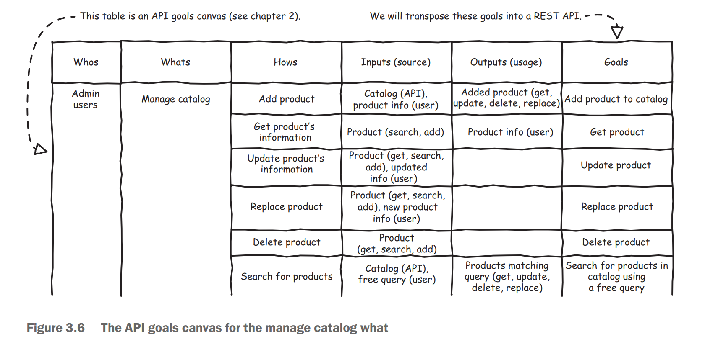


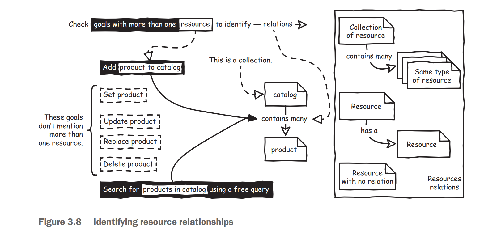

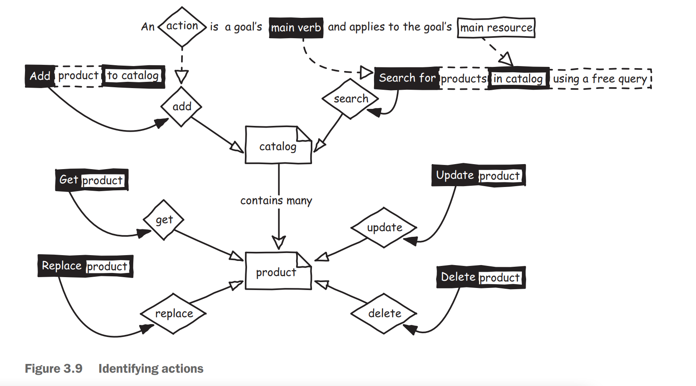

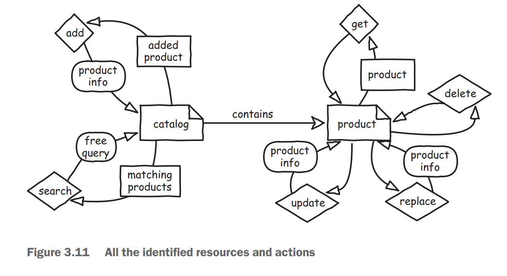

#### Resource path best practices
* Use all lowercase, hyphenated endpoints such as /api/verification-tokens. This increases URL "hackability", which is the ability to manually go in and modify the URL by hand. You can pick any naming scheme you like, as long as you're consistent about it. 
* Use a noun or two to describe the resource, such as users, products, or verification-tokens.
* Always describe resources in plural: /api/users rather than /api/user. This makes the API more semantic. 
	- Collection resource: /users
	- Instance resource: /users/007

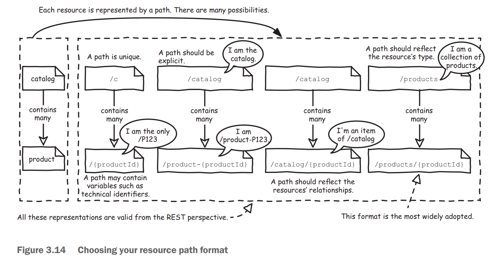

#### Http verb best practices
* Use HTTP verbs for CRUD operations (Create/Read/Update/Delete).

| Verb   | Endpoint              | Description                                                            | 
|--------|-----------------------|------------------------------------------------------------------------| 
| GET    | /products             | Gets a list of products                                                | 
| GET    | /products/:id         | Gets a single product by ID                                            | 
| GET    | /products/:id/parts   | Gets a list of parts in a single product                               | 
| PUT    | /products/:id/parts   | Inserts a new part for a particular product                            | 
| DELETE | /products/:id         | Deletes a single product by ID                                         | 
| POST   | /products             | Inserts a new product                                                  | 
| HEAD   | /products/:id         | Returns whether the product exists through a status code of 200 or 404 | 
| PATCH  | /products/:id         | Edits an existing product by ID                                        | 
| POST   | /authentication/login | Most other API methods should use POST requests                        | 

* Beyond CRUD: Http verbs could be used more than Create, Read, Update and Delete operations. 

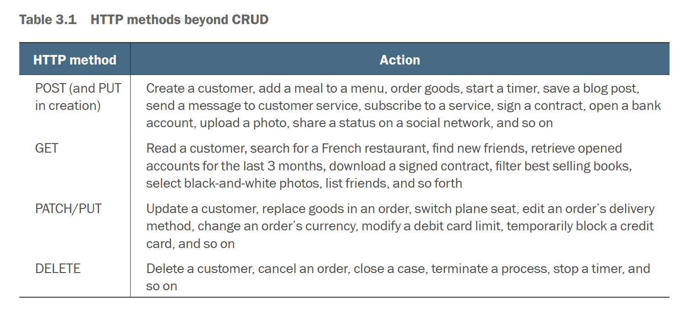

* Updates & creation should return a resource representation
	+ A PUT, POST or PATCH call may make modifications to fields of the underlying resource that weren't part of the provided parameters (for example: created_at or updated_at timestamps). To prevent an API consumer from having to hit the API again for an updated representation, have the API return the updated (or created) representation as part of the response.
	+ In case of a POST that resulted in a creation, use a HTTP 201 status code and include a Location header that points to the URL of the new resource.

### Design API's data

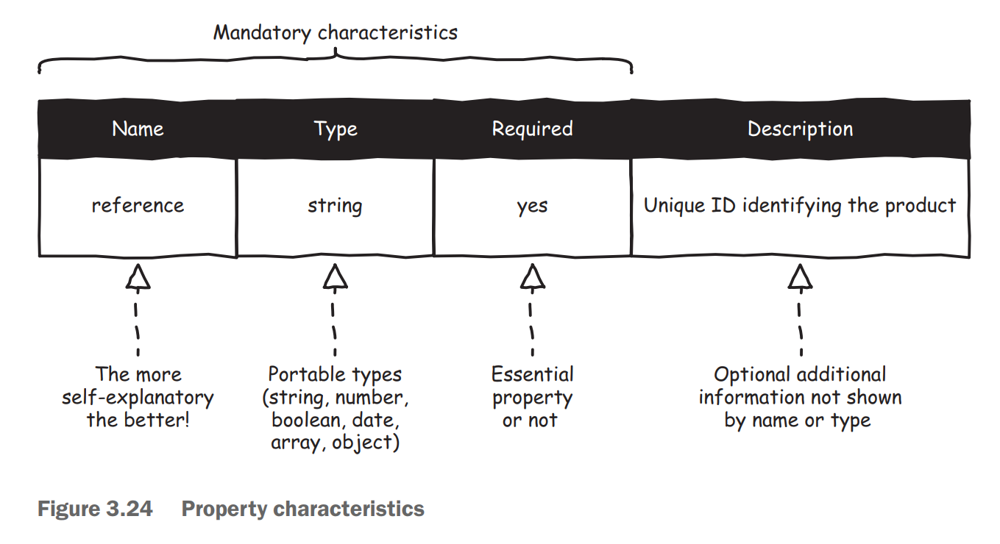


### Evolving an API
#### Avoid breaking changes for output data

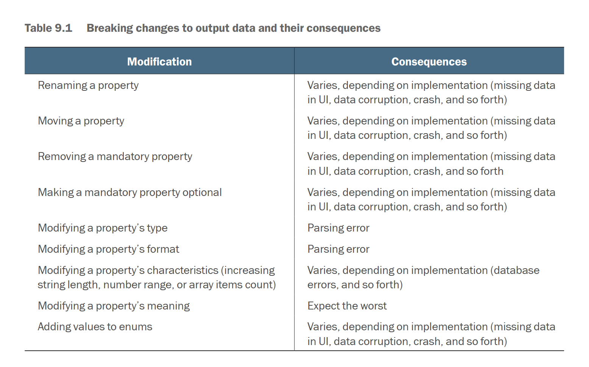

#### Avoid breakig changes for input data

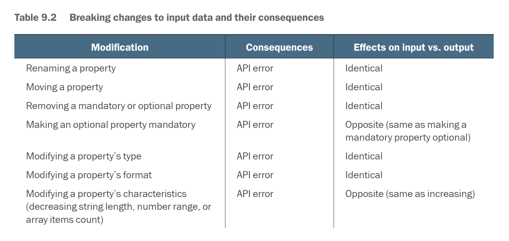

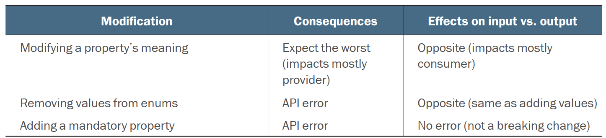

#### Avoid breaking changes for success and error handling

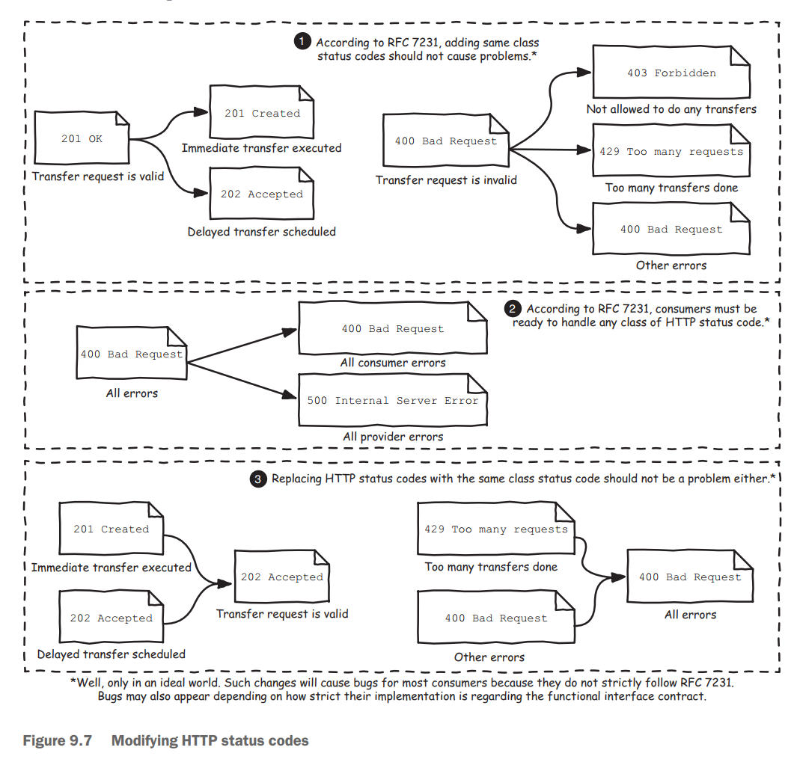

#### Avoid breaking changes for security

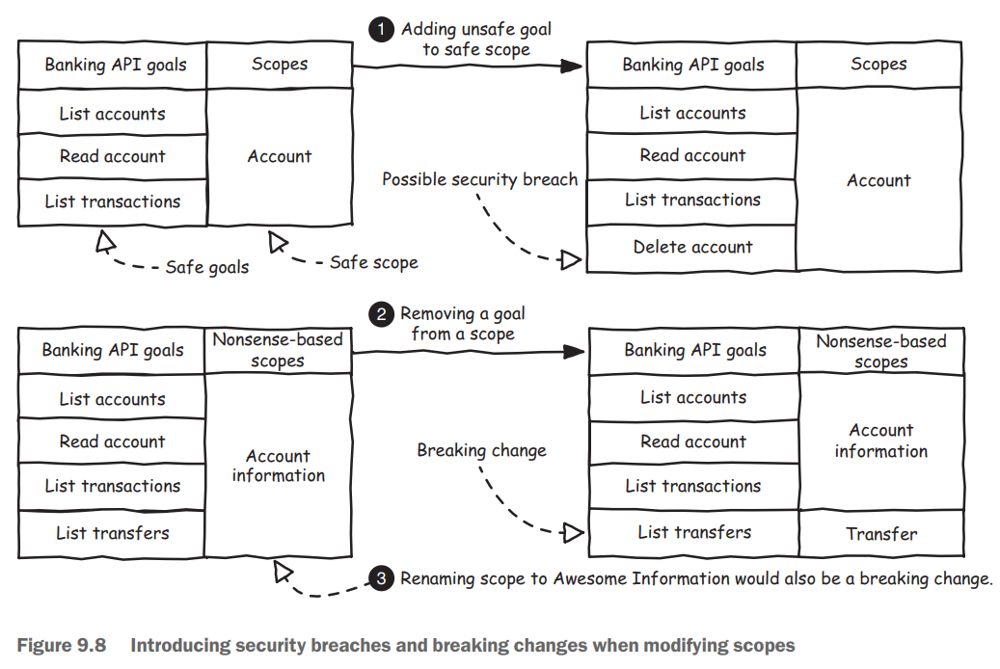

#### Versioning
##### Semantic versioning
* https://semver.org/


##### Ways to implement version
* The best way to implement version will be domain name or path

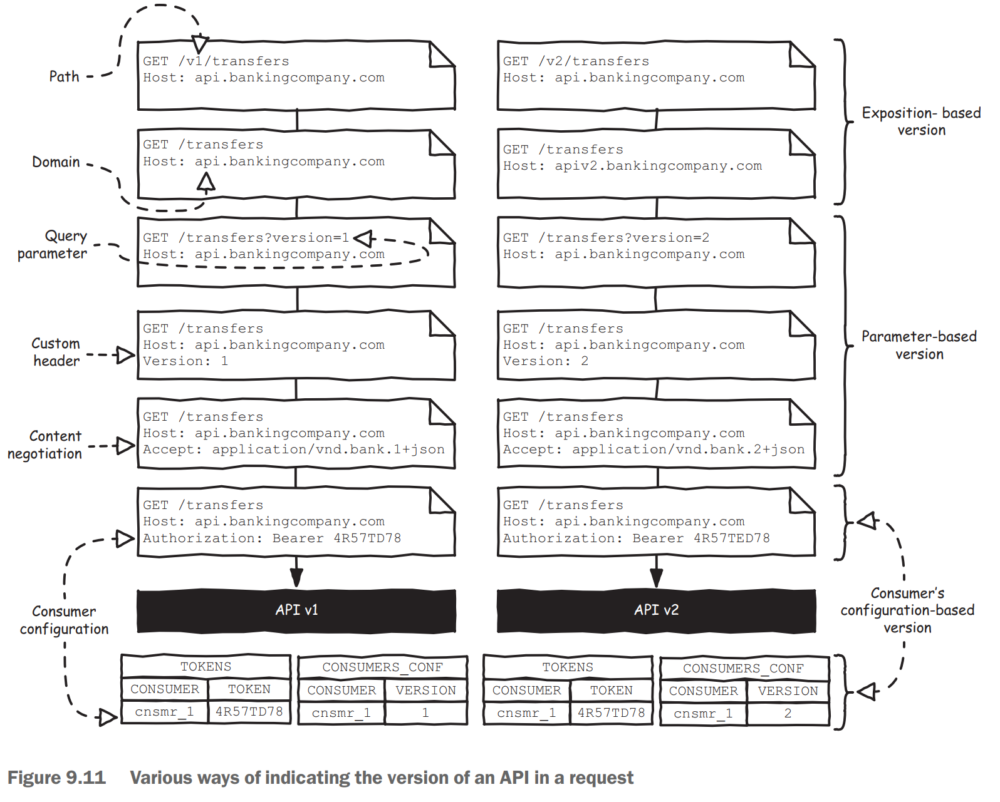

##### Versioning granularity

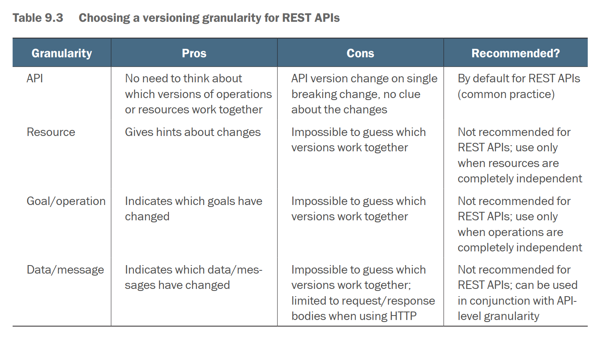

### Idempotency
#### Scenario 
* Network problems or repeated operations: For example, the point praise function, a user can only point praise once for the same piece of article, repeated point praise prompt has already point praise.
* Third party callbacks: Our system often needs to deal with third party systems, such as WeChat recharge and Alipay recharge, WeChat and Alipay will often notify you to pay the result by callback your interface. In order to ensure that you receive callbacks, it is often possible to make multiple callbacks.

#### Http idempotency
* Safe vs Idempotent Methods
  * Safe methods: HTTP methods that do not modify resources. 
  * Idempotent methods: HTTP methods that can be called many times without different outcomes. 

| HTTP METHOD  |  USE CASE | IDEMPOTENCE  |  SAFETY  |
|---|---|---|---|
| GET  | Get resources, no side effect | YES  | YES  |
| HEAD  | Same as GET except no response body | YES | YES  |
| OPTIONS | Used to get the HTTP Methods supported by the URL | YES  | YES  |
| TRACE  | performs a message loop-back test to the target resource | YES  | YES  |
| POST  | Create new resources. e.g. POST http://www.forum.com/articles | NO  | NO  |
| PATCH  | Partially update a resource | NO  | NO  |
| PUT  | Completely update a resource | YES | NO  |
| DELETE | Delete a resource | YES  | NO |

* Why PUT Idempotent and PATCH not
  * It's because it matters how you apply your changes. If you'd like to change the name property of a resource, you might send something like {"name": "foo"} as a payload and that would indeed be idempotent since executing this request any number of times would yield the same result: The resources name attribute is now "foo".
  * But PATCH is much more general in how you can change a resource (check this definition on how to apply a JSON patch). It could also, for example, mean to move the resource and would look something like this: { "op": "move", "from": "/a/b/c", "path": "/a/b/d" }. This operation is obviously not idempotent since calling at a second time would result in an error.
  * So while most PATCH operations might be idempotent, there are some that aren't.

* Why DELETE is Idempotent
  * "Methods can also have the property of "idempotence" in that (aside from error or expiration issues) the side-effects of N > 0 identical requests is the same as for a single request. The methods GET, HEAD, PUT and DELETE share this property. Also, the methods OPTIONS and TRACE SHOULD NOT have side effects, and so are inherently idempotent. "
  * The key bit there is the side-effects of N > 0 identical requests is the same as for a single request.
  * You would be correct to expect that the status code would be different but this does not affect the core concept of idempotency - you can send the request more than once without additional changes to the state of the server.

#### Database idempotency
* Idempotency could be implemented in different layers of the service architecture. 


* Scenario: Operation retry

##### Create/Insert
- Example: Insert user values (uid, name, age, sex, ts) where uid is the primary key
- Needs a little work to guarantee idempotence: If the primary key is generated using DB auto-increment id, then it is not idempotent. The primary key should rely on id which is related with business logic. 

##### Read/Select
- Idempotent

* Update
  - Example (Update to absolute value): Update user set age = 18 where uid = 58. 
  	- Suffers from ABA problem in multi-thread environment
  		1. current age = 17
  		2. operation A: set age = 18
  		3. operation B: set age = 19
  		4. operation A: set age = 18		
  	- Needs optimistic concurrency control (version number) to guarantee idempotence
  		1. current age = 17
  		2. operation A: set age = 19, v++ where v = 1; 
  		3. Operation B: set age = 18, v++ where v = 1;
  - Example (Update to relative value): Update user set age++ where uid = 58
  	- Convert to absolute example

##### Delete
- Idempotent

##### Avoid replica databases
* See the section within reference: https://medium.com/airbnb-engineering/avoiding-double-payments-in-a-distributed-payments-system-2981f6b070bb

##### Unique constraint within DB
* Reference: https://www.bennadel.com/blog/3390-considering-strategies-for-idempotency-without-distributed-locking-with-ben-darfler.htm

#### Idempotency within business layer of distributed applications
* Distributed lock
  * Scenario: Request only once within a short time window. e.g. User click accidently twice on the order button.
  * Please see [Distributed lock](distributedLock.md)

#### Generate the idempotency key
##### Where
* Layers of architecture: App => Nginx => Network gateway => Business logic => Data access layer => DB / Cache
* Idempotency considerations should reside within data access layer, where CRUD operations happen.
	- The idempotency key could not be generated within app layer due to security reasons
	- The process is similar to OAuth
		1. Step1: App layer generates a code
		2. Step2: App talks to business layer with the generated code to get an idempotency key
		3. Step3: The generated idempotency keys are all stored within an external data store. Busines layer check the external data store with mapping from code => idempotency key
			+ If exist, directly return the idempotency key
			+ Otherwise, generate a new idempotency key, store it within external store and return the generated idempotency key. 
	- An optimization on the process above: Don't always need to check the external data store because repeated requests are minorities. Could rely on DB optimistic concurrency control for it instead of checking every time. For example, below queries will only be executed when there is no conflicts.
		1. insert into … values … on DUPLICATE KEY UPDATE …
		2. update table set status = “paid” where id = xxx and status = “unpaid”;

##### How
* Request level idempotency: A random and unique key should be chosen from the client in order to ensure idempotency for the entire entity collection level. For example, if we wanted to allow multiple, different payments for a reservation booking (such as Pay Less Upfront), we just need to make sure the idempotency keys are different. UUID is a good example format to use for this.
* Entity level idempotency: Say we want to ensure that a given $10 payment with ID 1234 would only be refunded $5 once, since we can technically make $5 refund requests twice. We would then want to use a deterministic idempotency key based on the entity model to ensure entity-level idempotency. An example format would be “payment-1234-refund”. Every refund request for a unique payment would consequently be idempotent at the entity-level (Payment 1234).

##### Approaches
* Please see [this](https://github.com/DreamOfTheRedChamber/system-design/blob/master/uniqueIDGenerator.md) for details


### Efficiency
#### Persistent connections
* A significant difference between HTTP/1.1 and earlier versions of HTTP is that persistent connections are the default behavior of any HTTP connection. That is, unless otherwise indicated, the client SHOULD assume that the server will maintain a persistent connection, even after error responses from the server.
* https://www.w3.org/Protocols/rfc2616/rfc2616-sec8.html

#### Compression
##### Whether response should be compressed?
* Content-Encoding header  If the response is not already encoded, it will be considered for compression. If the response is already encoded, no further attempts are made to encode the body. 
* Content-Length header  If the body of the response is 2048 bytes or larger, it can be compressed. If it is smaller than 2048 bytes, it is too small to benefit from compression and no attempt will be made to compress it. 
* Content-Type header  If the type of content in the response body is in the list of types configured in the Open Liberty server as being valid candidates for compression, it can be compressed. Otherwise, no attempt will be made to compress it.

##### End-to-End compression
* Content negotiation algorithm
* Reference: https://developer.mozilla.org/en-US/docs/Web/HTTP/Compression

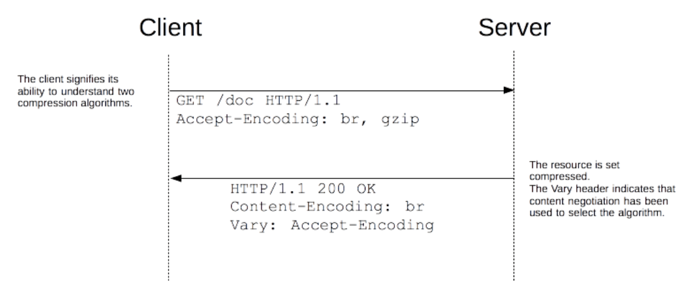

### Cache API response
* REST API cache could reuse the functionality of HTTP Cache headers. 

#### Cache-Control headers
The Cache-Control header determines whether a response is cacheable, by whom, and for how long. 

##### Decision tree
* [Decision tree](https://github.com/NeilMadden/cache-control-flowchart) for determining what Cache-Control header to use. 


* There are some other charts useful for what should be done related with cache control headers. (In Chinese so not attach inline here)
	- [What proxy/server should do about caching when get a response](./images/cacheControlHeaders-server.png)
	- [What client should do about a request](./images/cacheControlHeaders-client.png)

##### Sample flow
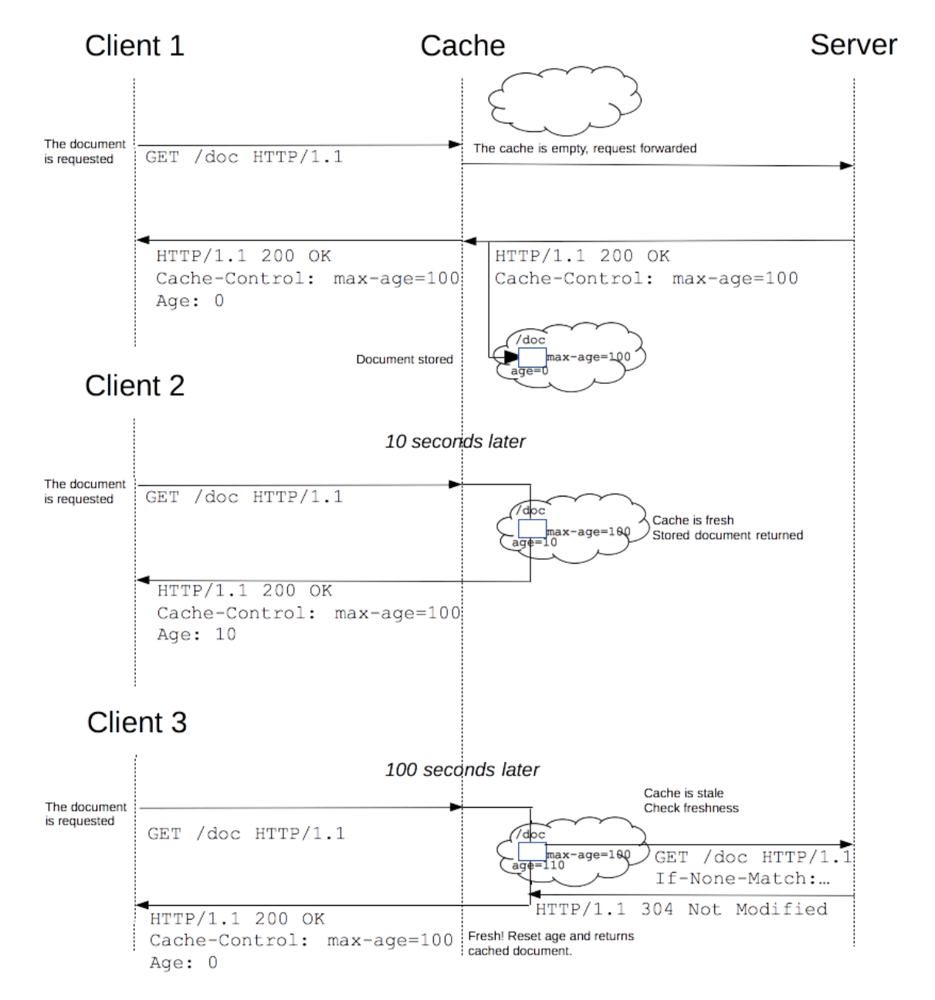

##### Cache-Control vs Expire header
* Comparison with Cache-Control header: Cache-Control was introduced in HTTP/1.1 and offers more options than Expires. They can be used to accomplish the same thing but the data value for Expires is an HTTP date whereas Cache-Control max-age lets you specify a relative amount of time so you could specify "X hours after the page was requested".

* HTML Cache control is a very similar question and has a good link to a caching tutorial that should answer most of your questions (e.g., http://www.mnot.net/cache_docs/#EXPIRES). To sum up though, Expires is recommended for static resources like images and Cache-Control when you need more control over how caching is done.


##### Whether a response is cacheable
* public: indicates that the response may be cached, even if it would normally be non-cacheable. Both intermediaries and local could cache it.
* private: indicates that the response may be cached by local (typically browser) caches only. Intermediaries (such as nginx, other caching layers like Varnish, and all kinds of hardware in between) are not allowed to cache it.
* no-cache: A cache will send the request to the origin server for validation before releasing a cached copy.
* no-store: Cache should not store anything about the client request or server response. A request is sent to the server and a full response is downloaded each and every time.

```
Cache-Control: no-store
Cache-Control: no-cache
Cache-Control: private
Cache-Control: public
```

##### Set the expiration time of the header
* max-age: gives a time to live of the resource in seconds, after which any local and shared caches must revalidate the response.
* s-maxage: gives a time to live of the resource in seconds, after which any shared caches must revalidate the response.

```
Cache-Control: max-age=31536000
```

##### When a response must be revalidated
* must-revalidate: indicates a normally uncacheable response is cacheable, but requires a cache to revalidate stale responses before using a cached response. This forces revalidation requests to travel all the way to the origin server, but an efficient validation mechanism on the server will prevent complex service logic from being invoked on each request.
* proxy-revalidate: similar to must-revalidate, but applied only to shared caches.
* stale-while-revalidate: allows a cache to serve a stale response while a revalidation happens in the background. This directive favors reduced latency over consistency of data by allowing a cache to serve stale data while a non-blocking request to revalidate happens in the background.
* stale-if-error: allows a cache to serve a stale response if there is an error during revalidation. This directive favors availability over consistency by allowing a cache to return stale data during origin server failure.

```
Cache-Control: must-revalidate
```

#### Conditional Get with validation
* To revalidate a response with the origin server, a cache uses the value in the Validator headers (Etag or Last-Modified) to do a conditional GET.

* ETag: An Etag, or entity tag, is an opaque token that the server associates with a particular state of a resource. Whenever the resource state changes, the entity tag should be changed accordingly.
* Last-modified: The Last-Modified header indicates the last point in time when the resource was changed.

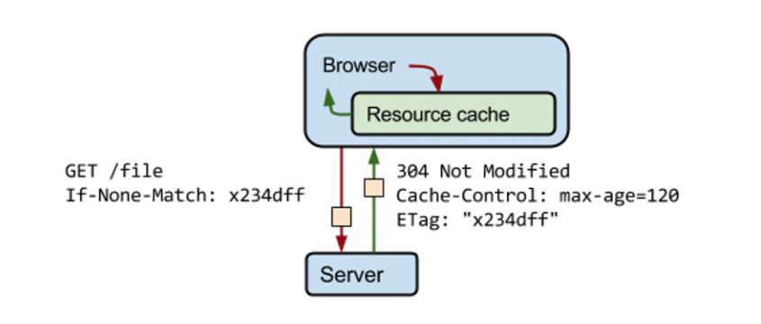

##### Last-Modified/If-Modified-Since/Max-age
* Specifying a Last-Modified header in your response. It's best to specify a max-age in the Cache-Control header, to let the browser invalidate the cache after a certain period of time even if the modification date doesn't change

```
Cache-Control: private, max-age=86400
Last-Modified: Thu, 3 Jul 2014 18:31:12 GMT
```

* The next time the browser requests this resource, it will only ask for the contents of the resource if they're unchanged since this date, using the If-Modified-Since request header. If the resource hasn't changed since Thu, 3 Jul 2014 18:31:12 GMT, the server will return with an empty body with the 304 Not Modified status code.

```
If-Modified-Since: Thu, 3 Jul 2014 18:31:12 GMT
```

##### ETag
* ETag header is usually a hash that represents the source in its current state. This allows the server to identify if the cached contents of the resource are different than the most recent versions:

```
Cache-Control: private, max-age=86400
ETag: "d5jiodjiojiojo"
```


* On subsequent requests, the If-None-Match request header is sent with the ETag value of the last requested version for the same resource. If the current version has the same ETag value, your current version is what the client has cached and a 304 Not Modified response will be returned. 

```
If-None-Match: "d5jiodjiojiojo"	
```

* If-Match: Succeeds if the ETag of the distant resource is equal to one listed in this header. By default, unless the etag is prefixed with 'W/', it performs a strong validation.
* If-None-Match: Succeeds if the ETag of the distant resource is different to each listed in this header. By default, unless the etag is prefixed with 'W/', it performs a strong validation.
* If-Modified-Since: Succeeds if the Last-Modified date of the distant resource is more recent than the one given in this header.
* If-Unmodified-Since: Succeeds if the Last-Modified date of the distant resource is older or the same than the one given in this header.
* If-Range: Similar to If-Match, or If-Unmodified-Since, but can have only one single etag, or one date. If it fails, the range request fails, and instead of a 206 Partial Content response, a 200 OK is sent with the complete resource.

#### Vary header
* The Vary HTTP response header determines how to match future request headers to decide whether a cached response can be used, or if a fresh one must be requested from the origin server.
* When a cache receives a request that has a Vary header field, it must not use a cached response by default unless all header fields specified in the Vary header match in both the original (cached) request and the new request.
* References: https://developer.mozilla.org/en-US/docs/Web/HTTP/Caching

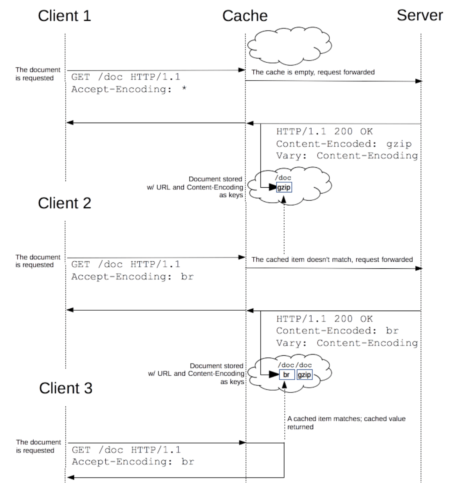

### Pagination for collections
#### Naive impl with Offsets and Limits
* Motivation: Most relational database supports Offset and Limits, it is tempting to carry forward that in an API as a way of exposing a window before a list of resources. For example, https://example.org/chatRooms/5/messages?offset=30&limit=10

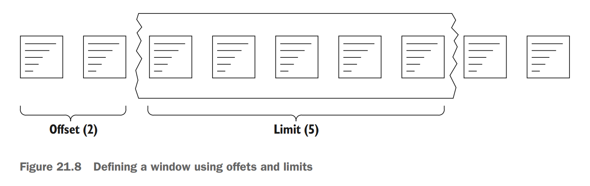

##### Metadata
* Total count: Include enough metadata so that clients can calculate how much data there is, and how and whether to fetch the next set of results. 

```json
// Metadata: Total count
{
  "results": [ ... actual results ... ],
  "pagination": {
    "count": 2340,
    "offset": 4,
    "limit": 20
  }
}

// Metadata: Link header
```

* Link header: The pagination info is included in the Link header. It is important to follow these Link header values instead of constructing your own URLs. In some instances, such as in the Commits API, pagination is based on SHA1 and not on page number.

```bash
 Link: <https://api.github.com/user/repos?page=3&per_page=100>; rel="next",
   <https://api.github.com/user/repos?page=50&per_page=100>; rel="last"
```

##### Cons
* **Expose internal implementation details**: The fundamental problem with this pattern is that it leaks the implementation details to the API, so this API must continue to support offsets and limits regardless of the underlying storage system. This may not seem like a big deal now, but as storage systems become more complex, implementations using limits and offsets may not always work. For example, if your data is stored in an eventually consistent distributed system, finding the starting point of an offset might actually become more and more expensive as the offset value increases.
* **Consistency**: This pattern also suffers from problems related to consistency. In this example, if some new results are added, they may cause the response to return results that were already seen in a previous page

#### Improved impl with maxPageSize + nextPageToken

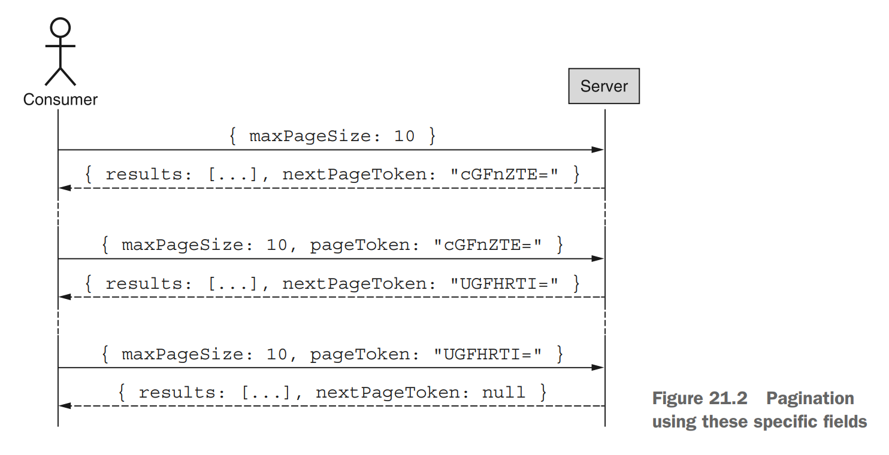

##### MaxPageSize
* max vs exact page size? 
  * In most cases an API server might always be able to return an exact number of results; however, in many larger-scale systems this simply won’t be possible without paying a significant cost premium
  * In cases where there are a large number of records but the matching records are separated by some unmatched records, there will be huge waiting time before the second matching could be found. It will be a better idea to return all results found after a cut-off time instead of waiting all results to be returned. 

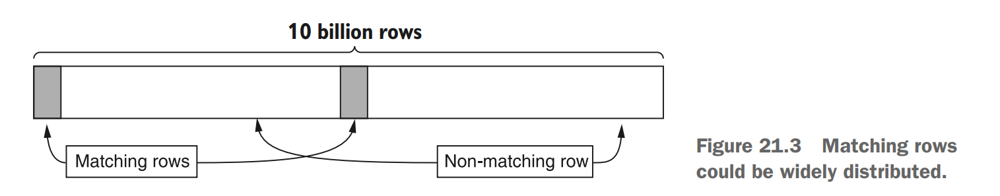

##### PageToken
* Def: A cursor for server on how to pick up where it left off when iterating through a list of results. 
* Opaque identifier to clients: Regardless of what you put into your page token, the structure, format, or meaning of the token should be completely hidden from the consumer. This is to avoid exposing internal implementation details to client. The most common format is to use a Base64-encoded encrypted value passed around as a UTF-8 serialized string. 
* As termination criteria: In many systems we tend to assume that once we get a page of results that isn’t full we’re at the end of the list. Unfortunately, that assumption doesn’t work with our page size definition since page sizes are maximum rather than exact.

##### Total count
* It does not need to be super accurate if the number of records is large. 

#### Consistency problem
* Problem

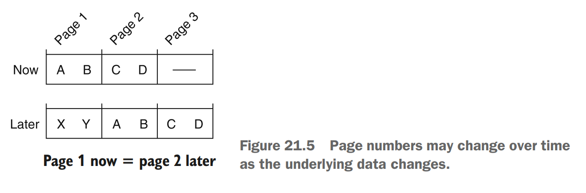

* Solution:
  * If the DB supports snapshot, then strong consistency could be guaranteed during pagination. 
  * No simple answer to this question. 

### Filtering for collections
* Provide filtering, sorting, field selection for collections
	- Filtering: Use a unique query parameter for all fields or a query language for filtering.
		+ GET /cars?color=red Returns a list of red cars
		+ GET /cars?seats<=2 Returns a list of cars with a maximum of 2 seats
	- Sorting: Allow ascending and descending sorting over multiple fields
		+ GET /cars?sort=-manufactorer,+model. This returns a list of cars sorted by descending manufacturers and ascending models.
	- Field selection: Mobile clients display just a few attributes in a list. They don’t need all attributes of a resource. Give the API consumer the ability to choose returned fields. This will also reduce the network traffic and speed up the usage of the API.
	 	+ GET /cars?fields=manufacturer,model,id,color

### Batch and bulk operations
* https://tyk.io/api-design-guidance-bulk-and-batch-import/
* Google Drive's batch / bulk operations: https://developers.google.com/drive/api/v3/batch

```
// Bulk import
// Request
POST /accounts/bulk-import
Content-Type: application/json-seq

{ "id":"12", "name":"...", ... }
{ "id":"13", "name":"...", ... }
{ "id":"14", "name":"...", ... }
{ "id":"15", "name":null, ... }

// Response
HTTP/1.1 207 Multi-Status
Content-Type: application/json

{
    "items": [
        { "id": "12", "status": 201, errors: [] },
        { "id": "13", "status": 201, errors: [] },
        { "id": "14", "status": 201, errors: [] },
        { "id": "15", "status": 400, errors: [ ... ] }
    ]
}


// Batch import
// Request
POST /accounts/batch-import
Content-Type: application/json-seq

{ "id":"12", "name":"...", ... }
{ "id":"13", "name":"...", ... }
{ "id":"14", "name":"...", ... }
{ "id":"15", "name":null, ... }

// Response
HTTP/1.1 400 Bad Request
Content-Type: application/json

{
    "items": [
        { "id": "12", "status": 200, errors: [] },
        { "id": "13", "status": 200, errors: [] },
        { "id": "14", "status": 200, errors: [] },
        { "id": "15", "status": 400, errors: [ ... ] }
    ]
}
```

### Security

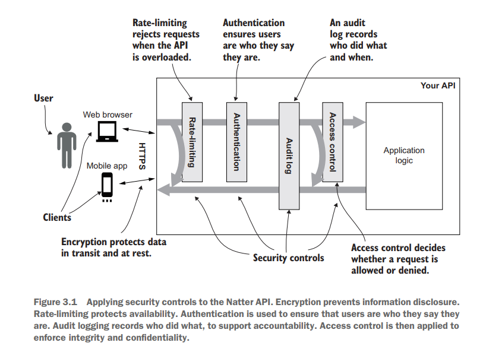

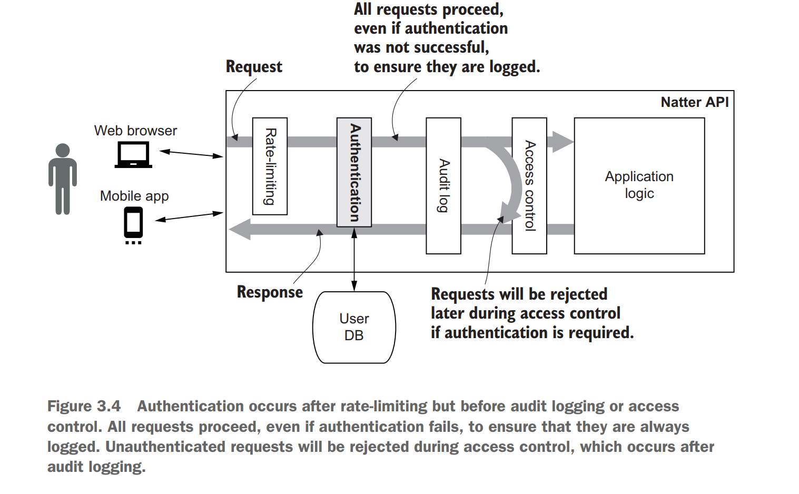

#### Rate-limiting
* Please see [Rate limiter design](https://github.com/DreamOfTheRedChamber/system-design-interviews/blob/master/Scenario_RateLimiter.md)

#### Authentication / Audit log / Access control
* Please see [MicroSvcs security](https://github.com/DreamOfTheRedChamber/system-design-interviews/blob/master/MicroSvcs_Security.md)

## RPC 
### When compared with REST (using gRPC as example)

|   |  `REST` |  `gRPC` |
|---|---|---|
| Definition  | REST is an [architecture style](https://www.restapitutorial.com/lessons/whatisrest.html). It exposes data as resources and CRUD operations could be used to access resources. HTTP is an implement conforming to REST styles | Make the process of executing code on a remote machine as simple and straight-forward as calling a local functions. There are many types of RPC. RPC usually exposes action-based API methods. gRPC is a multi |
| Serilization protocol | readablee text(XML, JSon) | Use ProtoBuf by default |
| Transmission protocol | Typically on HTTP1.1 | HTTP 2.0 which supports streaming communication and bidirectional support. |
| API contract | Loose, Optional (Open API) | Strict, required (.proto) |
| User friendly | Easy to debug because request/response are readable | Hard to debug because request/response are not readable |
| Browser support | Universal browser support. | Limited browser support. gRPC requires gRPC-web and a proxy layer to perform conversions between HTTP 1.1 and HTTP 2.| 
| Code generation support  | Developers must use a third-party tool like Swagger or Postman to produce code for API requests. |  gRPC has native code generation features. |
| HTTP verbs | REST will use HTTP methods such as GET, POST, PUT, DELETE, OPTIONS and, hopefully, PATCH to provide semantic meaning for the intention of the action being taken.  | RPC uses only GET and POST, with GET being used to fetch information and POST being used for everything else.  |
| Examples  | SpringMVC/Boot, Jax-rs, drop wizard | Dubbo, Motan, Tars, gRPC, Thrift  |
| Use case | Cross-language platform, public and private facing scenarios | Cross-language platform, public scenarios |

### Design
* https://time.geekbang.org/column/article/15092

#### Overview
* The steps are as follows:
	1. Programmer writes an interface description in the IDL (Mechanism to pass procedure parameters and return values in a machine-independent way)
	2. Programmer then runs an IDL compiler which generates
		+ Code to marshal native data types into machien independent byte streams
		+ Client/server stub: Forwards local procedure call as request to server / Dispatches RPC to its implementation

#### Interface definition language

```
// An example of an interface for generating stubs
service FacebookService {
  // Returns a descriptive name of the service
  string getName(),

  // Returns the version of the service
  string getVersion(),
    
  // Gets an option
  string getOption(1: string key),

  // Gets all options
  map<string, string> getOptions()
}
```

#### Marshal/Unmarshal
* Challenges: For a remote procedure call, a remote machine may:
	- Different sizes of integers and other types
	- Different byte ordering
	- Different floating point representations
	- Different character sets
	- Different alignment requirements

* Challenges: Reference variables
	- What we pass is the value of the pointer, instead of the pointer itself. A local pointer, pointing to this value is created on the server side (Copy-in). When the server procedure returns, the modified 'value' is returned, and is copied back to the address from where it was taken (Copy-out).

	- This approach is not foolproof. The procedure 'myfunction()' resides on the server machine. If the program executes on a single machine then we must expect the output to be '4'. But when run in the client-server model we get '3'. Why ? Because 'x, and 'y' point to different memory locations with the same value. Each then increments its own copy and the incremented value is returned. Thus '3' is passed back and not '4'.

```
#include <studio.h>

void myfunction(int *x, int *y)
{
	*x += 1;
	*y += 1;
}

```

#### Server processing model
* BIO: Server creates a new thread to handle to handle each new coming request. 
	- Applicable for scenarios where there are not too many concurrent connections
* NIO: The server uses IO multiplexing to process new coming request.
	- Applicable for scenarios where there are many concurrent connections and the request processing is lightweight. 
* AIO: The client initiates an IO operation and immediately returns. The server will notify the client when the processing is done. 
	- Applicable for scenarios where there are many concurrent connections and the request processing is heavyweight. 
* Reactor model: A main thread is responsible for all request connection operation. Then working threads will process further jobs.

#### Binding
* Binding: How does the client know who to call, and where the service resides?
	- The most flexible solution is to use dynamic binding and find the server at run time when the RPC is first made. The first time the client stub is invoked, it contacts a name server to determine the transport address at which the server resides.

* Where to locate host and correct server process
	- Solution1: Maintain a centralized DB that can locate a host that provides a particular service
		1. Challenge: Who administers this
		2. Challenge: What is the scope of administration
		3. Challenge: What if the same services run on different machines 
	- Solution2: A server on each host maintains a DB of locally provided services
	- Please see [Service discovery](./servicediscoverycenter.md)

#### Transport protocol
* If performance is preferred, then UDP protocol should be adopted. 
* If reliability is needed, then TCP protocol should be adopted. 
	- If the connection is a service to service, then long connection is preferred than short connection. 

#### Serialization protocol
* Factors to consider:
	- Support data types: Some serialization framework such as Hessian 2.0 even support complicated data structures such as Map and List. 
	- Cross-language support
	- Performance: The compression rate and the speed for serialization. 

#### Semantics of RPC
##### At least once
* Def: For every request message that the client sends, at least one copy of that message is delivered to the server. The client stub keeps retrying until it gets an ack. This is applicable for idempotent operations.

##### Exactly once
* Def: For every request message that the client sends, exactly one copy of that message is delivered to the server.
* But this goal is extremely hard to build. For example, in case of a server crash, the server stub call and server business logic could happen not in an atomic manner. 

##### At most once
* Def: For every request message that the client sends, at most one copy of that message is delivered to the server.

###### Designs
1. How to detect a duplicate request?
	- Client includes unique transaction ID with each one of its RPC requests
	- Client uses the same xid for retransmitted requests
2. How to avoid false detection?
	- One of the recurrent challenges in RPC is dealing with unexpected responses, and we see this with message IDs. For example, consider the following pathological (but realistic) situation. A client machine sends a request message with a message ID of 0, then crashes and reboots, and then sends an unrelated request message, also with a message ID of 0. The server may not have been aware that the client crashed and rebooted and, upon seeing a request message with a message ID of 0, acknowledges it and discards it as a duplicate. The client never gets a response to the request.
	- One way to eliminate this problem is to use a boot ID. A machine’s boot ID is a number that is incremented each time the machine reboots; this number is read from nonvolatile storage (e.g., a disk or flash drive), incremented, and written back to the storage device during the machine’s start-up procedure. This number is then put in every message sent by that host. If a message is received with an old message ID but a new boot ID, it is recognized as a new message. In effect, the message ID and boot ID combine to form a unique ID for each transaction.
3. How to ensure that the xid is unique?
	- Combine a unique client ID (e.g. IP address) with the current time of the day
	- Combine a unique client ID with a sequence number
	- Combine a unique client ID with a boot ID
	- Big random number
4. seen and old arrays will grow without bound
	- Client could tell server "I'm done with xid x - delete it".
	- Client includes "seen all replies <= X" with every RPC
5. Server may crash and restart
	- If old[], seen[] tables are only in meory, then the user needs to retry


```
if seen[xid]:
	retval = old[xid]
else:
	retval = handler()
	old[xid] = retval
	seen[xid] = true
return retval
```

##### Last of many
* Last of many : This a version of 'At least once', where the client stub uses a different transaction identifier in each retransmission. Now the result returned is guaranteed to be the result of the final operation, not the earlier ones. So it will be possible for the client stub to tell which reply belongs to which request and thus filter out all but the last one.


### Choose RPC framework
* TODO: Choose RPC framework:
  * https://time.geekbang.org/column/article/39809
* [TODO: REST vs XML vs IDL](https://time.geekbang.org/column/article/14425)

#### Cross language RPC: gRPC vs Thrift
* gRPC uses HTTP/2, serialization uses ProtoBuf
* Thrift support multiple modes:
	- Serialization: Binary, compact, Json, multiplexed
	- Transmission: Socket, Framed, File, Memory
	- Server processing model: Simple, Thread Pool, Non-blocking

#### Same language RPC: Tars vs Dubbo vs Motan vs Spring Cloud
* C++: Tars
* Java: 
	+ Spring cloud provides many other functionalities such as service registration, load balancing, circuit breaker. 
		- HTTP protocol
	+ Motan/Dubbo is only RPC protocol

### gRPC

#### Protobuf

#### HTTP 1.1 vs HTTP 2
* REST APIs follow a request-response model of communication that is typically built on HTTP 1.1. Unfortunately, this implies that if a microservice receives multiple requests from multiple clients, the model has to handle each request at a time, which consequently slows the entire system. However, REST APIs can also be built on HTTP 2, but the request-response model of communication remains the same, which forbids REST APIs to make the most out of the HTTP 2 advantages, such as streaming communication and bidirectional support.

* gRPC does not face a similar obstacle. It is built on HTTP 2 and instead follows a client-response communication model. These conditions support bidirectional communication and streaming communication due to gRPC's ability to receive multiple requests from several clients and handle those requests simultaneously by constantly streaming information. Plus, gRPC can also handle "unary" interactions like the ones built on HTTP 1.1.

* In sum, gRPC is able to handle unary interactions and different types of streaming:
  * Unary: when the client sends a single request and receives a single response.
  * Server-streaming: when the server responds with a stream of messages to a client's request. Once all the data is sent, the server additionally delivers a status message to complete the process.
  * Client-streaming: when the client sends a stream of messages and in turn receives a single response message from the server.
  * Bidirectional-streaming: the two streams (client and server) are independent, meaning that they both can transmit messages in any order. The client is the one who initiates and ends the bidirectional streaming.

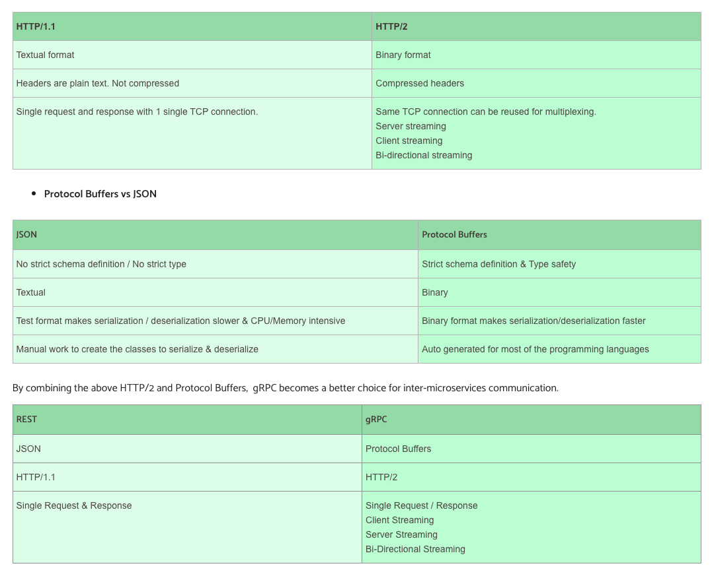

#### gRPC use cases
* As mentioned, despite the many advantages gRPC offers, it has one major obstacle: low browser compatibility. Consequently, gRPC is a bit limited to internal/private systems.

* Contrarily, REST APIs may have their disadvantages, as we have discussed, but they remain the most known APIs for connecting microservices-based systems. Plus, REST follows the HTTP protocol standardization and offers universal support, making this API architectural style a top option for web services development as well as app and microservices integrations. However, this does not mean we should neglect gRPC's applications.

* gRPC architectural style has promising features that can (and should) be explored. It is an excellent option for working with multi-language systems, real-time streaming, and for instance, when operating an IoT system that requires light-weight message transmission such as the serialized Protobuf messages allow. Moreover, gRPC should also be considered for mobile applications since they do not need a browser and can benefit from smaller messages, preserving mobiles' processors' speed.

#### References
* https://www.imaginarycloud.com/blog/grpc-vs-rest/


#### History
* The biggest differences between gRPC and SunRPC/DCE-RPC/RMI is that gRPC is designed for cloud services rather than the simpler client/server paradigm. In the client/server world, one server process is presumed to be enough to serve calls from all the client processes that might call it. With cloud services, the client invokes a method on a service, which in order to support calls from arbitrarily many clients at the same time, is implemented by a scalable number of server processes, each potentially running on a different server machine.
* The caller identifies the service it wants to invoke, and a load balancer directs that invocation to one of the many available server processes (containers) that implement that service


#### Features
##### Multi-language, multi-platform framework
* Native implementations in C, Java, and Go
* Platforms supported: Linux, Android, iOS, MacOS, Windows

##### Transport over HTTP/2 + TLS
* First, gRPC runs on top of TCP instead of UDP, which means it outsources the problems of connection management and reliably transmitting request and reply messages of arbitrary size. 
* Second, gRPC actually runs on top of a secured version of TCP called Transport Layer Security (TLS)—a thin layer that sits above TCP in the protocol stack—which means it outsources responsibility for securing the communication channel so adversaries can’t eavesdrop or hijack the message exchange. 
* Third, gRPC actually, actually runs on top of HTTP/2 (which is itself layered on top of TCP and TLS), meaning gRPC outsources yet two other problems: 
	- Binary framing and compression: Efficiently encoding/compressing binary data into a message.
	- Multiplexing: Requests by introducing concept of streams.
		- HTTP: The client could send a single request message and the server responds with a single reply message.
		- HTTP 1.1: The client could send multiple requests without waiting for the response. However, the server is still required to send the responses in the order of incoming requests. So Http 1.1 remained a FIFO queue and suffered from requests getting blocked on high latency requests in the front [Head-of-line blocking](https://en.wikipedia.org/wiki/Head-of-line_blocking)
		- HTTP2 introduces fully asynchronous, multiplexing of requests by introducing concept of streams. lient and servers can both initiate multiple streams on a single underlying TCP connection. Yes, even the server can initiate a stream for transferring data which it anticipates will be required by the client. For e.g. when client request a web page, in addition to sending theHTML content the server can initiate a separate stream to transfer images or videos, that it knows will be required to render the full page. 

##### C/C++ implementation goals
* High throughput and scalability, low latency
* Minimal external dependencies

#### Components


## Real world
### Netflix
#### GraphQL at Netflix: 
* https://netflixtechblog.com/beyond-rest-1b76f7c20ef6
* https://netflixtechblog.com/how-netflix-scales-its-api-with-graphql-federation-part-2-bbe71aaec44a
* https://netflixtechblog.com/how-netflix-scales-its-api-with-graphql-federation-part-1-ae3557c187e2
* https://netflixtechblog.com/our-learnings-from-adopting-graphql-f099de39ae5f

### API redesign
* Embracing the Differences : Inside the Netflix API Redesign
	* https://netflixtechblog.com/embracing-the-differences-inside-the-netflix-api-redesign-15fd8b3dc49d

* Redesign the Netflix API:
  * https://netflixtechblog.com/redesigning-the-netflix-api-db5a7221fcff

* API migration at Netflix:
  * https://netflixtechblog.com/seamlessly-swapping-the-api-backend-of-the-netflix-android-app-3d4317155187

### API specification
* Open API spec: https://swagger.io/specification/
* Google API: https://cloud.google.com/apis/design
* Handyman API guidance: http://apistylebook.com/design/topics/governance

## References
* The Design of Web APIs: https://www.manning.com/books/the-design-of-web-apis
* API design patterns: https://www.manning.com/books/the-design-of-web-apis
* API security in action: https://www.manning.com/books/api-security-in-action
* API design guidance: https://tyk.io/api-design-guidance-long-running-background-jobs/