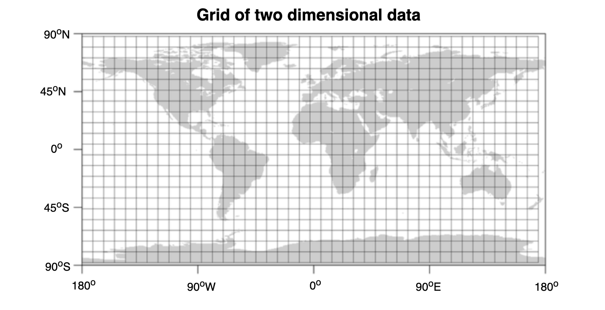
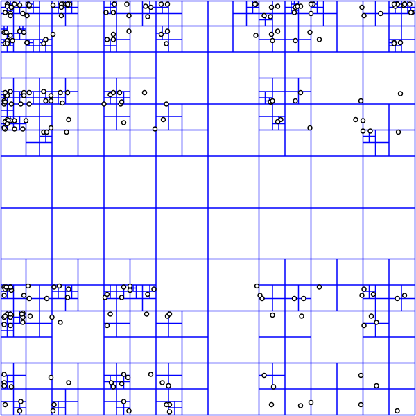
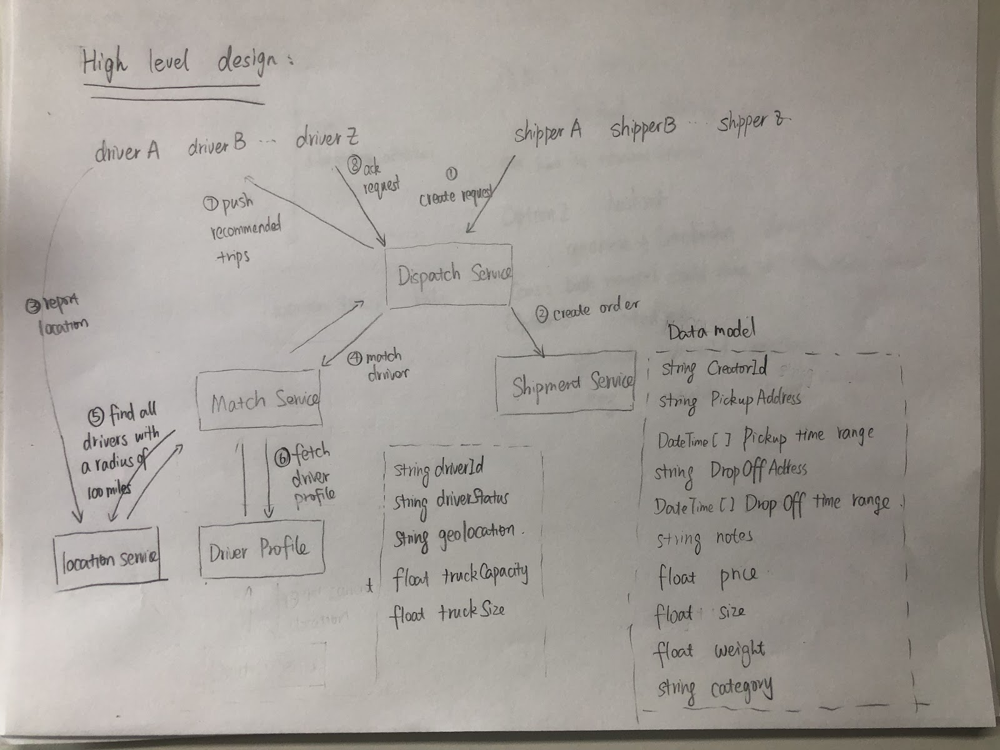
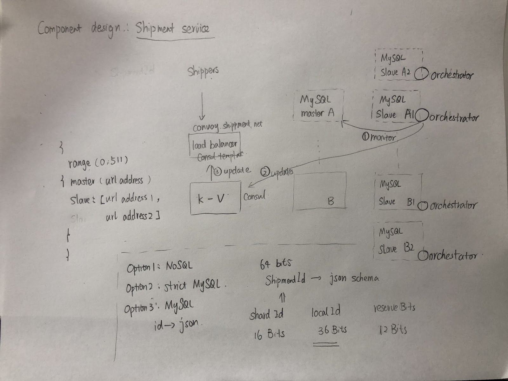

- [Location-based service](#location-based-service)
  - [Data modeling](#data-modeling)
    - [Operations to support](#operations-to-support)
    - [Represent as (latitude, longtitude) pair](#represent-as-latitude-longtitude-pair)
      - [Naive way to implement in SQL](#naive-way-to-implement-in-sql)
      - [Geo location support in PostgreSQL](#geo-location-support-in-postgresql)
    - [Represent as Grids](#represent-as-grids)
      - [Static grids](#static-grids)
      - [Dynamic grids - Squad tree](#dynamic-grids---squad-tree)
      - [Size estimation](#size-estimation)
    - [Represent as Geohashes](#represent-as-geohashes)
    - [Represent as Hilbert Curves](#represent-as-hilbert-curves)
    - [Graph database](#graph-database)
  - [Real life](#real-life)
  - [References](#references)

# Location-based service

## Data modeling
* Different ways to represent geolocation
  - https://www.red-gate.com/simple-talk/sql/t-sql-programming/simple-sql-handling-location-datatypes/

### Operations to support
* Update location
* NN: Given a location, find the nearest k points
* Range query: Retrieve all points within a specific spatial range. 

### Represent as (latitude, longtitude) pair
#### Naive way to implement in SQL

```
# Create schema
Create Location
{
    locationId text,
    latitude double,
    longtitude double,
},

# Add location
Insert into location (locationId, latitude, longtitude) values ("id1", 48.88, 2.31)

# Search nearby k locations within r radius
Select locationId from Location where 48.88 - radius < latitude < 48.88 + radis and 2.31 + radius < longtitude < 2.31 + radius

```

#### Geo location support in PostgreSQL
1. PostgreSQL supports KNN search on top using distance operator <->

```
select id, name, pos
    from pubnames
order by pos <-> point(51.516,-0.12)
    limit 3;

     id     |          name          |           pos           
------------+------------------------+-------------------------
   21593238 | All Bar One            | (51.5163499,-0.1192746)
   26848690 | The Shakespeare's Head | (51.5167871,-0.1194731)
  371049718 | The Newton Arms        | (51.5163032,-0.1209811)
(3 rows)

# evaluated on 30k rows in total
Time: 18.679 ms 
```

2. The above query takes about 20 minutes, using KNN specific index (called GiST / SP-GiST) to speed up

```
> create index on pubnames using gist(pos);

> select id, name, pos
    from pubnames
order by pos <-> point(51.516,-0.12) limit 3;
     
     id     |          name          |           pos           
------------+------------------------+-------------------------
   21593238 | All Bar One            | (51.5163499,-0.1192746)
   26848690 | The Shakespeare's Head | (51.5167871,-0.1194731)
  371049718 | The Newton Arms        | (51.5163032,-0.1209811)
(3 rows)

# evaluated on 30k rows in total
Time: 0.849 ms
```

* https://tapoueh.org/blog/2013/08/the-most-popular-pub-names/

### Represent as Grids
#### Static grids
* Divide the world into a set of fixed size grids. 
* Then each grid could have a unique grid id based on its coordinate. 
* Cons: Some grid will be much denser than others. How to choose the optimal grid size. 
* Pros: When having the grid Id as a query dimension, the SQL query will be much faster. 

```
Select * from Places where 
Latitude between X-D and X+D 
and Longitude between Y-D and Y+D 
and GridID in (GridID, GridID1, GridID2, ..., GridID8)
```



#### Dynamic grids - Squad tree
* A squad tree is similar to a trie. 



```
def insertInTree(root, data):
    """Pseudo code for inserting a point in a Quadtree"""
    if not root
        createLeafAndInsertNode(root, data) 
    elif root.isLeaf() and root.size() < BUCKET_SIZE:
        root.addNode(data)
    elif root.isLeaf(): # Leaf node must be full
        root.decomposeLeafNodeAndInsert(data)
    # Find the appropriate sub-tree to insert node
    elif root.northwest.isValidParent(data)
        insertInTree(root.northwest, data)  
    elif root.southwest.isValidParent(data)
        insertInTree(root.southwest, data)  
    elif root.southeast.isValidParent(data)
        insertInTree(root.southeast, data)  
    else   
        insertInTree(root.northeast, data)

def getPointsInRange(root, range):
    points = []
    # If there is no intersection with the area, return
    if not root.intersect(range):
        return points
    # Return all data points on a leaf node
    if root.isLeaf():
        points.append(root.getNodes())
        return points
    # Recursively append the points from the 4 quadrants
    points.append(getPointsInRange(root.northwest, range))
    points.append(getPointsInRange(root.northeast, range))
    points.append(getPointsInRange(root.southeast, range))
    points.append(getPointsInRange(root.southwest, range))
    return points
```

#### Size estimation
* Static grid 
  * Size of world earth 200 M square mile
  * Size of grid = 10 square mile
  * Number of grids = 200 M / 10 = 20M Grids
  * Each grid has maximum 500 places
  * Each location has 24 bytes (string as location Id + double as longtitude + double as latitude). 
  * In total 2M * 2^3 * 3 * 500 = 240GB
* Dynamic grid
  * Total number of locations is 500M. 
  * Each grid holds most 500 places.
  * Then there are in total 1M leaf nodes. 
  * There are roughly 0.5M internal nodes. A squad tree will have roughly 1/2 internal nodes
  * Leaf nodes space usage = 1M * 24 * 500 = 12000M = 1.2 GB
  * Internal nodes space usage 32 bytes * 0.5M = 16 MB 

* Reference: https://medium.com/@waleoyediran/spatial-indexing-with-quadtrees-b998ae49336

### Represent as Geohashes
* 

### Represent as Hilbert Curves
* 

### Graph database








## Real life
* [Unique GeoId in Twitter](https://blog.twitter.com/engineering/en_us/a/2010/woeids-in-twitters-trends.html)

## References
* [R tree / KD - tree](https://blog.mapbox.com/a-dive-into-spatial-search-algorithms-ebd0c5e39d2a)
* [Geohash vs S2 vs H3](https://dev.to/phm200/the-problem-of-nearness-part-2-a-solution-with-s2-23gm)
* [Redis data model based basic algorithm for finding available drivers](https://www.youtube.com/watch?v=cSFWlF96Sds)

