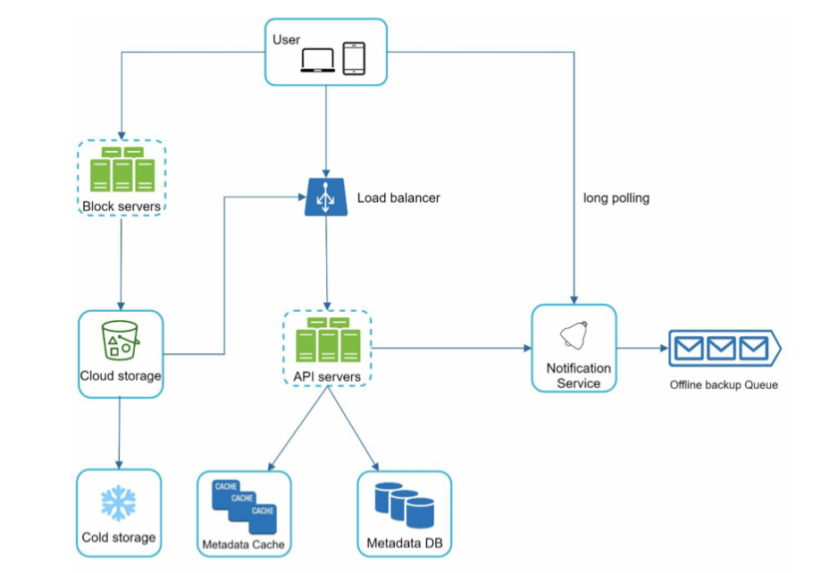
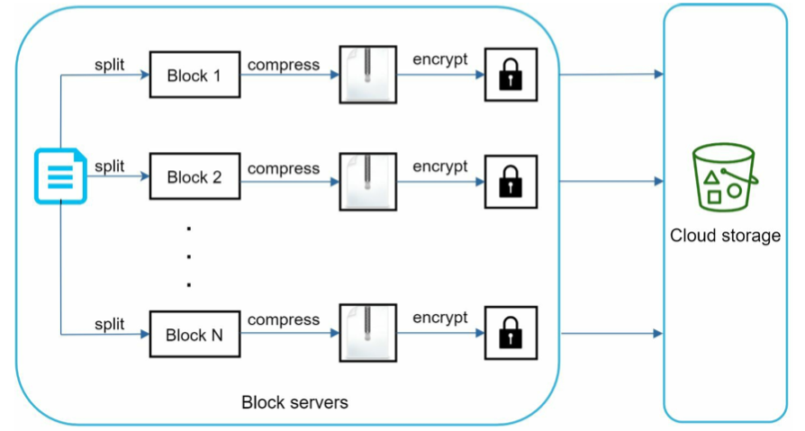
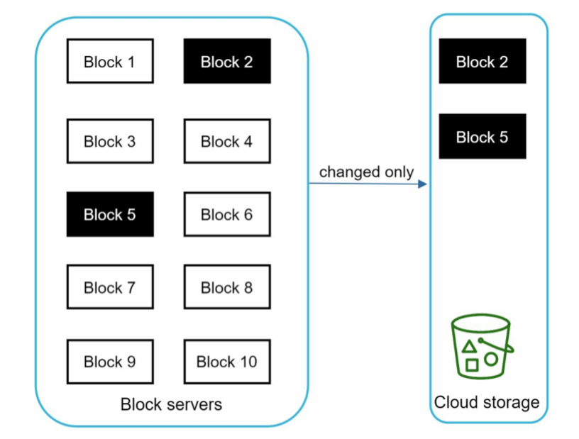
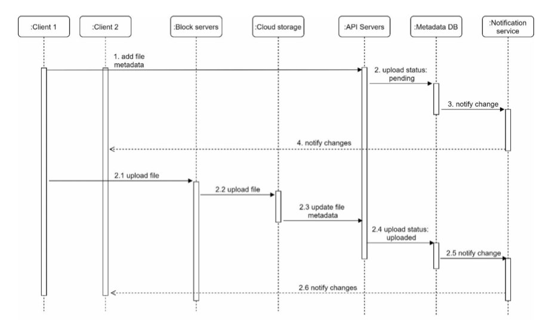
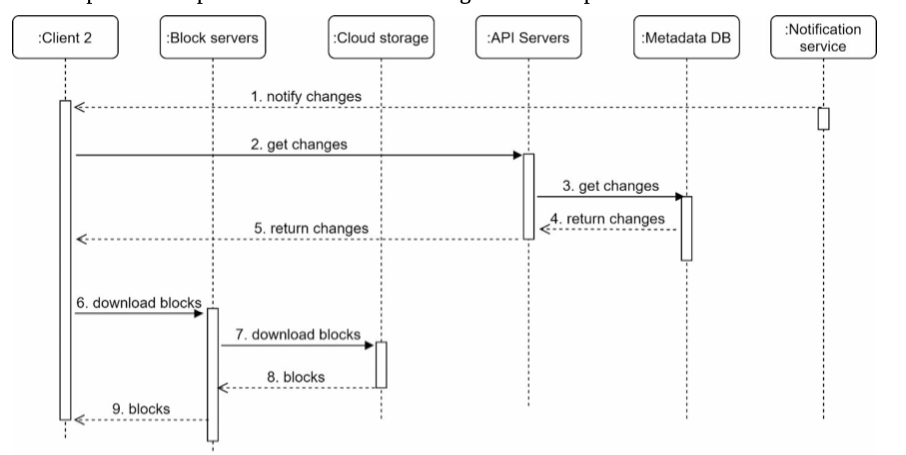

- [Google Drive](#google-drive)
  - [High level design](#high-level-design)
  - [Upload/Edit flow cahrt](#uploadedit-flow-cahrt)
  - [Download flow chart](#download-flow-chart)
  - [Notification flow](#notification-flow)
  - [Real world practices](#real-world-practices)

# Google Drive
## High level design
* Overall chart

* Block servers overall chart

* Block servers enable delta sync

## Upload/Edit flow cahrt
Two requests are sent in parallel: add file metadata and upload the file to cloud storage. Both requests originate from client 1.
* Add file metadata.
  1. Client 1 sends a request to add the metadata of the new file.
  2. Store the new file metadata in metadata DB and change the file upload status to “pending.”
  3. Notify the notification service that a new file is being added.
  4. The notification service notifies relevant clients (client 2) that a file is being uploaded.
* Upload files to cloud storage.
  1. Client 1 uploads the content of the file to block servers.
  2. Block servers chunk the files into blocks, compress, encrypt the blocks, and upload them to cloud storage.
  3. Once the file is uploaded, cloud storage triggers upload completion callback. The request is sent to API servers.
  4. File status changed to “uploaded” in Metadata DB.
  5. Notify the notification service that a file status is changed to “uploaded.”
  6. The notification service notifies relevant clients (client 2) that a file is fully uploaded.

## Download flow chart
* Download flow is triggered when a file is added or edited elsewhere. 
  1. Notification service informs client 2 that a file is changed somewhere else.
  2. Once client 2 knows that new updates are available, it sends a request to fetch metadata.
  3. API servers call metadata DB to fetch metadata of the changes.
  4. Metadata is returned to the API servers.
  5. Client 2 gets the metadata.
  6. Once the client receives the metadata, it sends requests to block servers to download blocks.
  7. Block servers first download blocks from cloud storage.
  8. Cloud storage returns blocks to the block servers.
  9. Client 2 downloads all the new blocks to reconstruct the file.

## Notification flow
* How does a client know if a file is added or edited by another client? There are two ways a client can know:
  * If client A is online while a file is changed by another client, notification service will inform client A that changes are made somewhere so it needs to pull the latest data.
  * If client A is offline while a file is changed by another client, data will be saved to the cache. When the offline client is online again, it pulls the latest changes.
* Here are a few options:
  * Long polling. Dropbox uses long polling [10].
  * WebSocket. WebSocket provides a persistent connection between the client and the server. Communication is bi-directional.
* Even though both options work well, we opt for long polling for the following two reasons:
  * Communication for notification service is not bi-directional. The server sends information about file changes to the client, but not vice versa.
  * WebSocket is suited for real-time bi-directional communication such as a chat app. 

## Real world practices
* https://www.infoq.com/presentations/dropbox-infrastructure/
  * [How do we scale Dropbox slides](./files/QConSF2016-PreslavLe-ScalingDropbox.pdf)
  * [Dropbox security whitepaper](https://www.dropbox.com/static/business/resources/Security_Whitepaper.pdf)
  * [S3 design](https://www.youtube.com/watch?v=UmWtcgC96X8)