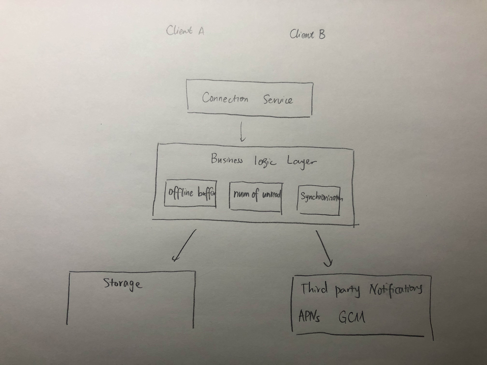
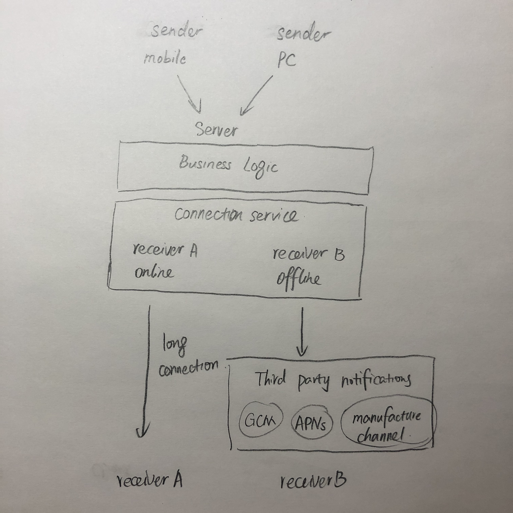
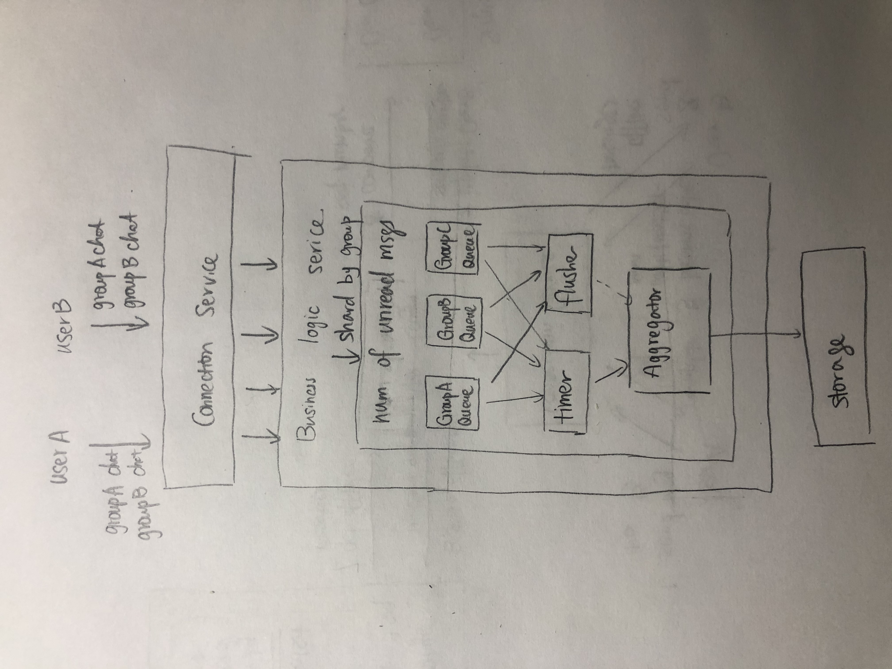
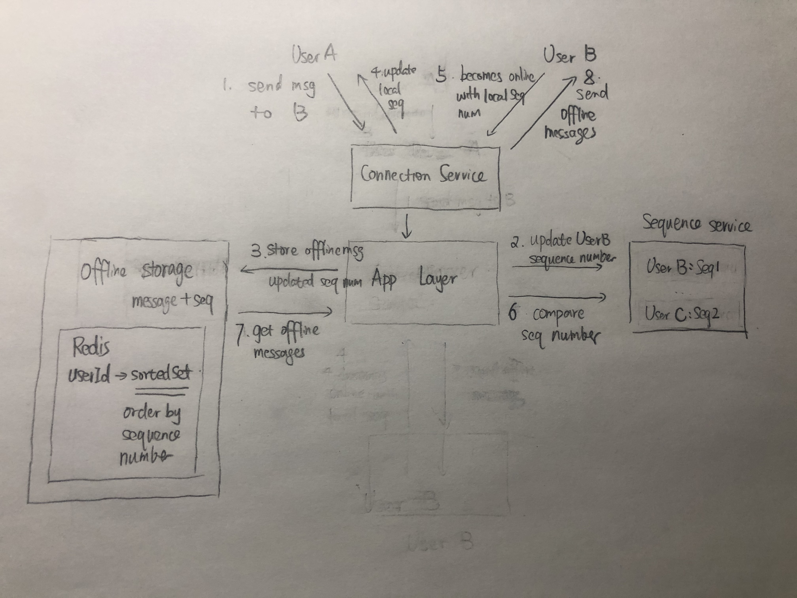
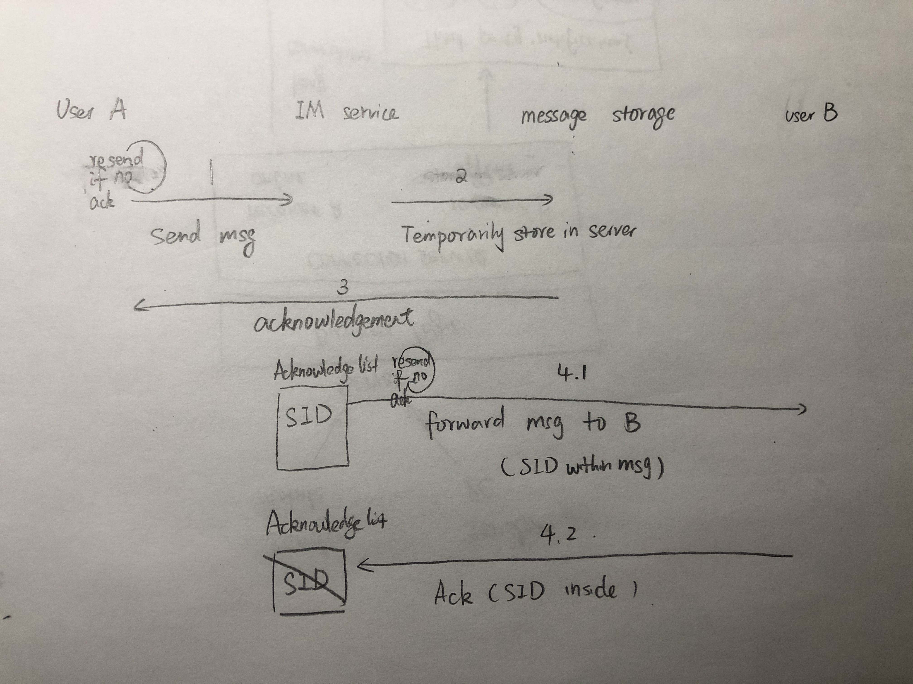
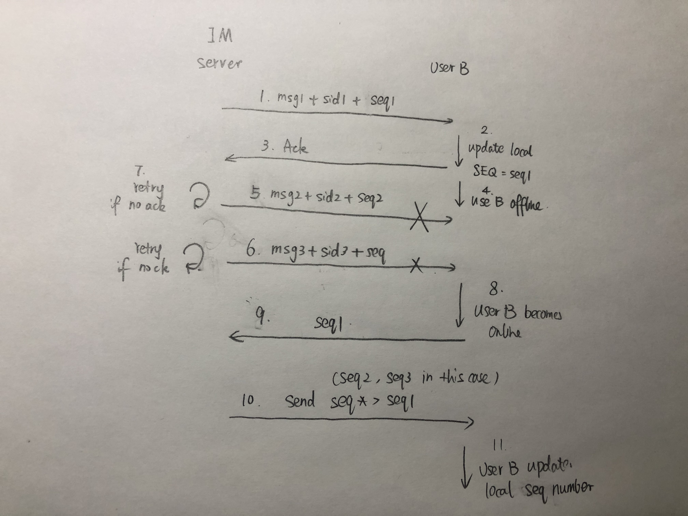

# Messenger

<!-- MarkdownTOC -->

- [Messenger](#messenger)
- [Scenario](#scenario)
	- [Core features](#core-features)
	- [Common features](#common-features)
- [Small scale solution](#small-scale-solution)
	- [Estimation](#estimation)
	- [Solution](#solution)
- [Large scale solution](#large-scale-solution)
	- [Estimation](#estimation-1)
	- [Connection service](#connection-service)
		- [Goal](#goal)
		- [Motivation for separation from business logic layer](#motivation-for-separation-from-business-logic-layer)
		- [Components](#components)
			- [Online status](#online-status)
			- [Notifications](#notifications)
				- [Online notification](#online-notification)
				- [History](#history)
					- [Pull model (Periodical short pull)](#pull-model-periodical-short-pull)
					- [Pull model (Periodical long pull)](#pull-model-periodical-long-pull)
				- [Push model (WebSocket)](#push-model-websocket)
					- [Websocket](#websocket)
					- [Heartbeat](#heartbeat)
				- [Scale the long connection storage](#scale-the-long-connection-storage)
				- [Offline notification](#offline-notification)
	- [Storage](#storage)
		- [One-on-One chat schema](#one-on-one-chat-schema)
			- [Requirements](#requirements)
			- [Basic design: Message table](#basic-design-message-table)
			- [Optimization: Message content should be decoupled from sender and receiver](#optimization-message-content-should-be-decoupled-from-sender-and-receiver)
			- [Optimization: Loading recent contacts should be faster](#optimization-loading-recent-contacts-should-be-faster)
		- [Group chat schema](#group-chat-schema)
			- [Requirements](#requirements-1)
			- [Basic design: Message and thread table](#basic-design-message-and-thread-table)
			- [Optimization: User could customize properties on chat thread](#optimization-user-could-customize-properties-on-chat-thread)
			- [??? Optimization: Users who just joined could only see new messages](#-optimization-users-who-just-joined-could-only-see-new-messages)
		- [SQL vs NoSQL](#sql-vs-nosql)
- [Additional Features within business logic service](#additional-features-within-business-logic-service)
	- [Unread messages](#unread-messages)
		- [Separate storage](#separate-storage)
		- [Inconsistency](#inconsistency)
		- [How to be efficient in 10K group chat](#how-to-be-efficient-in-10k-group-chat)
	- [Sync history msg from multiple devices](#sync-history-msg-from-multiple-devices)
		- [Sync from online devices](#sync-from-online-devices)
		- [Sync from offline devices](#sync-from-offline-devices)
			- [Flow chart](#flow-chart)
			- [Storage](#storage-1)
			- [How to handle offline write failure](#how-to-handle-offline-write-failure)
		- [How to scale offline batch Ack](#how-to-scale-offline-batch-ack)
- [Messaging app considerations](#messaging-app-considerations)
	- [Reliability (No missing and duplication)](#reliability-no-missing-and-duplication)
		- [Flow chart](#flow-chart-1)
		- [Resend and dedupe](#resend-and-dedupe)
		- [Completeness check](#completeness-check)
	- [Consistency](#consistency)
		- [Define a global order](#define-a-global-order)
		- [Applicability of the global order](#applicability-of-the-global-order)
		- [Guarantee the global order != consistent order](#guarantee-the-global-order--consistent-order)
			- [Reorder](#reorder)
	- [Security](#security)
		- [Transmission security](#transmission-security)
		- [Storage security](#storage-security)
		- [Content security](#content-security)
	- [Optimize for multi-media](#optimize-for-multi-media)
		- [Upload](#upload)
		- [Send](#send)
	- [Network stability](#network-stability)
- [Industry solutions](#industry-solutions)
	- [Client vs server side storage](#client-vs-server-side-storage)
	- [Slack](#slack)
	- [Hipchat](#hipchat)
	- [Facebook](#facebook)
	- [Discord](#discord)
	- [MirrorFly](#mirrorfly)

<!-- /MarkdownTOC -->

# Scenario
## Core features
* One to one chatting
* Group chatting
* User online status

## Common features
* History info
* Log in from multiple devices
* Friendship / Contact book

# Small scale solution
## Estimation
* DAU: 2000, Suppose 50 messages / day per user
* QPS: 
	- 2000 * 50 / 86400 = 1.2
* Storage: 
	- 2000 * 50 * 100 bytes = 10 MB/day = 3.6GB / year

## Solution
* Sender sends message and message receiverId to server
* Server creates a thread for each receiver and message sender
* Server creates a new message (with thread_id)
* How does user receives information
	- Pull server every 10 second

# Large scale solution
## Estimation
* DAU: 500M, Suppose 50 messages / day per user (Facebook 1.66 billion)
* QPS: 
	- Average QPS = 500M * 50 / 86400 ~ 0.3M 
	- Peak QPS = 0.3M * 3 = 1M
* Storage: 
	- 500M * 50 * 100 Bytes = 2.5 TB/day = 1PB / year



## Connection service
### Goal
* Keep the connection
* Interpret the protocol. e.g. Protobuf
* Maintain the session. e.g. which user is at which TCP connection
* Forward the message. 

### Motivation for separation from business logic layer
* This layer is only responsible for keeping the connection with client. It doesn't need to be changed on as often as business logic pieces.
* If the connection is not on a stable basis, then clients need to reconnect on a constant basis, which will result in message sent failure, notification push delay. 
* From management perspective, developers working on core business logic no longer needs to consider network protocols (encoding/decoding)

### Components
#### Online status
* Online status pull
	* When users become online, send a heartbeat msg to the server every 3-5 seconds. 
	* The server sends its online status to friends every 3-5 seconds. 
	* If after 1 min, the server does not receive the heartbeat msg, considers the user is already offline. 

* Performance bottleneck
	* A central connection service for maintaining user online status and network gateway the user resides in
		- Instead, use a message queue, ask all connection service to subscribe to this message queue. [STILL SOME QUESTIONS 存储和并发：万人群聊系统设计中的几个难点]
		- This mechanism shifts the pressure from business logic layer to connection service layer. 

#### Notifications


##### Online notification
* User online: Push message via long poll connection
	- How does long poll find user's connection among so many long polls? There will be a user sign-in process
		1. A TCP connection is set after three time hand shake. 
		2. Client sends a request based on the connection. 
		3. Server interprets the connection. If valid, it will save the mapping between uid and tcp connection socket descriptor. 
		4. This descriptor will be saved on local cache or distributed cache. 

##### History
###### Pull model (Periodical short pull)
* User periodically ask for new messages from server
* Use case:
	- Used on reconnection
* Cons if used for messaging: 
	- High latency if pulling on a low frequency
	- High resource consumption if pulling on a high frequency. 
		+ It wastes client devices' electricity because most polling are useless. 
		+ It puts high pressure on server resources and implies a high QPS. 

###### Pull model (Periodical long pull)


* Periodical long poll: The difference with short poll is that the client request does not return immediately after the request reaches the server. Instead, it hangs on the connection for a certain period of time. If there is any incoming messages during the hanging period, it could be returned immediately. 
	- Cons: 
		+ Hanging on the server for a period reduces the QPS but does not really reduce the pressure on server resources such as thread pool. (If there are 1000 connections, server side still needs to have 1000 threads handling the connection.) 
		+ Long pull will return if not getting a response after a long time. There will still be many waste of connections. 

##### Push model (WebSocket)
###### Websocket
* Websocket: Client and server need one-time handshake for bi-directional data transfer. When server side has a new notification, it could push to the client via the websocket connection. 
	- Websocket is a duplex protocol based on a single TCP connection. 
	- Pros: 
		- Support bidirectional communication, client no longer needs to pull periodically. 
		- Reduce the setup time. A new TCP connection does not need to be established. 
		- Support natively by the web after HTML5 appears.
	- TODO: HOW DOES WEBSOCKET WORK INTERNALLy
* Many other protocols based on TCP long connection such as XMPP/MQTT. 
	- XMPP is mature and easy to extend. But the XML based transfer schema consumes a lot of network bandwidth and has a complicated design.
	- MQTT is based on pub/sub mode, reserve network bandwidth, easy to extend. But it is not a protocol for IM so does not support many IM features such as group chatting, offline messages. 

###### Heartbeat 
* Approaches to maintain connection (heartbeat)
	- TCP keepalive heartbeat
		- Pros: 
			+ Supported by TCP/IP protocol. Disabled by default. Three parameters to be configured: heart beat cycle (default 2 hour), number of retries (retry 9 time), timeout period (75s). 
			+ No extra development work. 
			+ Used in industry. For example, WhatsApp uses 10 seconds duration TCP keepalive. 
		- Cons: 
			+ Low flexibility in tuning the heartbeat cycle period (always fixed cycle period); 
			+ Network layer available does not mean application layer available. For example, application is stuck in a dead cycle. 
	- Application layer heartbeat
		- To overcome the cons of network layer TCP keep-alive, application layer heartbeat messages are used.
		- Strategies:
			+ Only send hearbeat messages when application has additional bandwidth 
			+ Based on a fixed frequency
		- Pros: 
			+ More flexibility in tuning the heartbeat cycle period
			+ Reflect whether the application is avaialble. 
			+ Used in industry. For example, WhatsApp use 30 seconds or 1 minutes app level heartbeat; Wechat use 4.5 minutes and twitter uses 2 minutes. 
		- Cons: 
			+ Will have some additional data transmission cost because not supported natively by TCP/IP protocol.

* Benefits
	* This long connection is a virtual connection. There will be cases that the connection could be broken. For example: 
		- The user enters an area where the network connection is bad. 
		- Or even without any network errors on client and server side, there will be a NAT process happening within network operators. For optimizing the performance and reduce the resource consumption on network operator devices, some network operators will clear the mapping within NAT if there isn't any msg being sent on the connection.
			- The NAT process is to transform the internal IP address to external IP address because there are only limited IPv4 addresses. 
	* Reduce the connection resource consumption on IM server side
		- Server will maintain a mapping between user device and network connection
		- Server will cache some client info such as app version, os version so that client does not need to pass those information every time
		- If no exception are detected, server will try to push notifications along these corrupted long connection channels, wasting a lot of resources. 
	* Notify the client to reconnect if not receiving the ack of heartbeat msgs after timeout. 

##### Scale the long connection storage
* When the size of group is big, connection service will become a bottleneck because:
	- When users become online/offline, write pressure to connection service
	- When messages need to be pushed down from the server, it needs to check the online status within the connection service
* Optimization
	- Each connection service cluster doesn't need to maintain a global user online/offline status storage. Only maintain the online/offline users connected to the connection service cluster. 
	- Subscribe to a message queue


##### Offline notification
* User offline: Push message via APNs
	- To make sure that users could still receive notifications when the app is running in the background or not openned, third party notification (Apple Push Notification Service / Google Cloud Messaging) will be used. 

* Offline message push 
	* When many offline messages need to be pushed to the end-user, there is a need to resort msgs.
	* The entire process for sending offline msgs
		1. The connection layer (network gateway) will subscribe to the redis topic for offline msgs. 
		2. User goes online. 
		3. The connection layer (network gateway) will notify business layer that the user is online.
		4. The business layer will publish msgs to redis topic for offline msgs. 
		5. Redis will fan out the offline messages to the connection layer. (The rearrangement happens on this layer)
		6. The conneciton layer will push the message to clients. 

## Storage
### One-on-One chat schema
#### Requirements
* Load all recent conversations according to the last updated timestamp
* For each conversation, load all messages within that conversation according to the message create timestamp

#### Basic design: Message table
* The message table is as follows:
	- Create timestamp could be used to load all conversations after certain date

| Columns   | Type      | Example          | 
|-----------|-----------|------------------| 
| messageId | integer   |  1001   | 
| from_user_id  | integer   | sender  | 
| to_user_id  | integer   | receiver  | 
| content  | string   | hello world | 
| create_at  | timestamp   | 2019-07-15 12:00:00 | 

* Cons: 
	- Determine the thread_list to be displayed
	- To load all messages in a chat, the following query needs to be executed. The query has a lot of where clause
	- Suppose to be used in a group chat scenario. The same message needs to copied multiple times for different to_user_id. Not easy to be extended to group chat schema

```
// determine the thread list, meaning the to_user_id below
$contactList = select to_user_id from message_table
				where from_user_id = A

// for each contact, fetch all messages
select * from message_table 
where from_user_id = A and to_user_id = B 
	  or from_user_id = B and to_user_id = A
order by create_at desc

// insert message is simple
```

#### Optimization: Message content should be decoupled from sender and receiver
* Intuition: 
	- Even if sender A deletes the message on his machine, the receiver B should still be able to see it 
	- Create a message_content table and message_index table
* message_content

| Columns   | Type      | Example          | 
|-----------|-----------|------------------| 
| messageId | integer   |  1001   | 
| content  | string   | hello world | 
| create_at  | timestamp   | 2019-07-15 12:00:00 | 

* message_index
	- ??? What are the reason isInbox is needed

| Columns   | Type      | Example          | 
|-----------|-----------|------------------| 
| messageId  | string   | 1029 | 
| from_user_id | integer   |  sender   | 
| to_user_id  | integer   | receiver  |
| isInbox  | integer   | 1 (inbox) / 0 (sendbox)  |

#### Optimization: Loading recent contacts should be faster
* Intuition: 
	- Loading recent contacts is a high frequent operation on every startup. 
	- Querying recent contacts should not require querying the entire message_index
	- Create a recent_contacts table to separate the use case. Though schema looks similar, the differences between message_index table are:
		+ message_index table stores the entire chat history and recent_contacts only contains the most recent 1 chat
		+ message_index table is usually insertion operation while recent_contacts is update operation

* recent_contacts

| Columns   | Type      | Example          | 
|-----------|-----------|------------------| 
| messageId  | string   | 1029 | 
| from_user_id | integer   |  sender   | 
| to_user_id  | integer   | receiver  |

### Group chat schema
#### Requirements
* Query all group conversations the user participate in according to the last updated timestamp
* For each conversation, load all messages within that conversation according to the message create timestamp

#### Basic design: Message and thread table
* Intuition: 
	1. To be extensible for group chat, to_user_id could be extended as participants_ids
	2. Currently a conversation is identified by a combined query of from_user_id and to_user_id, which results in a lot of query overhead. Give a conversation a unique id so that all messages withinn that conversation could be easily retrieved. 
	3. Since participants_ids in Message table is not a field used frequently according to the query, we could extract that and put it in a separate Thread table. 

* Message table

| Columns   | Type      | Example          | 
|-----------|-----------|------------------| 
| messageId | integer   |  1001   | 
| thread_id  | integer   | createUserId + timestamp  | 
| user_id  | integer   | sender  | 
| content  | string   | 2019-07-15 12:00:00 | 
| create_at  | timestamp   | 2019-07-15 12:00:00 | 

* Thread table
	- update_at could be used to sort all threads. 

| Columns   | Type      | Example          | 
|-----------|-----------|------------------| 
| thread_id | integer   |  createUserId + timestamp   | 
| participants_ids  | text   | conversation id  | 
| participantsHash | string    | avoid duplicates threads | 
| create_at  | timestamp   | 2019-07-15 12:00:00 | 
| update_at  | timestamp   | 2019-07-15 12:00:00 | 

* Queries

```
// determine the thread list, meaning the to_user_id below
$threadId_list = select thread_id from message_table
where user_id == A

// for each thread_id inside threadId_list
select * from message_table 
where thread_id = A
order by create_at desc

// Display all participants for each thread
$participantsId_list = select participants_ids from thread_table
where thread_id in $threadId_list
order by update_at desc
```

* Pros:
	- Easy to be extended to a group chat scenario because to_user_id has been replaced with participants_ids. 
	- To load all messages in a chat, could query only the thread_id in message table. 
	- To order all threads for a user, could query only the update_at in thread table. 

* Cons:
	- There is no place to store information such as the user mutes the thread. 

#### Optimization: User could customize properties on chat thread
* Intuition:
	- User could mute a chat thread. Create a customized name for a group chat. 
	- Expand the thread table with three additional fields including owner_id, ismuted, nickname
* Message table

| Columns   | Type      | Example          | 
|-----------|-----------|------------------| 
| messageId | integer   |  1001   | 
| thread_id  | integer   | createUserId + timestamp | 
| user_id  | integer   | sender  | 
| content  | string   | 2019-07-15 12:00:00 | 
| create_at  | timestamp   | 2019-07-15 12:00:00 | 

* Thread table
	- update_at could be used to sort all threads. 
	- Needs to support multi-index. (SQL will be a better fit)
	    + Owner user Id: Search all of chat participated by a user
	    + Thread id: Get all detailed info about a thread (e.g. label)
	    + Participants hash: Find whether a certain group of persons already has a chat group
	    + Updated time: Order chats by update time

| Columns   | Type      | Example          | 
|-----------|-----------|------------------| 
| **owner_id** | integer   |  1001   | 
| thread_id  | integer   | createUserId + timestamp | 
| participants_ids  | json   | conversation id  | 
| participantsHash | string  | avoid duplicates threads | 
| **ismuted**  | bool   | personal setting  | 
| **nickname**  | text   | conversation id  | 
| create_at  | timestamp   | 2019-07-15 12:00:00 | 
| update_at  | timestamp   | 2019-07-15 12:00:00 | 

* Queries

```
// determine the thread list, meaning the to_user_id below
$threadId_list = select thread_id from thread_table
where owner_id == A

// for each thread_id inside threadId_list
select * from message_table 
where thread_id = A
order by create_at desc

// Display all participants for each thread
$participantsId_list = select participants_ids from thread_table
where thread_id in $threadId_list
order by update_at desc
```

#### ??? Optimization: Users who just joined could only see new messages

### SQL vs NoSQL
* Message table
	- NoSQL. Do not need to take care of sharding/replica. Just need to do some configuration. 
* Thread table
	- According to userId. 
	- Why not according to threadId?
		+ To make the most frequent queries more efficient: Select * from thread table where user_id = XX order by updatedAt

# Additional Features within business logic service
## Unread messages
### Separate storage
* Total unread message and unread message against a specific person
	- Usage scenarios are different

### Inconsistency
* Why inconsistency will occur in the first place?
	- Total unread message increment and unread message against a specific person are two atomic operations. One could fail while the other one succeed. Or other clearing operations are being executed between these two operations. 
* Solution:
	- Distributed lock
		* MC add
		* Redis setNX
	- Transaction
		* Redis's MULTI, DISCARD, EXEC and WATCH operations. Optimistic lock. 		
	- Lua script

### How to be efficient in 10K group chat
* Problem: Suppose that there is a 5000 people group and there are 10 persons speaking within the group per second, then QPS for updating unread messges will be 50K; When there are 1000 such groups, the QPS will be 50M
* Solution: Aggregate and update
	1. There will be multiple queues A/B/C/... for buffering all incoming requests. 
	2. Two components will be pulling from queues
		- Timer: Will be triggered after certain time
		- Flusher: Will be triggered if any of the queue exceed a certain length
	3. Aggregator service will pull msgs from Timer and Flusher, aggregate the read increment and decrement operations
* Cons:
	+ Since there is no persistent on queues, if there is a restart, the number of unread messages will be inaccurate



## Sync history msg from multiple devices
* Telegram and QQ supports sync history and Wechat don't.

### Sync from online devices
* Require to record the online status from user devices' perspective. 

### Sync from offline devices
#### Flow chart


#### Storage
* Offline msgs should not be stored together with normal online msgs because
	- Offline msgs will contain operation instructions which will not be persisted in online cases.
	- The data model for msg index table is based on two parties. The data model for offline msg is based on single unique user. 
	- The offline messages only have a certain retention period (1 week) or upper limit (1000 messages). Since the number of users' devices is unknown, offline messages could not stored forever. It should be stored in a FIFO basis. 
* Offline message should be sent together a sequence field
	- After the sender sends a message, the sender's local seq number also needs to be updated. An additional step could be performed 
* Offline messages could be sent together in a big package. 

#### How to handle offline write failure
* How to pull offline msgs based on needs
	1. User A sends a msg to User B. 
	2. IM server changes User B's version number VERSION-LATEST within the version service. 
	3. IM server saves the msg along with its version number VERSION-LATEST. 
	4. User B comes online with its latest version number VERSION-OLD. 
	5. IM server compares the two version numbers VERSION-OLD and VERSION-LATEST. 
	6. IM server obtains the offline msgs for User B. 
	7. IM server pushes the offline msgs to User B. 
* What if the offline storage exceeds the maximum limit
	- It could goes back to the msg index table 

### How to scale offline batch Ack
* Offline ack usually happens in scenarios where a user just sets up the connection. Usually around this time the connection channel is stable and reliable. 
* Could adopt something similar to TCP's Delay Ack to accept ack packages in batch. 

# Messaging app considerations
## Reliability (No missing and duplication)
### Flow chart
* Among the IM forwarding model, the process of User A send a message to User B consists of the following steps:
	1. User A sends a msg to IM server (possible failure: the request failed midway)
	2. IM server stores the msg (possible failure: fails to store the message)
	3. IM server sends User A an acknowledge (possible failure: the server does not return within timeout period)
	4. IM server forwards the msg to User B (possible failure: after writing the msg to kernel send space, the server gets suspended because of power outage / User B receives the message but there is an exception happening resulting in message not put into queue.)
		1. When IM server forwards a msg to User B, it will carry a unique SID. This unique SID will be put inside an acknowledgement list (possible failure: the message never reaches user b's device because network is down).
		2. When User B receives the msg successfully, it will reply with an ACK package (possible failure: the acknowledgement package gets lost in the midway / User B's device gets corrupted before it could send an acknowledgement package); IM server will maintain an acknowledgement list with a timeout. If it does not get an acknowledgement package from user B, it will retry the message from the acknowledgement list. 
		3. IM server will delete the msg with unique SID from the acknowledgement list (possible failure: IM server crash). 



### Resend and dedupe
* User A and IM server has resend and acknowledgement in place. 
* IM server and User B needs to have dedupe mechanism in place. 

### Completeness check



* What if the IM gets corrupted when it is resending the msg: Unique msg sequence id for guaranteeing the completeness 
	1. IM server forwards a msg MESSAGE to User B, it carries a unique sequence id SEQ1. 
	2. When user B gets the msg MESSAGE, it update its local msg sequence id to SEQ1. 
	3. IM server gets the acknowledge.
	4. User B becomes offline.
	5. IM server forwards another msg MESSAGE to User B, it carries another unique sequence id SEQ2 and message gets lost. 
	6. User B reconnects online, carrying the latest local msg sequence id SEQ1 to IM server. 
	7. IM server detects that User B needs more msgs, so it delivers all of msgs with sequence id between SEQ1 and SEQ2. 
	8. User B receives the msg and update the local sequence id to SEQ2. 
* Why needs an acknowledgement even if TCP layer already acknowledges msg:
	* These acknowledgement are at different layers. TCP acknowledgement is at network layer. App layer acknowledgement happens at acknowledge layer. There could be some error happening during the process from network layer to app layer. 

## Consistency
### Define a global order
* Sender's local timestamp/sequence number? 
	- Sender sends its local timestamp/sequence number along with message to the receiver. Receiver reorders all messages according to sender's local timestamp/sequence number
		- First order according to timestamp
		- Then order by sequence number
	- No because
		+ Senders' could reset its timestamp to a specific value
		+ Sender's sequence number could be reset to 0 after a operation like reinstall
		+ In a scenario like group chat, participants' clock might not be synced; Or in a scenario where the same user logs in from multiple devices, different devices' timestamp might not be synced. 
* IM server's timestamp? 
	- Sender sends the message to the IM server. IM server sends its server timestamp/sequence number to the receiver. Receiver reorders all messages according to IM servers' local timestamp/sequence number
	- No because
		+ Usually IM server will be a cluster and the clock is synced using NTP
		+ When the cluster size is really big, it is challenging to maintain uniqueness

### Applicability of the global order
* IM server's sequence number? Maybe
	- Could be implemented [in these ways](https://github.com/DreamOfTheRedChamber/system-design/blob/master/uniqueIDGenerator.md)
 	- From the product's perspective, there is no need for a global unique sequence number. 
 		+ For scenario like group chat and logging from multiple devices, as long as there is a unique global sequence number per messaging group, it will be good enough. 
 		+ It is best practices adopted by industry standards like Wechat/Weibo.

### Guarantee the global order != consistent order
* Even have the global order defined, it is still not enough because
	- IM servers are deployed on a cluster basis. Every machine's performance will be different and different IM servers could be in different states, such as in GC. A message with bigger sequence number could be sent later than another message smaller sequence number. 
	- For a single IM server receiving a msg, the processing will be based on multi-thread basis. It could not be guaranteed that a message with bigger sequence number will be sent to receiver earlier than a message with lower sequence number. 

#### Reorder
* Why reorder is needed given most scenarios could stand small randomness in order?
	- However, there are some scenarios which have a higher sensitivity to order such as 
		+ (Corner case) After user A sends a "Goodbye" message to user B, delete the user B from the contact list. If the order is reversed, then the "Goodbye" message will fail. 
	- Even the order could be guaranteed on the IM server side, due to the nature of multithreading on the server/receiver side, there are still chances that messages are delivered in different order.
* Solution
	- For the corner case above, the two messages could be sent in a single package. 
	- For a scenario like receiving offline messages. 
		+ ??? How different from the global order Id

## Security
### Transmission security
* Entrance security: 
	- Router's DNS hijacked: DNS location is set to a location with virus. 
	- Operator's local DNS hijacked: 
		- Operator might send DNS requests to other operators to reduce the resource consumption
		- Operator might modify the TTL for DNS 
	- Ways to prevent DNS from being hijacked
		- HttpDNS protocol: Prevent domain name from being hijacked by operators. It uses HTTP protocol instead of UDP to directly interact with DNS servers. 
		- Combine HttpDNS with localDNS. 		
* TLS transmission layer security: 
	- Cut off network
		- Failover to multiple connection IP address returned by HttpDNS service
		- Change from UDP based QUIC protocol to TCP protocol
	- Intercept/Man in the middle/Forfeit: Use TLS protocol
		- Insymetric encryption and key exchange algorithm are used to guarantee message encryption key not being corrupted or leaked. 
		- Symmetric encryption is used to guarantee that the msg could not be decrypted after being intercepted. 
		- Digital signature and CA certificate could be used to verify the valid status of public key. 

### Storage security
* Account credentials: Hashing algorithm with salt.
* Message security: End to end encryption

### Content security
* Link to external phishing website
* Crawler

## Optimize for multi-media
### Upload
* Picture/Video/Voice: 
	- Picture/Video media: Have a dedicated channel for video and picture media. After media (video/picture) is uploaded to the storage, a unique ID will be generated and used along with messages. 
	- Voice media：There is no miniature for preview. Voice media will be transmitted in the same channel as message team. 
* Divide and send:
	- Size of the divide: Divide too big, not enough parrallelism; Divide too small, too many TCP connections and increased cost for merge.
	- Typical size of pieces: WiFi 2M; 4G 1M; 3G/2G 256K. 
	- Since the size of media is big, it will be beneficial to divide and retransmit. 
* Dedupe the media
	- Compute the hash for media before uploading

### Send
* Prerequisites for supporting watch while send
	1. Format and key frame info is at the top of file. 
	2. Storage support range queries. 
		- Ali OSS / Tencent COS, support range queries
		- Utilize load balance layer range query. (Nginx HTTP Slice)
* CDN
	- Encryption with HLS. 
* Compression
	- Image compression
		* Adaptive resolution
		* WebP: WebP is roughly 30% smaller than PNG/JPEG. Cons is not easy to be integrated on iOS platform / JPEG 		
		* JPEG: Two types of JPEG ??? 
	- Video: 
		* H.265 is 50% less than H.264. But encoding/decoding much more time consuming. 

## Network stability
* Use public allowed ports when possible: 80, 8080, 443, 14000
* Http Tunnel: Use Http protocol to encapsulate other incompatible protocols
* Multi IP addresses: Rely on HttpDNS to return multiple IP addresses
* Connection fast
	- Reduce the latency among multi network operators
	- Race among multiple endpoints: After multiple IP addresses returned by HttpDNS, benchmark against different endpoints. 
* Separating upload and download tunnel: 
	- In case of broadcasting, there will be lots of msgs being sent in the downward channel. 
	- Could use short connection in upload channel, long connection in download channel. 

# Industry solutions
## Client vs server side storage
* Client-side database: 
	- Quite effective in minimizing the data stored in the database by holding the data within the device 
	- Example: whatsapp and viber
* Server-side database: 
	- web chat providers for collaboration in the market are built on the server-side database
	- Example: Slack, Hipchat

## Slack
* Slack use MySQL as backend with sharding techniques
* [How Slack build shared channels](https://slack.engineering/how-slack-built-shared-channels-8d42c895b19f)
* [Scaling slack](https://www.infoq.com/presentations/slack-scalability-2018/)

## Hipchat
* Elastic
	- 60 messages per second
	- 1.2 billion documents stored
* [How HipChat stores and indexes billions of messages using elasticSearch](http://highscalability.com/blog/2014/1/6/how-hipchat-stores-and-indexes-billions-of-messages-using-el.html)
	- Compatible with Lucene and reduce the number of components 

## Facebook
* Evolution process
	1. Start with MySQL and Memcached
	2. TAO - A FB-specific NoSQL graph API built to run on sharded MySQL
* https://blog.yugabyte.com/facebooks-user-db-is-it-sql-or-nosql/

## Discord
* Cassandra: KKV store
	- channel_id as the partition key
	- message_id as the clustering key

```
CREATE TABLE messages (
  channel_id bigint,
  message_id bigint,
  author_id bigint,
  content text,
  PRIMARY KEY (channel_id, message_id)
) WITH CLUSTERING ORDER BY (message_id DESC);
```

## MirrorFly
* [Basic MirrorFly architecture](https://www.codementor.io/@vigneshwaranb/why-enterprise-chat-apps-isn-t-built-on-server-side-database-like-hangouts-slack-hipchat-10kqdft9xg)
* In a group chat application, the number of messages relayed between the server and client is large, message queuing will be one of the most destructive issues. To handle the message queuing in the servers, MUC & PubSup was introduced to handle the multi-user messaging. MUC (Multi-user Chat) XMPP protocol designed for multiple users to communicate simultaneously and PubSup for senders to send messages directly to receivers.