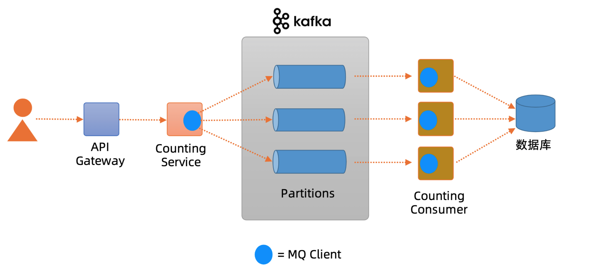
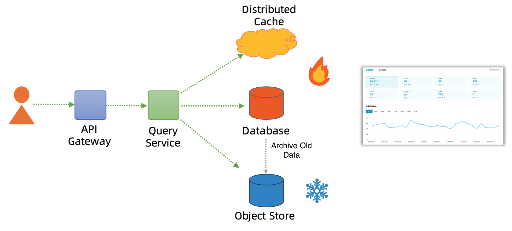
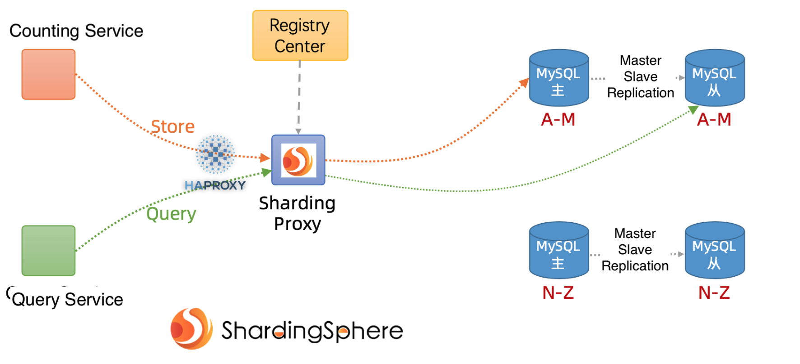
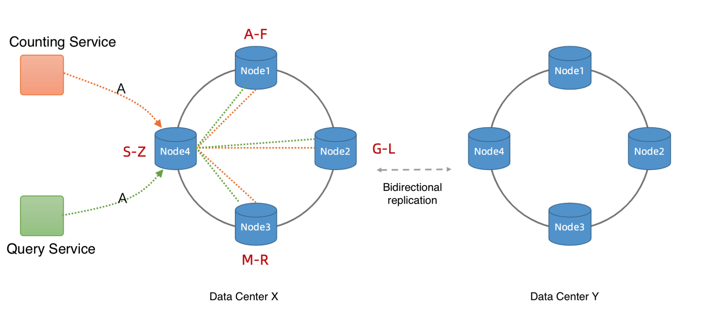
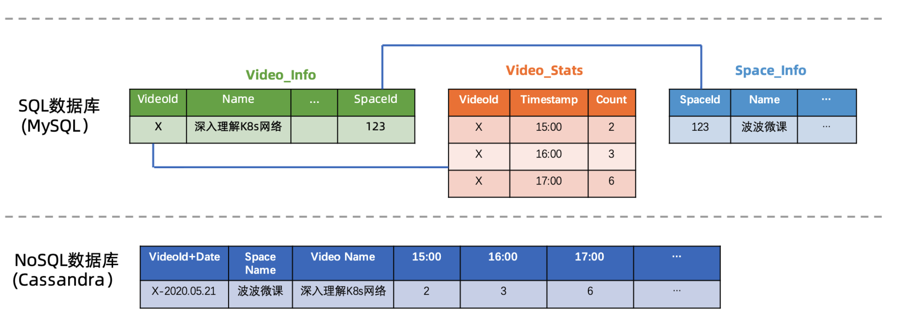
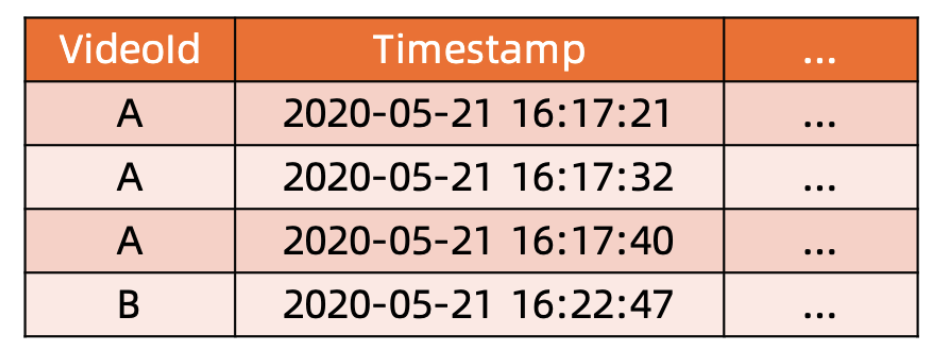
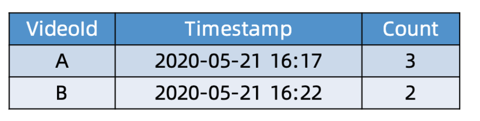

<!-- MarkdownTOC -->

- [Heavy hitters / Find top k in a data stream](#heavy-hitters--find-top-k-in-a-data-stream)
	- [Single treeMap](#single-treemap)
	- [HashMap + PriorityQueue](#hashmap--priorityqueue)
	- [LFU cache](#lfu-cache)
	- [Count-min sketch](#count-min-sketch)
	- [Lossy counting](#lossy-counting)
- [Counter service design](#counter-service-design)
	- [Nonfunctional requirements](#nonfunctional-requirements)
	- [High level design](#high-level-design)
		- [Counting service](#counting-service)
		- [Query service](#query-service)
	- [Detailed component design / Specific counter scenarios](#detailed-component-design--specific-counter-scenarios)
		- [Count of twitter comments, likes, followers](#count-of-twitter-comments-likes-followers)
			- [Naive impl with database](#naive-impl-with-database)
				- [MySQL](#mysql)
				- [NoSQL](#nosql)
			- [Introduce cache layer - Redis](#introduce-cache-layer---redis)
				- [Redis sorted set](#redis-sorted-set)
					- [Persistence](#persistence)
		- [Count of unread system notifications](#count-of-unread-system-notifications)
		- [Count of unread message in newsfeed](#count-of-unread-message-in-newsfeed)
	- [Follow-up questions](#follow-up-questions)
- [Real world](#real-world)

<!-- /MarkdownTOC -->
# Heavy hitters / Find top k in a data stream
## Single treeMap
  * TC: O(nlgm)
  * SC: O(m)

## HashMap + PriorityQueue
  * Parameters
  	- n: number of records
  	- m: number of distinct entries
  	- K: target k
  * TC: O(n + mlgk) = O(n)
  	- Count frequency: O(n)
  	- Calculate top K: O(mlgk)
  * SC: O(n + k)
  	- HashMap: O(n)
  	- PriorityQueue: O(k)

## LFU cache
* DLL + HashMap based LFU cache (approximate answer)
  * TC: O(n + k)
  * SC: O(n)
  * Cons:
	- All low frequency will be hashed to same value, which will result in incorrect result (low possibility)
	- Some low frequency words will come later, which will have a great count, then replace other high frequency words (bloom filter)
		+ HashMap will have 3 different hash functions
		+ Choose the lowest count from hashmap

## Count-min sketch


## Lossy counting


# Counter service design

```
┌───────────────┐           ┌───────────────┐            ┌───────────────┐
│   Counting    │           │               │            │               │
│    Service    │──────────▶│    Storage    │◀───────────│ Query Service │
│               │           │               │            │               │
└───────────────┘           └───────────────┘            └───────────────┘
```

## Nonfunctional requirements
* Low latency: 
* Write latency
* Read latency
* High availability

## High level design
### Counting service
* API gateway
* Counting service: User could not directly write into MQ, need to write through counting service
* MQ
* Counting consumer



### Query service



## Detailed component design / Specific counter scenarios
### Count of twitter comments, likes, followers
#### Naive impl with database
##### MySQL
* Schema



* Pros:
  * 
* Cons:
  * 

##### NoSQL
* Schema:



* Schema:



* Pros:
  * 
* Cons:
  * 

#### Introduce cache layer - Redis
* Aggregate events before 
  * Store raw event
  	- Pros: Fast write. 
  	- Cons: High cost on storage. Slow query because need to aggregate.



  * Store aggregated events
  	- Pros: Fast query. Low cost on storage.
  	- Cons: If an error occurs, no way to recover.



##### Redis sorted set
* Sorted set structure: Time window => Histogram

###### Persistence
* Redis + SSD

### Count of unread system notifications
* 

### Count of unread message in newsfeed
* 

## Follow-up questions
* How to solve hot partition
* How to monitor system health
* How to solve slow consumer
* How to identify performance bottleneck 

# Real world
* [Trend at instagram](https://instagram-engineering.com/trending-on-instagram-b749450e6d93)
* [Trend at Twitter](https://blog.twitter.com/engineering/en_us/a/2015/building-a-new-trends-experience.html)
  * Whitepaper: https://blog.twitter.com/en_us/a/2015/trend-detection-social-data.html
* [Strom near real time](https://www.michael-noll.com/blog/2013/01/18/implementing-real-time-trending-topics-in-storm/)
* [Microsoft](https://devblogs.microsoft.com/cse/2019/01/02/real-time-time-series-analysis-at-scale-for-trending-topics-detection/#:~:text=Detecting%20trending%20topics%20requires%20the,the%20entire%20set%20of%20topics.)
* [Pinterest trends](https://medium.com/pinterest-engineering/pinterest-trends-insights-into-unstructured-data-b4dbb2c8fb63)
* [Weibo](https://www.cnblogs.com/wt645631686/p/13878284.html)

