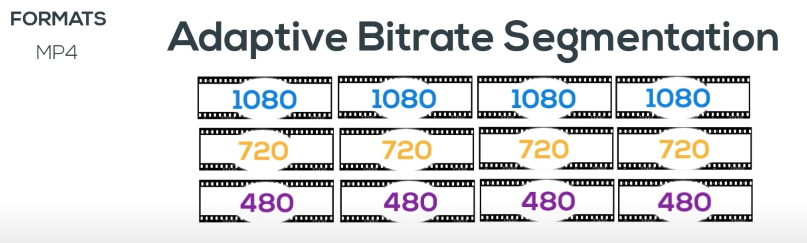
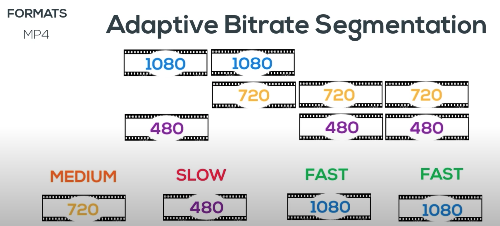
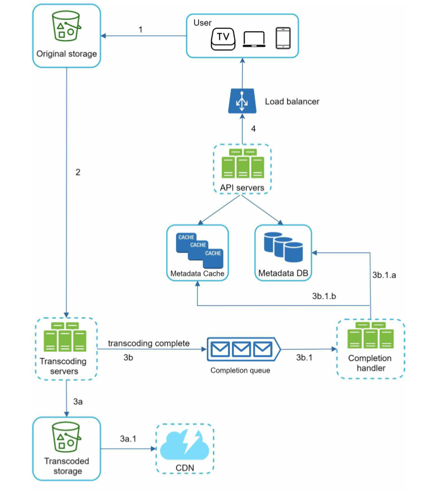
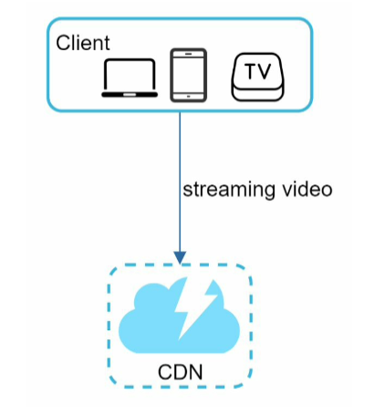
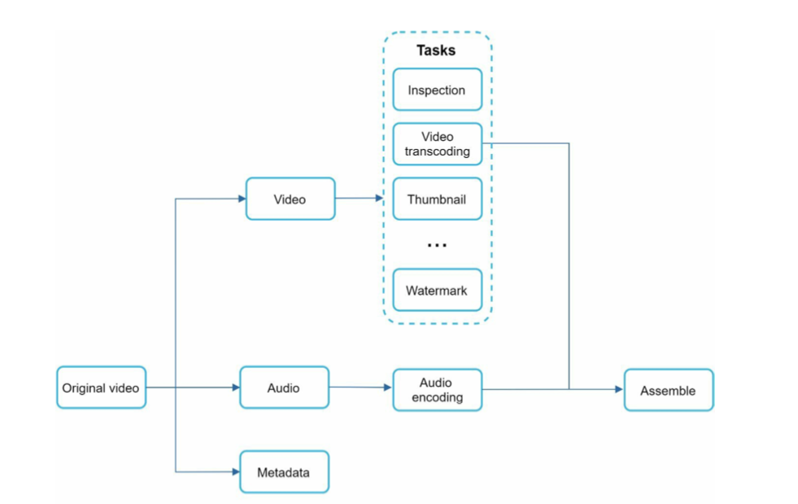
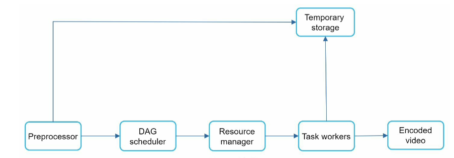
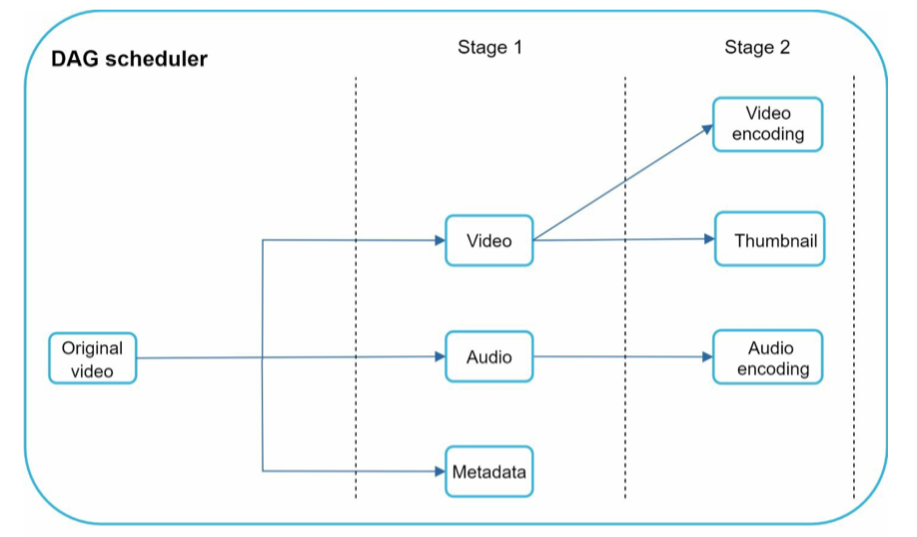
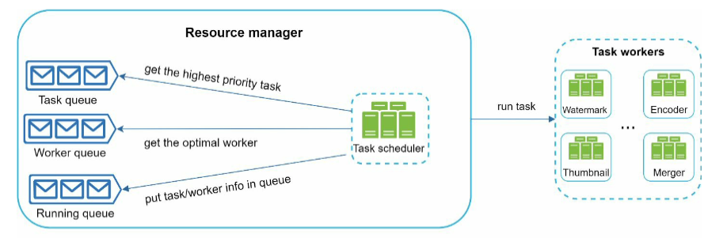
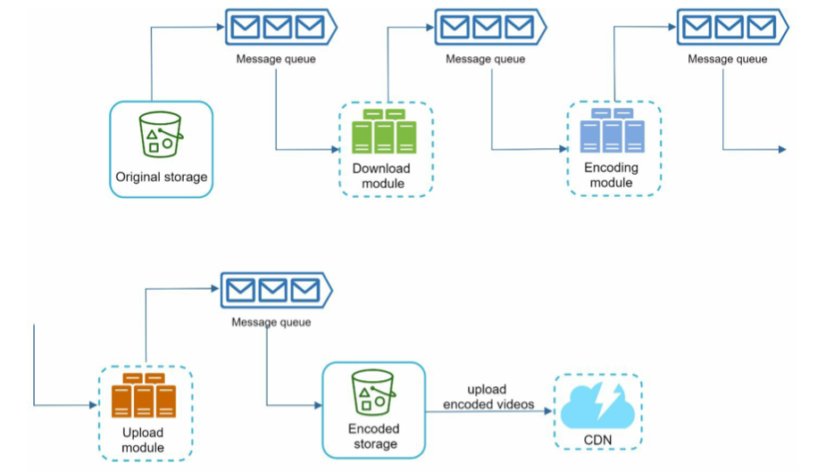
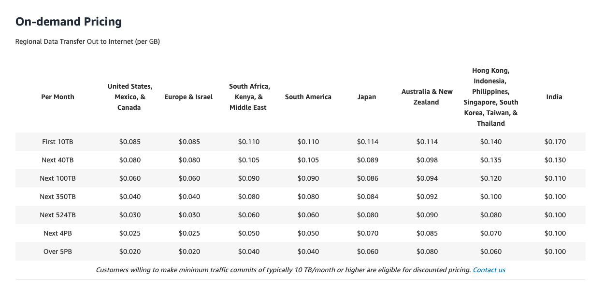

- [Video streaming service](#video-streaming-service)
  - [Basic concepts](#basic-concepts)
    - [Protocols, Codecs and containers](#protocols-codecs-and-containers)
    - [Adaptive bitrate segmentation](#adaptive-bitrate-segmentation)
  - [High level architecture](#high-level-architecture)
    - [Video uploading flow](#video-uploading-flow)
    - [Video streaming flow](#video-streaming-flow)
  - [Detailed component design](#detailed-component-design)
    - [Flowchart](#flowchart)
    - [Video transcoding](#video-transcoding)
      - [Motivation](#motivation)
      - [Encoding format](#encoding-format)
      - [Flowchart](#flowchart-1)
        - [Preprocessing](#preprocessing)
        - [DAG scheduler](#dag-scheduler)
        - [Resource manager](#resource-manager)
        - [Temporary storage](#temporary-storage)
    - [Storage](#storage)
  - [Optimization](#optimization)
    - [Parallel upload](#parallel-upload)
    - [Cost saving](#cost-saving)
      - [CDN cost](#cdn-cost)
  - [Real world practices](#real-world-practices)
    - [Netflix](#netflix)
      - [Popularity prediction](#popularity-prediction)
      - [Proactive caching](#proactive-caching)
      - [Open Connect Appliances](#open-connect-appliances)
        - [Structure](#structure)
        - [Flowchart](#flowchart-2)
          - [Identify the delta content](#identify-the-delta-content)
          - [Calculate the best route](#calculate-the-best-route)
          - [Tiered fetching approach](#tiered-fetching-approach)
    - [Facebook](#facebook)

# Video streaming service
## Basic concepts
### Protocols, Codecs and containers
  * Container: Represented by video file extension. It includes video stream, audio stream and metadata (bitrate, device, resolution, time of creation, subtitles, etc.)  
    * FLV: Flash video format created by Adobe.
    * MP4: Standard MPEG-4 format.
    * WMV: Windows media video.
    * MOV: Apple quicktime
  * Codecs: 
    * Video codecs: 
      * H.264 - the most commonly used video format
      * H.265(HEVC) - double compression rate of H.264, however need triple resources to encode, proprietary protocol. 
      * VP9
      * Av1 
    * Audio codecs:
      * MP3 - Popular with wide support. Save space without noticeable quality loss. Limited functionality. 
      * AAC - Widely supported. More efficient than MP3. Limit on audio channel.
      * AC3 
  * Protocols: A standardized set of rules for storing containers, codecs, metadata, and folder structure. 
    * TCP/IP based
      * RTP: RTSP and RTCP
      * RTMP: Real time messaging protocol
    * HTTP based
      * MPEG4 (MPEG-4 Part10/12/14 )
      * HLS (Http Live stream)
        * .m3u8
      * MPEG-DASH (Dynamic adaptive streaming over HTTP)
  * References:
    * [video1](https://www.youtube.com/watch?v=XvoW-bwIeyY&ab_channel=Qencode)
    * [video2](https://www.youtube.com/watch?v=ek1xWmgZlTM&ab_channel=livestreamninja)


### Adaptive bitrate segmentation
* Video could be encoded into different resolution frames. In terms of which frames to play, it could be decided based on the network speed. 




 

## High level architecture


### Video uploading flow
* Upload video



* Upload metadata


### Video streaming flow

## Detailed component design
* [Distributed processing at FB scale](https://www.cs.princeton.edu/~wlloyd/papers/sve-sosp17.pdf)



### Flowchart
* Inspection: Make sure videos have good quality and not malformed.
* Video transcoding: Videos are converted to support different container/codec. 
* Thumbnail: Can be manually uploaded by the user or automatically generated by the system.
* Watermark: An image overlay on top of your video contains identifying information about your video. 



### Video transcoding
#### Motivation
* Raw video consumes large amount of storage space. 
* Many browsers and devices only support certain form of encoding.
* To deliver good user experience, it is feasible to deliver high resolution video to users who have high network bandwidth and low resolution video to users who have low network bandwidth. 

#### Encoding format
* Most encoding consists of two components:
  * Container: .avi, .mp4, etc. A basket that contains the video file, metadata, etc.
  * Codecs: Compression and decompression algorithm. 

#### Flowchart 



##### Preprocessing
  1. Video splitting: Video stream is split into smaller groups of segments.
  2. DAG generation: Generates DAG based on configuration files client programs write.

##### DAG scheduler
* A sample DAG scheduler



##### Resource manager
* Contains three queues and a task scheduler
  * Task queue: PQ contains tasks
  * Worker queue: Worker utilization info
  * Running queue: Currently running tasks
  * Task scheduler: Which worker to execute the task
* Process:
  1. The task scheduler gets the highest priority task from the task queue.
  2. The task scheduler gets the optimal task worker to run the task from the worker queue. 
  3. The task scheduler instructs the chosen task worker to run the task.
  4. The task scheduler binds the task/worker info and puts it in the running queue.
  5. The task scheduler removes the job from the running queue once the job is done.



##### Temporary storage
* Multiple storage options are used including blob storage, memory, etc.

### Storage
* How does Youtube serve high quality videos with low latency: https://www.8bitmen.com/youtube-architecture-how-does-it-serve-high-quality-videos-with-low-latency/
* How does Youtube store so many videos: https://www.8bitmen.com/youtube-database-how-does-it-store-so-many-videos-without-running-out-of-storage-space/

## Optimization
### Parallel upload
* Introduce message queue between component to make the process asynchronous. 
  * The encoding module does not need to wait for the download module. 
  * The upload module does not need to wait for encoding module. 




### Cost saving
#### CDN cost
* CDN is expensive, especially when the data size is large. 
  * Using Amazon CDN as example https://aws.amazon.com/cloudfront/pricing/
  * Assume 100% of traffic is served from the United States. The average cost per GB is $0.02. For simplicity, we only calculate the cost of video streaming.
• 5 million * 5 videos * 0.3GB * $0.02 = $150,000 per day.



* How to reduce the CDN cost
  * Only serve the most popular contents from CDN and other videos from webserver
  * Some videos are popular only in certain regions. There is no need to distribute these videos to other regions.
  * Build your own CDN like Netflix and partner with Internet Service Providers ( Comcast, AT&T, Verizon, etc.). Building your CDN is a giant project; however, this could make sense for large streaming companies. 

## Real world practices
### Netflix
#### Popularity prediction
* Although the number and size of the files that make up Netflix content library can be staggering, Netflix is able to use sophisticated popularity models to predict what its users will watch and when. 
* Being able to predict with accuracy, Netflix could do the following:
  * Avoid read/write contention by reducing disk reads (content serving) while we are performing disk writes (adding new content to the OCAs), we are able to optimize our disk efficiency.
  * Pre-positioning content to avoid any significant utilization of internet “backbone” capacity.

#### Proactive caching
* Take the continent of Australia, for example. All access to internet content that does not originate in Australia comes via a number of undersea cables. Rather than using this expensive undersea capacity to serve Netflix traffic, we copy each file once from our US-based transcoding repository to the storage locations within Australia. This is done during off-peak hours, when we’re not competing with other internet traffic. After each file is on the continent, it is then replicated to dozens of Open Connect servers within each ISP network.


#### Open Connect Appliances
##### Structure
* OCAs are grouped into manifest clusters. Each manifest cluster gets configured with 
  1. an appropriate content region (the group of countries that are expected to stream content from the cluster)
  2. a particular popularity feed (which in simplified terms is an ordered list of titles/content, based on previous data about their popularity)
  3. how many copies of the content it should hold.
* Manifest clusters are then grouped into fill clusters. A fill cluster is a group of manifest clusters that have a shared content region and popularity feed.


##### Flowchart

```
                     ┌────────────────────────────────────────────────────────────┐                                          
                     │                     AWS control panel                      │                                          
                     │                                                            │                                          
                     │  ┌───────────────────────────────────────────────────┐     │                                          
                     │  │* For each content, AWS control panel will elect an│     │                                          
                     │  │OCA as master. This election info is stored within │     │                                          
                     │  │the escalation policy within each OCA device.      │     │                                          
                     │  │                                                   │     │                                          
                  ┌─▶│  │* The fill escalation policies that are applied to │     │────────────────────────┐                 
                  │  │  │masters typically allow them to reach farther with │     │                        │                 
                  │  │  │less delay in order to grab that content and then  │     │                        │                 
                  │  │  │share it locally with non-masters.                 │     │                        │                 
                  │  │  │                                                   │     │                        │                 
                  │  │  └───────────────────────────────────────────────────┘     │                        │                 
                  │  │                                                            │                        │                 
                  │  │                                                            │                        │                 
                  │  └────────▲─────────────────────────────────┬─────────────────┘                        │                 
                  │           │                                 │                                          │                 
                  │           │                                 │                                          │                 
                  │           │                                 │                                          │                 
                  │           │                                 │                                          │                 
                  │           │               Step4. For each asked                                        │                 
                  │       Step3. If           content, return a list of                                    │                 
                  │      there is a           potential download locations.                                │                 
  Step1. Regular pull     delta in            The download location is          Step2. AWS control panel   │                 
 what are the list of     content,            determined based on the            returns a list of files   │                 
content I should store    manifest            following factors:│                cluster A should store    │                 
                  │       will ask                              │                                          │                 
                  │      for a list           1. Content availability                                      │                 
                  │      of content           2. Download location health                                  │                 
                  │           │               3. Route cost     │                                          │                 
                  │           │                                 │                                          │                 
                  │           │                                 │                                          │                 
    ┌ ─ ─ ─ ─ ─ ─ ┼ ─ ─ ─ ─ ─ ┼ ─ ─ ─ ─ ─ ─ ─ ─ ─ ─ ─ ─ ─ ─ ─ ─ ┼ ─ ─ ─ ─ ─ ─ ─ ─ ─ ─ ─ ─ ─ ─ ─ ─ ─ ─ ─ ─ ─│─ ─ ─ ─ ─ ─ ─ ─ ┐
                  │           │                                 │                                          │                 
    │          ┌──┼───────────┼─────────────────────────────────┼──────────────────────────────────────────┼──────────────┐ │
               │  │           │                                 │                                          │              │  
    │          │  │           │                                 │                                          │              │ │
               │  │           │                                 ▼                                          │              │  
    │          │  │  ┌──────────────────────────────────────────────────────────────────────────────────┐  │              │ │
               │  │  │                                      OCA 1                                       │  │              │  
    │          │  │  │  ┌─────────────────────────────────────────────────────┐                         │  │              │ │
               │  │  │  │Fill escalation policy:                              │                         │  │              │  
    │          │  │  │  │                                                     │                         │  │              │ │
               │  │  │  │1. How many hops away an OCA can go to download      │                         │  │              │  
    │          │  │  │  │content, and how long it should wait before doing so │                         │  │              │ │
               │  │  │  │2. Whether the OCA can go to the entire Open Connect │                         │  │              │  
    │          │  └──│  │network (beyond the hops defined above), and how long│                         │◀─┘              │ │
               │     │  │it should wait before doing so                       │                         │                 │  
    │          │     │  │3. Whether the OCA can go to S3, and how long it     │                         │                 │ │
               │     │  │should wait before doing so                          │                         │                 │  
    │          │     │  │                                                     │                         │                 │ │
               │     │  └─────────────────────────────────────────────────────┘                         │                 │  
    │          │     │                                                                                  │                 │ │
               │     └────────────┬────────────────────┬────────────────────────────┬───────────────────┘                 │  
    │          │                  │                    │                            │                                     │ │
               │     Step5. For a delta content,       │                            │                                     │  
    │          │      prefer peer fill if it is        │                            │                                     │ │
               │              available                │                            │                                     │  
    │          │                  │              Step6. For a missing               │                                     │ │
               │                  │              content, go to tier                │                                     │  
    │          │                  ▼               fill if available                 │                                     │ │
               │    ┌───────────────────────────┐      │                       Step7. For a missing                       │  
    │          │    │ OCA M (assume as elected  │      │                        content, directly                         │ │
               │    │   master for content K)   │      │                     download from Amazon S3.                     │  
    │          │    └───────────────────────────┘      │                            │                                     │ │
               │                                       │     Manifest cluster       │                                     │  
    │          └───────────────────────────────────────┼────────────────────────────┼─────────────────────────────────────┘ │
                                                       │                            │                                        
    │                                                  │                            │                                       │
                                                       ▼                            │          ┌───────────────────────┐     
    │                ┌────────────────────────────────────────────────────────┐     │          │  Manifest cluster H   │    │
                     │                   Manifest cluster C                   │     │          └───────────────────────┘     
    │                │               (AWS selected fill master)               │     │                                       │
                     │                                                        │     │          ┌───────────────────────┐     
    │                └────────────────────────────────────────────────────────┘     │          │  Manifest cluster Z   │    │
                                                                                    │          └───────────────────────┘     
    │                                                                               │                                       │
                                                                                    │                                        
    │                                                                               │                                       │
                                                          Fill cluster              │                                        
    └ ─ ─ ─ ─ ─ ─ ─ ─ ─ ─ ─ ─ ─ ─ ─ ─ ─ ─ ─ ─ ─ ─ ─ ─ ─ ─ ─ ─ ─ ─ ─ ─ ─ ─ ─ ─ ─ ─ ─ ┼ ─ ─ ─ ─ ─ ─ ─ ─ ─ ─ ─ ─ ─ ─ ─ ─ ─ ─ ─ ┘
                                                                                    │                                        
                                                                                    │                                        
                                                                                    │                                        
                                                                                    │                                        
                                                                                    ▼                                        
                                                                   ┌─────────────────────────────────┐                       
                                                                   │            Amazon S3            │                       
                                                                   └─────────────────────────────────┘                       
```

###### Identify the delta content
* Fill source manifests: OCAs do not store any information about other OCAs in the network, title popularity, etc. All of this information is aggregated and stored in the AWS control plane. 
  * Step1/2: OCAs communicate at regular intervals with the control plane services, requesting (among other things) a manifest file that contains the list of titles they should be storing and serving to members. 
  * Step3: If there is a delta between the list of titles in the manifest and what they are currently storing, each OCA will send a request, during its configured fill window, that includes a list of the new or updated titles that it needs. 
  * Step4: The response from the control plane in AWS is a ranked list of potential download locations, a.k.a. fill sources, for each title. The determination of the list takes into consideration several high-level factors:
    * Title (content) availability — Does the fill source have the requested title stored?
    * Fill health — Can the fill source take on additional fill traffic?
    * A calculated route cost — Described in the next section.

###### Calculate the best route
* It would be inefficient, in terms of both time and cost, to distribute a title directly from S3 to all of our OCAs, so we use a tiered approach. The goal is to ensure that the title is passed from one part of our network to another using the most efficient route possible.
* To calculate the least expensive fill source, we take into account network state and some configuration parameters for each OCA that are set by the Open Connect Operations team. For example:
  * BGP path attributes and physical location (latitude / longitude)
  * Fill master (number per fill cluster)
  * Fill escalation policies
* A fill escalation policy defines:
  * How many hops away an OCA can go to download content, and how long it should wait before doing so
  * Whether the OCA can go to the entire Open Connect network (beyond the hops defined above), and how long it should wait before doing so
  * Whether the OCA can go to S3, and how long it should wait before doing so

###### Tiered fetching approach
* The control plane elects the specified number of OCAs as masters for a given title asset. The fill escalation policies that are applied to masters typically allow them to reach farther with less delay in order to grab that content and then share it locally with non-masters.
* Given all of the input to our route calculations, rank order for fill sources works generally like this:
  * Peer fill: Available OCAs within the same manifest cluster or the same subnet
  * Tier fill: Available OCAs outside the manifest cluster configuration
  * Cache fill: Direct download from S3


* Reference: https://netflixtechblog.com/netflix-and-fill-c43a32b490c0

### Facebook
* Proactive CDN caching at Facebook: https://www.youtube.com/watch?v=CbbeSg1t224&ab_channel=JustinMiller
* Building and scaling a performant CDN: https://www.youtube.com/watch?v=TLbzvbfWmfY&ab_channel=Fastly

