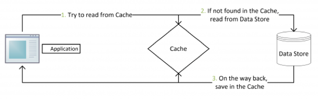
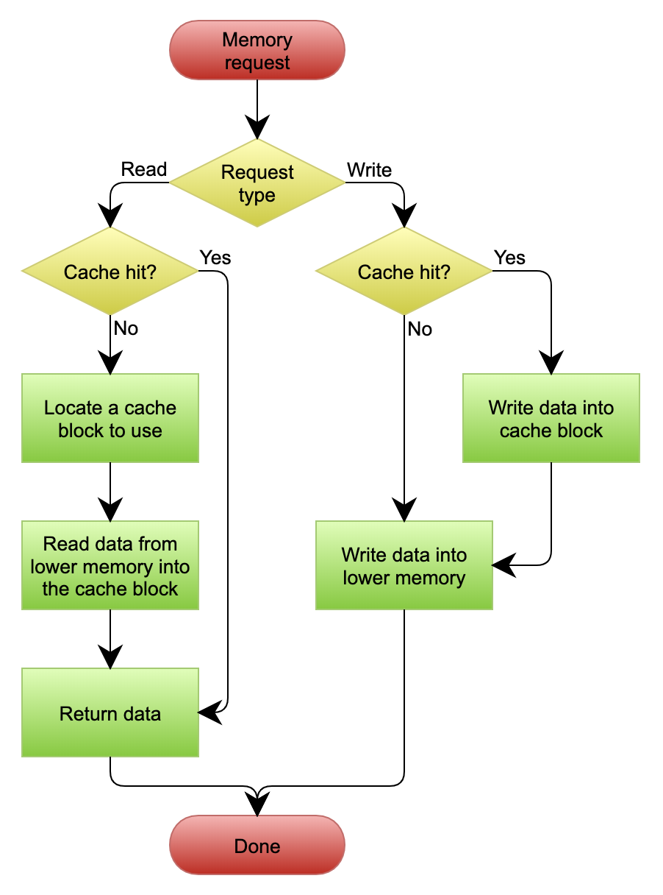
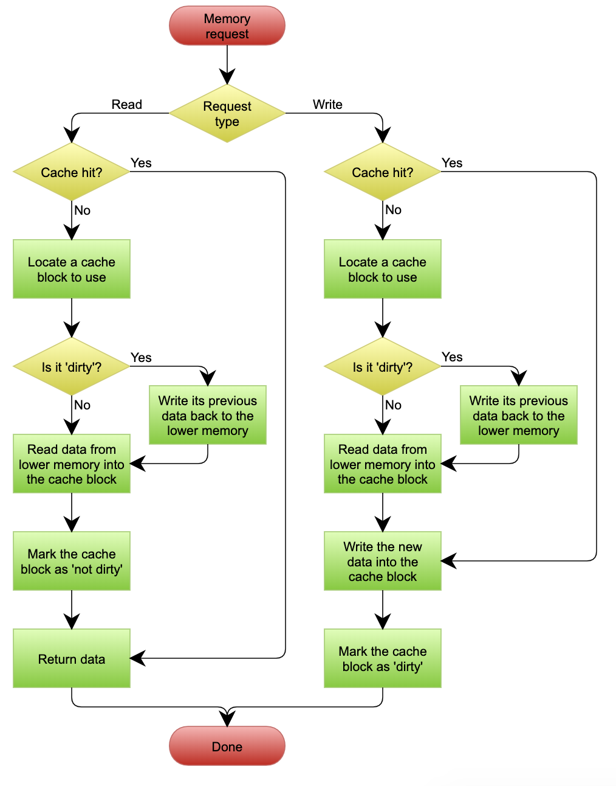
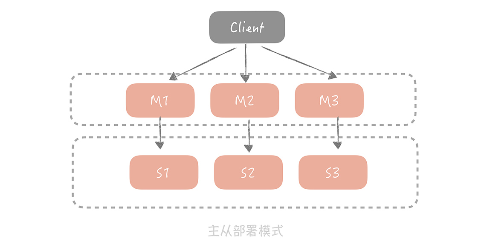
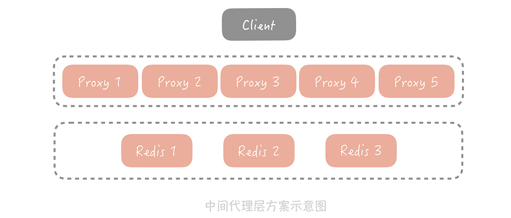

<!-- MarkdownTOC -->

- [Distributed cache](#distributed-cache)
  - [Intuition](#intuition)
  - [Factors for hit ratio](#factors-for-hit-ratio)
  - [Applicable scenarios](#applicable-scenarios)
  - [Access pattern](#access-pattern)
    - [Cache aside](#cache-aside)
      - [Use case](#use-case)
      - [Potential issues](#potential-issues)
        - [Data inconsistency](#data-inconsistency)
        - [Cache hit ratio](#cache-hit-ratio)
      - [Flowchart](#flowchart)
        - [What if update cache instead of invalidate cache after writing to DB](#what-if-update-cache-instead-of-invalidate-cache-after-writing-to-db)
        - [What if invalidate cache first and then write to DB](#what-if-invalidate-cache-first-and-then-write-to-db)
    - [Read/Write through](#readwrite-through)
      - [Use case](#use-case-1)
      - [Potential issues](#potential-issues-1)
        - [Low performance](#low-performance)
      - [Flowchart](#flowchart-1)
    - [Write behind/back cache](#write-behindback-cache)
      - [Use case](#use-case-2)
      - [Potential issues](#potential-issues-2)
        - [Lose update](#lose-update)
      - [Flowchart](#flowchart-2)
    - [Write around cache](#write-around-cache)
  - [High availability](#high-availability)
    - [Client layer solution](#client-layer-solution)
      - [Sharding](#sharding)
        - [Consistency hashing](#consistency-hashing)
        - [Memcached master-slave](#memcached-master-slave)
        - [Multiple copies](#multiple-copies)
    - [Proxy layer solution](#proxy-layer-solution)
    - [Server layer solution](#server-layer-solution)
  - [Popular issues](#popular-issues)
    - [Cache penetration](#cache-penetration)
      - [Solutions](#solutions)
        - [Cache empty/default values](#cache-emptydefault-values)
        - [Bloomberg filter](#bloomberg-filter)
          - [Read](#read)
          - [Write](#write)
        - [Cache everything](#cache-everything)
    - [Cache avalanch](#cache-avalanch)
      - [Solutions](#solutions-1)
    - [Race condition](#race-condition)
      - [Solutions](#solutions-2)
        - [Distributed lock](#distributed-lock)
    - [Hot key](#hot-key)
      - [Solutions](#solutions-3)
    - [Data inconsistency](#data-inconsistency-1)
      - [Inconsistency between DB and distributed cache](#inconsistency-between-db-and-distributed-cache)
        - [Solutions](#solutions-4)
          - [Native cache aside pattern](#native-cache-aside-pattern)
          - [Transaction](#transaction)
          - [Messge queue](#messge-queue)
          - [Subscribe MySQL binlog as a slave](#subscribe-mysql-binlog-as-a-slave)
      - [inconsistency between local and distributed cache](#inconsistency-between-local-and-distributed-cache)
        - [Solutions](#solutions-5)
    - [Big key](#big-key)
      - [Scenarios](#scenarios)
      - [Diagnose](#diagnose)
      - [Solutions](#solutions-6)
        - [Delete big keys in the background](#delete-big-keys-in-the-background)
        - [Compression](#compression)
        - [Split key](#split-key)
  - [Design](#design)
    - [When to introduce multi-level caches](#when-to-introduce-multi-level-caches)
  - [Scaling Memcached at Facebook](#scaling-memcached-at-facebook)
  - [Real world](#real-world)
  - [TODO](#todo)

<!-- /MarkdownTOC -->


# Distributed cache
## Intuition
* Locality of reference
* Long tail

## Factors for hit ratio 
* Size of cache key space
    - The more unique cache keys your application generates, the less chance you have to reuse any one of them. Always consider ways to reduce the number of possible cache keys. 
* The number of items you can store in cache
    - The more objects you can physically fit into your cache, the better your cache hit ratio.
* Longevity
    - How long each object can be stored in cache before expiring or being invalidated. 

## Applicable scenarios
* short answer
  * How many times a cached piece of data can and is reused by the application
  * the proportion of response time that is alleviated by caching
* In applications that are I/O bound, most of the response time is getting data from a database.

## Access pattern
### Cache aside
#### Use case
* Most widely used pattern in distributed applications. Popular cache frameworks such as Redis / Memcached opt this approach by default. 

#### Potential issues
##### Data inconsistency
* Possibility of data inconsistency. However, the scenario doesn't happen frequently because the read operation need to happen before write and finish after write and it is unlikely that the read operation is slower than write operation. 

```
// data inconsistency
┌───────────┐         ┌───────────┐         ┌───────────┐         ┌───────────┐
│ Request A │         │ Request B │         │   Cache   │         │ Database  │
└───────────┘         └───────────┘         └───────────┘         └───────────┘
                                                                               
      │                     │                     │                     │      
      │                     │     cache miss      │                     │      
      │─────────────────────┼────────────────────▶│                     │      
      │                     │                     │                     │      
      │                     │                     │                     │      
      │                     │                     │                     │      
      ├─────────────────────┼read 20 from database┼─────────────────────▶      
      │                     │                     │                     │      
      │                     │                     │                     │      
      │                     │                     │                     │      
      │                     │                     │                     │      
      │                     │─────────Update database value to 21───────▶      
      │                     │                     │                     │      
      │                     │                     │                     │      
      │                     │      invalidate     │                     │      
      │                     ├─────────cache───────▶                     │      
      │                     │                     │                     │      
      │                     │                     │                     │      
      │                     │                     │                     │      
      │                     │                     │                     │      
      ├──────────update cache value to 20────────▶│                     │      
      │                     │                     │                     │      
      │                     │                     │                     │      
      │                     │                     │                     │      
```

##### Cache hit ratio
* When write operation happens frequently, cache data will be invalidated frequently. As a result, the cache hit ratio might suffer. Two possible solutions:
    - Update cache while update database, and put two operations in a distributed lock. 
    - Update cache while update database, and set a low expiration time for cache.

#### Flowchart



##### What if update cache instead of invalidate cache after writing to DB
* It will cause the following two problems: 
    - Data inconsistency
    - Lose update

```
// Data inconsistency
┌───────────┐         ┌───────────┐         ┌───────────┐         ┌───────────┐
│ Request A │         │ Request B │         │   Cache   │         │ Database  │
└───────────┘         └───────────┘         └───────────┘         └───────────┘
                                                                               
      │                     │                     │                     │      
      │                     │                     │                     │      
      ├───────────────────Update database value to 20───────────────────▶      
      │                     │                     │                     │      
      │                     │                     │                     │      
      │                     │                     │                     │      
      │                     │                     │                     │      
      │                     │───────Update database value to 21─────────▶      
      │                     │                     │                     │      
      │                     │                     │                     │      
      │                     │                     │                     │      
      │                     │                     │                     │      
      │                     │                     │                     │      
      │                     │    update cache     │                     │      
      │                     │─────value to 21─────▶                     │      
      │                     │                     │                     │      
      │                     │                     │                     │      
      │                     │                     │                     │      
      │                     │                     │                     │      
      │                     │                     │                     │      
      ├────────────Update cache value to 20───────▶                     │      
      │                     │                     │                     │      
      │                     │                     │                     │      
      │                     │                     │                     │      
```

```
// Lose update
┌───────────┐         ┌───────────┐         ┌───────────┐         ┌───────────┐
│ Request A │         │ Request B │         │   Cache   │         │ Database  │
└───────────┘         └───────────┘         └───────────┘         └───────────┘
                                                                               
      │                     │                     │                     │      
      │                     │                     │                     │      
      ├────────────Get value from cache───────────┼▶                    │      
      │                     │                     │                     │      
      │                     │                     │                     │      
      │                     │                     │                     │      
      │                     │     Get value       │                     │      
      │                     │─────from cache──────▶                     │      
      │                     │                     │                     │      
      │                     │                     │                     │      
      │                     │                     │                     │      
      │                     │                     │                     │      
      │                     │                     │                     │      
      │                     │                     │                     │      
      │                     │───────────Increment 1 and update value────▶      
      │                     │                     │                     │      
      │                     │                     │                     │      
      │                     │                     │                     │      
      │                     │                     │                     │      
      │                     │                     │                     │      
      ├─────────────────────┼─Increment 1 and update value──────────────▶      
      │                     │                     │                     │      
      │                     │                     │                     │      
      │                     │                     │                     │      
```

* How to solve the above problem? There are three possible ways: 
    1. A single transaction coordinator. 2PC
    2. Many transaction coordinators, with an elected master via Paxos or Raft consensus algorithm. Paxos
    3. Deletion of elements from memcached on DB updates
* 3 above is selected because 1 and 2 will cause performance and stability cost. 

##### What if invalidate cache first and then write to DB
* It will result in data inconsistency problems

```
┌───────────┐         ┌───────────┐         ┌───────────┐         ┌───────────┐
│ Request A │         │ Request B │         │   Cache   │         │ Database  │
└───────────┘         └───────────┘         └───────────┘         └───────────┘
                                                                               
      │                     │                     │                     │      
      │                     │                     │                     │      
      ├───────────Invalidate cache value──────────┼▶                    │      
      │                     │                     │                     │      
      │                     │                     │                     │      
      │                     │                     │                     │      
      │                     │                     │                     │      
      │                     │─────cache miss──────▶                     │      
      │                     │                     │                     │      
      │                     │                     │                     │      
      │                     │                     │                     │      
      │                     │─────────Read value 20 from database───────▶      
      │                     │                     │                     │      
      │                     │                     │                     │      
      │                     │                     │                     │      
      │                     │     update cache    │                     │      
      │                     ├─────────to 20───────▶                     │      
      │                     │                     │                     │      
      │                     │                     │                     │      
      │                     │                     │                     │      
      ├────────────────────update database value to 21──────────────────▶      
      │                     │                     │                     │      
      │                     │                     │                     │      
      │                     │                     │                     │      
```

### Read/Write through
#### Use case
* Client does not need to manage two connections towards cache and repository, separately. Everything could be managed by the cache itself. 
* Used more often in local cache (e.g. Guava cache's loading cache)

#### Potential issues
##### Low performance
* Write to database and write to cache happens synchronously. 

#### Flowchart
* def: write go through the cache and write is confirmed as success only if writes to DB and the cache both succeed.



### Write behind/back cache
#### Use case
* Used more often in operating system's write to cache
* When you need quick write latency and high write throughput. 
    - Linux page cache algorithm
    - Asynchronously write message to disk in message queue

#### Potential issues
##### Lose update
* Message is not persisted to disk asynchronouly

#### Flowchart



### Write around cache
* def: write directly goes to the DB. The cache reads the info from DB in case of a miss
* use-case: lower write load to cache and faster writes, but can lead to higher read latency in case of applications which write and re-read the information quickly

## High availability
### Client layer solution
#### Sharding
##### Consistency hashing
* Pros: 
    + Low impact on hit ratio
* Cons: 
    + Cache node is not distributed evenly inside the ring
    + Dirty data: Suppose there are two nodes A and B in cluster. Initially pair (k,3) exists within cache A. Now a request comes to update k's value to 4 and cache A goes offline so the update load on cache B. Then cache A comes back online. Next time when client gets value, it will read 3 inside cache A instead of 4 inside cache B. 
        - Must set cache expiration time

##### Memcached master-slave 



##### Multiple copies


### Proxy layer solution
* All client read/write requests will come through the proxy layer. 
* The high availability strategy is implemented within the proxy layer.
* E.g. Facebook's Mcrouter, Twitter's Twemproxy, Codis



### Server layer solution
* Redis Sentinel


## Popular issues

### Cache penetration
#### Solutions

* Note: All 1-4 bullet points could be used separately. 

1. Cache key validation (step1)
2. Cache empty values (step2)
3. Bloom filter (step3)
4. Cache entire dataset in cache (step4)

```
┌───────┐   ┌──────────┐   ┌─────────────┐  ┌────────┐   ┌────────┐  ┌────────┐
│       │   │  step1:  │   │step2: cache │  │ step3: │   │ Step4. │  │        │
│Client │──▶│ Request  │──▶│empty values │─▶│ bloom  │──▶│ Cache  │─▶│ Cache  │
│       │   │validation│   │             │  │ filter │   │everythi│  │        │
└───────┘   └──────────┘   └─────────────┘  └──────*─┘   └────────┘  └────────┘
```

##### Cache empty/default values

* Cons: Might need large space for empty values. As a result, cache entries for non-empty entries might be purged out. 

```

Object nullValue = new Object();
try 
{
  Object valueFromDB = getFromDB(uid); 
  if (valueFromDB == null) 
  {
    cache.set(uid, nullValue, 10);   
  } 
  else 
  {
    cache.set(uid, valueFromDB, 1000);
  }
} 
catch(Exception e) 
{
  cache.set(uid, nullValue, 10);
}
```

##### Bloomberg filter
* Use case
    - Time complexity: O(1) read/write
    - Space complexity: Within 1 billion records (roughly 1.2GB memory)

* Potential issues
    - False positives
        - Solution: Use multiple hash algorithm to calculate multiple hash values
    - No support for delete
        - Solution: Store a counter for each entry 

###### Read

```
┌───────────┐         ┌───────────┐         ┌───────────┐         ┌───────────┐
│ Request A │         │ Request B │         │   Cache   │         │ Database  │
└───────────┘         └───────────┘         └───────────┘         └───────────┘
                                                                               
      │     lookup bloom    │                     │                     │      
      │        filter       │                     │                     │      
      │─────────────────────▶                     │                     │      
      │                     │                     │                     │      
      │                     │                     │                     │      
      │                     │                     │                     │      
      ├────────────────lookup cache──────────────▶│                     │      
      │                     │                     │                     │      
      │                     │                     │                     │      
      │                     │                     │                     │      
      │                     │                     │                     │      
      ├─────────────────────┼──lookup database────┼─────────────────────▶      
      │                     │                     │                     │      
      │                     │                     │                     │      
      │                     │                     │                     │      
      ├──────────────write to cache───────────────▶                     │      
      │                     │                     │                     │      
      │                     │                     │                     │      
      │                     │                     │                     │      
```

###### Write

```
┌───────────┐       ┌───────────────┐       ┌───────────┐         ┌───────────┐
│  Client   │       │ Bloom Filter  │       │   Cache   │         │ Database  │
└───────────┘       └───────────────┘       └───────────┘         └───────────┘
                                                                               
      │                     │                     │                     │      
      │ write bloom filter  │                     │                     │      
      │─────────────────────▶                     │                     │      
      │                     │                     │                     │      
      │                     │                     │                     │      
      │                     │                     │                     │      
      ├─────────────────────┼───write database────┼─────────────────────▶      
      │                     │                     │                     │      
      │                     │                     │                     │      
      │                     │                     │                     │      
      │                     │                     │                     │      
                                                                        │      
```

##### Cache everything
* In especially high traffic scenario (e.g. Amazon black Friday), even a small volume of cache penetration could still cause DB to go down. 
* Please refer to [DB and distributed cache consistency](https://github.com/DreamOfTheRedChamber/system-design/blob/master/distributedCache.md#consistency-between-db-and-distributed-cache) for ways to keep the two storage consistent. 

### Cache avalanch
#### Solutions
1. Jitter to expiration time
2. Rate limiting / Circuit breaker to DB
3. Open distributed cache persistence option for fast recovery
4. Background refresh
    * The first client to request data past the stale date is asked to refresh the data, while subsequent requests are given the stale but not-yet-expired data as if it were fresh, with the understanding that it will get refreshed in a 'reasonable' amount of time by that initial request.

```
                      ┌─────────────────────────────────────────────────────────────────────────────────┐
                      │                                Distributed cache                                │
                      │                                                                         Step4.  │
                      │                                                                   ┌──────back ─┐│
    .─────────.       │                                                                   │     ground ││
 ,─'           '─.    │                                                                   ▼            ││
;   step 1. add   :   │  ┌──────────────────────┐  ┌──────────────────────┐   ┌──────────────────────┐ ││
:    jitter to    ;   │  │Entry A               │  │Entry ..              │   │Entry N               │ ││
 ╲expiration time╱    │  │Expiration with jitter│  │Expiration with jitter│   │Expiration with jitter│ ││
  '─.         ,─'     │  └──────────────────────┘  └──────────────────────┘   └──────────────────────┘ ││
     `───────'        │               │                                                   │            ││
                      │               │                                                   │            ││
                      │               ▼                                                   └────────────┘│
    .─────────.       │   ┌ ─ ─ ─ ─ ─ ─ ─ ─ ─ ─ ─ ─ ─ ─ ─ ─ ─ ─ ─ ─ ─ ─ ─ ─ ─ ─ ─ ─ ─ ─ ─ ─ ─ ─ ─ ─ ─   │
 ,─'           '─.    │                            Step 3. Persistent to disk                        │  │
; step 2. circuit :   │   │                                                                             │
: breaker / rate  ;   │    ─ ─ ─ ─ ─ ─ ─ ─ ─ ─ ─ ─ ─ ─ ─ ─ ─ ─ ─ ─ ─ ─ ─ ─ ─ ─ ─ ─ ─ ─ ─ ─ ─ ─ ─ ─ ─ ┘  │
 ╲   limiting    ╱    │                                                                                 │
  '─.         ,─'     └─────────────────────────────────────────────────────────────────────────────────┘
     `───────'                                                                                           
                        ┌ ─ ─ ─ ─ ─ ─ ─ ─ ─ ─ ─ ─ ─ ─ ─ ─ ─ ─ ─ ─ ─ ─ ─ ─ ─ ─ ─ ─ ─ ─ ─ ─ ─ ─ ─ ─ ─      
                                               circuit breaker / rate limiter                      │     
                        │                                                                                
                         ─ ─ ─ ─ ─ ─ ─ ─ ─ ─ ─ ─ ─ ─ ─ ─ ─ ─ ─ ─ ─ ─ ─ ─ ─ ─ ─ ─ ─ ─ ─ ─ ─ ─ ─ ─ ─ ┘     
                                                                                                         
                      ┌────────────────────────────────────────────────────────────────────────────────┐ 
                      │                                                                                │ 
                      │                                    Database                                    │ 
                      │                                                                                │ 
                      └────────────────────────────────────────────────────────────────────────────────┘ 
```

### Race condition
* Many readers read an empty value from the cache and subseqeuntly try to load it from the database. The result is unnecessary database load as all readers simultaneously execute the same query against the database.

#### Solutions
##### Distributed lock
* Scenario: Multiple requests get value from cache and all have cache miss. Then they simultaneously fetch value from DB to update distributed cache. 
* To make sure there are no race conditions, the following two conditions need to be met to order the updates.
    1. Every instance need to get a distributed lock before updating value in cache.
    2. Each value also has a corresponding timestamp which is obtained from DB.

```
                      ┌─────────────────┐                       
                      │                 │                       
          ┌──────────▶│Distributed Cache│◀──────────┐           
          │           │                 │           │           
          │           └─────────────────┘           │           
          │                    ▲                    │           
        Value1,                │                ValueN,         
       timestamp1              │               timestampN       
          │                Value2,                  │           
          │               timeStamp2                │           
          │                    │                    │           
          │                    │                    │           
    ┌──────────┐         ┌──────────┐         ┌──────────┐      
    │          │         │          │         │          │      
    │ Client A │         │Client ...│         │ Client N │      
    │          │         │          │         │          │      
    └──────────┘         └──────────┘         └──────────┘      
          │                    │                    │           
          │                    │                    │           
          │                    │                    │           
          │          Get distributed lock:          │           
          │                     Failed              │           
          │                    │                    │           
Get distributed lock:          │          Get distributed lock: 
       Succeed                 ▼                 Succeed        
          │           ┌─────────────────┐           │           
          │           │                 │           │           
          └──────────▶│    Zookeeper    │◀──────────┘           
                      │                 │                       
                      └─────────────────┘                       
```

### Hot key
#### Solutions
* Note: All 1-4 bullet points could be used separately. 

1. Detect hot key (step2/3)
    - The one showed in the flowchart is a dynamic approach. There are several ways to decide hot keys:
        * Within proxy layer
        * Within client
        * Use redis shipped commands ./redis-cli --hotkeys
2. Randomly hash to multiple nodes instead of only one (step4)
3. Enable local cache for hot keys (step5)
4. Circuit breaker kicks in if detecting cache failure (step6)

* References: https://juejin.im/post/6844903765733015559

```
   ┌───────────────┐                                                                                    
   │               │                                                                                    
   │    Client     │                                                                                    
   │               │                                                                                    
   │               │                                                                                    
   └───────────────┘                                                                                    
     │    │     │                                                                                       
     │    │     │                                                                                       
     │    │     │                                                               ┌──────────────────────┐
     │    │     │                                                               │ Configuration center │
     │    │     │    ─ ─ ─ ─ ─ ─ ─ step0. subscribe to hot key changes ─ ─ ─ ─ ▶│                      │
     │    │     │   │                                                           │   (e.g. Zookeeper)   │
     │  Step1:  │                                                               └┬─────────────────────┘
     │ Requests │   │                                                            │          ▲           
     │ come in  │                                                                │          │           
     │    │     │   │                                                            │          │           
     │    │     │   ┌─────────────Step3. Hot key change is published─────────────┘          │           
     │    │     │   │                                                                       │           
     │    │     │   │                                                                       │           
     │    │     │   │                                                                     Yes           
     │    │     │   │                                                                       │           
     ▼    ▼     ▼   ▼                                                                       │           
   ┌─────────────────────────────────┐                                                      │           
   │           App Cluster           │                                                      │           
   │                                 │    step 2:    ┌─────────────────────────┐       .─────────.      
   │ ┌ ─ ─ ─ ┐  ┌ ─ ─ ─ ┐  ┌ ─ ─ ─ ┐ │   aggregate   │    Stream processing    │      ╱           ╲     
   │   local      local      local   ├───to detect ─▶│                         │────▶(Is it hot key)    
   │ │ cache │  │ cache │  │ cache │ │    hot keys   │      (e.g. Flink)       │      `.         ,'     
   │  ─ ─ ─ ─    ─ ─ ─ ─    ─ ─ ─ ─  │               └─────────────────────────┘        `───────'       
   │     ▲                           │                                                                  
   │ ┌ ─ ╬ ─ ─ ─ ─ ─ ─ ─ ─ ─ ─ ─ ─ ┐ │                                                                  
   │     ║  step 6. circuit breaker  │                                                                  
   │ │   ║                         │ │                                                                  
   │  ─ ─║─ ─ ─ ─ ─ ─ ─ ─ ─ ─ ─ ─ ─  │                                                                  
   └─────╬───────────────────────────┘                                                                  
         ║          │                  step4. For the same hot key,                                     
         ║          │                 randomly map to multiple nodes                                    
┌──────────────┐    │                        instead of only 1                                          
│ Step5. Cache │    └───────────────┬──────────────────────────────────────┐                            
│hot key within│                    │                                      │                            
│ local cache  │                    │                                      │                            
└──────────────┘         ┌──────────▼──────────────────────────────────────▼──────────┐                 
                         │  ┌ ─ ─ ─ ─ ─ ─ ─     ┌ ─ ─ ─ ─ ─ ─ ─    ┌ ─ ─ ─ ─ ─ ─ ─    │                 
                         │    distributed  │      distributed  │     distributed  │   │                 
                         │  │ cache node A      │ cache node B     │ cache node C     │                 
                         │   ─ ─ ─ ─ ─ ─ ─ ┘     ─ ─ ─ ─ ─ ─ ─ ┘    ─ ─ ─ ─ ─ ─ ─ ┘   │                 
                         │                                                            │                 
                         │                       Cache Cluster                        │                 
                         └────────────────────────────────────────────────────────────┘                 
```

### Data inconsistency 
#### Inconsistency between DB and distributed cache
##### Solutions
###### Native cache aside pattern
* Cons:
    - If updating to database succeed and updating to cache fails, 

```
┌───────────┐       ┌───────────────┐                             ┌───────────┐
│  Client   │       │  distributed  │                             │ Database  │
│           │       │     cache     │                             │           │
└───────────┘       └───────────────┘                             └───────────┘
                                                                               
      │                     │                                           │      
      │                     │                                           │      
      ├─────────────────────┼────write database─────────────────────────▶      
      │                     │                                           │      
      │                     │                                           │      
      │                     │                                           │      
      │                     │                                           │      
      │                     │                                           │      
      │                     ◀──────────────invalidate cache─────────────┤      
      │                     │                                           │      
      │                     │                                           │      
      │                     │                                           │      
      │                     │                                           │      
```

###### Transaction
* Put redis and mySQL update inside a transaction
    - Performance cost

###### Messge queue
* Cons:
    - Additional cost for maintaining a message queue
    - If there are multiple updates to the DB, its sequence in message queue might be mixed.

```
┌───────────┐       ┌───────────────┐       ┌───────────┐         ┌───────────┐
│  Client   │       │  distributed  │       │  Message  │         │ Database  │
│           │       │     cache     │       │   Queue   │         │           │
└───────────┘       └───────────────┘       └───────────┘         └───────────┘
                                                                               
      │                     │                     │                     │      
      │                     │                     │                     │      
      ├─────────────────────┼────write database───┼─────────────────────▶      
      │                     │                     │                     │      
      │                     │                     │                     │      
      │                     │                     │                     │      
      │                     │                     │                     │      
      │                     │                     │        Send a       │      
      │                     │                     │◀─────message to─────┤      
      │                     │                     │      invalidate     │      
      │                     │                     │                     │      
      │                     │                     │                     │      
      │                     │                     │                     │      
      │                     │                     │                     │      
      │                     │      invalidate     │                     │      
      │                     ◀─────────cache───────┤                     │      
      │                     │                     │                     │      
      │                     │                     │                     │      
      │                     │                     │                     │      
      │                     │                     │                     │      
```

###### Subscribe MySQL binlog as a slave

```
┌───────────┐    ┌───────────────┐     ┌───────────────┐    ┌─────────────┐      ┌─────────────┐
│           │    │               │     │               │    │Fake db slave│      │  Database   │
│  Client   │    │  distributed  │     │ Message queue │    │             │      │             │
│           │    │     cache     │     │               │    │(e.g. canal) │      │(e.g. MySQL) │
│           │    │               │     │               │    │             │      │             │
└───────────┘    └───────────────┘     └───────────────┘    └─────────────┘      └─────────────┘
      │                 │                   │                     │                     │       
      │                 │                   │                     │                     │       
      │                 │                   │                     │                     │       
      │                 │                   │                     │                     │       
      ├──────────Subscribe to MQ────────────▶                     │                     │       
      │                 │                   │                     │                     │       
      │                 │                   │                     │                     │       
      │                 │                   │                     │    subscribe to     │       
      │                 │                   │                     ├──binlog as a slave──▶       
      │                 │                   │                     │                     │       
      │                 │                   │                     │                     │       
      │                 │                   │                     │                     │       
      ├─────────────────┼──────────────write database─────────────┼─────────────────────▶       
      │                 │                   │                     │                     │       
      │                 │                   │                     │                     │       
      │                 │                   │                     │                     │       
      │                 │                   │                     │    publish binlog   │       
      │                 │                   │                     │◀──────to slave──────┤       
      │                 │                   │        convert      │                     │       
      │                 │                   │       binlog to     │                     │       
      │                 │                   ◀──────message and ───┤                     │       
      │                 │                   │        publish      │                     │       
      │                 │                   │                     │                     │       
      │                 │                   │                     │                     │       
      ◀───────receive published message─────┤                     │                     │       
      │                 │                   │                     │                     │       
      │                 │                   │                     │                     │       
      │   update        │                   │                     │                     │       
      ├───cache─────────▶                   │                     │                     │       
      │                 │                   │                     │                     │       
      │                 │                   │                     │                     │       
      │                 │                   │                     │                     │       
```

#### inconsistency between local and distributed cache
##### Solutions

```
// Scenario: update distributed cache as administrator operations
┌───────────┐       ┌───────────────┐       ┌───────────┐         ┌───────────┐
│application│       │  local cache  │       │distributed│         │ Database  │
│           │       │               │       │   cache   │         │           │
└───────────┘       └───────────────┘       └───────────┘         └───────────┘
                                                                               
      │                     │                     │                     │      
      │                     │                     │                     │      
      ├──────────────subscribe to change──────────▶                     │      
      │                     │                     │                     │      
      │                     │                     │                     │      
      │                     │                     │        update       │      
      │                     │                     │◀──────value as ─────┤      
      │                     │                     │        admin        │      
      │                     │                     │                     │      
      │                     │                     │                     │      
      ◀──────────receive published message────────┤                     │      
      │                     │                     │                     │      
      │                     │                     │                     │      
      │                     │                     │                     │      
      │     update          │                     │                     │      
      ├───local cache───────▶                     │                     │      
      │                     │                     │                     │      
      │                     │                     │                     │      
      │                     │                     │                     │      
      │                     │                     │                     │      
```

### Big key
#### Scenarios
* Star's follower list
* Comments under hot topic
* Value stores too many items(e.g. redis Hash/List/Set/SortedSet)
    - The upper limit size is 2^32
    - As long as number of items inside collection >= 1 million, the latency is roughly 1s. 

#### Diagnose
* Using redis as example

```
>= redis 4.0, memory usage command
< redis 4.0
    1. bgsave, redis-rdb-tool: export rdb file and analyse
    2. redis-cli --bigkeys: find big keys
    3. debug object key: look for the length of serialized key
```

#### Solutions
##### Delete big keys in the background 
* Using redis as example

```
// Redis introduced Lazyfreeze commands "unlink"/"flushallasync"/"flushdbasync" commands to delete the item in the 
// background. When deleting an object, only logical deletion is made and then the object is thrown to the background. 

Slve-lazy-flush: Clear data options after slave receives RDB files
Lazy free-lazy-eviction: full memory ejection option
Lazy free-lazy-expire: expired key deletion option
lazyfree-lazy-server-del: Internal deletion options, such as rename oldkey new key, need to be deleted if new key exists
```

##### Compression
* When cache value is bigger than a certain size, use compression. 

##### Split key
* Under the same key, limit the size of buckets. 

## Design 
### When to introduce multi-level caches

## Scaling Memcached at Facebook
* In a cluster:
    - Reduce latency
        + Problem: Items are distributed across the memcached servers through consistent hashing. Thus web servers have to rountinely communicate with many memcached servers to satisfy a user request. As a result, all web servers communicate with every memcached server in a short period of time. This all-to-all communication pattern can cause incast congestion or allow a single server to become the bottleneck for many web servers. 
        + Solution: Focus on the memcache client. 
    - Reduce load
        + Problem: Use memcache to reduce the frequency of fetching data among more expensive paths such as database queries. Web servers fall back to these paths when the desired data is not cached. 
        + Solution: Leases; Stale values;
    - Handling failures
        + Problem: 
            * A small number of hosts are inaccessible due to a network or server failure.
            * A widespread outage that affects a significant percentage of the servers within the cluster.
        + Solution: 
            * Small outages: Automated remediation system.
            * Gutter pool
    - In a region: Replication
    - Across regions: Consistency

## Real world
* Cache warming at Netflix: https://netflixtechblog.com/cache-warming-agility-for-a-stateful-service-2d3b1da82642
* From RAM to SSD Data caching at Netflix: https://netflixtechblog.com/evolution-of-application-data-caching-from-ram-to-ssd-a33d6fa7a690
* Netflix SSD data caching: https://netflixtechblog.com/application-data-caching-using-ssds-5bf25df851ef
* Netflix global caching: https://netflixtechblog.com/caching-for-a-global-netflix-7bcc457012f1
* Instagram thundering problem: https://instagram-engineering.com/thundering-herds-promises-82191c8af57d
* Instagram using Redis: https://instagram-engineering.com/storing-hundreds-of-millions-of-simple-key-value-pairs-in-redis-1091ae80f74c
* Background data fetching: https://instagram-engineering.com/improving-performance-with-background-data-prefetching-b191acb39898

## TODO
* [All things caching- use cases, benefits, strategies, choosing a caching technology, exploring some popular products](https://medium.datadriveninvestor.com/all-things-caching-use-cases-benefits-strategies-choosing-a-caching-technology-exploring-fa6c1f2e93aa)