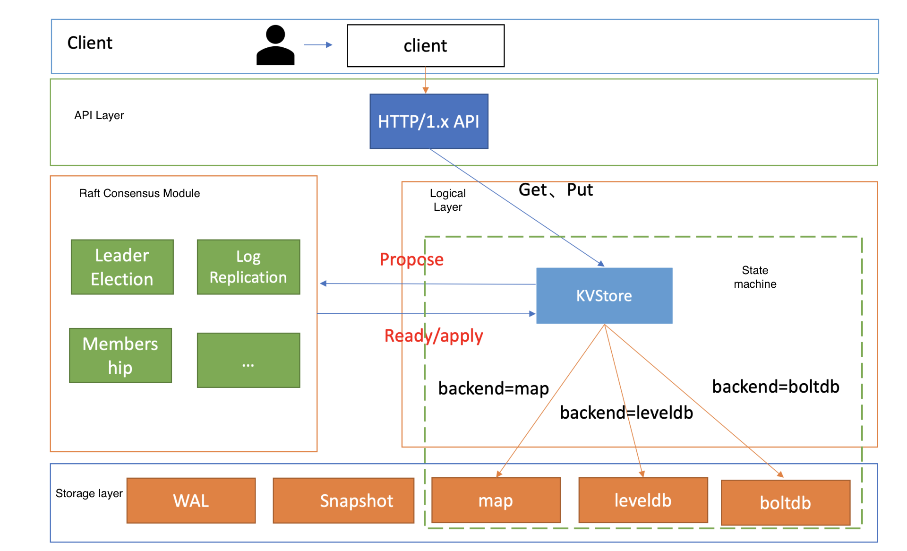
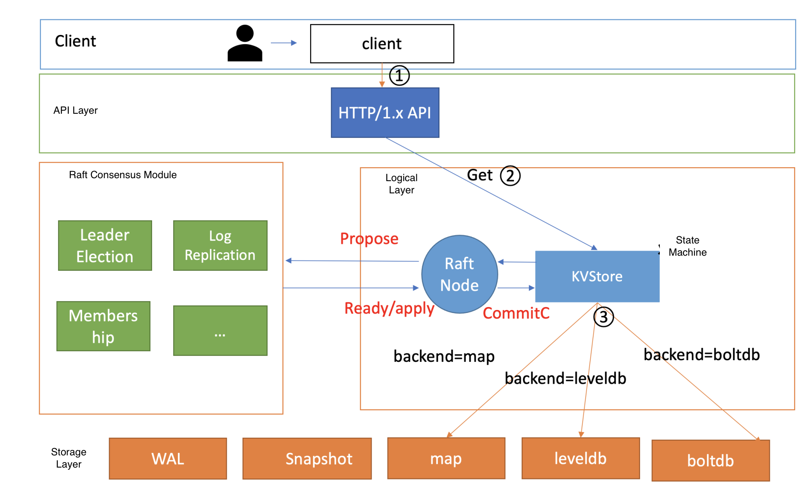
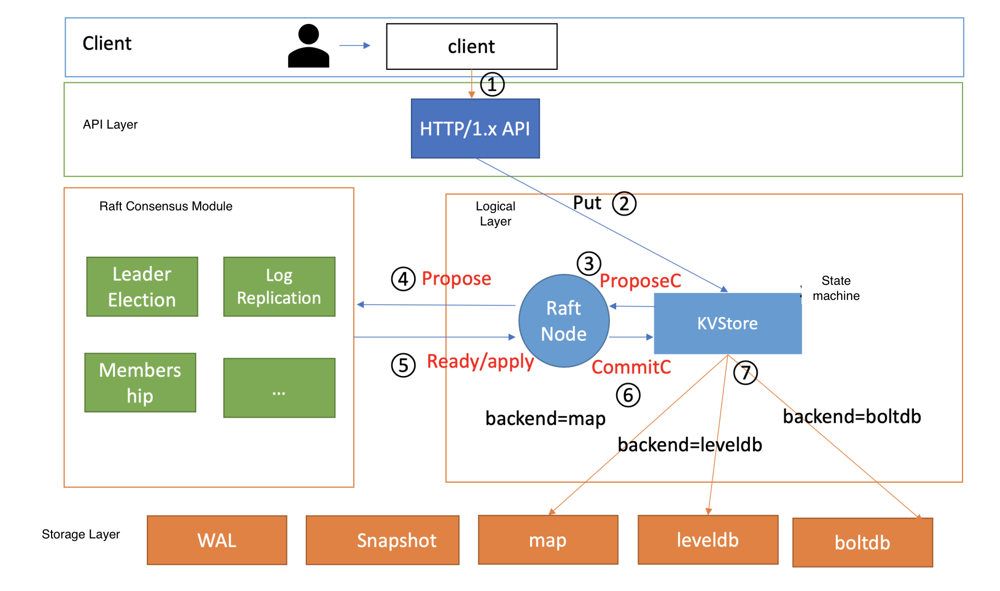

- [Key value store](#key-value-store)
	- [Requirements](#requirements)
	- [Standalone solution](#standalone-solution)
		- [Design thoughts](#design-thoughts)
		- [Initial design flow chart](#initial-design-flow-chart)
			- [Read process](#read-process)
			- [Write process](#write-process)
			- [Pros](#pros)
			- [Cons](#cons)
	- [Distributed "sharding proxy"](#distributed-sharding-proxy)
		- [Design thoughts](#design-thoughts-1)
		- [Flow chart](#flow-chart)
			- [Read process](#read-process-1)
			- [Write process](#write-process-1)
	- [Raft based](#raft-based)
		- [Overview](#overview)
			- [Read process](#read-process-2)
			- [Write process](#write-process-2)
		- [Storage engine](#storage-engine)
			- [boltdb](#boltdb)
			- [leveldb](#leveldb)
	- [Reference](#reference)
	- [TODO](#todo)

# Key value store
## Requirements
* API
	- value get(Key)
	- set(key, value)
		+ Modify existing entry (key, value)
		+ Create new entry (key, value)
* Index support

## Standalone solution
### Design thoughts
1. Sorted file with (Key, Value) entries
	- Disk-based binary search based read O(lgn)
	- Linear read operations write O(n)
2. Unsorted file with (Key, Value) entries. Then build index on top of it. 
	- Linear read operations O(n)
	- Constant time write O(1)
3. Combine append-only write and binary search read
	- Process: 
		- Break the large table into a list of smaller tables 0 to N
			+ 0 to N-1 th tables are all stored in disk in sorted order as File 0 to File N-1.
			+ Nth table is stored in disk unsorted as File N.
		- Have a in-memory table mapping mapping tables/files to its address.
	- Write: O(1)
		- Write directly goes to the Nth table/file.
		- If the Nth table is full, sort it and write it to disk. And then create a new table/file.
	- Read: O(n)
		- Linearly scan through the Nth table.  
		- If cannot find, perform binary search on N-1, N-2, ..., 0th. 
4. Store the Nth table/file in memory
	* Disk-based approach vs in-memory approach
		- Disk-based approach: All data Once disk reading + disk writing + in-memory sorting
		- In-memory approach: All data Once disk writing + in-memory sorting
	* What if memory is lost?
		- Problem: Nth in memory table is lost. 
		- Write ahead log / WAL: The WAL is the lifeline that is needed when disaster strikes. Similar to a BIN log in MySQL it records all changes to the data. This is important in case something happens to the primary storage. So if the server crashes it can effectively replay that log to get everything up to where the server should have been just before the crash. It also means that if writing the record to the WAL fails the whole operation must be considered a failure. Have a balance between between latency and durability.

5. Further optimization
	- Write: How to Save disk space. Consume too much disk space due to repetitive entries (Key, Value)
		+ Have a background process doing K-way merge for the sorted tables regularly
	- Read: 
		+ Optimize read with index
			* Each sorted table should have an index inside memory. 
				- The index is a sketch of key value pairs
			* More advanced way to build index with B tree. 
		+ Optimize read with Bloom filter
			* Each sorted table should have a bloomfilter inside memory. 
			* Accuracy of bloom filter
				- Number of hash functions
				- Length of bit vector
				- Number of stored entries

### Initial design flow chart

```
      ┌─────────────────────────────┐              ┌─────────────────────────┐         
      │Read tries to find the entry │              │                         │         
      │in the following order:      │              │Write directly happens to│         
      │1. in-memory sorted list     │              │  in-memory sorted list  │         
      │2. If not found, then search │              │                         │         
      │the in-disk sorted list in   │              │                         │         
      │reverse chronological order -│              └──────┬─────────▲────────┘         
      │newer ones first, older ones │                     │         │                  
      │later                        │                     │         │                  
      └─────────────────────────────┘                     │         │                  
                                                          │         │                  
                                                          │         │                  
┌─────────────────────────────────────────────────────────┼─────────┼─────────────────┐
│                                     Data Server         │         │                 │
│                                                         │         │                 │
│   ┌─────────────────────────────────────────────────────┼─────────┼──────────┐      │
│   │                          In-Memory sorted list      │         │          │      │
│   │                                                     │         │          │      │
│   │                               key1, value1          ▼         │          │      │
│   │                               key2, value2                               │      │
│   │                                   ...                                    │      │
│   │                               keyN, valueN                               │      │
│   └──────────────────────────────────────────────────────────────────────────┘      │
│                                                                                     │
│                                                                                     │
│                                                                                     │
│   ┌────────────┐   ┌────────────┐  ┌────────────┐   ┌────────────┐  ┌────────────┐  │
│   │bloom filter│   │bloom filter│  │            │   │bloom filter│  │bloom filter│  │
│   │and index 1 │   │and index 2 │  │   ......   │   │ and index  │  │and index N │  │
│   │            │   │            │  │            │   │    N-1     │  │            │  │
│   └────────────┘   └────────────┘  └────────────┘   └────────────┘  └────────────┘  │
│                                                                                     │
│   ┌────────────┐   ┌────────────┐  ┌────────────┐   ┌────────────┐  ┌────────────┐  │
│   │            │   │            │  │            │   │            │  │            │  │
│   │  In-disk   │   │  In-disk   │  │            │   │  In-disk   │  │  In-disk   │  │
│   │sorted list │   │sorted list │  │   ......   │   │sorted list │  │sorted list │  │
│   │     1      │   │     2      │  │            │   │    N-1     │  │     N      │  │
│   │            │   │            │  │            │   │            │  │            │  │
│   │            │   │            │  │            │   │            │  │            │  │
│   └────────────┘   └────────────┘  └────────────┘   └────────────┘  └────────────┘  │
│                                                                                     │
└─────────────────────────────────────────────────────────────────────────────────────┘
                                                                                       
                                                                                       
    ┌─────┐                                                               ┌─────┐      
   ─┤older├─────────────────────Chronological order───────────────────────┤newer├─────▶
    └─────┘                                                               └─────┘      
```

#### Read process
1. First check the Key inside in-memory skip list.
2. Check the bloom filter for each file and decide which file might have this key.
3. Use the index to find the value for the key.
4. Read and return key, value pair.

#### Write process
1. Record the write operation inside write ahead log.
2. Write directly goes to the in-memory skip list.
3. If the in-memory skip list reaches its maximum capacity, sort it and write it to disk as a Sstable. At the same time create index and bloom filter for it.
4. Then create a new table/file.

#### Pros
* Optimized for write: Write only happens to in-memory sorted list

#### Cons
* In the worst case, read needs to go through a chain of units (in-memory, in-disk N, ..., in-disk 1)
	- Compaction could help reduce the problem

## Distributed "sharding proxy"
### Design thoughts
1. Master slave model
	* Master has the hashmap [Key, server address]
	* Slave is responsible for storing data
	* Read process
		1. Client sends request of reading Key K to master server. 
		2. Master returns the server index by checking its consistent hashmap.
		3. Client sends request of Key to slave server. 
			1. First check the Key pair inside memory.
			2. Check the bloom filter for each file and decide which file might have this key.
			3. Use the index to find the value for the key. 
			4. Read and return key, value pair
	* Write process
		1. Clients send request of writing pair K,V to master server.
		2. Master returns the server index
		3. Clients send request of writing pair K,V to slave server. 
			1. Slave records the write operation inside write ahead log.
			2. Slave writes directly go to the in-memory skip list.
			3. If the in-memory skip list reaches its maximum capacity, sort it and write it to disk as a Sstable. At the same time create index and bloom filter for it.
			4. Then create a new table/file.

2. How to handle race condition
	* Master server also has a distributed lock (such as Chubby/Zookeeper)
	* Distributed lock 
		- Consistent hashmap is stored inside the lock server

3. (Optional) Too much data to store on slave local disk
	* Replace local disk with distributed file system (e.g. GFS) for
		- Disk size
		- Replica 
		- Failure and recovery
	* Write ahead log and SsTable are all stored inside GFS.
		- How to write SsTable to GFS
			+ Divide SsTable into multiple chunks (64MB) and store each chunk inside GFS.

4. Config server will easily become single point of failure
	* Client could cache the routing table

### Flow chart
* The dashboard lines means these network calls could be avoided if the routing table is cached on client. 

```
                                         ┌─────────────────────────────────┐      
                                         │          Config server          │      
 ┌────────────────────┐ ─ ─ ─step5─ ─ ─▶ │   (where routing table stays)   │      
 │       Client       │                  │                                 │      
 │  ┌──────────────┐  │                  │ ┌───────────┐     ┌───────────┐ │      
 │  │cache of      │  │                  │ │           │     │           │ │      
 │  │routing table │  │  ─ ─Step1─ ─ ─ ▶ │ │  Master   │     │   Slave   │ │      
 │  └──────────────┘  │                  │ │           │     │           │ │      
 └────────────────────┘ ◀─ ─ ─ Step3 ─ ─ │ └───────────┘     └───────────┘ │      
            │                            └─────────────────────────────────┘      
            │                                           │      │                  
            │                                                                     
            │                                          Step2  step 6              
            │                                                                     
            │                                           ▼      ▼                  
            └─────────Step4─────────────────────┐  ┌──────────────┐               
                                                │  │ Distributed  │               
                                                │  │     lock     │       ─       
                                                │  └──────────────┘               
                                                │                                 
                                                │                                 
                                                ▼                                 
┌───────────────┐     ┌───────────────┐    ┌───────────────┐     ┌───────────────┐
│ Data server 1 │     │ Data server 2 │    │               │     │ Data server N │
│               │     │               │    │               │     │               │
│┌────────────┐ │     │┌────────────┐ │    │    ......     │     │┌────────────┐ │
││in-memory   │ │     ││in-memory   │ │    │               │     ││in-memory   │ │
││sorted list │ │     ││sorted list │ │    │               │     ││sorted list │ │
│└────────────┘ │     │└────────────┘ │    └───────────────┘     │└────────────┘ │
│┌────────────┐ │     │┌────────────┐ │                          │┌────────────┐ │
││in-disk     │ │     ││in-disk     │ │                          ││in-disk     │ │
││sorted list │ │     ││sorted list │ │                          ││sorted list │ │
││1 and bloom │ │     ││1 and bloom │ │                          ││1 and bloom │ │
││filter/index│ │     ││filter/index│ │                          ││filter/index│ │
│└────────────┘ │     │└────────────┘ │                          │└────────────┘ │
│┌────────────┐ │     │┌────────────┐ │                          │┌────────────┐ │
││......      │ │     ││......      │ │                          ││......      │ │
│└────────────┘ │     │└────────────┘ │                          │└────────────┘ │
│┌────────────┐ │     │┌────────────┐ │                          │┌────────────┐ │
││in-disk     │ │     ││in-disk     │ │                          ││in-disk     │ │
││sorted list │ │     ││sorted list │ │                          ││sorted list │ │
││N and bloom │ │     ││N and bloom │ │                          ││N and bloom │ │
││filter/index│ │     ││filter/index│ │                          ││filter/index│ │
│└────────────┘ │     │└────────────┘ │                          │└────────────┘ │
└───────────────┘     └───────────────┘                          └───────────────┘
```

#### Read process
1. Step1: Client sends request of reading Key K to master server. 
2. Step2/3: Master server locks the key. Returns the server index by checking its consistent hashmap.
3. Step4: Client sends request of Key to slave server. 
	1. First check the Key pair inside memory.
	2. Check the bloom filter for each file and decide which file might have this key.
	3. Use the index to find the value for the key. 
	4. Read and return key, value pair
	5. Read process finishes. Slave notifies the client. 
4. Step5: The client notifies the master server to unlock the key. 
5. Step6: Master unlocks the key

#### Write process
1. step1: Clients send request of writing pair K,V to master server.
2. step2/3: Master server locks the key. Returns the server index. 
3. Step4: Clients send request of writing pair K,V to slave server. 
	1. Slave records the write operation inside write ahead log.
	2. Slave writes directly go to the in-memory skip list.
	3. If the in-memory skip list reaches its maximum capacity, sort it and write it to disk as a Sstable. At the same time create index and bloom filter for it.
	4. Then create a new table/file.
	5. Write process finishes. Slave notifies the client.
4. Step5: The client notifies the master server to unlock the key. 
5. Step6: Master unlocks the key

## Raft based 

### Overview



#### Read process
* There are multiple options for read consistency:
  * Default: Will read the old data sometimes
  * Consistent: Will not read the old data
  * Stale: Will read the old data



#### Write process
1. Client send http request to server.
2. After server receives the request, server will put the message into ProposeC channel of KVStore.
3. RaftNode submit the message to Raft Module's propose interface.
4. Raft module output Ready structure. After server persists the log entry, it will send it to other nodes. 
5. After majority nodes persisted the log entry, the log entry will be submitted to KVStore for execution. 
6. KVStore calls backend storage engine.  



### Storage engine
#### boltdb
* Based on B+ tree
* Performance benchmarks: A 3-node 8-core 16G cluster, linear read throughput is 190K QPS and write QPS is 50K QPS. 

#### leveldb
* Based on LSM tree

## Reference
* using level DB and Rocks DB as an example - https://soulmachine.gitbooks.io/system-design/content/cn/key-value-store.html
* Meituan build on top of tair and redis - https://tech.meituan.com/2020/07/01/kv-squirrel-cellar.html
* TairDB
	- hot key problem: https://zhuanlan.zhihu.com/p/32743904
	- Tair db in detail: https://www.cnblogs.com/chenny7/p/4875396.html
* LevelDB: 
	- https://leveldb-handbook.readthedocs.io/zh/latest/basic.html
	- https://zhuanlan.zhihu.com/p/51360281
* Disk IO
  * https://medium.com/databasss/on-disk-io-part-1-flavours-of-io-8e1ace1de017
* 极客时间：
  * https://time.geekbang.org/column/article/347136
  * https://time.geekbang.org/column/article/217049

## TODO
* [Build keyvalue store ontop of MySQL with Uber example](https://kousiknath.medium.com/mysql-key-value-store-a-schema-less-approach-6d243a3cee5b)
* [How does Riak use Version Vectors to resolve conflicts](https://medium.com/geekculture/all-things-clock-time-and-order-in-distributed-systems-logical-clocks-in-real-life-2-ad99aa64753)
* [How Cassandra handles conflicts](https://medium.com/geekculture/all-things-clock-time-and-order-in-distributed-systems-logical-clock-vs-google-true-time-dba552f2d842)