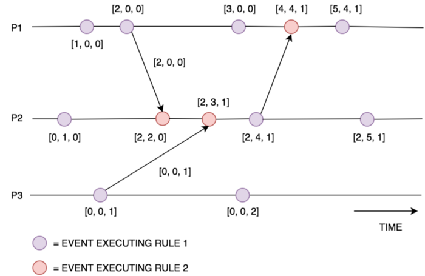

# Algorithm\_Clock

* [Time](algorithm_clock.md#time)
  * [Overview](algorithm_clock.md#overview)
  * [Physical clocks](algorithm_clock.md#physical-clocks)
    * [Quartz clock in computers](algorithm_clock.md#quartz-clock-in-computers)
      * [Def](algorithm_clock.md#def)
      * [Accuracy](algorithm_clock.md#accuracy)
      * [Cons](algorithm_clock.md#cons)
    * [Atomic clock](algorithm_clock.md#atomic-clock)
      * [Def](algorithm_clock.md#def-1)
      * [Accuracy](algorithm_clock.md#accuracy-1)
      * [Cons](algorithm_clock.md#cons-1)
    * [GPS clocks](algorithm_clock.md#gps-clocks)
      * [Def](algorithm_clock.md#def-2)
      * [Accuracy](algorithm_clock.md#accuracy-2)
      * [Cons](algorithm_clock.md#cons-2)
  * [Physical time](algorithm_clock.md#physical-time)
    * [UTC](algorithm_clock.md#utc)
    * [Leap second](algorithm_clock.md#leap-second)
    * [Could physical clock be used to order events](algorithm_clock.md#could-physical-clock-be-used-to-order-events)
    * [Network time protocol \(NTP\)](algorithm_clock.md#network-time-protocol-ntp)
      * [Architecture](algorithm_clock.md#architecture)
        * [Why hierarchy of time servers](algorithm_clock.md#why-hierarchy-of-time-servers)
      * [Accuracy](algorithm_clock.md#accuracy-3)
      * [Public NTP servers](algorithm_clock.md#public-ntp-servers)
        * [How will server sync to NTP](algorithm_clock.md#how-will-server-sync-to-ntp)
  * [Logical clock](algorithm_clock.md#logical-clock)
    * [Lamport logical clock](algorithm_clock.md#lamport-logical-clock)
      * [Algorithm](algorithm_clock.md#algorithm)
      * [Cons](algorithm_clock.md#cons-3)
    * [Vector clock](algorithm_clock.md#vector-clock)
      * [Def](algorithm_clock.md#def-3)
      * [Algorithm](algorithm_clock.md#algorithm-1)
      * [Pros](algorithm_clock.md#pros)
    * [Concurrent version clock](algorithm_clock.md#concurrent-version-clock)
      * [Def](algorithm_clock.md#def-4)
    * [Version vector](algorithm_clock.md#version-vector)
      * [Def](algorithm_clock.md#def-5)
      * [Client/Server side ID generation](algorithm_clock.md#clientserver-side-id-generation)
    * [Dotted verion vector](algorithm_clock.md#dotted-verion-vector)
      * [Pros](algorithm_clock.md#pros-1)
      * [Cons](algorithm_clock.md#cons-4)
  * [Hybrid logical clock \(HLC\)](algorithm_clock.md#hybrid-logical-clock-hlc)
    * [Motivation](algorithm_clock.md#motivation)
    * [Def](algorithm_clock.md#def-6)
    * [Assumptions](algorithm_clock.md#assumptions)
    * [Properties](algorithm_clock.md#properties)
    * [Algorithm](algorithm_clock.md#algorithm-2)
    * [Adopters](algorithm_clock.md#adopters)
      * [Yugabyte DB's implementation](algorithm_clock.md#yugabyte-dbs-implementation)
      * [CockroachDB's implementation](algorithm_clock.md#cockroachdbs-implementation)
    * [Pros](algorithm_clock.md#pros-2)
    * [Cons](algorithm_clock.md#cons-5)
  * [Timestamp Oracle \(TSO\)](algorithm_clock.md#timestamp-oracle-tso)
    * [Adopters](algorithm_clock.md#adopters-1)
    * [TiDB's implementation](algorithm_clock.md#tidbs-implementation)
    * [Cons](algorithm_clock.md#cons-6)
  * [SequoiaDB Time Protocol \(STP\)](algorithm_clock.md#sequoiadb-time-protocol-stp)
  * [TrueTime](algorithm_clock.md#truetime)
    * [Def](algorithm_clock.md#def-7)
    * [Assumptions](algorithm_clock.md#assumptions-1)
    * [Algorithm](algorithm_clock.md#algorithm-3)

## Time

* Note: Many of the content from this post comes from the following blog:
  * [All Things Clock, Time and Order in Distributed Systems: Physical Time in Depth](https://medium.com/geekculture/all-things-clock-time-and-order-in-distributed-systems-physical-time-in-depth-3c0a4389a838)
  * [All Things Clock, Time and Order in Distributed Systems: Logical Clocks in Real Life](https://medium.com/geekculture/all-things-clock-time-and-order-in-distributed-systems-logical-clocks-in-real-life-2-ad99aa64753)
  * [All Things Clock, Time and Order in Distributed Systems: Hybrid Logical Clock in Depth](https://medium.com/geekculture/all-things-clock-time-and-order-in-distributed-systems-hybrid-logical-clock-in-depth-7c645eb03682)
  * [All Things Clock, Time and Order in Distributed Systems: Logical Clock vs Google True Time](https://medium.com/geekculture/all-things-clock-time-and-order-in-distributed-systems-logical-clock-vs-google-true-time-dba552f2d842)

### Overview

|  | `Physical clock - Multiple time source` | `Physical clock - Single time source` | `Logical clock - Multiple time source` | `Logical clock - Single time source` |
| :--- | :--- | :--- | :--- | :--- |
| `Single point assigns time` | NA | NA | NA | TSO \(TIDB\) |
| `Multiple point assigns time` | TrueTime \(Spanner\) | NTP | HLC \(CockroachDB\) | STP |

### Physical clocks

#### Quartz clock in computers

**Def**

* Every computer ships a hardware clock in its motherboard made of some material which works on the mechanism of mechanical crystal oscillation. Mostly quartz clocks are so common as they are light, cheap and nowadays they are synthetically developed. Quartz crystals oscillates with a precise frequency when a particular voltage is applied to them, the clock counts these oscillations. A specified number of oscillations is called a tick. Every tick represents an unit of time. The clock internally manages a 64-bit counter and increments it to mark a tick.

**Accuracy**

* According to this article by NASA, a quartz clock can drift by 1 nanosecond just after an hour, 1 millisecond after six weeks. So the drift is achieved pretty fast making quartz clock unreliable for super precision use cases.

**Cons**

* There is no single global clock in a distributed system. Every computer

  \( any computing device but we are mostly concerned about server side \) has its own clock and their materials, physical properties, clock rates are different. Also depending on environment of the location \( physical condition \) where the servers are placed, oscillations of the clocks may get impacted due to temperature variation. So no two clocks would ever be exactly the same in terms of measuring time. 

* There will be the following problems:
  * Clock Skew \( offset \): The difference between the time on two clocks is called clock skew.
  * Clock Drift: As mentioned, no two clocks would have the same clock rate of oscillations i.e; clock rate would be different. The difference of clock rate is called clock drift. Ordinary quartz clocks drifts by ~1 second in 11–12 days. The drift rate varies from clock to clock.

#### Atomic clock

**Def**

* So when 9,192,631,770 waves of the microwave emission coming from the caesium atoms is detected, one second is gone. 
* This measurement is so precise that atomic clocks are known to be the most accurate clocks till now.

**Accuracy**

* Generally atomic clocks are accurate to about a billionth of a second per day.
* For example, the NIST-F1 cesium atomic clock can produce a frequency so precise that its time error per day is about 0.03 nanoseconds, which means that the clock would lose one second in 100 million years.

**Cons**

* Atomic clocks are not suitable for commodity servers and computers. They look bigger than a refrigerator, extremely expensive and require special maintenance. Look at the following NIST-F1 cesium atomic clock to get an idea:

#### GPS clocks

**Def**

* Satellite onboard GPS clocks are smaller atomic clock installations which are very much precision correct but not as accurate as the giant ground atomic clocks described above. Certainly their energy source or technologies behind are different than ground atomic clocks. The following GPS clock is very interesting:

**Accuracy**

* NASA’s Deep Space Atomic Clock will be off by less than a nanosecond after four days and less than a microsecond \(one millionth of a second\) after 10 years. This is equivalent to being off by only one second every 10 million years.

**Cons**

* This atomic clock is up to 50 times more stable \( stability means how consistently the clock measures an unit of time \) than other GPS clocks ever flown in space.

### Physical time

#### UTC

* I am sure everyone is aware of UTC. It is the global standard for time based on which local time is calculated at different time zones. UTC has following two components: UTC time is derived using UT and Atomic Time.
* Universal Time is a solar time standard that reflects the average speed of the Earth’s rotation. Using the prime meridian at 0° longitude as a reference point, it shows the actual length of an average solar day on Earth, which is the time from one solar noon to the next. During a solar day, our planet completes a full rotation around its axis in relation to the Sun.
* International atomic time \(TAI\): TAI is a time scale that uses the combined output of around 400 highly precise atomic clocks in 69 national laboratories worldwide.

#### Leap second

* Not only tidal effect due to Moon’s gravitational pull but also phenomenon like earthquake, mass distribution change in the Earth’s molten outer core, movement of large masses of ice near the poles, density and angular momentum variations in the Earth’s atmosphere impact Earth’s rotation. The overall observation is Earth is getting slower and currently it has slowed down by 0.002 second per day per century. This rate is not constant, just an average figure, and this rate also grows slowly over time.

#### Could physical clock be used to order events

* The accuracy of within a minimum of 10 ms \( in the worst case it could be even higher \) looks small apparently. But for a massively scalable system, every microsecond to nanosecond counts. So the accuracy is not suitable for most of the large tech consumer facing company.
* Physical timestamp has the potential to strictly order events. Example: let’s say there are two nodes with a physical time difference of 1 millisecond, the first node runs transaction A, the second node concurrently runs another transaction B. A happens at timestamp 1614308336728, whereas B happens at timestamp 1614308336727 — notice the time gap of 1 ms between A and B. Even though the transactions are actually concurrent, when you retrieve them by descending timestamp, B appears before A. If there are thousands of such transactions happening at this very moment, imagine how messy the ordering would be. Hence using physical time, we just lose the notion of concurrency in this particular example. Similarly, if two transactions are not even supposed to be concurrent, they may appear concurrent because of the timestamp difference. Depending on systems and business requirements, this kind of scenarios might cause difficult to trace bugs.

#### Network time protocol \(NTP\)

* NTP is usually a UDP based protocol designed to synchronize clocks in a variable-latency packet switched network by choosing suitable time servers considering network latency. NTP synchronizes clocks to within a few milliseconds of the UTC time.

**Architecture**

* NTP has a concept called stratum which is nothing but a hierarchy of time servers. There are 16 such layers from 0 to 15. Stratum n + 1 synchronizes with stratum n. Stratum 0 the most accurate level, stratum 1 is lesser accurate than stratum 0 and and so on, stratum 15 is the upper limit, level 16 represents completely unsynchronized devices.

**Why hierarchy of time servers**

* To handle scale. There are millions of devices that connect to NTP servers asynchronously to adjust time. It’s not feasible to let all of them connect to the same NTP stratum. Hence the hierarchy comes into place. Usually any device say our computer clock queries multiple time servers at different levels and chooses the best one to adjust time.
* There are thousands of stratum 2 servers already. Most of the big companies manage their own NTP time server to let thousands of their devices sync time — one of their computer connects to NTP stratum 2 server and all other servers or devices connect to this internal server \( thus forming stratum 3 \) to sync their own time.


**Accuracy**

* Accuracy depends on many factors like stratum level \( more the level, more distant your clock is from the reference clocks, hence possibly lesser the accuracy \), network latency due to congestion or equipment, variability in network delay, what network path the request has taken, network speed and quality etc. Also ntpd or chrony daemons measure estimated time based on the mentioned parameters.
* Measuring NTP latency on your own is not easy, a special hardware setup is required. Facebook has its own NTP server \(time.facebook.com servers\), you can go through this article to understand how they measured NTP offsets for their experiments.

**Public NTP servers**

**How will server sync to NTP**

* Computers run daemons like ntpd \( mostly in \*unix machines \) or chrony which synchronize to NTP servers — basically they poll NTP time servers regularly as per defined interval in configuration file. Both of them implement NTP protocol but generally chrony is more accurate and better than ntpd since it uses extended NTP protocol.

### Logical clock

#### Lamport logical clock

**Algorithm**

* Before sending an event over the network, the process increments its counter, similarly after receiving a message, the process increments its counter and deliver the message to the concerned application.
  * Why need to increment the value? Since process P3 sends m3 with timestamp 60 to P2, P2 should receive it logically at a later timestamp. If we just set the C\(P2\) to 60 and don’t increment it, it would look like both the sending and receiving events are concurrent. But we know P3 sends the message before P2 receives it, so event at P3 happened before event at P2, hence incrementing C\(P2\) further by 1 makes the events correlated and satisfy the happens before \(→\) relationship.


**Cons**

* We defined if an event a happens before another event b \( a → b\) then C\(a\) &lt; C\(b\). But the reverse is not true i.e; C\(a\) &lt; C\(b\) does not mean a happened before b. So given Lamport timestamp C\(i\) of events, it’s not possible to derive the causal order among them.
* In above chart, when C\(P2\) is 8 and C\(P3\) is 10, there is no way to derive whether the event at P2 happened before P3 or vice versa or the events are concurrent since the process counters are not yet synced to each other. It could be very well possible that event at P3 happened before P2.

#### Vector clock

**Def**

* Vector clocks are more generalized Lamport clocks. Unlike Lamport clocks, each process in vector clock knows about the counter values in other processes as well. If there are n processes, each process maintains a vector or an array of n counters. When the processes sync up with each other, the counters get updated accordingly.

**Algorithm**

* Consider the following representation where three processes \( actors\) P1, P2, P3 have copy of the same object with different versions. For any two processes Pi and Pj , VCi is the vector clock of Pi, VCj represents the vector clock of Pj.


* Update rules:
  * Rule 1: before executing an event \(excluding the event of receiving a message\) process Pi increments the value v\[i\] within its local vector by 1. This is the element in the vector that refers to Processor\(i\)’s local clock.
  * Rule 2: when receiving a message \(the message must include the senders vector\) loop through each element in the vector sent and compare it to the local vector, updating the local vector to be the maximum of each element. Then increment your local clock within the vector by 1 \[Figure 5\].

```text
// Rule 1
local_vector[i] = local_vector[i] + 1

// Rule 2
1. for k = 1 to N: local_vector[k] = max(local_vector[k], sent_vector[k])
2. local_vector[i] = local_vector[i] + 1
3. message becomes available.
```

* A sample flow chart



**Pros**

* Not requiring clock synchronization across all nodes, and helps us identify transactions that might be in conflict.
* Need to send the entire Vector to each process for every message sent, in order to keep the vector clocks in sync. When there are a large number of processes this technique can become extremely expensive, as the vector sent is extremely large.

#### Concurrent version clock

**Def**

* If some elements Vi\[k\] in a vector clock Vi are greater than the corresponding elements in another clock Vj and rest of the elements in Vi are lesser than that of Vj, then Vi and Vj are called concurrent vector clocks because the exact order of the clocks can not be determined. An Example below:

```text
If,
    Vi = [2, 3, 2]
    Vj = [1, 2, 4]
Since the first two elements of Vi are greater than Vj, but the         last one is lesser than that of Vj, neither Vi is lesser than Vj nor Vj is lesser than Vi. They are concurrent.
Similarly if,
    Vi is exactly same as Vj, they are concurrent as well. Some people prefer to call them identical vector clocks also.
```

#### Version vector

**Def**

* Version vector is used to derive the final state of a piece of data in a node without concerning about the sequence of events which caused the final state.

**Client/Server side ID generation**

* Used inside Riak 0/1 version

#### Dotted verion vector

* Riak 2.X releases use more modern version vectors called DVV.


**Pros**

* DVV helps to identify valid conflict among versions. The biggest gain is no sibling explosion with appropriate causality tracking which helps to quickly resolve conflicts at peak hours.
* The most recent and accurate data can be retrieved efficiently. Thus it improves customer experience and potentially provides better user experience.
* No pruning is required since the maximum number of dots at some point is bounded by the maximum number of replica nodes configured in the system.

**Cons**

* In the replication process, when a node locally executes the updates, stores the dots and then replicates to other replicas, the overall data transfer size could be high since dots also need to be replicated.

### Hybrid logical clock \(HLC\)

#### Motivation

* Physical clocks are not reliable in ordering events and transactions at an unprecedented scale as clocks across nodes vary significantly due to their physical properties, geographic placement, network communication, leap second, clock going backward issues, etc.
* Logical clocks help us to define order across nodes but at the cost of eventual consistency, implementation complexity, space usage, and performance in the system. Also, logical timestamps have no correlation to physical time. Hence at some point in time, if you want to find out a snapshot of data across nodes with respect to some physical time, you can’t do that.
* Google True Time kind of systems are essentially physical clocks with tight upper bound but not every company can run the same infrastructure or optimize their network like Google. In fact, most of the modern companies which depend on cloud providers like AWS, Azure, OCI, etc don’t even have their private infrastructure. Also, True Time waits out the uncertainty period of time for a maximum of 7 ms which can cause noticeable performance issues.

#### Def

* HLC is a kind of Lamport logical clock of physical clocks in a general-purpose distributed system — it builds on top of a physical clock of the nodes in the system and tries to tie itself closely with physical time.
* HLC is a tuple of two components: the physical component which keeps track of physical time across the system and the logical component which keeps track of the ordering of events \( causality \) happening within the same physical time. Every node in the system has its own instance of HLC. When an HLC is instantiated, its physical component is initialized to CLOCK\_MONOTONIC or CLOCK\_REALTIME value in \*unix systems and logical component is initialized to 0.

#### Assumptions

* NTP Synchronization: The first assumption is — every node in the distributed system has NTP daemon installed which synchronizes the node's clock T\_node to reference clocks \( GPS or atomic clocks \) T\_ref through NTP. This is a fair expectation from a production system.

  NTP also provides a possible error bound E for each such synchronization. Hence, the error in physical time is bounded:

  \|T\_ref - T\_node\| ≤ E. Note that for a clock, E can vary from one sync to another. As you can remember from the first article, the lesser the stratum number a clock synchronizes to, the lesser is the error bound.

  Caution: If the error is unbounded, the algorithm accumulates error over time. However, It can be mathematically proved that the error remains bounded.

* Monotonic Physical Clocks: HLC assumes that physical clocks are monotonically increasing. Technically physical clocks \(CLOCK\_REALTIME in \*unix systems\) can go backward, however, this is rare. In most cases, NTP can adjust offsets to make clocks slow or fast over a larger period of time. In an extreme case, by monitoring the NTP daemon, if it’s identified that a clock goes backward, the associated node can remove itself from the cluster.

#### Properties

* HLC is always monotonically increasing. It provides the flexibility of physically meaningful time stamp with bounded error as just described.
* HLC instances are compared as a tuple: first compare the physical component as it has the highest precedence, then compare the logical component if the physical component is same.
* The physical component is not specifically attached to the physical time of any particular node, rather it gets updated every time a higher physical time is seen by the executing node. It keeps on increasing monotonically. If we compare two hybrid time instances ht1 and ht2, and

  ht1.physical &gt; ht2.physical, then ht1 &gt; ht2 or the event associated with ht2 happens before the one associated with ht1.

* If ht1.physical = ht2.physical, it’s impossible to know which event happened before which one. Here the logical component swings into action. It’s nothing but a monotonically increasing counter which keeps on incrementing for hybrid time instances having the same physical component. Hence, if ht1.physical = ht2.physical and

  ht1.logical &gt; ht2.logical, then ht1 &gt; ht2 or the event associated with ht2 happens before the one associated with ht1.

* HLC is a superposition on NTP, the algorithm does not modify the physical time of nodes. This ensures that other processes running in the same machine are not interrupted when they are tightly dependent on the node’s physical time.

#### Algorithm


#### Adopters

* CockroachDB and YugabyteDB both uses hybrid logical clocks. 
* This originates from Lamport stamp. 

**Yugabyte DB's implementation**

* Yugabyte relies on HLC for scalable distributed operations, following are some notable use cases:
  * Yugabyte manages related replicas as raft groups where the raft leaders accept write requests and propagate monotonic sequence of logs along with HLC to all of its followers. Thus the followers get to update their HLC in case the leader has higher HLC. By the way, do you know what Raft is? No worries, we have it covered in 3 part series: part 1, part 2, part 3.
  * During read operation in a node, based on the current computed HLC, Yugabyte determines which updates should be visible to the client since all the updates have HLC associated to them.
  * Yugabyte implements MVCC based on HLC.
  * For a distributed transaction spanning across multiple nodes, the nodes write the transaction records in pending state with provisional data. When nodes commit their data, a safe commit HLC is calculated accordingly and transaction is confirmed to the end user or application.

**CockroachDB's implementation**

* Cockroach DB also uses similar algorithm for time stamping. However it applies several tricks during transactions to make sure that commits across different nodes are ordered appropriately.


#### Pros

* HLC can be implemented in constant space, it does not grow like vector clocks. So no space overhead.
* Easier to understand implementation.
* HLC is close to physical time hence easier to find events or transaction snapshots with respect to physical time.

#### Cons

* HLC is not as efficient as Google True Time. While you don’t need to wait out the uncertainty time period like True Time, you need to identify proper strategy how to update HLC across nodes. Couple of options are there:
  * While a read transaction happens, if it spans across several nodes, keep track of the maximum HLC seen and update clocks accordingly. It’s actually much more complex, easier said than done.
  * Like YugabyteDB, propagate HLC clocks in raft replication to update follower clocks.
  * Let every node sync its own HLC with other nodes in the cluster continuously and periodically in the background. How such behaviour affect transactions is to be clearly thought of.

### Timestamp Oracle \(TSO\)

* A single incremental logical timestamp.

#### Adopters

* TiDB / OceanBase / GoldenDB / TBase. 

#### TiDB's implementation

* Global clock consists of two parts: High bits are physical clock and low bits \(18\) are logical clock. 
* How to solve the SPF? 
  * Multiple placement driver becomes a raft group. And a new master will be elected when the original node becomes down. 
* How to make sure the new master timestamp is bigger than old master timestamp?
  * Store the timestamp inside etcd. 
* How to avoid saving each timestamp inside etcd due to performance reasons?
  * Preallocate a time window for timestamps


#### Cons

* Upper limit on performance and could not deploy on a large scale. 

### SequoiaDB Time Protocol \(STP\)

* STP 

### TrueTime

#### Def

* True Time is expressed as a time interval \[earliest, latest\]. It exposes an API called now\(\) whose value lies in this interval. The uncertainty interval varies between 1 ms to 7 ms — note that the maximum uncertainty has a tight upper bound.


#### Assumptions

* Optimized Infrastructure: Google infra runs on specially designed private network. They have optimized the network over time, it has a lot of redundancy of connections across datacenters and failure handling mechanisms built in. It does not mean network partition don’t happen or things don’t go wrong — however the possibility of such incidents and communication latency reduces a lot.
* Using own clocks: True Time does not rely on external NTP pools or servers. Rather, Google datacenters are equipped with GPS receivers and Atomic clocks. See the below picture of such an installation:

#### Algorithm

* Google Spanner applies a very simple strategy: while committing the timestamp, just wait for the uncertainty time period to get over — wait for maximum 7 ms more while committing a transaction. Since all the transactions wait, it ensures an acceptable level of error if any and very strong consistency from customers’ point of view\( Google calls it external consistency — the strongest consistency level, stronger than usual strong consistency \).

