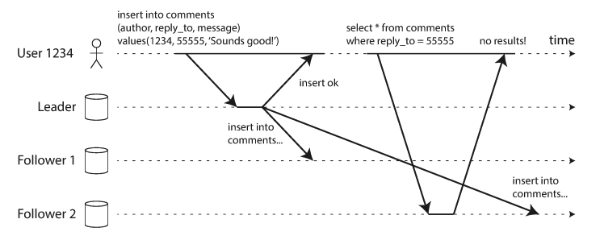
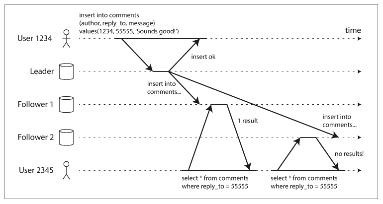
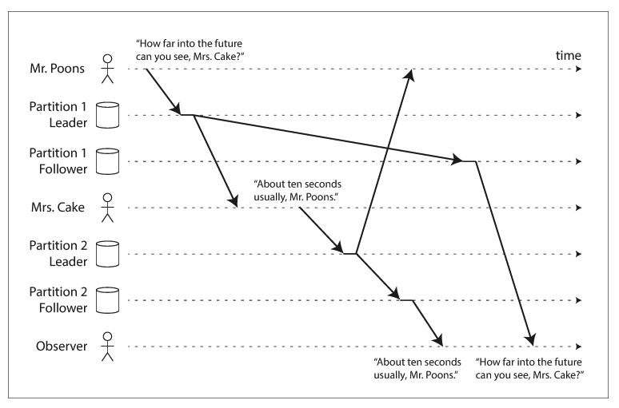
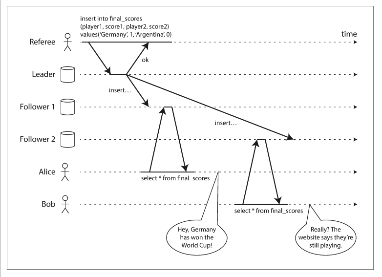

# Algorithm\_Consistency-\[TODO\]

* [Consistency](algorithm_consistency-todo.md#consistency)
  * [State consistency](algorithm_consistency-todo.md#state-consistency)
    * [Categories](algorithm_consistency-todo.md#categories)
  * [Operation consistency](algorithm_consistency-todo.md#operation-consistency)
    * [Read after write consistency](algorithm_consistency-todo.md#read-after-write-consistency)
    * [Monotonic read consistency](algorithm_consistency-todo.md#monotonic-read-consistency)
    * [Consistent prefix](algorithm_consistency-todo.md#consistent-prefix)
    * [Linearizability](algorithm_consistency-todo.md#linearizability)
      * [Engineering implementation](algorithm_consistency-todo.md#engineering-implementation)
    * [Casual consistency](algorithm_consistency-todo.md#casual-consistency)
  * [TODO](algorithm_consistency-todo.md#todo)

## Consistency

### State consistency

* Azure Cosmos DB consistency models: [https://docs.microsoft.com/en-us/azure/cosmos-db/consistency-levels](https://docs.microsoft.com/en-us/azure/cosmos-db/consistency-levels)

#### Categories

* Strong consistency
* Eventual consistency
* Monotonic write consistency
* Session consistency
* Write follows read consistency

### Operation consistency

#### Read after write consistency

* A user makes a write, followed by a read from a stale replica. To prevent this anomaly, we need read-after-write consistency.
* Reference: [https://ebrary.net/64708/computer\_science/reading\_your\_writes\#586](https://ebrary.net/64708/computer_science/reading_your_writes#586)

#### Monotonic read consistency

* A user first reads from a fresh replica, then from a stale replica. Time appears to go backward. To prevent this anomaly, we need monotonic reads.
* Reference: [https://ebrary.net/64709/computer\_science/monotonic\_reads\#720](https://ebrary.net/64709/computer_science/monotonic_reads#720)

#### Consistent prefix

* If some partitions are replicated slower than others, an observer may see the answer before they see the question.
* Reference: [https://ebrary.net/64710/computer\_science/consistent\_prefix\_reads\#807](https://ebrary.net/64710/computer_science/consistent_prefix_reads#807)

#### Linearizability

* Below graph shows an example of a nonlinearizable sports website. Alice and Bob are sitting in the same room, both checking their phones to see the outcome of the 2014 FIFA World Cup final. Just after the final score is announced, Alice refreshes the page, sees the winner announced, and excitedly tells Bob about it. Bob incredulously hits reload on his own phone, but his request goes to a database replica that is lagging, and so his phone shows that the game is still ongoing.
* Reference: [https://ebrary.net/64846/computer\_science/linearizability\#283](https://ebrary.net/64846/computer_science/linearizability#283)

**Engineering implementation**

* To achieve linearizability, it requires Global clock and total order. 
* In engineering, most products use TSO \(get time from a single server with HA design\); Google Spanner uses TrueTime \(Global clock by GPS and atomic clock, the variance is within 7ms\)

#### Casual consistency

* Casual consistency is weaker than linearizability but more efficient in engineering. Partial events could be ordered. 

### TODO

* [Consistency Guarantees in Distributed Systems Explained Simply](https://kousiknath.medium.com/consistency-guarantees-in-distributed-systems-explained-simply-720caa034116)

