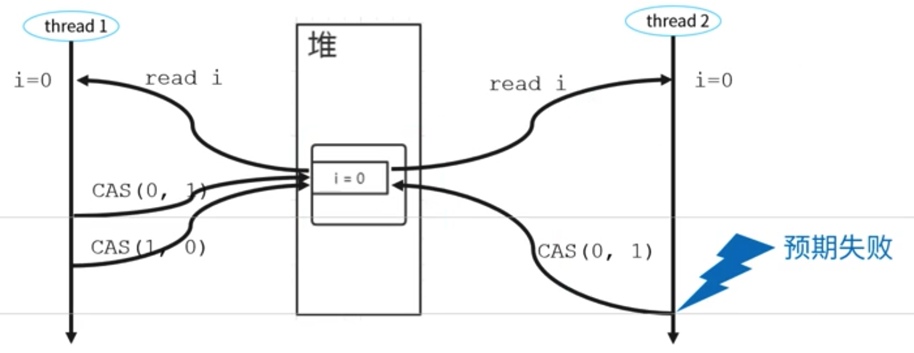
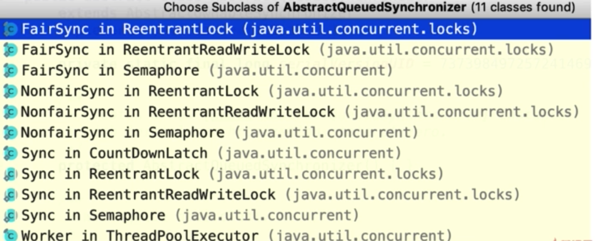

# Algorithm_Multithreading

* [Multithreading](algorithm_multithreading.md#multithreading)
  * [Big picture first](algorithm_multithreading.md#big-picture-first)
    * [Comparing Multi-processing, multi-threading and coroutine](algorithm_multithreading.md#comparing-multi-processing-multi-threading-and-coroutine)
    * [Concurrent and parallel](algorithm_multithreading.md#concurrent-and-parallel)
    * [Actor model vs Thread](algorithm_multithreading.md#actor-model-vs-thread)
    * [Scheduling](algorithm_multithreading.md#scheduling)
      * [Thread scheduling algorithms](algorithm_multithreading.md#thread-scheduling-algorithms)
      * [Process scheduling algorithms](algorithm_multithreading.md#process-scheduling-algorithms)
  * [Thread](algorithm_multithreading.md#thread)
    * [Thread lifecycle](algorithm_multithreading.md#thread-lifecycle)
    * [Thread Pool](algorithm_multithreading.md#thread-pool)
    * [Thread liveness](algorithm_multithreading.md#thread-liveness)
      * [Deadlock](algorithm_multithreading.md#deadlock)
        * [Four necessary conditions for deadlock](algorithm_multithreading.md#four-necessary-conditions-for-deadlock)
        * [How to avoid deadlock by breaking its conditions](algorithm_multithreading.md#how-to-avoid-deadlock-by-breaking-its-conditions)
      * [Livelock](algorithm_multithreading.md#livelock)
      * [Starvation](algorithm_multithreading.md#starvation)
  * [JMM (Java memory model)](algorithm_multithreading.md#jmm-java-memory-model)
    * [Atomic](algorithm_multithreading.md#atomic)
      * [Smallest atomic unit - CAS operations](algorithm_multithreading.md#smallest-atomic-unit---cas-operations)
        * [Cons](algorithm_multithreading.md#cons)
          * [ABA problem](algorithm_multithreading.md#aba-problem)
          * [Spin lock CPU consumption](algorithm_multithreading.md#spin-lock-cpu-consumption)
      * [CAS utilities - Atomic classes](algorithm_multithreading.md#cas-utilities---atomic-classes)
      * [Demo solution with counter example](algorithm_multithreading.md#demo-solution-with-counter-example)
    * [Reordering](algorithm_multithreading.md#reordering)
      * [Happens Before relationship](algorithm_multithreading.md#happens-before-relationship)
      * [Solution with lock (intrinsic or explicit)](algorithm_multithreading.md#solution-with-lock-intrinsic-or-explicit)
    * [Visibility](algorithm_multithreading.md#visibility)
      * [Volatile keyword](algorithm_multithreading.md#volatile-keyword)
    * [Final keyword](algorithm_multithreading.md#final-keyword)
  * [Monitor](algorithm_multithreading.md#monitor)
    * [Def](algorithm_multithreading.md#def)
    * [Relationship with Mutex and semaphore](algorithm_multithreading.md#relationship-with-mutex-and-semaphore)
      * [Mutex](algorithm_multithreading.md#mutex)
      * [Semaphore](algorithm_multithreading.md#semaphore)
      * [Mutex vs Semaphore](algorithm_multithreading.md#mutex-vs-semaphore)
    * [Mesa, Hasen and Hoare model](algorithm_multithreading.md#mesa-hasen-and-hoare-model)
    * [JDK 1.5 Implementation with synchronized, wait and notify](algorithm_multithreading.md#jdk-15-implementation-with-synchronized-wait-and-notify)
      * [synchronized for accessing mutual exclusive resources](algorithm_multithreading.md#synchronized-for-accessing-mutual-exclusive-resources)
        * [Scope of lock](algorithm_multithreading.md#scope-of-lock)
        * [Internals](algorithm_multithreading.md#internals)
        * [Downsides](algorithm_multithreading.md#downsides)
          * [Could only perform operation on a single variable, not multiples](algorithm_multithreading.md#could-only-perform-operation-on-a-single-variable-not-multiples)
          * [Could not break deadlock by releasing the lock proactively](algorithm_multithreading.md#could-not-break-deadlock-by-releasing-the-lock-proactively)
        * [Optimization after JDK 1.6](algorithm_multithreading.md#optimization-after-jdk-16)
          * [Bias, lightweight and heavyweight lock](algorithm_multithreading.md#bias-lightweight-and-heavyweight-lock)
          * [Lock coarsening and elision](algorithm_multithreading.md#lock-coarsening-and-elision)
          * [Adaptive spinning](algorithm_multithreading.md#adaptive-spinning)
      * [Wait and notify methods for coordinating threads](algorithm_multithreading.md#wait-and-notify-methods-for-coordinating-threads)
        * [Fundation for asynchronous programming - Future task](algorithm_multithreading.md#fundation-for-asynchronous-programming---future-task)
    * [JDK 1.6 Improved implementation with Lock and Condition](algorithm_multithreading.md#jdk-16-improved-implementation-with-lock-and-condition)
      * [Limitation of synchronized keyword](algorithm_multithreading.md#limitation-of-synchronized-keyword)
      * [Lock for accessing mutual exclusive resources](algorithm_multithreading.md#lock-for-accessing-mutual-exclusive-resources)
        * [Lock implementations](algorithm_multithreading.md#lock-implementations)
          * [ReentrantLock](algorithm_multithreading.md#reentrantlock)
          * [ReadWriteLock](algorithm_multithreading.md#readwritelock)
          * [StampedLock](algorithm_multithreading.md#stampedlock)
      * [Condition for coordinating threads](algorithm_multithreading.md#condition-for-coordinating-threads)
        * [Example usage with producer consumer pattern](algorithm_multithreading.md#example-usage-with-producer-consumer-pattern)
    * [References](algorithm_multithreading.md#references)
  * [AQS](algorithm_multithreading.md#aqs)
    * [Motivation](algorithm_multithreading.md#motivation)
    * [Internals](algorithm_multithreading.md#internals-1)
    * [Create impl inheriting AQS](algorithm_multithreading.md#create-impl-inheriting-aqs)
  * [Counter Sdks](algorithm_multithreading.md#counter-sdks)
    * [Semaphore](algorithm_multithreading.md#semaphore-1)
    * [CountdownLatch and CyclicBarrier](algorithm_multithreading.md#countdownlatch-and-cyclicbarrier)
  * [Java Concurrent Utilities - JCU](algorithm_multithreading.md#java-concurrent-utilities---jcu)
    * [List](algorithm_multithreading.md#list)
    * [Map](algorithm_multithreading.md#map)
    * [Set](algorithm_multithreading.md#set)
    * [Queue](algorithm_multithreading.md#queue)
      * [Single end queue](algorithm_multithreading.md#single-end-queue)
      * [Deque](algorithm_multithreading.md#deque)
  * [Lock alternatives](algorithm_multithreading.md#lock-alternatives)
    * [Thread confinement](algorithm_multithreading.md#thread-confinement)
      * [ThreadLocal](algorithm_multithreading.md#threadlocal)
      * [Stack confinement](algorithm_multithreading.md#stack-confinement)
      * [Adhoc confinement](algorithm_multithreading.md#adhoc-confinement)
    * [Disruptor](algorithm_multithreading.md#disruptor)
    * [Flyweight pattern](algorithm_multithreading.md#flyweight-pattern)
  * [Design small utils](algorithm_multithreading.md#design-small-utils)
    * [Singleton pattern](algorithm_multithreading.md#singleton-pattern)
    * [Blocking queue](algorithm_multithreading.md#blocking-queue)
    * [Delayed scheduler](algorithm_multithreading.md#delayed-scheduler)
    * [ConcurrentHashmap](algorithm_multithreading.md#concurrenthashmap)
  * [References](algorithm_multithreading.md#references-1)

## Multithreading

### Big picture first

#### Comparing Multi-processing, multi-threading and coroutine

* References: [https://sekiro-j.github.io/post/tcp/](https://sekiro-j.github.io/post/tcp/)

| `Criteria`                                       |                                                                                                                                                `Process`                                                                                                                                                |                                                                                                             `Thread`                                                                                                            |                                                                                           `Coroutine`                                                                                           |
| ------------------------------------------------ | :-----------------------------------------------------------------------------------------------------------------------------------------------------------------------------------------------------------------------------------------------------------------------------------------------------: | :-----------------------------------------------------------------------------------------------------------------------------------------------------------------------------------------------------------------------------: | :---------------------------------------------------------------------------------------------------------------------------------------------------------------------------------------------: |
| Def                                              |                                                                                                                                        A process runs in CPU core                                                                                                                                       |                                                                                                 A thread lives within a process                                                                                                 |                                                                                  A coroutine lives in a thread                                                                                  |
| Resources                                        |                                                                                Each process has independent system resources. Inter process mechanism such as pipes, sockets, sockets need to be used to share resources.                                                                               |                                              Multiple threads within the same process will share the same heap space but each thread still has its own registers and its own stack.                                             | Coroutine is managed by user, multi-threading is managed by kernel. Developers have better control of the execution flow by using coroutine, for example, a coroutine won’t be forced to yield. |
| Overhead for creation/termination/task switching |                                                                                                                        Slower because the whole process space needs to be copied.                                                                                                                       |                                                                  Faster due to very little memory copying (just thread stack) and less cpu cache to be evicted                                                                  |                                                       Coroutine is extremely light, which means much cheaper, faster than multi-threading.                                                      |
| Synchronization overhead                         |                                                                                                                                        No synchronization needed                                                                                                                                        |                                                                     Shared data that is modified requires special handling based on monitor MESA model impl                                                                     |                                                                                Communicating Sequential Processes                                                                               |
| Use cases                                        | CPU intensive tasks. For example, rendering or printing complicated file formats (such as PDF) can involve significant memory and I/O requirements. Using a single-threaded process and using one process per file to process allows for better throughput vs. using one process with multiple threads. | IO intensive tasks. Threads are a useful choice when you have a workload that consists of lightweight tasks (in terms of processing effort or memory size) that come in, for example with a web server servicing page requests. |                                                                                 IO intensive tasks. Same threads                                                                                |
| Supported frameworks                             |                                                                                                                                  Spark, Hadoop, distributed computing.                                                                                                                                  |                                                                                                   Web servers, Tornado, Gevent                                                                                                  |                            Use coroutine lib like asyncio, gevent, or framework like Tornado for I/O-intensive tasks. Java does not support coroutine yet 07/21/2021                            |

#### Concurrent and parallel

* Concurrent: Thread A and Thread B are in same process, takes turns to own the process, yield when waiting for resources or scheduled cpu time is used up. Use case is dealing with I/O-intensive tasks.
* Parallel: Thread A and Thread B are in different processes, execute at the same. Use case is dealing with CPU(Data)-intensive tasks.

#### Actor model vs Thread

* Thread is a JVM concept, whereas an Actor is a normal java class that runs in the JVM and hence the question is not so much about Actor vs Thread, its more about how Actor uses Threads.
* At a very simple level, an Actor is an entity that receives messages, one at a time, and reacts to those messages.
* When Actor receives a message, it performs some action in response. How does the action code run in the JVM? Again, if you simplify the situation, you could imagine the Action executing the action task on the current thread. Also, it is possible that the Actor decides to perform the action task on a thread pool. It does not really matter as long as the Actor makes sure that only one message is processed at a time.

#### Scheduling

**Thread scheduling algorithms**

* Reference: [http://www.cs.cornell.edu/courses/cs4410/2015su/lectures/lec04-scheduling.html](http://www.cs.cornell.edu/courses/cs4410/2015su/lectures/lec04-scheduling.html)

**Process scheduling algorithms**

* Reference: [https://www.tutorialspoint.com/operating_system/os_process_scheduling_algorithms.htm](https://www.tutorialspoint.com/operating_system/os_process_scheduling_algorithms.htm)

### Thread

#### Thread lifecycle

* [Link to the subpage](code/multithreads/ThreadLifeCycle.md)

#### Thread Pool

* [Link to the subpage](code/multithreads/ThreadPool.md)

#### Thread liveness

**Deadlock**

**Four necessary conditions for deadlock**

* A deadlock is a situation where a thread is waiting for an object lock that another thread holds, and this second thread is waiting for an object lock that the first thread holds. Since each thread is waiting for the other thread to relinquish a lock, they both remain waiting forever.
* There are four necessary conditions for deadlock to happen
  * **Mutal Exclusion**: Only one process can access a resource at a given time. (Or more accurately, there is limited access to a resource. A deadlock could also occur if a resource has limited quantity. )
  * **Hold and Wait**: Processes already holding a resource can request additional resources, without relinquishing their current resources. 
  * **No Preemption**: One process cannot forcibly remove another process' resource.
  * **Circular Wait**: Two or more processes form a circular chain where each process is waiting on another resource in the chain. 
* Reference: [https://afteracademy.com/blog/what-is-deadlock-and-what-are-its-four-necessary-conditions\*](https://afteracademy.com/blog/what-is-deadlock-and-what-are-its-four-necessary-conditions\*)

**How to avoid deadlock by breaking its conditions**

* Mutual exclusion: Cann't avoid because it is the nature of the problem.
* Hold and wait: Avoid by applying all resources at once.
* No preemption: Avoid by proactively releasing its resources if not getting all necessary resources.
* Circular wait: Avoid by ordering the resources and only acquiring resources by the order.

**Livelock**

* Def: A livelock is a recursive situation where two or more threads would keep repeating a particular code logic. The intended logic is typically giving opportunity to the other threads to proceed in favor of 'this' thread.
* Examples:
  * A real-world example of livelock occurs when two people meet in a narrow corridor, and each tries to be polite by moving aside to let the other pass, but they end up swaying from side to side without making any progress because they both repeatedly move the same way at the same time.
  * For example consider a situation where two threads want to access a shared common resource via a Worker object but when they see that other Worker (invoked on another thread) is also 'active', they attempt to hand over the resource to other worker and wait for it to finish. If initially we make both workers active they will suffer from livelock.
* How to avoid:
  * Tries a random duration before acquiring resources.

**Starvation**

* Def: In multithreaded application starvation is a situation when a thread is constantly ignored to gain possession of the intrinsic lock in favor of other threads.
* Examples:
  * Starvation describes a situation where a thread is unable to gain regular access to shared resources and is unable to make progress. This happens when shared resources are made unavailable for long periods by "greedy" threads. For example, suppose an object provides a synchronized method that often takes a long time to return. If one thread invokes this method frequently, other threads that also need frequent synchronized access to the same object will often be blocked.
* How to avoid:
  * Fairness is the situation when all threads are given equal opportunity for intrinsic lock acquisition.

### JMM (Java memory model)

#### Atomic

**Smallest atomic unit - CAS operations**

* sun.misc.Unsafe class
  * CompareAndSwapInt
  * CompareAndSwapLong

**Cons**

**ABA problem**

* CompareAndSwap only compares the actual value, but it does not guarantee that there are no thread changing this. This means that within the 
* For example
  1. Thread 1 change i from 0 => 1
  2. Thread 1 change i from 1 => 0
  3. Thread 2 changes i from 0 => 1, originally expected to fail. However, since CSA only uses the value comparison, it won't detect such changes. 



* Solution: Add a version number

**Spin lock CPU consumption**

* CAS is usually combined together with loop implementation. This is similar to a long-running spinlock, end up consuming lots of resource.
* Def: If a lock is a spin lock, it means that when the lock has been occupied by a thread, another thread trying to acquire it will constantly circulating to see whether the lock has been released (constantly causing CPU cycles) insteading entering a blocking state such as sleep.
* Internals:
  * Implementation based on CAS: [https://programmer.help/blogs/java-lock-spin-lock.html](https://programmer.help/blogs/java-lock-spin-lock.html)
  * Usually spin lock is associated with a timeout. And this timeout threshold is usually set to typical context swap time. 
* Applicable cases: Reduce the CPU thread context swap cost because the waiting thread never enters blocked state. Applicable for cases where the lock time is relatively low, or where there isn't much lock contention so that CPU context switch time could be saved. 

**CAS utilities - Atomic classes**

* AtomicBoolean, AtomicInteger, AtomicLong
* AtomicIntegerArray, AtomicLongArray, AtomicReferenceArray
* AtomicIntegerFieldUpdater, AtomicLongFieldUpdater, AtomicReferenceFieldUpdater
* AtomicReference, AtomicStampedReference, AtomicMarkableReference

**Demo solution with counter example**

* Composite actions like counter++ does not execute as a single operation. Instead, it is shorthand for a sequence of three discrete operations: fetch the current value, add one to it, and write the new value back to memory. This is an example of a read-modify-write operation, in which the resulting state is derived from the previous state. In Java these kind of operations are not overall atomic by default.
* [Thread safe counter](code/multithreads/Counter.md)

#### Reordering

**Happens Before relationship**

* Def: Happens-before relationship is a guarantee that action performed by one thread is visible to another action in different thread.
* Why it matters to reordering: Happens-before defines a partial ordering on all actions within the program. To guarantee that the thread executing action Y can see the results of action X (whether or not X and Y occur in different threads), there must be a happens-before relationship between X and Y. In the absence of a happens-before ordering between two operations, the JVM is free to reorder them as it wants (JIT compiler optimization).
* Sample happens-before relationship:
  * Single thread rule: Each action in a single thread happens-before every action in that thread that comes later in the program order.
  * Monitor lock rule: An unlock on a monitor lock (exiting synchronized method/block) happens-before every subsequent acquiring on the same monitor lock.
  * Volatile variable rule: A write to a volatile field happens-before every subsequent read of that same field. Writes and reads of volatile fields have similar memory consistency effects as entering and exiting monitors (synchronized block around reads and writes), but without actually aquiring monitors/locks.
  * Thread start rule: A call to Thread.start() on a thread happens-before every action in the started thread. Say thread A spawns a new thread B by calling threadA.start(). All actions performed in thread B's run method will see thread A's calling threadA.start() method and before that (only in thread A) happened before them.
  * Thread join rule: All actions in a thread happen-before any other thread successfully returns from a join on that thread. Say thread A spawns a new thread B by calling threadA.start() then calls threadA.join(). Thread A will wait at join() call until thread B's run method finishes. After join method returns, all subsequent actions in thread A will see all actions performed in thread B's run method happened before them.
  * Transitivity: If A happens-before B, and B happens-before C, then A happens-before C.
* References:
  * [https://www.logicbig.com/tutorials/core-java-tutorial/java-multi-threading/happens-before.html](https://www.logicbig.com/tutorials/core-java-tutorial/java-multi-threading/happens-before.html)

**Solution with lock (intrinsic or explicit)**

* The reasons of reordering problems may vary. It might be delayed write (due to any reasons, including how low level OS mechanism handles threads) to main memory which makes the code appears to be reordered or might be because of real code ordering as a results of JIT compiler/processor code optimization.
* Java Memory Model doesn't require a programmer to figure out the real low level reasons because those reasons vary on different JIT compilers and on different machine architectures. It requires a programmer to recognize the situations where reordering might happen and do proper synchronization.
* Reference: [https://www.logicbig.com/tutorials/core-java-tutorial/java-multi-threading/thread-reordering.html](https://www.logicbig.com/tutorials/core-java-tutorial/java-multi-threading/thread-reordering.html)

#### Visibility

**Volatile keyword**

* Using volatile forces all accesses (read or write) to occur to the main memory, effectively not caching volatile in CPU. This can be useful for the actions where visibility of the variable is important and order of accesses is not important.
* More specifically, In case of volatile reference object, it is ensured that the reference itself will be visible to other threads in timely manner but the same is not true for its member variables. There is no guarantee that data contained within the object will be visible consistently if accessed individually.

#### Final keyword

* Use cases
  * Forbids the overriding of classes and methods, as well as changes a variable that has been already initialized
  * Guarantees visibility in a multi-threaded application
  * Safe initialization for objects, arrays, and collections
* References:
  * [https://dzone.com/articles/final-keyword-and-jvm-memory-impact](https://dzone.com/articles/final-keyword-and-jvm-memory-impact)

### Monitor

#### Def

* Monitor in Java is not a special object. It's synchronization mechanism placed at class hierarchy root: java.lang.Object. This synchronization mechanism manages how to operate on shared variables. 
* There are many methods on the Object class including wait(), notify() and their siblings e.g. notifyAll().
* References: [http://pages.cs.wisc.edu/\~sschang/OS-Qual/process/Mesa_monitor.htm](http://pages.cs.wisc.edu/\~sschang/OS-Qual/process/Mesa_monitor.htm)

#### Relationship with Mutex and semaphore

**Mutex**

* A mutex is attached to every object in Java. 
* Within a mutex, only two states are available: unlocked and locked. 
* Java has no mechanism that would let you set the mutex value directly, something similar to below

```java
Object myObject = new Object();
Mutex mutex = myObject.getMutex();
mutex.free();
```

**Semaphore**

* A semaphore is a tool for synchronizing access to some resource. Its distinctive feature is that it uses a counter to create the synchronization mechanism. 
* Semaphores in Java are represented by the Semaphore class. 
* When creating semaphore objects, we can use the following constructors:

```java
//parameters
//int permits — the initial and maximum value of the counter. In other words, this parameter determines how many threads can simultaneously access the shared resource;
//boolean fair — establishes the order in which threads will gain access. If fair is true, then access is granted to waiting threads in the order in which they requested it. If it is false, then the order is determined by the thread scheduler.

Semaphore(int permits)
Semaphore(int permits, boolean fair)
```

**Mutex vs Semaphore**

* Mutex and semaphore have the same mission: To synchronize access to some resource.
* The only difference is that an object's mutex can be acquired by only one thread at a time, while in the case of a semaphore, which uses a thread counter, several threads can access the resource simultaneously. This isn't just a coincidence :) 
* A mutex is actually a semaphore with a count of 1. In other words, it's a semaphore that can accommodate a single thread. It's also known as a "binary semaphore" because its counter can have only 2 values — 1 ("unlocked") and 0 ("locked"). 

#### Mesa, Hasen and Hoare model

* Java uses Mesa model
* References:
  * [http://www.cs.cornell.edu/courses/cs4410/2018su/lectures/lec09-mesa-monitors.html](http://www.cs.cornell.edu/courses/cs4410/2018su/lectures/lec09-mesa-monitors.html)
  * [https://pages.mtu.edu/\~shene/NSF-3/e-Book/MONITOR/monitor-types.html](https://pages.mtu.edu/\~shene/NSF-3/e-Book/MONITOR/monitor-types.html)

#### JDK 1.5 Implementation with synchronized, wait and notify

**synchronized for accessing mutual exclusive resources**

* A monitor is an additional "superstructure" over a mutex. 

**Scope of lock**

* When applied on instance variable or method, lock the object. 
* When applied on a code block, lock the object. 
* When applied on static method, lock the entire class. 

**Internals**

* Java uses the synchronized keyword to express a monitor.

```java
// Original program
public class Main {

   private Object obj = new Object();

   public void doSomething() {

       // ...some logic, available for all threads

       // Logic available to just one thread at a time
       synchronized (obj) {

           /* Do important work that requires that the object
           be accessed by only one thread */
           obj.someImportantMethod();
       }
   }
}

// Converted program: Java will compile the original code above to something below. 
public class Main {

   private Object obj = new Object();

   public void doSomething() throws InterruptedException {

       // ...some logic, available for all threads

       // Logic available to just one thread at a time:

       /* as long as the object's mutex is busy,
       all the other threads (except the one that acquired it) are put to sleep */
       while (obj.getMutex().isBusy()) {
           Thread.sleep(1);
       }

       // Mark the object's mutex as busy
       obj.getMutex().isBusy() = true;

       /* Do important work that requires that the object
       be accessed by only one thread */
       obj.someImportantMethod();

       // Free the object's mutex
       obj.getMutex().isBusy() = false;
   }
}
```

**Downsides**

**Could only perform operation on a single variable, not multiples**

* Please see a counter impl based on UNSAFE: [https://github.com/DreamOfTheRedChamber/system-design-interviews/blob/master/code/multithreads/Counter.md#unsafe-class-implementation](code/multithreads/Counter.md#unsafe-class-implementation)

**Could not break deadlock by releasing the lock proactively**

* For synchronized keyword usage, when the thread could not get all resources, it will enter blocked state and could not do anything else. 

**Optimization after JDK 1.6**

* References: 
  * [https://www.infoq.com/articles/java-threading-optimizations-p1/](https://www.infoq.com/articles/java-threading-optimizations-p1/)

**Bias, lightweight and heavyweight lock**

* Everyone knows that before JDK 1.6, synchronized was a heavyweight lock with low efficiency. So the official started in JDK 1.6, in order to reduce the performance consumption caused by obtaining and releasing locks, we optimized synchronized and introduced the concepts of biased lock and lightweight lock.
* These four states will gradually upgrade with competition. But once it is upgraded, it cannot be downgraded. But these conversions are transparent to users who use locks.
  * Bias lock: only one thread enters the critical section;
  * Lightweight lock: multiple threads enter the critical section alternately, and the execution ends quickly;
  * Heavyweight lock: Multiple threads enter the critical section at the same time.

**Lock coarsening and elision**

**Adaptive spinning**

**Wait and notify methods for coordinating threads**

* [Example code for usage](https://github.com/DreamOfTheRedChamber/system-design-interviews/tree/master/code/multithreads/ObjectMethods)

**Fundation for asynchronous programming - Future task**

* [Link to the subpage](code/multithreads/Future.md)

#### JDK 1.6 Improved implementation with Lock and Condition

**Limitation of synchronized keyword**

* For synchronized keyword usage, when the thread could not get all resources, it will enter blocked state and could not do anything else. 

| `Criteria`                     | `synchronized (intrinsic lock)`                                                                                                                     | `ReentrantLock`                                                               |
| ------------------------------ | --------------------------------------------------------------------------------------------------------------------------------------------------- | ----------------------------------------------------------------------------- |
| Usage                          | implicitly acquire/release                                                                                                                          | explicitly acquire/release, best practice to put release inside finally       |
| Competition strategy           | Pessimistic. Will enter blocked state if failing to acquire resource                                                                                | Optimistic. Will not enter blocked state by interruption, timeout and tryLock |
| Number of conditional variable | Single condition varialbe                                                                                                                           | Multiple condition variables                                                  |
| Fairness                       | Java's synchronized code block makes no guarantee about the sequence in which threads waiting to enter the synchronized block are allowed to enter. | Support both faiir and unfair lock. By default unfair.                        |

**Lock for accessing mutual exclusive resources**

* Idea: Among the four conditions to break deadlock, three of them are possible. For the no preemption condition, it could be broken by proactively releasing its resources if not getting all necessary resources. There are three ways to achieve this:
  1. Support interruption
  2. Support timeout
  3. Support trying to acquire lock without entering blocked state in failure case
* Lock provides three method for implementing this

```
//  1. Support interruption
void lockInterruptibly() throws InterruptedException;

//  2. Support timeout
boolean tryLock(long time, TimeUnit unit) throws InterruptedException;

//  3. Support trying to acquire lock without entering blocked state in failure case
boolean tryLock();
```

**Lock implementations**

**ReentrantLock**

**ReadWriteLock**

* Requirements:
  * Allow multiple threads to read shared variables together. 
  * Allow a single thread to write shared variable. 
  * When a write operation is going on, no read operations will be required. 
* It does not support lock upgrade: if you get a read lock first, you could not get a write lock without releasing the read lock. 
* It supports lock downgrade: if you get a write lock first, you could get a read lock implicitly. 

**StampedLock**

* Support three types of lock
  * Write / pessimstic read
    * Share same semantics with ReadWriteLock
    * Difference: Needs to pass an additional parameter "stamp"
  * Optimistic read
    * For ReadWriteLock, when multiple threads are reading, no write operation is allowed at all; For StampedLock, when multiple threads are reading, a single thread is allowed to write. 
* StampedLock is a subclass of ReadWriteLock, and ReentrantReadWriteLock is also a subclass of ReadWriteLock. StampedLock is a non-reentrant lock.
* It is suitable for the situation of more reading and less writing. If it is not the case, please use it with caution, the performance may not be as good as synchronized.
* The pessimistic read lock and write lock of StampedLock do not support condition variables.
* Never interrupt a blocked pessimistic read lock or write lock. If you call interrupt() of a blocked thread, it will cause the cpu to soar. If you want StampedLock to support interrupt operations, please use readLockInterruptibly( Pessimistic read lock) and writeLockInterruptibly (write lock).

**Condition for coordinating threads**

* Condition's await(), signal() and signalAll() are the same as wait()、notify()、notifyAll() from functional perspective. 

```java
class TaskQueue {
    private final Lock lock = new ReentrantLock();

    // Condition instance needs to be obtained from lock
    private final Condition condition = lock.newCondition();
    private Queue<String> queue = new LinkedList<>();

    public void addTask(String s) {
        lock.lock();
        try {
            queue.add(s);
            condition.signalAll();
        } finally {
            lock.unlock();
        }
    }

    public String getTask() {
        lock.lock();
        try {
            while (queue.isEmpty()) {
                condition.await();
            }
            return queue.remove();
        } finally {
            lock.unlock();
        }
    }
}
```

**Example usage with producer consumer pattern**

* Please see a sample of using Lock + Condition to implement producing-consuming pattern: [https://github.com/DreamOfTheRedChamber/system-design-interviews/blob/master/code/multithreads/BlockingQueue.md#condition-locks-impl](code/multithreads/BlockingQueue.md#condition-locks-impl)

#### References

* [https://techdifferences.com/difference-between-semaphore-and-monitor-in-os.html](https://techdifferences.com/difference-between-semaphore-and-monitor-in-os.html)
* [https://cs.stackexchange.com/questions/43721/why-would-you-use-a-monitor-instead-of-a-semaphore](https://cs.stackexchange.com/questions/43721/why-would-you-use-a-monitor-instead-of-a-semaphore)
* [https://codegym.cc/groups/posts/220-whats-the-difference-between-a-mutex-a-monitor-and-a-semaphore](https://codegym.cc/groups/posts/220-whats-the-difference-between-a-mutex-a-monitor-and-a-semaphore)

### AQS

#### Motivation

* Many utilities such as Semahpore, CountdownLatch, etc. need to rely on a common set of methods: Lock, synchronizer, etc. 



#### Internals

* AQS is an abstract queue synchronizer. It mains a volatile int state variable and a FIFO queue. 
* There are three methods to visit the state variable
  * getState()
  * setState()
  * compareAndSetState(): Internally relies on UnSafe compareAndSwapInt

#### Create impl inheriting AQS

* AQS defines two ways to access a resource:
  * Exclusive: Concrete implementation such as ReentrantLock
  * Share: Concrete implementation such as Semaphore and CountDownLatch
* Both of these two approaches rely on a number of methods

```java
// methods
isHeldExclusively()
tryAcquire(int)
tryRelease(int)
tryAcquireShared(int)
tryReleaseShared(int)
```

### Counter Sdks

#### Semaphore

* One counter, one waiting queue and three methods
  * init()
  * down()
  * up()

```java
class Semaphore
{
  // counter
  int count;
  // waiting queue
  Queue queue;

  // constructor
  Semaphore(int c)
  {
    this.count=c;
  }

  void down()
  {
    this.count--;
    if(this.count<0)
    {
      // put current thread into queue
      // put current thread into blocked state
    }
  }

  void up()
  {
    this.count++;
    if(this.count<=0) 
    {
        // dequeue a thread in the waiting queue 
        // wait up the thread from blocked state
    }
  }
}
```

#### CountdownLatch and CyclicBarrier

| `Criteria` | `CountdownLatch`                                                                            | `CyclicBarrier`                                                                                                                                                        |
| ---------- | ------------------------------------------------------------------------------------------- | ---------------------------------------------------------------------------------------------------------------------------------------------------------------------- |
| Goal       | CountDownLatch keeps up a count of tasks                                                    | CyclicBarrier keeps up a count of threads                                                                                                                              |
| Reuse      | CountDownLatch cannot be reused, when count arrives at zero it can’t be reset               | CyclicBarrier can be reused after holding threads are released                                                                                                         |
| Exception  | In CountDownLatch just the current thread that has an issue throws a special case/exception | In a CyclicBarrier, if a thread experiences an issue (timeout, interruption), the wide range of various threads that have reached await() get a special case/exception |

### Java Concurrent Utilities - JCU

#### List

* CopyOnWriteArrayList: It will have two lists inside. Each time a write operation happens, a new copied list will be created for write operations. Read operations will be performed on the original list

#### Map

* ConcurrentHashMap: key not ordered
* ConcurrentSkiplistMap: key ordered

#### Set

* CopyOnWriteArraySet
* ConcurrentSkipListSet

#### Queue

**Single end queue**

* Blocking queue:
  * ArrayBlockingQueue: array as inside queue
  * LinkedBlockingQueue: list as inside queue
  * SynchronousQueue: No queue inside
  * LinkedTransferQueue: combination of synchronousQueue and LinkedBlockingQueue
* PriorityBlockingQueue
* DelayQueue

**Deque**

* BlockingDeque
* ConcurrentLinkedQueue
* ConcurrentLinkedDeque

### Lock alternatives

#### Thread confinement

**ThreadLocal**

* [Link to the subpage](code/multithreads/ThreadLocal.md)

**Stack confinement**

* Stack confinement is confining a variable, or an object, to the stack of the thread. This is much stronger than Ad-hoc thread confinement, as it is limiting the scope of the object even more, by defining the state of the variable in the stack itself. For example, consider the following piece of code:

```java
private long numberOfPeopleNamedJohn(List<Person> people) 
{
  List<Person> localPeople = new ArrayList<>(); // Confined within the stack space
  localPeople.addAll(people);

  return localPeople.stream().filter(person -> person.getFirstName().equals("John")).count();
}
```

**Adhoc confinement**

* Ad-hoc thread confinement describes a way of thread confinement, where it is the total responsibility of the developer, or the group of developers working on that program, to ensure that the use of the object is restricted to a single thread. This approach is very very fragile and should be avoided in most cases.
* One special case that comes under Ad-hoc thread confinement applies to volatile variables. It is safe to perform read-modify-write operations on the shared volatile variable as long as you ensure that the volatile variable is only written from a single thread. In this case, you are confining the modification to a single thread to prevent race conditions, and the visibility guarantees for volatile variables ensure that other threads see the most up to date value.

#### Disruptor

* No contention = no locks = it's very fast.
* Having everything track its own sequence number allows multiple producers and multiple consumers to use the same data structure.
* Tracking sequence numbers at each individual place (ring buffer, claim strategy, producers and consumers), plus the magic cache line padding, means no false sharing and no unexpected contention.

#### Flyweight pattern

### Design small utils

#### Singleton pattern

* [Link to the subpage](code/multithreads/SingletonPattern.md)

#### Blocking queue

* [Link to the subpage](code/multithreads/BlockingQueue.md)

#### Delayed scheduler

* [Link to the subpage](code/multithreads/DelayedQueue.md)

#### ConcurrentHashmap

* [Link to the subpage](code/multithreads/ConcurrentHashmap.md)

### References

* [并发多线程常见面试题](https://docs.qq.com/doc/DSVNyZ2FNWWFkeFpO)
