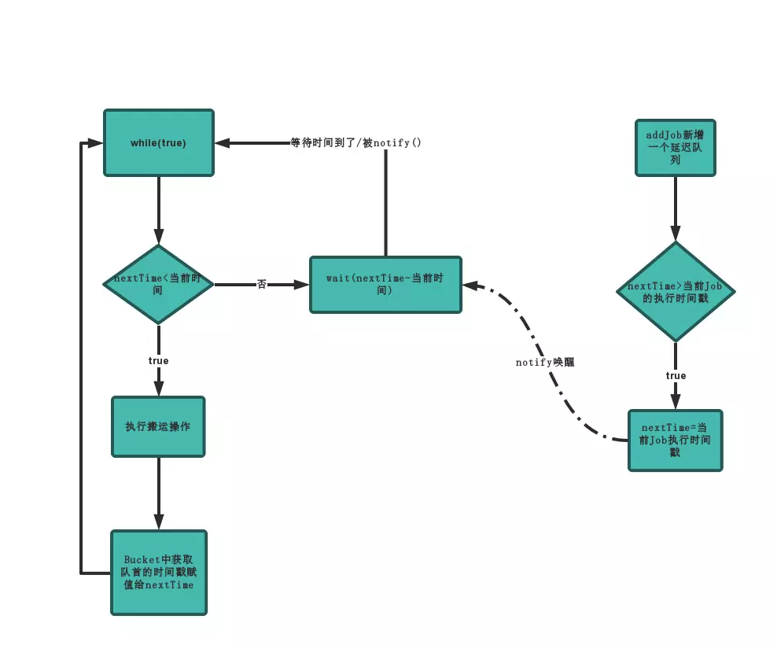
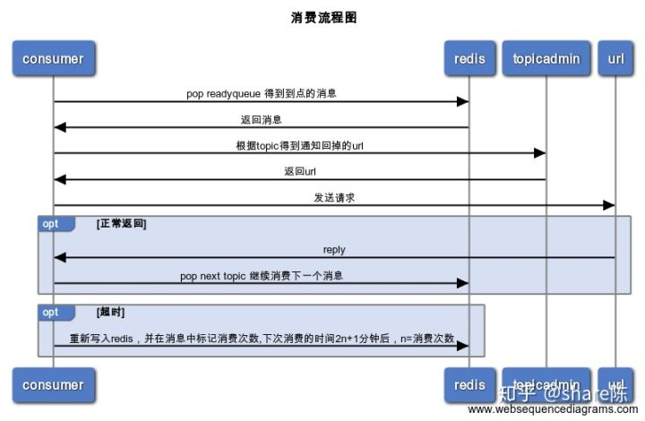
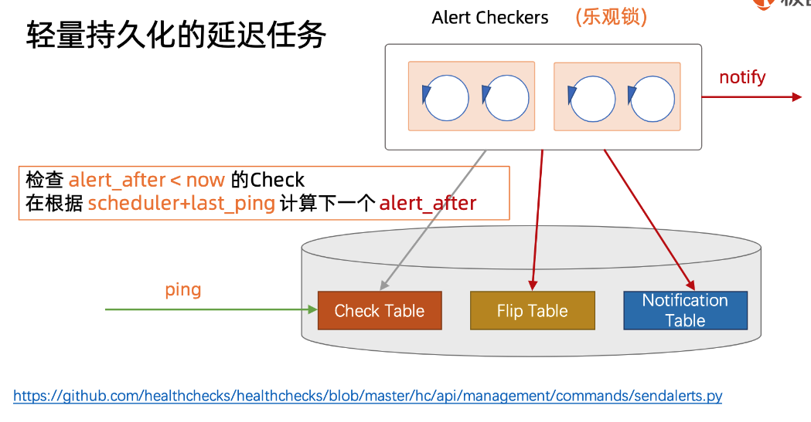

# Algorithm\_TaskScheduler

* [Task scheduler](algorithm_taskscheduler.md#task-scheduler)
  * [Use cases](algorithm_taskscheduler.md#use-cases)
  * [Data structures](algorithm_taskscheduler.md#data-structures)
    * [PriorityQueue](algorithm_taskscheduler.md#priorityqueue)
      * [DelayQueue implementation in JDK](algorithm_taskscheduler.md#delayqueue-implementation-in-jdk)
      * [Delayed interface](algorithm_taskscheduler.md#delayed-interface)
      * [Test with Producer/Consumer pattern](algorithm_taskscheduler.md#test-with-producerconsumer-pattern)
      * [Reference](algorithm_taskscheduler.md#reference)
    * [Timing wheel](algorithm_taskscheduler.md#timing-wheel)
      * [Simple wheel](algorithm_taskscheduler.md#simple-wheel)
      * [Hashed wheel \(sorted\)](algorithm_taskscheduler.md#hashed-wheel-sorted)
      * [Hashed wheel \(unsorted\)](algorithm_taskscheduler.md#hashed-wheel-unsorted)
      * [Hierarchical wheels](algorithm_taskscheduler.md#hierarchical-wheels)
      * [Reference](algorithm_taskscheduler.md#reference-1)
  * [Implemenations](algorithm_taskscheduler.md#implemenations)
    * [Timer + Database](algorithm_taskscheduler.md#timer--database)
    * [Redis + MySQL](algorithm_taskscheduler.md#redis--mysql)
      * [Algorithm](algorithm_taskscheduler.md#algorithm)
      * [Components](algorithm_taskscheduler.md#components)
      * [Flow chart \(In Chinese\)](algorithm_taskscheduler.md#flow-chart-in-chinese)
        * [Job state flow](algorithm_taskscheduler.md#job-state-flow)
        * [Produce delay task](algorithm_taskscheduler.md#produce-delay-task)
        * [Execute delay task](algorithm_taskscheduler.md#execute-delay-task)
          * [Timer mechanism \(Signaling\)](algorithm_taskscheduler.md#timer-mechanism-signaling)
        * [Consume delay task](algorithm_taskscheduler.md#consume-delay-task)
          * [Consume multiple jobs at once ???](algorithm_taskscheduler.md#consume-multiple-jobs-at-once-)
          * [TCP long polling ???](algorithm_taskscheduler.md#tcp-long-polling-)
      * [Retention ???](algorithm_taskscheduler.md#retention-)
      * [How to scale?](algorithm_taskscheduler.md#how-to-scale)
        * [Fault tolerant](algorithm_taskscheduler.md#fault-tolerant)
  * [Real world](algorithm_taskscheduler.md#real-world)
    * [Architecture](algorithm_taskscheduler.md#architecture)
    * [Delay queue in RabbitMQ](algorithm_taskscheduler.md#delay-queue-in-rabbitmq)
    * [Redisson ???](algorithm_taskscheduler.md#redisson-)
    * [ScheduledExecutorService ???](algorithm_taskscheduler.md#scheduledexecutorservice-)
    * [Beanstalk](algorithm_taskscheduler.md#beanstalk)
    * [Others](algorithm_taskscheduler.md#others)
  * [References](algorithm_taskscheduler.md#references)

## Task scheduler

### Use cases

* In payment system, if a user has not paid within 30 minutes after ordering. Then this order should be expired and the inventory needs to be reset. Please see the following flowchart:

```text
┌────────────────┐                                               ┌────────────────┐  
│                │               Step2. Add                      │                │  
│ Order Service  │───────────────a message ─────────────────────▶│  Delay Queue   │  
│                │                to queue                       │                │  
└────────────────┘                                               └────────────────┘  
         │                                                                │          
         │                                                                │          
         │                                                                │          
         │                                                                │          
         │                                                       Step3. Service read 
         │                                                       message from queue  
         │                                                                │          
      Step1.                                                              │          
    Save order                                                            │          
         │                                                                │          
         │                                                                │          
         │                                                                │          
         ▼                                                                ▼          
┌────────────────┐              ┌───────────┐                   ┌──────────────────┐ 
│ Order Database │              │   Cache   │    Step4. Check   │  Order TimeOut   │ 
│                │◀─────────────│           │◀───order status───│  Check Service   │ 
└────────────────┘              └───────────┘                   └──────────────────┘
```

* A user scheduled a smart device to perform a specific task at a certain time. When the time comes, the instruction will be pushed to the user's device from the server. 
* Control packet lifetime in networks such as Netty.

### Data structures

#### PriorityQueue

**DelayQueue implementation in JDK**

* Internal structure: DelayQueue is a specialized PriorityQueue that orders elements based on their delay time.
* Characteristics: When the consumer wants to take an element from the queue, they can take it only when the delay for that particular element has expired.
* Pros:
  * Not introduce other dependencies 
* Cons: 
  * It is only a data structure implementation and all queue elements will be stored within JVM memory. It would require large amounts of efforts to build a scalable delay queue implementation on top of it. 

**Delayed interface**

* Algorithm: When the consumer tries to take an element from the queue, the DelayQueue will execute getDelay\(\) to find out if that element is allowed to be returned from the queue. If the getDelay\(\) method will return zero or a negative number, it means that it could be retrieved from the queue.
* Data structure:

```text
public class DelayQueue<E extends Delayed>
                    extends AbstractQueue<E>
                    implements BlockingQueue<E>
```

```text
// Each element we want to put into the DelayQueue needs to implement the Delayed interface
public class DelayObject implements Delayed {
    private String data;
    private long startTime;

    public DelayObject(String data, long delayInMilliseconds) {
        this.data = data;
        this.startTime = System.currentTimeMillis() + delayInMilliseconds;
    }

    // It will return the remaining delay associated with the item in the top of the PriorityQueue in the given time unit. 
    @Override
    public long getDelay(TimeUnit unit) {
        long diff = startTime - System.currentTimeMillis();
        return unit.convert(diff, TimeUnit.MILLISECONDS);
    }

    // The elements in the DelayQueue will be sorted according to the expiration time. The item that will expire first is kept at the head of the queue and the element with the highest expiration time is kept at the tail of the queue:
    @Override
    public int compareTo(Delayed o) {
        return Ints.saturatedCast(
          this.startTime - ((DelayObject) o).startTime);
    }
}
```

**Test with Producer/Consumer pattern**

```text
// DelayedQueue is a blocking queue. When delayedQueue.take() method is called, it will only return when there is an item to be returned. 
public class DelayQueueProducer implements Runnable 
{  
    private BlockingQueue<DelayObject> queue;
    private Integer numberOfElementsToProduce;
    private Integer delayOfEachProducedMessageMilliseconds;

    // standard constructor

    @Override
    public void run() 
    {
        for (int i = 0; i < numberOfElementsToProduce; i++) 
        {
            DelayObject object
              = new DelayObject(
                UUID.randomUUID().toString(), delayOfEachProducedMessageMilliseconds);
            System.out.println("Put object: " + object);
            try 
            {
                queue.put(object);
                Thread.sleep(500);
            } 
            catch (InterruptedException ie) 
            {
                ie.printStackTrace();
            }
        }
    }
}

public class DelayQueueConsumer implements Runnable 
{
    private BlockingQueue<DelayObject> queue;
    private Integer numberOfElementsToTake;
    public AtomicInteger numberOfConsumedElements = new AtomicInteger();

    // standard constructors

    @Override
    public void run() {
        for (int i = 0; i < numberOfElementsToTake; i++) 
        {
            try 
            {
                DelayObject object = queue.take();
                numberOfConsumedElements.incrementAndGet();
                System.out.println("Consumer take: " + object);
            } 
            catch (InterruptedException e) 
            {
                e.printStackTrace();
            }
        }
    }
}
```

**Reference**

* [https://www.baeldung.com/java-delay-queue](https://www.baeldung.com/java-delay-queue)

#### Timing wheel

**Simple wheel**

* Keep a large timing wheel
* A curser in the timing wheel moves one location every time unit \(just like a seconds hand in the clock\)
* If the timer interval is within a rotation from the current curser position then put the timer in the corresponding location
* Requires exponential amount of memory

**Hashed wheel \(sorted\)**

* Sorted Lists in each bucket
* The list in each bucket can be insertion sorted
* Hence START\_TIMER takes O\(n\) time in the worst case
* If  n &lt; WheelSize then average O\(1\)

**Hashed wheel \(unsorted\)**

* Unsorted list in each bucket
* List can be kept unsorted to avoid worst case O\(n\) latency for START\_TIMER
* However worst case PER\_TICK\_BOOKKEEPING = O\(n\)
* Again, if n &lt; WheelSize then average O\(1\)

**Hierarchical wheels**

* START\_TIMER = O\(m\) where m is the number of wheels. The bucket value on each wheel needs to be calculated
* STOP\_TIMER = O\(1\)
* PER\_TICK\_BOOKKEEPING = O\(1\)  on avg.

**Reference**

* A hashed timer implementation [https://github.com/ifesdjeen/hashed-wheel-timer](https://github.com/ifesdjeen/hashed-wheel-timer)
* [http://www.cloudwall.io/hashed-wheel-timers](http://www.cloudwall.io/hashed-wheel-timers)
* Implementation in Netty: [https://www.jianshu.com/p/f009666ef55c](https://www.jianshu.com/p/f009666ef55c)

### Implemenations

#### Timer + Database

* Initial solution: Creates a table within a database, uses a timer thread to scan the table periodically. 
* Cons:
  * If the volume of data is large and there is a high frequency of insertion rate, then it won't be efficient to lookup and update records. 
  * There is a difference between when task is scheduled to be executed and when the task should be executed. 
* How to optimize: 
  * Shard the table according to task id to boost the lookup efficiency. 

```text
INT taskId
TIME expired
INT maxRetryAllowed
INT job status (0: newly created; 1: started; 2: failed; 3: succeeded)
```

#### Redis + MySQL

**Algorithm**

```text
redis> ZADD delayqueue <future_timestamp> "messsage"
redis> MULTI
redis> ZRANGEBYSCORE delayqueue 0 <current_timestamp>
redis> ZREMRANGEBYSCORE delayqueue 0 <current_timestamp>
redis> EXEC
```

**Components**


* JobPool: Store all metadata about jobs
  * Stores as key value pairs. Key is job id and value is job struct. 
  * Job struct contains the following:
    1. topic: job category. Needed because each category will has its own callback function. 
    2. id: job unique identifier
    3. delayTime: time to delay before executing the task
    4. ttr: timeout duration for this job to be executed
    5. body: job content
    6. callback: http url for calling a specific function
* Timer: Scan delay bucket and put expired jobs into ready queue
* Delay queue: A list of ordered queues which store all delayed/reserved jobs \(only stores job Id\)
* Ready queue: A list of ordered queues which store jobs in Ready state.
  * Topic: The same category of job collections
* Response queue: Stores the responses
* Database: Stores the message content
* Dispatcher: It will poll the delay queue and move items to the corresponding topic within ready queues if the tasks are ready. 
* Worker: Workers use BLPOP on the ready queue and process the message. Once done, the response could be put in a response queue and send to consumer. 

**Flow chart \(In Chinese\)**

**Job state flow**


* Ready: The job is ready to be consumed.
* Delay: The job needs to wait for the proper clock cycle.
* Reserved: The job has been read by the consumer, but has not got an acknowledgement \(delete/finish\)
* Deleted: Consumer has acknowledged and finished.

**Produce delay task**


* What is topic admin ???
* 
**Execute delay task**


**Timer mechanism \(Signaling\)**

* Busy waiting
  * Def: Setting the signal values in some shared object variable. Thread A may set the boolean member variable hasDataToProcess to true from inside a synchronized block, and thread B may read the hasDataToProcess member variable, also inside a synchronized block.
  * Example:     Thread B is constantly checking signal from thread A which causes hasDataToProcess\(\) to return true on a loop. This is called busy waiting

```text
// class definition
public class MySignal
{
  protected boolean hasDataToProcess = false;

  public synchronized boolean hasDataToProcess()
  {
    return this.hasDataToProcess;
  }

  public synchronized void setHasDataToProcess(boolean hasData)
  {
    this.hasDataToProcess = hasData;  
  }
}

...

// main program
protected MySignal sharedSignal = ...

// Thread B is busy waiting for thread a to set 

while(!sharedSignal.hasDataToProcess())
{
  //do nothing... busy waiting
}
```

* Wait notify
  * Pros: 
    * Reduce the CPU load caused by waiting thread in busy waiting mode. 
  * Cons: 
    * Missed signals: if you call notify\(\) before wait\(\) it is lost.
    * it can be sometimes unclear if notify\(\) and wait\(\) are called on the same object.
    * There is nothing in wait/notify which requires a state change, yet this is required in most cases.
    * Spurious wakeups: wait\(\) can return spuriously

```text
// Clients: Insert delayed tasks to delayQueues (Redis sorted set)
InsertDelayTasks(String msg)
{
    // score = current time + delay time
    redis.zdd(delayTaskSortedSets,score,msg)

    // the number of elements in delayTaskSortedSets
    len = zcount(delayTaskSortedSets, 0, -1)

    // notify polling thread if there exists delayed tasks to be executed
    synchronized(delayTaskSortedSets)
    {
        if(len > 0)
        {
            delayTaskSortedSets.notify()
        }
    } 
}

// DelayQueue server polling thread: Scan delayQueues and put expired tasks to ready queue
GetDelayMsg()
{   
    while(True)
    {
        // Wait until the number of elements inside delayTasksSortedTask is bigger than 0 
        synchronized(delayTaskSortedSets)
        {
            while (0 == zcount(delayTaskSortedSets,0, -1))
            {
                delayTaskSortedSets.wait()
            }
        }

        // Peek the top element from delayTasksSortedSet
        msg = redis.zcard(delayTaskSortedSets,0,1)
        waittime = score - curtime

        if(waittime > 0)
        {
            // Still need to wait
            synchronized(delayTaskSortedSets)
            {
                delayTaskSortedSets.wait(waittime)
            }
        }
        else
        {
            // Add to an element to ReadyQueue
            readyQueue.put(delayTaskSortedSets, msg)
            redis.zrem(msg);
        }
    }
}

// ReadyQueue server processing thread: Process ReadyQueue elements 
ProcessReady()
{
    while(True)
    {
        msg = blockingReadyQueue.take()
        MQ.insert(msg)
    }

    mq.inset(msg)
}
```

* Wait notify + Regular schedule
  * Motivation: When there are multiple consumers for delay queue, each one of them will possess a different timestamp. Suppose consumer A will move the next delay task within 1 minute and all other consumers will only start moving after 1 hour. If consumer A dies and does not restart, then it will at least 1 hour for the task to be moved to ready queue. A regular scanning of delay queue will compensate this defficiency. 
  * When will nextTime be updated:
    * Scenario for starting: When delayQueue polling thread gets started, nextTime = 0 ; Since it must be smaller than the current timestamp, a peeking operation will be performed on top of delayQueue.  
      * If there is an item in the delayQueue, nextTime = delayTime from the message; 
      * Otherwise, nextTime = Long.MaxValue
    * Scenario for execution: While loop will always be executed on a regular basis
      * If nextTime is bigger than current time, then wait\(nextTime - currentTime\)
      * Otherwise, the top of the delay queue will be polled out to the ready queue. 
    * Scenario for new job being added: Compare delayTime of new job with nextTime
      * If nextTime is bigger than delayTime, nextTime = delayTime; notify all delayQueue polling threads. 
      * Otherwise, wait\(nextTime - currentTime\)



**Consume delay task**



* Workers use BLPOP on the topics

**Consume multiple jobs at once ???**

**TCP long polling ???**

**Retention ???**

* Assumption: QPS 1000, maximum retention period 7 days, 

**How to scale?**

**Fault tolerant**

* For a message in ready queue, if server has not received acknowledgement within certain period \(e.g. 5min\), the message will be put inside Ready queue again. 
* There needs to be a leader among server nodes. Otherwise message might be put into ready queue repeatedly. 
* How to guarantee that there is no message left during BLPOP and server restart?
  * Kill the Redis blpop client when shutting down the server. 
  * [https://hacpai.com/article/1565796946371](https://hacpai.com/article/1565796946371)

### Real world

* Netflix delay queue: [https://netflixtechblog.com/distributed-delay-queues-based-on-dynomite-6b31eca37fbc](https://netflixtechblog.com/distributed-delay-queues-based-on-dynomite-6b31eca37fbc)

#### Architecture


#### Delay queue in RabbitMQ

* RabbitMQ does not have a delay queue. But could use timeout as a workaround. 
  1. When put message into a queue, add a timeout value
  2. When the timeout reaches, the message will be put inside a deadqueue
  3. Then the consumer could pull from the deadqueue

#### Redisson ???

#### ScheduledExecutorService ???

#### Beanstalk

* Cons
  * Not convenient when deleting a msg. 
  * Developed based on C language, not Java and PHP. 

#### Others

* db-scheduler / cron.io
* killbill notification queue
* Quartz \(Java\)
* Xxl-job \(Java\)
* Celery \(Python\)
* Hangfire \(C\#\)

  

### References

* [https://github.blog/2009-11-03-introducing-resque/](https://github.blog/2009-11-03-introducing-resque/)
* [http://tutorials.jenkov.com/java-concurrency/thread-signaling.html](http://tutorials.jenkov.com/java-concurrency/thread-signaling.html)
* [https://hacpai.com/article/1565796946371](https://hacpai.com/article/1565796946371)
* [https://stackoverflow.com/questions/10868552/scalable-delayed-task-execution-with-redis](https://stackoverflow.com/questions/10868552/scalable-delayed-task-execution-with-redis)
* [https://juejin.im/post/5b5e52ecf265da0f716c3203](https://juejin.im/post/5b5e52ecf265da0f716c3203)
* [https://tech.youzan.com/queuing\_delay/](https://tech.youzan.com/queuing_delay/)
* [http://www.throwable.club/2019/09/01/redis-delay-task-second/](http://www.throwable.club/2019/09/01/redis-delay-task-second/)

