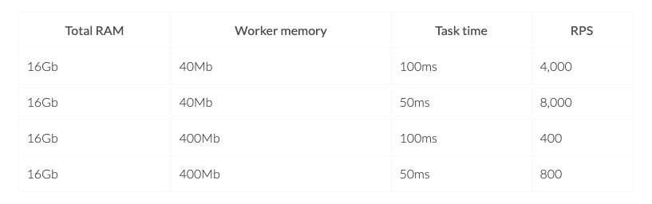
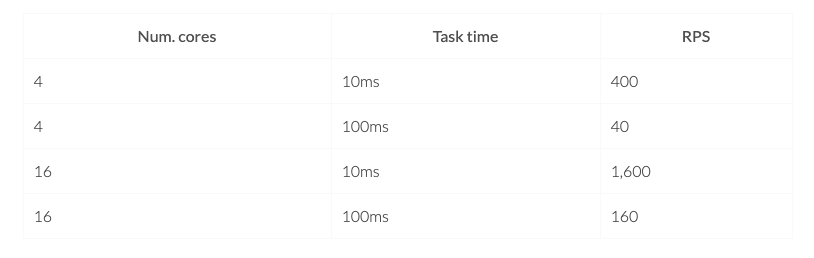

- [Web server](#web-server)
  - [Calculation rules](#calculation-rules)
  - [From C10K to 10M](#from-c10k-to-10m)
    - [10K Definition](#10k-definition)
    - [C10M](#c10m)
  - [Nginx performance](#nginx-performance)
    - [Benchmark](#benchmark)
    - [Real production traffic](#real-production-traffic)

# Web server
## Calculation rules
**RPS estimation due to different resource bound**

* I/O bound: RPS = (memory / worker memory)  \* (1 / Task time)

* CPU bound: RPS = Num. cores \* (1 /Task time)

## From C10K to 10M
* A decade ago engineers tackled the C10K scalability problems that prevented servers from handling more than 10,000 concurrent connections. This problem was solved by fixing OS kernels and moving away from threaded servers like Apache to event-driven servers like Nginx and Node. This process has taken a decade as people have been moving away from Apache to scalable servers. 

### 10K Definition

* Handle 10,000 concurrent connections
  * vs RPS: 
    * RPS requires high throughput (Process them quickly). 
    * A system which could handle high number of connections is not necessarily a high throughput system.
* This became known as the C10K problem. Engineers solved the C10K scalability problems by fixing OS kernels and moving away from threaded servers like Apache to event-driven servers like Nginx and Node.

* [http://www.kegel.com/c10k.html](http://www.kegel.com/c10k.html)

### C10M

* [http://highscalability.com/blog/2013/5/13/the-secret-to-10-million-concurrent-connections-the-kernel-i.html](http://highscalability.com/blog/2013/5/13/the-secret-to-10-million-concurrent-connections-the-kernel-i.html)

## Nginx performance

### Benchmark
* https://gist.github.com/denji/8359866
* Generally, properly configured nginx can handle up to 400K to 500K requests per second (clustered), most what i saw is 50K to 80K (non-clustered) requests per second and 30% CPU load, course, this was 2 x Intel Xeon with HyperThreading enabled, but it can work without problem on slower machines.

### Real production traffic
* 1,000 RPS is not difficult to achieve on a normal server for a regular service.
* 2,000 RPS is a decent amount of load for a normal server for a regular service.
* More than 2K either need big servers, lightweight services, not-obvious optimisations, etc (or it means you’re awesome!). Less than 1K seems low for a server doing typical work (this means a request that is simple and not doing a lot of work) these days.
* For a 32 core 64GB machine, it could at mmost process 20K "hello world" per second. For the actual business logic, the RPS will be much lower, several hundreds per second. 

**Netflix flash and storage servers**

* Storage and Flash. These two server types have very different characteristics. 
  * Storage servers consist of mostly spinning disks, can hold upwards of 200 TB, and generate \~40 Gbps of throughput. 
  * Flash servers (all SSD disks) can generate up to \~100 Gbps but can hold only up to 18 TB of content.
* Reference: [https://netflixtechblog.com/distributing-content-to-open-connect-3e3e391d4dc9](https://netflixtechblog.com/distributing-content-to-open-connect-3e3e391d4dc9)
