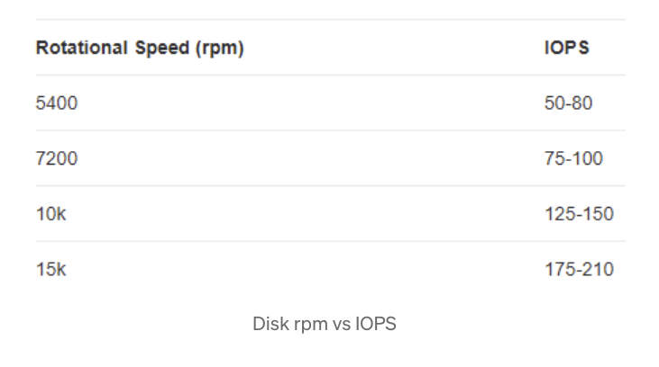
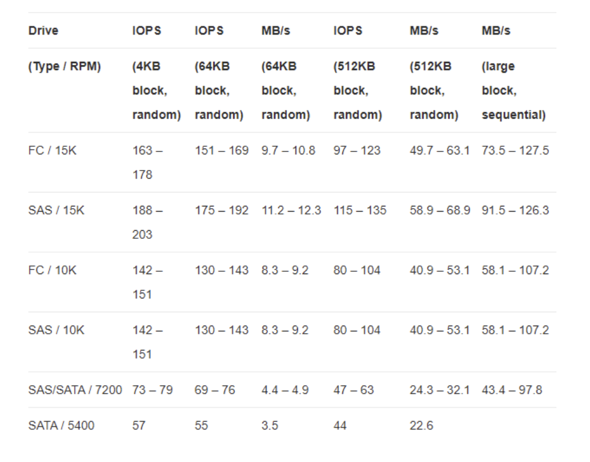
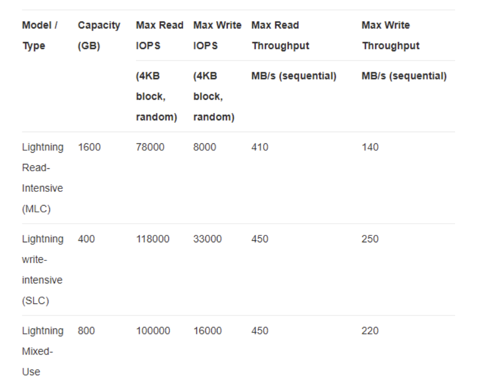
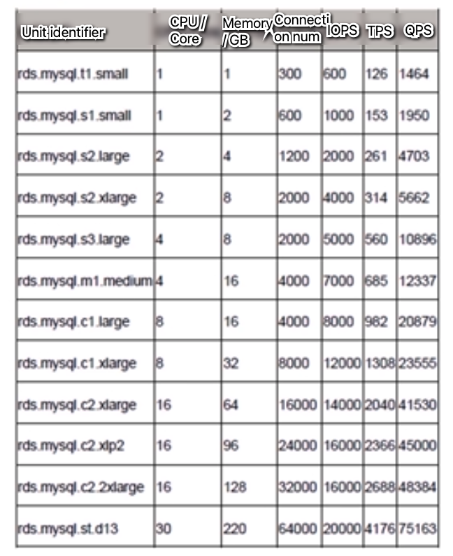

- [Storage](#storage)
  - [Database criteria](#database-criteria)
  - [Disk write speed](#disk-write-speed)
  - [Hard disk IOPS / Throughput](#hard-disk-iops--throughput)
  - [Single MySQL instance](#single-mysql-instance)
  - [Wechat 2016 World Record for MySQL clusters](#wechat-2016-world-record-for-mysql-clusters)
  - [Netflix flash and storage servers](#netflix-flash-and-storage-servers)

# Storage
## Database criteria

| Deployment                         | Capacity / Performance      | Other criteria                    |
| ---------------------------------- | --------------------------- | --------------------------------- |
| Replication mode                   | Current data size           | Whether query goes through index  |
| Failover strategy                  | Daily incremental data size | Whether there is multi-table join |
| Disaster recovery strategy         | Read per second             | Whether uses opti/pessi lock      |
| Archive strategy                   | Write per second            | Transaction consistency model     |
| Read/Write separation strategy     | Transaction per second      | JDBC config                       |
| Partitioning and sharding strategy |                             | Sharing tool (Proxy/Client)       |
| Caching strategy                   |                             |                                   |

## Disk write speed
* Traditional magnetic hard drives can write data upto 100 MB/second,
* On an average you can write hardly 100 bytes/second in a random write fashion, this limitation basically comes from the design of how the magnetic disk works
* https://kousiknath.medium.com/data-structures-database-storage-internals-1f5ed3619d43
 
## Hard disk IOPS / Throughput
* https://medium.com/naukri-engineering/understanding-disk-i-o-when-should-you-be-worried-naukri-engineering-f0ab332f52d4

## Single MySQL instance

* Single row size: 1KB
* Physical upper limit of concurrent connections: 16K
* Single table rows: 20M. Single table size: 1GB. Exceeding this number will result in fast degradation in terms of performance. 
* A single MySQL 5.6 benchmark on cloud (Aliyun). Use the following for ease of memorization:
  * TPS: 1k TPS
  * QPS: 25k QPS
  * Connection num: 10K
  * Response time: 10ms (Like a lower bound)

## Wechat 2016 World Record for MySQL clusters

* TPS (payment transaction for yearly red envelope): 200K
* RPS (number of yearly red envelope): 760K

## Netflix flash and storage servers
* Storage and Flash. These two server types have very different characteristics. 
  * Storage servers consist of mostly spinning disks, can hold upwards of 200 TB, and generate \~40 Gbps of throughput. 
  * Flash servers (all SSD disks) can generate up to \~100 Gbps but can hold only up to 18 TB of content.
* Reference: [https://netflixtechblog.com/distributing-content-to-open-connect-3e3e391d4dc9](https://netflixtechblog.com/distributing-content-to-open-connect-3e3e391d4dc9)
