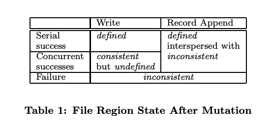
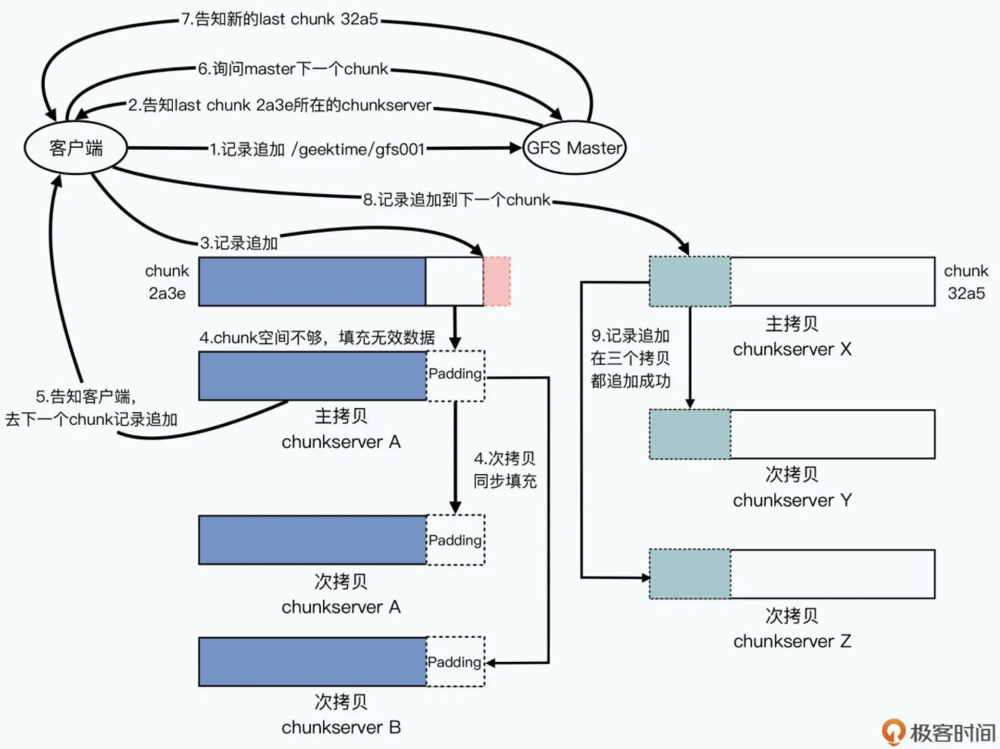
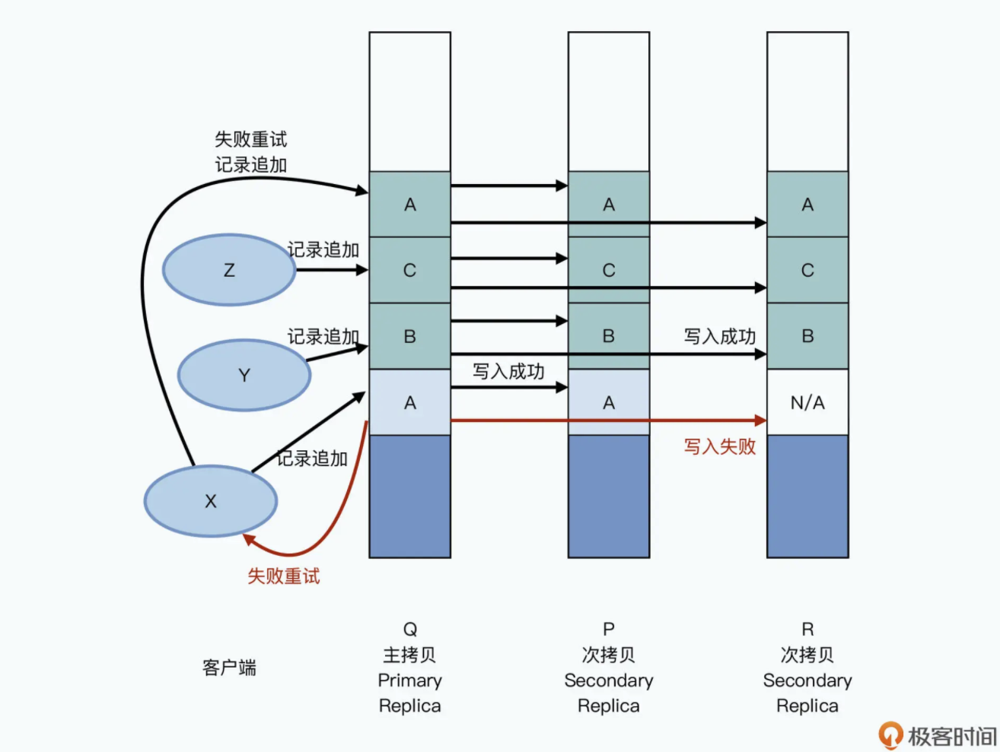

- [Consistency](#consistency)
  - [Normal write](#normal-write)
  - [Record appends](#record-appends)
    - [Guarantees at least once](#guarantees-at-least-once)

# Consistency

## Normal write
* Only guarantees lose consistency but not defined. 

## Record appends

### Guarantees at least once

