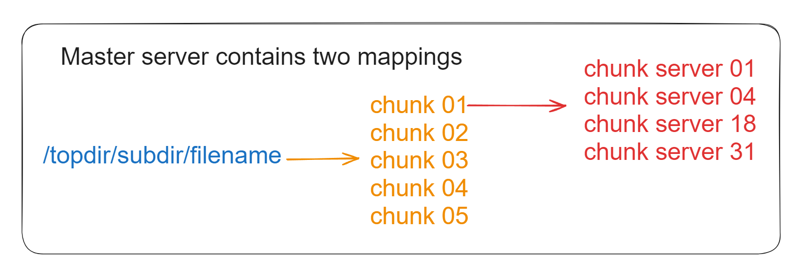
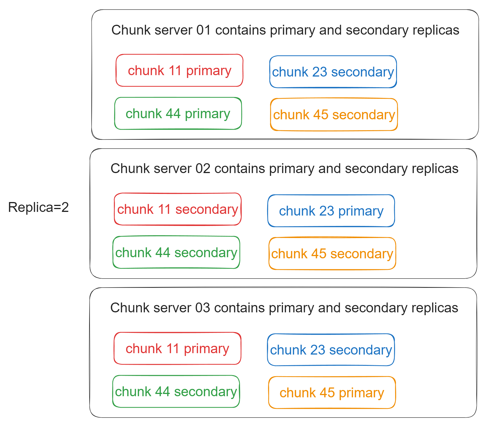
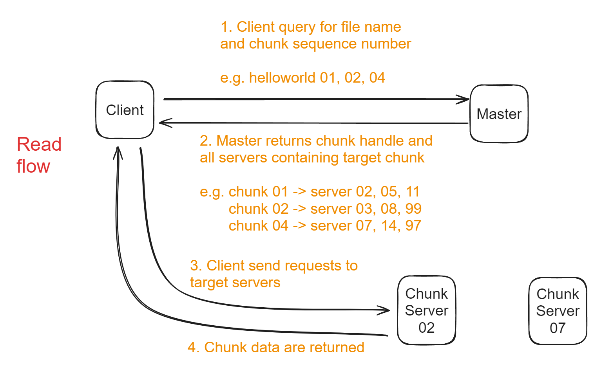
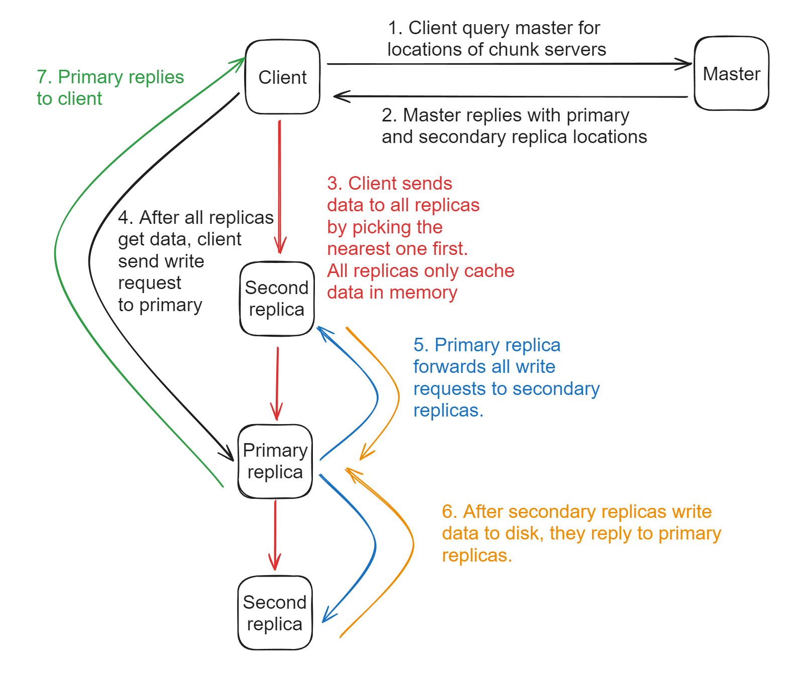
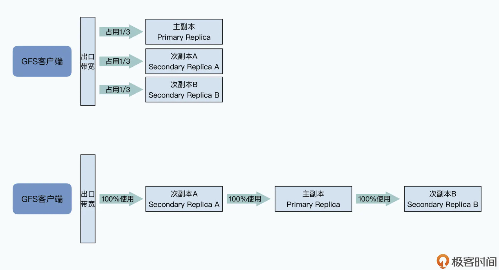
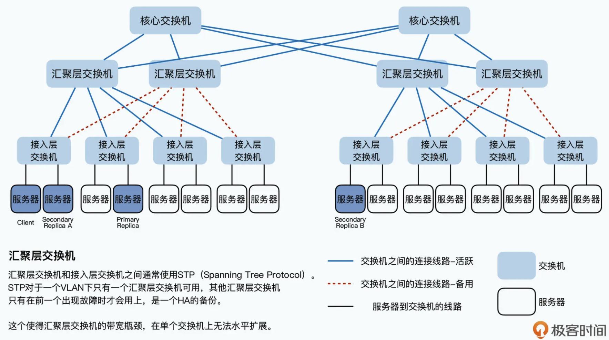

- [Master metadata](#master-metadata)
- [Chunk server data](#chunk-server-data)
  - [Chunk size of 64MB](#chunk-size-of-64mb)
- [Read flowchart](#read-flowchart)
- [Write flowchart](#write-flowchart)
  - [Separation of control signal and data flow](#separation-of-control-signal-and-data-flow)
  - [Closest replica first](#closest-replica-first)
    - [Reason](#reason)

## Identify the bottleneck
* In GFS case
  * It uses 100Mbps network card, it has a maximum throughput of 12.5MB/s. 
  * It uses 5400 rpm disk, its bandwidth is usually 60~90MB/s. And multiple hard disks could be plugged together, and there will be a maximum bandwidth of 500MB/s. 
  * The bottleneck is in network layer. 

# Master metadata
* File and chunk namespace
* Mapping from file full path name to chunk handle list. 
* Mapping from chunk handle list to chunk server list. 

# Chunk server data

## Chunk size of 64MB
* GFS also uses namespace + filename to identify a file. 
* Each file is divided to chunk of size 64MB. 
* GFS client knows which chunk server to find the file. 

# Read flowchart
1. GFS client sends file name and chunk offset to GFS master. Since all chunks have the same size of 64MB, chunk index could be easily calculated. 
2. After GFS master gets the request, it will return addresses of chunk servers to clients. 
3. After GFS client gets addresses, it could reach out to any of it to get chunk data. 

# Write flowchart
## Separation of control signal and data flow
* Master only tells GFS client which chunk servers to read/write data. After that it is out of the business. 

1. Client queries master for locations of chunk servers. 
2. Master replies with primary and secondary replica locations of chunk servers. 
3. Client sends data to all replicas (by picking the nearest replica first). However, after secondary replicas receive the data, they will not immediately write it to disk. Instead, they will cache it in the memory. 
4. After all secondary replicas receive data, clients will send a write request to primary replica. Primary replica will order all the write requests. 
5. Primary replica will forward all write requests to secondary replicas. Then all secondary replicas will write data to disk with the same order. 
6. After secondary replicas finish writing, they will reply to primary replica that they have finished. 
7. Primary replica will tell clients that write requests have completed successfully. 

## Closest replica first
* Data might not first be transmitted to primary replica. It depends on which replica is closer to the client. 
* Then the closer replica will send the data to the next replica. 

### Reason
* All servers on the same rack will be plugged to the same access switch. 
* All switches on the rack will connect to a single aggregate switch. 
* Aggregate switches will connect to core switch. 

