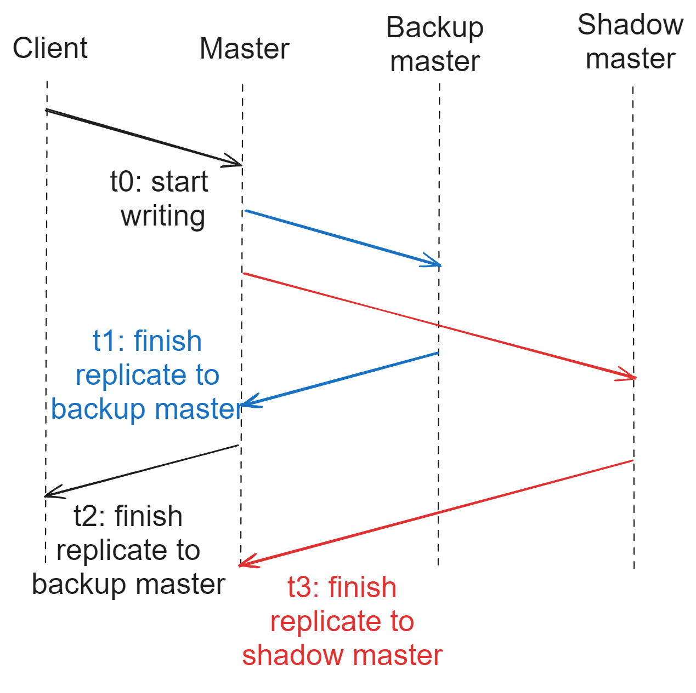

- [Disk fault tolerance](#disk-fault-tolerance)
- [ChunkServer/DataNode high availability](#chunkserverdatanode-high-availability)
- [Master/NameNode high availability](#masternamenode-high-availability)
  - [First layer defense: Restart master](#first-layer-defense-restart-master)
  - [Second layer defense: Master backup](#second-layer-defense-master-backup)
  - [Third layer defense: Shadow backup](#third-layer-defense-shadow-backup)
    - [Motivation](#motivation)
    - [Inconsistency](#inconsistency)

# Disk fault tolerance

# ChunkServer/DataNode high availability

# Master/NameNode high availability

## First layer defense: Restart master
* All master metadata is cached inside memory. There will be checkpoints where all memory is dumped to disk. 
* If the master has software failures, then it will first recover from checkpoints. And then operation logs after that timestamp will be replayed. 

## Second layer defense: Master backup
* The above procedure could handle software but not hardware failures. 
* If the master has hardware failures, then it could failover to the backups which master synchronously replicates to. 

* The switch from master to master backup is by canonical name

## Third layer defense: Shadow backup
### Motivation
* The switch process could take seconds or minutes to complete. The worst case switch process needs 
  1. Monitor program detects the master failure. 
  2. Restarting master, loading data from disk checkpoints and replaying operation logs after the timestamp don't help. 
  3. Starting the switch from master to master backup by changing the canonical name.  

### Inconsistency
* The data in shadow back might be stale. But the chance that client read stale metadata from shadow backup is quite slim because it only happens when all these three conditions are met: 
  * Master is dead. 
  * The metadata on master has not completely been replicated to shadow backup. 
  * The data clients is trying to read is just these metadata not replicated yet. 

