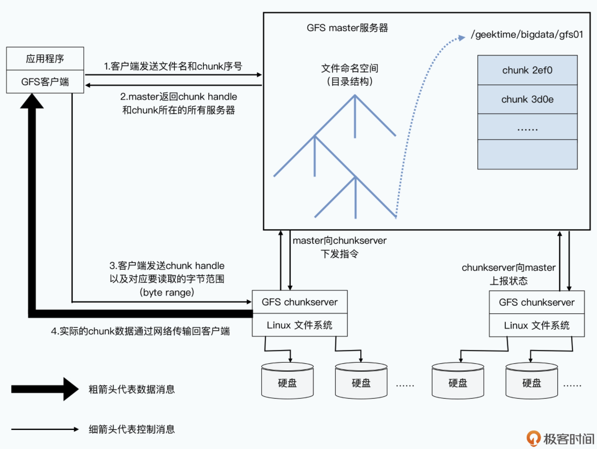

- [GFS/HDFS Terminology](#gfshdfs-terminology)

# GFS/HDFS Terminology
* HDFS: NameNode, DataNode, Block
* GFS: Master, ChunkServer, Chunk

# Single master
## Master as directory service
### Chunk size of 64MB
* When compared with chunk server used for dat storage, master is a 
directory service. 
* GFS also uses namespace + filename to identify a file. 
* Each file is divided to chunk of size 64MB. 
* GFS client knows which chunk server to find the file. 

### Three types of metadata
* File and chunk namespace
* Mapping from file full path name to chunk handle list. 
* Mapping from chunk handle list to chunk server list. 

### Access pattern
1. GFS client sends file name and chunk offset to GFS master. Since all chunks have the same size of 64MB, chunk index could be easily calculated. 
2. After GFS master gets the request, it will return addresses of chunk servers to clients. 
3. After GFS client gets addresses, it could reach out to any of it to get chunk data. 

