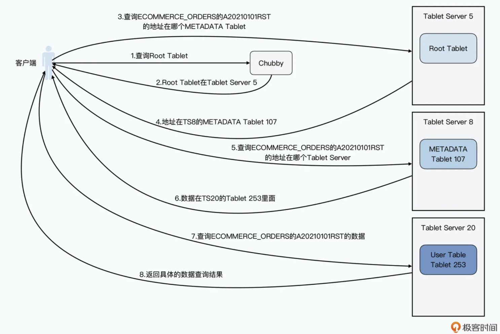
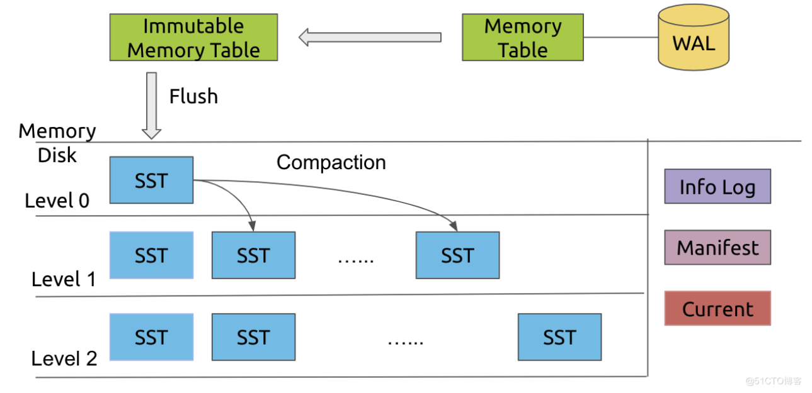
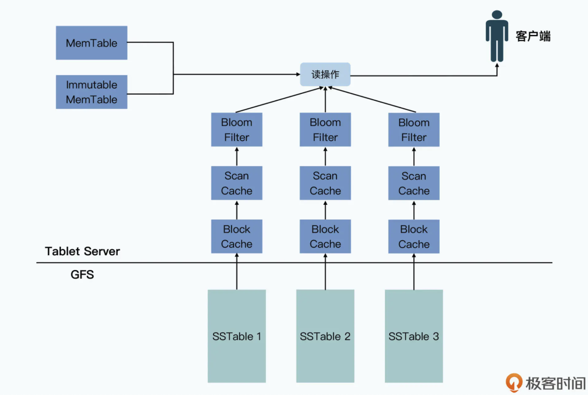

- [History](#history)
  - [Pain points of mySQL](#pain-points-of-mysql)
  - [Motivation](#motivation)
- [Data model](#data-model)
- [API](#api)
- [Components](#components)
  - [Tablet server](#tablet-server)
  - [Master](#master)
  - [Chubby](#chubby)
    - [SPOF in master without Chubby](#spof-in-master-without-chubby)
- [Horizontal scalability](#horizontal-scalability)
  - [Three layer tablets](#three-layer-tablets)
    - [Root tablet](#root-tablet)
    - [Metadata table](#metadata-table)
      - [User tablet](#user-tablet)
  - [Flowchart](#flowchart)
  - [Benefits](#benefits)
    - [Large storage capacity](#large-storage-capacity)
    - [Evenly distributed load for metadata](#evenly-distributed-load-for-metadata)
- [High throughput design](#high-throughput-design)
  - [flow chart](#flow-chart)
    - [Memtable](#memtable)
    - [High throughput write process](#high-throughput-write-process)
      - [Durability with WAL](#durability-with-wal)
    - [High throughput read](#high-throughput-read)
      - [process](#process)
      - [Index / bloomfilter / cache](#index--bloomfilter--cache)
  - [High throughput](#high-throughput)
  - [Pros](#pros)
  - [Cons](#cons)
- [References](#references)

# History
## Pain points of mySQL
* Scaling up typically requires doubling the number of machines. Otherwise, lots of data move across partitions need to happen to make data evenly distribution. 
* Sharding strategy is not transparent for developers. 
  * If using time as dimension, whether you should shard by year, month, or day. This year's volume might be 10X when compared with previous year; If by month or day, then there is the challenge of promotion seasons such as black friday.
* Within mySQL cluster, each server could have a backup. However, it typically needs manual intervention for the switch when there is a harddrive failure. 

## Motivation
* Elasticity: Randomly add/reduce number of servers
* Dynamic load shedding: Adjust the load on a single node
* Fault tolerant: Minority of machine going down won't impact the availability. 

# Data model
* The same column family will be stored together. 
* A single value could be stored with multiple versions.


# API

```
// Open the table
Table *T = OpenOrDie("/Bigtable/web/webtable");

// Write a new anchor and delete and old anchor
RowMutation r1(T, "com.cnn.www");      // com.cnn.www is the row key
r1.Set("anchor:www.c-span.org", "CNN") // set column family anchor, column www.c-span.org value as CNN
r1.Delete("anchor:www.abc.com");       // delete column www.abc.com
Operation op;
Apply(&op, &r1);
```

```
Scanner scanner(T);
ScanStream *stream;
stream = scanner.FetchColumnFamily("anchor");
stream->SetReturnAllVersions();
scanner.Lookup("com.cnn.www");
for (; !stream->Done(); stream->Next()) {
  printf("%s %s %lld %s\n",
          scanner.RowName(),  // for a given row
          stream->ColumnName(), // print all columns
          stream->MicroTimestamp(),
          stream->Value());
}
```

# Components
* BigTable will dynamically allocate data to different partitions. 
* BigTable uses Master + Chubby to manage the partition information. 

## Tablet server
* Provides online data read/write service
* Note: tablet server is not responsible for storing the actual data. 

## Master
* Assign tablets to tablet server
* Examine the addition and expiration of tablet servers
* Balance load of tablet servers
* Garbage collect on data stored in GFS

## Chubby
* Guarantee that there is only one master
* Store the bootstrap location for bigtable
* Discover tablet servers and cleanup after their termination
* Store access control list

### SPOF in master without Chubby
* If storing the tablets mapping info inside master, then master will become a SPOF. And there are ways such as backup/shadow master which could improve availability. 
* A outside service could be used to monitor the health of master. However, how to guarantee the network connection between outside service and master. 
* Chubby is the outside service which has five servers. It will use consensus algorithm like Paxos to gaurantee that there is no false positive. 

# Horizontal scalability
## Three layer tablets
### Root tablet
* Bigtable stores the root tablet location in a never-changing position. Root table is the first partition of metadata table and it will never be partitioned further. 

### Metadata table
* Metadata table stores the mapping of tablets. It is similar to the information_schema table in MySQL. 

#### User tablet
* Stores the location of user created data

## Flowchart
* All data is stored in ECOMMERCE_ORDERS table and look for order ID A20210101RST



## Benefits
### Large storage capacity
* The three layer storage architecture makes it easy for big table to scale. 
  * Each single record in metadata table is 1KB.
  * The upper limit of metadata tablet is 128MB. 
  * Three layer hierarchy could store (128*1000)^2 = 2^34

### Evenly distributed load for metadata
* When looking for where a tablet is, the load is evenly distributed. 
* For the root table where everyone needs to look, its location never gets changed and could be cached by client. 
* During the entire access path, it does not need to pass through master. 


# High throughput design
## flow chart



```
      ┌─────────────────────────────┐              ┌─────────────────────────┐         
      │Read tries to find the entry │              │                         │         
      │in the following order:      │              │Write directly happens to│         
      │1. in-memory sorted list     │              │  in-memory sorted list  │         
      │2. If not found, then search │              │                         │         
      │the in-disk sorted list in   │              │                         │         
      │reverse chronological order -│              └──────┬─────────▲────────┘         
      │newer ones first, older ones │                     │         │                  
      │later                        │                     │         │                  
      └─────────────────────────────┘                     │         │                  
                                                          │         │                  
                                                          │         │                  
┌─────────────────────────────────────────────────────────┼─────────┼─────────────────┐
│                                     Data Server         │         │                 │
│                                                         │         │                 │
│   ┌─────────────────────────────────────────────────────┼─────────┼──────────┐      │
│   │                          In-Memory sorted list      │         │          │      │
│   │                                                     │         │          │      │
│   │                               key1, value1          ▼         │          │      │
│   │                               key2, value2                               │      │
│   │                                   ...                                    │      │
│   │                               keyN, valueN                               │      │
│   └──────────────────────────────────────────────────────────────────────────┘      │
│                                                                                     │
│                                                                                     │
│                                                                                     │
│   ┌────────────┐   ┌────────────┐  ┌────────────┐   ┌────────────┐  ┌────────────┐  │
│   │bloom filter│   │bloom filter│  │            │   │bloom filter│  │bloom filter│  │
│   │and index 1 │   │and index 2 │  │   ......   │   │ and index  │  │and index N │  │
│   │            │   │            │  │            │   │    N-1     │  │            │  │
│   └────────────┘   └────────────┘  └────────────┘   └────────────┘  └────────────┘  │
│                                                                                     │
│   ┌────────────┐   ┌────────────┐  ┌────────────┐   ┌────────────┐  ┌────────────┐  │
│   │            │   │            │  │            │   │            │  │            │  │
│   │  In-disk   │   │  In-disk   │  │            │   │  In-disk   │  │  In-disk   │  │
│   │sorted list │   │sorted list │  │   ......   │   │sorted list │  │sorted list │  │
│   │     1      │   │     2      │  │            │   │    N-1     │  │     N      │  │
│   │            │   │            │  │            │   │            │  │            │  │
│   │            │   │            │  │            │   │            │  │            │  │
│   └────────────┘   └────────────┘  └────────────┘   └────────────┘  └────────────┘  │
│                                                                                     │
└─────────────────────────────────────────────────────────────────────────────────────┘


    ┌─────┐                                                               ┌─────┐      
   ─┤older├─────────────────────Chronological order───────────────────────┤newer├─────▶
    └─────┘                                                               └─────┘
```

### Memtable
* Support three operations:
  * Random read according to row key
  * Random write according to row key
  * Ordered traverse according to row key

### High throughput write process

1. Record the write operation inside write ahead log.
2. Write directly goes to the memtable (In-memory sorted list).
3. If the in-memory skip list reaches its maximum capacity, sort it and write it to disk as a Sstable. At the same time create index and bloom filter for it. 
  * Write: How to Save disk space. Consume too much disk space due to repetitive entries (Key, Value)
  * Have a background process doing K-way merge for the sorted tables regularly
4. Then create a new table/file.

#### Durability with WAL
* What if memory is lost?
  * Problem: Nth in memory table is lost.
  * Write ahead log / WAL: The WAL is the lifeline that is needed when disaster strikes. Similar to a BIN log in MySQL it records all changes to the data. This is important in case something happens to the primary storage. So if the server crashes it can effectively replay that log to get everything up to where the server should have been just before the crash. It also means that if writing the record to the WAL fails the whole operation must be considered a failure. Have a balance between between latency and durability.

### High throughput read 
#### process
1. First check the Key inside in-memory skip list.
2. Check the bloom filter for each file and decide which file might have this key.
3. Use the index to find the value for the key.
4. Read and return key, value pair.
5. It needs to read 

#### Index / bloomfilter / cache
* Index
  * Each sorted table should have an index inside memory. The index is a sketch of key value pairs
  * More advanced way to build index with B tree.
* Bloom filter
  * Each sorted table should have a bloomfilter inside memory.
* On a single SS table, there are two levels of cache
  * Scan cache:
  * Block cache: 



## High throughput
* GFS does not have any consistency guarantee for random write. 
* Bigtable has consistency guarantee for random write. 

## Pros

* Optimized for write: Write only happens to in-memory sorted list

## Cons

* In the worst case, read needs to go through a chain of units (in-memory, in-disk N, ..., in-disk 1)
  * Compaction could help reduce the problem


# References
* [大数据经典论文解读-BigTable](https://time.geekbang.org/column/article/423600)