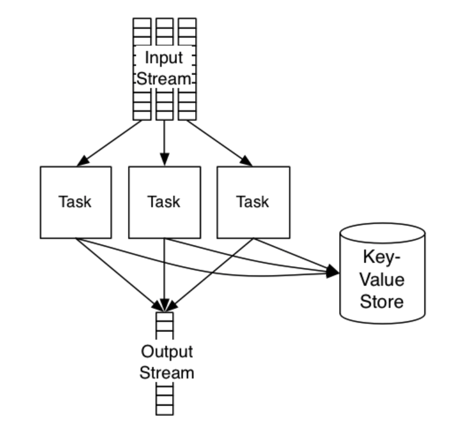
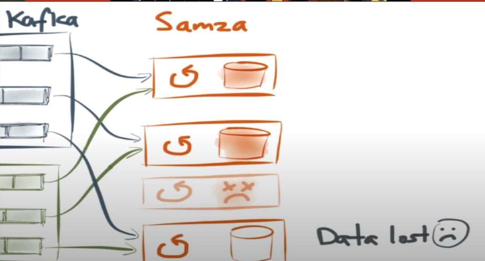
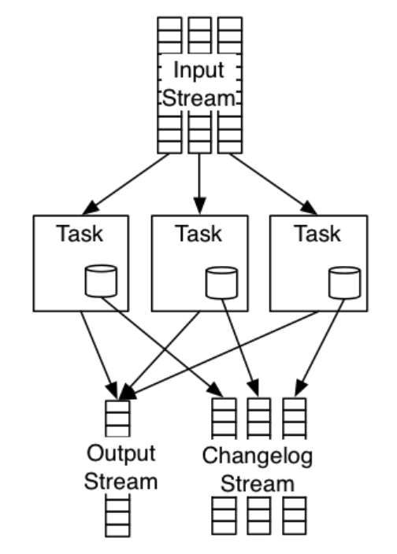
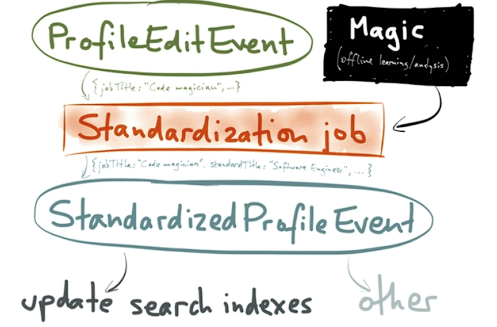
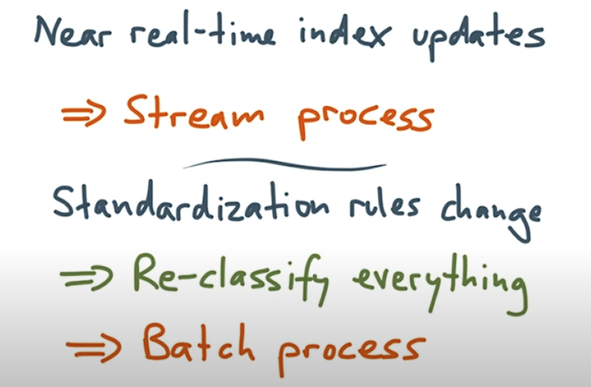
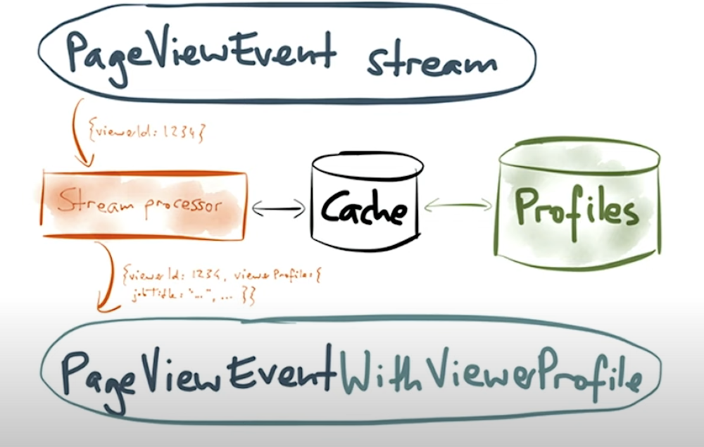
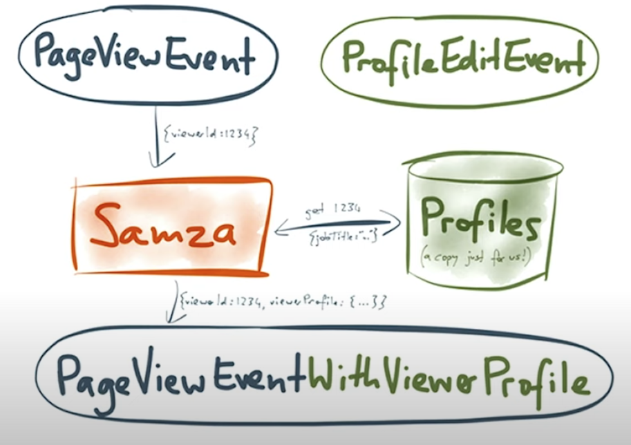

- [Problem - Stateful stream processing](#problem---stateful-stream-processing)
- [Traditional approaches](#traditional-approaches)
  - [In-memory state with checkpointing](#in-memory-state-with-checkpointing)
  - [Use an external store](#use-an-external-store)
- [How Samza achieve fault tolerant](#how-samza-achieve-fault-tolerant)
  - [Local state](#local-state)
  - [Changelog](#changelog)
  - [Parition](#parition)
  - [Changelog compaction](#changelog-compaction)
  - [Key-Value storage engine](#key-value-storage-engine)
- [Use cases](#use-cases)
  - [Window aggregation](#window-aggregation)
  - [Table-table join (Data standardization)](#table-table-join-data-standardization)
    - [Overall flowchart for standardization](#overall-flowchart-for-standardization)
    - [When standardization rule change](#when-standardization-rule-change)
      - [Lambda architecture](#lambda-architecture)
      - [Kappa architecture](#kappa-architecture)
    - [Implementation](#implementation)
  - [Stream-table join](#stream-table-join)
    - [Example - Enrich tracking events (Who viewed your profile)](#example---enrich-tracking-events-who-viewed-your-profile)
      - [Naive solution](#naive-solution)
        - [Cache](#cache)
        - [Stream processing impacts critical storage](#stream-processing-impacts-critical-storage)
      - [Solution: A second event type with profile edit](#solution-a-second-event-type-with-profile-edit)
  - [Stream-stream join](#stream-stream-join)
    - [Solution](#solution)
- [References](#references)

# Problem - Stateful stream processing 
* By analogy to SQL, the select and where clauses of a query are usually stateless, but join, group by and aggregation functions like sum and count require state.

# Traditional approaches
## In-memory state with checkpointing
* Maintain in-memory stream and periodically save the task's entire in-memory data to durable storage. 
* Cons:Too much storage if task state keeps growing. 
  * Many non-trivival use cases for joins and aggregation have large amounts of state - often gigabytes. It makes full dumps of the state impractical. 
  * Some academic system produce diffs in addition to full checkpoints, which are smaller if only some of the state has changed since the last checkpoint. However, this optimization only helps if most of the state remains unchanged.

## Use an external store
* Store the state in an external database or key-value store. 
* Cons:
  * Performance: 
    * Making database queries over a network is slow and expensive. A Kafka stream can deliver 100K+/1M messages per second per CPU core to a stream processor, but if you need to make a remote request for every message you process, your throughput is likely to drop by 2-3 orders of magnitude. You can somewhat mitigate this with careful caching of reads and batching of writes, but then you’re back to the problems of checkpointing, discussed above.
  * Isolation: 
    * If your database or service also serves requests to users, it can be dangerous to use the same database with a stream processor. A scalable stream processing system can run with very high throughput, and easily generates a huge amount of load (for example when catching up on a queue backlog). If you’re not very careful, you may cause a denial-of-service attack on your own database, and cause problems for interactive requests from users.
  * Query capabilities: 
    * Many scalable databases expose very limited query interfaces (e.g. only supporting simple key-value lookups), because the equivalent of a “full table scan” or rich traversal would be too expensive. Stream processes are often less latency-sensitive, so richer query capabilities would be more feasible.
  * Correctness: 
    * When a stream processor fails and needs to be restarted, how is the database state made consistent with the processing task? For this purpose, some frameworks such as Storm attach metadata to database entries, but it needs to be handled carefully, otherwise the stream process generates incorrect output.
  * Reprocessing: 
    * Sometimes it can be useful to re-run a stream process on a large amount of historical data, e.g. after updating your processing task’s code. However, the issues above make this impractical for jobs that make external queries.

# How Samza achieve fault tolerant

## Local state
* The state is stored on disk, so the job can maintain more state than would fit in memory.
* It is stored on the same machine as the processing task, to avoid the performance problems of making database queries over the network.
* Each job has its own datastore, to avoid the isolation problems of a shared database (if you make an expensive query, it affects only the current task, nobody else).
* Different storage engines can be plugged in, enabling rich query capabilities.
* The state is continuously replicated, enabling fault tolerance without the problems of checkpointing large amounts of state.

## Changelog
* If a machine fails, all the tasks running on that machine and their database partitions are lost. In order to make them highly available, all writes to the database partition are replicated to a durable changelog (typically Kafka). Now, when a machine fails, we can restart the tasks on another machine, and consume this changelog in order to restore the contents of the database partition.

## Parition
* Each task only has access to its own database partition, not to any other task’s partition. 
* This is important: when you scale out your job by giving it more computing resources, Samza needs to move tasks from one machine to another. 
* By giving each task its own state, tasks can be relocated without affecting the job’s operation. If necessary, you can repartition your streams so that all messages for a particular database partition are routed to the same task instance.

## Changelog compaction
* Log compaction runs in the background on the changelog topic, and ensures that the changelog does not grow indefinitely. If you overwrite the same value in the store many times, log compaction keeps only the most recent value, and throws away any old values in the log. If you delete an item from the store, log compaction also removes it from the log. With the right tuning, the changelog is not much bigger than the database itself.

## Key-Value storage engine
* Out of the box, Samza ships with a key-value store implementation that is built on RocksDB using a JNI API.
* RocksDB has several nice properties. 
  * Its memory allocation is outside of the Java heap, which makes it more memory-efficient and less prone to garbage collection pauses than a Java-based storage engine. 
  * It is very fast for small datasets that fit in memory; datasets larger than memory are slower but still possible. It is log-structured, allowing very fast writes. It also includes support for block compression, which helps to reduce I/O and memory usage.
* Samza includes an additional in-memory caching layer in front of RocksDB, which avoids the cost of deserialization for frequently-accessed objects and batches writes. If the same key is updated multiple times in quick succession, the batching coalesces those updates into a single write. The writes are flushed to the changelog when a task commits.

# Use cases
## Window aggregation
* Example: Counting the number of page views for each user per hour
* The simplest implementation keeps this state in-memory (a hashmap in the task instances)
* Cons:
  * What happens when a container fails and your in-memory state is lost. You might be able to restore it by processing all the messages in the current window again, but that might take a long time if the window covers a long period of time.
* Implementation: You need two processing stages.
  * The first one re-partitions the input data by user ID, so that all the events for a particular user are routed to the same stream task. If the input stream is already partitioned by user ID, you can skip this.
  * The second stage does the counting, using a key-value store that maps a user ID to the running count. For each new event, the job reads the current count for the appropriate user from the store, increments it, and writes it back. When the window is complete (e.g. at the end of an hour), the job iterates over the contents of the store and emits the aggregates to an output stream.

## Table-table join (Data standardization)
* Job terms get standardized to basic categories.

### Overall flowchart for standardization

### When standardization rule change
* Expect search index update happening in real time

#### Lambda architecture
* Cons: Implement the same job twice

#### Kappa architecture
* Process realtime data and reprocess historical data in the same framework

* There could be two jobs. Each job writes result to a different location. 
  * One consuming the latest entries in the stream
  * The other one starting from the beginning

* The client could switch over when the new standardization rule when it is ready

### Implementation
* The job subscribes to the change streams for the user profiles database and the user settings database, both partitioned by user_id. 
* The job keeps a key-value store keyed by user_id, which contains the latest profile record and the latest settings record for each user_id. 
* When a new event comes in from either stream, the job looks up the current value in its store, updates the appropriate fields (depending on whether it was a profile update or a settings update), and writes back the new joined record to the store. The changelog of the store doubles as the output stream of the task.

## Stream-table join 
### Example - Enrich tracking events (Who viewed your profile)
* Once you have the tracking events, a number of use cases are possible. 

#### Naive solution

* Too slow because connecting to database could be slow

##### Cache
* If expiration time is too short, not much benefit.
* If expiration time is too long, outdated profiles. 

##### Stream processing impacts critical storage
* After a stream processing is shutdown for half an hour (pretty common in production) and restarted, it will hit the database really quick because it is designed to be realtime.

#### Solution: A second event type with profile edit

* Every time get a profile edit event, write to a profile edit database. Each time who edits an event, write to a profiles database. 

 

* Samza has an embedded database which could hold profiles. 

## Stream-stream join
* Example: Join a stream of ad clicks to a stream of ad impressions (to link the information on when the ad was shown to the information on when it was clicked)
* In this example we assume that each impression of an ad has a unique identifier, e.g. a UUID, and that the same identifier is included in both the impression and the click events. This identifier is used as the join key.

### Solution
* Partition the ad click and ad impression streams by the impression ID or user ID (assuming that two events with the same impression ID always have the same user ID). The task keeps two stores, one containing click events and one containing impression events, using the impression ID as key for both stores. When the job receives a click event, it looks for the corresponding impression in the impression store, and vice versa. If a match is found, the joined pair is emitted and the entry is deleted. If no match is found, the event is written to the appropriate store. Periodically the job scans over both stores and deletes any old events that were not matched within the time window of the join.

# References
* [Building real-time data products at LinkedIn with Apache Samza](https://www.youtube.com/watch?v=yO3SBU6vVKA&list=PLeKd45zvjcDHJxge6VtYUAbYnvd_VNQCx&index=7)
* [Scalable real-time data processing with Apache Samza](https://www.youtube.com/watch?v=uRmYJGRPfKU&list=PLeKd45zvjcDHJxge6VtYUAbYnvd_VNQCx&index=17)
* [Samza: Stateful stream processing](https://samza.apache.org/learn/documentation/0.9/container/state-management.html)
* [Samza usage at Uber](https://www.youtube.com/watch?v=i4QxJIHrfOY)
