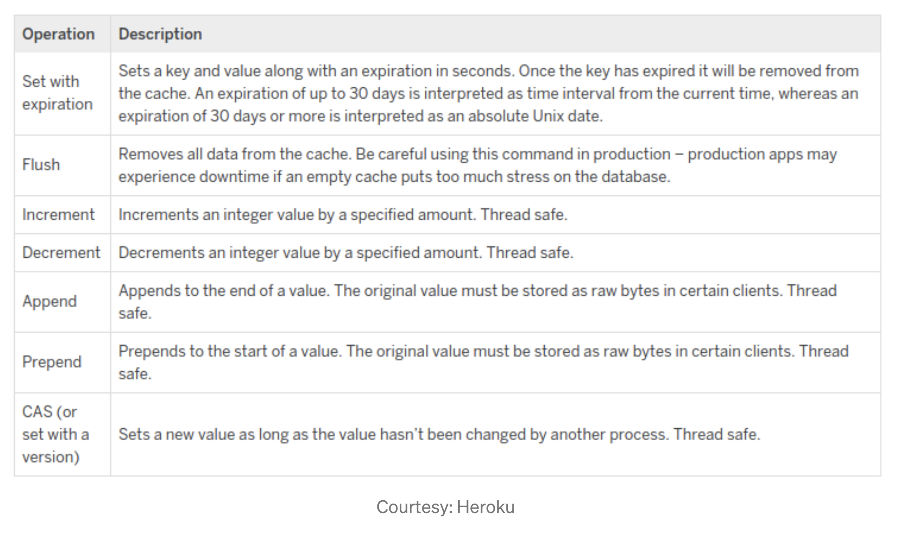

# Def
Free & open source, high-performance, distributed memory object caching system, generic in nature, but intended for use in speeding up dynamic web applications by alleviating database load. Memcached is an in-memory key-value store for small arbitrary data (strings, objects).

# Features
* Memcached is engineered as a high performance caching solution that can satisfy throughput of very large, internet scale apps.
* It’s very easy to install & deploy as by design, Memcached is a bare bone cache.
* Very low cost solution, licensed under the revised BSD license.
* Simple key value store. Memcached does not understand what an application is saving — it can store String & Object values, keys are always of type String. It allows storing object as value in serialized form. So before saving any object, you have to serialize it, after retrieval you have to deserialize it accordingly.
* In a distributed settings, Memcached nodes don’t talk to each other, there is no synchronization, no replication. So essentially it embraces simple design where client has to choose the node where it has to read / write a particular data.
* It’s multi-threaded. So it can take advantage of multiple CPU cores.
* All memcached commands are fast & lock free as possible. So query speed is near deterministic for all cases.
* Client keeps the logic to map cache keys to nodes in case multiple nodes are available.
* Apart from Get, Set & Delete operation, memcached offers other features as well like — key expiration (TTL), completely flushing the database, light weight counters which support increment & decrement operation, a native list data structure which supports append & prepend operations of items, thread safe CAS (Compare & Swap) backed set operation.
* Cache invalidation is easy as client keeps track of which key is going to which node, it can just delete that key from that node.

# Operations

# Memory Management Technique
* Memcached only supports LRU memory management. So analyze your use case carefully before choosing this solution.

# Suitable Usecases
Store simple string key / value pairs. Store database resultset object, HTTP api response, or serializable in-memory objects, JSON / XML document as value with a string key, results of page rendering etc.

# Limitations
* Since there is no persistence, with every crash or restart, you need to warm up or refill data every time.
* If you want to store large objects or data sets, serialized representation of data may take more space & can make the memory fragmented.
* Memcached limits size of data upto 1 MB per key.
* Avoid read-modify-write operation use cases. Since you need to serialize / deserialize objects while inserting / retrieving data, update operations seem to be very costly. Try to store immutable objects with expiration time as much as possible.
* Memcached is not good for enterprise use cases. It does not offer many features like automatic elastic cluster management, sophisticated high availability, auto failover, load re-balancing, cross data centre replication etc.
* It lacks advance monitoring & tooling ecosystem for administrative use cases. If you face any issue, either you have to depend on your resource or the Memcached community, there is no commercial entity supporting it.

# References
* https://engineering.linkedin.com/blog/2018/05/evolution-of-couchbase-at-linkedin
* https://medium.datadriveninvestor.com/all-things-caching-use-cases-benefits-strategies-choosing-a-caching-technology-exploring-fa6c1f2e93aa