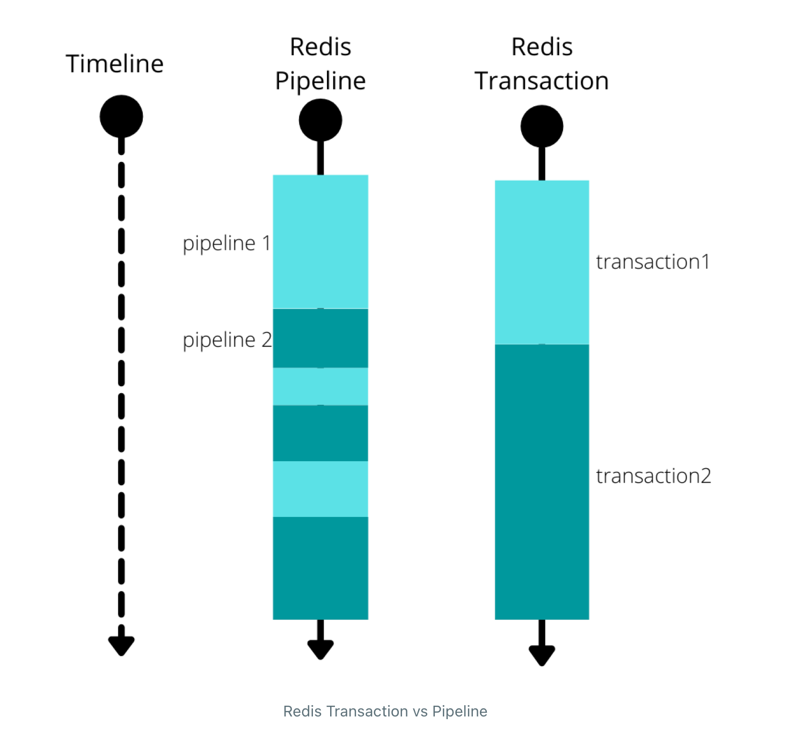
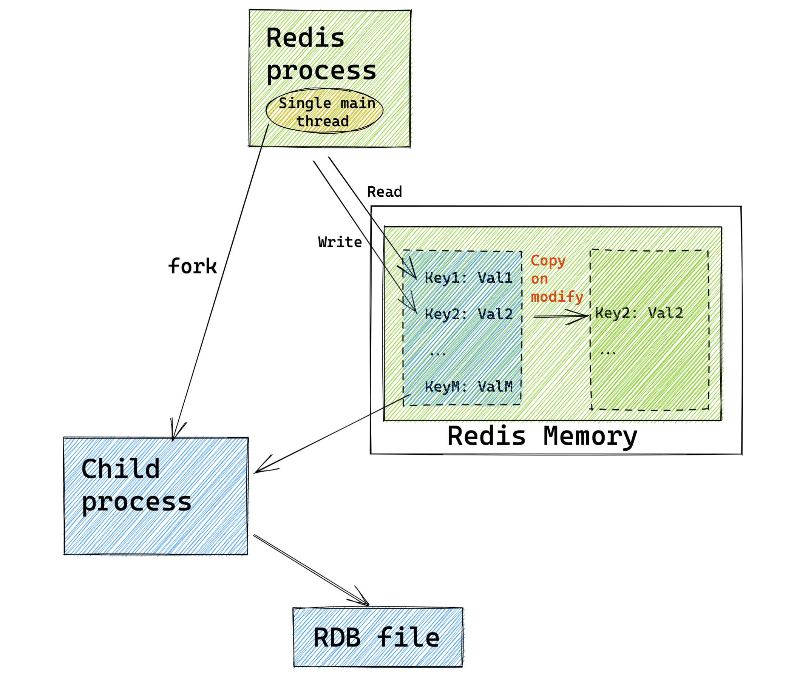
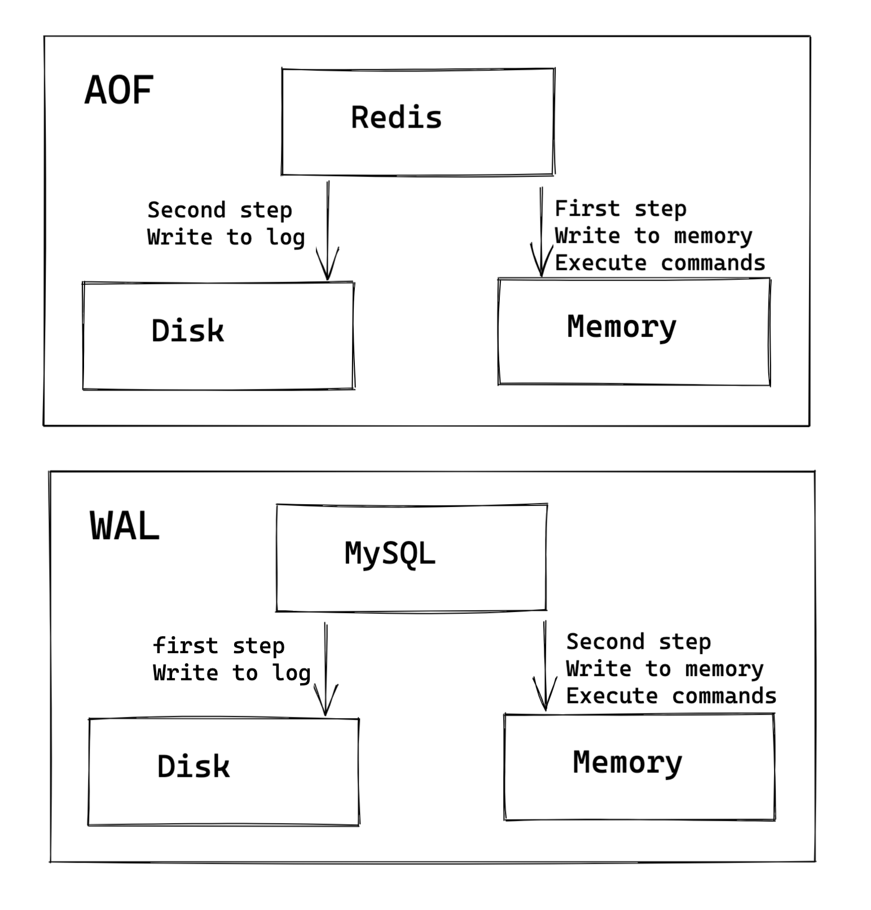
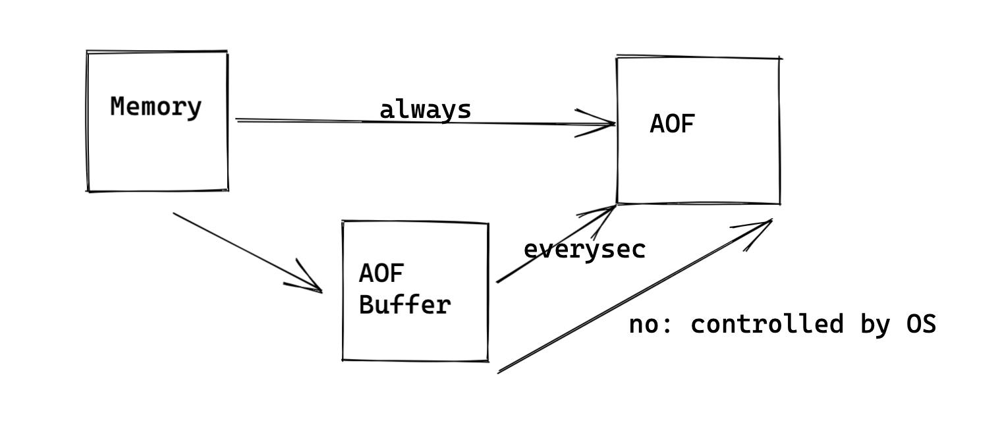
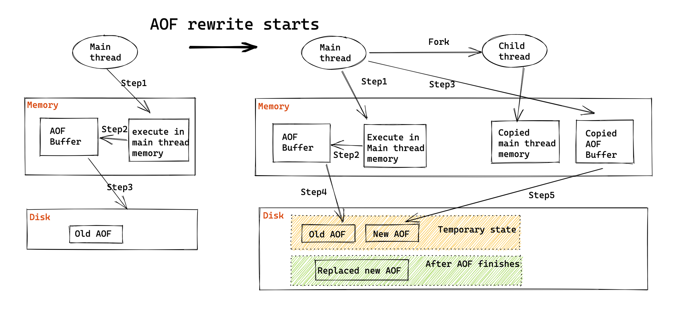

- [Atomicity](#atomicity)
  - [Atomic commands](#atomic-commands)
  - [Pipeline](#pipeline)
    - [Def](#def)
    - [Benefits](#benefits)
    - [Use case](#use-case)
    - [Purely a client-side implementation](#purely-a-client-side-implementation)
    - [Limitations](#limitations)
      - [Not atomic](#not-atomic)
      - [Could not use previous result as input for subsequent command](#could-not-use-previous-result-as-input-for-subsequent-command)
  - [Redis transaction](#redis-transaction)
    - [Def](#def-1)
    - [Benefits](#benefits-1)
      - [Could guarantee in atomicity in some cases](#could-guarantee-in-atomicity-in-some-cases)
    - [Limitations](#limitations-1)
      - [Could not use previous result as input for subsequent command](#could-not-use-previous-result-as-input-for-subsequent-command-1)
  - [Lua scripts](#lua-scripts)
    - [Def](#def-2)
    - [Benefits](#benefits-2)
      - [100% Atomicity](#100-atomicity)
      - [Could use previous result as input for subsequent command](#could-use-previous-result-as-input-for-subsequent-command)
- [Consistency](#consistency)
  - [Could be achieved by Redis Transactions](#could-be-achieved-by-redis-transactions)
- [Isolation](#isolation)
  - [Could be achieved by Redis Transaction + Watch](#could-be-achieved-by-redis-transaction--watch)
- [Durability](#durability)
  - [RDB (Redis Database)](#rdb-redis-database)
    - [Commands](#commands)
    - [COW (Copy-On-Write)](#cow-copy-on-write)
    - [Frequency](#frequency)
  - [AOF (Append-only File)](#aof-append-only-file)
    - [AOF vs WAL](#aof-vs-wal)
    - [AOF frequency](#aof-frequency)
    - [Rewrite](#rewrite)
      - [Motivation](#motivation)
      - [Process](#process)
  - [Combined approach of RDB and AOF](#combined-approach-of-rdb-and-aof)

# Atomicity
* https://rafaeleyng.github.io/redis-pipelining-transactions-and-lua-scripts

## Atomic commands
* INCR / DECR

## Pipeline
### Def
* A Request/Response server can be implemented so that it is able to process new requests even if the client didn't already read the old responses. This way it is possible to send multiple commands to the server without waiting for the replies at all, and finally read the replies in a single step.

### Benefits
* Batching several commands in a single message allows us to save multiple times the round trip time between the client and the Redis server
* Improves a huge amount of total operations you could perform per second on a single redis server because it avoids many context switch. From the point of view of doing the socket I/O, this involves calling the read\(\) and write\(\) syscall, that means going from user land to kernel land. The context switch is a huge speed penalty. 

### Use case
* Under transaction commands such as MULTI, EXEC
* The commands which take multiple arguments: MGET, MSET, HMGET, HMSET, RPUSH/LPUSH, SADD, ZADD
* [https://redislabs.com/ebook/part-2-core-concepts/chapter-4-keeping-data-safe-and-ensuring-performance/4-5-non-transactional-pipelines/](https://redislabs.com/ebook/part-2-core-concepts/chapter-4-keeping-data-safe-and-ensuring-performance/4-5-non-transactional-pipelines/)

### Purely a client-side implementation
* Buffer the redis commands/operations on the client side. Synchronously or asynchronously flush the buffer periodically depending on the client library implementation.
* Redis executes these operations as soon as they are received at the server side. Subsequent redis commands are sent without waiting for the response of the previous commands. Meanwhile, the client is generally programmed to return a constant string for every operation in the sequence as an immediate response.
* Pipelining in Redis consists of sending multiple commands to the server in the same message, separating commands by newline. You can test this (assuming you have Redis running locally on default port 6379) with printf "INCR x\r\nINCR x\r\n" | nc localhost 6379.
* [http://blog.nachivpn.me/2014/11/redis-pipeline-explained.html](http://blog.nachivpn.me/2014/11/redis-pipeline-explained.html)
* How does stackexchange implements pipelines: 
  * [https://stackexchange.github.io/StackExchange.Redis/PipelinesMultiplexers.html](https://stackexchange.github.io/StackExchange.Redis/PipelinesMultiplexers.html)

### Limitations
#### Not atomic

* The difference is pipelines are not atomic whereas transactions are atomic, meaning 2 transactions do not run at the same time, whereas multiple pipelines can be executed by Redis-server at the same time in an interleaved fashion.

#### Could not use previous result as input for subsequent command
* you don't need the response of a previous command as input for a subsequent command (because you only get all responses in the end).

## Redis transaction
### Def
* A transaction works by issuing a MULTI command, then sending all the commands that compose the pipeline, and an EXEC or a DISCARD at the end.

### Benefits
#### Could guarantee in atomicity in some cases
* When error is thrown out during enqueuing process, transaction will be discarded and atomicity could be guaranteed. 
  * If it is a syntax error (like wrong number of arguments), it is detected while queuing the commands and the transaction won't even be executed.
* When commands are enqueued correctly but errors are thrown out from **code itself** during execution, atomicity could not be guaranteed. 
  * If it is a semantic error (like an operation on the wrong data type), it is only detected while executing the transaction, and (just like with pipelines), the error will be returned inside the list of responses, as the response for the specific command. But subsequent commands in the queue will be executed normally, and the transaction won't be aborted. This means that Redis doesn't have a rollback mechanism like traditional RDBMS.
* When commands are enqueued correctly but errors are thrown out from **machine** during execution, if AOF is turned on, atomicity could be guaranteed. 
* Please see [Chinese article on Geektime for details](https://time.geekbang.org/column/article/301491)

### Limitations
#### Could not use previous result as input for subsequent command
* you don't need the response of a previous command as input for a subsequent command (because you only get all responses in the end).

## Lua scripts
### Def
* A Lua script is loaded on the Redis server and can be later invoked with parameters (using the EVALSHA command). You can also send the whole script on every invocation (with the EVAL command), but you should avoid doing this for performance reasons.

### Benefits
#### 100% Atomicity

#### Could use previous result as input for subsequent command
* Unlike with pipelining and transactions, in a Lua script we can manipulate intermediate results. It is, we can read a value from Redis using a command, store the result in a Lua variable, and later use the value in a command or even in some logic like an if statement. 

# Consistency 
## Could be achieved by Redis Transactions
* When error is thrown out during enqueuing process, transaction will be discarded and consistency could be guaranteed. 
* When commands are enqueued correctly but errors are thrown out from **code itself** during execution, consistency could be guaranteed. 
* When commands are enqueued correctly but errors are thrown out from **machine** during execution
  * If AOF is turned on
    * If partial record is written inside AOF, then redis-check-aof tool could be used to guarantee consistency
    * If no record is written inside AOF, then consistency could be guaranteed. 
  * If RDB is turned on
    * RDB will not be executed when transaction is ongoing so transaction commands will not be saved inside RDB. So when using RDB for recovery purpose, consistency could be guaranteed. 

# Isolation
## Could be achieved by Redis Transaction + Watch

# Durability
## RDB (Redis Database)
### Commands
* Command: SAVE vs BGSAVE. BGSave will fork a child process to create RDB file, avoiding blocking main thread.

### COW (Copy-On-Write)
* Both RDB and AOF relies on Unix Copy on Write mechanism
* [http://oldblog.antirez.com/post/a-few-key-problems-in-redis-persistence.html](http://oldblog.antirez.com/post/a-few-key-problems-in-redis-persistence.html)

### Frequency
* Cons if taking snapshots too frequently:
  * Much pressure on disk IO
  * Although creating RDB file is done by a separate forked process, the process of forking a process is done by the main redis thread and it probably will block the process. 

## AOF (Append-only File)

### AOF vs WAL
* MySQL redo log: Write log first, then execute command.
* MySQL AOF log: Execute command first, then write log. 
* Pros of AOF:
  * If there is an error in the command, executing commands first could guarantee that it could be found. 
  * Writing log will not delay/potentially block executing the command. 
* Cons of AOF: 
  * If a machine crashes after executing a command, then this command is not inside log and will lose. 
  * AOF has the potential of blocking next command. 

### AOF frequency
* always (write synchronously): After executing each command, synchronously log the commands in AOF.
* everysec (write every second): After executing each command, write it in AOF buffer first. Then flush commands from AOF buffer to AOF every second.
* no (write controllbed by OS): After executing each command, write it in AOF buffer. Then let OS system decide when to flush it inside AOF.

### Rewrite
#### Motivation
* File system has a limit on file size and could not store too big items.
* If the file is too big, appending commands inside will cause delays. 
* If the machine is down, then all commands inside AOF will need to be executed one by one. Having a too big AOF command will result in super slow recovery. 

#### Process
* AOF rewrite doesn't need to read the original AOF file. It directly reads from database. 
* Redis fork a child process to execute AOF rewrite dedicatedly. Redis opens a AOF rewrite buffer to keep all the instructions received during the rewriting process. At the end of rewriting AOF file, all instructions within AOF rewrite buffer will be flushed to the new AOF file. 

## Combined approach of RDB and AOF
* AOF stores commands. Reasons that could not rely on AOF alone:
  * Will take time to recover in case of outage because AOF stores commands
* RDB stores states. Reasons that could not rely on RDB alone:
  * Need full snapshot and incremental snapshot (Incremental snapshot needs much separate storage)
* Pros and Cons between RDB and AOF
  * [https://redis.io/topics/persistence](https://redis.io/topics/persistence)
* States + Commands (Snapshot + AOF): Usually it adopts a combined approach of RDB and AOF. 