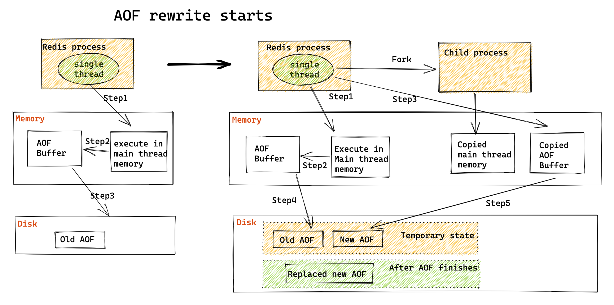

- [Durability](#durability)
  - [COW](#cow)
  - [Pros and Cons between RDB and AOF](#pros-and-cons-between-rdb-and-aof)
  - [RDB](#rdb)
  - [AOF (Append-only File)](#aof-append-only-file)
    - [AOF vs WAL](#aof-vs-wal)
    - [AOF frequency](#aof-frequency)
    - [Rewrite](#rewrite)
      - [Motivation](#motivation)
      - [Process](#process)

# Durability
## COW
* Both RDB and AOF relies on Unix Copy on Write mechanism
* [http://oldblog.antirez.com/post/a-few-key-problems-in-redis-persistence.html](http://oldblog.antirez.com/post/a-few-key-problems-in-redis-persistence.html)

## Pros and Cons between RDB and AOF

* [https://redis.io/topics/persistence](https://redis.io/topics/persistence)

## RDB

* Command: SAVE vs BGSAVE. Whether a child process is forked to create RDB file. 
* BGSAVE - Automatic save condition
  * saveparam format: save seconds changes
  * dirty attribute: How many databse operations have been performed after the last time.
  * lastsave: A unix timestamp - the last time the server executes SAVE or BGSAVE. 

```text
def serverCron():
    for saveParam in server.saveparams:
        save_internal = unixtime_now() - server.lastsave

        if server.dirty >= saveparam.changes 
            and save_internal > saveparams.seconds:
                BGSAVE()
```

## AOF (Append-only File)

### AOF vs WAL
* MySQL redo log: Write log first, then execute command.
* MySQL AOF log: Execute command first, then write log. 
* Pros of AOF:
  * If there is an error in the command, executing commands first could guarantee that it could be found. 
  * Writing log will not delay/potentially block executing the command. 
* Cons of AOF: 
  * If a machine crashes after executing a command, then this command is not inside log and will lose. 
  * AOF has the potential of blocking next command. 


### AOF frequency
* always (write synchronously): After executing each command, synchronously log the commands in AOF.
* everysec (write every second): After executing each command, write it in AOF buffer first. Then flush commands from AOF buffer to AOF every second.
* no (write controllbed by OS): After executing each command, write it in AOF buffer. Then let OS system decide when to flush it inside AOF.


### Rewrite
#### Motivation
* File system has a limit on file size and could not store too big items.
* If the file is too big, appending commands inside will cause delays. 
* If the machine is down, then all commands inside AOF will need to be executed one by one. Having a too big AOF command will result in super slow recovery. 

#### Process
* AOF rewrite doesn't need to read the original AOF file. It directly reads from database. 
* Redis fork a child process to execute AOF rewrite dedicatedly. Redis opens a AOF rewrite buffer to keep all the instructions received during the rewriting process. At the end of rewriting AOF file, all instructions within AOF rewrite buffer will be flushed to the new AOF file. 

