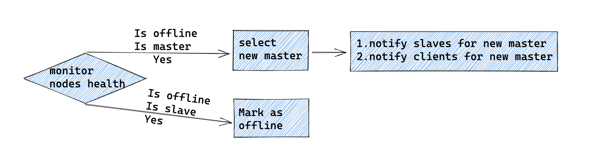
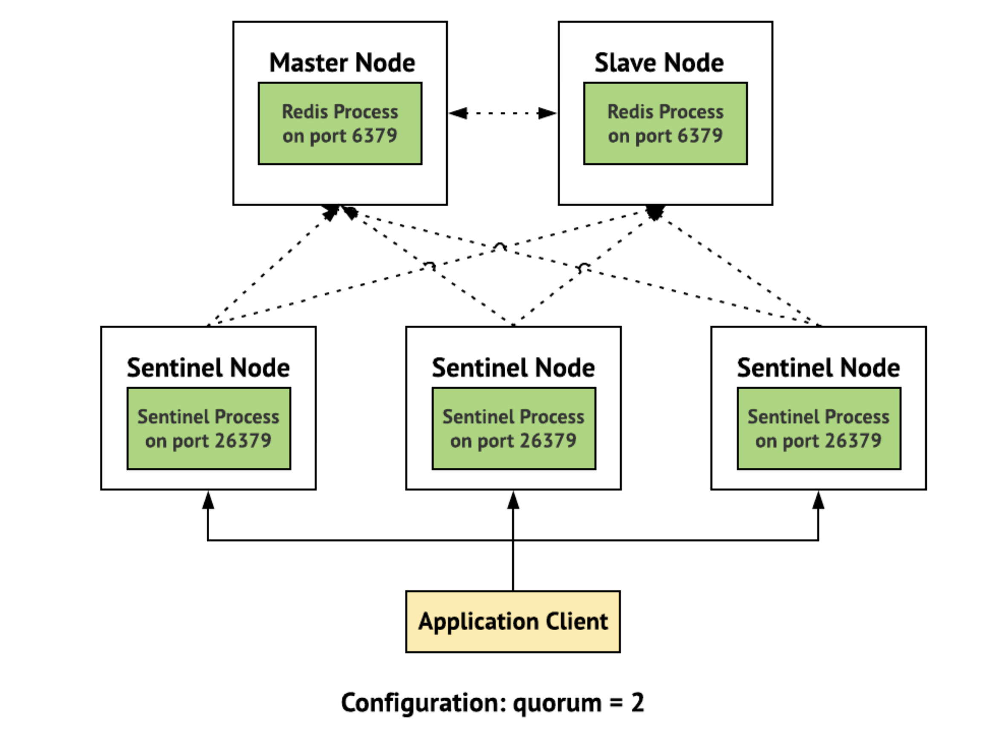
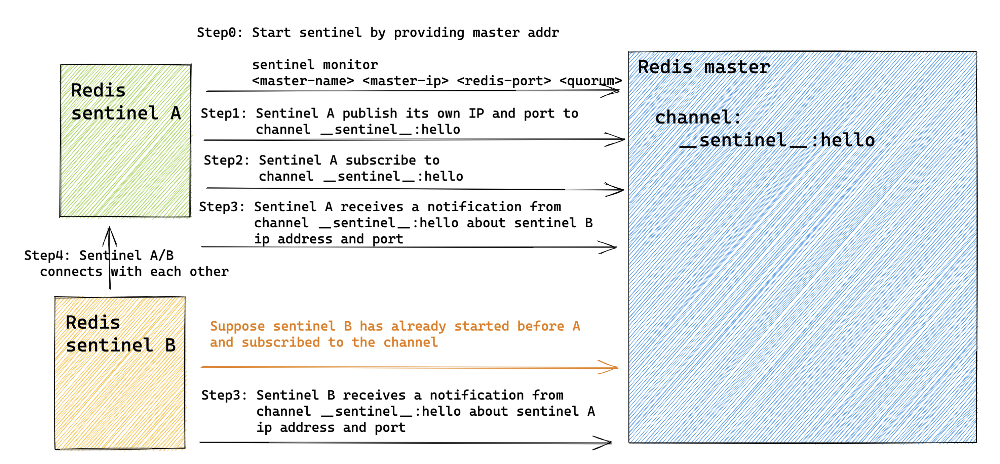

- [Replication](#replication)
  - [Ring buffer as replication buffer](#ring-buffer-as-replication-buffer)
    - [Def](#def)
    - [Size](#size)
    - [Advantages](#advantages)
    - [Disadvantages](#disadvantages)
- [HA Availability - Sentinel](#ha-availability---sentinel)
  - [Def](#def-1)
  - [Health detection](#health-detection)
    - [Qurom](#qurom)
    - [Subjective and objective down state](#subjective-and-objective-down-state)
  - [Master election](#master-election)
    - [Step1: Remove insuitable nodes](#step1-remove-insuitable-nodes)
    - [Step2: Rank remaining nodes](#step2-rank-remaining-nodes)
  - [State notifications](#state-notifications)
    - [Connection between sentinels](#connection-between-sentinels)
    - [Connection between sentinel and redis master](#connection-between-sentinel-and-redis-master)
    - [Connection between sentinel and redis slave](#connection-between-sentinel-and-redis-slave)
  - [Ref](#ref)

# Replication


## Ring buffer as replication buffer
### Def
* A ring buffer is a circular queue with a maximum size or capacity which will continue to loop back over itself in a circular motion.

* http://tutorials.jenkov.com/java-performance/ring-buffer.html


### Size
* On the ring buffer, Master maintains a pointer called `master_repl_offset` (namely write pos) and slaves maintains a pointer called `slave_repl_offset` (namely read pos). 


* The size of the buffer should take the following factors into consideration:
  * The write speed on the master
  * The transmission speed between master and slaves
* It could be calculated as

```
BufferSpace = MasterWriteSpeed * OperationSize - TransmissionSpeed * OperationSize

// By default, buffer size is 1M. 
// e.g. Master write speed 2000 RPS, size 2K, transmission speed 1000
BufferSpace = (2000 - 1000) * 2K = 2M
```

### Advantages
* Circular Queues offer a quick and clean way to store FIFO data with a maximum size.
* Doesn’t use dynamic memory → No memory leaks
* Conserves memory as we only store up to our capacity (opposed to a queue which could continue to grow if input outpaces output.)
* Simple Implementation → easy to trust and test
* Never has to reorganize / copy data around
* All operations occur in constant time O(1)

### Disadvantages
* Circular Queues can only store the pre-determined maximum number of elements.
* Have to know the max size beforehand

# HA Availability - Sentinel
## Def
* Initialization: Sentinel is a redis server running on a special mode
  * Sentinel will not load RDB or AOF file.
  * Sentinel will load a special set of Sentinel commands.
* It will 
  * Monitor your master & slave instances, notify you about changed behaviour.
  * Handle automatic failover in case a master is down.
  * Act as a configuration provider, so your clients can find the current master instance.



## Health detection
* Redis sentinel will form a cluster. Each sentinel instance will ping redis master/slave server for connectivity. If an instance does not respond to ping requests correctly, it will be considered in subjective down state. Only when quorum of sentinel cluster consider a master in subjective down state, master-slave failover will happen. 



### Qurom
* Use cases: Considering a master as objectively downstate; Authorizing the failover process
* Quorum could be used to tune sentinel in two ways:
  * If a the quorum is set to a value smaller than the majority of Sentinels we deploy, we are basically making Sentinel more sensible to master failures, triggering a failover as soon as even just a minority of Sentinels is no longer able to talk with the master.
  * If a quorum is set to a value greater than the majority of Sentinels, we are making Sentinel able to failover only when there are a very large number \(larger than majority\) of well connected Sentinels which agree about the master being down.

### Subjective and objective down state
* Subjective down state: An SDOWN condition is reached when it does not receive a valid reply to PING requests for the number of seconds specified in the configuration as is-master-down-after-milliseconds parameter.
* Objective down state: When enough Sentinels \(at least the number configured as the quorum parameter of the monitored master\) have an SDOWN condition, and get feedback from other Sentinels using the SENTINEL is-master-down-by-addr command.

* Sentinels and slaves auto discovery
  * You don't need to configure a list of other Sentinel addresses in every Sentinel instance you run, as Sentinel uses the Redis instances Pub/Sub capabilities in order to discover the other Sentinels that are monitoring the same masters and slaves. Similarly you don't need to configure what is the list of the slaves attached to a master, as Sentinel will auto discover this list querying Redis.
  * Process
    * Every Sentinel publishes a message to every monitored master and slave Pub/Sub channel **sentinel**:hello, every two seconds, announcing its presence with ip, port, runid.
    * Every Sentinel is subscribed to the Pub/Sub channel **sentinel**:hello of every master and slave, looking for unknown sentinels. When new sentinels are detected, they are added as sentinels of this master.
    * Hello messages also include the full current configuration of the master. If the receiving Sentinel has a configuration for a given master which is older than the one received, it updates to the new configuration immediately.

## Master election
### Step1: Remove insuitable nodes
* If a slave that is found to be disconnected from the master for more than ten times the configured master timeout \(down-after-milliseconds option\), plus the time the master is also not available from the point of view of the Sentinel doing the failover, is considered to be not suitable for the failover and is skipped.

### Step2: Rank remaining nodes
* Slaves will consider the following factors in order. As long as there is a slave winner in one round, it will be elected as master. Otherwise, it will continue to the next factor. 
  1. Slave priority: Each slave could be configured with a manual number slave-priority. The slaves are sorted by slave-priority as configured in the redis.conf file of the Redis instance. A lower priority will be preferred.
  2. Close to old master in terms of replication offset. If the priority is the same, the replication offset processed by the slave is checked, and the slave that received more data from the master is selected.
  3. Slave instance ID. Having a lower run ID is not a real advantage for a slave, but is useful in order to make the process of slave selection more deterministic, instead of resorting to select a random slave.

* Slave selection: Relies on [Raft protocol](http://thesecretlivesofdata.com/raft/)

## State notifications
### Connection between sentinels



### Connection between sentinel and redis master

[]()

### Connection between sentinel and redis slave

* Sentinel's server cron operations
  * Detect instance's objective and subjective downstate by sending PING commands
  * Automatically discover sentinel and slave nodes by subscribing to channel **sentinel**:hello
  * Leader selection and failover

* Configuratin epochs
  * Epoch is similar to Raft algorithm's term.
  * When a Sentinel is authorized, it gets a unique configuration epoch for the master it is failing over. This is a number that will be used to version the new configuration after the failover is completed. Because a majority agreed that a given version was assigned to a given Sentinel, no other Sentinel will be able to use it.
* [https://redis.io/topics/sentinel](https://redis.io/topics/sentinel)

## Ref
* Sentinel is Redis' resiliency solution to standalone redis instance. 
  * See [Compare redis deployments](https://blog.octo.com/en/what-redis-deployment-do-you-need/) for details.
