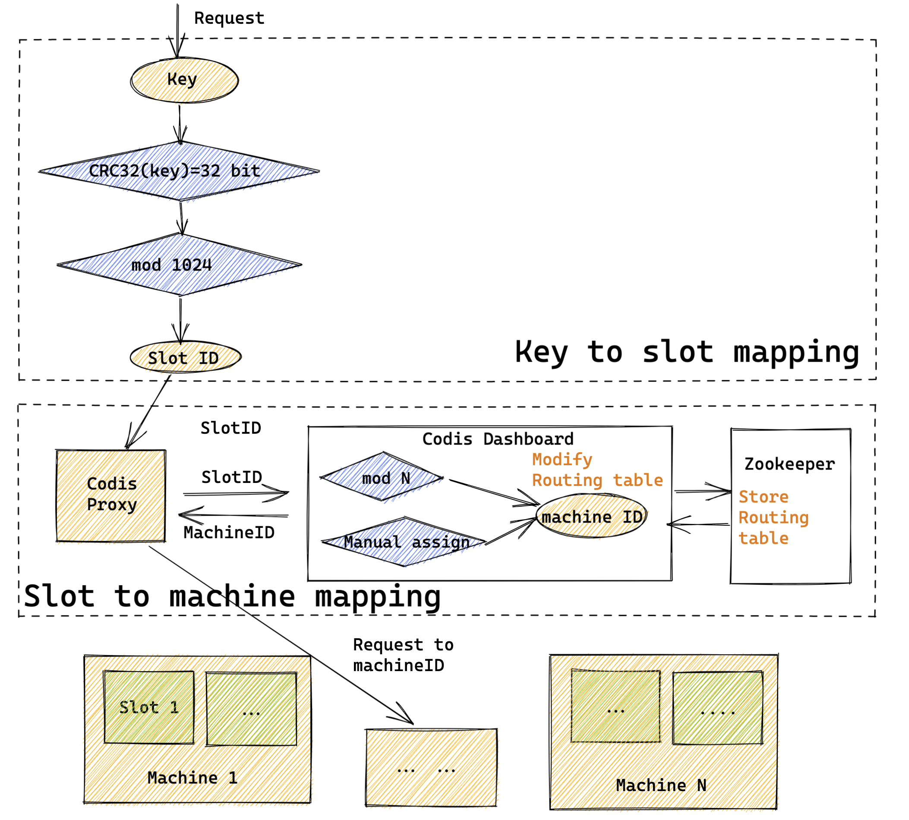

- [Codis](#codis)
  - [key distribution model](#key-distribution-model)
  - [Resharding](#resharding)
- [Redis cluster](#redis-cluster)
  - [Key distribution model](#key-distribution-model-1)
  - [Resharding](#resharding-1)
    - [Trigger conditions](#trigger-conditions)
    - [Resharding commands](#resharding-commands)
      - [SETSLOT command internals](#setslot-command-internals)
    - [Move redirection](#move-redirection)
    - [Ask redirection](#ask-redirection)
  - [Gossip protocol](#gossip-protocol)
    - [Frequency](#frequency)
    - [Size of PING/PONG message](#size-of-pingpong-message)
    - [Bandwidth consumption with example](#bandwidth-consumption-with-example)
- [High availability](#high-availability)
  - [Step0: Health detection - PFAIL to FAIL state](#step0-health-detection---pfail-to-fail-state)
    - [Weak agreement](#weak-agreement)
    - [FAIL propogation](#fail-propogation)
  - [Step1: Slave election and promotion](#step1-slave-election-and-promotion)
  - [Step2: Configuration epoch](#step2-configuration-epoch)
    - [Cluster current epoch](#cluster-current-epoch)
    - [Configuration epoch](#configuration-epoch)

# Codis
## key distribution model



## Resharding


# Redis cluster
* Redis Cluster is designed to survive failures of a few nodes in the cluster, but it is not a suitable solution for applications that require availability in the event of large net splits.

## Key distribution model

* HASH\_SLOT = CRC16\(key\) mod 16384
* Hashtag could force multiple keys are allocated in the same slots and it is used to implement multi-key operations in redis cluster.


## Resharding
### Trigger conditions
* Add a new node
* Remove an existing node
* Rebalance the cluster among nodes

### Resharding commands
* CLUSTER ADDSLOTS slot1 \[slot2\] ... \[slotN\]
* CLUSTER DELSLOTS slot1 \[slot2\] ... \[slotN\]
* CLUSTER SETSLOT slot NODE node
* CLUSTER SETSLOT slot MIGRATING node
* CLUSTER SETSLOT slot IMPORTING node

#### SETSLOT command internals

1. redis-trib sends target node CLUSTER SETSLOT $slot IMPORTING $source\_id so that target node is prepared to import key value pairs from slot. 
   * On the node side, there is a bitmap 

```text
typedef struct clusterState
{
    // ...
    clusterNode *importing_slots_from[16384];

    // ...
}
```

1. redis-trib sends source node CLUSTER SETSLOT $slot MIGRATING $target\_id so that source node is prepared to migrate key value pairs to slot.
   * On the node side, there is a bitmap

```text
typedef struct clusterState
{
    // ...
    clusterNode *migrating_slots_to[16384];

    // ...
}
```

1. redis-trib sends source node CLUSTER GETKEYSINSLOT $slot $count to get at most count number of key names belonging to slot.
2. for every key name obtained in step 3, redis-trib will send source node a MIGRATE $target\_ip $target\_port $key\_name 0 $time\_out command to migrate the slots from source to dest node.
3. Repeat step 3 and 4 until all key-value pairs belong to the slots have been migrated.
4. redis-trib sends CLUSTER SETSLOT $slot NODE $target\_id which will be broadcasted to all the nodes within the cluster.

### Move redirection
* MOVED means that we think the hash slot is permanently served by a different node and the next queries should be tried against the specified node, 


### Ask redirection
* ASK means to send only the next query to the specified node.
* ASK semantics for client:
  * If ASK redirection is received, send only the query that was redirected to the specified node but continue sending subsequent queries to the old node.
  * Start the redirected query with the ASKING command.
  * Don't yet update local client tables to map hash slot 8 to B.
* ASK semantics for server:
  * If the client has flag REDIS\_ASKING and clusterStates\_importing\_slots\_from\[i\] shows node is importing key value i, then node will execute the the client command once. 

## Gossip protocol

### Frequency
1. Each second, randomly picks 1/10 neighbor nodes from local routing table and sends PING message to the most delayed node. 
  * Cons: If only relying on random pick, some nodes might have significant delay. 
2. To compenstate cons of 1, redis cluster will scan local instance table. If there is a node which has not received PONG message bigger than configured cluster-node-timeout/2, then it will immediately send PING message to the node. 

### Size of PING/PONG message
* A single PING message ~ 12KB
  * clusterMsgDataGossip itself is roughly 100 Bytes. 
  * Suppose the cluster has 1000 nodes, then it will send
  * 100 (random neighbor nodes) + 1 (node itself) = 100 * 100 bytes = 10KB
  * Bitmap of 16384 length: 16386 = 2^14 bits = 2^14 / 8 bytes = 2^11 bytes = 2KB
* Receiving corresponding PONG message ~ 12KB


### Bandwidth consumption with example
* Suppose the cluster size is 1000. 
* Suppose every 100ms there are 10 instances who receive timeout PONG messages. 
* Each second this node will send 101 PING message. 
* Then each second this node will consume 101 * 12KB = 1.2 MB/s bandwidth outbound
* 1000 nodes will consume 1000 * 1.2 MB/s = 1.2 GB/s

# High availability
* Similar to how Redis Sentinel marks a node from subjective down state to objective down state. Please see [redis sentinel high availability](https://eric-zhang-seattle.gitbook.io/mess-around/cache/redis/redisavailability#ha-availability---sentinel)
* Redis cluster node will marks a node from PFAIL to FAIL. 

## Step0: Health detection - PFAIL to FAIL state

* PFAIL: PFAIL means Possible failure, and is a non-acknowledged failure type. A node flags another node with the PFAIL flag when the node is not reachable for more than NODE\_TIMEOUT time. Both master and slave nodes can flag another node as PFAIL, regardless of its type. 
* FAIL: FAIL means that a node is failing and that this condition was confirmed by a majority of masters within a fixed amount of time. 
* PFAIL =&gt; FAIL: A PFAIL condition is escalated to a FAIL condition when the following set of conditions are met:
  * Some node, that we'll call A, has another node B flagged as PFAIL.
  * Node A collected, via gossip sections, information about the state of B from the point of view of the majority of masters in the cluster.
  * The majority of masters signaled the PFAIL or FAIL condition within NODE\_TIMEOUT \* FAIL\_REPORT\_VALIDITY\_MULT time. \(The validity factor is set to 2 in the current implementation, so this is just two times the NODE\_TIMEOUT time\).
* FAIL =&gt; Normal: FAIL flag can only be cleared in the following situations:
  * The node is already reachable and is a slave. In this case the FAIL flag can be cleared as slaves are not failed over.
  * The node is already reachable and is a master not serving any slot. In this case the FAIL flag can be cleared as masters without slots do not really participate in the cluster and are waiting to be configured in order to join the cluster.
  * The node is already reachable and is a master, but a long time \(N times the NODE\_TIMEOUT\) has elapsed without any detectable slave promotion. It's better for it to rejoin the cluster and continue in this case. 

### Weak agreement

* PFAIL =&gt; FAIL is a week agreement because:
  * Nodes collect views of other nodes over some time period, so even if the majority of master nodes need to agree, actually this is just state that we collected from different nodes at different times and we are not sure, nor we require, that at a given moment the majority of masters agreed.
  * While every node detecting the FAIL condition will force that condition on other nodes in the cluster using the FAIL message, there is no way to ensure the message will reach all the nodes. For instance a node may detect the FAIL condition and because of a partition will not be able to reach any other node.
* PFAIL =&gt; FAIL is an eventually consistency agreement because:
  * Eventually all the nodes should agree about the state of a given node. There are two cases that can originate from split brain conditions. Either some minority of nodes believe the node is in FAIL state, or a minority of nodes believe the node is not in FAIL state. In both the cases eventually the cluster will have a single view of the state of a given node:
  * Case 1: If a majority of masters have flagged a node as FAIL, because of failure detection and the chain effect it generates, every other node will eventually flag the master as FAIL, since in the specified window of time enough failures will be reported.
  * Case 2: When only a minority of masters have flagged a node as FAIL, the slave promotion will not happen \(as it uses a more formal algorithm that makes sure everybody knows about the promotion eventually\) and every node will clear the FAIL state as per the FAIL state clearing rules above \(i.e. no promotion after N times the NODE\_TIMEOUT has elapsed\).

### FAIL propogation

* The FAIL message will force every receiving node to mark the node in FAIL state, whether or not it already flagged the node in PFAIL state.

## Step1: Slave election and promotion

1. Condition to start the election
   * The slave's master is in FAIL state. As soon as a master is in FAIL state, a slave waits a short period of time before trying to get elected. That delay is computed as follows:
     * DELAY = 500 milliseconds + random delay between 0 and 500 milliseconds + SLAVE\_RANK \* 1000 milliseconds.
     * The fixed delay ensures that we wait for the FAIL state to propagate across the cluster, otherwise the slave may try to get elected while the masters are still unaware of the FAIL state, refusing to grant their vote.
     * The random delay is used to desynchronize slaves so they're unlikely to start an election at the same time.
     * The SLAVE\_RANK is the rank of this slave regarding the amount of replication data it has processed from the master. Slaves exchange messages when the master is failing in order to establish a \(best effort\) rank: the slave with the most updated replication offset is at rank 0, the second most updated at rank 1, and so forth. In this way the most updated slaves try to get elected before others.
   * The master was serving a non-zero number of slots.
   * The slave replication link was disconnected from the master for no longer than a given amount of time, in order to ensure the promoted slave's data is reasonably fresh. This time is user configurable.
2. A slave increments its currentEpoch counter, and requests votes from master instances.
   * Votes are requested by the slave by broadcasting a FAILOVER\_AUTH\_REQUEST packet to every master node of the cluster. Then it waits for a maximum time of two times the NODE\_TIMEOUT for replies to arrive \(but always for at least 2 seconds\).
   * Once the slave receives ACKs from the majority of masters, it wins the election. Otherwise if the majority is not reached within the period of two times NODE\_TIMEOUT \(but always at least 2 seconds\), the election is aborted and a new one will be tried again after NODE\_TIMEOUT \* 4 \(and always at least 4 seconds\).
3. A master grant the vote if the following conditions are met
   * A master only votes a single time for a given epoch, and refuses to vote for older epochs: every master has a lastVoteEpoch field and will refuse to vote again as long as the currentEpoch in the auth request packet is not greater than the lastVoteEpoch. When a master replies positively to a vote request, the lastVoteEpoch is updated accordingly, and safely stored on disk.
   * A master votes for a slave only if the slave's master is flagged as FAIL.
   * Auth requests with a currentEpoch that is less than the master currentEpoch are ignored. Because of this the master reply will always have the same currentEpoch as the auth request. If the same slave asks again to be voted, incrementing the currentEpoch, it is guaranteed that an old delayed reply from the master can not be accepted for the new vote.
4. Once a master has voted for a given slave, replying positively with a FAILOVER\_AUTH\_ACK, it can no longer vote for another slave of the same master for a period of NODE\_TIMEOUT \* 2. In this period it will not be able to reply to other authorization requests for the same master.
   * A slave discards any AUTH\_ACK replies with an epoch that is less than the currentEpoch at the time the vote request was sent. This ensures it doesn't count votes intended for a previous election.
5. Once a slave wins the election, it obtains a new unique and incremental configEpoch which is higher than that of any other existing master. It starts advertising itself as master in ping and pong packets, providing the set of served slots with a configEpoch that will win over the past ones.

## Step2: Configuration epoch
### Cluster current epoch
* currentEpoch lifetime
  * At node creation every Redis Cluster node, both slaves and master nodes, set the currentEpoch to 0.
  * Every time a packet is received from another node, if the epoch of the sender \(part of the cluster bus messages header\) is greater than the local node epoch, the currentEpoch is updated to the sender epoch.
  * Because of these semantics, eventually all the nodes will agree to the greatest configEpoch in the cluster.
* currentEpoch use case
  * Currently this happens only during slave promotion, as described in the next section. Basically the epoch is a logical clock for the cluster and dictates that given information wins over one with a smaller epoch.

### Configuration epoch

* configEpoch lifetime
  * The configEpoch is set to zero in masters when a new node is created.
  * A new configEpoch is created during slave election. Slaves trying to replace failing masters increment their epoch and try to get authorization from a majority of masters. When a slave is authorized, a new unique configEpoch is created and the slave turns into a master using the new configEpoch.
* configEpoch use case
  * configEpoch helps to resolve conflicts when different nodes claim divergent configurations \(a condition that may happen because of network partitions and node failures\).